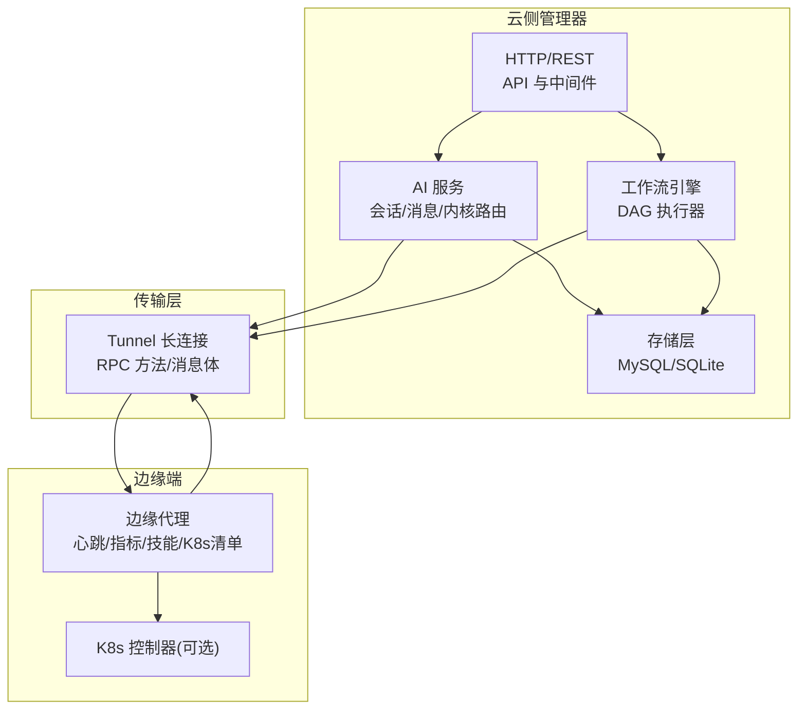
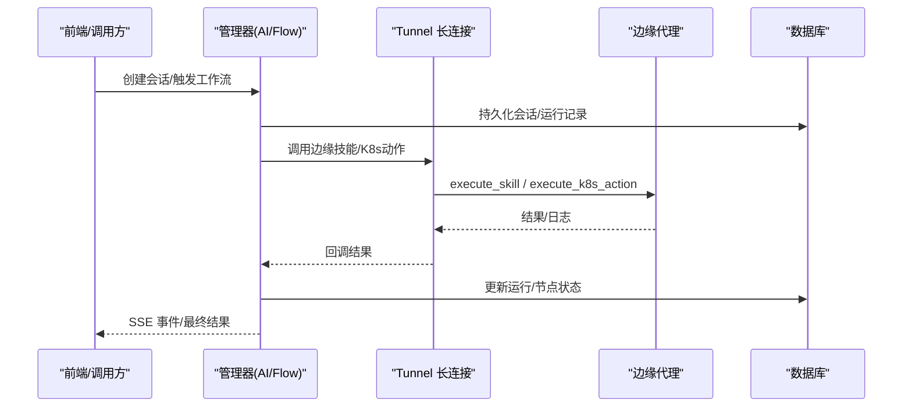
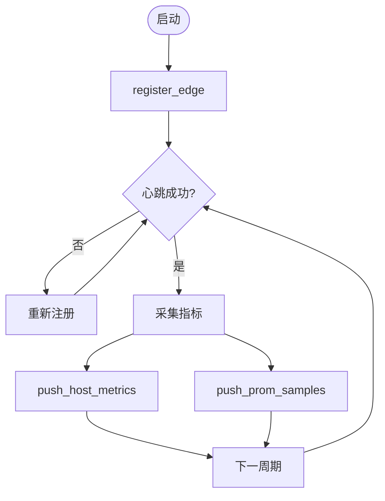
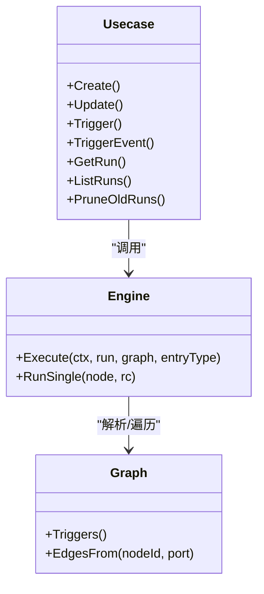
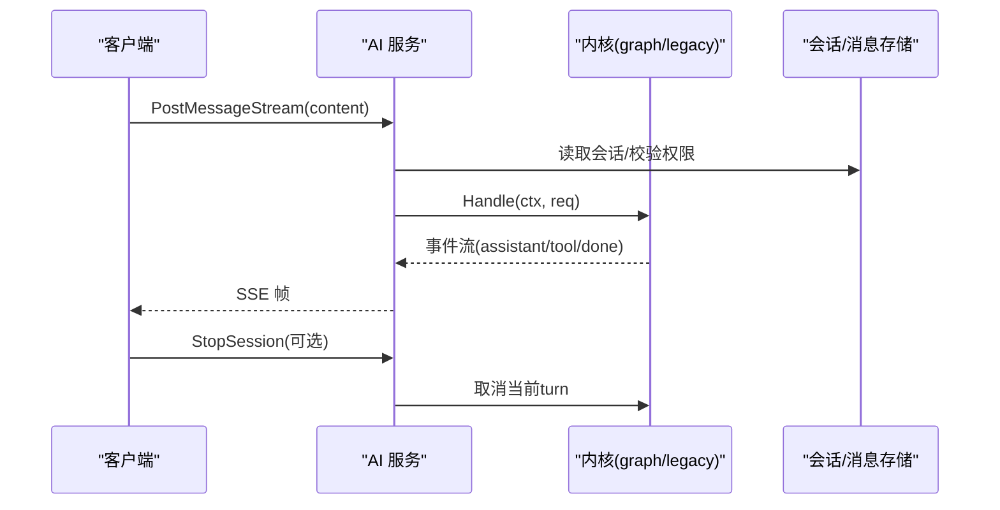
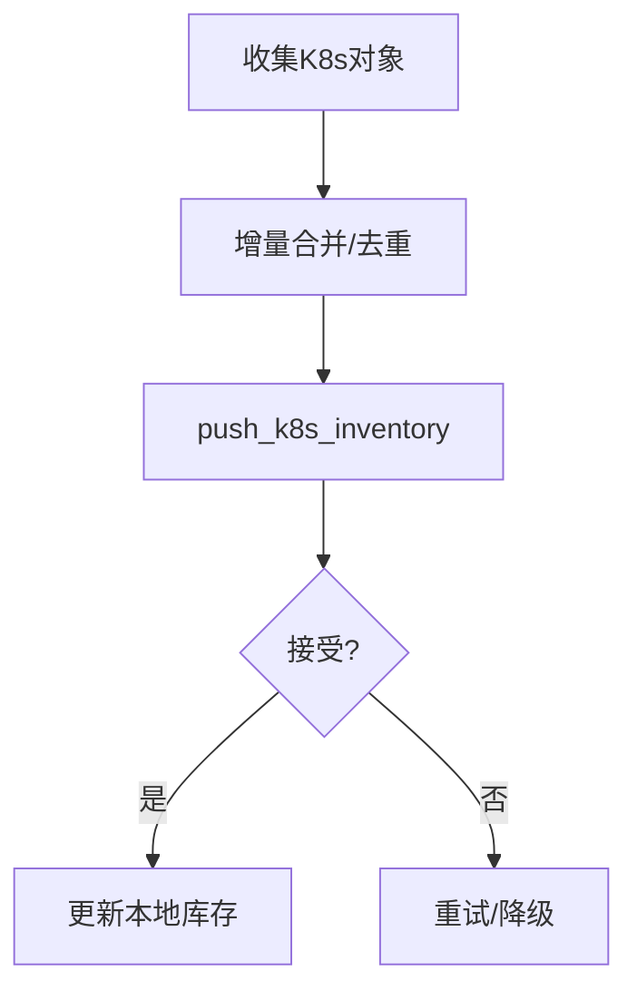
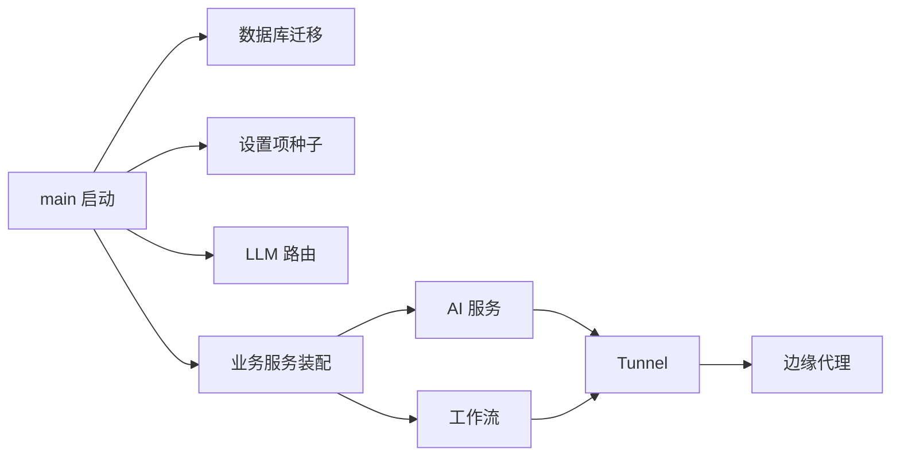

# 业务数据流

<cite>
**本文引用的文件**
- [cmd/ongrid/main.go](file://cmd/ongrid/main.go)
- [internal/pkg/tunnel/messages.go](file://internal/pkg/tunnel/messages.go)
- [internal/edgeagent/biz/agent.go](file://internal/edgeagent/biz/agent.go)
- [internal/manager/biz/flow/engine.go](file://internal/manager/biz/flow/engine.go)
- [internal/manager/biz/flow/usecase.go](file://internal/manager/biz/flow/usecase.go)
- [internal/manager/service/aiops/service.go](file://internal/manager/service/aiops/service.go)
- [internal/manager/data/flow/store/migrate.go](file://internal/manager/data/flow/store/migrate.go)
- [internal/manager/model/audit/log.go](file://internal/manager/model/audit/log.go)
</cite>

## 目录
1. [简介](#简介)
2. [项目结构](#项目结构)
3. [核心组件](#核心组件)
4. [架构总览](#架构总览)
5. [详细组件分析](#详细组件分析)
6. [依赖关系分析](#依赖关系分析)
7. [性能考量](#性能考量)
8. [故障排查指南](#故障排查指南)
9. [结论](#结论)
10. [附录](#附录)

## 简介
本文件面向 Ongrid 的业务数据流，系统性阐述从用户操作到系统响应的完整链路，覆盖 AI Agent 协调、工作流执行与设备状态同步。重点说明事件驱动架构、消息队列机制（基于长连接隧道）、数据一致性保证、版本管理与回滚策略，以及实时同步、增量更新与缓存策略。同时给出审计追踪、权限控制与数据安全保护措施，帮助读者快速理解并安全运维 Ongrid。

## 项目结构
Ongrid 采用“云侧管理器 + 边缘代理”的分层架构：
- 云侧管理器（cmd/ongrid）负责 HTTP API、AI 会话编排、工作流引擎、设备与告警等域服务，并通过前端网关与上游 broker（frontier）建立长连接。
- 边缘代理（internal/edgeagent）负责采集指标、网络发现、Kubernetes 资源清单上报、技能执行与远程升级。
- 内部隧道协议（internal/pkg/tunnel）定义云端与边缘之间的 RPC 方法与消息体，承载心跳、指标推送、K8s 清单、技能执行等。
- 工作流引擎（internal/manager/biz/flow）以 DAG 形式编排节点，支持触发器、条件分支、并发执行与错误处理。
- AI 服务（internal/manager/service/aiops）提供聊天会话与消息流式响应，支持新旧两种内核（legacy/graph），统一对外 DTO。

图表来源
- [cmd/ongrid/main.go:208-300](file://cmd/ongrid/main.go#L208-L300)
- [internal/pkg/tunnel/messages.go:18-96](file://internal/pkg/tunnel/messages.go#L18-L96)
- [internal/edgeagent/biz/agent.go:186-271](file://internal/edgeagent/biz/agent.go#L186-L271)
- [internal/manager/biz/flow/engine.go:59-113](file://internal/manager/biz/flow/engine.go#L59-L113)
- [internal/manager/service/aiops/service.go:338-380](file://internal/manager/service/aiops/service.go#L338-L380)

章节来源
- [cmd/ongrid/main.go:208-300](file://cmd/ongrid/main.go#L208-L300)
- [internal/pkg/tunnel/messages.go:18-96](file://internal/pkg/tunnel/messages.go#L18-L96)

## 核心组件
- 边缘代理（Edge Agent）：负责注册、心跳、指标推送、网络发现、技能执行、远程升级与健康标记。
- 隧道协议（Tunnel）：定义云端与边缘的 RPC 方法与消息体，包括 register_edge、heartbeat、push_host_metrics、push_prom_samples、execute_skill、push_k8s_inventory 等。
- 工作流引擎（Flow Engine）：解析图、选择触发器、并发执行节点、记录运行与节点结果、错误分支与 OR-join。
- AI 服务（AI Ops Service）：会话管理、消息发送、SSE 流式输出、内核切换（legacy/graph）、权限与租户上下文传递。
- 存储与迁移（Store & Migration）：流程定义与运行记录持久化、历史清理、旧版 IM 通知工具迁移。
- 审计日志（Audit Log）：不可变追加型审计表，记录关键动作与状态。

章节来源
- [internal/edgeagent/biz/agent.go:94-123](file://internal/edgeagent/biz/agent.go#L94-L123)
- [internal/pkg/tunnel/messages.go:18-96](file://internal/pkg/tunnel/messages.go#L18-L96)
- [internal/manager/biz/flow/engine.go:34-47](file://internal/manager/biz/flow/engine.go#L34-L47)
- [internal/manager/service/aiops/service.go:73-123](file://internal/manager/service/aiops/service.go#L73-L123)
- [internal/manager/data/flow/store/migrate.go:13-53](file://internal/manager/data/flow/store/migrate.go#L13-L53)
- [internal/manager/model/audit/log.go:49-76](file://internal/manager/model/audit/log.go#L49-L76)

## 架构总览
Ongrid 采用事件驱动与长连接双向通信：
- 边缘主动发起 register_edge 获取 edge_id，随后周期性 heartbeat 维持在线状态。
- 指标通过 push_host_metrics（快速路径）与 push_prom_samples（开放集合）两条通道上报。
- 工作流由触发器启动，引擎按边调度节点，支持并发与错误分支。
- AI 会话通过 SSE 流式返回，支持中断与内核切换。
- 所有变更写入数据库，工作流运行与节点执行均落库，便于追溯与回放。

图表来源
- [internal/manager/service/aiops/service.go:338-380](file://internal/manager/service/aiops/service.go#L338-L380)
- [internal/manager/biz/flow/usecase.go:307-343](file://internal/manager/biz/flow/usecase.go#L307-L343)
- [internal/pkg/tunnel/messages.go:243-256](file://internal/pkg/tunnel/messages.go#L243-L256)
- [internal/pkg/tunnel/messages.go:726-795](file://internal/pkg/tunnel/messages.go#L726-L795)

## 详细组件分析

### 边缘代理：设备状态同步与实时数据上报
- 生命周期：注册（register_edge）→ 心跳（heartbeat）→ 指标推送（push_host_metrics/push_prom_samples）→ 网络发现（push_network_discovery）。
- 健康标记：成功注册后写入 healthy_marker，用于升级回滚判定。
- 技能执行：统一通过 execute_skill 分发，内置能力（如抓包）与通用技能框架结合。
- 升级流程：fetch_package → apply_package → 进程退出 → systemd 原子替换 → 下次注册上报新版本。

图表来源
- [internal/edgeagent/biz/agent.go:186-271](file://internal/edgeagent/biz/agent.go#L186-L271)
- [internal/edgeagent/biz/agent.go:530-602](file://internal/edgeagent/biz/agent.go#L530-L602)
- [internal/edgeagent/biz/agent.go:608-693](file://internal/edgeagent/biz/agent.go#L608-L693)
- [internal/pkg/tunnel/messages.go:21-96](file://internal/pkg/tunnel/messages.go#L21-L96)

章节来源
- [internal/edgeagent/biz/agent.go:186-271](file://internal/edgeagent/biz/agent.go#L186-L271)
- [internal/edgeagent/biz/agent.go:530-602](file://internal/edgeagent/biz/agent.go#L530-L602)
- [internal/edgeagent/biz/agent.go:608-693](file://internal/edgeagent/biz/agent.go#L608-L693)
- [internal/pkg/tunnel/messages.go:21-96](file://internal/pkg/tunnel/messages.go#L21-L96)

### 工作流引擎：DAG 执行与版本管理
- 触发器：支持手动触发与事件触发（如告警），入口类型限定匹配。
- 执行模型：OR-join + execute-once，节点并发受上限限制，错误可路由至 error 端口。
- 版本管理：工作流定义包含 version 字段，更新图时递增；运行记录保存 flow_version 以便回溯。
- 历史清理：定期 PruneOldRuns 清理过期运行记录，避免膨胀。
- 旧版兼容：启动时迁移遗留 IM 通知工具节点，确保升级后行为一致。

图表来源
- [internal/manager/biz/flow/usecase.go:84-139](file://internal/manager/biz/flow/usecase.go#L84-L139)
- [internal/manager/biz/flow/usecase.go:264-343](file://internal/manager/biz/flow/usecase.go#L264-L343)
- [internal/manager/biz/flow/engine.go:59-113](file://internal/manager/biz/flow/engine.go#L59-L113)
- [internal/manager/data/flow/store/migrate.go:24-53](file://internal/manager/data/flow/store/migrate.go#L24-L53)

章节来源
- [internal/manager/biz/flow/usecase.go:84-139](file://internal/manager/biz/flow/usecase.go#L84-L139)
- [internal/manager/biz/flow/usecase.go:264-343](file://internal/manager/biz/flow/usecase.go#L264-L343)
- [internal/manager/biz/flow/engine.go:59-113](file://internal/manager/biz/flow/engine.go#L59-L113)
- [internal/manager/data/flow/store/migrate.go:24-53](file://internal/manager/data/flow/store/migrate.go#L24-L53)

### AI Agent 协调：内核切换与会话流式处理
- 内核选择：默认 graph 内核，可通过环境变量回退至 legacy；两者对外 DTO 一致。
- 会话管理：创建/查询/删除会话，所有权校验，管理员可绕过。
- 流式输出：SSE 事件逐阶段发射（assistant/tool/done/approval），支持用户中断（StopSession）。
- 上下文隔离：使用 withoutCancel 使 turn 不受请求断开影响，但保留显式取消以支持停止。

图表来源
- [internal/manager/service/aiops/service.go:338-380](file://internal/manager/service/aiops/service.go#L338-L380)
- [internal/manager/service/aiops/service.go:438-471](file://internal/manager/service/aiops/service.go#L438-L471)
- [internal/manager/service/aiops/service.go:406-425](file://internal/manager/service/aiops/service.go#L406-L425)

章节来源
- [internal/manager/service/aiops/service.go:338-380](file://internal/manager/service/aiops/service.go#L338-L380)
- [internal/manager/service/aiops/service.go:438-471](file://internal/manager/service/aiops/service.go#L438-L471)
- [internal/manager/service/aiops/service.go:406-425](file://internal/manager/service/aiops/service.go#L406-L425)

### 设备状态同步与 Kubernetes 清单
- 心跳与在线状态：心跳失败会尝试重新注册，连续失败达到阈值视为隧道卡死。
- K8s 清单上报：controller 模式上报节点/工作负载/Pod/事件快照，支持增量合并与去重。
- 资源描述与日志：describe_k8s_resource 只读读取对象，query_k8s_logs 拉取 Pod 日志作为排障补充。
- 写操作保护：execute_k8s_action 为写操作，需审批（ReviewGate）与预检查（resourceVersion 冲突保护）。

图表来源
- [internal/pkg/tunnel/messages.go:524-653](file://internal/pkg/tunnel/messages.go#L524-L653)
- [internal/pkg/tunnel/messages.go:656-795](file://internal/pkg/tunnel/messages.go#L656-L795)

章节来源
- [internal/pkg/tunnel/messages.go:524-653](file://internal/pkg/tunnel/messages.go#L524-L653)
- [internal/pkg/tunnel/messages.go:656-795](file://internal/pkg/tunnel/messages.go#L656-L795)

## 依赖关系分析
- 管理器启动顺序：配置加载 → 数据库迁移 → 设置项种子 → LLM 客户端与多提供商路由 → 各业务域服务装配 → HTTP 路由与中间件。
- 工作流与 AI 服务：工作流通过节点调用工具/Agent/AI；AI 服务通过内核路由到具体实现，二者共享存储与审计。
- 边缘与云端：通过 tunnel 长连接进行双向通信，心跳与指标为高频路径，技能与 K8s 操作为低频高价值路径。

图表来源
- [cmd/ongrid/main.go:208-300](file://cmd/ongrid/main.go#L208-L300)
- [cmd/ongrid/main.go:429-518](file://cmd/ongrid/main.go#L429-L518)
- [cmd/ongrid/main.go:574-772](file://cmd/ongrid/main.go#L574-L772)

章节来源
- [cmd/ongrid/main.go:208-300](file://cmd/ongrid/main.go#L208-L300)
- [cmd/ongrid/main.go:429-518](file://cmd/ongrid/main.go#L429-L518)
- [cmd/ongrid/main.go:574-772](file://cmd/ongrid/main.go#L574-L772)

## 性能考量
- 指标上报双通道：push_host_metrics 用于快速路径（主机级聚合点），push_prom_samples 用于开放集合指标（Prometheus remote_write 友好）。
- 并发控制：工作流引擎限制最大并发节点数，防止图过宽导致资源耗尽。
- 上下文隔离：AI turn 脱离 HTTP 请求上下文，避免客户端断开导致任务中断；通过显式取消支持用户停止。
- 历史清理：工作流运行记录按保留天数清理，降低存储压力。
- 插件健康：心跳携带插件健康信息，便于快速定位异常子进程。

[本节为通用指导，不直接分析具体文件]

## 故障排查指南
- 心跳失败与隧道卡死：连续失败超过阈值将报告隧道卡死；建议检查网络与 broker 路由，必要时重启管理器或边缘。
- 工作流失败：查看 FlowRun 与 FlowRunNode 的输入/输出 JSON 与错误信息；确认触发器类型与图配置是否匹配。
- AI 会话中断：若出现长时间等待（如人工审批），可使用 StopSession 中断；检查内核配置与运行时依赖。
- 升级回滚：边缘健康标记未写入或版本不匹配时，安装脚本会自动回滚到上一版本；检查 stage 目录与权限。
- 审计追踪：通过审计日志过滤 action/resource/status，定位变更来源与结果。

章节来源
- [internal/edgeagent/biz/agent.go:530-602](file://internal/edgeagent/biz/agent.go#L530-L602)
- [internal/manager/biz/flow/usecase.go:307-343](file://internal/manager/biz/flow/usecase.go#L307-L343)
- [internal/manager/service/aiops/service.go:406-425](file://internal/manager/service/aiops/service.go#L406-L425)
- [internal/manager/model/audit/log.go:49-76](file://internal/manager/model/audit/log.go#L49-L76)

## 结论
Ongrid 通过事件驱动与长连接隧道实现了云边协同的高效数据流：边缘稳定上报设备状态与指标，管理器以工作流与 AI 内核编排复杂任务，并以严格的版本管理与审计保障数据一致性与可追溯性。建议在部署中关注心跳与指标通道的稳定性、工作流的并发与错误分支设计、AI 会话的中断与内核切换策略，以及升级回滚的健康标记机制。

[本节为总结性内容，不直接分析具体文件]

## 附录
- 版本管理与回滚策略
  - 工作流定义 version 递增，运行记录保存 flow_version，便于回溯与对比。
  - 边缘升级通过 fetch_package/apply_package 原子替换，healthy_marker 验证健康度，失败自动回滚。
- 实时同步与增量更新
  - K8s 清单上报支持增量合并与去重，减少重复数据。
  - 指标上报区分快速路径与开放集合路径，兼顾低延迟与可扩展性。
- 缓存策略
  - 设置项（LLM/监控等）采用短期缓存（如 60s），管理员修改后可快速生效而无需重启。
- 审计追踪、权限控制与数据安全
  - 审计日志不可变追加，记录关键动作与状态，支持过滤与详情查看。
  - 权限控制通过 IAM/RBAC 与中间件实现，敏感操作需审批（ReviewGate）。
  - 数据传输通过隧道加密与鉴权，密钥与凭证在边缘侧最小化暴露。

[本节为概念性内容，不直接分析具体文件]