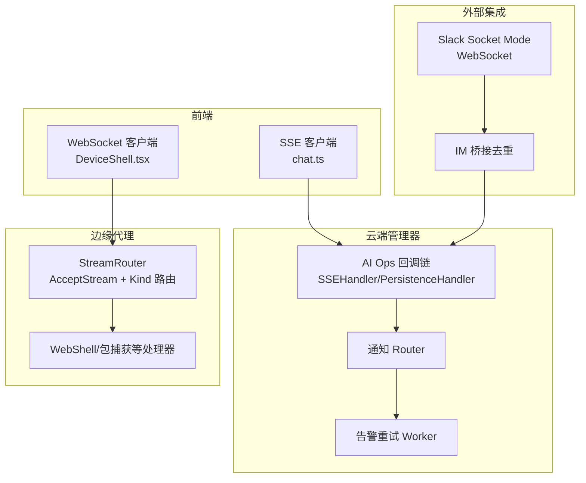
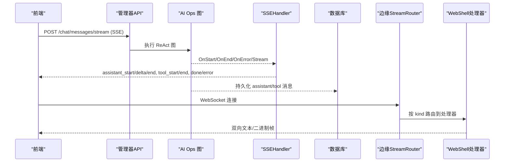
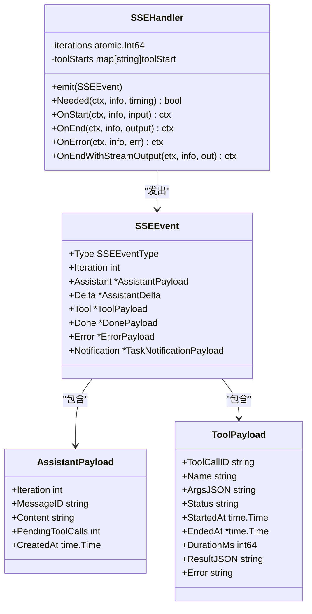
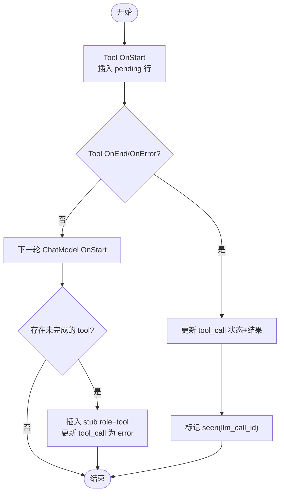
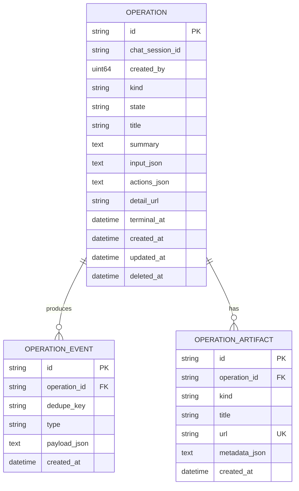
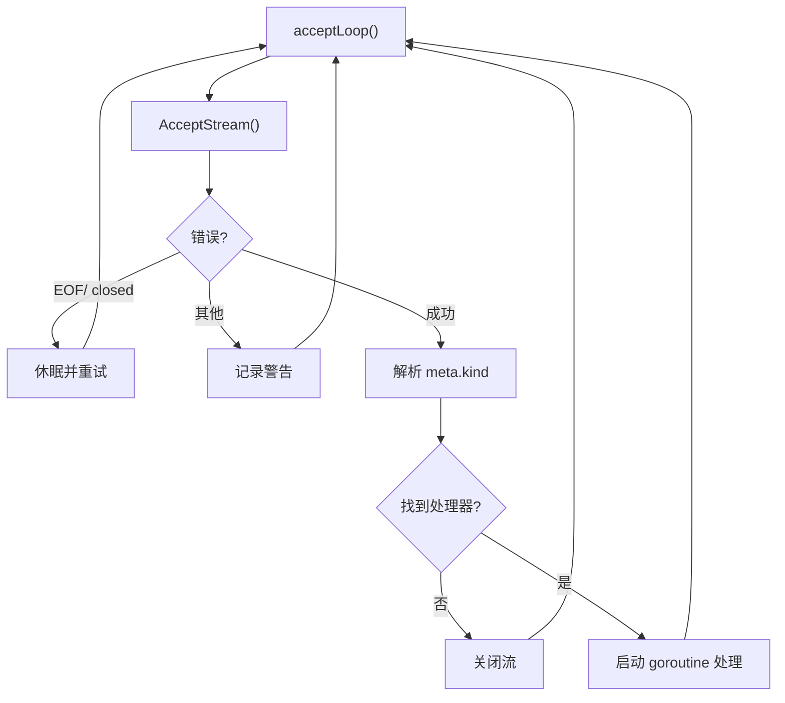
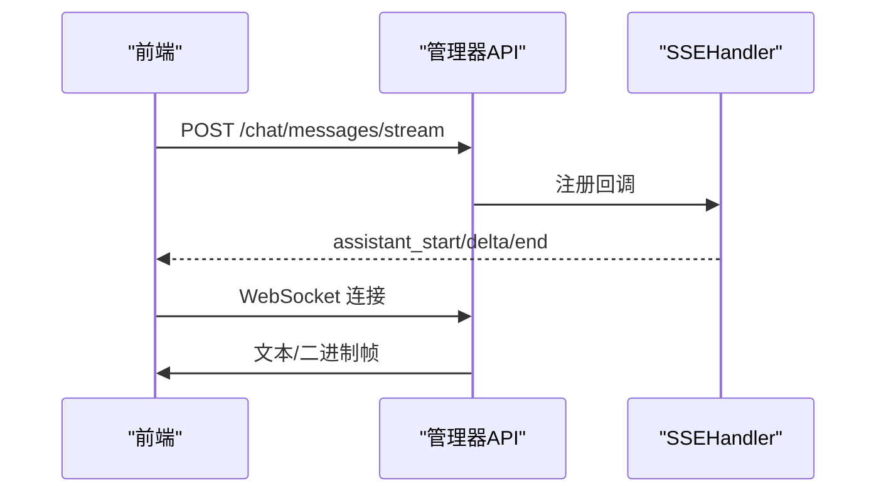
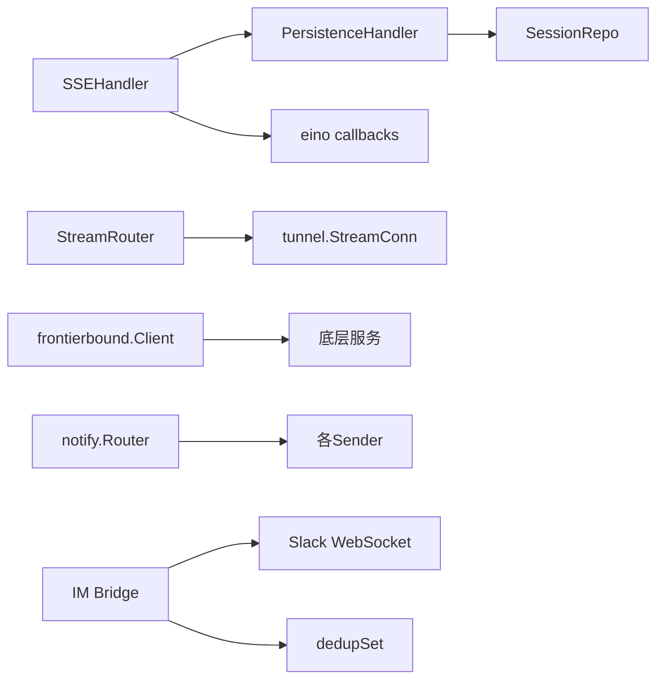

# 事件驱动架构

<cite>
**本文引用的文件**
- [sse.go](file://internal/manager/biz/aiops/graph/callbacks/sse.go)
- [persistence.go](file://internal/manager/biz/aiops/graph/callbacks/persistence.go)
- [operation.go](file://internal/manager/model/aiops/operation.go)
- [router.go](file://internal/edgeagent/streamrouter/router.go)
- [client.go](file://internal/manager/service/frontierbound/client.go)
- [http.go](file://internal/manager/server/operatorrun/http.go)
- [webshell http.go](file://internal/manager/server/webshell/http.go)
- [chat.ts](file://web/src/api/chat.ts)
- [DeviceShell.tsx](file://web/src/pages/DeviceShell.tsx)
- [notify.go](file://internal/pkg/notify/notify.go)
- [bridge.go](file://internal/manager/biz/imbridge/bridge.go)
- [dedup.go](file://internal/manager/biz/imbridge/dedup.go)
- [slack stream.go](file://internal/manager/biz/imbridge/provider/slack/stream.go)
- [retry.go](file://internal/manager/biz/alert/retry.go)
- [model alert model.go](file://internal/manager/model/alert/model.go)
</cite>

## 目录
1. [简介](#简介)
2. [项目结构](#项目结构)
3. [核心组件](#核心组件)
4. [架构总览](#架构总览)
5. [详细组件分析](#详细组件分析)
6. [依赖关系分析](#依赖关系分析)
7. [性能考虑](#性能考虑)
8. [故障排查指南](#故障排查指南)
9. [结论](#结论)
10. [附录](#附录)

## 简介
本文件面向事件驱动架构的设计与实现，覆盖事件模型、消息格式、传输协议、发布订阅与路由、消费者管理、实时通信（SSE/WebSocket/gRPC 流）、事件持久化与重放、顺序保证、幂等去重与错误处理策略，并提供编程示例与调试方法。代码基于仓库中的 AI Ops 回调链、边缘流路由、通知通道、IM 桥接与告警重试等模块综合整理。

## 项目结构
- 事件生成与流转：AI Ops 的 eino 回调链将 ChatModel/Tool 的生命周期转换为 SSE 事件，并持久化为会话消息与工具调用记录。
- 边缘侧流分发：边缘端通过统一的 AcceptStream 循环按 kind 路由到具体处理器，支撑 WebShell、包捕获等长连接场景。
- 跨进程/跨边界的流与 RPC：frontierbound 提供 OpenStreamWithMeta 能力，用于在云边之间建立带元数据的流通道。
- 通知与告警：统一通知 Router 聚合多通道发送；告警投递具备重试与退避机制。
- IM 桥接：Slack/Telegram/飞书等外部平台事件经 WebSocket/长轮询接入，进行去重后进入系统。
- 前端实时：Web 端通过 SSE 获取 AI 对话增量输出；通过 WebSocket 与后端交互终端会话。

**图表来源**
- [sse.go:16-50](file://internal/manager/biz/aiops/graph/callbacks/sse.go#L16-L50)
- [persistence.go:68-110](file://internal/manager/biz/aiops/graph/callbacks/persistence.go#L68-L110)
- [router.go:22-66](file://internal/edgeagent/streamrouter/router.go#L22-L66)
- [slack stream.go:18-34](file://internal/manager/biz/imbridge/provider/slack/stream.go#L18-L34)
- [chat.ts:247-280](file://web/src/api/chat.ts#L247-L280)
- [DeviceShell.tsx:190-305](file://web/src/pages/DeviceShell.tsx#L190-L305)

**章节来源**
- [sse.go:16-50](file://internal/manager/biz/aiops/graph/callbacks/sse.go#L16-L50)
- [router.go:22-66](file://internal/edgeagent/streamrouter/router.go#L22-L66)
- [chat.ts:247-280](file://web/src/api/chat.ts#L247-L280)
- [DeviceShell.tsx:190-305](file://web/src/pages/DeviceShell.tsx#L190-L305)

## 核心组件
- SSE 事件模型与处理器：定义 assistant_start/delta/end、tool_start/end、done/error/task_notification 等事件类型，将 eino 回调映射为可序列化的 SSEEvent。
- 持久化处理器：将 assistant/tool 生命周期写入数据库，维护 tool_call 关联、批处理自动修复（autoheal）与审计指标。
- 操作与事件模型：Operation/OperationEvent/OperationArtifact 表示可取消、可追踪的长任务及其不可变事实。
- 边缘流路由器：单循环 AcceptStream，按 meta.kind 分派到处理器，支持 panic 保护与降级。
- 通知路由：统一 Message 抽象，支持多通道（Webhook/Slack/飞书/钉钉），超时与默认通道配置。
- IM 桥接与去重：Slack WebSocket envelope 接收、ACK、事件转发；进程级 dedupSet 避免重复处理。
- 告警重试：失败投递的周期性重试，带最大尝试次数与指数退避。

**章节来源**
- [sse.go:16-147](file://internal/manager/biz/aiops/graph/callbacks/sse.go#L16-L147)
- [persistence.go:68-110](file://internal/manager/biz/aiops/graph/callbacks/persistence.go#L68-L110)
- [operation.go:20-80](file://internal/manager/model/aiops/operation.go#L20-L80)
- [router.go:22-66](file://internal/edgeagent/streamrouter/router.go#L22-L66)
- [notify.go:22-45](file://internal/pkg/notify/notify.go#L22-L45)
- [bridge.go:124-157](file://internal/manager/biz/imbridge/bridge.go#L124-L157)
- [dedup.go:5-53](file://internal/manager/biz/imbridge/dedup.go#L5-L53)
- [retry.go:45-92](file://internal/manager/biz/alert/retry.go#L45-L92)

## 架构总览
事件从 AI Ops 图执行中产生，经 SSE 推送至前端；同时持久化为会话消息与工具调用。边缘侧通过 StreamRouter 接收来自前端的长连接请求，按 kind 路由到对应处理器（如 WebShell）。外部 IM 平台通过 WebSocket 接入，经去重后进入系统。通知与告警作为事件消费方，分别通过 Router 与 RetryWorker 完成投递与重试。

**图表来源**
- [sse.go:149-188](file://internal/manager/biz/aiops/graph/callbacks/sse.go#L149-L188)
- [persistence.go:280-371](file://internal/manager/biz/aiops/graph/callbacks/persistence.go#L280-L371)
- [router.go:30-66](file://internal/edgeagent/streamrouter/router.go#L30-L66)
- [webshell http.go:597-640](file://internal/manager/server/webshell/http.go#L597-L640)

## 详细组件分析

### SSE 事件模型与处理器
- 事件类型：assistant_start、assistant_delta、assistant_end、tool_start、tool_end、done、error、task_notification。
- 载荷结构：AssistantPayload/Delta、ToolPayload、DonePayload、ErrorPayload、TaskNotificationPayload。
- 并发与顺序：迭代计数使用原子变量；工具并行时 start/end 可能交错，但 assistant_start 序列一致。
- 流式输出：drainStream 将 ChatModel 的流式输出拆分为 assistant_delta 帧，非阻塞 emit。

**图表来源**
- [sse.go:16-147](file://internal/manager/biz/aiops/graph/callbacks/sse.go#L16-L147)
- [sse.go:172-188](file://internal/manager/biz/aiops/graph/callbacks/sse.go#L172-L188)

**章节来源**
- [sse.go:16-147](file://internal/manager/biz/aiops/graph/callbacks/sse.go#L16-L147)
- [sse.go:172-188](file://internal/manager/biz/aiops/graph/callbacks/sse.go#L172-L188)
- [sse.go:397-440](file://internal/manager/biz/aiops/graph/callbacks/sse.go#L397-L440)

### 事件持久化与自动修复
- 写入时机：ChatModel OnStart/OnEnd 写 assistant 消息；Tool OnStart/OnEnd/OnError 写 tool_call 与 role=tool 消息。
- 关联关系：通过 lastAssistantID 与 pendingLLMCalls FIFO 将 tool_call 与 LLM 分配的 call_id 正确配对。
- 自动修复：flushIncompleteBatch 在下一轮 ChatModel OnStart 或 FinalizeBatch 时，为缺失的 tool response 插入 stub 行，确保回放信封有效。
- 可观测性：记录 persist_errors_total 与 chat_tool_response_loss_total。

**图表来源**
- [persistence.go:280-371](file://internal/manager/biz/aiops/graph/callbacks/persistence.go#L280-L371)
- [persistence.go:590-662](file://internal/manager/biz/aiops/graph/callbacks/persistence.go#L590-L662)
- [persistence.go:680-707](file://internal/manager/biz/aiops/graph/callbacks/persistence.go#L680-L707)

**章节来源**
- [persistence.go:68-110](file://internal/manager/biz/aiops/graph/callbacks/persistence.go#L68-L110)
- [persistence.go:280-371](file://internal/manager/biz/aiops/graph/callbacks/persistence.go#L280-L371)
- [persistence.go:590-662](file://internal/manager/biz/aiops/graph/callbacks/persistence.go#L590-L662)

### 操作与事件模型（Operation/OperationEvent）
- Operation：可取消、可追踪的长任务，包含输入、动作、详情链接与终态时间。
- OperationEvent：追加型、幂等的事实表，通过 operation_id + dedupe_key 唯一索引保障幂等。
- OperationArtifact：长任务产物（报告、页面、链接等），唯一 URL 约束。

**图表来源**
- [operation.go:20-80](file://internal/manager/model/aiops/operation.go#L20-L80)

**章节来源**
- [operation.go:20-80](file://internal/manager/model/aiops/operation.go#L20-L80)

### 边缘流路由与消费者管理
- AcceptStream 循环：持续接受流，解析 meta.kind 选择处理器，无匹配则关闭流。
- 容错：对 EOF/closed/not dialed 等错误进行休眠重试；panic 捕获并记录堆栈。
- 消费者：每个 handler 在独立 goroutine 中运行，互不干扰。

**图表来源**
- [router.go:30-66](file://internal/edgeagent/streamrouter/router.go#L30-L66)

**章节来源**
- [router.go:22-66](file://internal/edgeagent/streamrouter/router.go#L22-L66)

### 实时通信：SSE、WebSocket、gRPC 流
- SSE：前端通过 fetch 发起 /api/v1/chat/sessions/{id}/messages/stream，服务端以 event:/data: 格式推送 token 级增量。
- WebSocket：WebShell 通过 WS 与后端交换文本/二进制帧，支持 close 语义与退出码。
- gRPC 流：frontierbound 提供 OpenStreamWithMeta，用于云边间带元数据的流通道（可用于自定义事件流）。

**图表来源**
- [chat.ts:247-280](file://web/src/api/chat.ts#L247-L280)
- [http.go:210-224](file://internal/manager/server/operatorrun/http.go#L210-L224)
- [webshell http.go:597-640](file://internal/manager/server/webshell/http.go#L597-L640)
- [client.go:254-274](file://internal/manager/service/frontierbound/client.go#L254-L274)

**章节来源**
- [chat.ts:247-280](file://web/src/api/chat.ts#L247-L280)
- [http.go:210-224](file://internal/manager/server/operatorrun/http.go#L210-L224)
- [webshell http.go:597-640](file://internal/manager/server/webshell/http.go#L597-L640)
- [client.go:254-274](file://internal/manager/service/frontierbound/client.go#L254-L274)

### 事件持久化、重放与顺序保证
- 顺序保证：assistant 迭代计数原子递增；tool_call 与 LLM call_id 通过 FIFO 与上下文 seam 配对，避免乱序导致回放失败。
- 重放：role=tool 消息携带 tool_call_id，使下一次 LLM 调用能正确消费历史；若丢失，autoheal 注入 stub 保持信封合法。
- 清理：K8s 事件清理逻辑（按 TTL/容量限制删除最旧事件）保障存储可控。

**章节来源**
- [persistence.go:516-543](file://internal/manager/biz/aiops/graph/callbacks/persistence.go#L516-L543)
- [persistence.go:590-662](file://internal/manager/biz/aiops/graph/callbacks/persistence.go#L590-L662)
- [k8s usecase_test.go:1894-1915](file://internal/manager/biz/k8s/usecase_test.go#L1894-L1915)

### 幂等性、去重与错误处理
- 幂等：OperationEvent 使用复合唯一索引（operation_id + dedupe_key）防止重复写入。
- 去重：IM 桥接进程级 dedupSet 缓存最近事件键，避免重连导致的重复处理。
- 错误处理：
  - SSE：tool_error/timeout 状态区分；顶层错误发送 error 帧。
  - 通知：Router 支持超时、默认通道、禁用开关；未知通道报错。
  - 告警：RetryWorker 周期性重试，带最大尝试次数与退避；通道禁用时停止重试。

**章节来源**
- [operation.go:49-66](file://internal/manager/model/aiops/operation.go#L49-L66)
- [dedup.go:5-53](file://internal/manager/biz/imbridge/dedup.go#L5-L53)
- [bridge.go:124-157](file://internal/manager/biz/imbridge/bridge.go#L124-L157)
- [notify.go:92-130](file://internal/pkg/notify/notify.go#L92-L130)
- [retry.go:45-92](file://internal/manager/biz/alert/retry.go#L45-L92)

### 编程示例与调试工具
- SSE 示例：前端调用 streamMessage，设置 Accept: text/event-stream，逐帧渲染 assistant_delta。
- WebSocket 示例：DeviceShell 打开 WS，处理 open/close/exit 帧，错误时提示“WebSocket 连接错误”。
- 调试建议：
  - 观察 SSE 事件类型与载荷，确认 assistant/tool 生命周期完整。
  - 检查 persistence 指标 ongird_persist_errors_total 与 ongird_chat_tool_response_loss_total。
  - 查看通知 Router 的 ChannelNames 与日志，定位通道配置问题。
  - 使用告警重试日志与 delivery 状态，诊断投递失败原因。

**章节来源**
- [chat.ts:247-280](file://web/src/api/chat.ts#L247-L280)
- [DeviceShell.tsx:190-305](file://web/src/pages/DeviceShell.tsx#L190-L305)
- [notify.go:158-169](file://internal/pkg/notify/notify.go#L158-L169)
- [retry.go:75-92](file://internal/manager/biz/alert/retry.go#L75-L92)

## 依赖关系分析
- SSEHandler 依赖 eino 回调接口，并通过 PersistenceHandler 共享 assistant ID。
- PersistenceHandler 依赖 SessionRepo 与可选 Registerer（Prometheus）。
- StreamRouter 依赖 tunnel.StreamConn 与 handlers 映射。
- frontierbound Client 依赖底层服务实现，支持 OpenStreamWithMeta。
- notify.Router 依赖各 Sender 实现（Webhook/Slack/飞书/钉钉）。
- IM Bridge 依赖 Slack WebSocket 与 dedupSet。

**图表来源**
- [sse.go:149-188](file://internal/manager/biz/aiops/graph/callbacks/sse.go#L149-L188)
- [persistence.go:36-53](file://internal/manager/biz/aiops/graph/callbacks/persistence.go#L36-L53)
- [router.go:16-28](file://internal/edgeagent/streamrouter/router.go#L16-L28)
- [client.go:254-274](file://internal/manager/service/frontierbound/client.go#L254-L274)
- [notify.go:33-45](file://internal/pkg/notify/notify.go#L33-L45)
- [slack stream.go:18-34](file://internal/manager/biz/imbridge/provider/slack/stream.go#L18-L34)
- [dedup.go:5-53](file://internal/manager/biz/imbridge/dedup.go#L5-L53)

**章节来源**
- [sse.go:149-188](file://internal/manager/biz/aiops/graph/callbacks/sse.go#L149-L188)
- [persistence.go:36-53](file://internal/manager/biz/aiops/graph/callbacks/persistence.go#L36-L53)
- [router.go:16-28](file://internal/edgeagent/streamrouter/router.go#L16-L28)
- [client.go:254-274](file://internal/manager/service/frontierbound/client.go#L254-L274)
- [notify.go:33-45](file://internal/pkg/notify/notify.go#L33-L45)
- [slack stream.go:18-34](file://internal/manager/biz/imbridge/provider/slack/stream.go#L18-L34)
- [dedup.go:5-53](file://internal/manager/biz/imbridge/dedup.go#L5-L53)

## 性能考虑
- SSE 非阻塞 emit：避免慢消费者阻塞图执行；HTTP flush 串行化保证帧顺序。
- 流式输出 drain：异步读取 ChatModel 流，及时释放资源。
- 边缘路由：单循环 accept，goroutine 隔离处理器，panic 保护不影响主循环。
- 通知超时：Router 为每个通道设置超时，避免阻塞。
- 告警重试：批量拉取、分页限制（200），退避控制频率。

[本节为通用指导，无需特定文件来源]

## 故障排查指南
- SSE 异常：检查 assistant_end 是否缺失 tool 结果；查看 autoheal 日志与 loss 指标。
- 工具调用丢失：核对 tool_call_id 与 llm_call_id 配对；确认 ToolsNode 回调传播。
- 通知失败：确认通道已启用且配置正确；查看 Router 错误拼接信息。
- 告警未送达：检查 Delivery 状态与 AttemptCount；确认通道禁用与退避策略。
- IM 重复消息：验证 dedupSet 容量与重连行为；关注 envelope_id 与 ack 时序。

**章节来源**
- [persistence.go:590-662](file://internal/manager/biz/aiops/graph/callbacks/persistence.go#L590-L662)
- [notify.go:92-130](file://internal/pkg/notify/notify.go#L92-L130)
- [retry.go:75-92](file://internal/manager/biz/alert/retry.go#L75-L92)
- [slack stream.go:162-179](file://internal/manager/biz/imbridge/provider/slack/stream.go#L162-L179)
- [dedup.go:5-53](file://internal/manager/biz/imbridge/dedup.go#L5-L53)

## 结论
本架构通过 eino 回调链将 AI 执行过程转化为结构化事件，结合 SSE 实时推送与数据库持久化，形成可观测、可重放的闭环。边缘流路由与 IM 桥接扩展了事件来源与消费面，通知与告警重试保障了可靠性。幂等与去重机制提升了鲁棒性，配合完善的指标与日志便于排障与优化。

[本节为总结，无需特定文件来源]

## 附录
- 数据模型参考：
  - 告警事件：alert_events（含 incident_id、event_type、status_after、severity、snapshot_json 等）
  - 通知消息：notify.Message（subject/body/severity/source/dedupe_key/labels/occurred_at）

**章节来源**
- [model alert model.go:253-274](file://internal/manager/model/alert/model.go#L253-L274)
- [notify.go:22-31](file://internal/pkg/notify/notify.go#L22-L31)