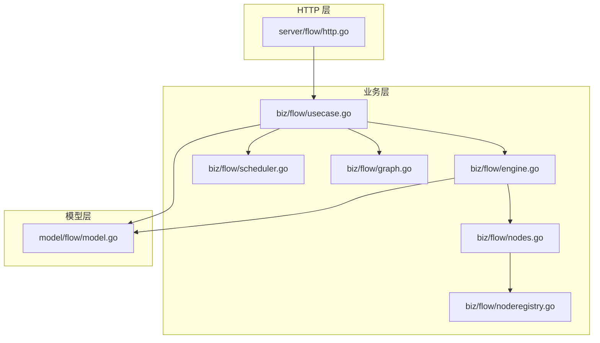
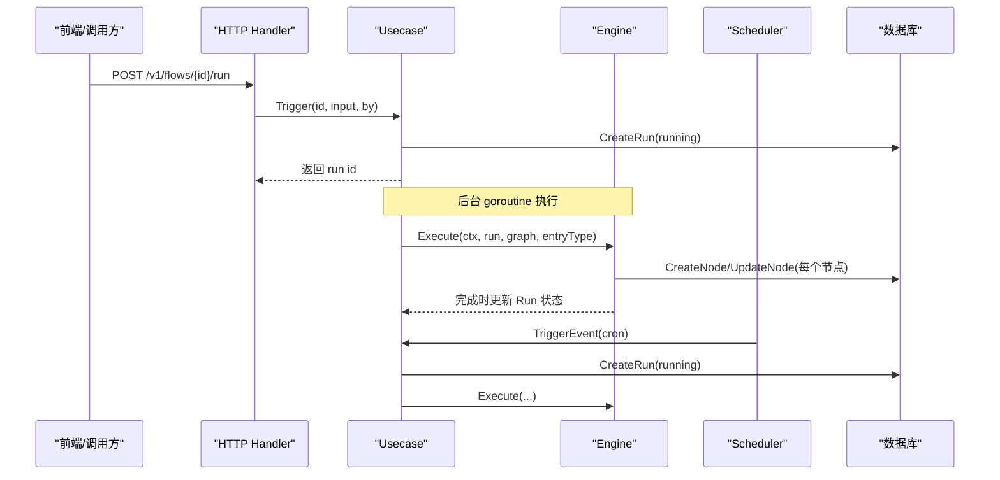
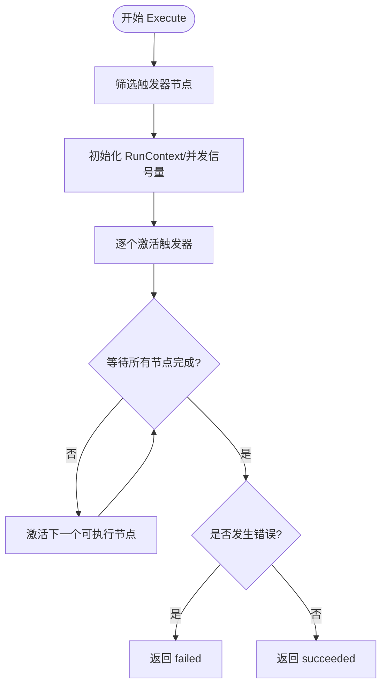
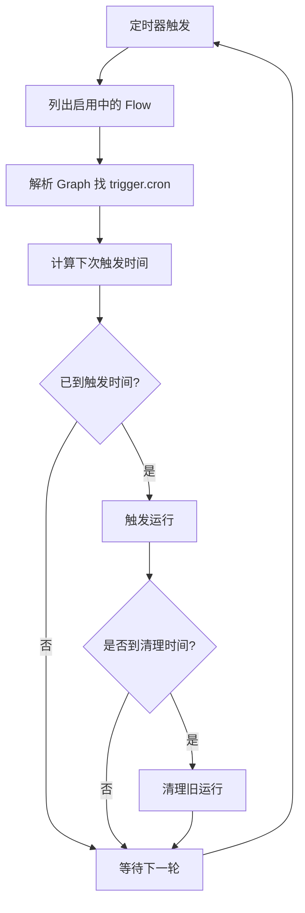
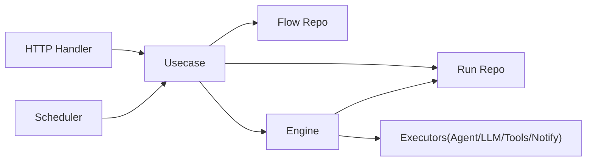
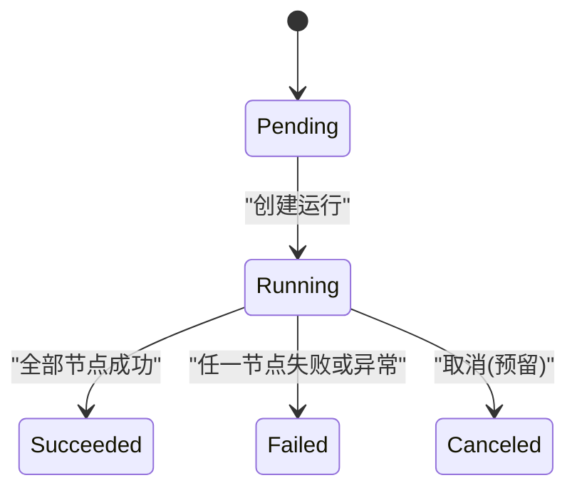

# 工作流执行引擎

<cite>
**本文引用的文件**
- [engine.go](file://internal/manager/biz/flow/engine.go)
- [scheduler.go](file://internal/manager/biz/flow/scheduler.go)
- [graph.go](file://internal/manager/biz/flow/graph.go)
- [nodes.go](file://internal/manager/biz/flow/nodes.go)
- [noderegistry.go](file://internal/manager/biz/flow/noderegistry.go)
- [usecase.go](file://internal/manager/biz/flow/usecase.go)
- [model.go](file://internal/manager/model/flow/model.go)
- [http.go](file://internal/manager/server/flow/http.go)
- [workflow-catalog.md](file://docs/workflow-catalog.md)
</cite>

## 目录
1. [简介](#简介)
2. [项目结构](#项目结构)
3. [核心组件](#核心组件)
4. [架构总览](#架构总览)
5. [详细组件分析](#详细组件分析)
6. [依赖关系分析](#依赖关系分析)
7. [性能与资源限制](#性能与资源限制)
8. [故障隔离与恢复](#故障隔离与恢复)
9. [版本控制、回滚与监控](#版本控制回滚与监控)
10. [工作流定义格式与节点类型](#工作流定义格式与节点类型)
11. [执行流程与状态机](#执行流程与状态机)
12. [示例工作流与结果分析](#示例工作流与结果分析)
13. [排错指南](#排错指南)
14. [结论](#结论)

## 简介
本工作流执行引擎将用户通过可视化画布编排的 DAG（有向无环图）作为“工作流定义”，以触发器为入口，按边进行控制流调度，节点间数据通过运行上下文共享。引擎支持手动、告警、定时三类触发；内置工具、Agent、LLM、条件、通知、变量、字段映射、HTTP 请求等节点类型；提供并发控制、错误分支、持久化与清理能力，并通过 HTTP API 暴露 CRUD、运行、测试节点、查看运行历史等功能。

## 项目结构
工作流相关代码集中在 manager 子域：
- biz/flow：业务层，包含引擎、调度器、图解析、节点注册与执行、用例编排
- model/flow：持久化模型（Flow、FlowRun、FlowRunNode）
- server/flow：HTTP 接口层，挂载路由并处理鉴权、参数校验、DTO 转换
- docs/workflow-catalog.md：面向用户的节点与工具目录、示例工作流说明

**图表来源**
- [http.go:33-47](file://internal/manager/server/flow/http.go#L33-L47)
- [usecase.go:57-74](file://internal/manager/biz/flow/usecase.go#L57-L74)
- [engine.go:34-47](file://internal/manager/biz/flow/engine.go#L34-L47)
- [scheduler.go:25-41](file://internal/manager/biz/flow/scheduler.go#L25-L41)
- [graph.go:72-76](file://internal/manager/biz/flow/graph.go#L72-L76)
- [nodes.go:60-66](file://internal/manager/biz/flow/nodes.go#L60-L66)
- [noderegistry.go:63-86](file://internal/manager/biz/flow/noderegistry.go#L63-L86)
- [model.go:57-117](file://internal/manager/model/flow/model.go#L57-L117)

**章节来源**
- [http.go:33-47](file://internal/manager/server/flow/http.go#L33-L47)
- [usecase.go:57-74](file://internal/manager/biz/flow/usecase.go#L57-L74)
- [engine.go:34-47](file://internal/manager/biz/flow/engine.go#L34-L47)
- [scheduler.go:25-41](file://internal/manager/biz/flow/scheduler.go#L25-L41)
- [graph.go:72-76](file://internal/manager/biz/flow/graph.go#L72-L76)
- [nodes.go:60-66](file://internal/manager/biz/flow/nodes.go#L60-L66)
- [noderegistry.go:63-86](file://internal/manager/biz/flow/noderegistry.go#L63-L86)
- [model.go:57-117](file://internal/manager/model/flow/model.go#L57-L117)

## 核心组件
- 引擎 Engine：DAG 执行核心，负责触发点选择、并发扇出、OR-join 执行一次语义、错误端口转发、上下文传播与持久化落盘
- 调度器 Scheduler：基于 cron 扫描启用中的工作流，匹配 trigger.cron 节点并触发运行
- 图 Graph：画布 JSON 的解析与校验（节点 ID、类型、边合法性、入度、环检测），以及触发点与边的查询
- 节点注册表 NodeRegistry：声明式节点类型（Kind、Category、Ports、ConfigFields、OutputShape、Execute），统一扩展点
- 用例 Usecase：编排 Flow 的 CRUD、运行触发、单节点测试、运行清理、健康检查（修复悬挂运行）
- 模型 Model：Flow、FlowRun、FlowRunNode 三实体及状态常量

**章节来源**
- [engine.go:34-113](file://internal/manager/biz/flow/engine.go#L34-L113)
- [scheduler.go:25-69](file://internal/manager/biz/flow/scheduler.go#L25-L69)
- [graph.go:97-187](file://internal/manager/biz/flow/graph.go#L97-L187)
- [noderegistry.go:46-86](file://internal/manager/biz/flow/noderegistry.go#L46-L86)
- [usecase.go:23-51](file://internal/manager/biz/flow/usecase.go#L23-L51)
- [model.go:29-117](file://internal/manager/model/flow/model.go#L29-L117)

## 架构总览
工作流从 HTTP 或内部事件进入 Usecase，创建 FlowRun 并启动异步执行；Engine 根据 Graph 的触发器激活节点，节点执行后写入 FlowRunNode，并根据输出端口继续激活下游；Scheduler 周期扫描启用中的 Flow，对 trigger.cron 节点按时触发。

**图表来源**
- [http.go:302-320](file://internal/manager/server/flow/http.go#L302-L320)
- [usecase.go:277-343](file://internal/manager/biz/flow/usecase.go#L277-L343)
- [engine.go:67-113](file://internal/manager/biz/flow/engine.go#L67-L113)
- [scheduler.go:71-130](file://internal/manager/biz/flow/scheduler.go#L71-L130)

## 详细组件分析

### 引擎 Engine（DAG 执行器）
- 并发控制：使用信号量限制同时执行的节点数，避免宽图导致无限扇出
- 执行语义：
  - 入口：所有 trigger 节点均可作为入口，或通过 entryType 限定（如仅 alert_fired）
  - OR-join + execute-once：同一节点在运行中只执行一次，后续到达视为 no-op
  - 错误处理：节点错误优先走 error 端口；若无 error 边则标记运行失败
- 上下文：RunContext 包含 trigger、nodes 输出缓存、vars 变量；配置模板 {{trigger.*}}/{{nodes.*}}/{{vars.*}} 在执行前解析
- 持久化：每个节点执行前后写 FlowRunNode，记录输入、输出、端口、时间戳、错误信息
- 安全兜底：goroutine 级 recover 捕获 panic，记录堆栈并标记失败，不崩溃进程

**图表来源**
- [engine.go:67-113](file://internal/manager/biz/flow/engine.go#L67-L113)
- [engine.go:115-159](file://internal/manager/biz/flow/engine.go#L115-L159)
- [engine.go:161-260](file://internal/manager/biz/flow/engine.go#L161-L260)

**章节来源**
- [engine.go:30-113](file://internal/manager/biz/flow/engine.go#L30-L113)
- [engine.go:115-260](file://internal/manager/biz/flow/engine.go#L115-L260)

### 调度器 Scheduler（cron 驱动）
- 每 30 秒 tick，列出所有启用的 Flow，解析 Graph 找到 trigger.cron 节点
- 维护内存中的 next-fire 时间表，到点即触发运行
- 每小时附带清理旧运行记录（保留天数可配置）
- 若 Flow/Trigger 被禁用或删除，自动遗忘其调度项

**图表来源**
- [scheduler.go:44-69](file://internal/manager/biz/flow/scheduler.go#L44-L69)
- [scheduler.go:71-130](file://internal/manager/biz/flow/scheduler.go#L71-L130)

**章节来源**
- [scheduler.go:25-69](file://internal/manager/biz/flow/scheduler.go#L25-L69)
- [scheduler.go:71-130](file://internal/manager/biz/flow/scheduler.go#L71-L130)

### 图 Graph（定义与校验）
- 节点类型与端口：通过注册表声明，未注册类型默认 next 端口
- 校验规则：
  - 节点 ID 唯一且合法
  - 节点类型已注册
  - 边引用存在且目标不是触发器
  - 源端口必须为目标节点暴露的端口之一
  - 无环（Kahn 算法）
- 查询：Triggers() 获取入口；EdgesFrom(id, port) 获取下游

**章节来源**
- [graph.go:24-46](file://internal/manager/biz/flow/graph.go#L24-L46)
- [graph.go:97-187](file://internal/manager/biz/flow/graph.go#L97-L187)
- [graph.go:189-214](file://internal/manager/biz/flow/graph.go#L189-L214)

### 节点注册表与执行器（NodeRegistry & Nodes）
- 节点规格 NodeSpec：描述 Kind、Category、Ports、ConfigFields、OutputShape、Execute
- 内置节点：
  - 触发器：manual、alert_fired、cron
  - 动作：agent、llm、tool、notify、http_request
  - 控制：condition
  - 数据：set、transform
- 执行器统一签名：接收已解析的配置与只读上下文，返回 (数据输出, 控制端口) 或错误
- 超时策略：普通节点 2 分钟，Agent 15 分钟，LLM 3 分钟

**章节来源**
- [noderegistry.go:18-86](file://internal/manager/biz/flow/noderegistry.go#L18-L86)
- [noderegistry.go:93-197](file://internal/manager/biz/flow/noderegistry.go#L93-L197)
- [nodes.go:17-86](file://internal/manager/biz/flow/nodes.go#L17-L86)
- [nodes.go:88-117](file://internal/manager/biz/flow/nodes.go#L88-L117)

### 用例 Usecase（编排与生命周期）
- Flow CRUD：创建/更新时校验 Graph，更新时若 Graph 变化则版本号递增
- 运行触发：
  - 手动：HTTP 触发，requireEnabled=true
  - 事件：来自 alert/cron，requireEnabled=false（禁用属良性竞态）
  - 创建 FlowRun 并立即返回，后台 goroutine 执行引擎并写回最终状态
- 单节点测试：在不执行副作用的前提下，返回节点真实输出形状，便于编辑期调试
- 运行清理：按环境变量配置的保留天数定期删除已完成的历史运行
- 健康检查：启动时修复悬挂 running/pending 行

**章节来源**
- [usecase.go:84-139](file://internal/manager/biz/flow/usecase.go#L84-L139)
- [usecase.go:179-343](file://internal/manager/biz/flow/usecase.go#L179-L343)
- [usecase.go:372-409](file://internal/manager/biz/flow/usecase.go#L372-L409)

## 依赖关系分析
- HTTP Handler 依赖 Usecase 暴露的 CRUD、运行、测试、列表接口
- Usecase 依赖 Repo/RunRepo 持久化 Flow/Run/Node，依赖 Engine 执行 DAG
- Engine 依赖 Executors（Agent/LLM/Tools/Notifier）和 RunRepo
- Scheduler 依赖 Usecase 的 ListEnabledFlows 与 TriggerEvent
- Graph 与 NodeRegistry 解耦：新增节点只需注册 Spec，无需改动引擎核心

**图表来源**
- [http.go:24-47](file://internal/manager/server/flow/http.go#L24-L47)
- [usecase.go:23-74](file://internal/manager/biz/flow/usecase.go#L23-L74)
- [engine.go:34-47](file://internal/manager/biz/flow/engine.go#L34-L47)
- [scheduler.go:25-41](file://internal/manager/biz/flow/scheduler.go#L25-L41)

**章节来源**
- [http.go:24-47](file://internal/manager/server/flow/http.go#L24-L47)
- [usecase.go:23-74](file://internal/manager/biz/flow/usecase.go#L23-L74)
- [engine.go:34-47](file://internal/manager/biz/flow/engine.go#L34-L47)
- [scheduler.go:25-41](file://internal/manager/biz/flow/scheduler.go#L25-L41)

## 性能与资源限制
- 并发上限：引擎内全局信号量限制同时执行的节点数，防止宽图导致资源耗尽
- 超时保护：不同节点类型设置合理超时，避免长尾阻塞
- 内存调度：Scheduler 维护内存中的 next-fire 表，轻量高效
- I/O 分离：运行在后台 goroutine，不阻塞请求线程；节点输入输出序列化存储，减少运行时内存压力
- 历史清理：按天清理已完成运行，控制数据库增长

优化建议
- 根据负载调整 maxConcurrentNodes
- 针对外部依赖（网络/IO）的节点，适当提高超时或增加重试
- 对高频 cron 任务，评估 tick 间隔与批量触发合并

[本节为通用指导，不直接分析具体文件]

## 故障隔离与恢复
- 节点级 panic 捕获：每个节点 goroutine 独立 recover，记录堆栈并标记失败，不影响其他分支
- 运行级 panic 捕获：Execute 外层 recover，确保主流程不崩溃
- 错误端口：节点错误优先走 error 边，允许自定义处理分支
- 悬挂运行修复：服务重启后，将残留 running/pending 行置为 failed，避免状态不一致
- 运行清理：过期运行自动删除，降低存储压力

**章节来源**
- [engine.go:67-74](file://internal/manager/biz/flow/engine.go#L67-L74)
- [engine.go:139-154](file://internal/manager/biz/flow/engine.go#L139-L154)
- [usecase.go:372-386](file://internal/manager/biz/flow/usecase.go#L372-L386)

## 版本控制、回滚与监控
- 版本控制：Flow 每次 Graph 变更都会递增 Version；运行快照执行时的 FlowVersion，保证历史运行视图不受后续修改影响
- 回滚：当前实现未提供一键回滚 Graph 的能力；可通过保存历史版本并在需要时替换 GraphJSON 实现
- 监控：
  - 运行状态：FlowRun.Status（pending/running/succeeded/failed/canceled）
  - 节点状态：FlowRunNode.Status（running/succeeded/failed）
  - 运行历史：ListRuns/GetRun 可查看最近运行与节点详情
  - 清理策略：通过环境变量控制保留天数

**章节来源**
- [usecase.go:114-139](file://internal/manager/biz/flow/usecase.go#L114-L139)
- [model.go:57-93](file://internal/manager/model/flow/model.go#L57-L93)
- [usecase.go:388-409](file://internal/manager/biz/flow/usecase.go#L388-L409)

## 工作流定义格式与节点类型
- 定义格式：Graph 由 nodes 与 edges 组成；节点包含 id、type、name、config、position；边包含 id、source、sourcePort、target
- 控制端口：next（默认）、true/false（条件）、error（错误）
- 节点类型：
  - 触发器：trigger.manual、trigger.alert_fired、trigger.cron
  - 动作：agent、llm、tool、notify、http_request
  - 控制：condition
  - 数据：set、transform
- 表达式：{{trigger.*}}、{{nodes.<id>.output.<path>}}、{{vars.<name>}}

**章节来源**
- [graph.go:24-76](file://internal/manager/biz/flow/graph.go#L24-L76)
- [graph.go:40-46](file://internal/manager/biz/flow/graph.go#L40-L46)
- [noderegistry.go:93-197](file://internal/manager/biz/flow/noderegistry.go#L93-L197)

## 执行流程与状态机
- 运行状态机：pending → running → succeeded/failed/canceled
- 节点状态机：running → succeeded/failed（skipped 用于未来补全）
- 执行流程：
  - 触发：HTTP 或 cron 创建 FlowRun 并置为 running
  - 引擎：解析 Graph，激活触发器，按边推进，节点完成后写 FlowRunNode
  - 结束：引擎返回最终状态，Usecase 写回 FlowRun 并记录错误信息

**图表来源**
- [model.go:29-47](file://internal/manager/model/flow/model.go#L29-L47)
- [usecase.go:311-343](file://internal/manager/biz/flow/usecase.go#L311-L343)
- [engine.go:107-113](file://internal/manager/biz/flow/engine.go#L107-L113)

**章节来源**
- [model.go:29-47](file://internal/manager/model/flow/model.go#L29-L47)
- [usecase.go:311-343](file://internal/manager/biz/flow/usecase.go#L311-L343)
- [engine.go:107-113](file://internal/manager/biz/flow/engine.go#L107-L113)

## 示例工作流与结果分析
- 示例工作流（来自文档）：平台快照、k8s 集群巡检、主机健康巡检、告警与变更审计、事件关联诊断
- 节点链示例：query_promql → query_devices → get_topology；namespaces_list → pods_list → events_list 等
- 结果分析：
  - 查看 FlowRun 状态与错误信息
  - 查看 FlowRunNode 的 InputJSON/OutputJSON/FiredPort/Error，定位问题节点
  - 使用“测试节点”功能验证单个节点的输出形状与错误

**章节来源**
- [workflow-catalog.md:97-132](file://docs/workflow-catalog.md#L97-L132)
- [http.go:322-347](file://internal/manager/server/flow/http.go#L322-L347)
- [http.go:370-400](file://internal/manager/server/flow/http.go#L370-L400)

## 排错指南
常见问题与排查步骤
- 节点报错：查看 FlowRunNode.Error 与 FiredPort，确认是否走了 error 分支
- 运行失败：检查 FlowRun.Error，定位首个失败节点
- 悬挂运行：服务重启后会自动修复；若仍异常，检查数据库状态并手动修正
- 定时未触发：确认 Flow 启用、Graph 含 trigger.cron、cron 表达式合法、Scheduler 正常运行
- 权限问题：HTTP 写操作需非 viewer 角色；鉴权失败会返回相应错误码

**章节来源**
- [http.go:49-62](file://internal/manager/server/flow/http.go#L49-L62)
- [usecase.go:372-386](file://internal/manager/biz/flow/usecase.go#L372-L386)
- [scheduler.go:71-130](file://internal/manager/biz/flow/scheduler.go#L71-L130)

## 结论
该工作流执行引擎以声明式节点注册为核心，结合 DAG 解析与并发控制，提供了稳定可靠的工作流执行能力。通过版本化的 Flow 定义、完整的运行与节点持久化、灵活的错误分支与清理机制，满足了自动化编排的基本需求。未来可在并行合并、SOP 双签与回滚、更细粒度的资源配额等方面进一步增强。