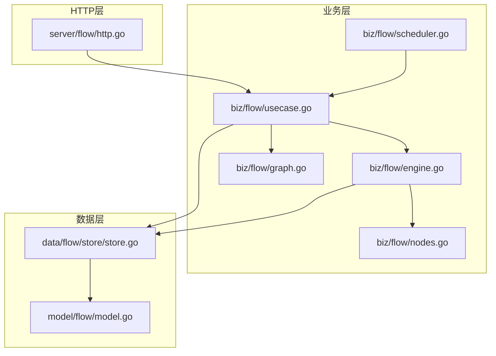
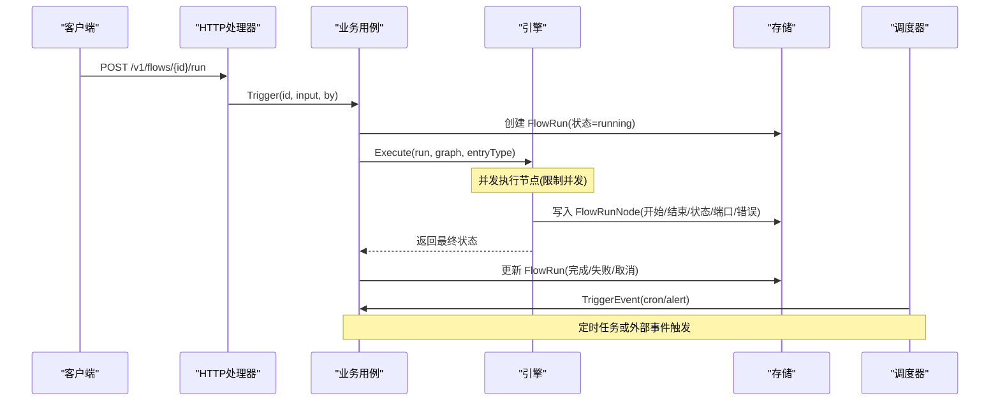
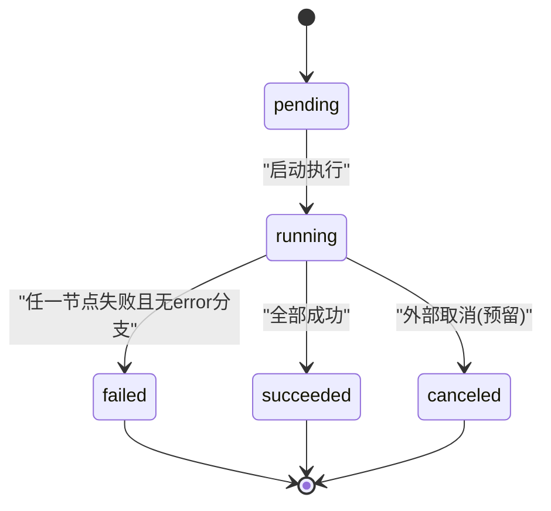
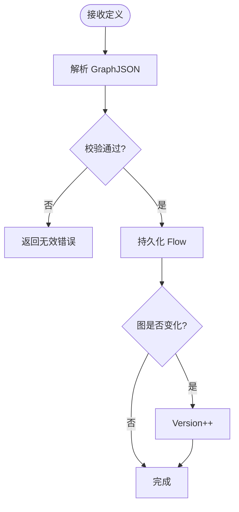
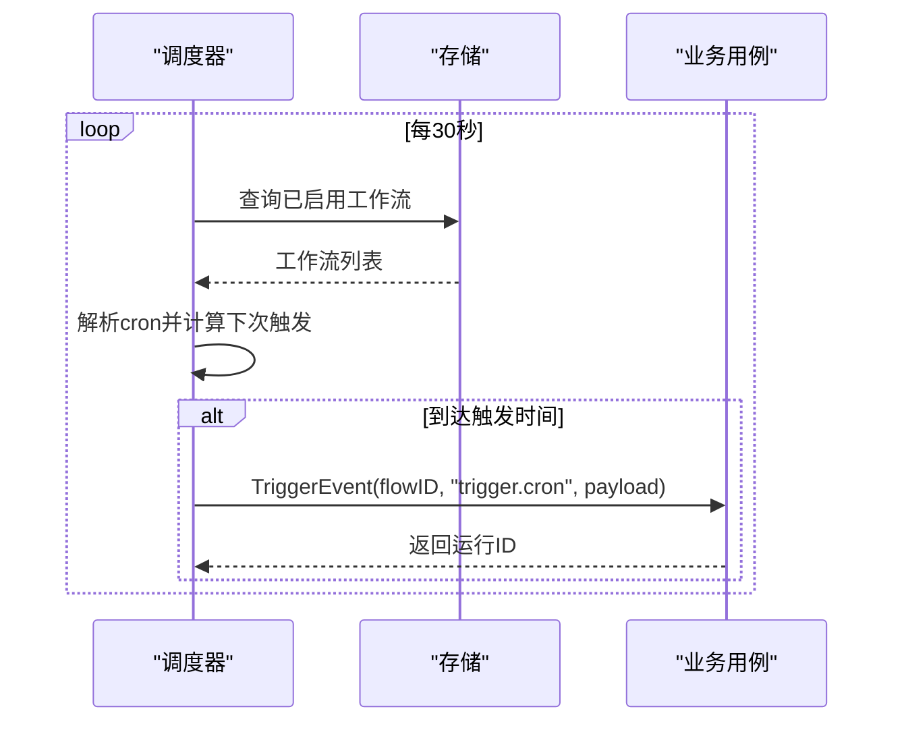
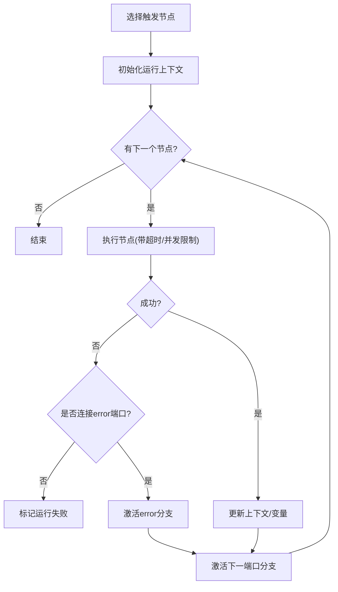
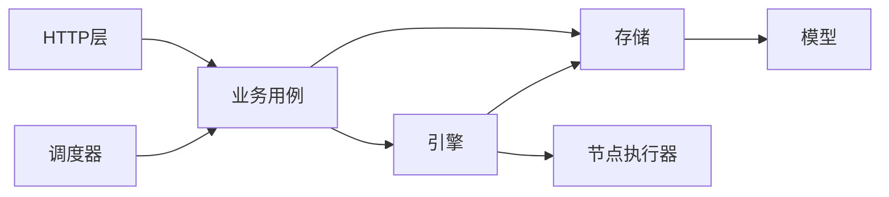

# 工作流生命周期

<cite>
**本文引用的文件**
- [internal/manager/model/flow/model.go](file://internal/manager/model/flow/model.go)
- [internal/manager/biz/flow/usecase.go](file://internal/manager/biz/flow/usecase.go)
- [internal/manager/biz/flow/engine.go](file://internal/manager/biz/flow/engine.go)
- [internal/manager/biz/flow/graph.go](file://internal/manager/biz/flow/graph.go)
- [internal/manager/biz/flow/nodes.go](file://internal/manager/biz/flow/nodes.go)
- [internal/manager/biz/flow/scheduler.go](file://internal/manager/biz/flow/scheduler.go)
- [internal/manager/data/flow/store/store.go](file://internal/manager/data/flow/store/store.go)
- [internal/manager/server/flow/http.go](file://internal/manager/server/flow/http.go)
</cite>

## 目录
1. [简介](#简介)
2. [项目结构](#项目结构)
3. [核心组件](#核心组件)
4. [架构总览](#架构总览)
5. [详细组件分析](#详细组件分析)
6. [依赖关系分析](#依赖关系分析)
7. [性能与可靠性](#性能与可靠性)
8. [监控、日志与审计](#监控日志与审计)
9. [故障排查指南](#故障排查指南)
10. [结论](#结论)
11. [附录：API 与使用示例](#附录api-与使用示例)

## 简介
本文件系统化阐述工作流从创建到完成的全生命周期管理，覆盖状态机、版本控制、持久化、调度、执行、监控与归档。重点说明：
- 阶段划分：定义、验证、调度、执行、监控、归档
- 版本管理与回滚策略：GraphJSON 快照 + Version 递增；历史运行不受后续编辑影响
- 重试与超时：节点级默认超时、并发上限、错误端口分支处理
- 资源清理：运行记录保留期与过期清理
- 监控指标、日志与审计追踪：运行与节点行、触发载荷、错误信息、时间戳
- API 与前端交互：创建工作流、运行、查看运行详情等

## 项目结构
工作流子系统位于 manager 域，采用分层设计：
- model：数据模型（Flow、FlowRun、FlowRunNode）
- biz：业务用例（Usecase）、引擎（Engine）、图解析与校验（Graph）、节点执行器（Nodes）、调度器（Scheduler）
- data：GORM 存储实现（Store）
- server：HTTP 接口（Handler）

图表来源
- [internal/manager/server/flow/http.go:33-47](file://internal/manager/server/flow/http.go#L33-L47)
- [internal/manager/biz/flow/usecase.go:57-74](file://internal/manager/biz/flow/usecase.go#L57-L74)
- [internal/manager/biz/flow/engine.go:34-47](file://internal/manager/biz/flow/engine.go#L34-L47)
- [internal/manager/biz/flow/graph.go:97-112](file://internal/manager/biz/flow/graph.go#L97-L112)
- [internal/manager/biz/flow/nodes.go:60-86](file://internal/manager/biz/flow/nodes.go#L60-L86)
- [internal/manager/biz/flow/scheduler.go:25-41](file://internal/manager/biz/flow/scheduler.go#L25-L41)
- [internal/manager/data/flow/store/store.go:18-22](file://internal/manager/data/flow/store/store.go#L18-L22)
- [internal/manager/model/flow/model.go:54-118](file://internal/manager/model/flow/model.go#L54-L118)

章节来源
- [internal/manager/server/flow/http.go:33-47](file://internal/manager/server/flow/http.go#L33-L47)
- [internal/manager/biz/flow/usecase.go:57-74](file://internal/manager/biz/flow/usecase.go#L57-L74)
- [internal/manager/biz/flow/engine.go:34-47](file://internal/manager/biz/flow/engine.go#L34-L47)
- [internal/manager/biz/flow/graph.go:97-112](file://internal/manager/biz/flow/graph.go#L97-L112)
- [internal/manager/biz/flow/nodes.go:60-86](file://internal/manager/biz/flow/nodes.go#L60-L86)
- [internal/manager/biz/flow/scheduler.go:25-41](file://internal/manager/biz/flow/scheduler.go#L25-L41)
- [internal/manager/data/flow/store/store.go:18-22](file://internal/manager/data/flow/store/store.go#L18-L22)
- [internal/manager/model/flow/model.go:54-118](file://internal/manager/model/flow/model.go#L54-L118)

## 核心组件
- 数据模型
  - Flow：工作流定义，包含 GraphJSON（画布 DAG）、Enabled、Version、Created/Updated/DeletedAt
  - FlowRun：一次执行实例，含状态机、触发类型、触发载荷快照、起止时间、错误信息
  - FlowRunNode：运行中每个节点的输入输出、状态、触发端口、错误、时间戳
- 业务用例（Usecase）
  - 定义 CRUD、启用/禁用、手动触发、事件触发、单节点测试、运行列表与详情、旧运行清理、陈旧运行修复
- 引擎（Engine）
  - 解析触发点、并发执行节点、OR-join 语义、错误端口分支、上下文变量传播、结果落库
- 图解析与校验（Graph）
  - 解析画布 JSON、校验节点 ID/类型/边合法性、入度统计与环检测、触发点提取、按端口出边查询
- 节点执行器（Nodes）
  - 统一执行入口、默认超时、Agent/LLM/Tool/Notify 等能力通过接口注入
- 调度器（Scheduler）
  - 定时扫描启用的工作流，解析 cron 表达式，到达时触发对应触发节点
- 存储（Store）
  - 基于 GORM 的 Flow/Run/Node 增删改查、运行保留清理、陈旧运行修复

章节来源
- [internal/manager/model/flow/model.go:29-118](file://internal/manager/model/flow/model.go#L29-L118)
- [internal/manager/biz/flow/usecase.go:23-51](file://internal/manager/biz/flow/usecase.go#L23-L51)
- [internal/manager/biz/flow/engine.go:34-113](file://internal/manager/biz/flow/engine.go#L34-L113)
- [internal/manager/biz/flow/graph.go:24-187](file://internal/manager/biz/flow/graph.go#L24-L187)
- [internal/manager/biz/flow/nodes.go:17-86](file://internal/manager/biz/flow/nodes.go#L17-L86)
- [internal/manager/biz/flow/scheduler.go:20-41](file://internal/manager/biz/flow/scheduler.go#L20-L41)
- [internal/manager/data/flow/store/store.go:18-158](file://internal/manager/data/flow/store/store.go#L18-L158)

## 架构总览
工作流的生命周期由 HTTP 层暴露 API，调用业务用例，业务用例负责图解析与校验、创建运行记录并异步执行引擎。引擎以 DAG 方式驱动节点执行，节点执行结果写回数据库。调度器周期性检查 cron 触发条件，命中后通过用例触发运行。

图表来源
- [internal/manager/server/flow/http.go:302-320](file://internal/manager/server/flow/http.go#L302-L320)
- [internal/manager/biz/flow/usecase.go:179-343](file://internal/manager/biz/flow/usecase.go#L179-L343)
- [internal/manager/biz/flow/engine.go:59-113](file://internal/manager/biz/flow/engine.go#L59-L113)
- [internal/manager/biz/flow/scheduler.go:43-130](file://internal/manager/biz/flow/scheduler.go#L43-L130)
- [internal/manager/data/flow/store/store.go:84-129](file://internal/manager/data/flow/store/store.go#L84-L129)

## 详细组件分析

### 数据模型与状态机
- Flow：保存画布图（GraphJSON），每次图变更时 Version 自增，确保历史运行视图稳定
- FlowRun：状态机 pending → running → succeeded/failed/canceled；重启时会把遗留的 pending/running 标记为 failed
- FlowRunNode：节点执行明细，包含输入输出、触发端口、错误、起止时间

图表来源
- [internal/manager/model/flow/model.go:29-38](file://internal/manager/model/flow/model.go#L29-L38)
- [internal/manager/data/flow/store/store.go:153-158](file://internal/manager/data/flow/store/store.go#L153-L158)

章节来源
- [internal/manager/model/flow/model.go:54-118](file://internal/manager/model/flow/model.go#L54-L118)
- [internal/manager/data/flow/store/store.go:153-158](file://internal/manager/data/flow/store/store.go#L153-L158)

### 定义与验证
- 创建/更新工作流时，会解析并校验 GraphJSON，确保节点 ID 唯一、类型已知、边合法、无环、禁止指向触发节点
- 更新图时若内容变化则 Version++，否则仅更新元信息

图表来源
- [internal/manager/biz/flow/usecase.go:84-139](file://internal/manager/biz/flow/usecase.go#L84-L139)
- [internal/manager/biz/flow/graph.go:97-187](file://internal/manager/biz/flow/graph.go#L97-L187)

章节来源
- [internal/manager/biz/flow/usecase.go:84-139](file://internal/manager/biz/flow/usecase.go#L84-L139)
- [internal/manager/biz/flow/graph.go:97-187](file://internal/manager/biz/flow/graph.go#L97-L187)

### 调度
- 内置 cron 调度器每 30 秒扫描启用的工作流，解析 trigger.cron 配置，计算下次触发时间
- 到达触发时间后，通过用例的事件触发路径启动运行，payload 注入 {{trigger.*}}
- 同时每小时执行一次运行记录清理（可配置保留天数）

图表来源
- [internal/manager/biz/flow/scheduler.go:43-130](file://internal/manager/biz/flow/scheduler.go#L43-L130)
- [internal/manager/biz/flow/usecase.go:264-271](file://internal/manager/biz/flow/usecase.go#L264-L271)

章节来源
- [internal/manager/biz/flow/scheduler.go:43-130](file://internal/manager/biz/flow/scheduler.go#L43-L130)
- [internal/manager/biz/flow/usecase.go:264-271](file://internal/manager/biz/flow/usecase.go#L264-L271)

### 执行
- 引擎从触发节点开始，按边和端口激活下游节点，支持 fan-out 并发，限制最大并发数
- 节点执行结果写入 FlowRunNode，变量写入共享上下文，供后续节点引用
- 错误处理：若节点报错且未连接 error 端口，则运行失败；若连接了 error 端口，则进入错误分支继续执行
- 运行完成后更新 FlowRun 状态与错误信息

图表来源
- [internal/manager/biz/flow/engine.go:59-113](file://internal/manager/biz/flow/engine.go#L59-L113)
- [internal/manager/biz/flow/engine.go:115-260](file://internal/manager/biz/flow/engine.go#L115-L260)
- [internal/manager/biz/flow/nodes.go:68-86](file://internal/manager/biz/flow/nodes.go#L68-L86)

章节来源
- [internal/manager/biz/flow/engine.go:59-113](file://internal/manager/biz/flow/engine.go#L59-L113)
- [internal/manager/biz/flow/engine.go:115-260](file://internal/manager/biz/flow/engine.go#L115-L260)
- [internal/manager/biz/flow/nodes.go:68-86](file://internal/manager/biz/flow/nodes.go#L68-L86)

### 监控与审计
- 运行与节点行提供完整审计轨迹：触发载荷、输入输出、状态、端口、错误、起止时间
- 运行列表与详情可通过 API 获取，便于前端展示与排障
- 运行记录保留期可配置，过期自动清理

章节来源
- [internal/manager/model/flow/model.go:75-118](file://internal/manager/model/flow/model.go#L75-L118)
- [internal/manager/server/flow/http.go:349-400](file://internal/manager/server/flow/http.go#L349-L400)
- [internal/manager/biz/flow/usecase.go:388-409](file://internal/manager/biz/flow/usecase.go#L388-L409)

### 归档与清理
- 运行清理：PruneOldRuns 删除指定时间点之前已完成（非 pending/running）的运行及其节点行，防止无限增长
- 陈旧运行修复：HealStaleRuns 在启动时将遗留的 pending/running 标记为 failed，避免“悬挂”运行

章节来源
- [internal/manager/biz/flow/usecase.go:372-409](file://internal/manager/biz/flow/usecase.go#L372-L409)
- [internal/manager/data/flow/store/store.go:131-158](file://internal/manager/data/flow/store/store.go#L131-L158)

## 依赖关系分析
- HTTP 层依赖业务用例，不直接访问存储
- 业务用例组合存储、引擎、工具目录、LLM 等能力
- 引擎依赖节点执行器与存储
- 调度器依赖业务用例的事件触发能力
- 存储依赖模型定义

图表来源
- [internal/manager/server/flow/http.go:33-47](file://internal/manager/server/flow/http.go#L33-L47)
- [internal/manager/biz/flow/usecase.go:57-74](file://internal/manager/biz/flow/usecase.go#L57-L74)
- [internal/manager/biz/flow/engine.go:34-47](file://internal/manager/biz/flow/engine.go#L34-L47)
- [internal/manager/biz/flow/nodes.go:60-86](file://internal/manager/biz/flow/nodes.go#L60-L86)
- [internal/manager/biz/flow/scheduler.go:25-41](file://internal/manager/biz/flow/scheduler.go#L25-L41)
- [internal/manager/data/flow/store/store.go:18-22](file://internal/manager/data/flow/store/store.go#L18-L22)
- [internal/manager/model/flow/model.go:54-118](file://internal/manager/model/flow/model.go#L54-L118)

章节来源
- [internal/manager/server/flow/http.go:33-47](file://internal/manager/server/flow/http.go#L33-L47)
- [internal/manager/biz/flow/usecase.go:57-74](file://internal/manager/biz/flow/usecase.go#L57-L74)
- [internal/manager/biz/flow/engine.go:34-47](file://internal/manager/biz/flow/engine.go#L34-L47)
- [internal/manager/biz/flow/nodes.go:60-86](file://internal/manager/biz/flow/nodes.go#L60-L86)
- [internal/manager/biz/flow/scheduler.go:25-41](file://internal/manager/biz/flow/scheduler.go#L25-L41)
- [internal/manager/data/flow/store/store.go:18-22](file://internal/manager/data/flow/store/store.go#L18-L22)
- [internal/manager/model/flow/model.go:54-118](file://internal/manager/model/flow/model.go#L54-L118)

## 性能与可靠性
- 并发控制：引擎限制最大并发节点数，避免宽图导致资源耗尽
- 超时控制：节点级默认超时（普通节点、Agent 节点、LLM 节点不同预算），防止长尾阻塞
- 错误隔离：节点 panic 被捕获并记录，不影响其他分支继续执行；未连接 error 端口的错误将导致运行失败
- 健壮性：运行结束后异步更新状态；启动时修复遗留运行；定期清理历史运行
- 可扩展性：节点类型通过注册表扩展，图结构动态解析，无需迁移即可新增节点类型

章节来源
- [internal/manager/biz/flow/engine.go:30-33](file://internal/manager/biz/flow/engine.go#L30-L33)
- [internal/manager/biz/flow/engine.go:67-113](file://internal/manager/biz/flow/engine.go#L67-L113)
- [internal/manager/biz/flow/nodes.go:68-75](file://internal/manager/biz/flow/nodes.go#L68-L75)
- [internal/manager/biz/flow/usecase.go:372-409](file://internal/manager/biz/flow/usecase.go#L372-L409)

## 监控、日志与审计
- 运行与节点行作为审计基础：包含触发载荷、输入输出、状态、端口、错误、起止时间
- 日志记录：引擎对 panic 与错误进行结构化日志记录；调度器对触发与失败进行日志记录
- 运行清理：可配置保留天数，定期清理历史运行，减少存储压力
- 前端展示：通过 API 获取运行列表与详情，结合节点行进行可视化

章节来源
- [internal/manager/model/flow/model.go:75-118](file://internal/manager/model/flow/model.go#L75-L118)
- [internal/manager/biz/flow/engine.go:67-113](file://internal/manager/biz/flow/engine.go#L67-L113)
- [internal/manager/biz/flow/scheduler.go:43-130](file://internal/manager/biz/flow/scheduler.go#L43-L130)
- [internal/manager/server/flow/http.go:349-400](file://internal/manager/server/flow/http.go#L349-L400)
- [internal/manager/biz/flow/usecase.go:388-409](file://internal/manager/biz/flow/usecase.go#L388-L409)

## 故障排查指南
- 运行卡住或悬挂：启动时会自动将遗留的 pending/running 标记为 failed；检查是否有未完成的运行
- 节点执行失败：查看 FlowRunNode 的错误字段与触发端口；确认是否连接了 error 分支
- 图结构错误：创建/更新时校验失败会返回具体原因（未知节点类型、非法端口、循环等）
- 调度未触发：检查 cron 表达式是否合法、工作流是否启用、触发节点是否存在
- 历史数据膨胀：调整运行保留天数，观察 PruneOldRuns 的执行效果

章节来源
- [internal/manager/data/flow/store/store.go:153-158](file://internal/manager/data/flow/store/store.go#L153-L158)
- [internal/manager/biz/flow/graph.go:114-187](file://internal/manager/biz/flow/graph.go#L114-L187)
- [internal/manager/biz/flow/scheduler.go:71-130](file://internal/manager/biz/flow/scheduler.go#L71-L130)
- [internal/manager/biz/flow/usecase.go:372-409](file://internal/manager/biz/flow/usecase.go#L372-L409)

## 结论
该工作流系统以 DAG 为核心，结合严格的图校验、版本控制与运行审计，提供了从定义到执行的完整生命周期管理能力。通过并发控制、超时与错误分支机制保障执行稳定性；通过调度器与运行清理实现自动化与资源治理。API 层简洁清晰，便于前后端集成与扩展。

## 附录：API 与使用示例
- 列出工作流：GET /v1/flows
- 创建工作流：POST /v1/flows（需 writer 角色）
- 生成工作流（AI 辅助）：POST /v1/flows/generate（需 writer 角色）
- 获取工作流详情：GET /v1/flows/{id}
- 更新工作流：PUT /v1/flows/{id}（需 writer 角色）
- 删除工作流：DELETE /v1/flows/{id}（需 writer 角色）
- 启用/禁用：POST /v1/flows/{id}/toggle（需 writer 角色）
- 手动运行：POST /v1/flows/{id}/run（需 writer 角色）
- 单节点测试：POST /v1/flows/{id}/test-node（需 writer 角色）
- 运行列表：GET /v1/flows/{id}/runs
- 运行详情：GET /v1/flow-runs/{run_id}
- 工具清单：GET /v1/flow-tools
- 节点类型清单：GET /v1/flow-node-types

章节来源
- [internal/manager/server/flow/http.go:33-47](file://internal/manager/server/flow/http.go#L33-L47)
- [internal/manager/server/flow/http.go:160-473](file://internal/manager/server/flow/http.go#L160-L473)