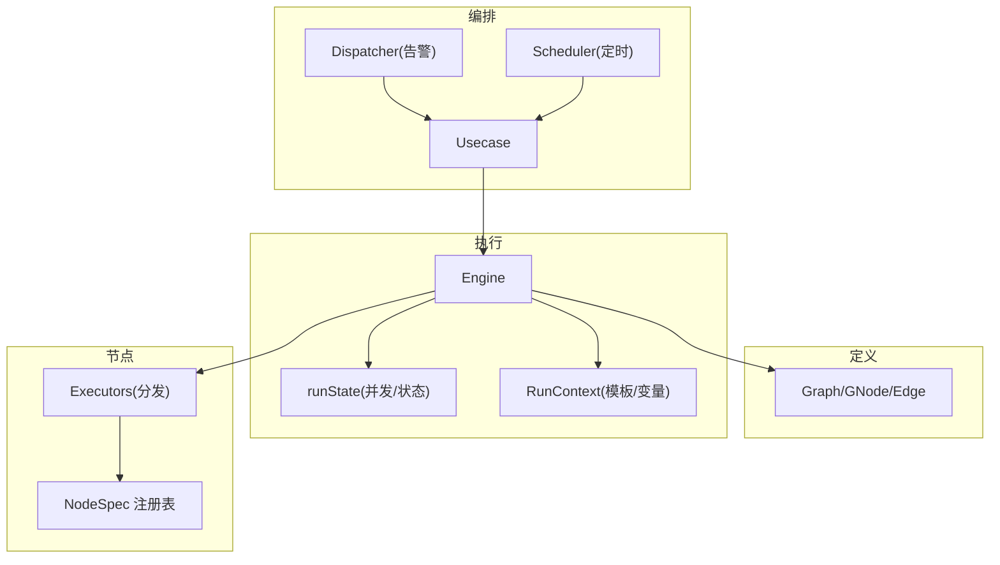
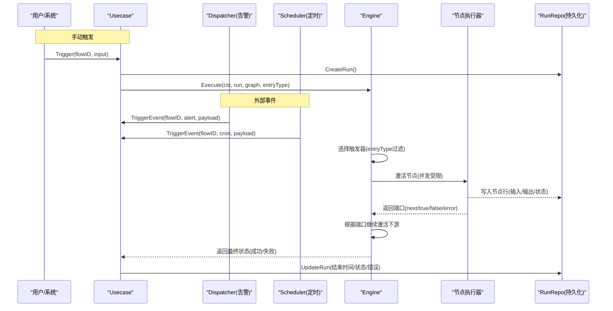
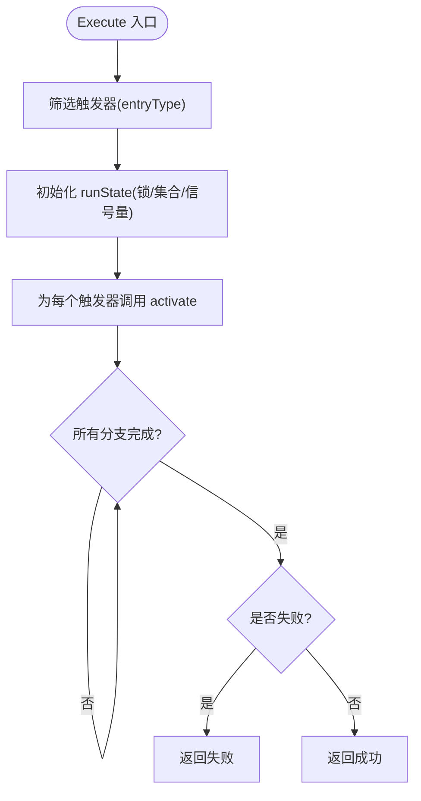
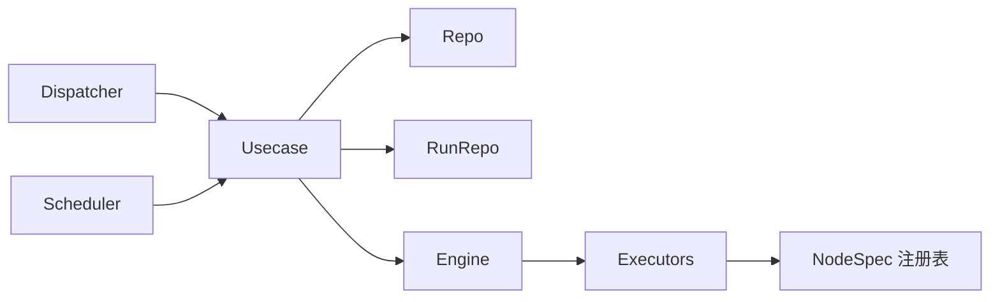

# 引擎核心

<cite>
**本文引用的文件**
- [engine.go](file://internal/manager/biz/flow/engine.go)
- [graph.go](file://internal/manager/biz/flow/graph.go)
- [scheduler.go](file://internal/manager/biz/flow/scheduler.go)
- [nodes.go](file://internal/manager/biz/flow/nodes.go)
- [usecase.go](file://internal/manager/biz/flow/usecase.go)
- [noderegistry.go](file://internal/manager/biz/flow/noderegistry.go)
- [dispatcher.go](file://internal/manager/biz/flow/dispatcher.go)
- [expr.go](file://internal/manager/biz/flow/expr.go)
</cite>

## 目录
1. [简介](#简介)
2. [项目结构](#项目结构)
3. [核心组件](#核心组件)
4. [架构总览](#架构总览)
5. [详细组件分析](#详细组件分析)
6. [依赖关系分析](#依赖关系分析)
7. [性能考虑](#性能考虑)
8. [故障排查指南](#故障排查指南)
9. [结论](#结论)
10. [附录：配置与最佳实践](#附录：配置与最佳实践)

## 简介
本文件面向工作流执行引擎的核心实现，聚焦 DAG 图执行、节点调度机制与执行生命周期。文档系统性阐述 Engine 结构体、runState 状态管理、并发控制机制；说明触发机制（手动、告警、定时）、入口点选择与执行流程控制；覆盖错误处理策略、异常恢复与故障隔离；并给出引擎配置选项、性能调优参数、资源限制设置以及使用示例与最佳实践。

## 项目结构
工作流引擎位于 internal/manager/biz/flow 包，采用“定义-执行-编排”的分层组织：
- 定义层：Graph/GNode/Edge 描述 DAG 结构与校验规则
- 执行层：Engine 负责解析触发器、调度节点、维护运行上下文与并发控制
- 编排层：Usecase 提供用例接口（创建/更新/触发/查询），Dispatcher/Scheduler 驱动外部事件进入引擎
- 节点注册与执行：NodeSpec 注册表 + Executors 分发到具体节点执行器
- 表达式与上下文：RunContext 提供模板解析与条件评估

图表来源
- [engine.go:34-113](file://internal/manager/biz/flow/engine.go#L34-L113)
- [graph.go:48-76](file://internal/manager/biz/flow/graph.go#L48-L76)
- [usecase.go:57-74](file://internal/manager/biz/flow/usecase.go#L57-L74)
- [dispatcher.go:20-33](file://internal/manager/biz/flow/dispatcher.go#L20-L33)
- [scheduler.go:25-41](file://internal/manager/biz/flow/scheduler.go#L25-L41)
- [noderegistry.go:46-86](file://internal/manager/biz/flow/noderegistry.go#L46-L86)
- [nodes.go:60-86](file://internal/manager/biz/flow/nodes.go#L60-L86)

章节来源
- [engine.go:34-113](file://internal/manager/biz/flow/engine.go#L34-L113)
- [graph.go:48-76](file://internal/manager/biz/flow/graph.go#L48-L76)
- [usecase.go:57-74](file://internal/manager/biz/flow/usecase.go#L57-L74)
- [dispatcher.go:20-33](file://internal/manager/biz/flow/dispatcher.go#L20-L33)
- [scheduler.go:25-41](file://internal/manager/biz/flow/scheduler.go#L25-L41)
- [noderegistry.go:46-86](file://internal/manager/biz/flow/noderegistry.go#L46-L86)
- [nodes.go:60-86](file://internal/manager/biz/flow/nodes.go#L60-L86)

## 核心组件
- Engine：DAG 执行骨架，负责从触发器开始激活节点、维护并发度、持久化节点执行结果、处理错误分支与全局失败标记。
- runState：线程安全的运行期状态，包含已执行集合、失败标志、等待组与信号量（并发上限）。
- RunContext：共享上下文，承载 trigger、nodes 输出、vars 变量，并提供模板解析与条件评估。
- NodeSpec/Executors：节点类型注册与统一执行分发，屏蔽具体节点差异。
- Usecase：用例门面，封装创建/更新/启用/触发/查询等能力，协调 Repo/RunRepo/Engine。
- Dispatcher：将告警事件转换为 FlowRun，按匹配规则投递到对应 flow。
- Scheduler：周期扫描启用的 flow，对 trigger.cron 进行调度触发。

章节来源
- [engine.go:34-113](file://internal/manager/biz/flow/engine.go#L34-L113)
- [engine.go:115-159](file://internal/manager/biz/flow/engine.go#L115-L159)
- [expr.go:14-23](file://internal/manager/biz/flow/expr.go#L14-L23)
- [nodes.go:60-86](file://internal/manager/biz/flow/nodes.go#L60-L86)
- [usecase.go:57-74](file://internal/manager/biz/flow/usecase.go#L57-L74)
- [dispatcher.go:20-33](file://internal/manager/biz/flow/dispatcher.go#L20-L33)
- [scheduler.go:25-41](file://internal/manager/biz/flow/scheduler.go#L25-L41)

## 架构总览
下图展示从外部触发到节点执行的完整调用链，包括手动触发、告警触发、定时触发三种入口，以及引擎内部的 DAG 执行与错误分支处理。

图表来源
- [usecase.go:179-343](file://internal/manager/biz/flow/usecase.go#L179-L343)
- [dispatcher.go:35-81](file://internal/manager/biz/flow/dispatcher.go#L35-L81)
- [scheduler.go:43-130](file://internal/manager/biz/flow/scheduler.go#L43-L130)
- [engine.go:67-113](file://internal/manager/biz/flow/engine.go#L67-L113)
- [engine.go:161-259](file://internal/manager/biz/flow/engine.go#L161-L259)

## 详细组件分析

### 引擎执行与生命周期（Engine）
- 入口：Execute(ctx, run, graph, entryType)
  - 解析触发器集合，按 entryType 筛选（空表示任意触发器）
  - 初始化 runState（互斥锁、已执行集合、失败标志、WaitGroup、信号量）
  - 为每个触发器调用 activate，随后 wg.Wait 等待所有分支完成
  - 返回最终状态（成功/失败）
- 节点激活：activate(id)
  - 执行一次语义（OR-join）：同一 run 内重复激活视为 no-op
  - 若已失败则不再启动新节点
  - 以 goroutine 方式执行，受信号量限流
  - 每节点 recover 保护，避免单节点 panic 影响进程
- 节点执行：runNode(node)
  - 构造 FlowRunNode 行，记录输入 JSON、开始时间
  - 在锁内解析配置模板，执行后在锁外执行（避免阻塞锁）
  - 成功：写回输出、合并 vars、记录端口、激活下游
  - 失败：若无 error 端口则标记全局失败；若有 error 端口则注入 error 信息并继续
- 单次测试：RunSingle(node, rc)
  - 仅解析配置并执行单个节点，不持久化、不遍历边

图表来源
- [engine.go:67-113](file://internal/manager/biz/flow/engine.go#L67-L113)
- [engine.go:115-159](file://internal/manager/biz/flow/engine.go#L115-L159)
- [engine.go:161-259](file://internal/manager/biz/flow/engine.go#L161-L259)

章节来源
- [engine.go:67-113](file://internal/manager/biz/flow/engine.go#L67-L113)
- [engine.go:115-159](file://internal/manager/biz/flow/engine.go#L115-L159)
- [engine.go:161-259](file://internal/manager/biz/flow/engine.go#L161-L259)

### 状态管理与并发控制（runState）
- 互斥锁：保护 executed、failed、firstErr、rc.Vars 的并发访问
- 已执行集合：确保 OR-join 语义（首次激活即执行，后续激活跳过）
- 失败标志：任一节点未通过 error 端口处理时，标记全局失败并阻止新节点启动
- WaitGroup：同步所有分支完成
- 信号量：限制并发节点数（默认上限 4），防止宽图导致无界并发

章节来源
- [engine.go:49-57](file://internal/manager/biz/flow/engine.go#L49-L57)
- [engine.go:30-32](file://internal/manager/biz/flow/engine.go#L30-L32)
- [engine.go:115-159](file://internal/manager/biz/flow/engine.go#L115-L159)

### 数据流与表达式（RunContext）
- 模板语法：{{trigger.*}} / {{nodes.<id>.output.<path>}} / {{vars.<name>}}
- ResolveString：支持整串模板解析为原生类型，或混合文本渲染
- ResolveValue：递归解析配置对象中的字符串叶子
- lookup：支持对象键与数组下标（如 result.results[0].host_load.cpu_pct）
- EvalCondition：支持 == != > >= < <= contains 及真值判断

章节来源
- [expr.go:27-84](file://internal/manager/biz/flow/expr.go#L27-L84)
- [expr.go:86-139](file://internal/manager/biz/flow/expr.go#L86-L139)
- [expr.go:183-206](file://internal/manager/biz/flow/expr.go#L183-L206)

### 触发机制与入口点选择
- 手动触发：Usecase.Trigger -> triggerRun(entryType=manual)
- 告警触发：Dispatcher.OnAlertFired -> 匹配 rule/min_severity -> TriggerEvent(entryType=alert_fired)
- 定时触发：Scheduler.loop -> 解析 cron -> TriggerEvent(entryType=cron)
- 入口点选择：Execute 中按 entryType 过滤触发器，避免多触发器场景下的重复激活

章节来源
- [usecase.go:179-183](file://internal/manager/biz/flow/usecase.go#L179-L183)
- [usecase.go:264-343](file://internal/manager/biz/flow/usecase.go#L264-L343)
- [dispatcher.go:35-81](file://internal/manager/biz/flow/dispatcher.go#L35-L81)
- [scheduler.go:43-130](file://internal/manager/biz/flow/scheduler.go#L43-L130)
- [engine.go:67-85](file://internal/manager/biz/flow/engine.go#L67-L85)

### 节点调度与执行模型
- 节点类型：trigger.manual/alert_fired/cron、agent、llm、tool、condition、notify、set、transform、http_request
- 控制端口：next、true、false、error
- 执行分发：Executors.execute 查找 NodeSpec.Execute 并调用
- 超时预算：默认节点 2 分钟、LLM 3 分钟、Agent 15 分钟
- 副作用保护：TestNode 对 write/destructive 工具与 notify 节点进行限制

章节来源
- [graph.go:24-46](file://internal/manager/biz/flow/graph.go#L24-L46)
- [noderegistry.go:93-197](file://internal/manager/biz/flow/noderegistry.go#L93-L197)
- [nodes.go:68-86](file://internal/manager/biz/flow/nodes.go#L68-L86)
- [usecase.go:185-253](file://internal/manager/biz/flow/usecase.go#L185-L253)

### 错误处理、异常恢复与故障隔离
- 顶层 recover：捕获 Execute 主 goroutine panic，标记失败并记录堆栈
- 节点级 recover：捕获分支 goroutine panic，标记失败但不崩溃进程
- 错误端口：若节点连接了 error 端口，错误被“处理”，继续下游；否则标记全局失败
- 失败传播：一旦失败，不再激活新节点，但允许已在运行的分支完成
- 历史清理：PruneOldRuns 定期清理旧运行记录，避免膨胀

章节来源
- [engine.go:67-74](file://internal/manager/biz/flow/engine.go#L67-L74)
- [engine.go:135-159](file://internal/manager/biz/flow/engine.go#L135-L159)
- [engine.go:237-259](file://internal/manager/biz/flow/engine.go#L237-L259)
- [usecase.go:388-409](file://internal/manager/biz/flow/usecase.go#L388-L409)

### 图结构与校验
- 节点 ID 唯一且合法、类型已知、边引用有效、禁止指向触发器、端口合法性检查
- 环检测：Kahn 算法保证无环
- 触发器识别：基于 NodeSpec.Kind 而非字符串前缀

章节来源
- [graph.go:97-187](file://internal/manager/biz/flow/graph.go#L97-L187)
- [graph.go:189-213](file://internal/manager/biz/flow/graph.go#L189-L213)
- [noderegistry.go:18-27](file://internal/manager/biz/flow/noderegistry.go#L18-L27)

## 依赖关系分析
- Usecase 依赖 Repo/RunRepo/Engine，对外暴露 CRUD 与触发能力
- Dispatcher 依赖 Usecase，将告警事件转为 FlowRun
- Scheduler 依赖 Usecase，周期扫描并触发 cron
- Engine 依赖 Executors/RunRepo，负责 DAG 执行与持久化
- NodeSpec 注册表集中声明节点行为，Executors 统一分发

图表来源
- [usecase.go:23-51](file://internal/manager/biz/flow/usecase.go#L23-L51)
- [usecase.go:57-74](file://internal/manager/biz/flow/usecase.go#L57-L74)
- [dispatcher.go:20-33](file://internal/manager/biz/flow/dispatcher.go#L20-L33)
- [scheduler.go:25-41](file://internal/manager/biz/flow/scheduler.go#L25-L41)
- [engine.go:34-47](file://internal/manager/biz/flow/engine.go#L34-L47)
- [nodes.go:60-86](file://internal/manager/biz/flow/nodes.go#L60-L86)
- [noderegistry.go:63-86](file://internal/manager/biz/flow/noderegistry.go#L63-L86)

章节来源
- [usecase.go:23-51](file://internal/manager/biz/flow/usecase.go#L23-L51)
- [usecase.go:57-74](file://internal/manager/biz/flow/usecase.go#L57-L74)
- [dispatcher.go:20-33](file://internal/manager/biz/flow/dispatcher.go#L20-L33)
- [scheduler.go:25-41](file://internal/manager/biz/flow/scheduler.go#L25-L41)
- [engine.go:34-47](file://internal/manager/biz/flow/engine.go#L34-L47)
- [nodes.go:60-86](file://internal/manager/biz/flow/nodes.go#L60-L86)
- [noderegistry.go:63-86](file://internal/manager/biz/flow/noderegistry.go#L63-L86)

## 性能考虑
- 并发上限：maxConcurrentNodes=4，防止宽图引发无界并发
- 超时预算：默认节点 2 分钟、LLM 3 分钟、Agent 15 分钟，避免长尾任务拖垮系统
- 锁粒度：配置解析在锁内，实际执行在锁外，减少持锁时间
- 历史清理：PruneOldRuns 默认保留 14 天，可通过环境变量调整
- 触发器扫描：Scheduler 每 30 秒轮询，每小时执行一次历史清理

优化建议
- 根据业务峰值调整 maxConcurrentNodes（需权衡下游资源）
- 对耗时节点合理设置超时，必要时拆分 DAG 降低扇出
- 使用 set/transform 节点预聚合数据，减少下游重复计算
- 对高频触发场景，结合条件节点与最小严重度过滤，降低无效执行

章节来源
- [engine.go:30-32](file://internal/manager/biz/flow/engine.go#L30-L32)
- [nodes.go:68-75](file://internal/manager/biz/flow/nodes.go#L68-L75)
- [engine.go:177-199](file://internal/manager/biz/flow/engine.go#L177-L199)
- [usecase.go:53-56](file://internal/manager/biz/flow/usecase.go#L53-L56)
- [usecase.go:388-409](file://internal/manager/biz/flow/usecase.go#L388-L409)
- [scheduler.go:35-41](file://internal/manager/biz/flow/scheduler.go#L35-L41)

## 故障排查指南
常见问题与定位要点
- 无匹配触发器：当 entryType 指定的触发器不存在时，返回无效错误
- 图结构非法：节点 ID 重复/未知类型/边引用缺失/端口不合法/存在环
- 节点执行失败：
  - 未连接 error 端口：标记全局失败
  - 连接 error 端口：错误被处理，继续下游
- 模板解析错误：路径不存在/非对象/索引越界/未知根
- 历史堆积：未配置 PruneOldRuns 或保留天数过长

定位步骤
- 查看 FlowRun 与 FlowRunNode 的行记录，确认输入/输出/状态/错误
- 检查 GraphJSON 的结构与端口连线是否符合规范
- 验证表达式与模板路径是否正确
- 关注日志中的 panic 堆栈与节点级别错误

章节来源
- [usecase.go:291-305](file://internal/manager/biz/flow/usecase.go#L291-L305)
- [graph.go:117-187](file://internal/manager/biz/flow/graph.go#L117-L187)
- [engine.go:237-259](file://internal/manager/biz/flow/engine.go#L237-L259)
- [expr.go:86-139](file://internal/manager/biz/flow/expr.go#L86-L139)
- [usecase.go:388-409](file://internal/manager/biz/flow/usecase.go#L388-L409)

## 结论
该工作流引擎以 DAG 为核心，通过明确的触发器、控制端口与 OR-join 语义实现了确定性的执行骨架与灵活的节点内部逻辑。Engine 与 runState 提供了可靠的并发控制与错误隔离；Usecase/Dispatcher/Scheduler 将外部事件平滑接入；NodeSpec 注册表使节点扩展无需改动核心。配合合理的超时、并发与历史清理策略，可在保证稳定性的同时满足多样化自动化需求。

## 附录：配置与最佳实践
- 运行期配置
  - 运行历史保留天数：ONGRID_FLOW_RUN_RETENTION_DAYS（默认 14 天）
  - 并发上限：maxConcurrentNodes（默认 4，可按负载调整）
  - 节点超时：默认 2 分钟；LLM 3 分钟；Agent 15 分钟
- 触发器配置
  - 手动触发：传入任意输入作为 {{trigger.*}}
  - 告警触发：可配置 rule 子串匹配与 min_severity 阈值
  - 定时触发：标准 5 段 cron（UTC）
- 数据与变量
  - 使用 set 节点设置跨分支共享变量（{{vars.*}}）
  - 使用 transform 节点重组上游数据，形成下游所需字段
- 错误处理
  - 为易错节点连接 error 端口，实现降级与重试分支
  - 对不可恢复错误直接让引擎失败，便于上层告警
- 性能与安全
  - 对高扇出图限制并发，避免下游过载
  - 对写/破坏性工具与通知节点，仅在完整流程中执行，避免测试误触

章节来源
- [usecase.go:53-56](file://internal/manager/biz/flow/usecase.go#L53-L56)
- [usecase.go:388-409](file://internal/manager/biz/flow/usecase.go#L388-L409)
- [nodes.go:68-75](file://internal/manager/biz/flow/nodes.go#L68-L75)
- [dispatcher.go:83-108](file://internal/manager/biz/flow/dispatcher.go#L83-L108)
- [scheduler.go:20-23](file://internal/manager/biz/flow/scheduler.go#L20-L23)
- [noderegistry.go:165-183](file://internal/manager/biz/flow/noderegistry.go#L165-L183)
- [usecase.go:185-253](file://internal/manager/biz/flow/usecase.go#L185-L253)