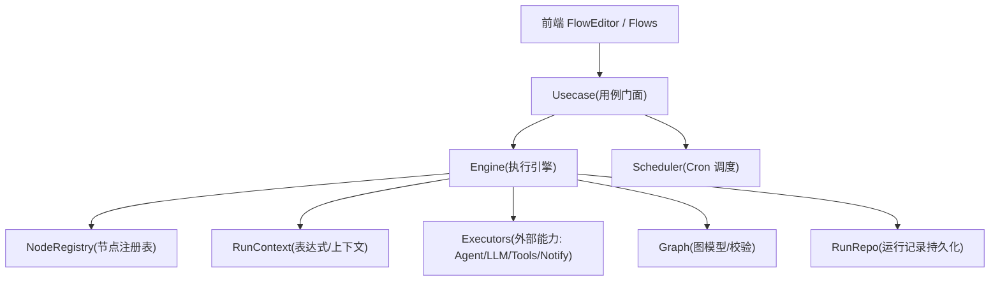
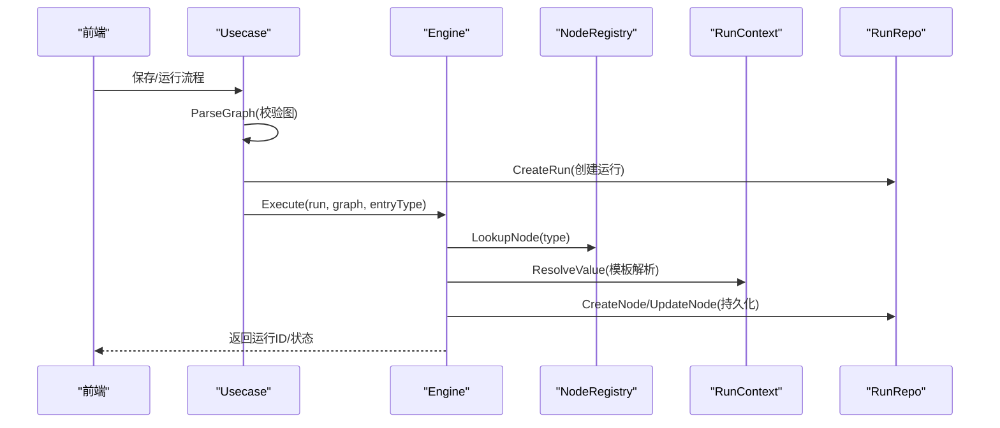
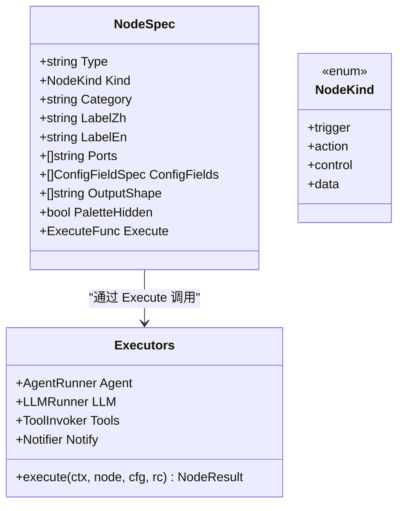
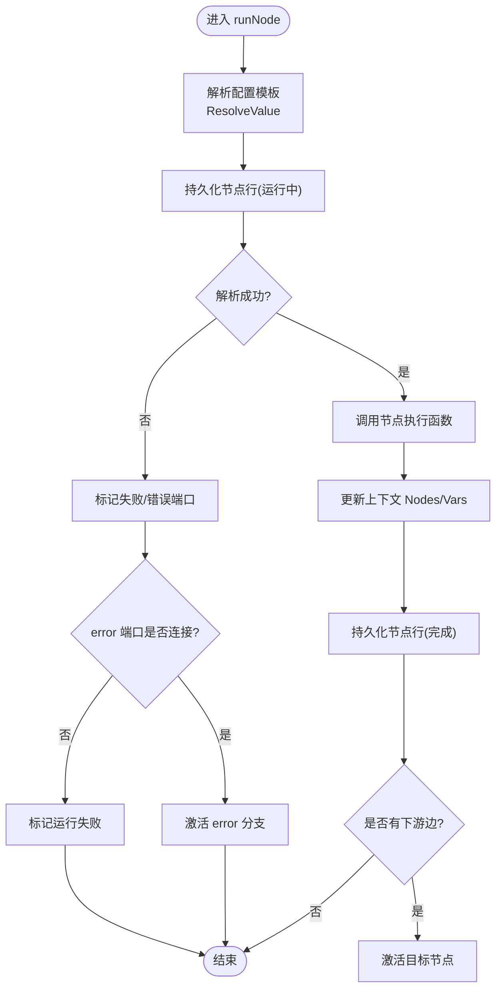
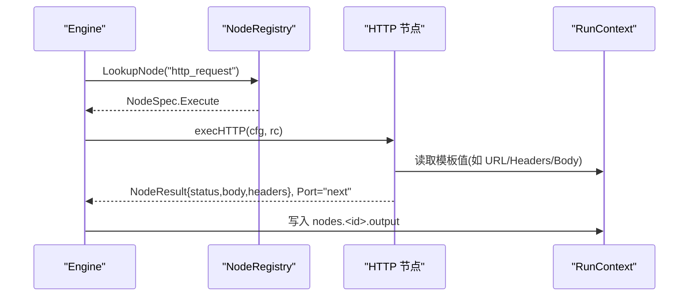
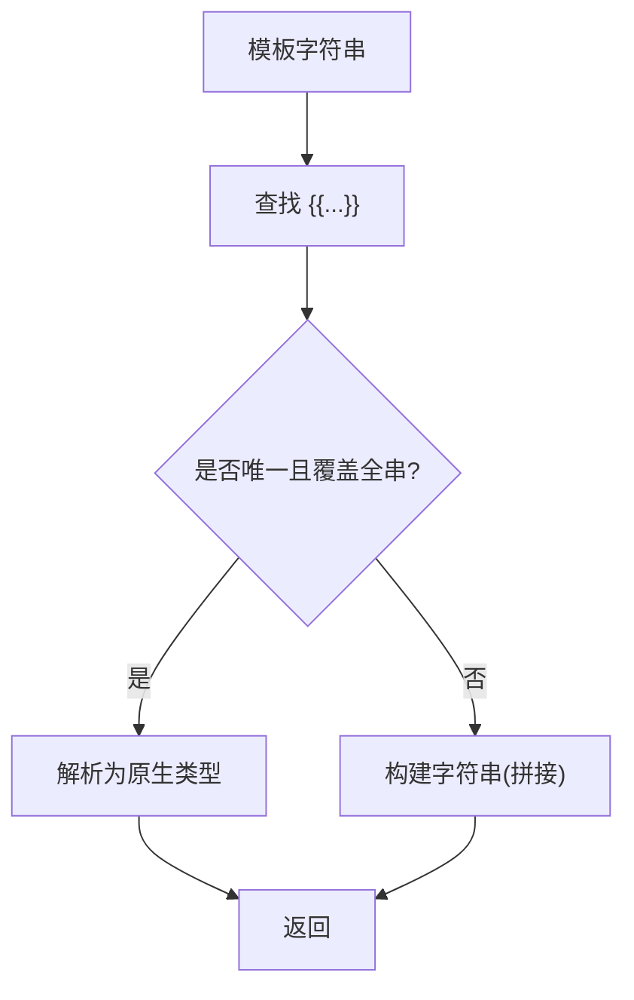
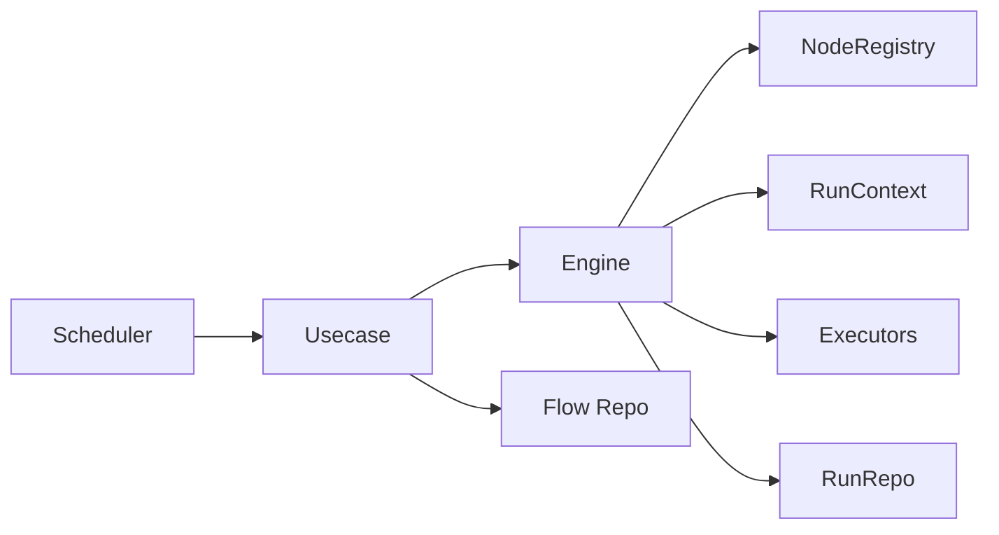

# 节点系统

<cite>
**本文引用的文件**   
- [internal/manager/biz/flow/noderegistry.go](file://internal/manager/biz/flow/noderegistry.go)
- [internal/manager/biz/flow/engine.go](file://internal/manager/biz/flow/engine.go)
- [internal/manager/biz/flow/nodes.go](file://internal/manager/biz/flow/nodes.go)
- [internal/manager/biz/flow/scheduler.go](file://internal/manager/biz/flow/scheduler.go)
- [internal/manager/biz/flow/expr.go](file://internal/manager/biz/flow/expr.go)
- [internal/manager/biz/flow/graph.go](file://internal/manager/biz/flow/graph.go)
- [internal/manager/biz/flow/usecase.go](file://internal/manager/biz/flow/usecase.go)
- [internal/manager/biz/flow/http_node.go](file://internal/manager/biz/flow/http_node.go)
- [web/src/pages/FlowEditor.tsx](file://web/src/pages/FlowEditor.tsx)
- [web/src/pages/Flows.tsx](file://web/src/pages/Flows.tsx)
- [docs/workflow-catalog.md](file://docs/workflow-catalog.md)
</cite>

## 目录
1. [简介](#简介)
2. [项目结构](#项目结构)
3. [核心组件](#核心组件)
4. [架构总览](#架构总览)
5. [详细组件分析](#详细组件分析)
6. [依赖关系分析](#依赖关系分析)
7. [性能与并发特性](#性能与并发特性)
8. [故障排查指南](#故障排查指南)
9. [结论](#结论)
10. [附录：自定义节点开发与测试、调试技巧](#附录自定义节点开发与测试调试技巧)

## 简介
本工作流节点系统提供基于有向无环图（DAG）的可视化编排能力。用户通过前端画布定义“节点 + 边”的流程图，后端解析并校验图结构，按触发器启动执行；节点之间通过共享的执行上下文传递数据，边仅控制执行顺序。系统内置多种节点类型（触发器、条件分支、HTTP 请求、变量设置、字段映射、通知、Agent/LLM、工具调用等），并提供定时调度、运行历史持久化、单节点试跑与错误端口处理等能力。

## 项目结构
工作流相关代码集中在 internal/manager/biz/flow 包中，围绕“图模型 + 引擎执行 + 节点注册 + 表达式解析 + 调度器 + 用例门面”分层组织：
- 图模型与校验：graph.go
- 节点类型与注册：noderegistry.go
- 执行引擎与并发控制：engine.go
- 表达式与上下文：expr.go
- 调度器（Cron 触发）：scheduler.go
- 用例门面（CRUD、触发、试跑、清理）：usecase.go
- 内置节点实现：nodes.go、http_node.go
- 前端编辑器与交互：web/src/pages/FlowEditor.tsx、web/src/pages/Flows.tsx
- 示例工作流文档：docs/workflow-catalog.md

**图表来源**
- [internal/manager/biz/flow/usecase.go:179-343](file://internal/manager/biz/flow/usecase.go#L179-L343)
- [internal/manager/biz/flow/engine.go:34-113](file://internal/manager/biz/flow/engine.go#L34-L113)
- [internal/manager/biz/flow/noderegistry.go:63-88](file://internal/manager/biz/flow/noderegistry.go#L63-L88)
- [internal/manager/biz/flow/expr.go:14-23](file://internal/manager/biz/flow/expr.go#L14-L23)
- [internal/manager/biz/flow/graph.go:97-112](file://internal/manager/biz/flow/graph.go#L97-L112)
- [internal/manager/biz/flow/scheduler.go:43-69](file://internal/manager/biz/flow/scheduler.go#L43-L69)

**章节来源**
- [internal/manager/biz/flow/graph.go:1-214](file://internal/manager/biz/flow/graph.go#L1-L214)
- [internal/manager/biz/flow/noderegistry.go:1-372](file://internal/manager/biz/flow/noderegistry.go#L1-L372)
- [internal/manager/biz/flow/engine.go:1-299](file://internal/manager/biz/flow/engine.go#L1-L299)
- [internal/manager/biz/flow/expr.go:1-321](file://internal/manager/biz/flow/expr.go#L1-L321)
- [internal/manager/biz/flow/scheduler.go:1-139](file://internal/manager/biz/flow/scheduler.go#L1-L139)
- [internal/manager/biz/flow/usecase.go:1-410](file://internal/manager/biz/flow/usecase.go#L1-L410)
- [web/src/pages/FlowEditor.tsx:125-149](file://web/src/pages/FlowEditor.tsx#L125-L149)
- [web/src/pages/Flows.tsx:1-301](file://web/src/pages/Flows.tsx#L1-L301)
- [docs/workflow-catalog.md:97-112](file://docs/workflow-catalog.md#L97-L112)

## 核心组件
- 节点类型与注册：通过 NodeSpec 声明节点的结构行为（Kind）、分类（Category）、控制端口（Ports）、配置表单（ConfigFields）、输出形状（OutputShape）和执行函数（Execute）。新增节点只需注册一个 Spec，无需修改引擎核心。
- 执行引擎：负责从触发器启动执行、并发扇出、OR-join 执行一次语义、错误端口路由、状态持久化与上下文更新。
- 表达式与上下文：支持 {{trigger.*}}、{{nodes.<id>.output.<path>}}、{{vars.<name>}} 模板解析，以及条件表达式求值（==、!=、>、>=、<、<=、contains）。
- 调度器：周期扫描启用的流程，匹配 trigger.cron 节点，按标准 cron 表达式在 UTC 时间触发。
- 用例门面：封装流程 CRUD、手动触发、事件触发、单节点试跑、运行历史清理等。

**章节来源**
- [internal/manager/biz/flow/noderegistry.go:18-88](file://internal/manager/biz/flow/noderegistry.go#L18-L88)
- [internal/manager/biz/flow/engine.go:34-113](file://internal/manager/biz/flow/engine.go#L34-L113)
- [internal/manager/biz/flow/expr.go:14-23](file://internal/manager/biz/flow/expr.go#L14-L23)
- [internal/manager/biz/flow/scheduler.go:25-69](file://internal/manager/biz/flow/scheduler.go#L25-L69)
- [internal/manager/biz/flow/usecase.go:23-74](file://internal/manager/biz/flow/usecase.go#L23-L74)

## 架构总览
下图展示了从前端到后端的完整调用链：用户在前端编辑流程图并保存或运行；后端用例层解析图并创建运行实例；引擎根据触发器并发执行节点，并通过注册表查找对应节点执行函数；执行过程中使用 RunContext 进行模板解析与变量传递；结果持久化并可查询。

**图表来源**
- [internal/manager/biz/flow/usecase.go:277-343](file://internal/manager/biz/flow/usecase.go#L277-L343)
- [internal/manager/biz/flow/graph.go:97-112](file://internal/manager/biz/flow/graph.go#L97-L112)
- [internal/manager/biz/flow/engine.go:67-113](file://internal/manager/biz/flow/engine.go#L67-L113)
- [internal/manager/biz/flow/noderegistry.go:63-88](file://internal/manager/biz/flow/noderegistry.go#L63-L88)
- [internal/manager/biz/flow/expr.go:55-84](file://internal/manager/biz/flow/expr.go#L55-L84)

## 详细组件分析

### 节点类型定义与注册机制
- 节点种类（NodeKind）：trigger、action、control、data，用于区分结构性行为，避免对 Type 字符串硬编码判断。
- 节点规格（NodeSpec）：包含类型、种类、分类、标签、控制端口、配置字段、输出形状、是否隐藏、执行函数。
- 注册表：全局 map 维护 type→spec，提供 RegisterNode、LookupNode、AllNodeSpecs。
- 内置节点：在 init 时自动注册，包括手动触发、告警触发、定时触发、Agent、LLM、工具、条件、通知、变量、字段映射、HTTP 请求等。

**图表来源**
- [internal/manager/biz/flow/noderegistry.go:18-88](file://internal/manager/biz/flow/noderegistry.go#L18-L88)
- [internal/manager/biz/flow/nodes.go:60-86](file://internal/manager/biz/flow/nodes.go#L60-L86)

**章节来源**
- [internal/manager/biz/flow/noderegistry.go:18-197](file://internal/manager/biz/flow/noderegistry.go#L18-L197)

### 节点执行接口与引擎调度
- 执行接口：ExecuteFunc 统一签名，接收上下文、外部能力注入、已解析的配置、只读执行上下文，返回数据输出与控制端口或错误。
- 引擎执行：
  - 从触发器开始，支持 entryType 限定入口。
  - 并发扇出，限制最大并发节点数。
  - OR-join + execute-once：同一节点在一次运行中仅执行一次。
  - 错误端口：若连接 error 端口则继续；否则标记运行失败。
  - 上下文更新：成功时将节点输出写入 RunContext.Nodes，变量写回在锁内安全合并。
  - 持久化：每个节点执行前后写入输入/输出 JSON、状态、端口、错误信息。

**图表来源**
- [internal/manager/biz/flow/engine.go:161-260](file://internal/manager/biz/flow/engine.go#L161-L260)

**章节来源**
- [internal/manager/biz/flow/engine.go:34-113](file://internal/manager/biz/flow/engine.go#L34-L113)
- [internal/manager/biz/flow/engine.go:161-260](file://internal/manager/biz/flow/engine.go#L161-L260)

### 内置节点类型实现
- HTTP 请求节点：支持方法、URL、头、体、超时；响应体限制大小；默认 Content-Type；错误走 error 端口。
- 条件分支节点：表达式求值，输出 true/false 端口；支持比较运算符与 contains。
- 循环节点：当前版本未提供循环节点；可通过组合条件与变量实现简单循环逻辑（P2 规划中可能引入 merge/parallel-join）。
- 其他内置节点：
  - 触发器：manual/alert/cron，输出触发负载。
  - Agent/LLM：支持结构化输出 schema，将自由文本解析为 structured。
  - 工具：通过 ToolInvoker 调用，参数来自 BaseTool schema。
  - 通知：发送消息到指定渠道。
  - 变量/字段映射：设置变量、重组上游数据。

**图表来源**
- [internal/manager/biz/flow/http_node.go:22-83](file://internal/manager/biz/flow/http_node.go#L22-L83)
- [internal/manager/biz/flow/noderegistry.go:184-196](file://internal/manager/biz/flow/noderegistry.go#L184-L196)
- [internal/manager/biz/flow/engine.go:221-231](file://internal/manager/biz/flow/engine.go#L221-L231)

**章节来源**
- [internal/manager/biz/flow/http_node.go:1-83](file://internal/manager/biz/flow/http_node.go#L1-L83)
- [internal/manager/biz/flow/noderegistry.go:93-197](file://internal/manager/biz/flow/noderegistry.go#L93-L197)

### 输入输出处理、配置模板解析与变量替换
- 模板语法：{{trigger.x}}、{{nodes.<id>.output.<path>}}、{{vars.<name>}}。
- 解析策略：
  - 整串模板解析为原生类型（数字/对象/布尔），混合文本则拼接字符串。
  - 路径支持对象键与数组索引，如 result.results[0].host_load.cpu_pct。
  - 条件表达式支持 ==、!=、>、>=、<、<=、contains，且能正确跳过引号与模板块内的操作符。
- 变量作用域：
  - trigger：触发负载。
  - nodes：已执行节点的输出。
  - vars：由 set 节点写入，线程安全合并。

**图表来源**
- [internal/manager/biz/flow/expr.go:27-53](file://internal/manager/biz/flow/expr.go#L27-L53)
- [internal/manager/biz/flow/expr.go:86-139](file://internal/manager/biz/flow/expr.go#L86-L139)
- [internal/manager/biz/flow/expr.go:183-206](file://internal/manager/biz/flow/expr.go#L183-L206)

**章节来源**
- [internal/manager/biz/flow/expr.go:14-321](file://internal/manager/biz/flow/expr.go#L14-L321)

### 生命周期管理、状态持久化与执行上下文传递
- 生命周期：
  - 创建运行：生成运行 ID、状态、触发类型与负载。
  - 节点执行：记录开始时间、输入 JSON、状态、输出 JSON、端口、错误。
  - 运行结束：记录完成时间与最终状态。
- 持久化：
  - 运行与节点行通过 RunRepo 接口持久化。
  - 启动时清理残留运行（SweepStaleRunning）。
  - 定期清理旧运行（PruneOldRuns，可配置保留天数）。
- 上下文传递：
  - 执行期间共享 RunContext，节点输出以 nodes.<id>.output 形式被下游引用。
  - 变量写入在引擎锁内安全合并，避免竞态。

**章节来源**
- [internal/manager/biz/flow/usecase.go:307-343](file://internal/manager/biz/flow/usecase.go#L307-L343)
- [internal/manager/biz/flow/engine.go:161-260](file://internal/manager/biz/flow/engine.go#L161-L260)
- [internal/manager/biz/flow/usecase.go:372-410](file://internal/manager/biz/flow/usecase.go#L372-L410)

### 调度器（Cron 触发）
- 每 30 秒扫描启用的流程，解析 trigger.cron 节点配置，计算下次触发时间。
- 到达触发时间时，构造 payload 并调用 Usecase.TriggerEvent 启动运行。
- 同时每小时执行一次运行历史清理。

**章节来源**
- [internal/manager/biz/flow/scheduler.go:25-139](file://internal/manager/biz/flow/scheduler.go#L25-L139)

### 前端集成与交互
- 条件节点 UI：显示真/假两个输出端口，便于明确分支来源。
- 单节点试跑：支持 tool/llm/agent 节点隔离执行，查看真实输出，便于下游引用字段设计。
- 流程列表与创建：支持 AI 生成流程、名称创建、运行、启用/禁用、删除。

**章节来源**
- [web/src/pages/FlowEditor.tsx:125-149](file://web/src/pages/FlowEditor.tsx#L125-L149)
- [web/src/pages/FlowEditor.tsx:961-996](file://web/src/pages/FlowEditor.tsx#L961-L996)
- [web/src/pages/Flows.tsx:1-301](file://web/src/pages/Flows.tsx#L1-L301)

## 依赖关系分析
- 耦合与内聚：
  - 引擎与注册表松耦合：通过 LookupNode 动态分发，新增节点无需改动引擎。
  - 执行器与外部能力通过接口解耦（AgentRunner、LLMRunner、ToolInvoker、Notifier），便于测试与替换。
  - 图模型与校验独立，确保保存与执行前均经过严格验证。
- 直接/间接依赖：
  - Engine 依赖 Graph、RunContext、Executors、RunRepo。
  - Usecase 依赖 Repo、RunRepo、Engine、Logger。
  - Scheduler 依赖 Usecase 与 cron 库。
- 外部集成点：
  - Agent/LLM/Tools/Notify 通过接口注入，具体实现在主程序装配。
  - 数据库通过 GORM 存储运行与节点行。

**图表来源**
- [internal/manager/biz/flow/engine.go:34-113](file://internal/manager/biz/flow/engine.go#L34-L113)
- [internal/manager/biz/flow/usecase.go:23-74](file://internal/manager/biz/flow/usecase.go#L23-L74)
- [internal/manager/biz/flow/scheduler.go:25-69](file://internal/manager/biz/flow/scheduler.go#L25-L69)

**章节来源**
- [internal/manager/biz/flow/engine.go:1-299](file://internal/manager/biz/flow/engine.go#L1-L299)
- [internal/manager/biz/flow/usecase.go:1-410](file://internal/manager/biz/flow/usecase.go#L1-L410)
- [internal/manager/biz/flow/scheduler.go:1-139](file://internal/manager/biz/flow/scheduler.go#L1-L139)

## 性能与并发特性
- 并发控制：最大并发节点数限制，防止宽图导致资源耗尽。
- 超时保护：各节点类型设置不同超时（默认节点、Agent、LLM），避免长时间阻塞。
- 资源限制：HTTP 响应体限制大小，防止大负载影响运行。
- 历史清理：运行记录按保留天数定期清理，控制存储增长。

**章节来源**
- [internal/manager/biz/flow/engine.go:30-33](file://internal/manager/biz/flow/engine.go#L30-L33)
- [internal/manager/biz/flow/nodes.go:68-75](file://internal/manager/biz/flow/nodes.go#L68-L75)
- [internal/manager/biz/flow/http_node.go:18-20](file://internal/manager/biz/flow/http_node.go#L18-L20)
- [internal/manager/biz/flow/usecase.go:53-56](file://internal/manager/biz/flow/usecase.go#L53-L56)
- [internal/manager/biz/flow/usecase.go:388-410](file://internal/manager/biz/flow/usecase.go#L388-L410)

## 故障排查指南
- 常见错误：
  - 未知节点类型：检查是否已注册或图校验失败。
  - 配置解析失败：检查模板路径是否正确、上游节点是否已执行。
  - 条件表达式错误：确认操作符位置不在引号或模板块内。
  - 外部能力未接入：Agent/LLM/Tools/Notify 接口未注入会导致对应节点报错。
- 调试建议：
  - 使用单节点试跑查看真实输出与错误信息。
  - 查看运行与节点行的输入/输出 JSON，定位数据流转问题。
  - 关注错误端口连接，确保异常分支正确处理。
  - 检查 Cron 表达式合法性与触发时间。

**章节来源**
- [internal/manager/biz/flow/engine.go:204-260](file://internal/manager/biz/flow/engine.go#L204-L260)
- [internal/manager/biz/flow/expr.go:183-206](file://internal/manager/biz/flow/expr.go#L183-L206)
- [internal/manager/biz/flow/usecase.go:185-221](file://internal/manager/biz/flow/usecase.go#L185-L221)

## 结论
该节点系统以注册表驱动的方式实现了可扩展的工作流编排，结合 DAG 执行引擎、表达式解析与调度器，提供了完整的流程定义、执行、监控与运维能力。内置节点覆盖了常见的自动化场景，同时通过接口抽象与严格校验保证了系统的稳定性与可测试性。未来可在合并节点、并行 join、循环控制等方面进一步增强。

## 附录：自定义节点开发与测试、调试技巧

### 自定义节点开发指南
- 步骤：
  1. 定义 NodeSpec：填写 Type、Kind、Category、Label、Ports、ConfigFields、OutputShape、Execute。
  2. 实现 Execute 函数：接收已解析配置与上下文，返回 NodeResult（输出数据与控制端口）。
  3. 注册节点：调用 RegisterNode 在初始化阶段注册。
  4. 接入外部能力：如需调用 Agent/LLM/Tools/Notify，通过 Executors 接口注入。
- 注意事项：
  - 保持 Execute 无状态，避免捕获可变全局变量。
  - 合理设置超时与错误处理，错误会路由到 error 端口或标记运行失败。
  - 输出形状应清晰，便于下游引用。

**章节来源**
- [internal/manager/biz/flow/noderegistry.go:35-88](file://internal/manager/biz/flow/noderegistry.go#L35-L88)
- [internal/manager/biz/flow/nodes.go:17-86](file://internal/manager/biz/flow/nodes.go#L17-L86)

### 节点测试方法
- 单节点试跑：通过 Usecase.TestNode 隔离执行节点，查看输出与错误，适合调试模板与参数。
- 单元测试：使用 fakes 模拟外部能力，验证节点逻辑与边界情况。
- 端到端测试：构建完整流程，验证多节点协作与错误路由。

**章节来源**
- [internal/manager/biz/flow/usecase.go:185-221](file://internal/manager/biz/flow/usecase.go#L185-L221)

### 调试技巧
- 查看运行与节点行：获取输入/输出 JSON，定位数据流转问题。
- 使用错误端口：将异常分支连接到日志或重试节点，提升容错性。
- 检查 Cron 表达式：确保格式正确且触发时间符合预期。
- 前端试跑：利用 FlowEditor 的单节点试跑功能快速验证节点行为。

**章节来源**
- [internal/manager/biz/flow/usecase.go:345-359](file://internal/manager/biz/flow/usecase.go#L345-L359)
- [web/src/pages/FlowEditor.tsx:961-996](file://web/src/pages/FlowEditor.tsx#L961-L996)

### 节点组合模式与复杂工作流构建示例
- 组合模式：
  - 条件分支：使用 condition 节点将流程分为真/假两条路径。
  - 错误处理：连接 error 端口到重试或告警节点。
  - 数据重组：使用 transform 节点将上游数据转换为下游需要的结构。
- 复杂工作流示例：
  - 平台快照：查询指标 → 设备列表 → 拓扑信息。
  - k8s 集群巡检：命名空间 → Pod 列表 → 事件列表。
  - 主机健康巡检：主机负载 → 进程列表 → 边缘摘要。
  - 告警与变更审计：告警规则 → 事件 → 变更事件。
  - 事件关联诊断：事件查询 → 关联分析。

**章节来源**
- [docs/workflow-catalog.md:97-112](file://docs/workflow-catalog.md#L97-L112)