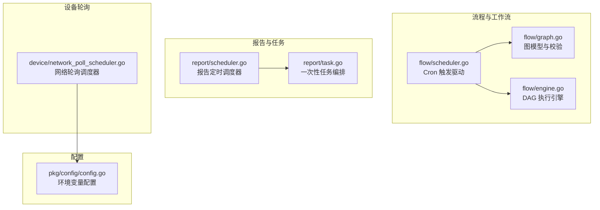
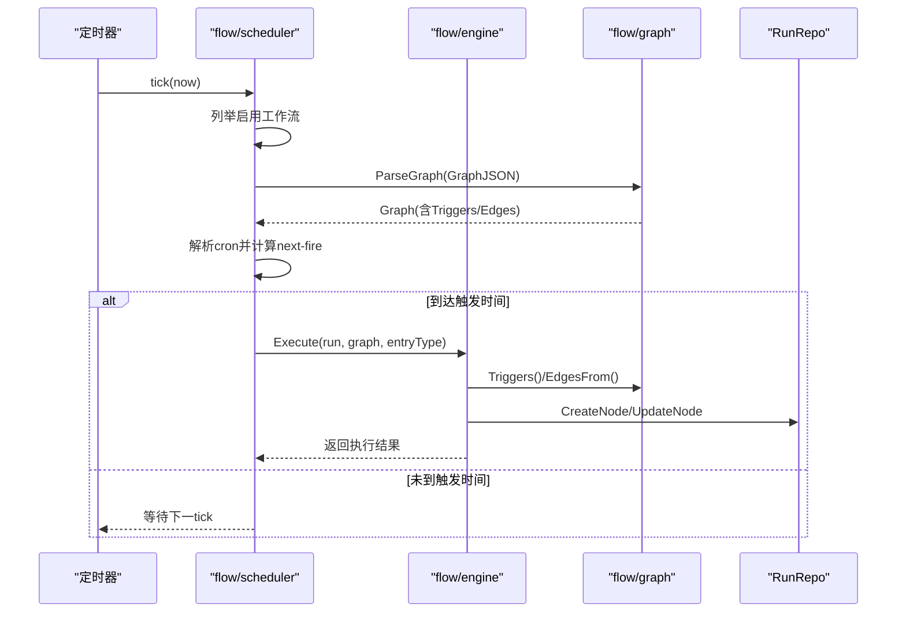
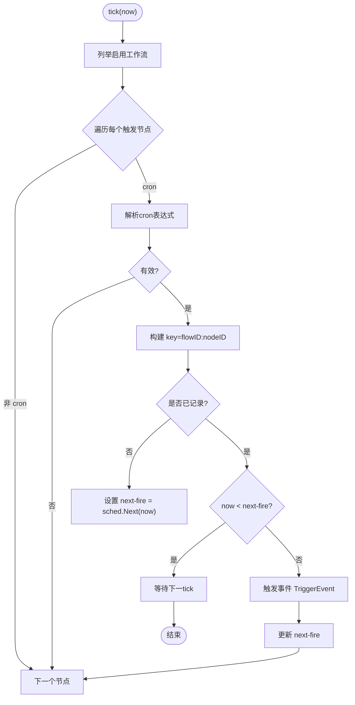
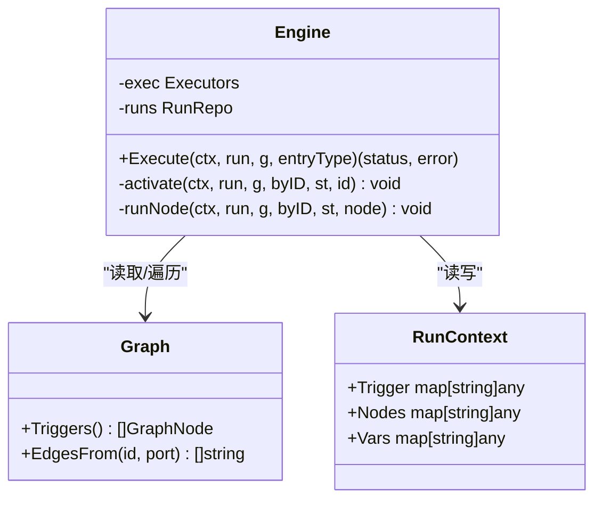
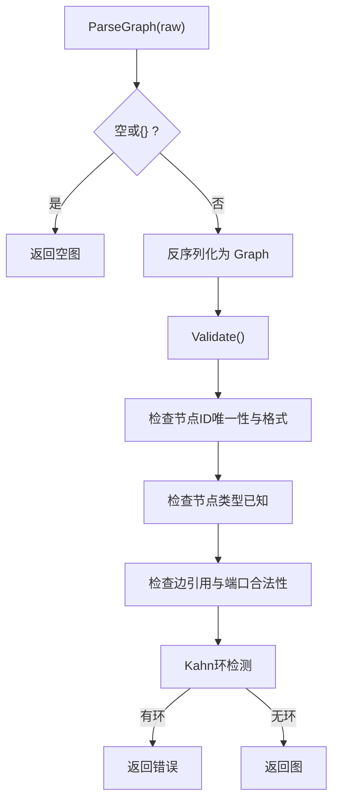
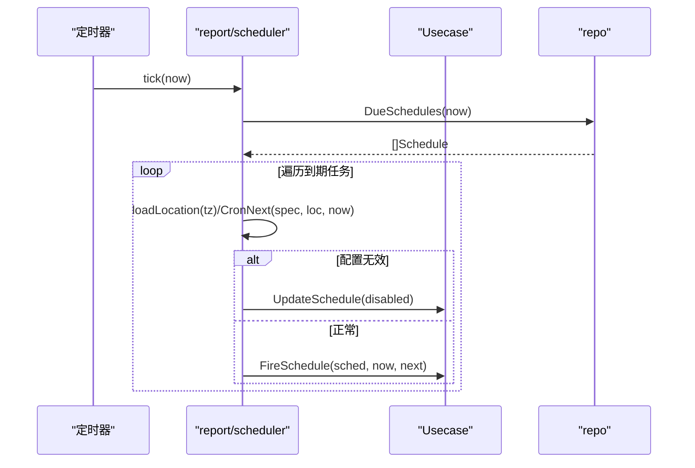
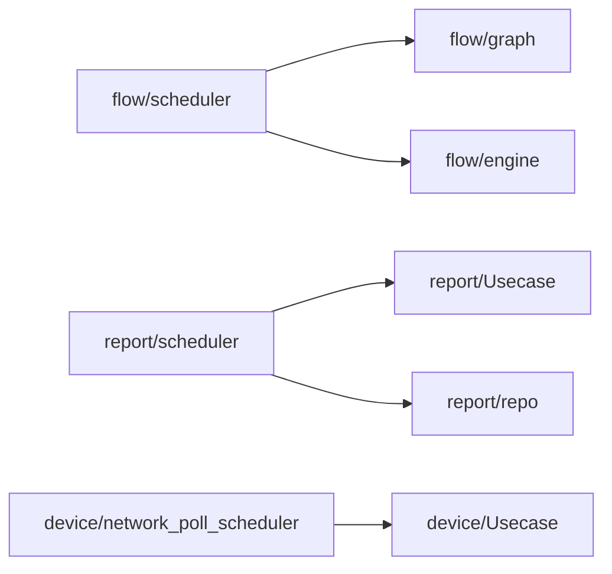

# 调度器

<cite>
**本文引用的文件**
- [internal/manager/biz/flow/scheduler.go](file://internal/manager/biz/flow/scheduler.go)
- [internal/manager/biz/flow/engine.go](file://internal/manager/biz/flow/engine.go)
- [internal/manager/biz/flow/graph.go](file://internal/manager/biz/flow/graph.go)
- [internal/manager/biz/report/scheduler.go](file://internal/manager/biz/report/scheduler.go)
- [internal/manager/biz/device/network_poll_scheduler.go](file://internal/manager/biz/device/network_poll_scheduler.go)
- [internal/manager/biz/report/task.go](file://internal/manager/biz/report/task.go)
- [internal/pkg/config/config.go](file://internal/pkg/config/config.go)
</cite>

## 目录
1. [简介](#简介)
2. [项目结构](#项目结构)
3. [核心组件](#核心组件)
4. [架构总览](#架构总览)
5. [详细组件分析](#详细组件分析)
6. [依赖关系分析](#依赖关系分析)
7. [性能与资源管理](#性能与资源管理)
8. [故障恢复与容错](#故障恢复与容错)
9. [监控指标与可观测性](#监控指标与可观测性)
10. [配置选项与调度策略](#配置选项与调度策略)
11. [使用示例](#使用示例)
12. [常见问题排查](#常见问题排查)
13. [结论](#结论)

## 简介
本文件面向工作流与任务调度子系统，系统性说明调度器的核心能力：基于定时触发的工作流调度、DAG 执行引擎的拓扑排序与依赖解析、并行执行控制、以及报告与网络轮询等任务的周期性调度。文档覆盖调度算法、依赖分析、执行计划生成、资源管理与负载均衡、故障恢复、监控指标、性能优化、扩展性设计、配置项与调优建议，并提供使用示例与常见问题解决方案。

## 项目结构
调度相关代码主要分布在 manager 业务层：
- flow 子包：工作流图模型、解析校验、DAG 执行引擎、Cron 触发驱动
- report 子包：报告类定时任务调度器与一次性任务编排
- device 子包：网络设备轮询调度器（通过边设备隧道进行 SNMP 轮询）
- pkg/config：运行时配置加载与环境变量映射

**图表来源**
- [internal/manager/biz/flow/graph.go:1-214](file://internal/manager/biz/flow/graph.go#L1-L214)
- [internal/manager/biz/flow/engine.go:1-299](file://internal/manager/biz/flow/engine.go#L1-L299)
- [internal/manager/biz/flow/scheduler.go:1-139](file://internal/manager/biz/flow/scheduler.go#L1-L139)
- [internal/manager/biz/report/scheduler.go:1-115](file://internal/manager/biz/report/scheduler.go#L1-L115)
- [internal/manager/biz/device/network_poll_scheduler.go:1-51](file://internal/manager/biz/device/network_poll_scheduler.go#L1-L51)
- [internal/pkg/config/config.go:1-200](file://internal/pkg/config/config.go#L1-L200)

**章节来源**
- [internal/manager/biz/flow/graph.go:1-214](file://internal/manager/biz/flow/graph.go#L1-L214)
- [internal/manager/biz/flow/engine.go:1-299](file://internal/manager/biz/flow/engine.go#L1-L299)
- [internal/manager/biz/flow/scheduler.go:1-139](file://internal/manager/biz/flow/scheduler.go#L1-L139)
- [internal/manager/biz/report/scheduler.go:1-115](file://internal/manager/biz/report/scheduler.go#L1-L115)
- [internal/manager/biz/device/network_poll_scheduler.go:1-51](file://internal/manager/biz/device/network_poll_scheduler.go#L1-L51)
- [internal/pkg/config/config.go:1-200](file://internal/pkg/config/config.go#L1-L200)

## 核心组件
- 工作流 Cron 触发器：周期扫描已启用工作流，解析 cron 表达式并触发对应节点
- DAG 执行引擎：对图进行拓扑校验与执行，支持 OR-join、错误端口分支、并发扇出限制
- 报告定时调度器：按分钟粒度扫描到期任务，计算下次触发时间并串行触发
- 网络轮询调度器：以固定间隔顺序轮询到期设备，避免并发风暴
- 一次性任务编排：创建并立即生成报告，关联任务标识

**章节来源**
- [internal/manager/biz/flow/scheduler.go:25-49](file://internal/manager/biz/flow/scheduler.go#L25-L49)
- [internal/manager/biz/flow/engine.go:34-113](file://internal/manager/biz/flow/engine.go#L34-L113)
- [internal/manager/biz/report/scheduler.go:16-45](file://internal/manager/biz/report/scheduler.go#L16-L45)
- [internal/manager/biz/device/network_poll_scheduler.go:9-23](file://internal/manager/biz/device/network_poll_scheduler.go#L9-L23)
- [internal/manager/biz/report/task.go:16-55](file://internal/manager/biz/report/task.go#L16-L55)

## 架构总览
调度器由多个“定时器 + 处理器”组成：
- flow/scheduler：每 30 秒 tick，列举启用的工作流，解析 cron，维护 next-fire 时间，命中则触发事件
- report/scheduler：每分钟 tick，查询到期 schedule，计算下次触发时间，调用 Usecase 触发
- device/network_poll_scheduler：每 30 秒 tick，批量轮询到期设备（上限 10），顺序执行
- engine：接收触发后，解析图、拓扑校验、并发执行节点、持久化节点运行状态、沿控制端口传播

**图表来源**
- [internal/manager/biz/flow/scheduler.go:51-130](file://internal/manager/biz/flow/scheduler.go#L51-L130)
- [internal/manager/biz/flow/engine.go:67-113](file://internal/manager/biz/flow/engine.go#L67-L113)
- [internal/manager/biz/flow/graph.go:97-187](file://internal/manager/biz/flow/graph.go#L97-L187)

## 详细组件分析

### 工作流 Cron 触发器（flow/scheduler）
- 职责：周期扫描启用工作流，解析 cron 表达式，维护内存中的 next-fire 表，到点触发事件
- 关键机制：
  - 每 30 秒 tick，UTC 时间比较
  - 首次发现时设置 next-fire 不立即触发；后续若 now >= next-fire 则触发并重新计算
  - 清理不再存在或编辑过的 schedule 条目
  - 附带保留清理（每小时）

**图表来源**
- [internal/manager/biz/flow/scheduler.go:51-130](file://internal/manager/biz/flow/scheduler.go#L51-L130)

**章节来源**
- [internal/manager/biz/flow/scheduler.go:25-49](file://internal/manager/biz/flow/scheduler.go#L25-L49)
- [internal/manager/biz/flow/scheduler.go:51-130](file://internal/manager/biz/flow/scheduler.go#L51-L130)

### DAG 执行引擎（flow/engine）
- 职责：根据触发入口启动图执行，维护运行上下文、节点执行状态、并发控制、错误处理与持久化
- 调度语义：
  - 从所有 trigger 节点开始（可按类型过滤）
  - 节点完成后仅发射一个控制端口，沿该端口的边激活目标（扇出并发，受限）
  - OR-join + execute-once：节点首次被任何入边激活即执行，后续激活为 no-op
  - 错误处理：若连接 error 端口则走错误分支，否则标记 run 失败
- 并发控制：全局信号量限制最大并发节点数（默认 4）

**图表来源**
- [internal/manager/biz/flow/engine.go:34-113](file://internal/manager/biz/flow/engine.go#L34-L113)
- [internal/manager/biz/flow/graph.go:189-213](file://internal/manager/biz/flow/graph.go#L189-L213)

**章节来源**
- [internal/manager/biz/flow/engine.go:30-113](file://internal/manager/biz/flow/engine.go#L30-L113)
- [internal/manager/biz/flow/engine.go:115-260](file://internal/manager/biz/flow/engine.go#L115-L260)

### 图模型与拓扑校验（flow/graph）
- 职责：定义节点类型、控制端口、边与图结构；提供解析与强约束校验
- 拓扑与依赖：
  - 唯一且合法的节点 ID
  - 已知节点类型
  - 边引用存在的源/目标节点，且源端口合法
  - 禁止指向 trigger 节点的入边
  - 环检测（Kahn 算法）

**图表来源**
- [internal/manager/biz/flow/graph.go:97-187](file://internal/manager/biz/flow/graph.go#L97-L187)

**章节来源**
- [internal/manager/biz/flow/graph.go:24-76](file://internal/manager/biz/flow/graph.go#L24-L76)
- [internal/manager/biz/flow/graph.go:97-187](file://internal/manager/biz/flow/graph.go#L97-L187)

### 报告定时调度器（report/scheduler）
- 职责：每分钟 tick，查询到期 schedule，计算下次触发时间，调用 Usecase 触发
- 特性：
  - 单 goroutine 驱动 tick，串行触发，避免风暴
  - 对无效 timezone/cron 自动禁用 schedule
  - 通过 Usecase 去重与重设下次触发时间

**图表来源**
- [internal/manager/biz/report/scheduler.go:47-114](file://internal/manager/biz/report/scheduler.go#L47-L114)

**章节来源**
- [internal/manager/biz/report/scheduler.go:11-45](file://internal/manager/biz/report/scheduler.go#L11-L45)
- [internal/manager/biz/report/scheduler.go:62-114](file://internal/manager/biz/report/scheduler.go#L62-L114)

### 网络轮询调度器（device/network_poll_scheduler）
- 职责：周期扫描到期设备并通过边设备隧道进行 SNMP 轮询
- 特点：
  - 每次最多轮询 10 个设备，顺序执行，避免并发压力
  - 异常保护，panic 捕获不影响主循环

**章节来源**
- [internal/manager/biz/device/network_poll_scheduler.go:9-51](file://internal/manager/biz/device/network_poll_scheduler.go#L9-L51)

### 一次性任务编排（report/task）
- 职责：创建一次性任务并立即生成报告，将产物归属到任务
- 行为：
  - 自动生成标题与周期
  - 生成失败不影响任务行可见性，用户可重试

**章节来源**
- [internal/manager/biz/report/task.go:16-55](file://internal/manager/biz/report/task.go#L16-L55)

## 依赖关系分析
- flow/scheduler 依赖 flow/graph 解析与校验，依赖 flow/engine 执行
- report/scheduler 依赖 repo 查询到期任务，依赖 Usecase 触发与重设
- device/network_poll_scheduler 依赖 Usecase 进行设备轮询
- 各调度器均依赖日志与上下文生命周期管理

**图表来源**
- [internal/manager/biz/flow/scheduler.go:51-130](file://internal/manager/biz/flow/scheduler.go#L51-L130)
- [internal/manager/biz/report/scheduler.go:47-114](file://internal/manager/biz/report/scheduler.go#L47-L114)
- [internal/manager/biz/device/network_poll_scheduler.go:25-51](file://internal/manager/biz/device/network_poll_scheduler.go#L25-L51)

**章节来源**
- [internal/manager/biz/flow/scheduler.go:51-130](file://internal/manager/biz/flow/scheduler.go#L51-L130)
- [internal/manager/biz/report/scheduler.go:47-114](file://internal/manager/biz/report/scheduler.go#L47-L114)
- [internal/manager/biz/device/network_poll_scheduler.go:25-51](file://internal/manager/biz/device/network_poll_scheduler.go#L25-L51)

## 性能与资源管理
- 并发控制：DAG 引擎限制最大并发节点数为 4，防止宽图导致无限并发
- 批处理与节流：
  - 报告调度器每分钟一次 tick，串行触发，避免 LLM 风暴
  - 网络轮询每次最多 10 个设备，顺序执行
- 资源回收：
  - flow/scheduler 每小时清理旧运行记录
  - 无效 schedule 自动禁用，减少无效扫描

优化建议：
- 根据工作流复杂度调整并发上限（当前硬编码为 4）
- 合理设置 tick 间隔与批次大小，平衡延迟与吞吐
- 对耗时节点引入超时与熔断，避免阻塞下游

**章节来源**
- [internal/manager/biz/flow/engine.go:30-33](file://internal/manager/biz/flow/engine.go#L30-L33)
- [internal/manager/biz/flow/scheduler.go:61-66](file://internal/manager/biz/flow/scheduler.go#L61-L66)
- [internal/manager/biz/report/scheduler.go:11-25](file://internal/manager/biz/report/scheduler.go#L11-L25)
- [internal/manager/biz/device/network_poll_scheduler.go:9-23](file://internal/manager/biz/device/network_poll_scheduler.go#L9-L23)

## 故障恢复与容错
- 引擎级 panic 保护：顶层 recover 标记 run 失败并记录堆栈
- 节点级 panic 保护：每个 fan-out goroutine 独立 recover，标记失败并继续其他分支
- 错误端口分支：节点错误若连接 error 端口，则走错误分支，否则标记 run 失败
- 调度器健壮性：
  - 报告调度器对 bad tz/cron 自动禁用 schedule
  - 网络轮询调度器捕获 panic 并继续循环
  - flow/scheduler 忽略无效 cron，继续处理其他触发

**章节来源**
- [internal/manager/biz/flow/engine.go:67-74](file://internal/manager/biz/flow/engine.go#L67-L74)
- [internal/manager/biz/flow/engine.go:139-154](file://internal/manager/biz/flow/engine.go#L139-L154)
- [internal/manager/biz/flow/engine.go:237-255](file://internal/manager/biz/flow/engine.go#L237-L255)
- [internal/manager/biz/report/scheduler.go:75-114](file://internal/manager/biz/report/scheduler.go#L75-L114)
- [internal/manager/biz/device/network_poll_scheduler.go:29-49](file://internal/manager/biz/device/network_poll_scheduler.go#L29-L49)

## 监控指标与可观测性
- 日志：各调度器使用 slog 记录关键事件（启动、停止、错误、触发）
- 可观测性建议：
  - 暴露 Prometheus 指标：tick 次数、触发次数、失败次数、平均/分位延迟
  - 追踪：为长耗时节点与外部调用添加 span
  - 告警：对持续失败、长时间未触发、队列堆积等设置告警

[本节为通用指导，不直接分析具体文件]

## 配置选项与调度策略
- 环境变量配置（部分与调度相关）：
  - 通知通道开关与超时：影响触发后的通知发送
  - 技能外部目录：影响可执行技能加载
  - 其他系统级配置（如告警评估间隔等）可用于间接影响调度节奏
- 调度策略选择：
  - 工作流：基于 cron 的精确触发 + DAG 并发控制
  - 报告：分钟级扫描 + 串行触发 + 自动禁用无效配置
  - 网络轮询：固定间隔 + 批次上限 + 顺序执行

调优建议：
- 根据业务 SLA 调整 tick 间隔与批次大小
- 对高并发场景考虑增加并发上限或拆分工作流
- 对慢依赖（LLM、外部 API）设置超时与重试策略

**章节来源**
- [internal/pkg/config/config.go:177-200](file://internal/pkg/config/config.go#L177-L200)
- [internal/pkg/config/config.go:536-548](file://internal/pkg/config/config.go#L536-L548)

## 使用示例
- 创建工作流并配置 cron 触发：
  - 在 UI 中定义图节点与边，确保无环且端口合法
  - 为 trigger.cron 节点配置标准 5 字段 cron 表达式（UTC）
  - 保存后，flow/scheduler 会在下一个 tick 发现并 arm
- 创建报告定时任务：
  - 配置 cron 与时区，report/scheduler 会每分钟扫描并触发
  - 若配置无效，会自动禁用并提示修复
- 创建一次性任务：
  - 调用接口创建任务并立即生成报告，便于即时验证

[本节为概念性示例，不直接分析具体文件]

## 常见问题排查
- 工作流未触发：
  - 检查 cron 表达式是否有效（UI 已校验，但服务端仍会跳过无效项）
  - 确认工作流处于启用状态
  - 查看日志中“flow triggered by cron”或“flow cron trigger failed”
- 报告任务未触发：
  - 检查时区与 cron 是否有效，无效会被自动禁用
  - 查看“due schedules query failed”或“fire schedule failed”日志
- 节点执行失败：
  - 检查节点错误端口是否连接，未连接则 run 失败
  - 查看节点运行记录的错误信息与堆栈
- 网络轮询失败：
  - 检查边设备连通性与隧道状态
  - 查看轮询 tick 失败日志

**章节来源**
- [internal/manager/biz/flow/scheduler.go:71-118](file://internal/manager/biz/flow/scheduler.go#L71-L118)
- [internal/manager/biz/report/scheduler.go:62-114](file://internal/manager/biz/report/scheduler.go#L62-L114)
- [internal/manager/biz/device/network_poll_scheduler.go:38-49](file://internal/manager/biz/device/network_poll_scheduler.go#L38-L49)

## 结论
本调度体系以“定时器 + 解析 + 执行”的分层架构实现高内聚、低耦合的调度能力：
- 工作流通过 cron 触发与 DAG 引擎实现复杂业务流程的可靠执行
- 报告与网络轮询采用轻量级周期调度，兼顾延迟与稳定性
- 通过并发限制、错误分支、自动禁用与保留清理等机制保障鲁棒性
- 建议结合监控与告警完善可观测性，并根据业务特征调优并发与批次参数

[本节为总结性内容，不直接分析具体文件]