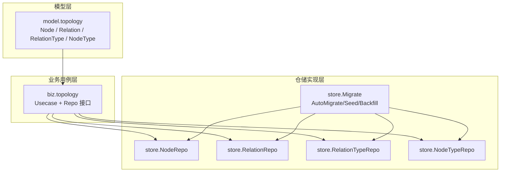
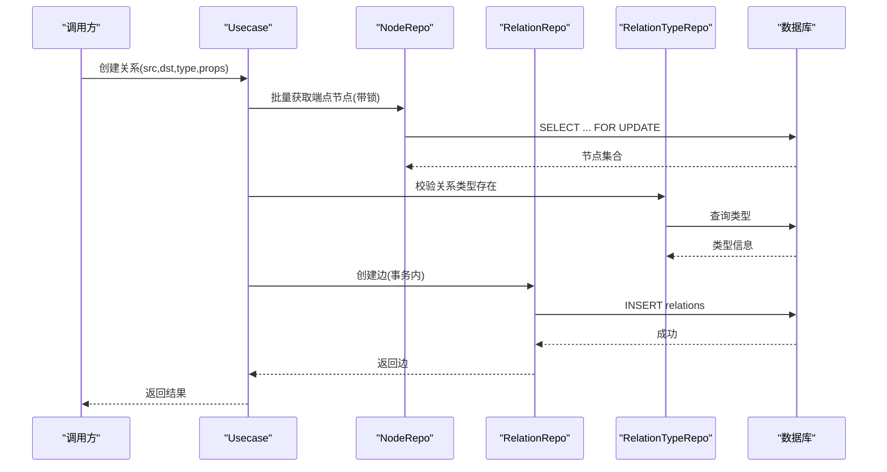
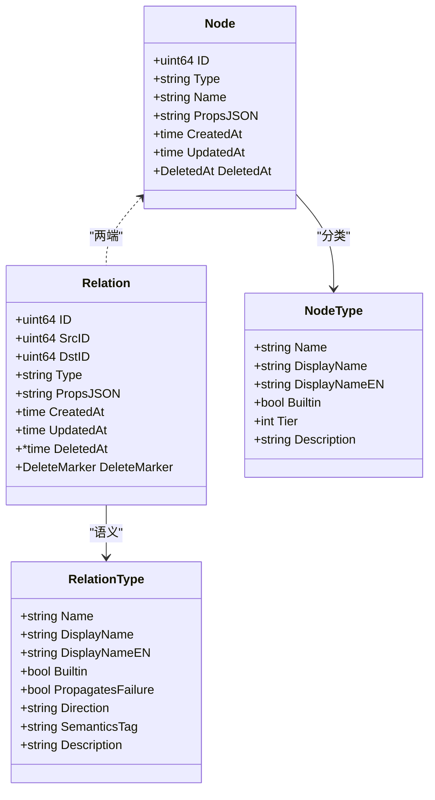
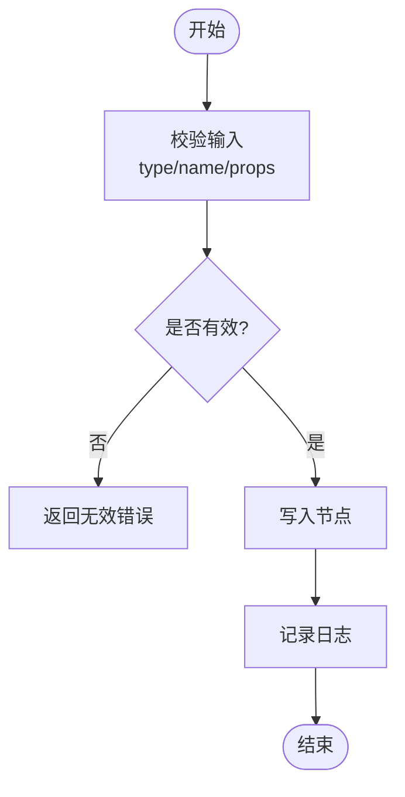
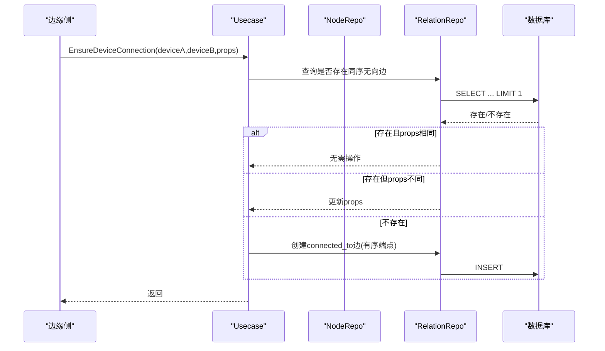
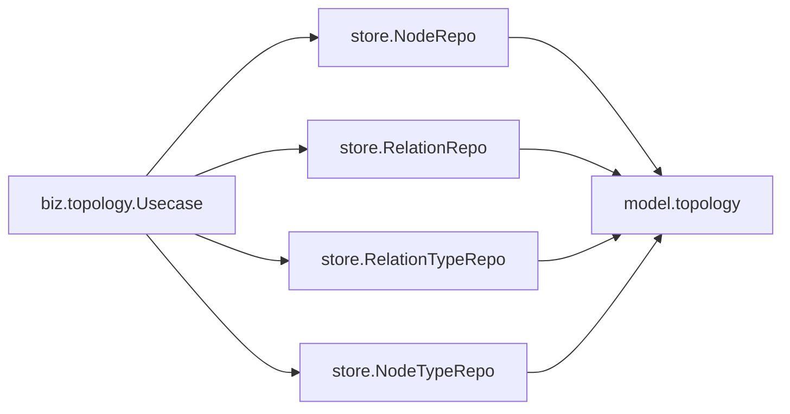

# 拓扑维护

<cite>
**本文引用的文件**
- [internal/manager/model/topology/model.go](file://internal/manager/model/topology/model.go)
- [internal/manager/biz/topology/repo.go](file://internal/manager/biz/topology/repo.go)
- [internal/manager/biz/topology/usecase.go](file://internal/manager/biz/topology/usecase.go)
- [internal/manager/data/topology/store/migrate.go](file://internal/manager/data/topology/store/migrate.go)
- [internal/manager/data/topology/store/node_repo.go](file://internal/manager/data/topology/store/node_repo.go)
- [internal/manager/data/topology/store/relation_repo.go](file://internal/manager/data/topology/store/relation_repo.go)
- [internal/manager/data/topology/store/node_type_repo.go](file://internal/manager/data/topology/store/node_type_repo.go)
- [internal/manager/data/topology/store/relation_type_repo.go](file://internal/manager/data/topology/store/relation_type_repo.go)
</cite>

## 目录
1. [简介](#简介)
2. [项目结构](#项目结构)
3. [核心组件](#核心组件)
4. [架构总览](#架构总览)
5. [详细组件分析](#详细组件分析)
6. [依赖关系分析](#依赖关系分析)
7. [性能与索引优化](#性能与索引优化)
8. [拓扑变更检测、增量更新与全量重建](#拓扑变更检测增量更新与全量重建)
9. [可视化与交互支持](#可视化与交互支持)
10. [备份恢复、版本管理与迁移](#备份恢复版本管理与迁移)
11. [API 接口与使用示例](#api-接口与使用示例)
12. [大规模场景：内存优化与分布式处理](#大规模场景内存优化与分布式处理)
13. [故障排查指南](#故障排查指南)
14. [结论](#结论)

## 简介
本文件系统化阐述拓扑维护机制，覆盖拓扑图构建算法、节点关系映射、连接验证、变更检测与更新策略、存储结构与索引优化、查询性能、可视化与交互、备份恢复与版本管理、API 接口与使用示例，以及大规模拓扑下的内存优化与分布式方案。该机制以“属性图”为核心：所有业务实体（设备、服务、集群、应用、机架等）统一抽象为 Node，边抽象为 Relation，边的语义由 RelationType 描述，从而将拓扑建模与具体领域解耦，便于 AIOps 推理、影响面计算与可视化渲染。

## 项目结构
拓扑子系统按分层组织：
- 模型层：定义 Node、Relation、RelationType、NodeType 及内置类型常量与种子数据。
- 业务用例层：封装拓扑 CRUD、校验规则、设备/集群镜像、成员关系管理等用例。
- 仓储实现层：基于 GORM 的持久化实现，包含节点、关系、类型仓库与迁移脚本。

**图表来源**
- [internal/manager/model/topology/model.go:1-352](file://internal/manager/model/topology/model.go#L1-L352)
- [internal/manager/biz/topology/repo.go:1-90](file://internal/manager/biz/topology/repo.go#L1-L90)
- [internal/manager/data/topology/store/migrate.go:1-114](file://internal/manager/data/topology/store/migrate.go#L1-L114)

**章节来源**
- [internal/manager/model/topology/model.go:1-352](file://internal/manager/model/topology/model.go#L1-L352)
- [internal/manager/biz/topology/repo.go:1-90](file://internal/manager/biz/topology/repo.go#L1-L90)
- [internal/manager/data/topology/store/migrate.go:1-114](file://internal/manager/data/topology/store/migrate.go#L1-L114)

## 核心组件
- 模型与元数据
  - 节点类型与关系类型：内置类型与可注册扩展，提供显示名、层级、语义标签、方向、是否传播故障等元信息。
  - 节点与关系：通用图顶点与有向边，边三元组 (SrcID, DstID, Type) 唯一，支持 props JSON 扩展。
- 业务用例
  - 节点/关系 CRUD、过滤分页、删除保护（引用检查）。
  - 设备到拓扑镜像、网络设备标记、Kubernetes 集群镜像与成员关系同步、自动入网分配、清理与修剪。
  - 连接保证：设备间物理邻接的无向边去重与幂等更新。
- 仓储实现
  - 基于 GORM 的增删改查、事务与锁、软删除、计数与列表过滤。
  - 迁移：表结构自演进、内置类型种子注入、历史数据回填。

**章节来源**
- [internal/manager/model/topology/model.go:27-168](file://internal/manager/model/topology/model.go#L27-L168)
- [internal/manager/model/topology/model.go:219-330](file://internal/manager/model/topology/model.go#L219-L330)
- [internal/manager/biz/topology/usecase.go:48-290](file://internal/manager/biz/topology/usecase.go#L48-L290)
- [internal/manager/data/topology/store/node_repo.go:1-127](file://internal/manager/data/topology/store/node_repo.go#L1-L127)
- [internal/manager/data/topology/store/relation_repo.go:1-145](file://internal/manager/data/topology/store/relation_repo.go#L1-L145)
- [internal/manager/data/topology/store/migrate.go:16-39](file://internal/manager/data/topology/store/migrate.go#L16-L39)

## 架构总览
拓扑维护采用“用例-仓储”分层，业务用例负责校验与编排，仓储负责持久化细节；模型层提供统一的图数据结构与元数据。启动时通过迁移完成建表、种子数据注入与历史数据回填，确保系统可用性与一致性。

**图表来源**
- [internal/manager/biz/topology/usecase.go:150-198](file://internal/manager/biz/topology/usecase.go#L150-L198)
- [internal/manager/data/topology/store/relation_repo.go:23-63](file://internal/manager/data/topology/store/relation_repo.go#L23-L63)
- [internal/manager/data/topology/store/node_repo.go:53-66](file://internal/manager/data/topology/store/node_repo.go#L53-L66)

**章节来源**
- [internal/manager/biz/topology/usecase.go:150-198](file://internal/manager/biz/topology/usecase.go#L150-L198)
- [internal/manager/data/topology/store/relation_repo.go:23-63](file://internal/manager/data/topology/store/relation_repo.go#L23-L63)

## 详细组件分析

### 拓扑图模型与元数据
- 节点类型：应用、服务、集群、设备、机架，提供层级与展示名，用于布局与渲染。
- 关系类型：成员属于、依赖、部署于、复制到、监控、路由到、连接到，标注方向、是否传播故障、语义标签，支撑 AIOps 推理。
- 节点与关系：通用图结构，关系唯一键 (src_id, dst_id, type)，支持 props JSON 扩展。

**图表来源**
- [internal/manager/model/topology/model.go:43-78](file://internal/manager/model/topology/model.go#L43-L78)
- [internal/manager/model/topology/model.go:147-168](file://internal/manager/model/topology/model.go#L147-L168)
- [internal/manager/model/topology/model.go:224-239](file://internal/manager/model/topology/model.go#L224-L239)

**章节来源**
- [internal/manager/model/topology/model.go:43-78](file://internal/manager/model/topology/model.go#L43-L78)
- [internal/manager/model/topology/model.go:147-168](file://internal/manager/model/topology/model.go#L147-L168)
- [internal/manager/model/topology/model.go:224-239](file://internal/manager/model/topology/model.go#L224-L239)

### 节点与关系 CRUD 与校验
- 节点创建/更新/删除：名称必填、props JSON 合法性校验；删除前检查引用关系，防止悬挂指针。
- 关系创建：端点必须存在、禁止自环、props JSON 合法；特定关系（如 member_of）进行归属域校验；关系类型需已注册。
- 列表/计数：支持类型、模糊搜索、分页；关系支持按源/目的或任意一端过滤。

**图表来源**
- [internal/manager/biz/topology/usecase.go:50-75](file://internal/manager/biz/topology/usecase.go#L50-L75)
- [internal/manager/data/topology/store/node_repo.go:24-40](file://internal/manager/data/topology/store/node_repo.go#L24-L40)

**章节来源**
- [internal/manager/biz/topology/usecase.go:50-75](file://internal/manager/biz/topology/usecase.go#L50-L75)
- [internal/manager/data/topology/store/node_repo.go:24-40](file://internal/manager/data/topology/store/node_repo.go#L24-L40)

### 设备与集群镜像、成员关系
- 设备镜像：根据设备名称在拓扑中查找或创建 device 类型节点，并回写 node_id。
- 网络设备标记：为设备节点追加 device_kind=network 以便前端区分渲染。
- Kubernetes 集群镜像：按 clusterID/uid 匹配或创建 cluster 节点，保持 name/props 一致。
- 成员关系：设备到集群的 member_of 关系，支持幂等更新与冲突检测；自动入网分配时限制跨集群移动。
- 清理与修剪：删除 K8s 集群时先清关联边再删节点；按活跃集合修剪过期成员关系。

**图表来源**
- [internal/manager/biz/topology/usecase.go:222-246](file://internal/manager/biz/topology/usecase.go#L222-L246)
- [internal/manager/data/topology/store/relation_repo.go:87-102](file://internal/manager/data/topology/store/relation_repo.go#L87-L102)

**章节来源**
- [internal/manager/biz/topology/usecase.go:222-246](file://internal/manager/biz/topology/usecase.go#L222-L246)
- [internal/manager/data/topology/store/relation_repo.go:87-102](file://internal/manager/data/topology/store/relation_repo.go#L87-L102)

### 删除保护与一致性
- 节点删除：若仍有关系指向该节点则拒绝删除，避免悬挂引用。
- 关系删除：软删除，保留审计与恢复能力。
- 类型删除：类型删除前统计引用数量，防止孤儿关系。

**章节来源**
- [internal/manager/data/topology/store/node_repo.go:95-115](file://internal/manager/data/topology/store/node_repo.go#L95-L115)
- [internal/manager/data/topology/store/relation_repo.go:114-123](file://internal/manager/data/topology/store/relation_repo.go#L114-L123)
- [internal/manager/data/topology/store/relation_type_repo.go:66-75](file://internal/manager/data/topology/store/relation_type_repo.go#L66-L75)

## 依赖关系分析
- 业务用例依赖四个仓储接口：NodeRepo、RelationRepo、RelationTypeRepo、NodeTypeRepo。
- 仓储实现依赖 GORM 与模型定义，并通过迁移脚本初始化数据。
- 模型层被业务与仓储共同复用，保证类型一致。

**图表来源**
- [internal/manager/biz/topology/repo.go:42-89](file://internal/manager/biz/topology/repo.go#L42-L89)
- [internal/manager/model/topology/model.go:43-78](file://internal/manager/model/topology/model.go#L43-L78)

**章节来源**
- [internal/manager/biz/topology/repo.go:42-89](file://internal/manager/biz/topology/repo.go#L42-L89)
- [internal/manager/model/topology/model.go:43-78](file://internal/manager/model/topology/model.go#L43-L78)

## 性能与索引优化
- 节点表索引
  - 复合索引 (type, name) 加速按类型与名称的精确/模糊查询。
  - deleted_at 索引支持软删除过滤。
- 关系表索引
  - 唯一索引 (src_id, dst_id, type) 保障边唯一性并加速按端点与类型的查询。
  - 辅助索引 src_id/type、dst_id/type 提升按单端点与类型过滤的性能。
  - 软删除字段 deleted_at 与 delete_marker 组合索引参与唯一约束，保障并发安全。
- 查询模式
  - 列表/计数分离，避免大结果集与总数统计耦合。
  - 支持 Limit/Offset 分页，防止一次性加载过多数据。
  - 关系过滤支持 SrcOrDstID 快速定位邻居边。

**章节来源**
- [internal/manager/model/topology/model.go:49-78](file://internal/manager/model/topology/model.go#L49-L78)
- [internal/manager/data/topology/store/node_repo.go:68-93](file://internal/manager/data/topology/store/node_repo.go#L68-L93)
- [internal/manager/data/topology/store/relation_repo.go:87-112](file://internal/manager/data/topology/store/relation_repo.go#L87-L112)

## 拓扑变更检测、增量更新与全量重建
- 变更检测
  - 设备镜像：按设备名称查找或创建节点，避免重复；网络设备追加标记。
  - 成员关系：按 (src, dst, type) 幂等创建或更新 props；K8s 成员关系按 clusterID/deviceID 匹配。
  - 连接保证：设备间 connected_to 边按有序端点去重，props 变化时增量更新。
- 增量更新
  - 仅当 props 或元数据发生变化时才执行更新，减少不必要写入。
  - 关系更新只修改 props_jsonb，不改变拓扑结构。
- 全量重建
  - 迁移阶段对缺失 node_id 的设备进行回填，生成对应节点并回写。
  - 启动时注入内置类型种子，确保语义元数据与代码一致。
  - 可按活跃集群集合修剪过期成员关系，达到“重建后对齐”。

**章节来源**
- [internal/manager/biz/topology/usecase.go:294-370](file://internal/manager/biz/topology/usecase.go#L294-L370)
- [internal/manager/biz/topology/usecase.go:657-723](file://internal/manager/biz/topology/usecase.go#L657-L723)
- [internal/manager/data/topology/store/migrate.go:51-96](file://internal/manager/data/topology/store/migrate.go#L51-L96)

## 可视化与交互支持
- 节点类型层级：内置类型提供 tier 字段，前端可据此进行分层布局（应用→服务→集群→设备→机架）。
- 关系语义：Direction 与 SemanticsTag 决定渲染方向与连线样式（如依赖、路由、复制、监控）。
- 设备区分：网络设备节点通过 props.device_kind 标记，前端可差异化图标与交互。
- 交互建议
  - 点击节点展开邻居边，支持按类型过滤。
  - 拖拽节点调整布局，保存位置至 props。
  - 双击进入详情面板，查看节点/关系 props 与审计日志。

[本节为概念性说明，不直接分析具体文件]

## 备份恢复、版本管理与迁移
- 备份恢复
  - 建议定期导出 nodes、relations、relation_types、node_types 四张表的数据与结构。
  - 恢复时先恢复结构，再导入数据，最后运行迁移以确保种子与索引一致。
- 版本管理
  - 内置类型通过 OnConflict DoUpdates 刷新显示名、描述与语义字段，保证多环境一致。
  - 自定义类型与节点类型可通过 UI 注册，注意语义标签与方向需在已知集合内。
- 迁移方案
  - AutoMigrate 保证表结构演进。
  - 删除标记迁移与 backfill 确保旧数据兼容新结构。
  - 设备 node_id 回填保证历史设备具备拓扑节点。

**章节来源**
- [internal/manager/data/topology/store/migrate.go:16-39](file://internal/manager/data/topology/store/migrate.go#L16-L39)
- [internal/manager/data/topology/store/migrate.go:98-113](file://internal/manager/data/topology/store/migrate.go#L98-L113)
- [internal/manager/data/topology/store/migrate.go:51-96](file://internal/manager/data/topology/store/migrate.go#L51-L96)

## API 接口与使用示例
以下接口来自业务用例层，供 HTTP 处理器或工具调用：
- 节点
  - 创建节点：CreateNode(ctx, type, name, propsJSON) → Node
  - 更新节点：UpdateNode(ctx, id, name, propsJSON) → error
  - 获取节点：GetNode(ctx, id) → Node
  - 列出节点：ListNodes(ctx, filter) → []Node, total
  - 删除节点：DeleteNode(ctx, id) → error（含引用检查）
- 关系
  - 创建关系：CreateRelation(ctx, srcID, dstID, type, propsJSON) → Relation
  - 更新关系：UpdateRelation(ctx, id, propsJSON) → error
  - 获取关系：GetRelation(ctx, id) → Relation
  - 列出关系：ListRelations(ctx, filter) → []Relation, total
  - 删除关系：DeleteRelation(ctx, id) → error（软删除）
- 设备与集群
  - 设备镜像：EnsureNodeForDevice(ctx, deviceID, deviceName) → nodeID
  - 网络设备标记：EnsureNetworkDeviceNode(ctx, deviceID, deviceName) → nodeID
  - 设备删除清理：DeleteNodeForDevice(ctx, deviceID, nodeID) → error
  - 连接保证：EnsureDeviceConnection(ctx, deviceID, peerDeviceID, propsJSON) → error
  - 集群镜像：EnsureKubernetesCluster(ctx, clusterID, currentNodeID, name, uid, mode, status) → nodeID
  - 成员关系：EnsureKubernetesNodeMembership(ctx, clusterNodeID, deviceNodeID, clusterID, deviceID, nodeName, nodeUID) → error
  - 自动入网分配：AssignEnrollmentDevice(ctx, clusterNodeID, deviceNodeID, profileID, deviceID) → error
  - 清理成员：PruneKubernetesNodeMemberships(ctx, clusterNodeID, clusterID, keepDeviceNodeIDs) → error
  - 删除集群：DeleteKubernetesCluster(ctx, clusterID, currentNodeID) → error
  - 修剪过期集群：PruneDeletedKubernetesClusters(ctx, activeClusterIDs) → error

使用示例（伪代码）：
- 创建设备间连接：
  - 调用 EnsureDeviceConnection(deviceA, deviceB, props) 幂等建立 connected_to 边。
- 加入集群：
  - 调用 EnsureKubernetesCluster 获取集群节点 ID，再调用 EnsureKubernetesNodeMembership 建立 member_of 关系。
- 列出设备邻居：
  - 使用 ListRelations(filter{SrcOrDstID: deviceNodeID}) 获取相邻边，再按类型过滤。

**章节来源**
- [internal/manager/biz/topology/usecase.go:50-290](file://internal/manager/biz/topology/usecase.go#L50-L290)
- [internal/manager/biz/topology/usecase.go:294-723](file://internal/manager/biz/topology/usecase.go#L294-L723)

## 大规模场景：内存优化与分布式处理
- 内存优化
  - 分页查询：Limit/Offset 控制单次加载量，避免一次性拉取全部节点/关系。
  - 批量读取：GetMany 批量获取端点，减少往返次数。
  - 流式处理：遍历节点/关系时使用游标或分批 offset，降低峰值内存。
- 分布式处理
  - 分片策略：按节点类型或地域分片，将不同 shard 的拓扑子图分布到多个实例。
  - 读写分离：读多写少场景下，将列表/计数请求路由到只读副本。
  - 并发控制：关系创建使用行级锁（SELECT ... FOR UPDATE）避免竞态；批量任务使用分布式锁协调。
  - 事件驱动：结合外部事件总线（如消息队列）触发增量更新，避免轮询。
- 缓存与索引
  - 热点查询（如某设备的邻居）可加本地缓存，设置合理 TTL。
  - 利用现有索引优化常见过滤条件（类型、端点、关系类型）。

[本节为通用指导，不直接分析具体文件]

## 故障排查指南
- 常见错误
  - 无效参数：type/name/props 为空或非法 JSON 会返回无效错误。
  - 未找到：节点/关系不存在时返回未找到错误。
  - 冲突：删除节点仍有引用、重复 member_of 归属、跨集群自动分配等会返回冲突错误。
- 排查步骤
  - 检查输入参数与 JSON 合法性。
  - 确认端点节点是否存在，关系类型是否已注册。
  - 查看关系列表与计数，确认是否存在悬挂引用或重复边。
  - 检查迁移是否完成，内置类型是否已注入。
- 日志与审计
  - 关键操作（创建节点/关系、镜像设备/集群、删除集群）均有日志输出，便于追踪。

**章节来源**
- [internal/manager/biz/topology/usecase.go:50-75](file://internal/manager/biz/topology/usecase.go#L50-L75)
- [internal/manager/biz/topology/usecase.go:150-198](file://internal/manager/biz/topology/usecase.go#L150-L198)
- [internal/manager/data/topology/store/node_repo.go:95-115](file://internal/manager/data/topology/store/node_repo.go#L95-L115)
- [internal/manager/data/topology/store/relation_repo.go:23-63](file://internal/manager/data/topology/store/relation_repo.go#L23-L63)

## 结论
该拓扑维护机制以属性图为核心，通过统一的节点/关系/类型模型与严格的校验规则，实现了设备与集群的镜像、成员关系的幂等更新与冲突防护。借助完善的索引设计与分页查询，满足高并发与大数据量场景下的性能需求。迁移与种子机制保障了系统启动的一致性与可演进性。结合可视化与交互设计，可为运维与 AIOps 提供直观的拓扑视图与推理基础。未来可在分片、事件驱动与缓存方面进一步优化，以支撑更大规模的拓扑维护。