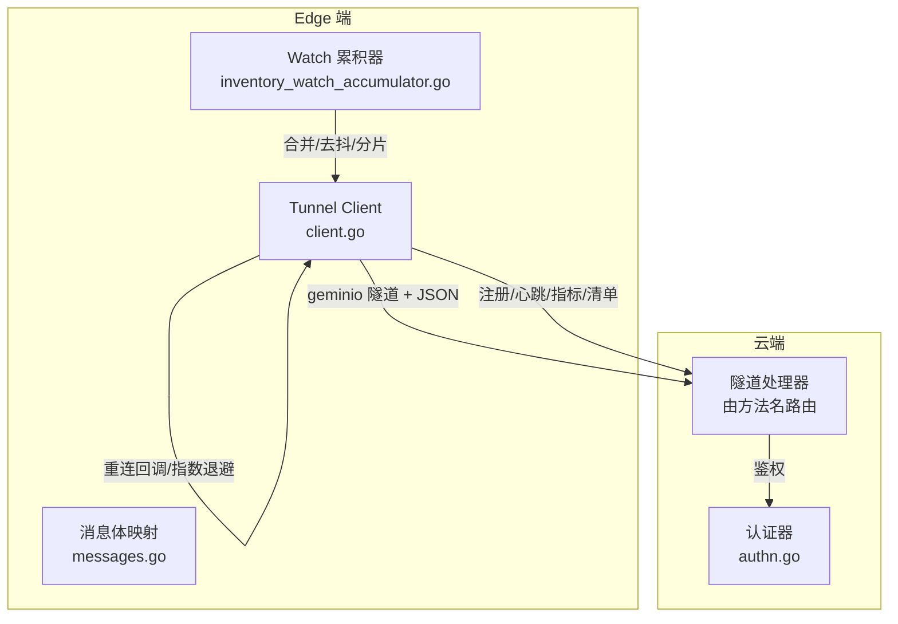
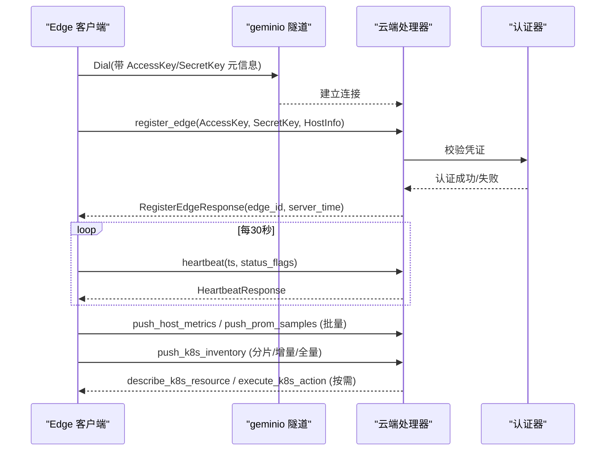
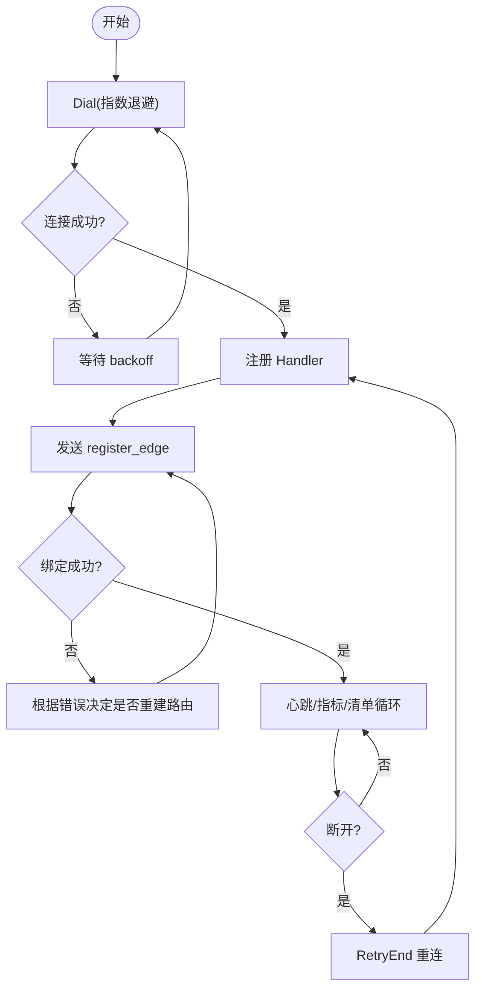
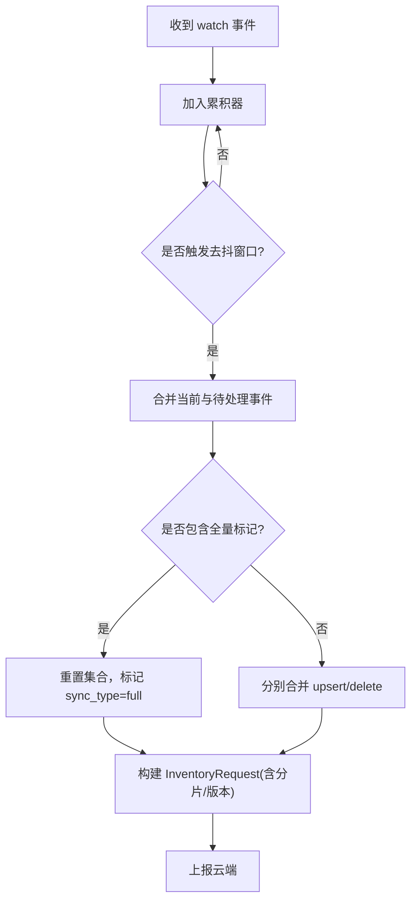
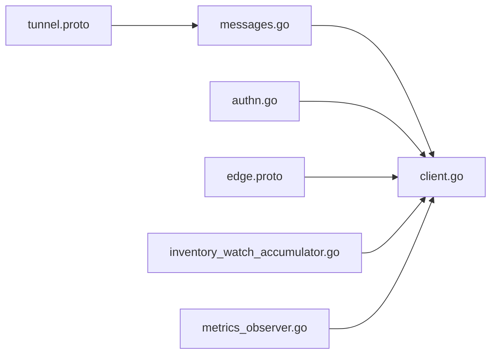
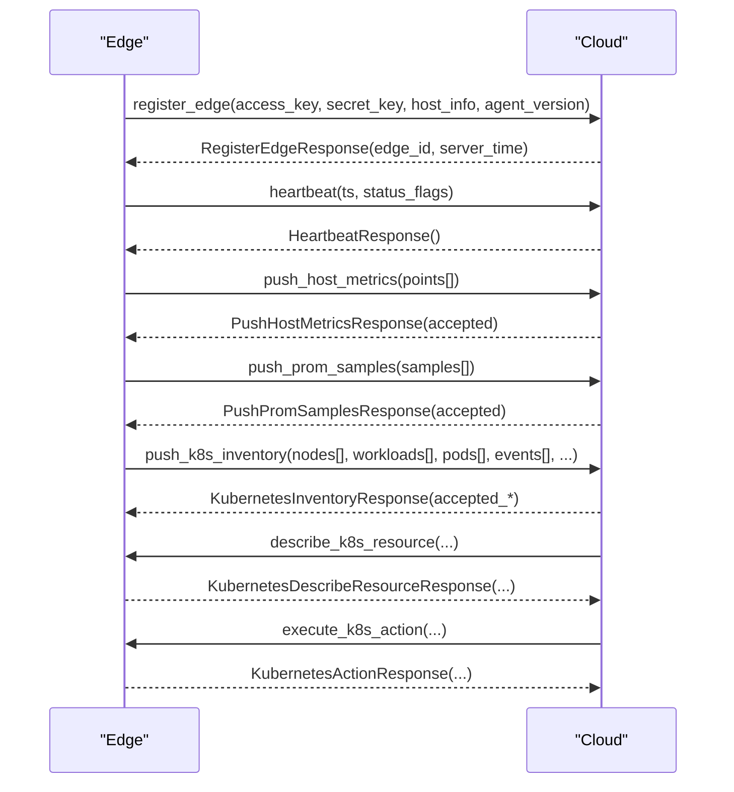

# 状态同步协议

<cite>
**本文引用的文件**
- [edge.proto](file://api/manager/edge/v1/edge.proto)
- [tunnel.proto](file://api/tunnel/v1/tunnel.proto)
- [messages.go](file://internal/pkg/tunnel/messages.go)
- [client.go](file://internal/pkg/tunnel/client.go)
- [types.go](file://internal/pkg/tunnel/types.go)
- [authn.go](file://internal/manager/biz/edge/authn.go)
- [inventory_watch_accumulator.go](file://internal/edgeagent/k8s/inventory_watch_accumulator.go)
- [metrics_observer.go](file://internal/edgeagent/k8s/metrics_observer.go)
</cite>

## 目录
1. [简介](#简介)
2. [项目结构](#项目结构)
3. [核心组件](#核心组件)
4. [架构总览](#架构总览)
5. [详细组件分析](#详细组件分析)
6. [依赖关系分析](#依赖关系分析)
7. [性能与监控](#性能与监控)
8. [故障排查指南](#故障排查指南)
9. [结论](#结论)
10. [附录：消息示例与交互序列](#附录消息示例与交互序列)

## 简介
本文件面向 Edge 与云端之间的状态同步协议，覆盖通信设计、消息格式、编码与传输机制；增量同步算法、数据分片与批量处理策略；冲突检测、版本控制与一致性保证；断线重连、错误重试与恢复流程；安全机制（加密传输、身份认证）；网络异常处理、超时控制与性能监控指标。文档基于仓库中的隧道协议定义、客户端实现、认证逻辑以及 Kubernetes 清单同步的累积器实现进行梳理。

## 项目结构
- 协议定义位于 api 目录：
  - manager/edge/v1/edge.proto：管理面 API（设备注册、列表、升级任务等）。
  - tunnel/v1/tunnel.proto：数据面隧道消息（register_edge、heartbeat、push_host_metrics、push_k8s_inventory 等）。
- 运行时实现位于 internal/pkg/tunnel：
  - messages.go：JSON 消息体 Go 结构体映射（与 tunnel.proto json_name 对齐）。
  - client.go：geminio 封装的客户端，负责连接、重连、指数退避、TLS、回调等。
  - types.go：Client/Handler/AuthFunc 等接口与配置。
- 认证在 internal/manager/biz/edge/authn.go：AccessKey/SecretKey 校验与缓存。
- 增量同步与合并逻辑在 internal/edgeagent/k8s/inventory_watch_accumulator.go：watch 事件去抖、合并、全量/增量标记。
- 指标观测在 internal/edgeagent/k8s/metrics_observer.go：抓取耗时、样本计数、推送成功/失败/拒绝统计。

**图表来源**
- [client.go:81-165](file://internal/pkg/tunnel/client.go#L81-L165)
- [messages.go:20-96](file://internal/pkg/tunnel/messages.go#L20-L96)
- [inventory_watch_accumulator.go:22-93](file://internal/edgeagent/k8s/inventory_watch_accumulator.go#L22-L93)
- [authn.go:27-58](file://internal/manager/biz/edge/authn.go#L27-L58)

**章节来源**
- [edge.proto:10-61](file://api/manager/edge/v1/edge.proto#L10-L61)
- [tunnel.proto:1-12](file://api/tunnel/v1/tunnel.proto#L1-L12)
- [messages.go:1-16](file://internal/pkg/tunnel/messages.go#L1-L16)
- [client.go:24-38](file://internal/pkg/tunnel/client.go#L24-L38)
- [types.go:8-31](file://internal/pkg/tunnel/types.go#L8-L31)

## 核心组件
- 隧道客户端（Edge 侧）
  - 使用 geminio 建立长连接，支持自动重连、指数退避、TLS CA 校验。
  - 提供 Call/RegisterHandler/AcceptStream/OnReconnect 等能力。
- 消息体（JSON）
  - 所有数据面消息以 JSON 编码，字段名与 tunnel.proto 的 json_name 保持一致。
  - 方法名常量集中定义，避免拼写错误。
- 认证器（云端）
  - AccessKey/SecretKey 校验，使用 Argon2id 哈希比对，结果短期缓存以降低开销。
- 清单同步累积器（Edge 侧）
  - 对 watch 事件进行去抖与合并，支持全量/增量模式，按资源类型分别合并 upsert/delete。
- 指标观测（Edge 侧）
  - 记录抓取耗时、样本数、推送批次成功/失败/拒绝数量，用于性能监控与告警。

**章节来源**
- [client.go:81-165](file://internal/pkg/tunnel/client.go#L81-L165)
- [messages.go:20-96](file://internal/pkg/tunnel/messages.go#L20-L96)
- [authn.go:27-58](file://internal/manager/biz/edge/authn.go#L27-L58)
- [inventory_watch_accumulator.go:22-93](file://internal/edgeagent/k8s/inventory_watch_accumulator.go#L22-L93)
- [metrics_observer.go:85-118](file://internal/edgeagent/k8s/metrics_observer.go#L85-L118)

## 架构总览
Edge 通过 geminio 隧道与云端建立双向通道。首次连接后发送 register_edge 完成身份绑定并获取 edge_id；随后周期性发送 heartbeat 保持在线；定时批量上报主机指标与 Prometheus 样本；Kubernetes 控制器模式下，Edge 将集群对象快照以 push_k8s_inventory 上报，支持增量与全量两种模式，并通过 chunk_index/chunk_count 进行分片。云端通过同一隧道下发查询或动作请求（如 describe_k8s_resource、execute_k8s_action），Edge 执行后返回响应。

**图表来源**
- [client.go:81-165](file://internal/pkg/tunnel/client.go#L81-L165)
- [messages.go:259-327](file://internal/pkg/tunnel/messages.go#L259-L327)
- [messages.go:329-406](file://internal/pkg/tunnel/messages.go#L329-L406)
- [messages.go:524-653](file://internal/pkg/tunnel/messages.go#L524-L653)
- [tunnel.proto:73-117](file://api/tunnel/v1/tunnel.proto#L73-L117)
- [tunnel.proto:291-320](file://api/tunnel/v1/tunnel.proto#L291-L320)

## 详细组件分析

### 连接与会话生命周期
- 连接建立
  - Edge 调用 Dial，携带 AccessKey/SecretKey 作为元信息，指数退避重试直至成功或上下文取消。
  - 成功后重新注册所有 handler，确保后续 RPC 可用。
- 会话绑定
  - 首次 register_edge 成功后获得 edge_id，后续心跳与数据上报携带该标识。
- 重连与回调
  - 底层断开由 RetryEnd 自动重连；重连完成后触发 OnReconnect 回调，Edge 可重新发起 register_edge。
  - 针对特定错误（如 method 不存在、clientID 不匹配、心跳绑定未就绪）会触发路由回收与重注册。

**图表来源**
- [client.go:81-165](file://internal/pkg/tunnel/client.go#L81-L165)
- [client.go:348-376](file://internal/pkg/tunnel/client.go#L348-L376)
- [types.go:68-105](file://internal/pkg/tunnel/types.go#L68-L105)

**章节来源**
- [client.go:81-165](file://internal/pkg/tunnel/client.go#L81-L165)
- [client.go:348-376](file://internal/pkg/tunnel/client.go#L348-L376)
- [types.go:68-105](file://internal/pkg/tunnel/types.go#L68-L105)

### 消息格式与编码
- 编码方式
  - 数据面消息统一采用 JSON 编码，字段名与 tunnel.proto 中 json_name 严格一致。
  - 方法名以常量形式集中声明，避免硬编码字符串不一致。
- 关键消息
  - register_edge：首次注册，携带 HostInfo、AgentVersion、可选 Kubernetes 上下文。
  - heartbeat：周期性心跳，携带时间戳与可选状态位。
  - push_host_metrics / push_prom_samples：批量上报主机指标与 Prometheus 样本。
  - push_k8s_inventory：上报 Kubernetes 清单，包含节点、工作负载、Pod、事件及删除引用，支持分片与增量/全量标记。
  - describe_k8s_resource / query_k8s_logs / execute_k8s_action：云端向 Edge 下发的只读查询、日志兜底与受控写操作。

**章节来源**
- [messages.go:20-96](file://internal/pkg/tunnel/messages.go#L20-L96)
- [messages.go:259-327](file://internal/pkg/tunnel/messages.go#L259-L327)
- [messages.go:329-406](file://internal/pkg/tunnel/messages.go#L329-L406)
- [messages.go:524-653](file://internal/pkg/tunnel/messages.go#L524-L653)
- [tunnel.proto:73-117](file://api/tunnel/v1/tunnel.proto#L73-L117)
- [tunnel.proto:291-320](file://api/tunnel/v1/tunnel.proto#L291-L320)

### 增量同步算法与数据分片
- 增量/全量
  - inventoryWatchTrigger 支持 fullResync 标志；若任一侧为全量，则清空集合并切换为全量模式。
  - 否则为增量模式，分别合并 upsert 与 delete 列表。
- 合并策略
  - mergeFinalInventoryOperations 对每种资源类型分别合并：upsert 以唯一键覆盖，delete 以唯一键移除；最终输出排序后的稳定顺序。
- 去抖与批处理
  - waitForWatchDebounce 在延迟窗口内聚合多个 watch 事件，减少频繁上报。
  - 支持 chunk_index/chunk_count 分片上报，便于大清单分批传输。
- 版本控制
  - 携带 resource_version 与 resource_versions 映射，用于服务端判断是否过期或需要回补。

**图表来源**
- [inventory_watch_accumulator.go:22-93](file://internal/edgeagent/k8s/inventory_watch_accumulator.go#L22-L93)
- [inventory_watch_accumulator.go:106-161](file://internal/edgeagent/k8s/inventory_watch_accumulator.go#L106-L161)
- [inventory_watch_accumulator.go:163-194](file://internal/edgeagent/k8s/inventory_watch_accumulator.go#L163-L194)
- [messages.go:524-653](file://internal/pkg/tunnel/messages.go#L524-L653)

**章节来源**
- [inventory_watch_accumulator.go:22-93](file://internal/edgeagent/k8s/inventory_watch_accumulator.go#L22-L93)
- [inventory_watch_accumulator.go:106-161](file://internal/edgeagent/k8s/inventory_watch_accumulator.go#L106-L161)
- [inventory_watch_accumulator.go:163-194](file://internal/edgeagent/k8s/inventory_watch_accumulator.go#L163-L194)
- [messages.go:524-653](file://internal/pkg/tunnel/messages.go#L524-L653)

### 冲突检测、版本控制与一致性
- 版本字段
  - 清单上报携带 resource_version 与各资源类型的 resource_versions，用于服务端判定是否需要增量或全量回补。
- 写操作保护
  - execute_k8s_action 支持 expected_resource_version 预检，结合 preflight 返回是否存在与版本，降低并发写入冲突。
- 幂等性
  - 增量合并以唯一键为准，重复 upsert 会被覆盖，delete 会移除对应项，保证最终一致性。

**章节来源**
- [messages.go:524-653](file://internal/pkg/tunnel/messages.go#L524-L653)
- [messages.go:726-795](file://internal/pkg/tunnel/messages.go#L726-L795)
- [tunnel.proto:384-440](file://api/tunnel/v1/tunnel.proto#L384-L440)

### 断线重连、错误重试与恢复
- 指数退避
  - Dial 阶段从 1s 起每次翻倍，上限 60s，直到连接成功或上下文取消。
- 自动重连
  - 底层 RetryEnd 在断开后自动重连；重连完成后触发 EndReOnline，客户端提升挂起连接并异步执行 OnReconnect 回调。
- 路由回收
  - 针对“方法不存在”“clientID 不匹配”“心跳绑定未就绪”等错误，触发 shouldRecycleBrokenRoute，重建路由并重新注册。
- 恢复流程
  - 重连后重新注册 handlers，必要时重新发起 register_edge，确保云端绑定新的 edge_id。

**章节来源**
- [client.go:81-165](file://internal/pkg/tunnel/client.go#L81-L165)
- [client.go:348-376](file://internal/pkg/tunnel/client.go#L348-L376)
- [types.go:96-105](file://internal/pkg/tunnel/types.go#L96-L105)

### 安全机制：加密传输与身份认证
- 加密传输
  - 支持 TLS，可通过 TLSCAFile 指定 CA PEM，最小 TLS 版本为 1.2。
- 身份认证
  - 连接时携带 AccessKey/SecretKey 元信息；云端通过 AccessKeyAuthenticator 校验，使用 Argon2id 哈希比对，结果短期缓存以减少计算开销。
  - 认证失败路径统一返回未授权错误，避免枚举泄露。

**章节来源**
- [client.go:167-200](file://internal/pkg/tunnel/client.go#L167-L200)
- [types.go:33-50](file://internal/pkg/tunnel/types.go#L33-L50)
- [authn.go:27-58](file://internal/manager/biz/edge/authn.go#L27-L58)

### 网络异常处理、超时控制与性能监控
- 超时控制
  - Dialer 设置 10s 连接超时；心跳周期默认 30s；指标上报周期默认 10s。
- 异常处理
  - 认证/网络错误在 Dial 层统一记录警告并重试；特定错误触发路由回收。
- 性能监控
  - metricsObserver 记录抓取耗时、样本数、推送批次成功/失败/拒绝数量，可用于评估吞吐与稳定性。

**章节来源**
- [client.go:167-200](file://internal/pkg/tunnel/client.go#L167-L200)
- [client.go:81-165](file://internal/pkg/tunnel/client.go#L81-L165)
- [metrics_observer.go:85-118](file://internal/edgeagent/k8s/metrics_observer.go#L85-L118)

## 依赖关系分析
- 客户端依赖
  - geminio 提供可靠的双向流式通道与自动重连。
  - 消息体映射与常量方法名来自 messages.go，确保协议一致性。
- 云端依赖
  - 认证器 authn.go 提供 AccessKey/SecretKey 校验与缓存。
  - 管理器 API（edge.proto）用于设备管理与批量升级任务编排。
- 数据流依赖
  - 清单同步依赖累积器进行去抖与合并，再经由隧道上报。
  - 指标上报依赖采集与批处理，最终通过 push_host_metrics/push_prom_samples 上报。

**图表来源**
- [messages.go:1-16](file://internal/pkg/tunnel/messages.go#L1-L16)
- [tunnel.proto:1-12](file://api/tunnel/v1/tunnel.proto#L1-L12)
- [authn.go:27-58](file://internal/manager/biz/edge/authn.go#L27-L58)
- [edge.proto:10-61](file://api/manager/edge/v1/edge.proto#L10-L61)
- [inventory_watch_accumulator.go:22-93](file://internal/edgeagent/k8s/inventory_watch_accumulator.go#L22-L93)
- [metrics_observer.go:85-118](file://internal/edgeagent/k8s/metrics_observer.go#L85-L118)

**章节来源**
- [messages.go:1-16](file://internal/pkg/tunnel/messages.go#L1-L16)
- [tunnel.proto:1-12](file://api/tunnel/v1/tunnel.proto#L1-L12)
- [authn.go:27-58](file://internal/manager/biz/edge/authn.go#L27-L58)
- [edge.proto:10-61](file://api/manager/edge/v1/edge.proto#L10-L61)
- [inventory_watch_accumulator.go:22-93](file://internal/edgeagent/k8s/inventory_watch_accumulator.go#L22-L93)
- [metrics_observer.go:85-118](file://internal/edgeagent/k8s/metrics_observer.go#L85-L118)

## 性能与监控
- 指标维度
  - 抓取耗时：scrapeDuration（按 source 标签）。
  - 最后成功时间：lastSuccess（按 source 标签）。
  - 样本计数：scrapeSamples（按 source 标签）。
  - 超限计数：scrapeLimitExceeded（按 source 标签）。
  - 推送统计：pushBatches、pushSamples（按 source 与结果分类：success/failure/rejected）。
- 建议
  - 关注 rejected 与 failure 比例，定位带宽或服务端限流问题。
  - 监控 scrapeDuration 的 P95/P99，识别慢源。
  - 结合心跳与 last_seen_at，评估 Edge 在线率与稳定性。

**章节来源**
- [metrics_observer.go:85-118](file://internal/edgeagent/k8s/metrics_observer.go#L85-L118)

## 故障排查指南
- 连接失败
  - 检查 ServerAddr/CloudAddr 与 TLSCAFile 配置是否正确。
  - 观察 Dial 层的警告日志与退避间隔，确认是否为网络或证书问题。
- 认证失败
  - 确认 AccessKey/SecretKey 正确且未被轮换；服务端缓存可能使旧密钥仍短暂有效，需等待缓存过期或重启服务。
- 路由异常
  - 若出现“方法不存在”“clientID 不匹配”，应触发路由回收并重新注册；检查 shouldRecycleBrokenRoute 的判断条件。
- 清单不同步
  - 检查 resource_version 是否递增；确认累积器去抖窗口与分片参数是否合理。
- 指标缺失
  - 查看 scrapeDuration 与 lastSuccess，确认采集是否正常；检查 pushBatches/pushSamples 的成功与拒绝情况。

**章节来源**
- [client.go:81-165](file://internal/pkg/tunnel/client.go#L81-L165)
- [client.go:348-376](file://internal/pkg/tunnel/client.go#L348-L376)
- [authn.go:27-58](file://internal/manager/biz/edge/authn.go#L27-L58)
- [inventory_watch_accumulator.go:163-194](file://internal/edgeagent/k8s/inventory_watch_accumulator.go#L163-L194)
- [metrics_observer.go:85-118](file://internal/edgeagent/k8s/metrics_observer.go#L85-L118)

## 结论
本协议以 geminio 隧道为基础，采用 JSON 编码的消息体，实现了 Edge 与云端之间的高可靠、可扩展的状态同步。通过指数退避与自动重连保障连接韧性；通过增量/全量与分片机制优化大数据量同步；通过版本字段与预检机制降低冲突风险；通过 TLS 与 AccessKey/SecretKey 认证保障安全。配合完善的指标观测，可在生产环境中持续评估与优化性能与稳定性。

## 附录：消息示例与交互序列
以下示例仅展示字段结构与含义，不包含具体值。

- register_edge（Edge → Cloud）
  - access_key、secret_key、host_info（hostname、os、arch、kernel_version、cpu_count、mem_total_bytes）、agent_version、kubernetes（mode、cluster_id、cluster_uid、cluster_name、role、node_name、node_uid、namespace、pod_name）
- register_edge 响应（Cloud → Edge）
  - edge_id、server_time
- heartbeat（Edge → Cloud）
  - ts、status_flags、plugins（name、state、last_error、restart_count、pid、started_at、updated_at、targets）
- push_host_metrics（Edge → Cloud）
  - edge_id、points[]（ts、cpu_pct、mem_pct、load1、load5、load15、net_rx_bps、net_tx_bps、disk_used_pct）
- push_prom_samples（Edge → Cloud）
  - edge_id、source、samples[]（name、labels、value、ts_ms）
- push_k8s_inventory（Edge → Cloud）
  - edge_id、cluster_id、mode、role、scope、namespace、ts、resource_version、resource_versions、collect_duration_ms、watch_event_observed_at、watch_trigger_reason、sync_type、snapshot_id、chunk_index、chunk_count、nodes[]、workloads[]、pods[]、events[]、deleted_nodes[]、deleted_workloads[]、deleted_pods[]、deleted_events[]
- describe_k8s_resource（Cloud → Edge）
  - cluster_id、kind、api_version、namespace、name、include_events、events_limit
- execute_k8s_action（Cloud → Edge）
  - cluster_id、action、kind、api_version、namespace、name、replicas、expected_resource_version、dry_run、reason、grace_period_seconds、drain_timeout_seconds、drain_retry_seconds、ignore_daemonsets、delete_emptydir_data、force、disable_eviction

**图表来源**
- [messages.go:259-327](file://internal/pkg/tunnel/messages.go#L259-L327)
- [messages.go:329-406](file://internal/pkg/tunnel/messages.go#L329-L406)
- [messages.go:524-653](file://internal/pkg/tunnel/messages.go#L524-L653)
- [tunnel.proto:73-117](file://api/tunnel/v1/tunnel.proto#L73-L117)
- [tunnel.proto:291-320](file://api/tunnel/v1/tunnel.proto#L291-L320)
- [tunnel.proto:322-343](file://api/tunnel/v1/tunnel.proto#L322-L343)
- [tunnel.proto:384-440](file://api/tunnel/v1/tunnel.proto#L384-L440)