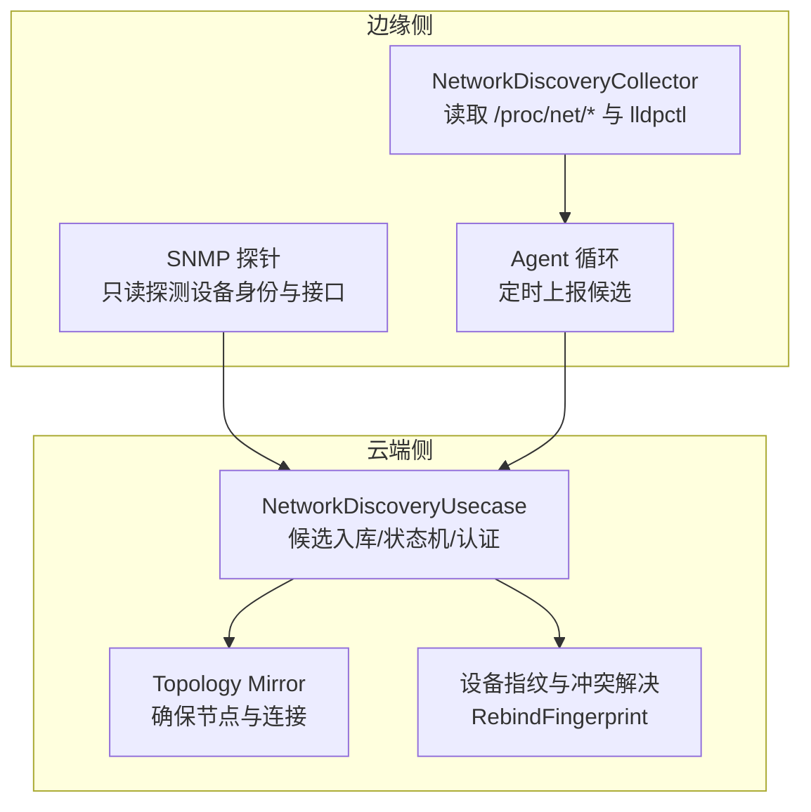
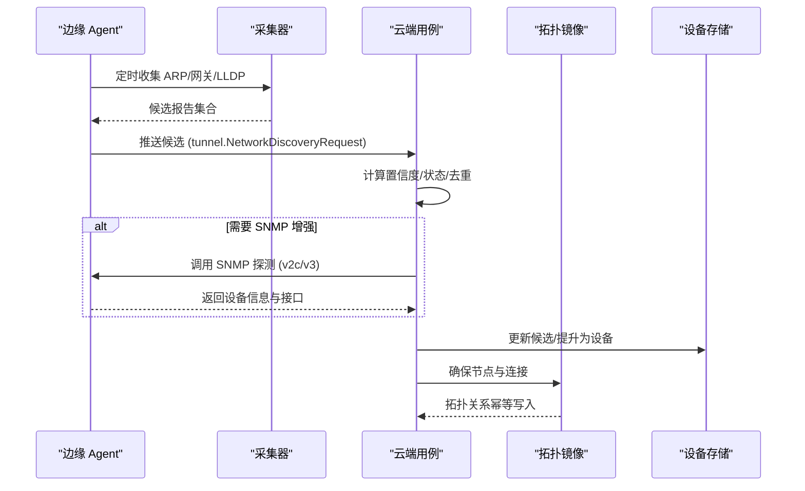
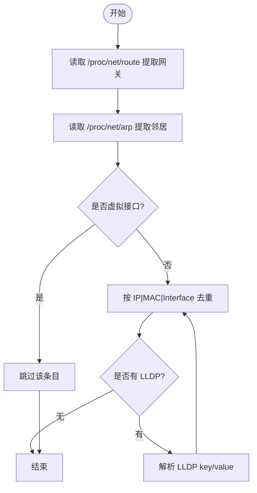
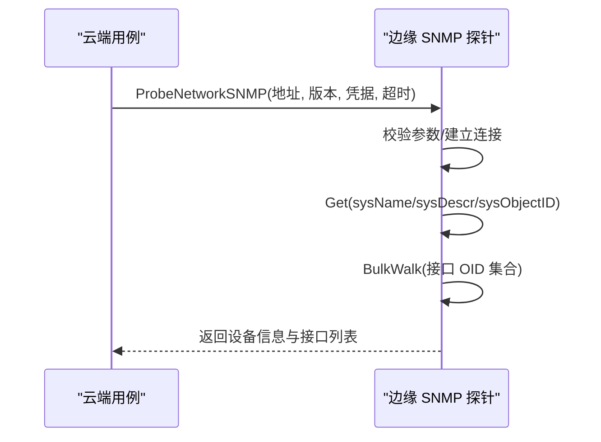
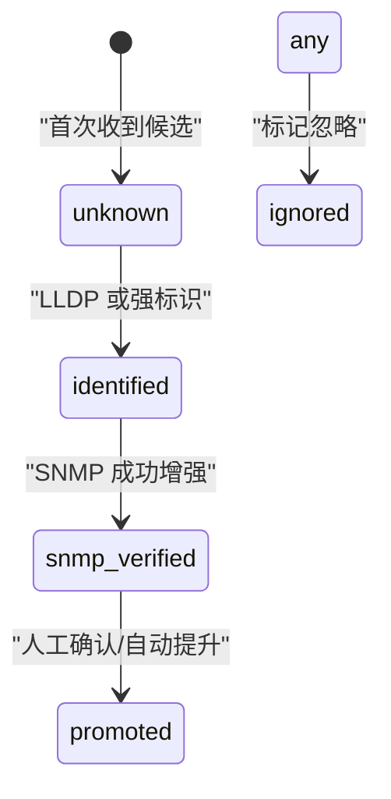
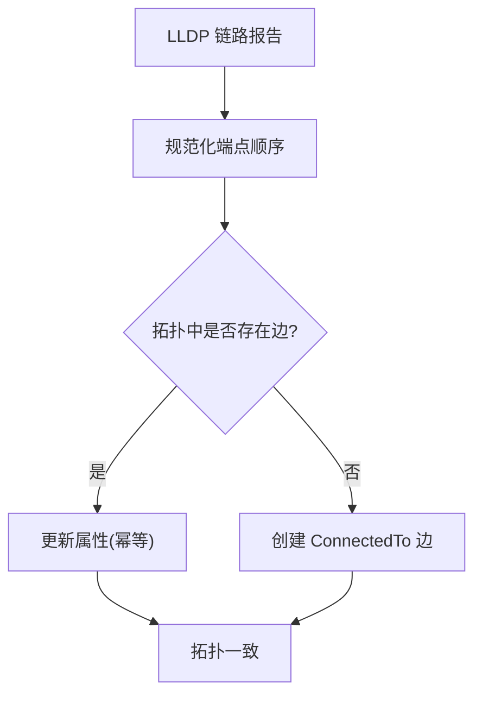
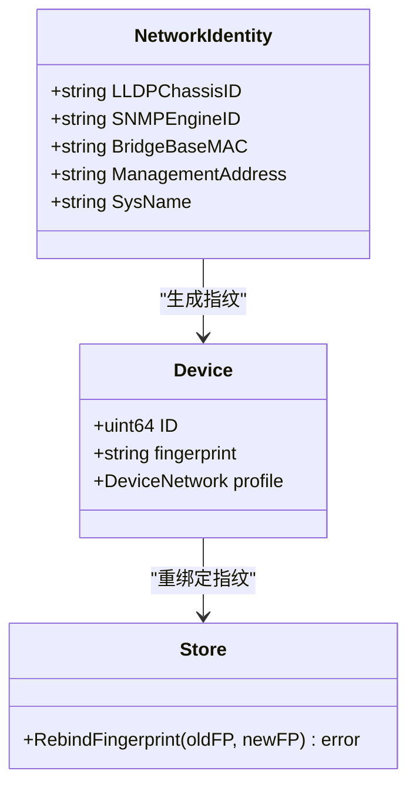
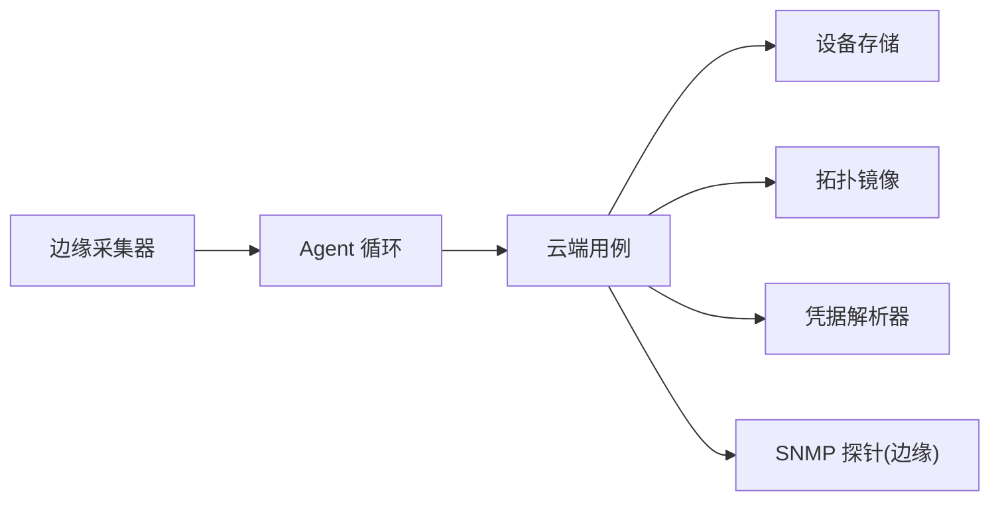
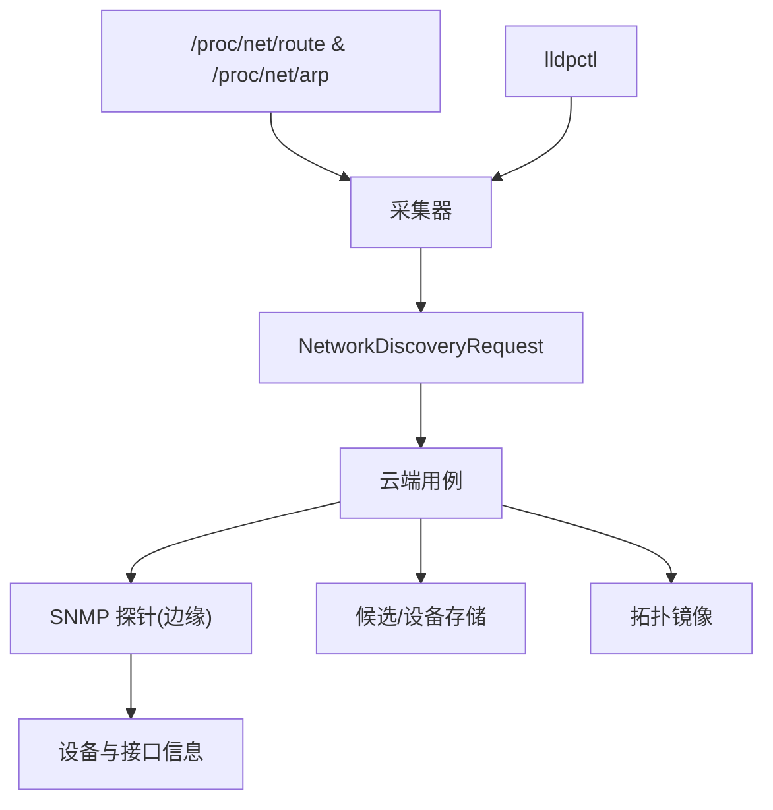
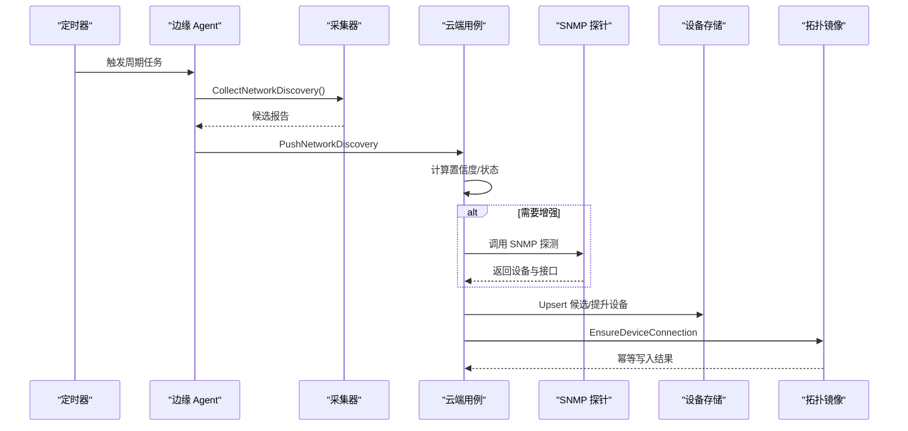

# 网络发现机制

<cite>
**本文引用的文件**
- [internal/edgeagent/collector/network_discovery.go](file://internal/edgeagent/collector/network_discovery.go)
- [internal/edgeagent/biz/snmp_probe.go](file://internal/edgeagent/biz/snmp_probe.go)
- [internal/manager/biz/device/network_discovery.go](file://internal/manager/biz/device/network_discovery.go)
- [internal/manager/biz/device/network_identity.go](file://internal/manager/biz/device/network_identity.go)
- [internal/pkg/tunnel/messages.go](file://internal/pkg/tunnel/messages.go)
- [internal/manager/biz/topology/usecase.go](file://internal/manager/biz/topology/usecase.go)
- [internal/manager/data/device/store/device.go](file://internal/manager/data/device/store/device.go)
- [internal/edgeagent/biz/agent.go](file://internal/edgeagent/biz/agent.go)
- [web/src/pages/settings/General.tsx](file://web/src/pages/settings/General.tsx)
</cite>

## 目录
1. [简介](#简介)
2. [项目结构](#项目结构)
3. [核心组件](#核心组件)
4. [架构总览](#架构总览)
5. [详细组件分析](#详细组件分析)
6. [依赖关系分析](#依赖关系分析)
7. [性能与扩展性](#性能与扩展性)
8. [故障处理指南](#故障处理指南)
9. [结论](#结论)
10. [附录：数据流与时序示例](#附录数据流与时序示例)

## 简介
本文件系统性阐述网络发现机制的实现原理与工程实践，覆盖设备发现算法（ARP、LLDP、SNMP）、候选设备识别流程、置信度计算与状态管理、拓扑构建（邻居关系检测与连接验证）、设备指纹生成与冲突解决、配置选项与性能调优、以及大规模环境下的扩展策略。文档同时提供数据流向图与时序图，帮助读者快速理解端到端的数据流转与控制流。

## 项目结构
网络发现由“边缘侧采集”和“云端侧编排”两部分组成：
- 边缘侧负责被动收集本地邻居信息（ARP、网关、LLDP），并在必要时执行只读 SNMP 探测以增强身份与接口信息。
- 云端侧负责接收候选报告、进行身份匹配与去重、维护候选表、触发周期性 SNMP 轮询、将候选提升为正式网络设备并同步到拓扑图。

图表来源
- [internal/edgeagent/collector/network_discovery.go:18-113](file://internal/edgeagent/collector/network_discovery.go#L18-L113)
- [internal/edgeagent/biz/snmp_probe.go:40-115](file://internal/edgeagent/biz/snmp_probe.go#L40-L115)
- [internal/manager/biz/device/network_discovery.go:82-122](file://internal/manager/biz/device/network_discovery.go#L82-L122)
- [internal/manager/biz/topology/usecase.go:222-245](file://internal/manager/biz/topology/usecase.go#L222-L245)
- [internal/manager/data/device/store/device.go:57-79](file://internal/manager/data/device/store/device.go#L57-L79)

章节来源
- [internal/edgeagent/collector/network_discovery.go:18-113](file://internal/edgeagent/collector/network_discovery.go#L18-L113)
- [internal/edgeagent/biz/snmp_probe.go:40-115](file://internal/edgeagent/biz/snmp_probe.go#L40-L115)
- [internal/manager/biz/device/network_discovery.go:82-122](file://internal/manager/biz/device/network_discovery.go#L82-L122)

## 核心组件
- 边缘侧采集器：从系统路由表与 ARP 表提取网关与邻居，解析 LLDP key-value 输出，过滤虚拟化接口，标准化 MAC/IP，去重后打包为候选报告。
- SNMP 探针：支持 v2c/v3，只读获取系统名称、描述、OID、接口列表、MAC、速度、错误计数、IPv4 地址等，用于增强候选设备的身份与接口视图。
- 云端用例：接收候选报告，计算置信度与状态，持久化候选；在满足条件时通过隧道调用边缘 SNMP 探测；将候选提升为网络设备并写入拓扑。
- 身份匹配与指纹：基于强/弱标识（如 LLDP Chassis ID、SNMP Engine ID、序列号+厂商、桥基 MAC）进行合并与冲突判定；对已存在设备进行指纹重绑定以保留历史。
- 拓扑镜像：将物理邻接关系映射为拓扑图中的无向边，保证重复观测幂等。

章节来源
- [internal/edgeagent/collector/network_discovery.go:18-113](file://internal/edgeagent/collector/network_discovery.go#L18-L113)
- [internal/edgeagent/biz/snmp_probe.go:40-115](file://internal/edgeagent/biz/snmp_probe.go#L40-L115)
- [internal/manager/biz/device/network_discovery.go:82-122](file://internal/manager/biz/device/network_discovery.go#L82-L122)
- [internal/manager/biz/device/network_identity.go:31-84](file://internal/manager/biz/device/network_identity.go#L31-L84)
- [internal/manager/biz/topology/usecase.go:222-245](file://internal/manager/biz/topology/usecase.go#L222-L245)
- [internal/manager/data/device/store/device.go:57-79](file://internal/manager/data/device/store/device.go#L57-L79)

## 架构总览
网络发现采用“边缘被动采集 + 云端主动增强”的分层架构：
- 边缘侧不扫描网段、不发送 SNMP 凭据，仅被动读取本地邻居与 LLDP，降低对网络的侵入性。
- 云端侧在候选可见后，按需发起只读 SNMP 探测，完成身份增强与接口信息采集。
- 所有候选进入候选表，经过状态机推进（未知→已识别→SNMP 验证→忽略/提升），最终形成设备档案并映射到拓扑。

图表来源
- [internal/edgeagent/biz/agent.go:273-321](file://internal/edgeagent/biz/agent.go#L273-L321)
- [internal/edgeagent/collector/network_discovery.go:43-113](file://internal/edgeagent/collector/network_discovery.go#L43-L113)
- [internal/manager/biz/device/network_discovery.go:82-122](file://internal/manager/biz/device/network_discovery.go#L82-L122)
- [internal/manager/biz/topology/usecase.go:222-245](file://internal/manager/biz/topology/usecase.go#L222-L245)

## 详细组件分析

### 边缘侧网络发现采集器
- 协议来源
  - ARP：解析 /proc/net/arp，结合默认网关（/proc/net/route）筛选出网关所在接口的邻居。
  - 网关：若 ARP 未命中网关，则直接记录网关本身作为候选。
  - LLDP：调用 lldpctl 输出 key=value，解析 chassis.id/chassis.mgmt-ip/port.ifname 等字段，构造候选与链路信息。
- 过滤与标准化
  - 过滤虚拟化接口（docker、br-、veth、cni、virbr、flannel、cali、tun、tap、lo）。
  - MAC 标准化为小写冒号分隔的 6 字节格式；IP 规范化；按 IP|MAC|Interface 去重。
- 健壮性
  - 缺失 /proc 文件或 lldpctl 不存在视为空信号而非致命错误，保证跨平台运行。

图表来源
- [internal/edgeagent/collector/network_discovery.go:73-113](file://internal/edgeagent/collector/network_discovery.go#L73-L113)
- [internal/edgeagent/collector/network_discovery.go:115-142](file://internal/edgeagent/collector/network_discovery.go#L115-L142)
- [internal/edgeagent/collector/network_discovery.go:149-203](file://internal/edgeagent/collector/network_discovery.go#L149-L203)
- [internal/edgeagent/collector/network_discovery.go:205-275](file://internal/edgeagent/collector/network_discovery.go#L205-L275)

章节来源
- [internal/edgeagent/collector/network_discovery.go:18-113](file://internal/edgeagent/collector/network_discovery.go#L18-L113)
- [internal/edgeagent/collector/network_discovery.go:115-275](file://internal/edgeagent/collector/network_discovery.go#L115-L275)

### SNMP 探针（只读增强）
- 版本与安全
  - 支持 v2c（需 community）与 v3（支持多种认证/隐私协议组合），默认超时与重试可配置。
- 采集范围
  - 系统信息：sysName、sysDescription、sysObjectID、SNMP Engine ID。
  - 接口信息：名称、类型、MAC、管理/运行状态、速率、流量与错误计数、IPv4 地址。
- 限制与保护
  - 限制接口与地址遍历数量，避免大设备导致资源耗尽。
  - 连接失败或查询异常直接返回错误，不阻塞其他目标。

图表来源
- [internal/edgeagent/biz/snmp_probe.go:40-115](file://internal/edgeagent/biz/snmp_probe.go#L40-L115)
- [internal/edgeagent/biz/snmp_probe.go:130-235](file://internal/edgeagent/biz/snmp_probe.go#L130-L235)
- [internal/edgeagent/biz/snmp_probe.go:323-392](file://internal/edgeagent/biz/snmp_probe.go#L323-L392)

章节来源
- [internal/edgeagent/biz/snmp_probe.go:40-115](file://internal/edgeagent/biz/snmp_probe.go#L40-L115)
- [internal/edgeagent/biz/snmp_probe.go:130-235](file://internal/edgeagent/biz/snmp_probe.go#L130-L235)
- [internal/edgeagent/biz/snmp_probe.go:323-392](file://internal/edgeagent/biz/snmp_probe.go#L323-L392)

### 候选设备识别、置信度与状态机
- 来源与证据
  - 来源包括 arp、gateway、lldp、snmp。
  - 强标识：LLDP Chassis ID、SNMP Engine ID、SNMP Chassis ID、Vendor+Serial、Bridge Base MAC。
  - 弱标识：管理地址、系统名称。
- 置信度与状态
  - 初始置信度较低；来自 LLDP 或存在强标识时提升至“已识别”，置信度提高；来自 SNMP 进一步提升到“SNMP 验证”。
  - 状态：unknown → identified → snmp_verified → ignored/promoted。
- 去重与合并
  - 使用 IdentityCandidates 排序与匹配规则，强冲突拒绝合并，多弱匹配允许合并。

图表来源
- [internal/manager/biz/device/network_discovery.go:15-23](file://internal/manager/biz/device/network_discovery.go#L15-L23)
- [internal/manager/biz/device/network_identity.go:31-84](file://internal/manager/biz/device/network_identity.go#L31-L84)
- [internal/manager/biz/device/network_identity.go:93-145](file://internal/manager/biz/device/network_identity.go#L93-L145)

章节来源
- [internal/manager/biz/device/network_discovery.go:15-23](file://internal/manager/biz/device/network_discovery.go#L15-L23)
- [internal/manager/biz/device/network_identity.go:31-84](file://internal/manager/biz/device/network_identity.go#L31-L84)
- [internal/manager/biz/device/network_identity.go:93-145](file://internal/manager/biz/device/network_identity.go#L93-L145)

### 网络拓扑构建（邻居关系检测与连接验证）
- 邻居关系
  - LLDP 报告包含本地接口与远端接口名，用于推断物理邻接。
  - 拓扑镜像将邻接关系规范化为无向边，确保幂等写入。
- 连接验证
  - 通过 EnsureDeviceConnection 保证同一对设备间只有一条 ConnectedTo 关系，属性变更会更新而非重复创建。

图表来源
- [internal/manager/biz/device/network_identity.go:8-29](file://internal/manager/biz/device/network_identity.go#L8-L29)
- [internal/manager/biz/topology/usecase.go:222-245](file://internal/manager/biz/topology/usecase.go#L222-L245)

章节来源
- [internal/manager/biz/device/network_identity.go:8-29](file://internal/manager/biz/device/network_identity.go#L8-L29)
- [internal/manager/biz/topology/usecase.go:222-245](file://internal/manager/biz/topology/usecase.go#L222-L245)

### 设备指纹生成、唯一性与冲突解决
- 指纹来源
  - 网络设备优先使用强标识（如 LLDP Chassis ID、SNMP Engine ID、桥基 MAC）生成稳定指纹；否则回退到候选 ID。
  - 主机设备使用硬件指纹或主机名/机器 ID 哈希。
- 冲突解决
  - 强标识冲突拒绝合并，避免误合并不同设备。
  - 当新指纹更优时，支持原地重绑定（RebindFingerprint），保留设备 ID 与历史。

图表来源
- [internal/manager/biz/device/network_discovery.go:505-529](file://internal/manager/biz/device/network_discovery.go#L505-L529)
- [internal/manager/data/device/store/device.go:57-79](file://internal/manager/data/device/store/device.go#L57-L79)
- [internal/manager/biz/device/network_identity.go:31-84](file://internal/manager/biz/device/network_identity.go#L31-L84)

章节来源
- [internal/manager/biz/device/network_discovery.go:505-529](file://internal/manager/biz/device/network_discovery.go#L505-L529)
- [internal/manager/data/device/store/device.go:57-79](file://internal/manager/data/device/store/device.go#L57-L79)
- [internal/manager/biz/device/network_identity.go:31-84](file://internal/manager/biz/device/network_identity.go#L31-L84)

### 配置选项、性能调优与故障处理
- 配置项
  - 平台开关：network_discovery_enabled（前端设置页控制，默认启用）。
  - 边缘侧间隔：NetworkDiscoveryInterval（默认 1 分钟，可配置）。
  - SNMP 轮询：intervalSeconds（30-86400 秒）、port（默认 161）、credentialName（从密钥库解析）。
- 性能调优
  - 边缘侧：过滤虚拟化接口、限制 LLDP 解析、MAC/IP 标准化与去重。
  - SNMP：限制接口与地址遍历上限、超时与重试可控。
  - 云端：候选上限、幂等写入拓扑、避免重复请求。
- 故障处理
  - 边缘侧：缺少 /proc 或 lldpctl 视为空信号；RPC 不支持时降级停止上报。
  - SNMP：连接/查询失败返回错误；凭据校验失败阻止启用轮询。
  - 拓扑：重复关系幂等更新，避免脏数据。

章节来源
- [web/src/pages/settings/General.tsx:7-14](file://web/src/pages/settings/General.tsx#L7-L14)
- [internal/edgeagent/biz/agent.go:273-321](file://internal/edgeagent/biz/agent.go#L273-L321)
- [internal/manager/biz/device/network_discovery.go:138-186](file://internal/manager/biz/device/network_discovery.go#L138-L186)
- [internal/edgeagent/biz/snmp_probe.go:40-115](file://internal/edgeagent/biz/snmp_probe.go#L40-L115)
- [internal/manager/biz/topology/usecase.go:222-245](file://internal/manager/biz/topology/usecase.go#L222-L245)

## 依赖关系分析
- 边缘侧依赖
  - 操作系统 /proc 文件系统、外部工具 lldpctl。
  - SNMP 客户端库 gosnmp。
- 云端侧依赖
  - 设备存储与候选表、拓扑关系存储。
  - 隧道 RPC 调用边缘 SNMP 探针。
  - 凭据解析器（从共享密钥库获取 SNMP 凭据）。

图表来源
- [internal/edgeagent/collector/network_discovery.go:18-113](file://internal/edgeagent/collector/network_discovery.go#L18-L113)
- [internal/edgeagent/biz/agent.go:273-321](file://internal/edgeagent/biz/agent.go#L273-L321)
- [internal/manager/biz/device/network_discovery.go:82-122](file://internal/manager/biz/device/network_discovery.go#L82-L122)

章节来源
- [internal/edgeagent/collector/network_discovery.go:18-113](file://internal/edgeagent/collector/network_discovery.go#L18-L113)
- [internal/edgeagent/biz/agent.go:273-321](file://internal/edgeagent/biz/agent.go#L273-L321)
- [internal/manager/biz/device/network_discovery.go:82-122](file://internal/manager/biz/device/network_discovery.go#L82-L122)

## 性能与扩展性
- 可扩展性设计
  - 边缘侧被动采集，不主动扫描网段，减少网络负载。
  - 云端侧按需 SNMP 增强，避免对所有候选进行全量探测。
  - 拓扑关系幂等写入，支持大规模设备并发上报。
- 优化建议
  - 合理设置 SNMP 轮询间隔与超时，避免对大型设备造成压力。
  - 利用平台开关在网络维护窗口内批量启用/禁用发现。
  - 监控候选增长与 SNMP 失败率，动态调整阈值与限流。
  - 对 LLDP/SNMP 响应慢的设备进行隔离或降频。

[本节为通用指导，无需特定文件引用]

## 故障处理指南
- 常见症状与定位
  - 无候选：检查 /proc/net/route、/proc/net/arp 可读性；确认 lldpctl 可用；查看 Agent 日志中的“collect failed”与“push failed”。
  - SNMP 失败：检查端口、社区名/用户/密码、防火墙连通性；关注超时与重试配置。
  - 拓扑重复：确认 EnsureDeviceConnection 幂等逻辑；检查属性变更是否被正确更新。
- 处理步骤
  - 临时关闭网络发现（平台设置），排查后再恢复。
  - 针对失败设备单独触发 SNMP 探测，观察错误信息。
  - 清理无效候选，避免污染统计与拓扑。

章节来源
- [internal/edgeagent/biz/agent.go:273-321](file://internal/edgeagent/biz/agent.go#L273-L321)
- [internal/edgeagent/biz/snmp_probe.go:40-115](file://internal/edgeagent/biz/snmp_probe.go#L40-L115)
- [internal/manager/biz/topology/usecase.go:222-245](file://internal/manager/biz/topology/usecase.go#L222-L245)

## 结论
该网络发现机制通过边缘侧被动采集与云端侧主动增强的分层设计，在保证低侵入性的前提下实现了高可靠、可扩展的设备发现与拓扑构建。其核心优势在于：
- 多协议融合（ARP、LLDP、SNMP）提升识别准确率。
- 严格的身份匹配与冲突解决保障数据一致性。
- 幂等拓扑写入与可配置的性能边界适应大规模网络。
- 完善的故障处理与平台开关便于运维治理。

[本节为总结性内容，无需特定文件引用]

## 附录：数据流与时序示例

### 数据流向图（端到端）

图表来源
- [internal/edgeagent/collector/network_discovery.go:43-113](file://internal/edgeagent/collector/network_discovery.go#L43-L113)
- [internal/edgeagent/biz/snmp_probe.go:40-115](file://internal/edgeagent/biz/snmp_probe.go#L40-L115)
- [internal/manager/biz/device/network_discovery.go:82-122](file://internal/manager/biz/device/network_discovery.go#L82-L122)

### 时序图（一次完整发现周期）

图表来源
- [internal/edgeagent/biz/agent.go:273-321](file://internal/edgeagent/biz/agent.go#L273-L321)
- [internal/edgeagent/collector/network_discovery.go:43-113](file://internal/edgeagent/collector/network_discovery.go#L43-L113)
- [internal/manager/biz/device/network_discovery.go:82-122](file://internal/manager/biz/device/network_discovery.go#L82-L122)
- [internal/manager/biz/topology/usecase.go:222-245](file://internal/manager/biz/topology/usecase.go#L222-L245)