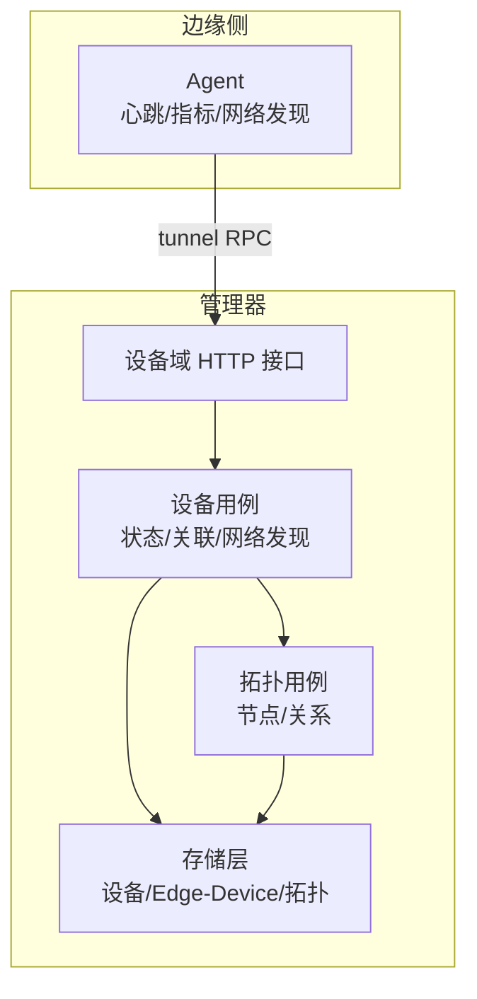
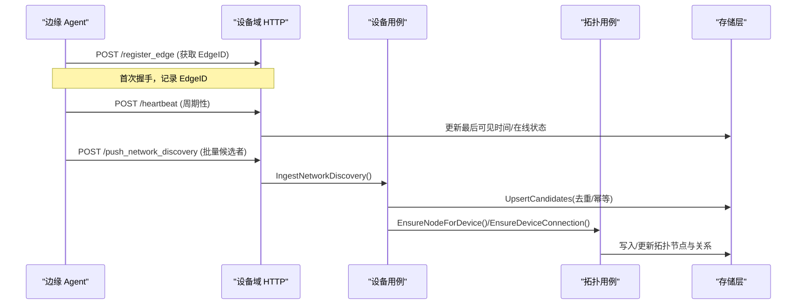
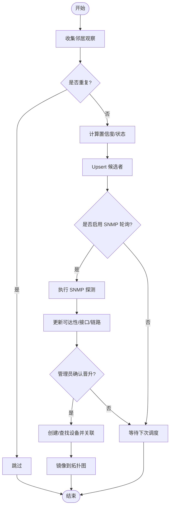
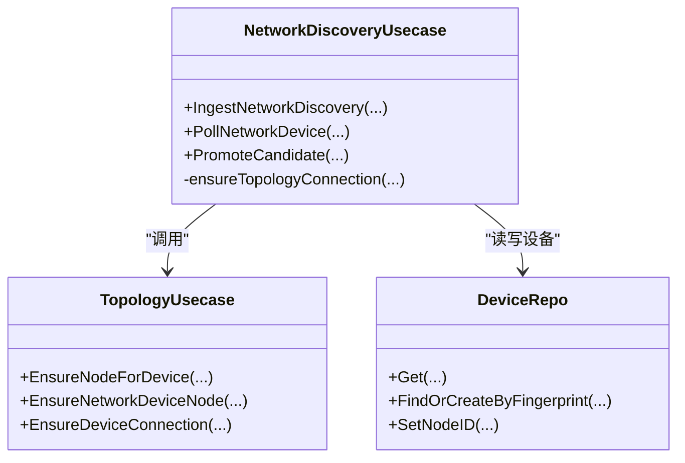
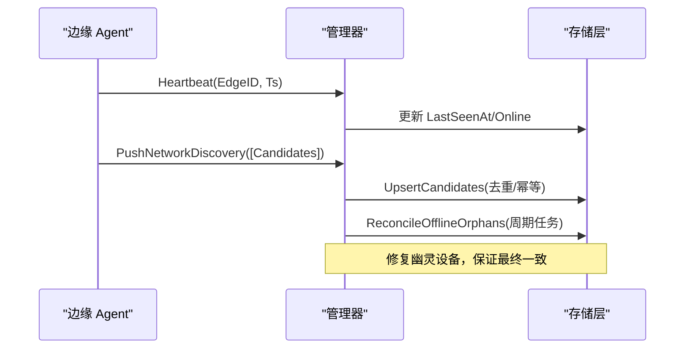
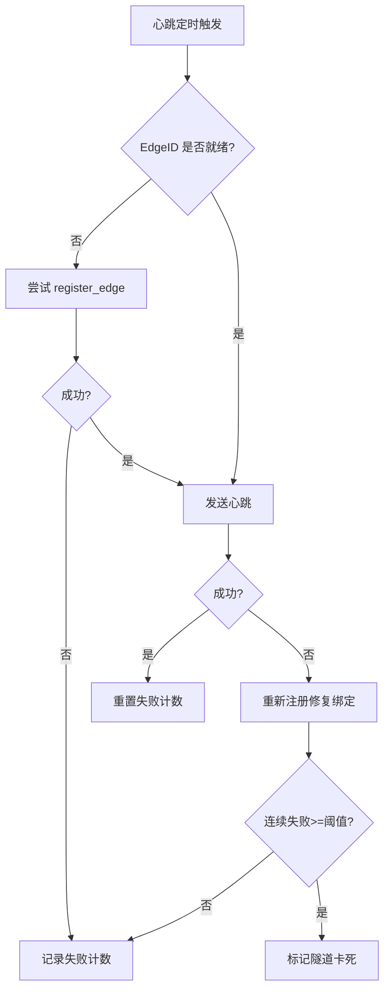
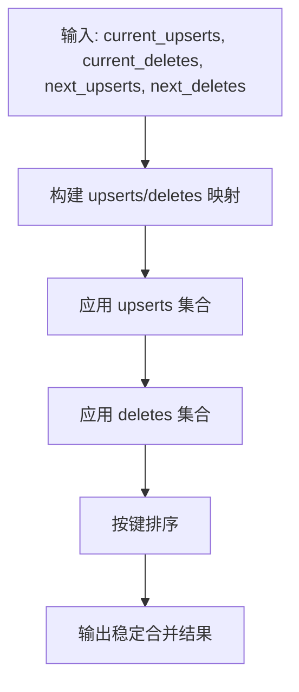
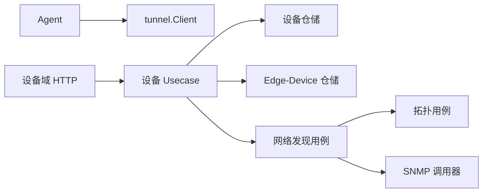

# 设备状态同步

<cite>
**本文引用的文件**
- [internal/manager/server/device/http.go](file://internal/manager/server/device/http.go)
- [internal/manager/biz/device/network_discovery.go](file://internal/manager/biz/device/network_discovery.go)
- [internal/edgeagent/biz/agent.go](file://internal/edgeagent/biz/agent.go)
- [internal/manager/data/device/store/edge_device.go](file://internal/manager/data/device/store/edge_device.go)
- [internal/manager/biz/topology/usecase.go](file://internal/manager/biz/topology/usecase.go)
- [internal/manager/biz/device/usecase.go](file://internal/manager/biz/device/usecase.go)
- [internal/manager/data/device/store/device_test.go](file://internal/manager/data/device/store/device_test.go)
- [internal/edgeagent/k8s/inventory_watch_accumulator.go](file://internal/edgeagent/k8s/inventory_watch_accumulator.go)
</cite>

## 目录
1. [简介](#简介)
2. [项目结构](#项目结构)
3. [核心组件](#核心组件)
4. [架构总览](#架构总览)
5. [详细组件分析](#详细组件分析)
6. [依赖关系分析](#依赖关系分析)
7. [性能考虑](#性能考虑)
8. [故障排查指南](#故障排查指南)
9. [结论](#结论)
10. [附录：API 使用示例](#附录api-使用示例)

## 简介
本文件系统性阐述设备状态同步机制，覆盖设备发现算法、网络拓扑构建、状态同步协议、增量更新与冲突检测、数据一致性保证、缓存策略与版本控制、在线检测与心跳、故障转移，以及大规模场景下的性能优化与扩展性。文档同时提供数据流向图与时序图，并给出设备状态查询与管理 API 的使用示例。

## 项目结构
该子系统由边缘 Agent、管理器（Manager）的设备域与拓扑域组成：
- 边缘侧 Agent 负责周期性心跳、指标上报、被动网络发现（ARP/LLDP/SNMP），并通过隧道向管理器推送。
- 管理器设备域负责设备注册、在线状态维护、设备与 Edge 的关联、网络设备的 SNMP 轮询与候选者晋升为正式设备。
- 管理器拓扑域负责将物理邻接关系映射到通用拓扑图中，形成“设备节点 + 连接关系”的拓扑视图。

**图表来源**
- [internal/edgeagent/biz/agent.go:186-271](file://internal/edgeagent/biz/agent.go#L186-L271)
- [internal/manager/server/device/http.go:52-65](file://internal/manager/server/device/http.go#L52-L65)
- [internal/manager/biz/device/usecase.go:16-42](file://internal/manager/biz/device/usecase.go#L16-L42)
- [internal/manager/biz/topology/usecase.go:222-246](file://internal/manager/biz/topology/usecase.go#L222-L246)

**章节来源**
- [internal/edgeagent/biz/agent.go:186-271](file://internal/edgeagent/biz/agent.go#L186-L271)
- [internal/manager/server/device/http.go:52-65](file://internal/manager/server/device/http.go#L52-L65)

## 核心组件
- 边缘 Agent：心跳循环、指标上报、网络发现循环、重连与升级流程。
- 设备域 HTTP Handler：暴露 /v1/devices 等 REST 接口，处理设备列表、详情、角色、删除、网络发现候选者管理等。
- 设备用例（Usecase）：封装设备仓库与 Edge-Device 关联仓库，提供统一业务方法；可选接入网络发现用例。
- 网络发现用例：接收 Edge 上报的邻居观察（ARP/LLDP/SNMP），持久化为候选者，支持 SNMP 轮询、验证与晋升为正式网络设备，并镜像到拓扑图。
- 拓扑用例：确保设备节点存在，建立“设备间连接”关系，去重与属性更新。
- 存储层：GORM 实现的设备表、Edge-Device 关联表、拓扑节点与关系表。

**章节来源**
- [internal/manager/server/device/http.go:52-65](file://internal/manager/server/device/http.go#L52-L65)
- [internal/manager/biz/device/usecase.go:16-42](file://internal/manager/biz/device/usecase.go#L16-L42)
- [internal/manager/biz/device/network_discovery.go:82-122](file://internal/manager/biz/device/network_discovery.go#L82-L122)
- [internal/manager/biz/topology/usecase.go:222-246](file://internal/manager/biz/topology/usecase.go#L222-L246)
- [internal/manager/data/device/store/edge_device.go:25-45](file://internal/manager/data/device/store/edge_device.go#L25-L45)

## 架构总览
设备状态同步的核心路径包括：
- 设备注册与在线：Agent 通过 register_edge 获取 EdgeID，周期性发送心跳；管理器根据心跳与 Edge 关联判定设备在线。
- 网络发现：Agent 周期收集 ARP/LLDP/SNMP 观察，推送到管理器；管理器持久化候选者，支持 SNMP 轮询与管理员手动晋升。
- 拓扑构建：网络发现或管理动作触发时，管理器在拓扑图中创建设备节点并建立连接关系。
- 增量更新与一致性：通过键控合并（upsert/delete）、幂等写入、软删除与孤儿修复，保证最终一致性与可观测性。

**图表来源**
- [internal/edgeagent/biz/agent.go:530-602](file://internal/edgeagent/biz/agent.go#L530-L602)
- [internal/manager/biz/device/network_discovery.go:544-591](file://internal/manager/biz/device/network_discovery.go#L544-L591)
- [internal/manager/biz/topology/usecase.go:222-246](file://internal/manager/biz/topology/usecase.go#L222-L246)

## 详细组件分析

### 设备发现算法（ARP/LLDP/SNMP）
- 输入：Edge 周期性上报邻居观察（包含 IP/MAC、LLDP/SNMP 强标识、接口信息等）。
- 去重与置信度：基于观察键（EdgeID+身份+接口名）去重；根据来源与强标识计算置信度与状态（未知/已识别/SNMP 已验证/忽略/已晋升）。
- 持久化：批量 Upsert 候选者，限制批次大小，避免过载。
- 巡检与验证：支持配置 SNMP 轮询（凭证从密钥库解析），读取接口与链路信息，更新可达性与错误信息。
- 晋升：管理员确认后，将候选者晋升为正式网络设备，生成设备指纹（强标识优先），建立与观察 Edge 的关联，并镜像到拓扑图。

**图表来源**
- [internal/manager/biz/device/network_discovery.go:544-591](file://internal/manager/biz/device/network_discovery.go#L544-L591)
- [internal/manager/biz/device/network_discovery.go:208-289](file://internal/manager/biz/device/network_discovery.go#L208-L289)
- [internal/manager/biz/device/network_discovery.go:310-380](file://internal/manager/biz/device/network_discovery.go#L310-L380)

**章节来源**
- [internal/manager/biz/device/network_discovery.go:544-591](file://internal/manager/biz/device/network_discovery.go#L544-L591)
- [internal/manager/biz/device/network_discovery.go:208-289](file://internal/manager/biz/device/network_discovery.go#L208-L289)
- [internal/manager/biz/device/network_discovery.go:310-380](file://internal/manager/biz/device/network_discovery.go#L310-L380)

### 网络拓扑构建
- 节点保障：为 Host 设备与网络设备分别确保拓扑节点存在，必要时回填 NodeID 到设备行。
- 关系建立：对每对设备节点建立“ConnectedTo”关系，按 ID 排序保证无向边唯一；若属性变更则更新而非重复创建。
- 来源标注：关系属性 JSON 记录来源（如 network_discovery）、候选者 ID、观察者 Edge 等信息，便于溯源。

**图表来源**
- [internal/manager/biz/device/network_discovery.go:382-420](file://internal/manager/biz/device/network_discovery.go#L382-L420)
- [internal/manager/biz/topology/usecase.go:222-246](file://internal/manager/biz/topology/usecase.go#L222-L246)

**章节来源**
- [internal/manager/biz/device/network_discovery.go:382-420](file://internal/manager/biz/device/network_discovery.go#L382-L420)
- [internal/manager/biz/topology/usecase.go:222-246](file://internal/manager/biz/topology/usecase.go#L222-L246)

### 状态同步协议与增量更新
- 心跳协议：Agent 周期性发送心跳，携带 EdgeID 与时间戳；管理器据此判断在线状态与最后可见时间。
- 指标上报：两种路径——旧版主机指标点与新版 Prometheus 样本；失败不阻塞下一周期。
- 网络发现增量：批量候选者以观察键去重；合并 upsert/delete 操作，保证幂等与顺序稳定。
- 冲突检测：候选者晋升前校验状态（如忽略态拒绝晋升）；SNMP 探测失败记录错误并标记不可达。
- 一致性保证：
  - 幂等写入：Edge-Device 关联使用 ON CONFLICT DO NOTHING。
  - 软删除：Edge 软删后，设备在线状态会被修复为离线。
  - 孤儿修复：定期扫描无有效 Edge 关联的在线设备，将其置为离线。

**图表来源**
- [internal/edgeagent/biz/agent.go:530-602](file://internal/edgeagent/biz/agent.go#L530-L602)
- [internal/manager/biz/device/network_discovery.go:544-591](file://internal/manager/biz/device/network_discovery.go#L544-L591)
- [internal/manager/data/device/store/device_test.go:335-375](file://internal/manager/data/device/store/device_test.go#L335-L375)

**章节来源**
- [internal/edgeagent/biz/agent.go:530-602](file://internal/edgeagent/biz/agent.go#L530-L602)
- [internal/manager/biz/device/network_discovery.go:544-591](file://internal/manager/biz/device/network_discovery.go#L544-L591)
- [internal/manager/data/device/store/device_test.go:335-375](file://internal/manager/data/device/store/device_test.go#L335-L375)

### 缓存策略、版本控制与历史追踪
- 缓存策略：
  - 边缘侧指标采集采用批缓冲（MetricsBatchSize），减少频繁 RPC。
  - 网络发现候选者批量 Upsert，限制批次上限，避免风暴。
- 版本控制：
  - AgentVersion 在注册时上报，健康标记文件用于升级回滚决策。
  - 拓扑关系属性 JSON 记录来源与候选者 ID，便于历史追溯。
- 历史追踪：
  - 候选者保留 SourceDataJSON、InterfacesJSON、LinksJSON 等原始快照。
  - 网络设备可达性记录 LastReachableAt、LastPollAt、LastPollError。

**章节来源**
- [internal/edgeagent/biz/agent.go:60-92](file://internal/edgeagent/biz/agent.go#L60-L92)
- [internal/edgeagent/biz/agent.go:328-353](file://internal/edgeagent/biz/agent.go#L328-L353)
- [internal/manager/biz/device/network_discovery.go:208-289](file://internal/manager/biz/device/network_discovery.go#L208-L289)
- [internal/manager/biz/device/network_discovery.go:463-503](file://internal/manager/biz/device/network_discovery.go#L463-L503)

### 设备在线检测、心跳机制与故障转移
- 在线检测：基于心跳与 Edge 关联；若无任何非软删的 Edge 在线，设备被判定为离线。
- 心跳机制：固定间隔发送，失败重试并尝试重新注册；连续失败达到阈值视为隧道卡死。
- 故障转移：
  - 隧道重连回调触发重新注册，恢复 EdgeID 绑定。
  - 健康标记文件辅助升级回滚，确保新二进制健康启动。

**图表来源**
- [internal/edgeagent/biz/agent.go:530-602](file://internal/edgeagent/biz/agent.go#L530-L602)
- [internal/edgeagent/biz/agent.go:186-271](file://internal/edgeagent/biz/agent.go#L186-L271)

**章节来源**
- [internal/edgeagent/biz/agent.go:530-602](file://internal/edgeagent/biz/agent.go#L530-L602)
- [internal/edgeagent/biz/agent.go:186-271](file://internal/edgeagent/biz/agent.go#L186-L271)

### 增量更新机制（库存/指标合并）
- 合并策略：对当前与下一批 upsert/delete 操作进行键控合并，先应用 upserts，再应用 deletes，消除冲突与重复。
- 稳定性：对 upsert 与 delete 的 key 排序输出，保证结果确定性。

**图表来源**
- [internal/edgeagent/k8s/inventory_watch_accumulator.go:106-161](file://internal/edgeagent/k8s/inventory_watch_accumulator.go#L106-L161)

**章节来源**
- [internal/edgeagent/k8s/inventory_watch_accumulator.go:106-161](file://internal/edgeagent/k8s/inventory_watch_accumulator.go#L106-L161)

## 依赖关系分析
- 边缘 Agent 依赖 tunnel.Client 进行 RPC；通过 OnReconnect 钩子实现故障转移。
- 设备域 HTTP Handler 依赖 Usecase；Usecase 依赖 Repo 与 EdgeDeviceRepo；可选注入 NetworkDiscoveryUsecase。
- 网络发现用例依赖 NetworkTopologyMirror 与 NetworkSNMPCaller，解耦传输与拓扑实现。
- 拓扑用例依赖 relations/nodes/types 仓储，保证节点与关系的原子写入。

**图表来源**
- [internal/manager/server/device/http.go:52-65](file://internal/manager/server/device/http.go#L52-L65)
- [internal/manager/biz/device/usecase.go:16-42](file://internal/manager/biz/device/usecase.go#L16-L42)
- [internal/manager/biz/device/network_discovery.go:25-66](file://internal/manager/biz/device/network_discovery.go#L25-L66)
- [internal/manager/biz/topology/usecase.go:222-246](file://internal/manager/biz/topology/usecase.go#L222-L246)

**章节来源**
- [internal/manager/server/device/http.go:52-65](file://internal/manager/server/device/http.go#L52-L65)
- [internal/manager/biz/device/usecase.go:16-42](file://internal/manager/biz/device/usecase.go#L16-L42)
- [internal/manager/biz/device/network_discovery.go:25-66](file://internal/manager/biz/device/network_discovery.go#L25-L66)
- [internal/manager/biz/topology/usecase.go:222-246](file://internal/manager/biz/topology/usecase.go#L222-L246)

## 性能考虑
- 批量与限流：
  - 网络发现候选者批次上限限制，避免一次性过大负载。
  - SNMP 轮询串行执行，避免反向隧道拥塞。
- 去重与幂等：
  - 候选者观察键去重；Edge-Device 关联幂等写入。
- 指标上报：
  - 指标批缓冲与双通道上报（旧版主机指标点与新版 Prometheus 样本），失败丢弃不影响后续周期。
- 拓扑关系：
  - 关系属性比较后再更新，减少不必要写放大。
- 可扩展性：
  - 通过仓储抽象与用例解耦，便于横向扩展与替换实现。
  - 前端聚合与分页查询（limit/offset）降低单次响应压力。

[本节为一般性指导，不直接分析具体文件]

## 故障排查指南
- 心跳失败：
  - 检查连续失败计数与隧道卡死阈值；必要时触发重新注册。
- 网络发现失败：
  - 查看候选者状态与错误信息；确认 SNMP 凭证可用与端口可达。
- 设备在线异常：
  - 检查 Edge 关联是否存在且未软删；运行孤儿修复任务。
- 拓扑不一致：
  - 核对设备 NodeID 是否回填；检查关系属性是否与预期一致。

**章节来源**
- [internal/edgeagent/biz/agent.go:530-602](file://internal/edgeagent/biz/agent.go#L530-L602)
- [internal/manager/biz/device/network_discovery.go:291-299](file://internal/manager/biz/device/network_discovery.go#L291-L299)
- [internal/manager/data/device/store/device_test.go:335-375](file://internal/manager/data/device/store/device_test.go#L335-L375)

## 结论
该设备状态同步机制通过边缘心跳与网络发现、管理器设备与拓扑用例协作，实现了高可靠、可扩展的设备在线管理与网络拓扑构建。增量更新、冲突检测与一致性修复保障了数据正确性；批量与限流策略提升了大规模场景下的性能。结合清晰的 API 与可观测字段，便于运维与排障。

[本节为总结，不直接分析具体文件]

## 附录：API 使用示例
以下示例基于设备域 HTTP 接口，展示设备状态查询与管理的关键用法。

- 列出设备（支持过滤在线、角色、分页）
  - GET /v1/devices?online=true&roles=host,switch&limit=50&offset=0
  - 说明：返回设备列表与总数；可用于仪表盘统计在线/离线数量。

- 获取设备详情
  - GET /v1/devices/{id}
  - 说明：返回设备基本信息、在线状态、最后可见时间、拓扑节点 ID 等。

- 更新设备名称与描述（需管理员权限）
  - PATCH /v1/devices/{id}
  - Body: {"name": "...", "description": "..."}

- 更新设备角色（需管理员权限）
  - PATCH /v1/devices/{id}/roles
  - Body: {"roles": ["host","switch"]}

- 删除设备（需管理员权限）
  - DELETE /v1/devices/{id}

- 查询设备关联的 Edge
  - GET /v1/devices/{id}/edges
  - 说明：返回该设备关联的所有 Edge 及关系类型。

- 查询已验证的网络设备详情
  - GET /v1/devices/{id}/network
  - 说明：返回 SNMP 轮询配置、可达性、最近探测时间与错误信息。

- 配置 SNMP 轮询（需管理员权限）
  - PATCH /v1/devices/{id}/network/polling
  - Body: {"enabled": true, "interval_seconds": 300, "credential_name": "...", "port": 161}

- 列出网络发现候选者
  - GET /v1/network-discovery/candidates?status=snmp_verified&limit=100&offset=0

- 扫描并晋升候选者为网络设备（需管理员权限）
  - POST /v1/network-discovery/candidates/{id}/promote
  - Body: {"name": "switch-a"}

- 对候选者执行一次 SNMP 扫描（需管理员权限）
  - POST /v1/network-discovery/candidates/{id}/snmp-scan
  - Body: {"address": "...", "version": "v2c", "community": "...", "timeout_ms": 5000, "retries": 1}

**章节来源**
- [internal/manager/server/device/http.go:52-65](file://internal/manager/server/device/http.go#L52-L65)
- [internal/manager/server/device/http.go:383-428](file://internal/manager/server/device/http.go#L383-L428)
- [internal/manager/server/device/http.go:430-452](file://internal/manager/server/device/http.go#L430-L452)
- [internal/manager/server/device/http.go:472-555](file://internal/manager/server/device/http.go#L472-L555)