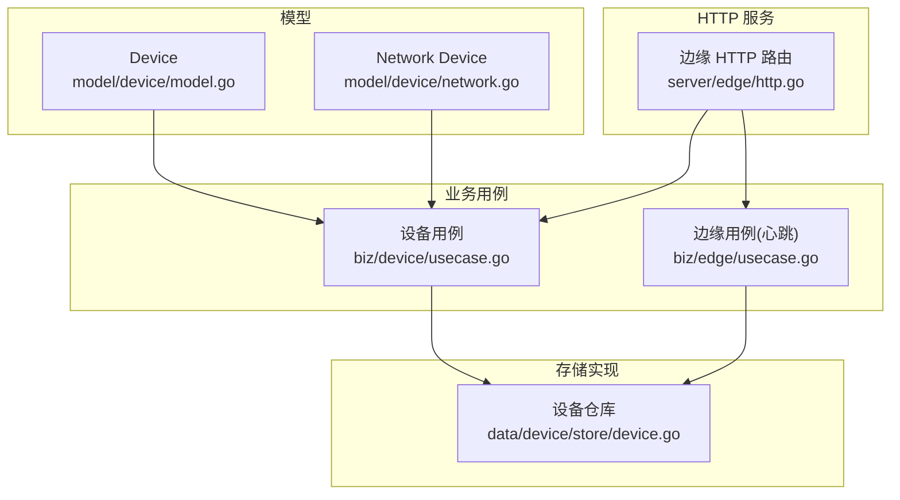
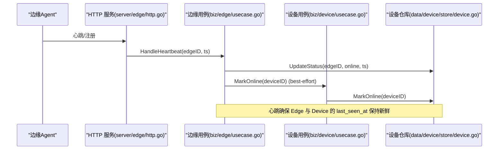
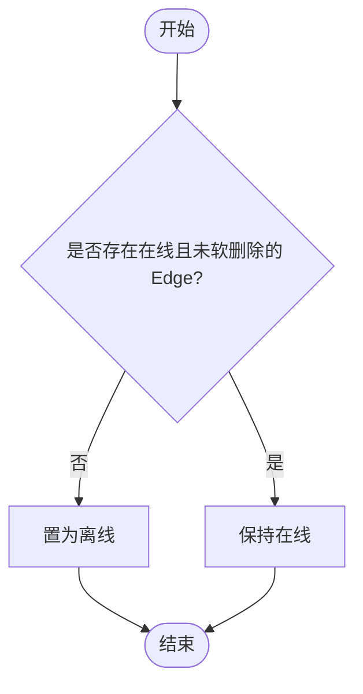
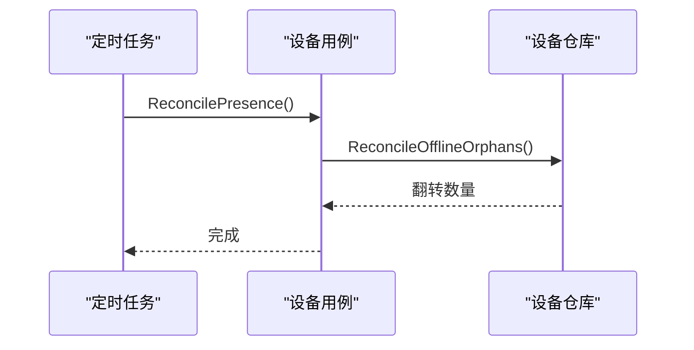
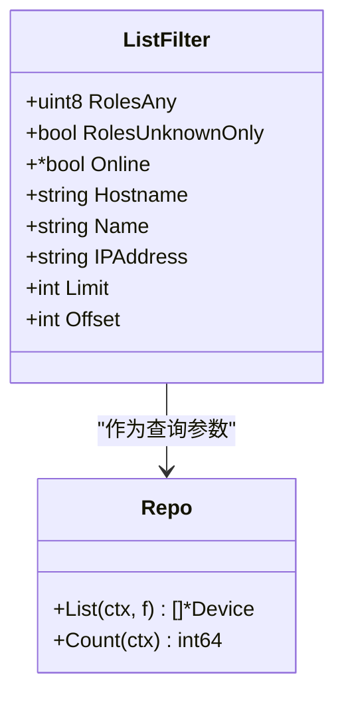
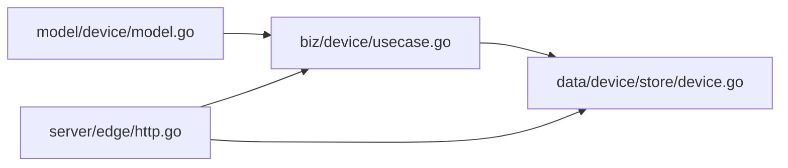

# 设备状态管理

<cite>
**本文引用的文件**
- [internal/manager/model/device/model.go](file://internal/manager/model/device/model.go)
- [internal/manager/model/device/network.go](file://internal/manager/model/device/network.go)
- [internal/manager/biz/device/repo.go](file://internal/manager/biz/device/repo.go)
- [internal/manager/biz/device/usecase.go](file://internal/manager/biz/device/usecase.go)
- [internal/manager/data/device/store/device.go](file://internal/manager/data/device/store/device.go)
- [internal/manager/server/edge/http.go](file://internal/manager/server/edge/http.go)
- [internal/manager/biz/edge/usecase.go](file://internal/manager/biz/edge/usecase.go)
- [web/src/pages/Edges.tsx](file://web/src/pages/Edges.tsx)
- [web/src/lib/rule_presets.ts](file://web/src/lib/rule_presets.ts)
</cite>

## 目录
1. [简介](#简介)
2. [项目结构](#项目结构)
3. [核心组件](#核心组件)
4. [架构总览](#架构总览)
5. [详细组件分析](#详细组件分析)
6. [依赖关系分析](#依赖关系分析)
7. [性能考虑](#性能考虑)
8. [故障排查指南](#故障排查指南)
9. [结论](#结论)
10. [附录](#附录)

## 简介
本文件系统化梳理设备状态管理机制，覆盖设备状态定义、生命周期与转换规则；在线检测、心跳监控与故障检测；状态缓存、版本控制与历史追踪；属性同步、增量更新与冲突解决；查询接口、过滤条件与聚合统计；API 使用示例与最佳实践；以及高并发场景下的状态一致性与性能优化方案。

## 项目结构
设备状态管理由“模型层 → 业务用例 → 存储实现 → HTTP 服务”分层构成：
- 模型层：定义设备实体、角色位域、网络可达字段等。
- 业务用例：封装设备存在性修复、删除清理、拓扑节点清理等流程。
- 存储实现：基于 GORM 的增删改查、软删除、批量操作与一致性修复。
- HTTP 服务：边缘端点路由、列表详情返回、与设备信息的关联展示。

**图示来源**
- [internal/manager/model/device/model.go:29-102](file://internal/manager/model/device/model.go#L29-L102)
- [internal/manager/model/device/network.go:21-35](file://internal/manager/model/device/network.go#L21-L35)
- [internal/manager/biz/device/usecase.go:16-79](file://internal/manager/biz/device/usecase.go#L16-L79)
- [internal/manager/biz/edge/usecase.go:581-611](file://internal/manager/biz/edge/usecase.go#L581-L611)
- [internal/manager/data/device/store/device.go:174-229](file://internal/manager/data/device/store/device.go#L174-L229)
- [internal/manager/server/edge/http.go:454-499](file://internal/manager/server/edge/http.go#L454-L499)

**章节来源**
- [internal/manager/model/device/model.go:29-102](file://internal/manager/model/device/model.go#L29-L102)
- [internal/manager/model/device/network.go:21-35](file://internal/manager/model/device/network.go#L21-L35)
- [internal/manager/biz/device/usecase.go:16-79](file://internal/manager/biz/device/usecase.go#L16-L79)
- [internal/manager/biz/edge/usecase.go:581-611](file://internal/manager/biz/edge/usecase.go#L581-L611)
- [internal/manager/data/device/store/device.go:174-229](file://internal/manager/data/device/store/device.go#L174-L229)
- [internal/manager/server/edge/http.go:454-499](file://internal/manager/server/edge/http.go#L454-L499)

## 核心组件
- 设备模型（Device）：承载主机事实（主机名、OS、架构、内核、容量）、实时用量（CPU/Mem/Disk 百分比）、角色位域、在线标志与最后在线时间、拓扑节点关联等。
- 网络设备扩展：包含可达性状态、最近可达时间、轮询开关与间隔、凭证名称、端口、最近轮询时间与错误等。
- 设备仓库接口（Repo）：提供按指纹查找或创建、主机事实更新、用量更新、角色更新、在线/离线标记、列表查询、计数、删除、孤儿设备修复等能力。
- 设备用例（Usecase）：编排存在性修复、拓扑节点清理、孤儿设备清理、角色设置、名称描述更新、删除保护（在线设备不可删）等。
- 边缘用例（Edge Usecase）：处理心跳，刷新 Edge 的 last_seen_at，并尝试镜像到 Device 的 last_seen_at。
- HTTP 服务：暴露边缘端点，列表/详情中反规范化填充设备角色与主机信息，便于 UI 渲染。

**章节来源**
- [internal/manager/model/device/model.go:29-102](file://internal/manager/model/device/model.go#L29-L102)
- [internal/manager/model/device/network.go:21-35](file://internal/manager/model/device/network.go#L21-L35)
- [internal/manager/biz/device/repo.go:12-107](file://internal/manager/biz/device/repo.go#L12-L107)
- [internal/manager/biz/device/usecase.go:62-155](file://internal/manager/biz/device/usecase.go#L62-L155)
- [internal/manager/biz/edge/usecase.go:581-611](file://internal/manager/biz/edge/usecase.go#L581-L611)
- [internal/manager/server/edge/http.go:454-499](file://internal/manager/server/edge/http.go#L454-L499)

## 架构总览
设备状态管理的关键路径包括：
- 注册与首次上线：通过指纹去重创建/定位设备，写入主机事实，建立与 Edge 的关联。
- 心跳与在线：心跳到达时刷新 Edge 的 last_seen_at，并尝试将 Device 的 last_seen_at 也刷新为最新。
- 存在性修复：周期性扫描，若设备无在线且未软删除的 Edge 关联，则将设备置为离线，避免“幽灵在线”。
- 删除与清理：仅允许删除离线设备，并在事务中清理关联 Edge 与 junction，同时移除拓扑节点。
- 列表与详情：HTTP 返回列表/详情时，反规范化设备角色与主机信息，提升 UI 渲染性能。

**图示来源**
- [internal/manager/biz/edge/usecase.go:581-611](file://internal/manager/biz/edge/usecase.go#L581-L611)
- [internal/manager/data/device/store/device.go:174-188](file://internal/manager/data/device/store/device.go#L174-L188)
- [internal/manager/server/edge/http.go:454-499](file://internal/manager/server/edge/http.go#L454-L499)

## 详细组件分析

### 设备状态定义与生命周期
- 状态字段
  - Online：设备是否在线（布尔）。
  - LastSeenAt：设备最后一次被观测到的时间。
  - ReachabilityStatus/LastReachableAt：网络设备可达性状态与最近可达时间。
- 生命周期
  - 注册/首次上报：根据指纹查找或创建设备，写入主机事实。
  - 心跳到达：刷新 Edge 的 last_seen_at，并尝试刷新 Device 的 last_seen_at。
  - 存在性修复：若无在线且未软删除的 Edge 关联，则置为离线。
  - 删除：仅允许删除离线设备，事务内清理关联 Edge 与 junction，并移除拓扑节点。

**图示来源**
- [internal/manager/data/device/store/device.go:203-229](file://internal/manager/data/device/store/device.go#L203-L229)
- [internal/manager/biz/device/usecase.go:62-79](file://internal/manager/biz/device/usecase.go#L62-L79)

**章节来源**
- [internal/manager/model/device/model.go:29-102](file://internal/manager/model/device/model.go#L29-L102)
- [internal/manager/model/device/network.go:21-35](file://internal/manager/model/device/network.go#L21-L35)
- [internal/manager/data/device/store/device.go:174-229](file://internal/manager/data/device/store/device.go#L174-L229)
- [internal/manager/biz/device/usecase.go:62-79](file://internal/manager/biz/device/usecase.go#L62-L79)

### 在线检测机制、心跳监控与故障检测
- 心跳监控：每次心跳到达时，刷新 Edge 的 last_seen_at，并 best-effort 刷新 Device 的 last_seen_at，保证列表页“最后看到时间”准确。
- 故障检测：
  - 基于心跳超时：前端告警预设以 edge_last_seen_seconds_ago > 阈值判定离线。
  - 存在性修复：周期任务将无在线 Edge 关联的设备置为离线，防止“幽灵在线”。
  - 网络可达性：对网络设备，使用 reachability_status 与 last_reachable_at 辅助判断。

**图示来源**
- [internal/manager/biz/device/usecase.go:62-79](file://internal/manager/biz/device/usecase.go#L62-L79)
- [internal/manager/data/device/store/device.go:203-229](file://internal/manager/data/device/store/device.go#L203-L229)
- [web/src/lib/rule_presets.ts:55-87](file://web/src/lib/rule_presets.ts#L55-L87)

**章节来源**
- [internal/manager/biz/edge/usecase.go:581-611](file://internal/manager/biz/edge/usecase.go#L581-L611)
- [web/src/lib/rule_presets.ts:55-87](file://web/src/lib/rule_presets.ts#L55-L87)
- [internal/manager/data/device/store/device.go:203-229](file://internal/manager/data/device/store/device.go#L203-L229)

### 状态缓存策略、版本控制与历史追踪
- 状态缓存：Device 表中的 CPU/Mem/Disk 用量百分比为“最新值缓存”，避免每次列表都 JOIN 指标表，提升渲染性能。
- 版本控制：设备通过 Fingerprint 稳定标识，支持 RebindFingerprint 在算法升级时迁移而不丢失 ID 与历史。
- 历史追踪：使用软删除（DeletedAt/DeleteMarker）保留历史行，配合 ListWithoutLiveEdges 与 ReconcileDeletedTopology 清理残留。

**章节来源**
- [internal/manager/model/device/model.go:29-102](file://internal/manager/model/device/model.go#L29-L102)
- [internal/manager/data/device/store/device.go:32-79](file://internal/manager/data/device/store/device.go#L32-L79)
- [internal/manager/data/device/store/device.go:302-344](file://internal/manager/data/device/store/device.go#L302-L344)

### 设备属性同步、增量更新与冲突解决
- 属性同步：注册时写入主机事实（主机名、OS、架构、内核、容量、IP），后续通过 UpdateHostFacts 增量更新。
- 增量更新：用量指标通过 UpdateUsage 定期刷新，避免全量覆盖。
- 冲突解决：
  - 删除保护：在线设备不允许删除，拒绝并返回冲突错误。
  - 关联 Edge 保护：若任一关联 Edge 仍在线，禁止删除设备。
  - 指纹迁移：RebindFingerprint 在新指纹已存在时跳过，避免覆盖。

**章节来源**
- [internal/manager/data/device/store/device.go:81-103](file://internal/manager/data/device/store/device.go#L81-L103)
- [internal/manager/data/device/store/device.go:105-119](file://internal/manager/data/device/store/device.go#L105-L119)
- [internal/manager/data/device/store/device.go:358-419](file://internal/manager/data/device/store/device.go#L358-L419)
- [internal/manager/data/device/store/device.go:57-79](file://internal/manager/data/device/store/device.go#L57-L79)

### 设备状态查询接口、过滤条件与聚合统计
- 查询接口：设备列表/详情通过 HTTP 暴露，列表/详情中反规范化设备角色与主机信息。
- 过滤条件：支持按角色位掩码、是否在线、主机名/名称/IP 前缀匹配、分页限制。
- 聚合统计：Count 返回非软删除设备总数；列表返回 items 与 total。

**图示来源**
- [internal/manager/biz/device/repo.go:12-30](file://internal/manager/biz/device/repo.go#L12-L30)
- [internal/manager/data/device/store/device.go:259-300](file://internal/manager/data/device/store/device.go#L259-L300)

**章节来源**
- [internal/manager/server/edge/http.go:454-499](file://internal/manager/server/edge/http.go#L454-L499)
- [internal/manager/biz/device/repo.go:12-30](file://internal/manager/biz/device/repo.go#L12-L30)
- [internal/manager/data/device/store/device.go:259-300](file://internal/manager/data/device/store/device.go#L259-L300)

### API 使用示例与最佳实践
- 列出设备：GET /v1/edges?status=&name=&limit=&offset=，响应中包含 roles、host_info、last_seen_at 等。
- 获取设备详情：GET /v1/edges/{id}，返回角色、主机信息与最后在线时间。
- 旋转密钥：POST /v1/edges/{id}/rotate-secret，管理员权限。
- 批量操作：POST /v1/edges/batch/*，限流与并发控制，部分失败返回 per-id 结果。
- 最佳实践
  - 使用角色位掩码进行高效过滤。
  - 利用 Count 做分页基数。
  - 对敏感操作（删除、升级）遵循权限与校验。
  - 批量操作注意并发上限与错误聚合。

**章节来源**
- [internal/manager/server/edge/http.go:150-199](file://internal/manager/server/edge/http.go#L150-L199)
- [internal/manager/server/edge/http.go:454-499](file://internal/manager/server/edge/http.go#L454-L499)
- [internal/manager/server/edge/http.go:568-580](file://internal/manager/server/edge/http.go#L568-L580)
- [internal/manager/server/edge/http.go:739-800](file://internal/manager/server/edge/http.go#L739-L800)

## 依赖关系分析
- 模型与用例：设备模型被用例引用，用于角色编码/解码、位域校验。
- 用例与仓库：用例调用仓库进行数据持久化与一致性修复。
- HTTP 与服务：HTTP 路由依赖服务与设备仓库，反规范化设备信息以提升 UI 体验。
- 外部依赖：GORM、软删除插件、MySQL/SQLite 后端。

**图示来源**
- [internal/manager/model/device/model.go:29-102](file://internal/manager/model/device/model.go#L29-L102)
- [internal/manager/biz/device/usecase.go:16-79](file://internal/manager/biz/device/usecase.go#L16-L79)
- [internal/manager/data/device/store/device.go:174-229](file://internal/manager/data/device/store/device.go#L174-L229)
- [internal/manager/server/edge/http.go:454-499](file://internal/manager/server/edge/http.go#L454-L499)

**章节来源**
- [internal/manager/model/device/model.go:29-102](file://internal/manager/model/device/model.go#L29-L102)
- [internal/manager/biz/device/usecase.go:16-79](file://internal/manager/biz/device/usecase.go#L16-L79)
- [internal/manager/data/device/store/device.go:174-229](file://internal/manager/data/device/store/device.go#L174-L229)
- [internal/manager/server/edge/http.go:454-499](file://internal/manager/server/edge/http.go#L454-L499)

## 性能考虑
- 列表渲染优化：Device 表缓存 CPU/Mem/Disk 用量百分比，避免每次列表 JOIN 指标表。
- 查询优化：角色过滤使用 MatchingRoleValues 生成 IN 列表，命中索引 idx_devices_roles。
- 批量操作：批量升级/删除限制并发与请求体大小，避免资源耗尽。
- 心跳路径：心跳只写必要字段，best-effort 镜像 Device.last_seen_at，降低失败影响。
- 存在性修复：单次 SQL 批量翻转离线，减少多次往返。

[本节为通用指导，不直接分析具体文件]

## 故障排查指南
- 设备显示“幽灵在线”：检查是否存在在线且未软删除的 Edge 关联；运行 ReconcilePresence 修复。
- 无法删除设备：确认设备是否为离线；若有关联 Edge 在线，需先下线 Edge。
- 列表“最后看到时间”陈旧：确认心跳是否正常到达；检查 Edge 与 Device 的 last_seen_at 是否同步。
- 角色过滤无效：确认角色位掩码与已知位集合匹配；使用 MatchingRoleValues 生成的值。
- 批量操作失败：查看 per-id 结果，关注并发限制与网络异常。

**章节来源**
- [internal/manager/data/device/store/device.go:358-419](file://internal/manager/data/device/store/device.go#L358-L419)
- [internal/manager/biz/device/usecase.go:62-79](file://internal/manager/biz/device/usecase.go#L62-L79)
- [internal/manager/biz/edge/usecase.go:581-611](file://internal/manager/biz/edge/usecase.go#L581-L611)

## 结论
该设备状态管理方案通过清晰的模型定义、稳健的用例编排与高效的存储实现，实现了设备在线检测、心跳监控、故障检测、状态缓存、版本迁移与历史追踪。HTTP 层提供丰富的查询与批量操作能力，满足多租户与大规模部署需求。在高并发场景下，通过批量 SQL、索引优化与并发限制保障一致性与性能。

[本节为总结，不直接分析具体文件]

## 附录
- 前端展示：Edges 页面根据设备类型与可达性状态显示在线/离线或可达/不可达，并展示最近可见/可达时间。
- 告警预设：基于 edge_last_seen_seconds_ago 的离线告警规则，便于快速发现失联设备。

**章节来源**
- [web/src/pages/Edges.tsx:1235-1260](file://web/src/pages/Edges.tsx#L1235-L1260)
- [web/src/lib/rule_presets.ts:55-87](file://web/src/lib/rule_presets.ts#L55-L87)