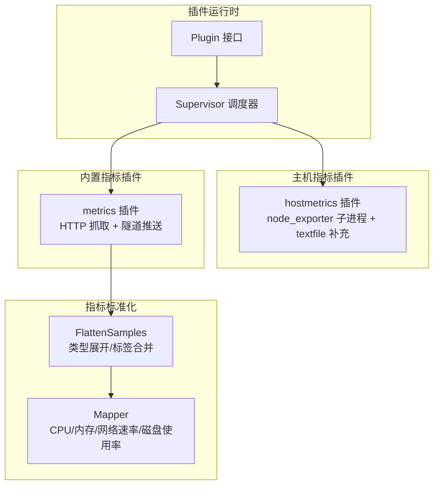
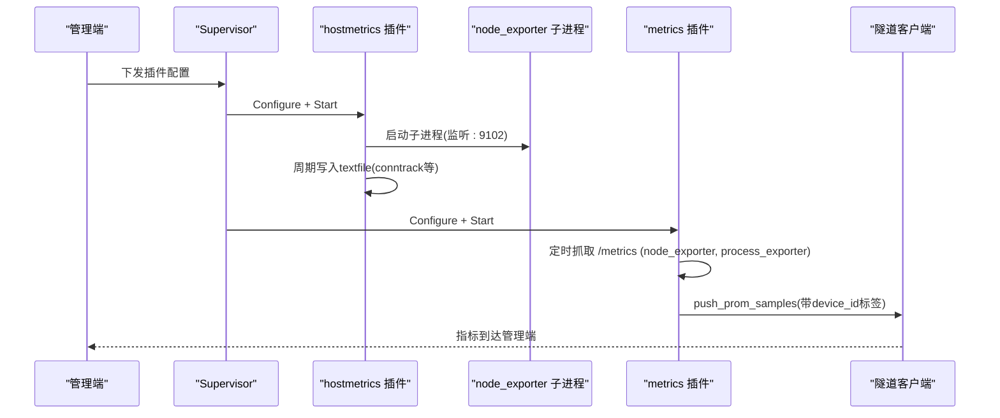
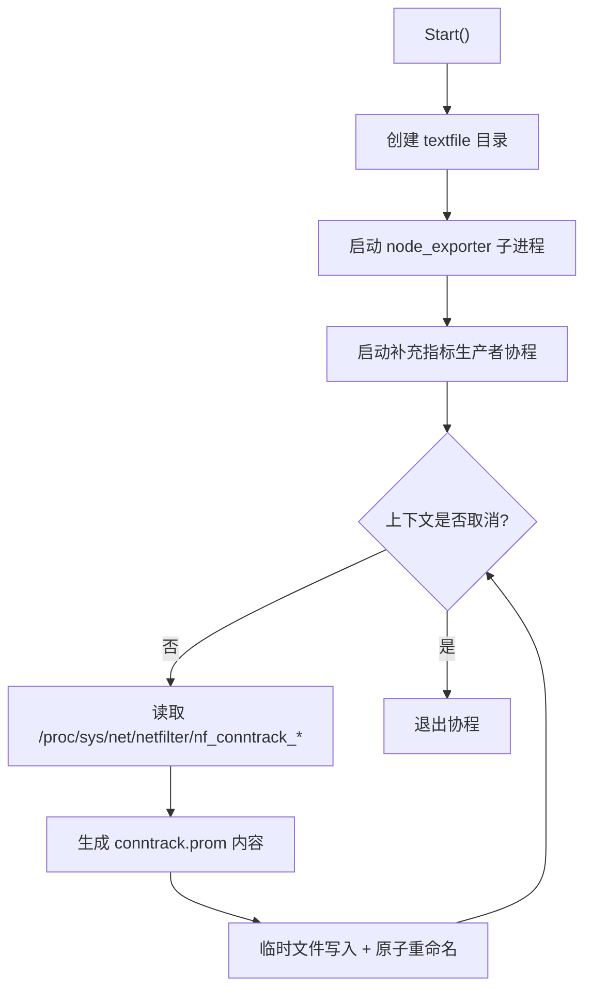
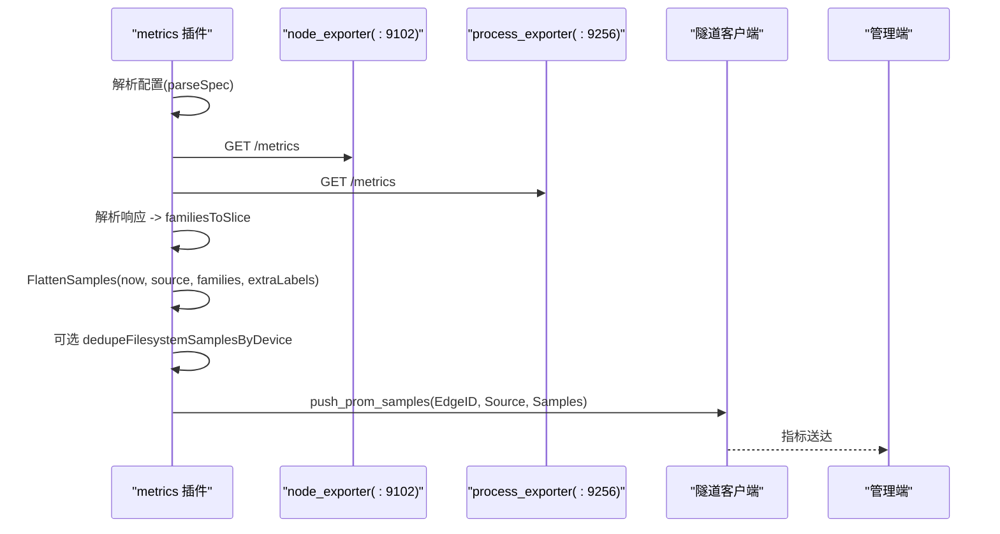
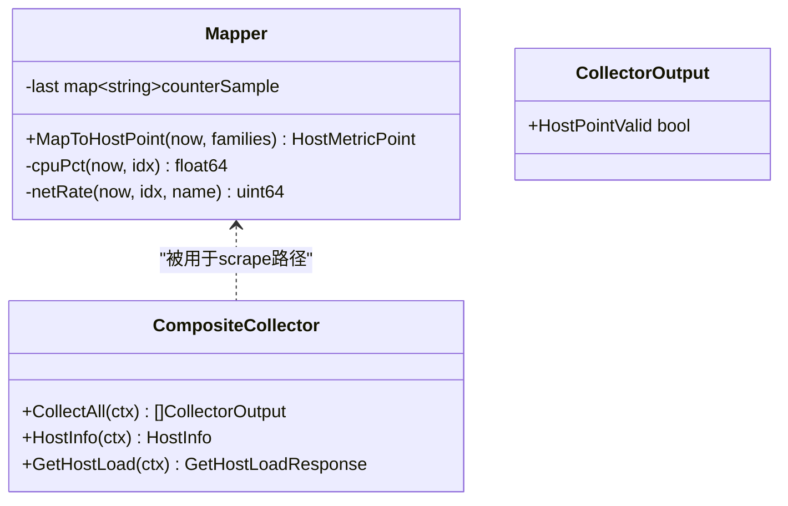
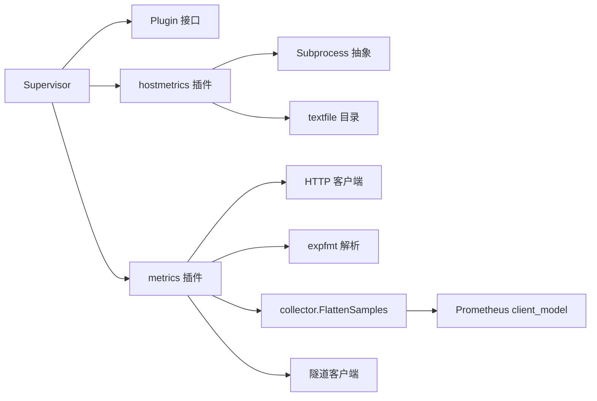

# 主机指标插件

<cite>
**本文引用的文件**
- [internal/edgeagent/plugins/hostmetrics/plugin.go](file://internal/edgeagent/plugins/hostmetrics/plugin.go)
- [internal/edgeagent/plugins/metrics/plugin.go](file://internal/edgeagent/plugins/metrics/plugin.go)
- [internal/edgeagent/plugins/metrics/scrape.go](file://internal/edgeagent/plugins/metrics/scrape.go)
- [internal/edgeagent/plugins/plugin.go](file://internal/edgeagent/plugins/plugin.go)
- [internal/edgeagent/plugins/supervisor.go](file://internal/edgeagent/plugins/supervisor.go)
- [internal/edgeagent/collector/mapper.go](file://internal/edgeagent/collector/mapper.go)
- [internal/edgeagent/collector/composite.go](file://internal/edgeagent/collector/composite.go)
</cite>

## 目录
1. [简介](#简介)
2. [项目结构](#项目结构)
3. [核心组件](#核心组件)
4. [架构总览](#架构总览)
5. [详细组件分析](#详细组件分析)
6. [依赖关系分析](#依赖关系分析)
7. [性能考量](#性能考量)
8. [故障排查指南](#故障排查指南)
9. [结论](#结论)
10. [附录](#附录)

## 简介
本文件面向 Ongrid 边缘侧“主机指标插件”，系统性说明其架构设计与实现原理，覆盖 CPU、内存、网络等系统指标的采集方式、插件注册机制、指标映射规则与性能优化策略。文档同时解释如何通过 gopsutil 或系统调用封装（在本仓库中体现为对 node_exporter 的集成与文本文件补充）以及跨平台兼容性处理；并详述指标数据的标准化转换过程（单位换算、标签添加、数据质量检查）。最后提供配置示例、自定义扩展方法与常见问题解决方案。

## 项目结构
Ongrid 的边缘侧插件体系由统一的插件接口与生命周期管理器驱动，主机指标相关代码主要分布在以下位置：
- 插件运行时与注册：plugins 包定义统一 Plugin 接口、Supervisor 调度与健康上报。
- 主机指标子进程插件：hostmetrics 插件通过启动 node_exporter 子进程暴露 /metrics，并在进程内追加 textfile 补充指标。
- 内置指标抓取插件：metrics 插件在进程内定时抓取本地 /metrics（默认 node_exporter :9102 与 process_exporter :9256），解析 Prometheus 文本格式并通过隧道 RPC 推送至管理端。
- 指标标准化与聚合：collector 包提供 FlattenSamples、Mapper 等工具，完成指标类型展开、标签合并、速率计算与主机关键指标提取。

图表来源
- [internal/edgeagent/plugins/plugin.go:18-52](file://internal/edgeagent/plugins/plugin.go#L18-L52)
- [internal/edgeagent/plugins/supervisor.go:12-47](file://internal/edgeagent/plugins/supervisor.go#L12-L47)
- [internal/edgeagent/plugins/hostmetrics/plugin.go:1-28](file://internal/edgeagent/plugins/hostmetrics/plugin.go#L1-L28)
- [internal/edgeagent/plugins/metrics/plugin.go:1-35](file://internal/edgeagent/plugins/metrics/plugin.go#L1-L35)
- [internal/edgeagent/collector/mapper.go:16-68](file://internal/edgeagent/collector/mapper.go#L16-L68)

章节来源
- [internal/edgeagent/plugins/plugin.go:18-52](file://internal/edgeagent/plugins/plugin.go#L18-L52)
- [internal/edgeagent/plugins/supervisor.go:12-47](file://internal/edgeagent/plugins/supervisor.go#L12-L47)
- [internal/edgeagent/plugins/hostmetrics/plugin.go:1-28](file://internal/edgeagent/plugins/hostmetrics/plugin.go#L1-L28)
- [internal/edgeagent/plugins/metrics/plugin.go:1-35](file://internal/edgeagent/plugins/metrics/plugin.go#L1-L35)
- [internal/edgeagent/collector/mapper.go:16-68](file://internal/edgeagent/collector/mapper.go#L16-L68)

## 核心组件
- 插件接口与配置
  - 所有插件实现统一 Plugin 接口，包含 Name、Configure、Start、Stop、HealthSnapshot。
  - PluginConfig 承载启用标志、EdgeID、Endpoint、认证信息与 Spec（插件特定 JSON 配置）。
- Supervisor 调度器
  - 负责从 ConfigFetcher 拉取配置快照，按“启用/禁用/变更”进行差异化 Apply，维护运行状态与健康上报。
- hostmetrics 插件
  - 以子进程方式启动 node_exporter，监听地址可配（默认 :9102），支持 collectors_enabled/disabled 与 extra_args。
  - 进程内周期性写入 textfile 补充指标（如 nf_conntrack），通过 node_exporter 的 textfile collector 汇入 /metrics。
- metrics 插件
  - 进程内定时抓取目标 /metrics（默认同时抓取 node_exporter 与 process_exporter），解析 Prometheus 文本格式，通过隧道 RPC push_prom_samples 推送至管理端。
  - 支持多目标、超时/间隔、TLS 跳过校验、Bearer Token、额外标签、源标识与文件系统去重。
- 指标标准化
  - FlattenSamples 将 MetricFamily 展开为扁平样本，处理 Counter/Gauge/Histogram/Summary，合并额外标签，过滤非法数值。
  - Mapper 基于 node_exporter 命名约定计算主机关键指标：CPU%、内存使用率、负载、网络收发速率、根分区使用率。

章节来源
- [internal/edgeagent/plugins/plugin.go:18-71](file://internal/edgeagent/plugins/plugin.go#L18-L71)
- [internal/edgeagent/plugins/supervisor.go:112-243](file://internal/edgeagent/plugins/supervisor.go#L112-L243)
- [internal/edgeagent/plugins/hostmetrics/plugin.go:22-93](file://internal/edgeagent/plugins/hostmetrics/plugin.go#L22-L93)
- [internal/edgeagent/plugins/metrics/plugin.go:23-80](file://internal/edgeagent/plugins/metrics/plugin.go#L23-L80)
- [internal/edgeagent/collector/mapper.go:16-68](file://internal/edgeagent/collector/mapper.go#L16-L68)

## 架构总览
下图展示主机指标插件的整体架构：Supervisor 统一管理插件生命周期；hostmetrics 通过子进程与 textfile 补充指标；metrics 插件在进程内抓取并推送；collector 提供指标标准化能力。

图表来源
- [internal/edgeagent/plugins/supervisor.go:112-243](file://internal/edgeagent/plugins/supervisor.go#L112-L243)
- [internal/edgeagent/plugins/hostmetrics/plugin.go:59-93](file://internal/edgeagent/plugins/hostmetrics/plugin.go#L59-L93)
- [internal/edgeagent/plugins/hostmetrics/plugin.go:150-231](file://internal/edgeagent/plugins/hostmetrics/plugin.go#L150-L231)
- [internal/edgeagent/plugins/metrics/plugin.go:181-282](file://internal/edgeagent/plugins/metrics/plugin.go#L181-L282)

## 详细组件分析

### hostmetrics 插件（子进程 + textfile 补充）
- 设计要点
  - 通过 Subprocess 启动 node_exporter，监听地址默认 :9102，避免与管理端端口冲突。
  - 通过 --collector.textfile.directory 指向工作目录下的 textfile 文件夹，使补充指标自动进入 /metrics。
  - 进程内周期性写入 conntrack 指标，解决新版内核路径变化导致内置 collector 不输出问题。
- 配置项（Spec）
  - listen_address：监听地址（默认 :9102）
  - collectors_enabled：启用指定收集器（传递 --collector.<name>）
  - collectors_disabled：禁用指定收集器（传递 --no-collector.<name>）
  - extra_args：透传额外参数
- 关键流程
  - Start：创建 textfile 目录，启动子进程，启动补充指标生产者协程。
  - runSupplementaryProducer：每 15 秒读取 netfilter 路径并写入 .prom 文件，原子替换避免半写损坏。
  - buildArgs：根据 Spec 组装命令行参数，确保 textfile 目录始终生效且位于末尾以便用户覆盖。

图表来源
- [internal/edgeagent/plugins/hostmetrics/plugin.go:111-148](file://internal/edgeagent/plugins/hostmetrics/plugin.go#L111-L148)
- [internal/edgeagent/plugins/hostmetrics/plugin.go:150-231](file://internal/edgeagent/plugins/hostmetrics/plugin.go#L150-L231)
- [internal/edgeagent/plugins/hostmetrics/plugin.go:233-246](file://internal/edgeagent/plugins/hostmetrics/plugin.go#L233-L246)

章节来源
- [internal/edgeagent/plugins/hostmetrics/plugin.go:22-93](file://internal/edgeagent/plugins/hostmetrics/plugin.go#L22-L93)
- [internal/edgeagent/plugins/hostmetrics/plugin.go:111-148](file://internal/edgeagent/plugins/hostmetrics/plugin.go#L111-L148)
- [internal/edgeagent/plugins/hostmetrics/plugin.go:150-231](file://internal/edgeagent/plugins/hostmetrics/plugin.go#L150-L231)
- [internal/edgeagent/plugins/hostmetrics/plugin.go:233-246](file://internal/edgeagent/plugins/hostmetrics/plugin.go#L233-L246)

### metrics 插件（进程内抓取 + 隧道推送）
- 设计要点
  - 在 ongrid-edge 进程内运行，无需额外子进程。
  - 默认抓取两个目标：node_exporter (:9102) 与 process_exporter (:9256)，分别产出主机与进程级指标。
  - 通过隧道 RPC push_prom_samples 推送，复用边缘认证与 device_id 注入逻辑。
- 配置项（Spec）
  - target_urls/target_url：抓取目标列表（兼容旧单 URL）
  - scrape_interval/scrape_timeout：抓取间隔与超时
  - tls_insecure：HTTPS 跳过证书校验
  - bearer_token：Authorization Bearer 头
  - extra_labels：附加到每个样本的标签
  - source_label：可选，用于区分多插件场景的源标识
  - dedupe_filesystems_by_device：按物理块设备去重文件系统系列
- 关键流程
  - runLoop：立即执行一次抓取，随后按间隔循环。
  - scrapeAndPushOne：构建 HTTP 请求，解析 Prometheus 文本格式，调用 FlattenSamples 展开样本，必要时做文件系统去重，再经隧道推送。
  - newClient：针对本地抓取优化连接参数与 TLS 最小版本。

图表来源
- [internal/edgeagent/plugins/metrics/plugin.go:181-282](file://internal/edgeagent/plugins/metrics/plugin.go#L181-L282)
- [internal/edgeagent/plugins/metrics/scrape.go:149-188](file://internal/edgeagent/plugins/metrics/scrape.go#L149-L188)
- [internal/edgeagent/plugins/metrics/scrape.go:243-265](file://internal/edgeagent/plugins/metrics/scrape.go#L243-L265)

章节来源
- [internal/edgeagent/plugins/metrics/plugin.go:23-80](file://internal/edgeagent/plugins/metrics/plugin.go#L23-L80)
- [internal/edgeagent/plugins/metrics/plugin.go:181-282](file://internal/edgeagent/plugins/metrics/plugin.go#L181-L282)
- [internal/edgeagent/plugins/metrics/scrape.go:57-136](file://internal/edgeagent/plugins/metrics/scrape.go#L57-L136)
- [internal/edgeagent/plugins/metrics/scrape.go:149-188](file://internal/edgeagent/plugins/metrics/scrape.go#L149-L188)
- [internal/edgeagent/plugins/metrics/scrape.go:190-241](file://internal/edgeagent/plugins/metrics/scrape.go#L190-L241)
- [internal/edgeagent/plugins/metrics/scrape.go:243-265](file://internal/edgeagent/plugins/metrics/scrape.go#L243-L265)

### 指标标准化与映射（collector）
- FlattenSamples
  - 将 MetricFamily 展开为扁平样本，处理 Gauge/Counter/Untyped/Histogram/Summary。
  - 合并 extraLabels，过滤 NaN/Inf 等无法 JSON 编码的值。
- Mapper
  - 基于 node_exporter 命名约定计算主机关键指标：
    - CPU%：对 per-cpu 各 mode 计数器增量求和，排除 idle 得到占用率。
    - 内存使用率：优先 MemAvailable，否则回退到 MemFree+Buffers+Cached。
    - 负载：直接读取 node_load1/5/15。
    - 网络速率：对接收/发送字节计数器差分求速率，排除 lo。
    - 磁盘使用率：针对挂载点 "/" 的 size/avail 计算。
- 复合采集器
  - CompositeCollector 组合嵌入式基线采集与 scrape 目标，当 scrape 成功时优先使用其结果，否则回退到嵌入式基线。

图表来源
- [internal/edgeagent/collector/mapper.go:16-68](file://internal/edgeagent/collector/mapper.go#L16-L68)
- [internal/edgeagent/collector/mapper.go:227-307](file://internal/edgeagent/collector/mapper.go#L227-L307)
- [internal/edgeagent/collector/composite.go:10-55](file://internal/edgeagent/collector/composite.go#L10-L55)

章节来源
- [internal/edgeagent/collector/mapper.go:64-146](file://internal/edgeagent/collector/mapper.go#L64-L146)
- [internal/edgeagent/collector/mapper.go:175-206](file://internal/edgeagent/collector/mapper.go#L175-L206)
- [internal/edgeagent/collector/mapper.go:227-307](file://internal/edgeagent/collector/mapper.go#L227-L307)
- [internal/edgeagent/collector/composite.go:10-55](file://internal/edgeagent/collector/composite.go#L10-L55)

## 依赖关系分析
- 插件接口与调度
  - Supervisor 依赖 Plugin 接口与 ConfigFetcher，按配置差异进行 Configure/Start/Stop 编排。
- hostmetrics 插件
  - 依赖 Subprocess 抽象启动 node_exporter，并通过 textfile 目录与 node_exporter 的 textfile collector 协作。
- metrics 插件
  - 依赖 HTTP 客户端与 expfmt 解析 Prometheus 文本格式，依赖 collector.FlattenSamples 进行标准化，依赖隧道客户端进行推送。
- 指标标准化
  - 依赖 Prometheus client_model 与 common/expfmt，结合内部 tunnel 数据结构输出。

图表来源
- [internal/edgeagent/plugins/supervisor.go:12-47](file://internal/edgeagent/plugins/supervisor.go#L12-L47)
- [internal/edgeagent/plugins/hostmetrics/plugin.go:59-93](file://internal/edgeagent/plugins/hostmetrics/plugin.go#L59-L93)
- [internal/edgeagent/plugins/metrics/plugin.go:181-282](file://internal/edgeagent/plugins/metrics/plugin.go#L181-L282)
- [internal/edgeagent/plugins/metrics/scrape.go:149-188](file://internal/edgeagent/plugins/metrics/scrape.go#L149-L188)

章节来源
- [internal/edgeagent/plugins/supervisor.go:112-243](file://internal/edgeagent/plugins/supervisor.go#L112-L243)
- [internal/edgeagent/plugins/hostmetrics/plugin.go:59-93](file://internal/edgeagent/plugins/hostmetrics/plugin.go#L59-L93)
- [internal/edgeagent/plugins/metrics/plugin.go:181-282](file://internal/edgeagent/plugins/metrics/plugin.go#L181-L282)
- [internal/edgeagent/plugins/metrics/scrape.go:149-188](file://internal/edgeagent/plugins/metrics/scrape.go#L149-L188)

## 性能考量
- 抓取频率与超时
  - 默认抓取间隔 15 秒，超时 5 秒；超时不得大于间隔以避免重叠抓取。
  - 本地抓取使用短拨号超时，减少 TCP 背压影响整体耗时。
- 并发与资源
  - 每个目标独立抓取，失败不影响其他目标；避免级联失败。
  - 连接池较小（MaxIdleConns=2），适合少量目标的本地抓取场景。
- 文本文件写入
  - 补充指标采用临时文件 + 原子重命名，避免半写导致的解析失败。
  - 写入频率与 Prom 抓取周期对齐，降低无用 I/O。
- 指标去重
  - 文件系统系列可按物理块设备去重，避免容器/VM bind mount 导致的重复系列膨胀。
- 数据质量
  - 过滤 NaN/Inf，避免 JSON 序列化失败。
  - 首次调用速率类指标返回 0，待有前值后再计算差分。

[本节为通用性能建议，不直接分析具体文件]

## 故障排查指南
- 插件未运行或健康异常
  - 检查 Supervisor 日志中的 “starting/stopping plugin” 与 “plugin start failed”。
  - 查看 HealthSnapshot 中的 State、LastError、RestartCount。
- node_exporter 无指标或 conntrack 面板为空
  - 确认 textfile 目录存在且可写，补充指标生产者正常运行。
  - 检查内核路径是否存在于 /proc/sys/net/netfilter/nf_conntrack_*；若存在旧路径则跳过补充以避免重复。
- 抓取失败或无样本
  - 检查目标 URL 可达性与状态码；确认 Accept 头与 expfmt 解析正常。
  - 若 edge_id=0，等待 register_edge 完成后重试推送。
- 指标重复或过多
  - 启用 dedupe_filesystems_by_device 以减少 bind mount 带来的重复系列。
  - 调整 collectors_enabled/disabled 控制 node_exporter 收集范围。
- 超时或卡顿
  - 调大 scrape_timeout 或减小抓取目标数量；检查网络与目标服务性能。

章节来源
- [internal/edgeagent/plugins/supervisor.go:175-243](file://internal/edgeagent/plugins/supervisor.go#L175-L243)
- [internal/edgeagent/plugins/hostmetrics/plugin.go:191-231](file://internal/edgeagent/plugins/hostmetrics/plugin.go#L191-L231)
- [internal/edgeagent/plugins/metrics/plugin.go:220-282](file://internal/edgeagent/plugins/metrics/plugin.go#L220-L282)
- [internal/edgeagent/plugins/metrics/scrape.go:149-188](file://internal/edgeagent/plugins/metrics/scrape.go#L149-L188)

## 结论
Ongrid 的主机指标插件通过“子进程 + 进程内抓取”的双轨模式，兼顾了丰富的系统指标与灵活的扩展能力。hostmetrics 插件借助 node_exporter 与 textfile 补充机制，解决了内核路径变化导致的指标缺失问题；metrics 插件在进程内高效抓取并标准化指标，通过隧道可靠推送至管理端。collector 层提供了稳定的指标映射与聚合能力，确保 CPU、内存、网络、磁盘等关键指标的一致性与准确性。配合 Supervisor 的统一调度与健康上报，整套方案具备良好的可观测性、可扩展性与鲁棒性。

[本节为总结性内容，不直接分析具体文件]

## 附录

### 插件配置示例
- hostmetrics 插件 Spec
  - listen_address：监听地址（默认 :9102）
  - collectors_enabled：启用收集器列表
  - collectors_disabled：禁用收集器列表
  - extra_args：透传参数
- metrics 插件 Spec
  - target_urls/target_url：抓取目标列表或单个 URL
  - scrape_interval：抓取间隔（默认 15s）
  - scrape_timeout：抓取超时（默认 5s）
  - tls_insecure：是否跳过 HTTPS 证书校验
  - bearer_token：授权令牌
  - extra_labels：附加标签
  - source_label：源标识（可选）
  - dedupe_filesystems_by_device：按物理块设备去重文件系统系列

章节来源
- [internal/edgeagent/plugins/hostmetrics/plugin.go:22-28](file://internal/edgeagent/plugins/hostmetrics/plugin.go#L22-L28)
- [internal/edgeagent/plugins/metrics/plugin.go:23-35](file://internal/edgeagent/plugins/metrics/plugin.go#L23-L35)
- [internal/edgeagent/plugins/metrics/scrape.go:57-136](file://internal/edgeagent/plugins/metrics/scrape.go#L57-L136)

### 自定义指标扩展方法
- 通过 hostmetrics 的 extra_args 启用/禁用 node_exporter 收集器，或传入自定义参数。
- 在 textfile 目录追加 .prom 文件，节点导出器会自动采集；注意原子写入避免解析错误。
- 通过 metrics 插件的 extra_labels 为所有样本附加统一标签，便于后续查询与关联。
- 如需新增宿主指标快速路径，可在 collector.Mapper 中增加对应字段与计算逻辑。

章节来源
- [internal/edgeagent/plugins/hostmetrics/plugin.go:233-246](file://internal/edgeagent/plugins/hostmetrics/plugin.go#L233-L246)
- [internal/edgeagent/plugins/hostmetrics/plugin.go:150-231](file://internal/edgeagent/plugins/hostmetrics/plugin.go#L150-L231)
- [internal/edgeagent/plugins/metrics/scrape.go:149-188](file://internal/edgeagent/plugins/metrics/scrape.go#L149-L188)
- [internal/edgeagent/collector/mapper.go:16-68](file://internal/edgeagent/collector/mapper.go#L16-L68)

### 常见问题解决方案
- 指标缺失
  - 确认目标 /metrics 可达且返回有效文本格式；检查 expfmt 解析是否成功。
  - 对于 conntrack 指标，检查内核路径与模块加载情况。
- 指标重复
  - 启用文件系统去重；合理设置 collectors_enabled/disabled。
- 推送失败
  - 检查隧道连通性与 EdgeID；确认管理端 ingester 可用。
- 性能问题
  - 调整抓取间隔与超时；限制抓取目标数量；评估 node_exporter 收集器开销。

章节来源
- [internal/edgeagent/plugins/metrics/scrape.go:149-188](file://internal/edgeagent/plugins/metrics/scrape.go#L149-L188)
- [internal/edgeagent/plugins/hostmetrics/plugin.go:191-231](file://internal/edgeagent/plugins/hostmetrics/plugin.go#L191-L231)
- [internal/edgeagent/plugins/metrics/plugin.go:220-282](file://internal/edgeagent/plugins/metrics/plugin.go#L220-L282)