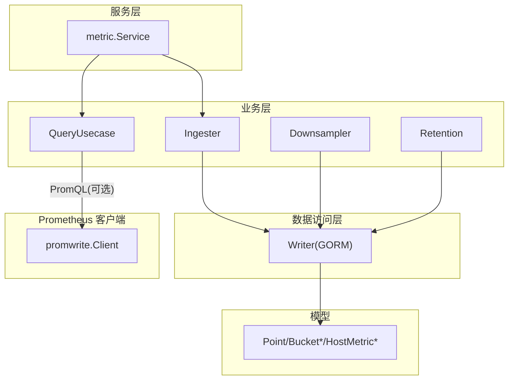
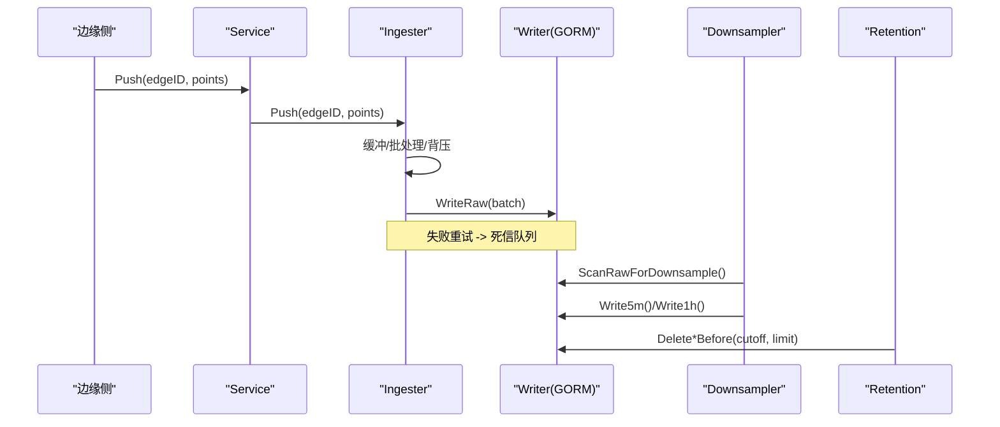
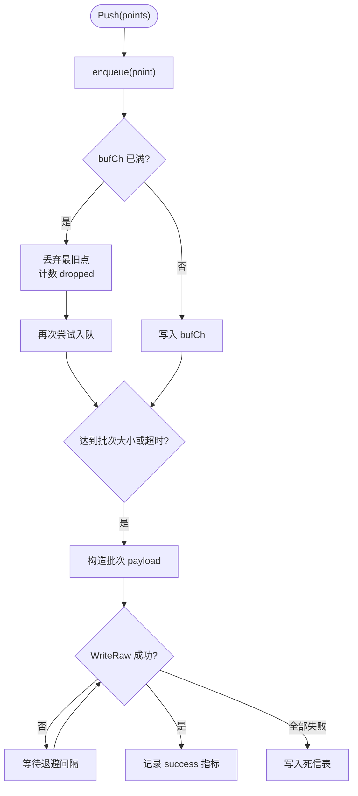
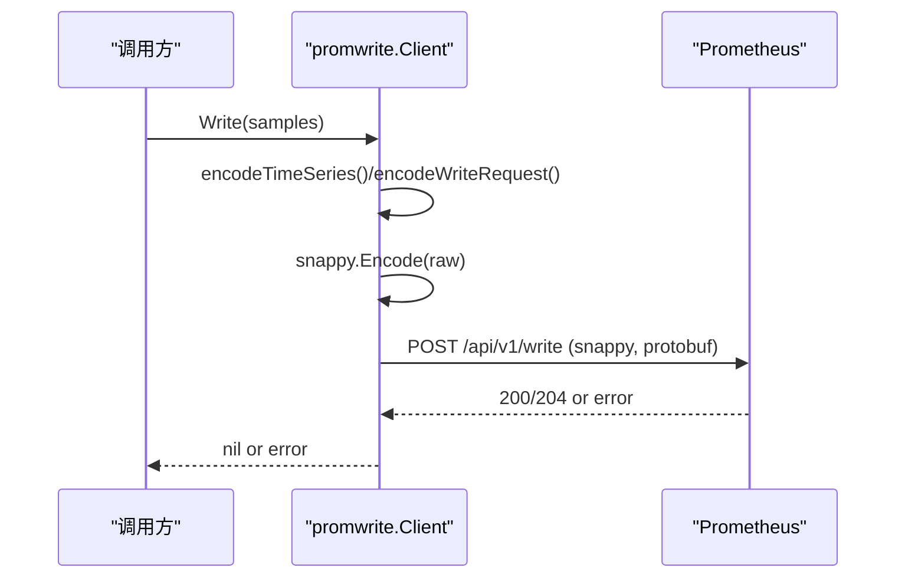
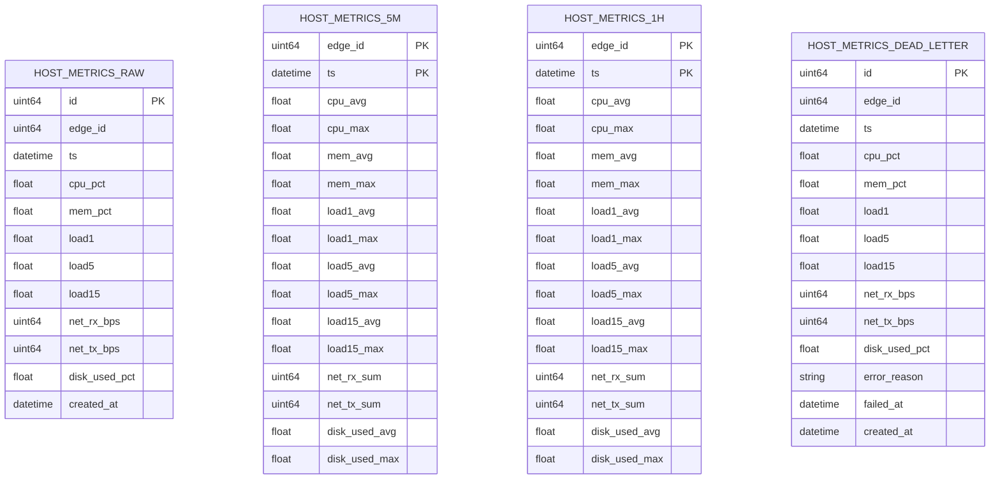
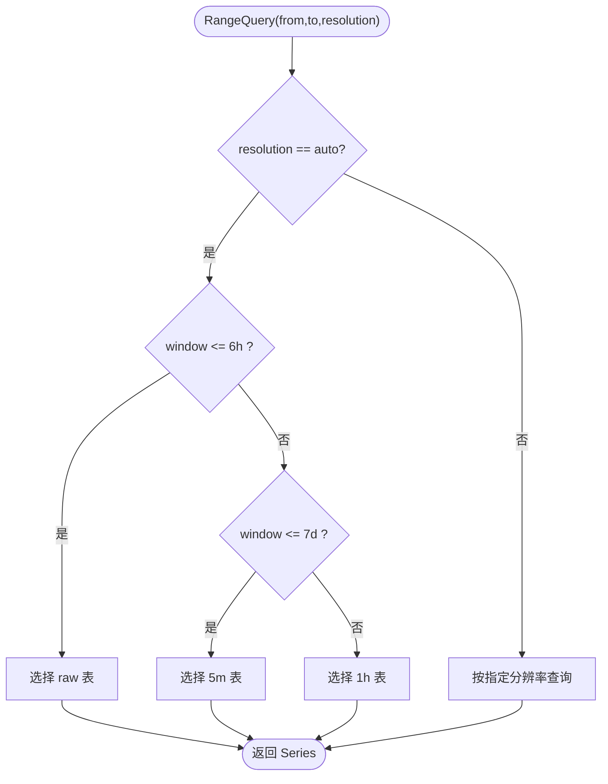
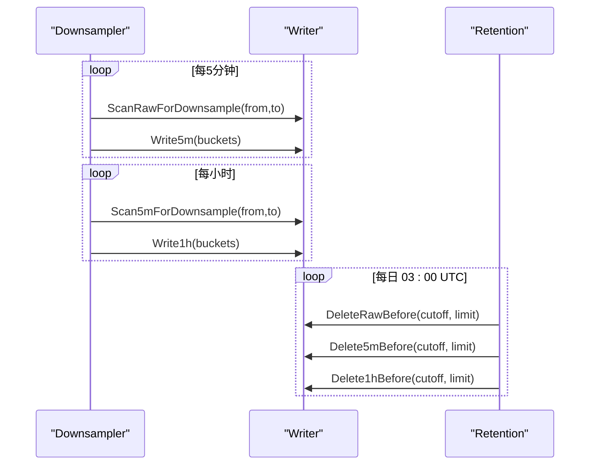
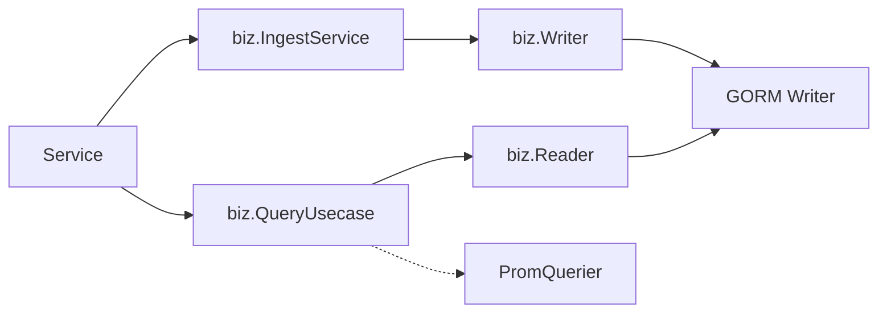

# 指标接收器

<cite>
**本文引用的文件**
- [ingester.go](file://internal/manager/biz/metric/ingester.go)
- [repo.go](file://internal/manager/biz/metric/repo.go)
- [downsample.go](file://internal/manager/biz/metric/downsample.go)
- [retention.go](file://internal/manager/biz/metric/retention.go)
- [query.go](file://internal/manager/biz/metric/query.go)
- [model.go](file://internal/manager/model/metric/model.go)
- [writer.go](file://internal/manager/data/metric/store/writer.go)
- [prom_handler.go](file://internal/manager/server/metric/prom_handler.go)
- [http.go](file://internal/manager/server/prometheus/http.go)
- [service.go](file://internal/manager/service/metric/service.go)
- [client.go](file://internal/pkg/promwrite/client.go)
- [proto.go](file://internal/pkg/promwrite/proto.go)
</cite>

## 目录
1. [简介](#简介)
2. [项目结构](#项目结构)
3. [核心组件](#核心组件)
4. [架构总览](#架构总览)
5. [详细组件分析](#详细组件分析)
6. [依赖关系分析](#依赖关系分析)
7. [性能考量](#性能考量)
8. [故障诊断指南](#故障诊断指南)
9. [结论](#结论)
10. [附录](#附录)

## 简介
本文件面向 Ongrid 云端指标接收与处理链路，系统性说明从边缘侧上报到云端持久化、聚合、查询的完整流程。重点覆盖：
- Prometheus Remote Write 客户端实现（编码、压缩、HTTP 发送）
- 指标数据验证、批处理策略与背压处理
- Ingester 缓冲、重试、死信队列机制
- 时间序列存储、索引优化与查询性能调优
- 与后端存储系统的集成（连接池、错误重试、监控指标）
- 性能调优参数与故障诊断方法

## 项目结构
Ongrid 指标子系统采用分层设计：服务层（Service）、业务层（Biz）、数据访问层（Store）、模型（Model），以及独立的 Prometheus Remote Write 客户端工具包。

图表来源
- [service.go:18-49](file://internal/manager/service/metric/service.go#L18-L49)
- [ingester.go:15-37](file://internal/manager/biz/metric/ingester.go#L15-L37)
- [downsample.go:11-34](file://internal/manager/biz/metric/downsample.go#L11-L34)
- [retention.go:9-45](file://internal/manager/biz/metric/retention.go#L9-L45)
- [writer.go:14-34](file://internal/manager/data/metric/store/writer.go#L14-L34)
- [model.go:18-96](file://internal/manager/model/metric/model.go#L18-L96)
- [client.go:42-54](file://internal/pkg/promwrite/client.go#L42-L54)

章节来源
- [service.go:1-49](file://internal/manager/service/metric/service.go#L1-L49)
- [ingester.go:1-262](file://internal/manager/biz/metric/ingester.go#L1-L262)
- [downsample.go:1-43](file://internal/manager/biz/metric/downsample.go#L1-L43)
- [retention.go:1-103](file://internal/manager/biz/metric/retention.go#L1-L103)
- [writer.go:1-183](file://internal/manager/data/metric/store/writer.go#L1-L183)
- [model.go:1-189](file://internal/manager/model/metric/model.go#L1-L189)
- [client.go:1-176](file://internal/pkg/promwrite/client.go#L1-L176)

## 核心组件
- Ingester：负责将边缘上报的指标点异步批量化写入底层存储，具备缓冲、背压、重试与死信能力。
- Downsampler：定时将原始样本聚合成 5 分钟和 1 小时粒度，降低长期存储与查询成本。
- Retention：按策略清理过期数据，避免存储膨胀。
- Writer/Reader：对存储抽象，当前以 GORM + SQLite 实现；支持批量写入、删除与范围扫描。
- QueryUsecase：统一查询入口，自动选择分辨率（raw/5m/1h）。
- promwrite.Client：实现 Prometheus Remote Write 协议（POST /api/v1/write，snappy 压缩 protobuf）。

章节来源
- [ingester.go:15-37](file://internal/manager/biz/metric/ingester.go#L15-L37)
- [downsample.go:11-34](file://internal/manager/biz/metric/downsample.go#L11-L34)
- [retention.go:9-45](file://internal/manager/biz/metric/retention.go#L9-L45)
- [repo.go:10-52](file://internal/manager/biz/metric/repo.go#L10-L52)
- [query.go:14-60](file://internal/manager/biz/metric/query.go#L14-L60)
- [client.go:17-54](file://internal/pkg/promwrite/client.go#L17-L54)

## 架构总览
整体数据流分为“写路径”和“读路径”。写路径由边缘通过隧道上报，经 Service 进入 Ingester 批处理并落库；随后由 Downsampler 生成多分辨率聚合；RetentionPolicy 定期清理过期数据。读路径支持两种模式：本地存储查询（biz.QueryUsecase）与云 Prometheus 查询（PromHandler/PromQL 透传）。

图表来源
- [service.go:37-49](file://internal/manager/service/metric/service.go#L37-L49)
- [ingester.go:120-247](file://internal/manager/biz/metric/ingester.go#L120-L247)
- [writer.go:36-88](file://internal/manager/data/metric/store/writer.go#L36-L88)
- [downsample.go:36-43](file://internal/manager/biz/metric/downsample.go#L36-L43)
- [retention.go:47-80](file://internal/manager/biz/metric/retention.go#L47-L80)

## 详细组件分析

### Ingester：缓冲、去重、压缩传输与背压
- 缓冲与批处理：使用带容量的 channel 作为缓冲，达到 batchSz 或 flushAt 定时器触发时进行 flush。
- 背压处理：当缓冲区满时丢弃最旧的数据点，并记录 dropped 指标，确保高吞吐下的稳定性。
- 重试与死信：flush 失败按固定退避重试（100ms/500ms/2s），全部失败后写入死信表，便于后续排查与重放。
- 监控指标：注册 writes、flushFails、dropped、batchSize 等指标，用于观测吞吐与异常。

图表来源
- [ingester.go:163-247](file://internal/manager/biz/metric/ingester.go#L163-L247)

章节来源
- [ingester.go:15-37](file://internal/manager/biz/metric/ingester.go#L15-L37)
- [ingester.go:45-57](file://internal/manager/biz/metric/ingester.go#L45-L57)
- [ingester.go:120-247](file://internal/manager/biz/metric/ingester.go#L120-L247)

### Prometheus Remote Write 客户端
- 协议实现：手写的 proto3 编码器，仅包含 Label/Sample/TimeSeries/WriteRequest 四个消息，避免引入庞大依赖。
- 压缩与传输：使用 snappy 压缩 protobuf 体，设置 Content-Type、Content-Encoding、X-Prometheus-Remote-Write-Version 等必要头。
- 端点解析：通过 EndpointResolver 接口动态获取远端 URL，便于配置热更新。
- 错误处理：非 2xx 响应会读取有限长度的响应体并记录告警，调用方负责重试。

图表来源
- [client.go:126-176](file://internal/pkg/promwrite/client.go#L126-L176)
- [proto.go:83-129](file://internal/pkg/promwrite/proto.go#L83-L129)

章节来源
- [client.go:17-54](file://internal/pkg/promwrite/client.go#L17-L54)
- [client.go:126-176](file://internal/pkg/promwrite/client.go#L126-L176)
- [proto.go:8-21](file://internal/pkg/promwrite/proto.go#L8-L21)
- [proto.go:83-129](file://internal/pkg/promwrite/proto.go#L83-L129)

### 数据存储与索引优化
- 物理表设计：
  - host_metrics_raw：原始样本（10s 粒度），按 edge_id、ts 建立复合索引，加速按边与时窗查询。
  - host_metrics_5m：5 分钟聚合，主键为 (edge_id, ts)。
  - host_metrics_1h：1 小时聚合，主键为 (edge_id, ts)。
  - host_metrics_dead_letter：失败样本及原因，便于审计与重放。
- 批量写入：GORM CreateInBatches 分批提交，减少事务开销。
- 删除策略：基于 rowid 子查询的 DELETE ... LIMIT，适配 SQLite 限制，控制锁持有时间。
- 幂等性：5m/1h 聚合写入使用 Save（UPSERT），重复运行安全。

图表来源
- [model.go:102-189](file://internal/manager/model/metric/model.go#L102-L189)

章节来源
- [writer.go:28-88](file://internal/manager/data/metric/store/writer.go#L28-L88)
- [writer.go:90-183](file://internal/manager/data/metric/store/writer.go#L90-L183)
- [model.go:102-189](file://internal/manager/model/metric/model.go#L102-L189)

### 查询与分辨率选择
- Resolution 自动选择：窗口 ≤ 6h 走 raw，≤ 7d 走 5m，否则走 1h，兼顾精度与性能。
- 最大窗口限制：防止超长查询拖垮数据库。
- Prom 查询回退：当启用云 Prometheus 时，HTTP 处理器并行发起多个 PromQL 范围查询，并将结果重组为前端兼容的点集。

图表来源
- [query.go:14-60](file://internal/manager/biz/metric/query.go#L14-L60)

章节来源
- [query.go:14-60](file://internal/manager/biz/metric/query.go#L14-L60)
- [prom_handler.go:76-226](file://internal/manager/server/metric/prom_handler.go#L76-L226)

### 聚合与保留策略
- Downsampler：定时将 raw 聚合成 5m，再将 5m 聚合成 1h，保证历史查询可用且高效。
- Retention：按策略删除过期数据（raw 7 天、5m 90 天、1h 365 天），每次删除限制行数，避免长时间锁表。

图表来源
- [downsample.go:36-43](file://internal/manager/biz/metric/downsample.go#L36-L43)
- [retention.go:47-103](file://internal/manager/biz/metric/retention.go#L47-L103)
- [writer.go:150-183](file://internal/manager/data/metric/store/writer.go#L150-L183)

章节来源
- [downsample.go:11-43](file://internal/manager/biz/metric/downsample.go#L11-L43)
- [retention.go:9-103](file://internal/manager/biz/metric/retention.go#L9-L103)

## 依赖关系分析
- 服务层依赖业务层接口，不直接访问数据层，保持清晰分层。
- Ingester 依赖 Writer 接口，可替换不同存储实现。
- QueryUsecase 依赖 Reader 接口，支持多种后端。
- Prometheus 查询路径通过 PromQuerier 解耦，支持禁用降级。

图表来源
- [service.go:18-49](file://internal/manager/service/metric/service.go#L18-L49)
- [repo.go:10-52](file://internal/manager/biz/metric/repo.go#L10-L52)
- [prom_handler.go:25-74](file://internal/manager/server/metric/prom_handler.go#L25-L74)

章节来源
- [service.go:1-49](file://internal/manager/service/metric/service.go#L1-L49)
- [repo.go:1-53](file://internal/manager/biz/metric/repo.go#L1-L53)
- [prom_handler.go:25-74](file://internal/manager/server/metric/prom_handler.go#L25-L74)

## 性能考量
- 批处理大小与频率：默认 batchSz=500，flushAt=5s，可根据吞吐调整。
- 缓冲容量：bufferCapMultiplier=4，即 2000 点缓冲，超过则丢弃最旧点，保障系统稳定。
- 重试退避：100ms/500ms/2s，平衡延迟与成功率。
- 存储写入：CreateInBatches 分批提交，减少事务开销；删除操作使用 LIMIT 控制锁时长。
- 查询分辨率：自动选择 raw/5m/1h，长窗口优先使用聚合表，缩短查询时间。
- Prometheus 查询：并行执行多个 PromQL 表达式，合并结果；表达式长度限制 4KB，防止滥用。
- 连接池与超时：HTTP 客户端默认 10s 超时，可通过注入 http.Client 自定义；PromQL 查询上限 30s。

[本节提供通用指导，无需特定文件引用]

## 故障诊断指南
- 指标观察：
  - ongrid_ingest_writes_total{result=success|fail}：统计成功/失败批次。
  - ongrid_ingest_flush_failures_total{reason=...}：分类失败原因（ctx_cancel/write_error）。
  - ongrid_ingest_dropped_total{reason=buffer_full}：缓冲溢出导致的丢点。
  - ongrid_ingest_batch_size：直方图观察批次大小分布。
- 常见问题定位：
  - 缓冲频繁溢出：检查上游推送速率与 Ingester 处理能力，必要时增大 batchSz 或 flushAt。
  - 写入失败：查看 writer 日志与死信表，确认数据库状态与连接情况。
  - 查询为空：确认 edge_id 与 device_id 映射是否正确；Prom 查询需启用并正确配置。
  - 聚合缺失：检查 Downsampler 是否正常运行，确认扫描范围与聚合任务调度。
- 调试建议：
  - 临时缩小 flushAt 与 batchSz 以便快速验证。
  - 关注 Retention 任务是否在低峰期执行，避免影响在线查询。
  - 对于 Prom 查询，校验 expr 长度与 step 参数合法性。

章节来源
- [ingester.go:59-117](file://internal/manager/biz/metric/ingester.go#L59-L117)
- [ingester.go:200-262](file://internal/manager/biz/metric/ingester.go#L200-L262)
- [prom_handler.go:309-394](file://internal/manager/server/metric/prom_handler.go#L309-L394)
- [retention.go:21-31](file://internal/manager/biz/metric/retention.go#L21-L31)

## 结论
Ongrid 指标接收器通过 Ingester 的高吞吐缓冲与可靠重试、多分辨率聚合与保留策略、以及灵活的查询路径（本地存储与云 Prometheus），实现了可扩展、高性能、易运维的指标采集与查询体系。合理的批处理、索引设计与监控指标为生产环境提供了稳定的基础。

[本节总结性内容，无需特定文件引用]

## 附录
- 关键配置项参考：
  - Ingester：batchSz、flushAt、bufferCapMultiplier
  - Retention：rawTTL=7d、5mTTL=90d、1hTTL=365d、retentionRunAtHour=3
  - Prometheus 客户端：defaultTimeout=10s、maxExprBytes=4KB
- 扩展建议：
  - 根据负载调整 Ingester 批处理参数与缓冲容量。
  - 在大规模部署中考虑将 Writer 替换为列式存储以提升聚合与查询性能。
  - 结合外部监控系统收集 ingester 与 writer 指标，建立告警规则。

[本节提供补充信息，无需特定文件引用]