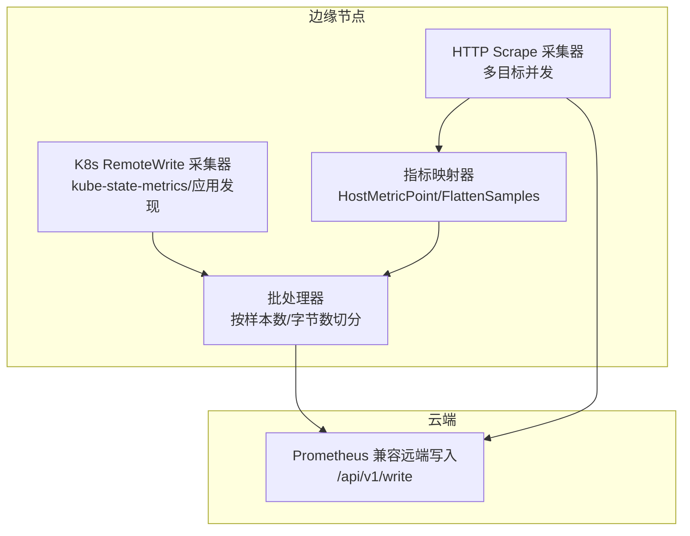
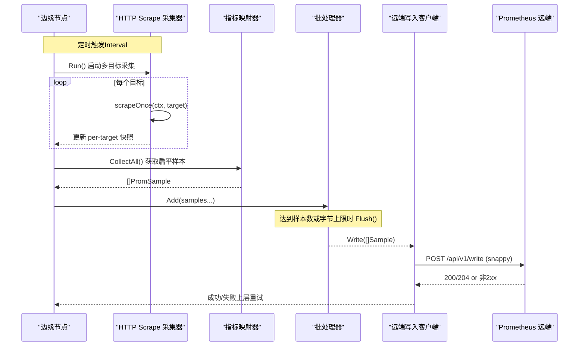
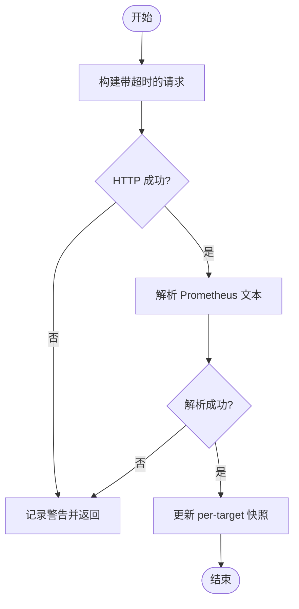
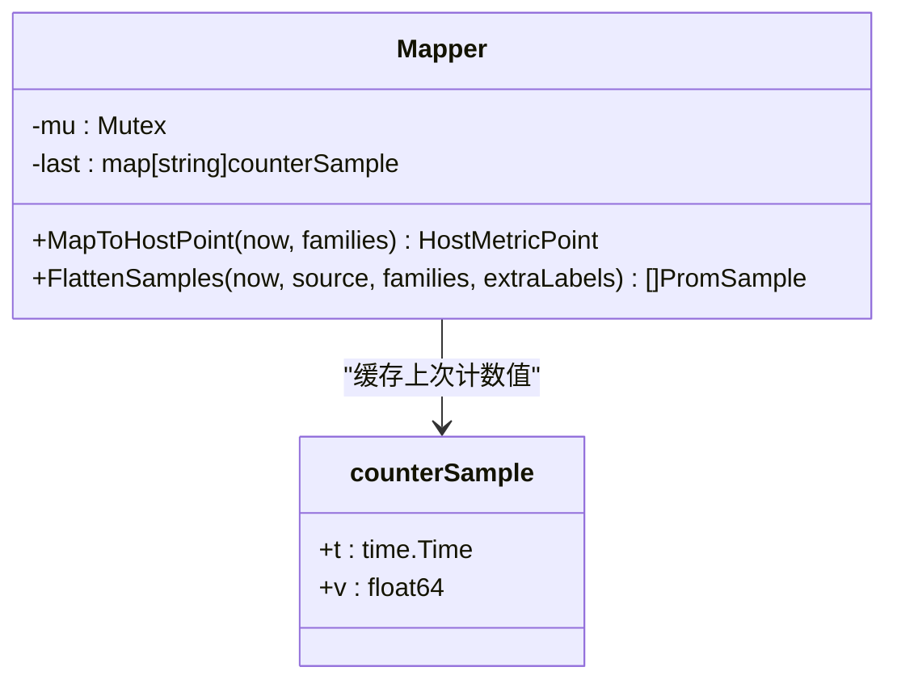
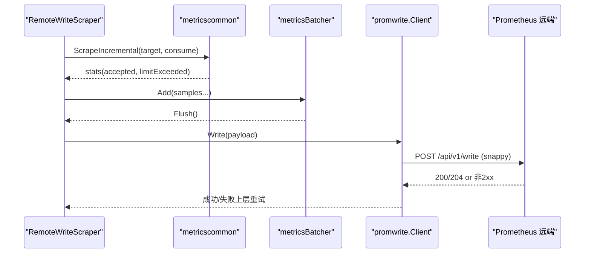
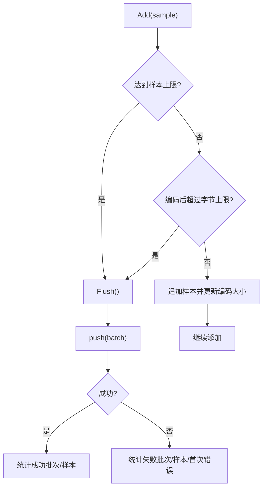
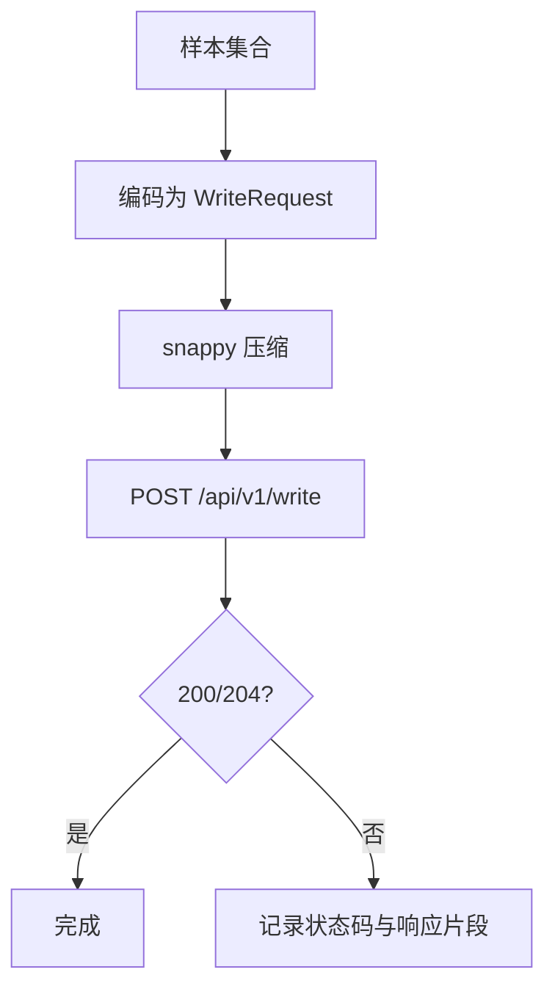
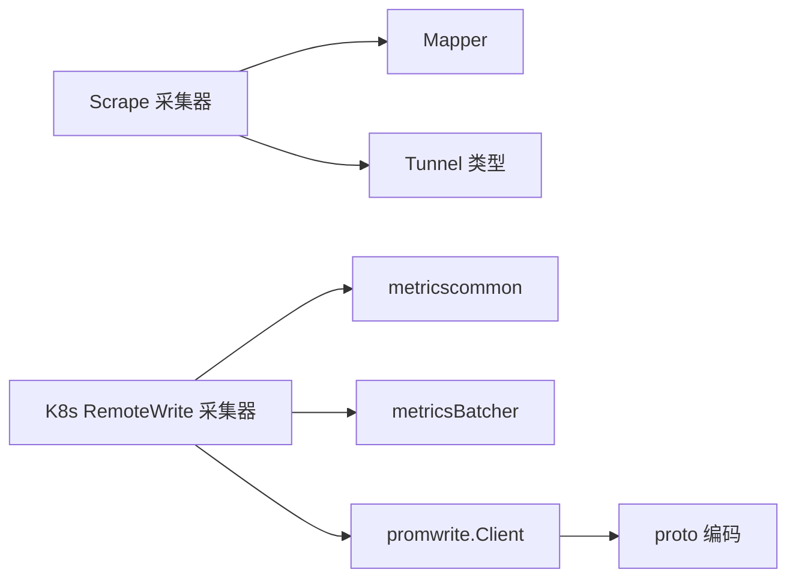

# 指标数据流

<cite>
**本文引用的文件**
- [scrape.go](file://internal/edgeagent/collector/scrape.go)
- [scrapecfg.go](file://internal/edgeagent/collector/scrapecfg.go)
- [mapper.go](file://internal/edgeagent/collector/mapper.go)
- [remote_write_scraper.go](file://internal/edgeagent/k8s/remote_write_scraper.go)
- [metrics_batch.go](file://internal/edgeagent/k8s/metrics_batch.go)
- [scrape.go](file://internal/edgeagent/plugins/metricscommon/scrape.go)
- [client.go](file://internal/pkg/promwrite/client.go)
- [proto.go](file://internal/pkg/promwrite/proto.go)
- [types.go](file://internal/pkg/tunnel/types.go)
</cite>

## 目录
1. [简介](#简介)
2. [项目结构](#项目结构)
3. [核心组件](#核心组件)
4. [架构总览](#架构总览)
5. [详细组件分析](#详细组件分析)
6. [依赖关系分析](#依赖关系分析)
7. [性能与优化](#性能与优化)
8. [故障排查指南](#故障排查指南)
9. [结论](#结论)
10. [附录：关键配置与调优](#附录：关键配置与调优)

## 简介
本文面向 Ongrid 边缘侧的指标采集与上报链路，系统阐述从 HTTP scrape 采集、Prometheus 文本格式解析、指标映射与转换、批处理与去重、压缩传输到云端存储的完整流程。重点说明 Scraper 的多目标并发采集、快照管理、超时控制与错误处理；Kubernetes 场景下的 RemoteWrite 采集器、批处理策略、背压与流量控制；以及端到端的时序图与关键参数调优建议。

## 项目结构
Ongrid 的指标数据流主要涉及三类模块：
- 边缘 HTTP scrape 采集器：负责轮询多个 /metrics 端点，解析 Prometheus 文本格式，生成内部样本并输出为统一格式。
- Kubernetes 指标采集器：通过 kube-state-metrics 或注解发现的应用端点采集指标，直接写入远端 remote_write 接口。
- 通用写客户端与协议编码：将样本序列化为 Prometheus remote_write 协议（protobuf），并使用 snappy 压缩后发送。

图表来源
- [scrape.go:29-49](file://internal/edgeagent/collector/scrape.go#L29-L49)
- [remote_write_scraper.go:45-56](file://internal/edgeagent/k8s/remote_write_scraper.go#L45-L56)
- [mapper.go:16-27](file://internal/edgeagent/collector/mapper.go#L16-L27)
- [metrics_batch.go:19-27](file://internal/edgeagent/k8s/metrics_batch.go#L19-L27)
- [client.go:42-48](file://internal/pkg/promwrite/client.go#L42-L48)

章节来源
- [scrape.go:29-49](file://internal/edgeagent/collector/scrape.go#L29-L49)
- [remote_write_scraper.go:45-56](file://internal/edgeagent/k8s/remote_write_scraper.go#L45-L56)
- [mapper.go:16-27](file://internal/edgeagent/collector/mapper.go#L16-L27)
- [metrics_batch.go:19-27](file://internal/edgeagent/k8s/metrics_batch.go#L19-L27)
- [client.go:42-48](file://internal/pkg/promwrite/client.go#L42-L48)

## 核心组件
- HTTP Scrape 采集器（Scraper）
  - 每个目标一个 goroutine 并发采集，维护 per-target 的 MetricFamily 快照，支持超时、Bearer Token、TLS 配置。
  - 提供 CollectAll 输出每目标的扁平化样本，同时可映射 HostMetricPoint（CPU/内存/负载/网络/磁盘）。
- 指标映射器（Mapper）
  - 将 node_exporter 风格的 MetricFamily 转换为 HostMetricPoint（计数器差分求速率）。
  - 将任意 MetricFamily 扁平化为 tunnel.PromSample 列表，处理 Gauge/Counter/Histogram/Summary。
- Kubernetes RemoteWrite 采集器（RemoteWriteScraper）
  - 定时抓取 kube-state-metrics 或通过注解发现的应用 Pod 指标，增量采样并批量写入远端。
  - 内置重试、退避、状态上报与就绪性标志。
- 批处理器（metricsBatcher）
  - 按样本数量与 JSON 编码大小进行批次切分，避免单次请求过大导致内存与带宽压力。
- Prometheus 远端写入客户端（promwrite.Client）
  - 将样本编码为 WriteRequest protobuf，snappy 压缩后 POST 到 /api/v1/write。
  - 支持动态 endpoint 解析、单请求超时、非 2xx 响应体截断日志。

章节来源
- [scrape.go:58-95](file://internal/edgeagent/collector/scrape.go#L58-L95)
- [mapper.go:40-62](file://internal/edgeagent/collector/mapper.go#L40-L62)
- [remote_write_scraper.go:135-189](file://internal/edgeagent/k8s/remote_write_scraper.go#L135-L189)
- [metrics_batch.go:29-61](file://internal/edgeagent/k8s/metrics_batch.go#L29-L61)
- [client.go:119-176](file://internal/pkg/promwrite/client.go#L119-L176)

## 架构总览
下图展示从边缘采集到云端存储的端到端时序：

图表来源
- [scrape.go:79-113](file://internal/edgeagent/collector/scrape.go#L79-L113)
- [scrape.go:115-183](file://internal/edgeagent/collector/scrape.go#L115-L183)
- [mapper.go:64-137](file://internal/edgeagent/collector/mapper.go#L64-L137)
- [metrics_batch.go:63-108](file://internal/edgeagent/k8s/metrics_batch.go#L63-L108)
- [client.go:126-176](file://internal/pkg/promwrite/client.go#L126-L176)

## 详细组件分析

### HTTP Scrape 采集器（Scraper）
- 多目标并发采集
  - 使用 errgroup 为每个目标启动独立 goroutine，互不阻塞。
  - 每个目标维护独立的 http.Client，复用连接池，降低握手开销。
- 快照管理
  - 以 target.Name 为键保存最近一次成功的 MetricFamily 快照，包含时间戳、source、role。
  - 读取时使用读锁保护并发安全。
- 超时控制
  - 每次 scrape 使用带超时的 context，避免长尾请求影响整体调度。
- 错误处理
  - 构建请求失败、HTTP 非 2xx、解析失败均记录 warn 日志，不影响其他目标。
- 主机负载提取
  - 对 role=host 的目标，通过 Mapper 计算 CPU%、内存使用率、负载、网络吞吐、磁盘使用率。

图表来源
- [scrape.go:115-183](file://internal/edgeagent/collector/scrape.go#L115-L183)

章节来源
- [scrape.go:79-113](file://internal/edgeagent/collector/scrape.go#L79-L113)
- [scrape.go:115-183](file://internal/edgeagent/collector/scrape.go#L115-L183)
- [scrape.go:185-226](file://internal/edgeagent/collector/scrape.go#L185-L226)
- [scrape.go:261-303](file://internal/edgeagent/collector/scrape.go#L261-L303)

### 指标映射与转换（Mapper）
- HostMetricPoint 映射
  - CPU%：基于 node_cpu_seconds_total 计数器差分，排除 idle 模式。
  - 内存使用率：优先 MemAvailable，否则回退到 MemFree+Buffers+Cached。
  - 负载：直接取 node_load1/5/15。
  - 网络吞吐：对接收/发送字节计数器差分求速率，排除 lo。
  - 磁盘使用率：匹配根挂载点的 size/avail 计算。
- 扁平化样本
  - 将 Gauge/Counter/Untyped 直接转为样本；Histogram/Summary 展开为 bucket/quantile + _sum/_count。
  - 合并静态标签，过滤 NaN/Inf 值以保证 JSON 可序列化。

图表来源
- [mapper.go:16-27](file://internal/edgeagent/collector/mapper.go#L16-L27)
- [mapper.go:40-62](file://internal/edgeagent/collector/mapper.go#L40-L62)
- [mapper.go:64-137](file://internal/edgeagent/collector/mapper.go#L64-L137)

章节来源
- [mapper.go:40-62](file://internal/edgeagent/collector/mapper.go#L40-L62)
- [mapper.go:64-137](file://internal/edgeagent/collector/mapper.go#L64-L137)
- [mapper.go:227-307](file://internal/edgeagent/collector/mapper.go#L227-L307)

### Kubernetes RemoteWrite 采集器
- 目标发现
  - 固定 kube-state-metrics 端点，或通过 Kubernetes API 扫描带注解的 Pod 发现应用指标端点。
- 增量采集与限流
  - 使用 metricscommon.ScrapeIncremental 逐行解析，限制样本数量，避免大响应占用内存。
  - 支持 label drop 过滤高基数标签。
- 批处理与写入
  - 将样本加入 metricsBatcher，按样本数与字节上限分批推送。
  - 写入失败指数退避重试，最多 N 次，最大延迟受限。
- 状态与就绪性
  - 上报 up/partial/accepted 等状态指标，标记 cycle 成功与否，设置 ready 标志。

图表来源
- [remote_write_scraper.go:152-277](file://internal/edgeagent/k8s/remote_write_scraper.go#L152-L277)
- [metricscommon/scrape.go:74-115](file://internal/edgeagent/plugins/metricscommon/scrape.go#L74-L115)
- [metrics_batch.go:63-108](file://internal/edgeagent/k8s/metrics_batch.go#L63-L108)
- [client.go:126-176](file://internal/pkg/promwrite/client.go#L126-L176)

章节来源
- [remote_write_scraper.go:135-189](file://internal/edgeagent/k8s/remote_write_scraper.go#L135-L189)
- [remote_write_scraper.go:228-306](file://internal/edgeagent/k8s/remote_write_scraper.go#L228-L306)
- [remote_write_scraper.go:308-382](file://internal/edgeagent/k8s/remote_write_scraper.go#L308-L382)

### 批处理策略与背压
- 批次边界
  - 当累积样本数达到 BatchSampleLimit 或 JSON 编码大小超过 BatchByteLimit 时立即 Flush。
  - 空请求元数据大小作为 baseBytes，确保单个样本不会超过上限。
- 拒绝与统计
  - 无法编码或超出限制的样本被拒绝并计入 RejectedSamples。
  - 记录成功/失败批次与样本数，首次错误保留用于告警。
- 背压体现
  - 通过限制单次请求体积，避免后端拥塞与内存峰值。
  - 结合上游 scrape 的 SampleLimit，形成端到端容量控制。

图表来源
- [metrics_batch.go:29-61](file://internal/edgeagent/k8s/metrics_batch.go#L29-L61)
- [metrics_batch.go:63-108](file://internal/edgeagent/k8s/metrics_batch.go#L63-L108)

章节来源
- [metrics_batch.go:29-61](file://internal/edgeagent/k8s/metrics_batch.go#L29-L61)
- [metrics_batch.go:63-108](file://internal/edgeagent/k8s/metrics_batch.go#L63-L108)

### 压缩传输与远端写入
- 协议编码
  - 手写 proto3 编码器，构造 Label/Sample/TimeSeries/WriteRequest。
  - 每个 Sample 对应一个 TimeSeries，简化服务端分组逻辑。
- 压缩与请求头
  - 使用 snappy 压缩 WriteRequest 载荷，设置 Content-Encoding: snappy。
  - 设置 X-Prometheus-Remote-Write-Version 与 User-Agent。
- 超时与错误
  - 默认单次请求超时 10s，可注入自定义 http.Client。
  - 非 2xx 响应截取前 1KB 响应体便于定位问题。

图表来源
- [proto.go:83-129](file://internal/pkg/promwrite/proto.go#L83-L129)
- [client.go:126-176](file://internal/pkg/promwrite/client.go#L126-L176)

章节来源
- [proto.go:83-129](file://internal/pkg/promwrite/proto.go#L83-L129)
- [client.go:126-176](file://internal/pkg/promwrite/client.go#L126-L176)

## 依赖关系分析
- 组件耦合
  - Scraper 依赖 Mapper 进行指标转换，依赖隧道类型定义进行输出。
  - RemoteWriteScraper 依赖 metricscommon 进行增量 scrape，依赖 metricsBatcher 进行批处理，最终调用 promwrite.Client。
  - promwrite.Client 依赖 proto 编码与 HTTP 客户端。
- 外部依赖
  - Prometheus 文本格式解析库 expfmt。
  - gopsutil 用于本地主机信息（在 Scraper.HostInfo 中使用）。
  - snappy 压缩库。
- 潜在循环依赖
  - 当前实现无循环依赖；各层职责清晰，单向调用。

图表来源
- [scrape.go:29-49](file://internal/edgeagent/collector/scrape.go#L29-L49)
- [remote_write_scraper.go:45-56](file://internal/edgeagent/k8s/remote_write_scraper.go#L45-L56)
- [client.go:42-48](file://internal/pkg/promwrite/client.go#L42-L48)

章节来源
- [scrape.go:29-49](file://internal/edgeagent/collector/scrape.go#L29-L49)
- [remote_write_scraper.go:45-56](file://internal/edgeagent/k8s/remote_write_scraper.go#L45-L56)
- [client.go:42-48](file://internal/pkg/promwrite/client.go#L42-L48)

## 性能与优化
- 并发与连接复用
  - 每个目标独立 http.Client，开启连接池与空闲连接超时，减少握手与资源竞争。
- 超时与限流
  - scrape 与 push 均设置超时，防止慢请求拖垮调度。
  - 通过 SampleLimit 与 BatchSampleLimit/BatchByteLimit 控制内存与带宽。
- 增量解析与丢弃
  - 逐行解析 Prometheus 文本，遇到超限立即停止，避免大响应。
  - 非 2xx 响应体有限读取，防止内存泄漏。
- 去重与稳定输出
  - 指标族按名称排序，保证测试与输出的稳定性。
  - 扁平化时过滤 NaN/Inf，避免 JSON 序列化失败。
- 压缩与头部优化
  - 使用 snappy 压缩，显著降低网络传输体积。
  - 仅发送必要字段，减少 payload 大小。

[本节为通用性能讨论，无需具体文件引用]

## 故障排查指南
- scrape 阶段
  - 检查目标 URL、Bearer Token 文件路径、TLS 配置是否正确。
  - 关注非 2xx 状态码与解析错误日志。
- 映射阶段
  - 确认 node_exporter 指标命名规范，缺失指标将返回零值。
  - 初次调用速率类指标返回 0 属正常（需等待上一快照）。
- 批处理阶段
  - 若频繁出现 RejectedSamples，检查 BatchByteLimit 是否过小。
  - 观察 SuccessfulBatches/FailedBatches 比例，定位写入瓶颈。
- 远端写入阶段
  - 检查 /api/v1/write 可达性与认证。
  - 非 2xx 响应会记录状态码与响应片段，便于快速定位。
- 隧道与身份
  - 确认隧道 ClientConfig 中 ServerAddr、AccessKey/SecretKey、TLSCA 配置正确。

章节来源
- [scrape.go:115-183](file://internal/edgeagent/collector/scrape.go#L115-L183)
- [mapper.go:40-62](file://internal/edgeagent/collector/mapper.go#L40-L62)
- [metrics_batch.go:63-108](file://internal/edgeagent/k8s/metrics_batch.go#L63-L108)
- [client.go:126-176](file://internal/pkg/promwrite/client.go#L126-L176)
- [types.go:33-50](file://internal/pkg/tunnel/types.go#L33-L50)

## 结论
Ongrid 的指标数据流通过分层设计实现了高内聚、低耦合的采集与上报能力：Scraper 负责多目标并发与快照管理，Mapper 提供稳定的指标转换，RemoteWriteScraper 与 metricsBatcher 实现可控的批处理与背压，promwrite.Client 完成高效压缩传输。该链路具备完善的超时、重试、错误处理与状态上报机制，适合大规模边缘节点的指标采集与云端存储需求。

[本节为总结性内容，无需具体文件引用]

## 附录：关键配置与调优
- 边缘 scrape 配置（ScrapeConfig）
  - targets[].interval：采集间隔，默认 30s。
  - targets[].timeout：单次 scrape 超时，默认 10s。
  - targets[].bearer_token_file：Bearer Token 文件路径。
  - targets[].tls_insecure：是否跳过证书校验（谨慎使用）。
  - targets[].static_labels：静态标签，与生产者标签合并。
  - targets[].role：host/component，host 角色参与主机负载计算。
- Kubernetes 采集器配置（RemoteWriteScraperConfig）
  - interval/timeout：采集周期与超时，timeout 不超过 interval。
  - push_timeout：写入超时。
  - sample_limit/batch_sample_limit/batch_byte_limit：样本与批次大小限制。
  - max_retries/retry_backoff：写入重试次数与退避间隔。
- 远端写入客户端（promwrite.Client）
  - 默认请求超时 10s，可通过注入 http.Client 调整。
  - 支持动态 endpoint 解析，便于热更新。
- 调优建议
  - 根据目标规模调整 interval 与 timeout，避免过载。
  - 合理设置 batch 限制，平衡吞吐与内存占用。
  - 启用 label drop 过滤高基数标签，降低存储压力。
  - 监控 up/partial/accepted 状态指标，及时发现异常。

章节来源
- [scrapecfg.go:12-49](file://internal/edgeagent/collector/scrapecfg.go#L12-L49)
- [scrapecfg.go:51-90](file://internal/edgeagent/collector/scrapecfg.go#L51-L90)
- [remote_write_scraper.go:31-43](file://internal/edgeagent/k8s/remote_write_scraper.go#L31-L43)
- [remote_write_scraper.go:58-123](file://internal/edgeagent/k8s/remote_write_scraper.go#L58-L123)
- [client.go:42-54](file://internal/pkg/promwrite/client.go#L42-L54)