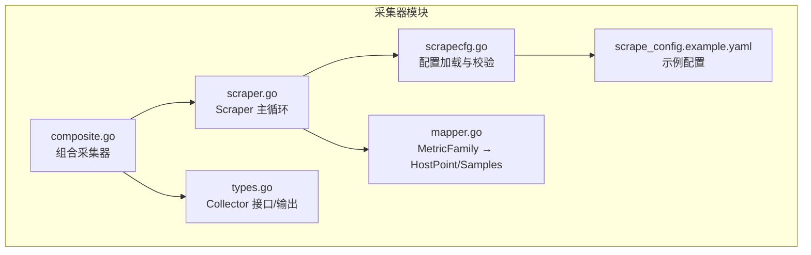
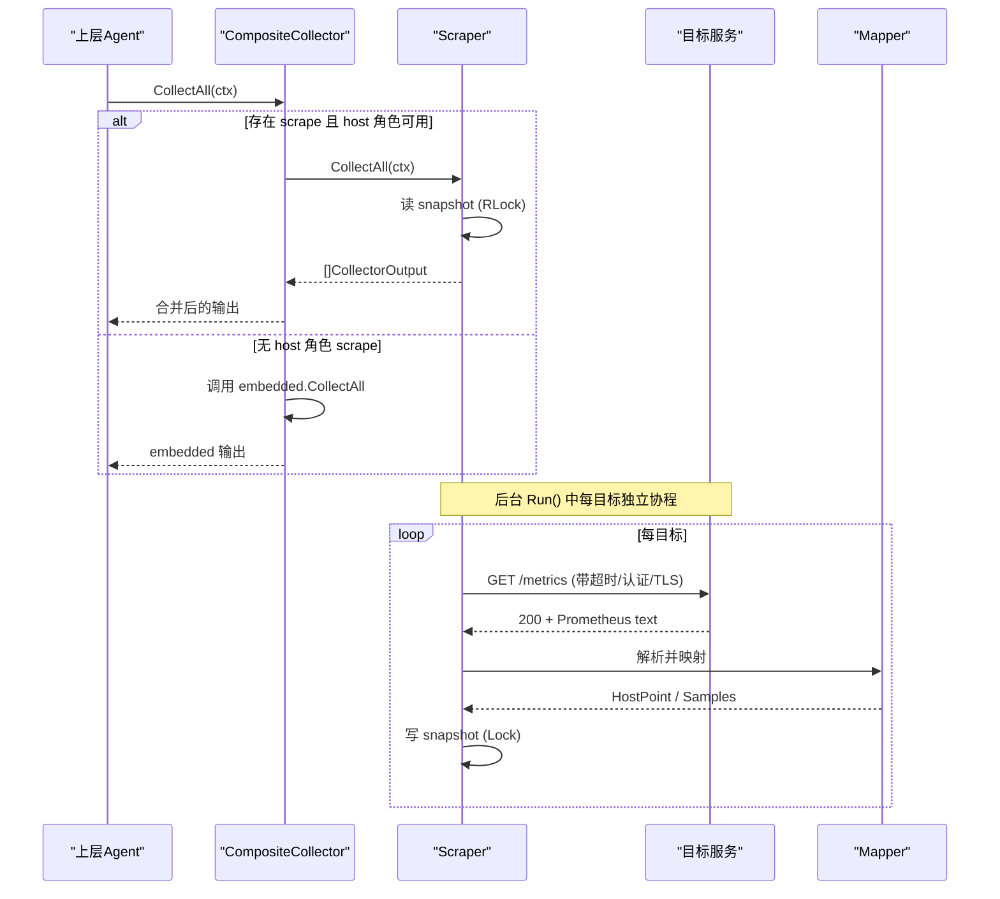
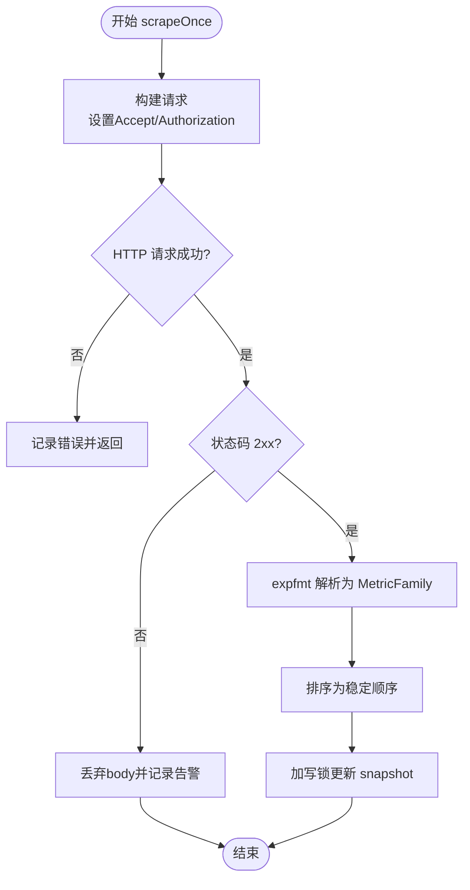
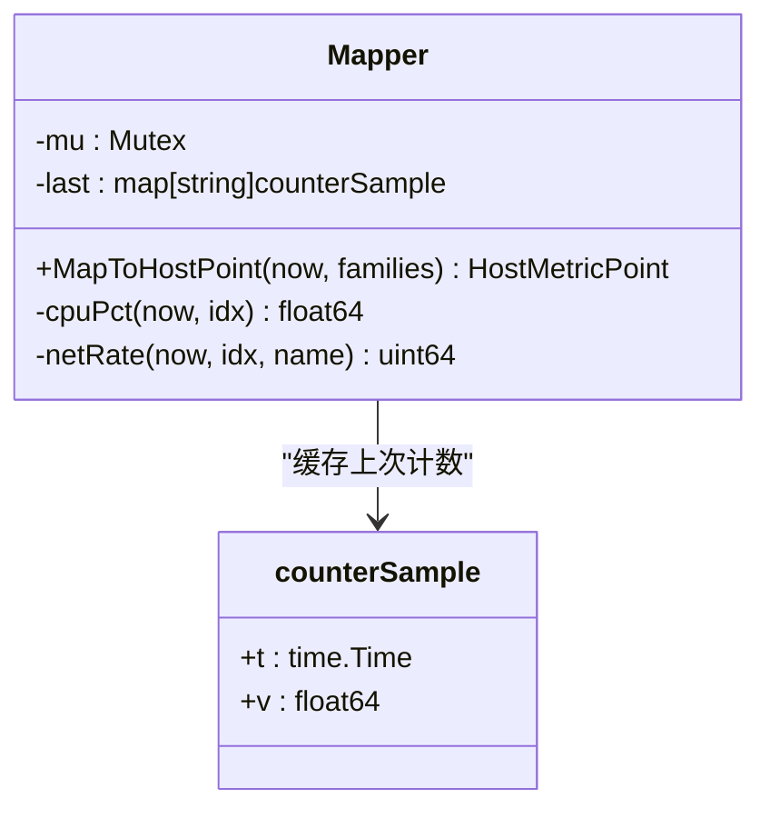
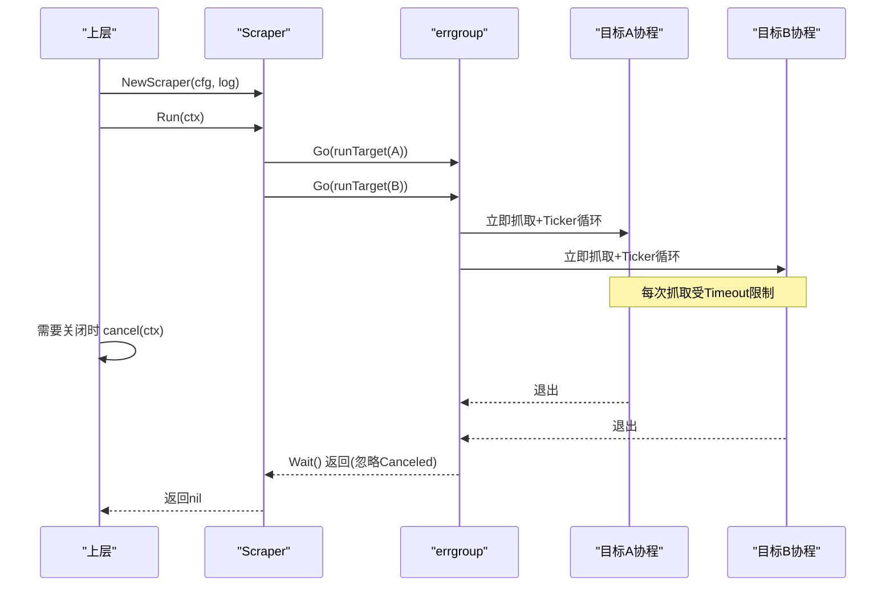
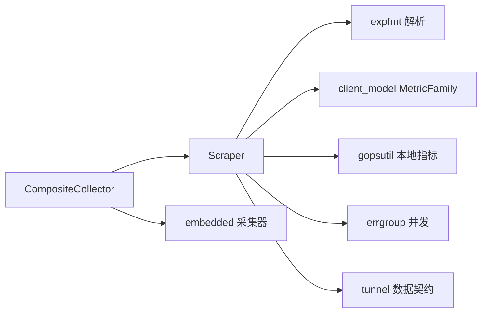

# 指标采集器

<cite>
**本文引用的文件**   
- [scrape.go](file://internal/edgeagent/collector/scrape.go)
- [scrapecfg.go](file://internal/edgeagent/collector/scrapecfg.go)
- [types.go](file://internal/edgeagent/collector/types.go)
- [mapper.go](file://internal/edgeagent/collector/mapper.go)
- [composite.go](file://internal/edgeagent/collector/composite.go)
- [scrape_config.example.yaml](file://internal/edgeagent/collector/scrape_config.example.yaml)
</cite>

## 目录
1. [简介](#简介)
2. [项目结构](#项目结构)
3. [核心组件](#核心组件)
4. [架构总览](#架构总览)
5. [详细组件分析](#详细组件分析)
6. [依赖关系分析](#依赖关系分析)
7. [性能考量](#性能考量)
8. [故障排查指南](#故障排查指南)
9. [结论](#结论)
10. [附录：配置示例与最佳实践](#附录配置示例与最佳实践)

## 简介
本文件面向 Ongrid 边缘侧的“指标采集器”，聚焦于 Scraper 组件的工作原理与实现细节。内容涵盖多目标并发采集、HTTP scrape 机制、Prometheus 格式解析、快照管理、ScrapeTarget 配置项（URL、Interval、Timeout、BearerTokenFile、TLSInsecure 等）、生命周期管理（初始化→运行→优雅关闭）、并发安全机制（读写锁与 goroutine 管理），并提供配置示例与故障排查指引。

## 项目结构
采集器位于 internal/edgeagent/collector 包，核心文件职责如下：
- scrape.go：Scraper 主逻辑，负责按目标并发拉取、解析、存储快照，并对外提供 CollectAll、HostInfo、GetHostLoad、GetProcessList 等能力。
- scrapecfg.go：ScrapeConfig 与 ScrapeTarget 的定义及配置文件加载与默认值填充。
- types.go：Collector 接口、CollectorOutput、Source 常量定义。
- mapper.go：将 Prometheus MetricFamily 映射为 HostMetricPoint（快速路径）和扁平 PromSample（丰富路径）。
- composite.go：组合采集器，优先使用 scrape 的 host 角色快照，否则回退到 embedded 基线。
- scrape_config.example.yaml：采集目标示例配置。

图表来源
- [scrape.go:39-95](file://internal/edgeagent/collector/scrape.go#L39-L95)
- [scrapecfg.go:12-90](file://internal/edgeagent/collector/scrapecfg.go#L12-L90)
- [mapper.go:16-62](file://internal/edgeagent/collector/mapper.go#L16-L62)
- [composite.go:10-55](file://internal/edgeagent/collector/composite.go#L10-L55)
- [types.go:9-57](file://internal/edgeagent/collector/types.go#L9-L57)
- [scrape_config.example.yaml:9-30](file://internal/edgeagent/collector/scrape_config.example.yaml#L9-L30)

章节来源
- [scrape.go:39-95](file://internal/edgeagent/collector/scrape.go#L39-L95)
- [scrapecfg.go:12-90](file://internal/edgeagent/collector/scrapecfg.go#L12-L90)
- [mapper.go:16-62](file://internal/edgeagent/collector/mapper.go#L16-L62)
- [composite.go:10-55](file://internal/edgeagent/collector/composite.go#L10-L55)
- [types.go:9-57](file://internal/edgeagent/collector/types.go#L9-L57)
- [scrape_config.example.yaml:9-30](file://internal/edgeagent/collector/scrape_config.example.yaml#L9-L30)

## 核心组件
- Scraper：维护每个目标的 HTTP 客户端、Mapper 与内存快照；Run 启动每目标一个 goroutine 周期性抓取；CollectAll 返回每个目标最近一次成功抓取的快照数据。
- Mapper：线程安全地缓存计数器增量，计算 CPU%、网络速率、磁盘使用率等，并将 MetricFamily 展平为 PromSample。
- CompositeCollector：组合 scraped 与 embedded 两种来源，host 角色 scrape 优先，否则回退到 embedded。
- ScrapeConfig/ScrapeTarget：描述要采集的目标及其行为参数（URL、Interval、Timeout、认证、TLS、静态标签等）。

章节来源
- [scrape.go:39-95](file://internal/edgeagent/collector/scrape.go#L39-L95)
- [mapper.go:16-62](file://internal/edgeagent/collector/mapper.go#L16-L62)
- [composite.go:10-55](file://internal/edgeagent/collector/composite.go#L10-L55)
- [scrapecfg.go:12-90](file://internal/edgeagent/collector/scrapecfg.go#L12-L90)

## 架构总览
Scraper 以“每目标一协程”的方式并发工作，每个协程独立执行 scrape→parse→store 循环；结果写入带读写锁保护的 snapshot map；外部通过 CollectAll 读取最新快照并转换为统一输出。CompositeCollector 在 host 角色可用时优先使用 scrape 的快速路径，否则回退到 embedded。

图表来源
- [scrape.go:79-113](file://internal/edgeagent/collector/scrape.go#L79-L113)
- [scrape.go:115-183](file://internal/edgeagent/collector/scrape.go#L115-L183)
- [scrape.go:185-226](file://internal/edgeagent/collector/scrape.go#L185-L226)
- [mapper.go:40-62](file://internal/edgeagent/collector/mapper.go#L40-L62)
- [composite.go:27-55](file://internal/edgeagent/collector/composite.go#L27-L55)

## 详细组件分析

### Scraper：多目标并发采集与快照管理
- 并发模型：Run 使用 errgroup 为每个目标启动一个 goroutine，各自独立调度；单个目标失败不影响其他目标。
- 定时与超时：runTarget 先立即触发一次抓取，再按 Interval 定时器周期执行；每次抓取使用 Timeout 作为请求级超时上下文。
- HTTP 抓取：设置 Accept 为 Prometheus text/plain；可选从 BearerTokenFile 读取 token 注入 Authorization；支持 TLSInsecure 跳过证书校验；非 2xx 响应丢弃 body 并记录告警。
- 解析与存储：使用 expfmt.TextParser 将响应体解析为 MetricFamily 列表；排序后存入 targetSnapshot；写入时使用 RWMutex 保护。
- 对外接口：
  - CollectAll：读取 snapshot 并转换为 CollectorOutput，包含 Source、Samples 以及当 role=host 时的 HostPoint。
  - GetHostLoad：遍历快照，选择 role=host 且含有效负载的快照，通过 Mapper 计算并返回主机负载。
  - HostInfo/GetProcessList：基于 gopsutil 获取本机信息或进程列表（不依赖上游目标）。

图表来源
- [scrape.go:115-183](file://internal/edgeagent/collector/scrape.go#L115-L183)

章节来源
- [scrape.go:79-113](file://internal/edgeagent/collector/scrape.go#L79-L113)
- [scrape.go:115-183](file://internal/edgeagent/collector/scrape.go#L115-L183)
- [scrape.go:185-226](file://internal/edgeagent/collector/scrape.go#L185-L226)
- [scrape.go:261-303](file://internal/edgeagent/collector/scrape.go#L261-L303)

### Mapper：Prometheus 格式解析与快速路径映射
- 快速路径 HostPoint：从 node_exporter 风格指标中提取 CPU%、内存使用率、负载、网络收发速率、磁盘使用率；对计数器采用增量差值法，首次调用返回零值。
- 丰富路径 Samples：将 Gauge/Counter/Untyped/Summary/Histogram 展平为 tunnel.PromSample，处理直方图桶与摘要分位数，过滤 NaN/Inf。
- 并发安全：内部使用互斥锁串行化增量计算，保证 last 缓存一致性。

图表来源
- [mapper.go:16-62](file://internal/edgeagent/collector/mapper.go#L16-L62)
- [mapper.go:227-307](file://internal/edgeagent/collector/mapper.go#L227-L307)

章节来源
- [mapper.go:16-62](file://internal/edgeagent/collector/mapper.go#L16-L62)
- [mapper.go:64-146](file://internal/edgeagent/collector/mapper.go#L64-L146)
- [mapper.go:227-307](file://internal/edgeagent/collector/mapper.go#L227-L307)

### CompositeCollector：组合采集策略
- 优先使用 scrape 的 host 角色快照（HostPointValid=true），否则回退到 embedded 基线。
- 对 HostInfo/GetHostLoad/GetProcessList 进行路由，确保 scrape 可用时优先使用其能力。

章节来源
- [composite.go:10-55](file://internal/edgeagent/collector/composite.go#L10-L55)
- [composite.go:57-91](file://internal/edgeagent/collector/composite.go#L57-L91)

### ScrapeTarget 配置选项说明
- name：目标标识，用于 Source 前缀“scrape:<name>”。
- url：绝对 /metrics URL（http/https）。
- role：host/component。host 表示该目标可作为主机快路径来源；component 仅贡献丰富路径样本。
- interval：采集间隔，默认 30s。
- timeout：单次抓取超时，默认 10s。
- bearer_token_file：Bearer Token 文件路径，读取后注入 Authorization。
- tls_insecure：是否跳过 HTTPS 证书校验（谨慎使用）。
- static_labels：附加到该目标所有样本的静态标签，冲突时以上游指标标签为准。

章节来源
- [scrapecfg.go:22-49](file://internal/edgeagent/collector/scrapecfg.go#L22-L49)
- [scrapecfg.go:51-90](file://internal/edgeagent/collector/scrapecfg.go#L51-L90)
- [scrape_config.example.yaml:9-30](file://internal/edgeagent/collector/scrape_config.example.yaml#L9-L30)

### 生命周期管理：初始化→运行→优雅关闭
- 初始化：NewScraper 根据配置为每个目标创建 HTTP 客户端与 Mapper，并准备 snapshot 与 mappers 映射。
- 运行：Run 使用 errgroup 为每个目标启动协程；runTarget 先立即抓取一次，再按 Interval 定时抓取；每次抓取受 Timeout 限制。
- 优雅关闭：传入 context 被取消时，协程退出；errgroup.Wait 忽略 context.Canceled 以外的错误；整体流程可被上层通过 cancel 控制停止。

图表来源
- [scrape.go:58-95](file://internal/edgeagent/collector/scrape.go#L58-L95)
- [scrape.go:97-113](file://internal/edgeagent/collector/scrape.go#L97-L113)

章节来源
- [scrape.go:58-95](file://internal/edgeagent/collector/scrape.go#L58-L95)
- [scrape.go:97-113](file://internal/edgeagent/collector/scrape.go#L97-L113)

### 并发安全机制
- 读写锁：snapshot 写入使用 Lock，读取使用 RLock；避免并发读写竞争。
- 协程隔离：每个目标独立协程，错误不会中断其他目标；errgroup 聚合等待。
- Mapper 内部锁：计算 CPU%/网络速率时，使用互斥锁保护 last 缓存，确保增量计算正确性。

章节来源
- [scrape.go:46-49](file://internal/edgeagent/collector/scrape.go#L46-L49)
- [scrape.go:175-182](file://internal/edgeagent/collector/scrape.go#L175-L182)
- [scrape.go:185-226](file://internal/edgeagent/collector/scrape.go#L185-L226)
- [mapper.go:22-38](file://internal/edgeagent/collector/mapper.go#L22-L38)
- [mapper.go:40-62](file://internal/edgeagent/collector/mapper.go#L40-L62)

## 依赖关系分析
- 外部库：
  - prometheus/common/expfmt：解析 Prometheus text/plain 格式。
  - prometheus/client_model/go：MetricFamily 数据结构。
  - shirou/gopsutil/v3：本地主机信息与进程列表。
  - golang.org/x/sync/errgroup：并发任务管理与等待。
- 内部依赖：
  - tunnel.HostInfo/HostMetricPoint/PromSample：与上层隧道协议的数据契约。
  - CompositeCollector：组合 scrape 与 embedded 两种采集源。

图表来源
- [scrape.go:3-27](file://internal/edgeagent/collector/scrape.go#L3-L27)
- [composite.go:10-25](file://internal/edgeagent/collector/composite.go#L10-L25)

章节来源
- [scrape.go:3-27](file://internal/edgeagent/collector/scrape.go#L3-L27)
- [composite.go:10-25](file://internal/edgeagent/collector/composite.go#L10-L25)

## 性能考量
- 连接复用：每个目标一个 http.Client，启用连接池与空闲连接超时，减少握手开销。
- 最小化解析成本：MetricFamily 排序以保证测试稳定性；FlattenSamples 直接生成扁平样本，避免重复转换。
- 增量计算：Mapper 缓存上次计数器值，按时间差计算速率，降低复杂计算频率。
- 并发隔离：errgroup 并行抓取，单目标失败不影响整体；CollectAll 只读取最新快照，避免阻塞。

[本节为通用性能讨论，不直接分析具体文件]

## 故障排查指南
常见日志与问题定位：
- 构建请求失败：检查 URL 与上下文是否正确传递。
- Bearer Token 读取失败：确认文件路径与权限，日志会记录目标名与错误。
- HTTP 错误：检查网络连通性与目标服务状态。
- 非 2xx 响应：丢弃 body 并记录状态码，确认上游服务健康。
- 解析失败：确认响应为 Prometheus text/plain 格式。
- 首次采样为零：CPU%/网络速率等基于计数器增量，首次调用返回零属正常。

建议排查步骤：
- 查看 scrape 相关 warn 日志，定位目标名称与错误类型。
- 验证配置中的 URL、Interval、Timeout、BearerTokenFile、TLSInsecure 是否符合预期。
- 若 host 角色未生效，检查 role 是否为 host，并确保上游暴露了 node_* 指标。
- 对于 HTTPS 自签名证书场景，谨慎开启 tls_insecure。

章节来源
- [scrape.go:115-183](file://internal/edgeagent/collector/scrape.go#L115-L183)
- [scrape.go:185-226](file://internal/edgeagent/collector/scrape.go#L185-L226)
- [scrapecfg.go:51-90](file://internal/edgeagent/collector/scrapecfg.go#L51-L90)

## 结论
Ongrid 指标采集器的 Scraper 实现了高内聚、低耦合的多目标并发采集方案：通过 per-target 协程、errgroup 管理、RWMutex 快照保护与 Mapper 增量计算，既保证了吞吐与稳定性，又提供了 host 快速路径与丰富样本双通道输出。配合 CompositeCollector 的回退策略，可在不同部署模式下保持可用性。合理配置 ScrapeTarget 参数与遵循最佳实践，可有效提升采集质量与可观测性。

[本节为总结性内容，不直接分析具体文件]

## 附录：配置示例与最佳实践
- 示例配置见 scrape_config.example.yaml，包含 node-exporter、kubelet-cadvisor、mysql-exporter 三种典型目标。
- 最佳实践：
  - 为每个目标设置合理的 Interval 与 Timeout，避免超时覆盖导致重叠抓取。
  - 对敏感目标使用 BearerTokenFile 进行认证，避免硬编码密钥。
  - 仅在必要时启用 tls_insecure，生产环境建议使用可信证书。
  - 为 host 角色目标暴露 node_* 指标，以便获得稳定的主机负载快照。
  - 使用 static_labels 区分应用与环境维度，便于查询与告警。

章节来源
- [scrape_config.example.yaml:9-30](file://internal/edgeagent/collector/scrape_config.example.yaml#L9-L30)
- [scrapecfg.go:22-49](file://internal/edgeagent/collector/scrapecfg.go#L22-L49)