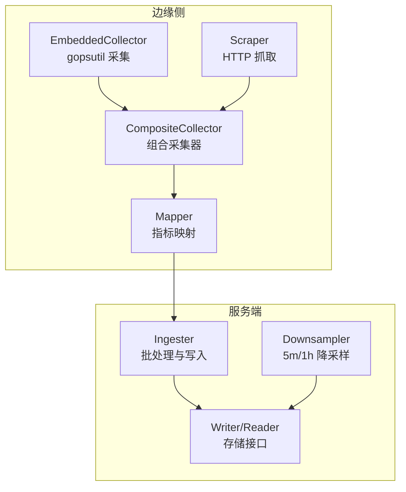
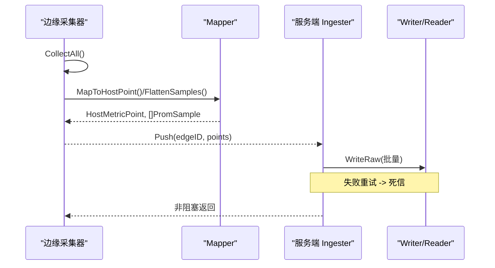
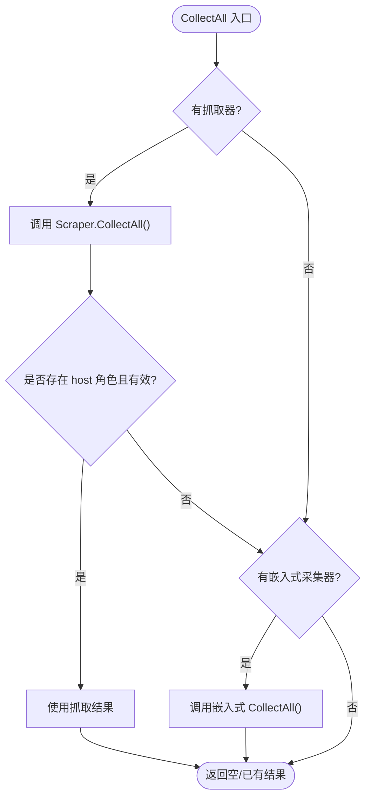
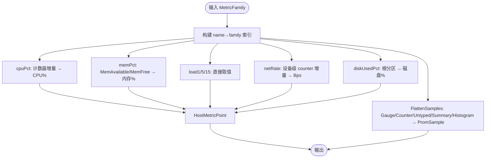
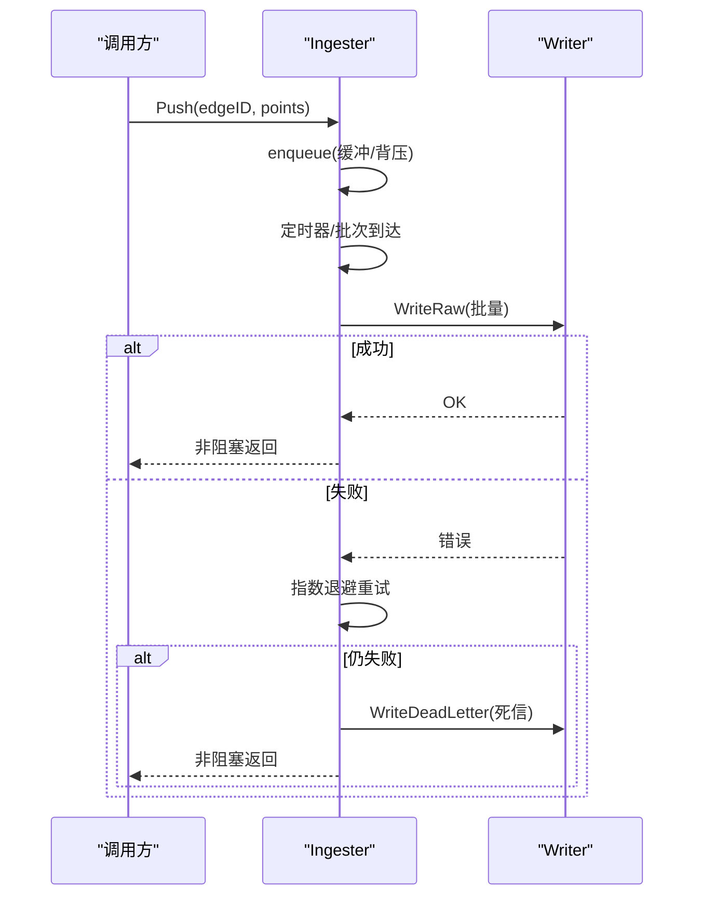
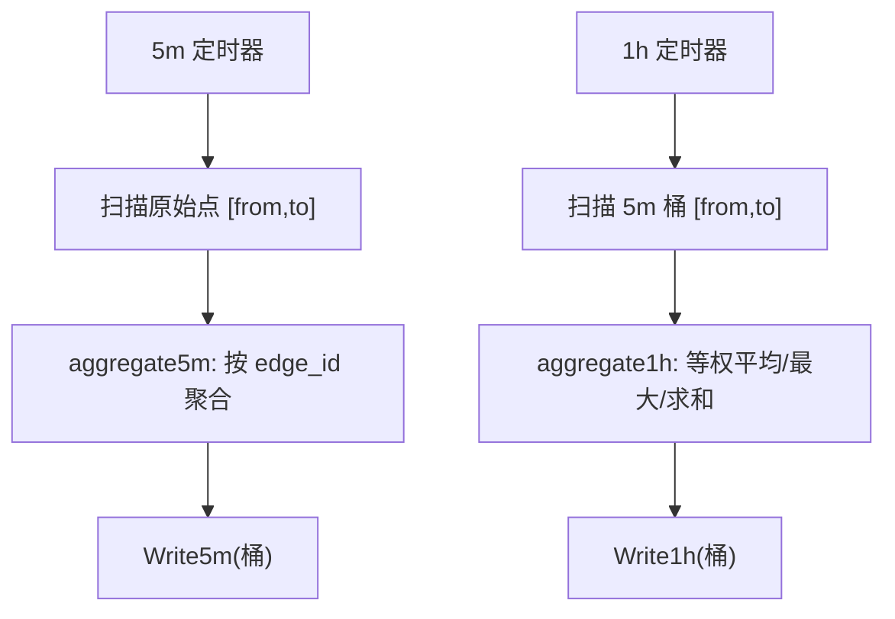
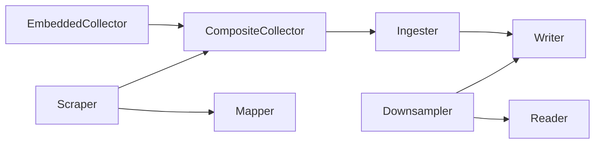

# 数据处理管道

<cite>
**本文引用的文件**
- [composite.go](file://internal/edgeagent/collector/composite.go)
- [mapper.go](file://internal/edgeagent/collector/mapper.go)
- [types.go](file://internal/edgeagent/collector/types.go)
- [scrape.go](file://internal/edgeagent/collector/scrape.go)
- [embedded.go](file://internal/edgeagent/collector/embedded.go)
- [scrape_config.example.yaml](file://internal/edgeagent/collector/scrape_config.example.yaml)
- [ingester.go](file://internal/manager/biz/metric/ingester.go)
- [downsample.go](file://internal/manager/biz/metric/downsample.go)
- [repo.go](file://internal/manager/biz/metric/repo.go)
</cite>

## 目录
1. [简介](#简介)
2. [项目结构](#项目结构)
3. [核心组件](#核心组件)
4. [架构总览](#架构总览)
5. [详细组件分析](#详细组件分析)
6. [依赖关系分析](#依赖关系分析)
7. [性能考量](#性能考量)
8. [故障排查指南](#故障排查指南)
9. [结论](#结论)
10. [附录](#附录)

## 简介
本文件系统化阐述 Ongrid 指标数据处理管道的实现与工作原理，覆盖从边缘采集、格式标准化、映射聚合到服务端批处理与降采样存储的完整链路。重点包括：
- Mapper 组件如何基于 Prometheus 命名规范将原始指标转换为统一的 HostMetricPoint 快速路径与 PromSample 富路径
- Composite 采集器如何通过组合模式统一接入多种数据源（嵌入式 gopsutil 与 HTTP 抓取）
- 批处理策略、内存管理、异常值过滤、去重与完整性校验
- 配置选项、调试方法与性能监控指标

## 项目结构
Ongrid 的指标管道分为两个主要层次：
- 边缘侧采集层（edgeagent/collector）：负责从本地或远端目标拉取指标，标准化为统一模型，并输出给上层推送
- 服务端业务层（manager/biz/metric）：负责接收、批处理、写入、降采样与查询

**图表来源**
- [composite.go:10-55](file://internal/edgeagent/collector/composite.go#L10-L55)
- [scrape.go:29-77](file://internal/edgeagent/collector/scrape.go#L29-L77)
- [embedded.go:26-73](file://internal/edgeagent/collector/embedded.go#L26-L73)
- [mapper.go:16-62](file://internal/edgeagent/collector/mapper.go#L16-L62)
- [ingester.go:15-118](file://internal/manager/biz/metric/ingester.go#L15-L118)
- [downsample.go:11-80](file://internal/manager/biz/metric/downsample.go#L11-L80)
- [repo.go:10-52](file://internal/manager/biz/metric/repo.go#L10-L52)

**章节来源**
- [composite.go:10-55](file://internal/edgeagent/collector/composite.go#L10-L55)
- [scrape.go:29-77](file://internal/edgeagent/collector/scrape.go#L29-L77)
- [embedded.go:26-73](file://internal/edgeagent/collector/embedded.go#L26-L73)
- [mapper.go:16-62](file://internal/edgeagent/collector/mapper.go#L16-L62)
- [ingester.go:15-118](file://internal/manager/biz/metric/ingester.go#L15-L118)
- [downsample.go:11-80](file://internal/manager/biz/metric/downsample.go#L11-L80)
- [repo.go:10-52](file://internal/manager/biz/metric/repo.go#L10-L52)

## 核心组件
- 采集器接口与输出模型：定义统一的 Collector 接口与 CollectorOutput，屏蔽嵌入式与抓取式差异
- 嵌入式采集器：通过 gopsutil 读取 CPU、内存、负载、网络、磁盘等指标，并以 node_exporter 兼容命名输出
- 抓取器：按目标独立轮询 HTTP /metrics，解析为 MetricFamily，维护每目标的快照与 Mapper
- 组合采集器：优先使用抓取结果；当无有效主机角色抓取时回退到嵌入式基线
- 映射器：将 MetricFamily 转换为 HostMetricPoint（快速路径）与 PromSample（富路径），支持计数器速率转换与直方图/摘要展开
- 批处理器：缓冲点、批量写入、失败重试与死信落盘
- 降采样器：定时对原始点与 5m 桶进行聚合，生成 5m/1h 桶

**章节来源**
- [types.go:9-57](file://internal/edgeagent/collector/types.go#L9-L57)
- [embedded.go:26-73](file://internal/edgeagent/collector/embedded.go#L26-L73)
- [scrape.go:29-77](file://internal/edgeagent/collector/scrape.go#L29-L77)
- [composite.go:10-55](file://internal/edgeagent/collector/composite.go#L10-L55)
- [mapper.go:16-62](file://internal/edgeagent/collector/mapper.go#L16-L62)
- [ingester.go:15-118](file://internal/manager/biz/metric/ingester.go#L15-L118)
- [downsample.go:11-80](file://internal/manager/biz/metric/downsample.go#L11-L80)

## 架构总览
整体流程如下：
- 边缘侧通过 CompositeCollector 统一调度 EmbeddedCollector 与 Scraper，产出 CollectorOutput
- Mapper 将 MetricFamily 转为 HostMetricPoint 与 PromSample，同时完成 NaN/Inf 过滤与标签合并
- 服务端 Ingester 以通道缓冲 + 定时器触发批量写入，失败指数退避并落盘死信
- Downsampler 按 5m/1h 周期扫描并聚合，持久化降采样结果

**图表来源**
- [composite.go:27-55](file://internal/edgeagent/collector/composite.go#L27-L55)
- [mapper.go:40-137](file://internal/edgeagent/collector/mapper.go#L40-L137)
- [ingester.go:120-171](file://internal/manager/biz/metric/ingester.go#L120-L171)
- [repo.go:10-33](file://internal/manager/biz/metric/repo.go#L10-L33)

## 详细组件分析

### 组合采集器（CompositeCollector）
- 职责：组合嵌入式基线与抓取目标，提供统一的 CollectAll、HostInfo、GetHostLoad、GetProcessList
- 行为：
  - 优先执行抓取；若存在 host 角色且有效，则使用其结果
  - 若无有效 host 抓取，则回退到嵌入式基线
  - HostInfo/GetHostLoad/GetProcessList 在可用时优先走抓取，否则回退嵌入式

**图表来源**
- [composite.go:27-55](file://internal/edgeagent/collector/composite.go#L27-L55)

**章节来源**
- [composite.go:10-92](file://internal/edgeagent/collector/composite.go#L10-L92)

### 抓取器（Scraper）
- 职责：按目标独立轮询 HTTP /metrics，解析为 MetricFamily 并维护快照；每个 tick 产出 per-target 的 CollectorOutput
- 关键点：
  - 每个目标独立 goroutine，错误仅记录不中断其他目标
  - 支持 Bearer Token 与 TLS 配置
  - 为每个目标维护 Mapper，用于计算 HostMetricPoint（仅 role=host）
  - CollectAll 会合并静态标签 extraLabels

```mermaid
classDiagram
class Scraper {
+Run(ctx) error
+CollectAll(ctx) []CollectorOutput
+HostInfo(ctx) HostInfo
+GetHostLoad(ctx) GetHostLoadResponse
+GetProcessList(ctx, topN, sortBy) GetProcessListResponse
-clients map[string]*http.Client
-snapshot map[string]targetSnapshot
-mappers map[string]*Mapper
}
class targetSnapshot {
+families []*dto.MetricFamily
+at time.Time
+source string
+role string
}
Scraper --> targetSnapshot : "维护"
Scraper --> Mapper : "per-target"
```

**图表来源**
- [scrape.go:29-77](file://internal/edgeagent/collector/scrape.go#L29-L77)
- [scrape.go:185-226](file://internal/edgeagent/collector/scrape.go#L185-L226)
- [mapper.go:16-62](file://internal/edgeagent/collector/mapper.go#L16-L62)

**章节来源**
- [scrape.go:79-183](file://internal/edgeagent/collector/scrape.go#L79-L183)
- [scrape.go:185-356](file://internal/edgeagent/collector/scrape.go#L185-L356)

### 嵌入式采集器（EmbeddedCollector）
- 职责：通过 gopsutil 直接读取系统指标，并以 node_exporter 兼容命名输出 MetricFamily
- 关键指标族：CPU、内存、负载、网络、文件系统、时间/启动时间
- 特点：
  - 单源输出，标记 Source="embedded"
  - 与 Mapper 共享命名约定，确保快速路径一致

**章节来源**
- [embedded.go:26-73](file://internal/edgeagent/collector/embedded.go#L26-L73)
- [embedded.go:176-340](file://internal/edgeagent/collector/embedded.go#L176-L340)

### 映射器（Mapper）
- 职责：
  - 将 MetricFamily 转换为 HostMetricPoint（快速路径：CPU%、内存%、负载、网络速率、磁盘占用%）
  - 将 MetricFamily 扁平化为 PromSample（富路径：Gauge/Counter/Untyped/Summary/Histogram）
- 算法要点：
  - 计数器速率：缓存上次采样，计算差值与时间间隔，得到每秒速率
  - CPU%：累计各核各 mode 的增量，排除 idle 计算利用率
  - 内存%：优先 MemAvailable，否则用 MemFree+Buffers+Cached 推导
  - 磁盘%：针对根挂载点计算 (1 - avail/size)*100
  - 网络速率：累加设备级 counter 增量，排除 lo
  - NaN/Inf 过滤：避免 JSON 编码问题
  - 标签合并：extraLabels 不会覆盖生产者原有标签

**图表来源**
- [mapper.go:40-137](file://internal/edgeagent/collector/mapper.go#L40-L137)
- [mapper.go:227-307](file://internal/edgeagent/collector/mapper.go#L227-L307)
- [mapper.go:175-206](file://internal/edgeagent/collector/mapper.go#L175-L206)

**章节来源**
- [mapper.go:16-146](file://internal/edgeagent/collector/mapper.go#L16-L146)
- [mapper.go:148-373](file://internal/edgeagent/collector/mapper.go#L148-L373)

### 批处理与写入（Ingester）
- 职责：接收 HostMetricPoint，转换为内部 Point，缓冲后批量写入；失败重试并落盘死信
- 批策略：
  - 默认批次大小 500，缓冲区容量为批次大小的 4 倍
  - 定时器 5 秒触发 flush，或达到批次大小立即 flush
  - 背压：缓冲区满时丢弃最旧点，并计数 dropped
- 重试与死信：
  - 指数退避：100ms、500ms、2s
  - 全部失败后写入死信表，附带原因
- 监控指标：
  - ongrid_ingest_writes_total（success/fail）
  - ongrid_ingest_flush_failures_total（reason）
  - ongrid_ingest_dropped_total（reason）
  - ongrid_ingest_batch_size（直方图）

**图表来源**
- [ingester.go:120-171](file://internal/manager/biz/metric/ingester.go#L120-L171)
- [ingester.go:200-247](file://internal/manager/biz/metric/ingester.go#L200-L247)

**章节来源**
- [ingester.go:15-118](file://internal/manager/biz/metric/ingester.go#L15-L118)
- [ingester.go:163-247](file://internal/manager/biz/metric/ingester.go#L163-L247)

### 降采样（Downsampler）
- 职责：定时将原始点聚合成 5m 桶，再将 5m 桶聚合成 1h 桶
- 聚合规则：
  - 5m：按 edge_id 分组，gauges 取平均/最大，counters 求和，负载/磁盘等字段分别平均/最大
  - 1h：对同小时内的 5m 桶等权平均 avg 字段，max 字段取最大，counter 字段求和
- 调度：对齐墙钟边界，5 分钟与 1 小时各一个 ticker

**图表来源**
- [downsample.go:36-80](file://internal/manager/biz/metric/downsample.go#L36-L80)
- [downsample.go:121-274](file://internal/manager/biz/metric/downsample.go#L121-L274)

**章节来源**
- [downsample.go:11-115](file://internal/manager/biz/metric/downsample.go#L11-L115)
- [downsample.go:121-302](file://internal/manager/biz/metric/downsample.go#L121-L302)

### 配置与多源接入
- 抓取配置示例：支持多个目标，各自 interval/timeout，Bearer Token、TLS 跳过验证、静态标签
- 角色区分：
  - host：可参与快速路径 HostMetricPoint 计算
  - component：仅贡献富路径 PromSample

**章节来源**
- [scrape_config.example.yaml:1-30](file://internal/edgeagent/collector/scrape_config.example.yaml#L1-L30)
- [scrape.go:117-183](file://internal/edgeagent/collector/scrape.go#L117-L183)

## 依赖关系分析
- 边缘侧：
  - CompositeCollector 依赖 EmbeddedCollector 与 Scraper
  - Scraper 依赖 Mapper（per-target）与 HTTP 客户端
  - EmbeddedCollector 依赖 gopsutil 子系统
- 服务端：
  - Ingester 依赖 Writer（存储抽象）
  - Downsampler 依赖 Reader/Writer（存储抽象）
  - 存储接口解耦具体后端（如 ClickHouse/SQLite 等）

**图表来源**
- [composite.go:10-55](file://internal/edgeagent/collector/composite.go#L10-L55)
- [scrape.go:29-77](file://internal/edgeagent/collector/scrape.go#L29-L77)
- [embedded.go:26-73](file://internal/edgeagent/collector/embedded.go#L26-L73)
- [ingester.go:15-118](file://internal/manager/biz/metric/ingester.go#L15-L118)
- [downsample.go:11-80](file://internal/manager/biz/metric/downsample.go#L11-L80)
- [repo.go:10-52](file://internal/manager/biz/metric/repo.go#L10-L52)

**章节来源**
- [composite.go:10-92](file://internal/edgeagent/collector/composite.go#L10-L92)
- [scrape.go:29-356](file://internal/edgeagent/collector/scrape.go#L29-L356)
- [embedded.go:26-340](file://internal/edgeagent/collector/embedded.go#L26-L340)
- [ingester.go:15-247](file://internal/manager/biz/metric/ingester.go#L15-L247)
- [downsample.go:11-302](file://internal/manager/biz/metric/downsample.go#L11-L302)
- [repo.go:10-52](file://internal/manager/biz/metric/repo.go#L10-L52)

## 性能考量
- 批处理与内存：
  - 默认批次 500，缓冲容量为 2000，避免频繁 IO 与减少 GC 压力
  - 背压策略：缓冲满时丢弃最旧点，保证低延迟与稳定性
- 并发与隔离：
  - 每个抓取目标独立 goroutine，互不影响
  - Mapper 使用互斥锁保护计数器缓存，保证速率计算一致性
- 网络优化：
  - HTTP 连接复用与超时控制，降低握手开销
- 存储与降采样：
  - 5m/1h 降采样减少长期存储与查询成本
  - 失败重试与死信机制提升鲁棒性

[本节为通用指导，无需特定文件引用]

## 故障排查指南
- 抓取失败：
  - 检查目标 URL、认证（Bearer Token）、TLS 配置
  - 关注日志中的 scrape 错误与非 2xx 状态码
- 快速路径为零：
  - 首次调用计数器速率为零属正常，等待至少一次采样
  - 确认 role=host 的目标暴露了 CPU/内存/负载/网络/磁盘指标
- 写入失败：
  - 观察 ongrid_ingest_flush_failures_total 与 ongrid_ingest_dropped_total
  - 检查死信表记录，定位具体错误原因
- 性能问题：
  - 调整批次大小与刷新间隔（当前默认 500/5s）
  - 评估目标数量与抓取频率，避免过载

**章节来源**
- [scrape.go:117-183](file://internal/edgeagent/collector/scrape.go#L117-L183)
- [mapper.go:40-62](file://internal/edgeagent/collector/mapper.go#L40-L62)
- [ingester.go:200-247](file://internal/manager/biz/metric/ingester.go#L200-L247)

## 结论
Ongrid 的指标数据处理管道通过清晰的层次划分与组合模式，实现了多源指标的标准化接入、高效批处理与可靠存储。Mapper 保证了快速路径与富路径的一致性，Ingester 提供了高吞吐与容错能力，Downsampler 降低了长期存储成本。结合配置化抓取与完善的监控指标，系统具备良好的可扩展性与可运维性。

[本节为总结，无需特定文件引用]

## 附录
- 配置项说明（抓取）：
  - targets[].name：唯一稳定的目标名，用于 Source 标识
  - targets[].role：host/component，决定是否参与快速路径
  - targets[].url：指标端点
  - targets[].interval/timeout：抓取周期与超时
  - targets[].bearer_token_file：认证令牌文件路径
  - targets[].tls_insecure：是否跳过 TLS 验证
  - targets[].static_labels：附加静态标签

**章节来源**
- [scrape_config.example.yaml:9-30](file://internal/edgeagent/collector/scrape_config.example.yaml#L9-L30)