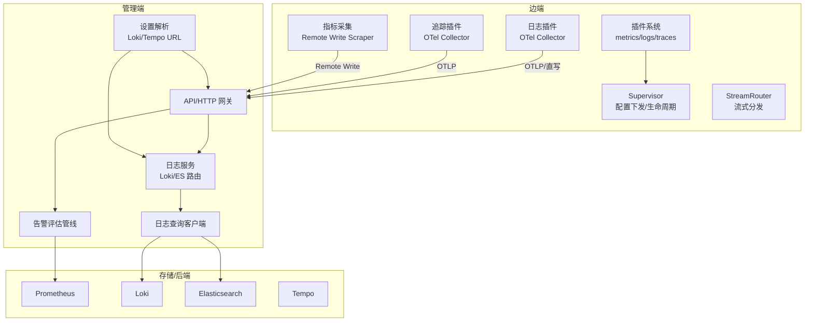
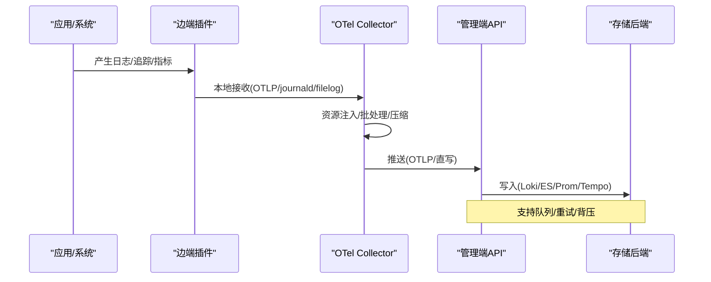
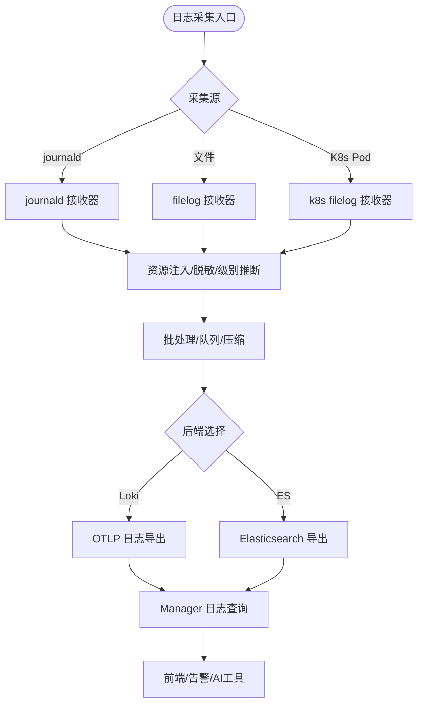
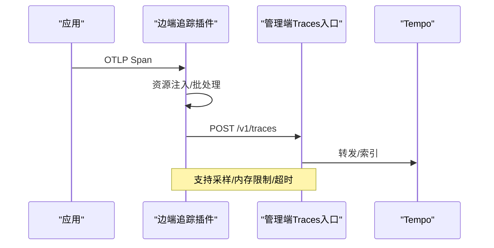
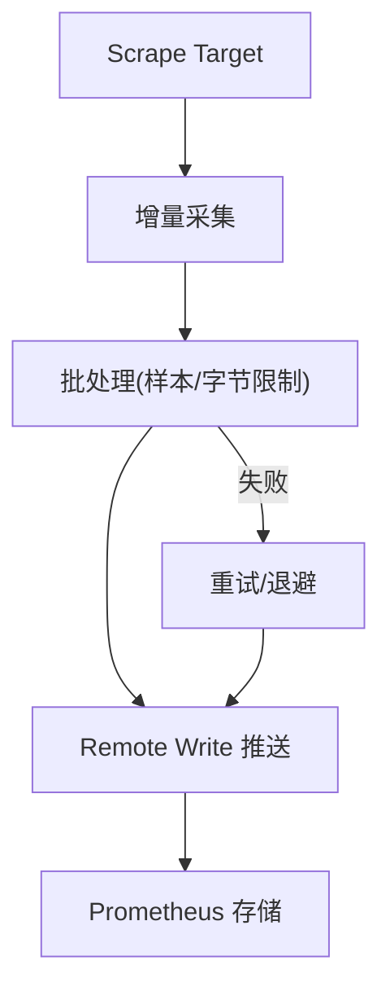
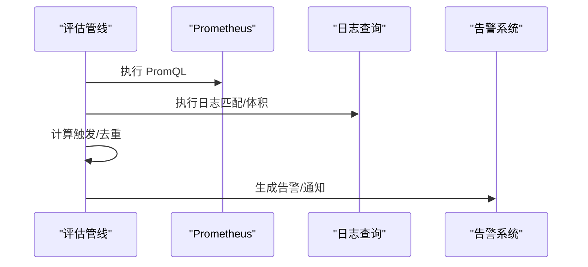
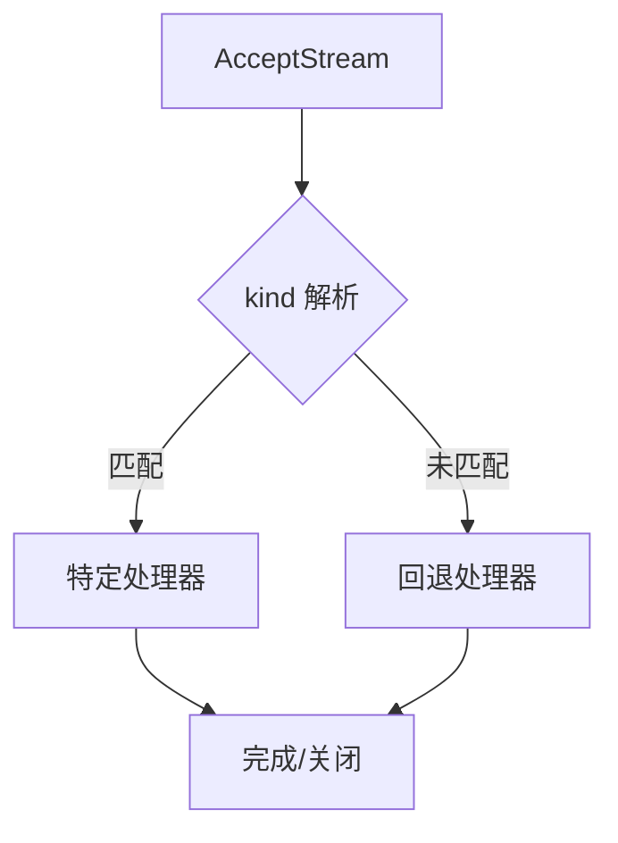
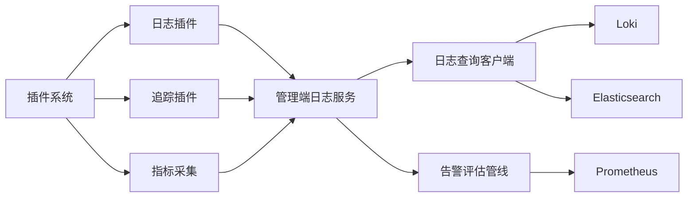

# 数据流设计

<cite>
**本文引用的文件**
- [router.go](file://internal/edgeagent/streamrouter/router.go)
- [plugin.go](file://internal/edgeagent/plugins/plugin.go)
- [supervisor.go](file://internal/edgeagent/plugins/supervisor.go)
- [render.go（日志）](file://internal/edgeagent/plugins/logs/render.go)
- [render.go（追踪）](file://internal/edgeagent/plugins/traces/render.go)
- [remote_write_scraper.go](file://internal/edgeagent/k8s/remote_write_scraper.go)
- [metrics_batch.go](file://internal/edgeagent/k8s/metrics_batch.go)
- [tracing.go](file://internal/pkg/tracing/tracing.go)
- [client.go（日志查询）](file://internal/pkg/logquery/client.go)
- [pipeline.go](file://internal/manager/biz/alert/pipeline.go)
- [evaluators_phaseB.go](file://internal/manager/biz/alert/evaluators_phaseB.go)
- [service.go（日志服务）](file://internal/manager/biz/logs/service.go)
- [search.go（日志搜索路由）](file://internal/manager/biz/logs/search.go)
- [query_logql.go](file://internal/manager/biz/logs/query_logql.go)
- [repo.go（日志后端选择）](file://internal/manager/data/logs/store/repo.go)
- [telemetry.go（Loki/Tempo 解析）](file://internal/manager/biz/setting/telemetry.go)
- [logs.ts（前端日志类型）](file://web/src/api/logs.ts)
- [RFC-003-otel-elasticsearch-logs.md](file://docs/rfc/RFC-003-otel-elasticsearch-logs.md)
</cite>

## 目录
1. [简介](#简介)
2. [项目结构](#项目结构)
3. [核心组件](#核心组件)
4. [架构总览](#架构总览)
5. [详细组件分析](#详细组件分析)
6. [依赖关系分析](#依赖关系分析)
7. [性能与容量规划](#性能与容量规划)
8. [故障排查指南](#故障排查指南)
9. [结论](#结论)
10. [附录](#附录)

## 简介
本文件面向 Ongrid 的数据流设计与实现，覆盖指标、日志、追踪与业务数据的采集、传输、存储与处理链路。重点说明：
- 数据管道的设计模式：插件化采集、边端直写、统一查询路由、批处理与背压控制。
- 实时与批处理能力：基于 OTel Collector 的流水线、队列与批处理器，以及 Prometheus Remote Write 的定时拉取与批量上报。
- 一致性、背压与流量控制：持久化队列、重试退避、内存与字节级批大小限制、超时与限流。
- 压缩、去重与聚合优化：OTLP 压缩、日志字段裁剪与敏感信息脱敏、告警去重键、结果集分页游标。
- 可视化链路：从 Edge 采集到 Manager 查询与 Grafana/前端展示。

## 项目结构
Ongrid 的数据流由“边端采集”和“管理端处理/查询”两部分组成：
- 边端（on-grid-edge）通过插件系统运行 metrics/logs/traces 采集能力，使用 OTel Collector 或内置 scrape 器将数据写入后端或直接推送到 Manager。
- 管理端（Manager）提供统一的日志/指标/追踪查询入口，支持 Loki 与 Elasticsearch 双后端选择，并承载告警评估、规则引擎与前端 API。

图表来源
- [plugin.go:18-71](file://internal/edgeagent/plugins/plugin.go#L18-L71)
- [supervisor.go:112-133](file://internal/edgeagent/plugins/supervisor.go#L112-L133)
- [render.go（日志）:502-600](file://internal/edgeagent/plugins/logs/render.go#L502-L600)
- [render.go（追踪）:35-334](file://internal/edgeagent/plugins/traces/render.go#L35-L334)
- [remote_write_scraper.go:135-149](file://internal/edgeagent/k8s/remote_write_scraper.go#L135-L149)
- [client.go（日志查询）:120-171](file://internal/pkg/logquery/client.go#L120-L171)
- [pipeline.go:195-224](file://internal/manager/biz/alert/pipeline.go#L195-L224)
- [telemetry.go:42-83](file://internal/manager/biz/setting/telemetry.go#L42-L83)

章节来源
- [plugin.go:18-71](file://internal/edgeagent/plugins/plugin.go#L18-L71)
- [supervisor.go:112-133](file://internal/edgeagent/plugins/supervisor.go#L112-L133)
- [remote_write_scraper.go:135-149](file://internal/edgeagent/k8s/remote_write_scraper.go#L135-L149)
- [client.go（日志查询）:120-171](file://internal/pkg/logquery/client.go#L120-L171)
- [pipeline.go:195-224](file://internal/manager/biz/alert/pipeline.go#L195-L224)
- [telemetry.go:42-83](file://internal/manager/biz/setting/telemetry.go#L42-L83)

## 核心组件
- 插件系统与 Supervisor：统一管理 metrics/logs/traces 的生命周期，支持热重载与健康上报。
- 日志插件：渲染 OTel Collector 配置，支持 journald/filelog/kubernetes 多源采集，支持内置 Loki 与外部 Elasticsearch 两种后端，具备内存限制、批处理、发送队列与重试。
- 追踪插件：渲染 OTel Collector 配置，接收本地 OTLP gRPC/HTTP，经资源注入、批处理后导出至 Manager 的 /v1/traces。
- 指标采集：Kubernetes 场景下通过 Remote Write Scraper 定时抓取目标指标，按样本数/字节数分批并通过隧道推送至 Manager。
- 日志查询与后端选择：Manager 侧根据当前选择的后端（Loki 或 ES）路由查询；支持 LogQL 范围查询与安全子集适配 ES。
- 告警评估管线：周期性执行 PromQL、日志匹配/体积、追踪错误率等规则，生成告警并通知。

章节来源
- [plugin.go:18-71](file://internal/edgeagent/plugins/plugin.go#L18-L71)
- [render.go（日志）:502-600](file://internal/edgeagent/plugins/logs/render.go#L502-L600)
- [render.go（追踪）:35-334](file://internal/edgeagent/plugins/traces/render.go#L35-L334)
- [remote_write_scraper.go:135-149](file://internal/edgeagent/k8s/remote_write_scraper.go#L135-L149)
- [search.go（日志搜索路由）:27-58](file://internal/manager/biz/logs/search.go#L27-L58)
- [query_logql.go:16-49](file://internal/manager/biz/logs/query_logql.go#L16-L49)
- [pipeline.go:195-224](file://internal/manager/biz/alert/pipeline.go#L195-L224)

## 架构总览
Ongrid 采用“边端直写 + 管理端路由”的解耦架构：
- 边端负责采集与预处理（清洗、标签注入、批处理、压缩、持久化队列）。
- 管理端负责统一接入、查询路由、告警评估与前端展示。
- 存储层支持多种后端（Prometheus/Loki/Tempo/Elasticsearch），通过配置与运行时解析动态切换。

图表来源
- [render.go（日志）:502-600](file://internal/edgeagent/plugins/logs/render.go#L502-L600)
- [render.go（追踪）:35-334](file://internal/edgeagent/plugins/traces/render.go#L35-L334)
- [remote_write_scraper.go:228-276](file://internal/edgeagent/k8s/remote_write_scraper.go#L228-L276)
- [client.go（日志查询）:120-171](file://internal/pkg/logquery/client.go#L120-L171)

## 详细组件分析

### 日志数据流（采集→传输→存储→查询）
- 采集：支持 journald、文件、Kubernetes Pod 日志，自动识别级别、脱敏敏感字段、标准化资源属性。
- 传输：通过 OTel Collector 的 sending queue 与 batch processor 进行批处理与重试；支持 gzip 压缩；支持内置 Loki OTLP 或外部 Elasticsearch 直写。
- 存储：Loki 使用 OTLP 日志接口；Elasticsearch 使用 data stream 与固定映射模式。
- 查询：Manager 根据当前后端选择 Loki 或 ES；LogQL 在 Loki 上原生执行，在 ES 上转换为安全子集查询；支持分页游标。

图表来源
- [render.go（日志）:502-600](file://internal/edgeagent/plugins/logs/render.go#L502-L600)
- [search.go（日志搜索路由）:27-58](file://internal/manager/biz/logs/search.go#L27-L58)
- [query_logql.go:16-49](file://internal/manager/biz/logs/query_logql.go#L16-L49)

章节来源
- [render.go（日志）:502-600](file://internal/edgeagent/plugins/logs/render.go#L502-L600)
- [search.go（日志搜索路由）:27-58](file://internal/manager/biz/logs/search.go#L27-L58)
- [query_logql.go:16-49](file://internal/manager/biz/logs/query_logql.go#L16-L49)
- [RFC-003-otel-elasticsearch-logs.md:18-31](file://docs/rfc/RFC-003-otel-elasticsearch-logs.md#L18-L31)

### 追踪数据流（OTLP → Manager → Tempo）
- 采集：边端 traces 插件监听本地 OTLP gRPC/HTTP，注入设备维度资源，批处理后导出。
- 传输：通过 OTLP HTTP 导出至 Manager 的 /v1/traces；支持采样率与内存限制。
- 存储：Tempo 作为追踪后端；Manager 可结合 spanmetrics 生成指标供告警与可视化使用。

图表来源
- [render.go（追踪）:35-334](file://internal/edgeagent/plugins/traces/render.go#L35-L334)
- [tracing.go:35-73](file://internal/pkg/tracing/tracing.go#L35-L73)

章节来源
- [render.go（追踪）:35-334](file://internal/edgeagent/plugins/traces/render.go#L35-L334)
- [tracing.go:35-73](file://internal/pkg/tracing/tracing.go#L35-L73)

### 指标数据流（Scrape → Remote Write → Prometheus）
- 采集：Remote Write Scraper 定时抓取 kube-state-metrics 或应用指标，增量收集样本。
- 批处理：按样本数量与编码后字节数限制分批，避免单请求过大。
- 传输：通过隧道推送至 Manager，再由 Manager 写入 Prometheus；支持重试与退避。
- 健康：首次成功周期后才标记 Ready，失败时降级并记录状态样本。

图表来源
- [remote_write_scraper.go:228-276](file://internal/edgeagent/k8s/remote_write_scraper.go#L228-L276)
- [metrics_batch.go:29-112](file://internal/edgeagent/k8s/metrics_batch.go#L29-L112)

章节来源
- [remote_write_scraper.go:228-276](file://internal/edgeagent/k8s/remote_write_scraper.go#L228-L276)
- [metrics_batch.go:29-112](file://internal/edgeagent/k8s/metrics_batch.go#L29-L112)

### 业务数据流（告警评估与通知）
- 评估：周期性执行 PromQL、日志匹配/体积、追踪错误率等规则，计算触发条件。
- 去重：基于规则键与标签集合生成去重键，抑制重复告警。
- 通知：将触发的告警写入系统并发送到通知渠道。

图表来源
- [pipeline.go:195-224](file://internal/manager/biz/alert/pipeline.go#L195-L224)
- [evaluators_phaseB.go:318-355](file://internal/manager/biz/alert/evaluators_phaseB.go#L318-L355)

章节来源
- [pipeline.go:195-224](file://internal/manager/biz/alert/pipeline.go#L195-L224)
- [evaluators_phaseB.go:318-355](file://internal/manager/biz/alert/evaluators_phaseB.go#L318-L355)

### 插件与流式通道（StreamRouter）
- StreamRouter 维护单一 AcceptStream 循环，根据流元数据中的 kind 分发给对应处理器，支持回退处理器与 panic 保护。
- 用于边端与 Manager 之间的流式通道（如操作命令、诊断流等），与遥测数据路径解耦。

图表来源
- [router.go:30-66](file://internal/edgeagent/streamrouter/router.go#L30-L66)

章节来源
- [router.go:30-66](file://internal/edgeagent/streamrouter/router.go#L30-L66)

## 依赖关系分析
- 插件系统依赖 Supervisor 进行配置拉取与生命周期管理；日志/追踪插件渲染 OTel Collector 配置并启动子进程。
- 指标采集依赖 Kubernetes API（可选）与 Remote Write 写入器；批处理器对样本与字节进行严格限制。
- 日志查询依赖当前后端选择（Loki 或 ES），Manager 侧缓存 ES 客户端并按 generation 失效。
- 告警评估依赖 PromQL、日志查询与设备状态刷新；追踪错误率通过 spanmetrics 指标查询。

图表来源
- [plugin.go:18-71](file://internal/edgeagent/plugins/plugin.go#L18-L71)
- [search.go（日志搜索路由）:233-268](file://internal/manager/biz/logs/search.go#L233-L268)
- [pipeline.go:195-224](file://internal/manager/biz/alert/pipeline.go#L195-L224)

章节来源
- [plugin.go:18-71](file://internal/edgeagent/plugins/plugin.go#L18-L71)
- [search.go（日志搜索路由）:233-268](file://internal/manager/biz/logs/search.go#L233-L268)
- [pipeline.go:195-224](file://internal/manager/biz/alert/pipeline.go#L195-L224)

## 性能与容量规划
- 批处理策略：
  - 日志：send_batch_size/send_batch_max_size、sending_queue 队列、gzip 压缩、内存限制与 spike limit。
  - 指标：按样本数与编码后字节数限制分批，避免超限；PushTimeout 与 MaxRetries 控制重试。
  - 追踪：batch_send_size/batch_max_size、queue_size、memory limiter 约束。
- 背压与流量控制：
  - 队列阻塞与溢出保护（block_on_overflow）、重试退避（initial_interval/max_interval）。
  - 超时控制（scrape timeout、push timeout、HTTP client timeout）。
  - 采样率（traces sampling ratio）与结果限制（limit）。
- 压缩与去重：
  - OTLP 压缩（gzip）、日志字段裁剪与敏感信息脱敏、告警去重键（rule+labels）。
- 聚合优化：
  - 日志查询分页游标、ES PIT 释放、Loki query_range step 控制。
  - 指标聚合通过 PromQL 表达式与 spanmetrics 指标。

章节来源
- [render.go（日志）:174-207](file://internal/edgeagent/plugins/logs/render.go#L174-L207)
- [render.go（日志）:502-600](file://internal/edgeagent/plugins/logs/render.go#L502-L600)
- [render.go（追踪）:321-334](file://internal/edgeagent/plugins/traces/render.go#L321-L334)
- [remote_write_scraper.go:228-276](file://internal/edgeagent/k8s/remote_write_scraper.go#L228-L276)
- [metrics_batch.go:29-112](file://internal/edgeagent/k8s/metrics_batch.go#L29-L112)
- [client.go（日志查询）:120-171](file://internal/pkg/logquery/client.go#L120-L171)
- [evaluators_phaseB.go:318-355](file://internal/manager/biz/alert/evaluators_phaseB.go#L318-L355)

## 故障排查指南
- 日志无法写入：
  - 检查后端选择与 URL 解析（Loki/ES endpoint 校验）。
  - 查看 sending_queue 与 retry 配置，确认磁盘空间与权限。
  - 验证认证方式（Basic/Bearer/文件密钥）与 TLS 设置。
- 指标推送失败：
  - 检查 scrape 目标可达性与超时；观察 Ready 状态与部分失败日志。
  - 调整批大小与 PushTimeout；关注样本限制与拒绝计数。
- 追踪无数据：
  - 确认 OTLP 端口绑定与采样率；检查内存限制与队列大小。
  - 验证 Manager /v1/traces 可达性与鉴权。
- 告警不触发：
  - 检查 PromQL 表达式与时间窗口；确认设备最后心跳刷新。
  - 查看日志匹配规则与游标有效性。

章节来源
- [render.go（日志）:502-600](file://internal/edgeagent/plugins/logs/render.go#L502-L600)
- [remote_write_scraper.go:332-359](file://internal/edgeagent/k8s/remote_write_scraper.go#L332-L359)
- [render.go（追踪）:321-334](file://internal/edgeagent/plugins/traces/render.go#L321-L334)
- [pipeline.go:195-224](file://internal/manager/biz/alert/pipeline.go#L195-L224)

## 结论
Ongrid 的数据流以插件化采集与边端直写为核心，结合 OTel Collector 的批处理与队列机制，实现了高吞吐、低延迟且可控的遥测数据管道。管理端通过统一查询路由与告警评估，支撑了多后端存储与可视化需求。通过严格的批大小限制、重试退避与采样控制，系统在可扩展性与稳定性之间取得平衡。未来可在数据聚合、长期存储成本与跨后端联邦查询方面持续优化。

## 附录
- 日志后端选择与切换：
  - 选择 Loki 会取消所有已选 ES 配置；选择 ES 需指定 dataset/namespace/index pattern。
  - 前端类型定义包含 current_backend、generation、write/query endpoints 等字段。
- 设置解析：
  - Loki/Tempo URL、认证与 TLS 选项通过设置服务解析，支持运行时生效。

章节来源
- [repo.go（日志后端选择）:85-119](file://internal/manager/data/logs/store/repo.go#L85-L119)
- [logs.ts（前端日志类型）:108-160](file://web/src/api/logs.ts#L108-L160)
- [telemetry.go（Loki/Tempo 解析）:42-83](file://internal/manager/biz/setting/telemetry.go#L42-L83)