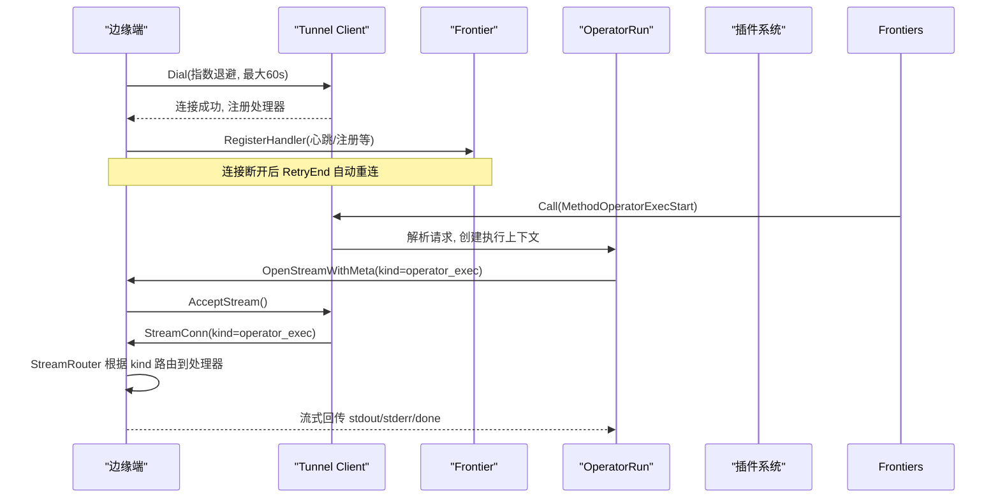
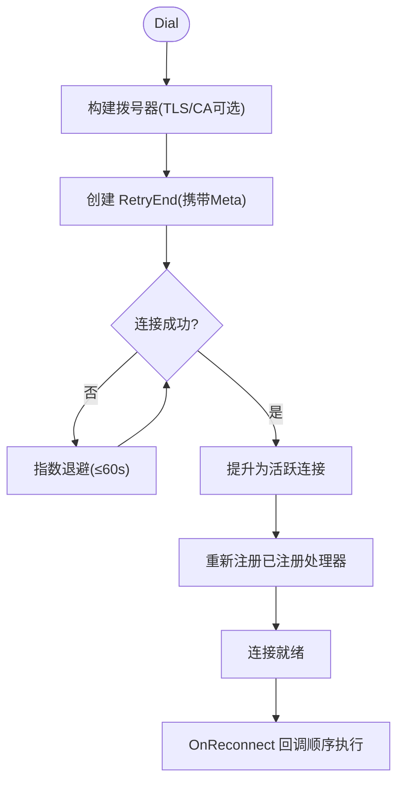
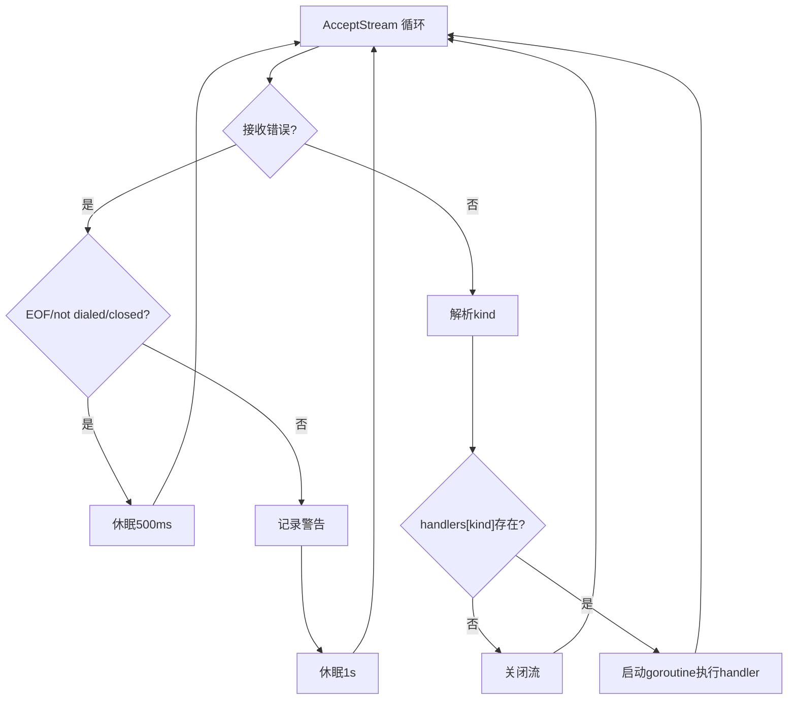
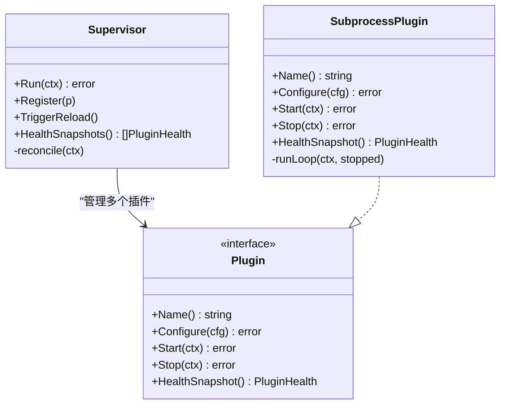
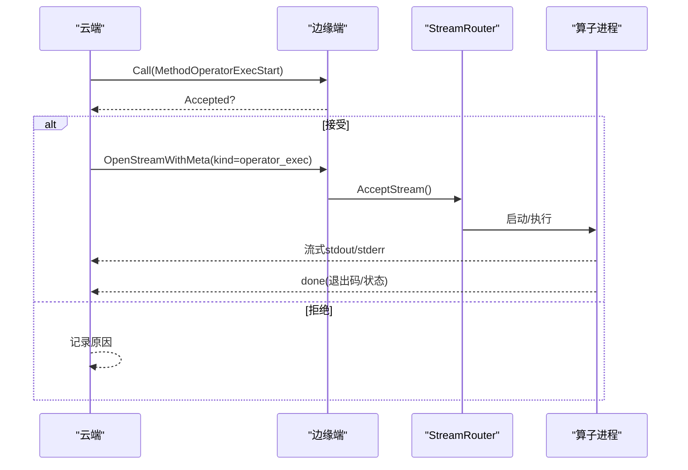
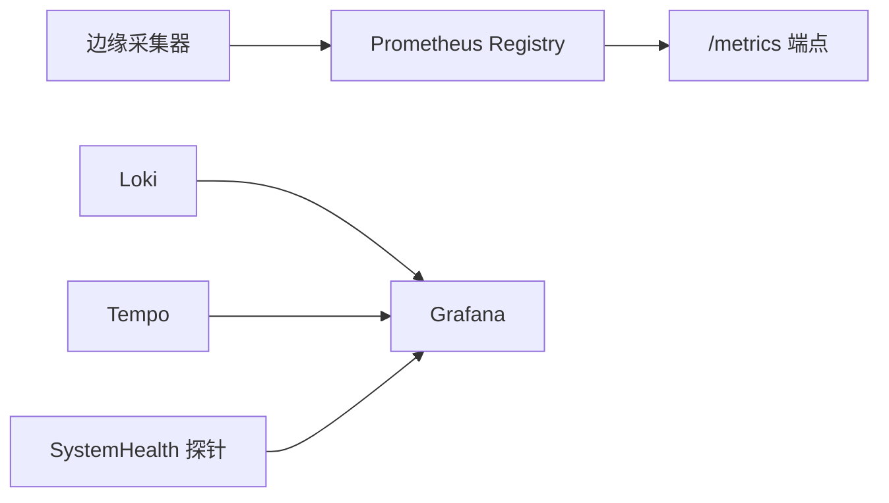
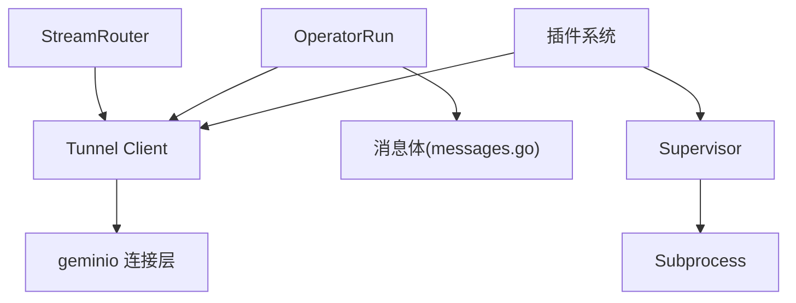

# 数据管道架构

<cite>
**本文引用的文件**
- [internal/pkg/tunnel/client.go](file://internal/pkg/tunnel/client.go)
- [internal/pkg/tunnel/types.go](file://internal/pkg/tunnel/types.go)
- [internal/pkg/tunnel/messages.go](file://internal/pkg/tunnel/messages.go)
- [internal/edgeagent/streamrouter/router.go](file://internal/edgeagent/streamrouter/router.go)
- [internal/manager/biz/operatorrun/service.go](file://internal/manager/biz/operatorrun/service.go)
- [internal/manager/service/frontierbound/handlers.go](file://internal/manager/service/frontierbound/handlers.go)
- [internal/edgeagent/plugins/supervisor.go](file://internal/edgeagent/plugins/supervisor.go)
- [internal/edgeagent/plugins/subprocess.go](file://internal/edgeagent/plugins/subprocess.go)
- [internal/pkg/prom/prom.go](file://internal/pkg/prom/prom.go)
- [internal/manager/service/systemhealth/service.go](file://internal/manager/service/systemhealth/service.go)
- [internal/edgeagent/collector/embedded.go](file://internal/edgeagent/collector/embedded.go)
- [internal/edgeagent/collector/mapper.go](file://internal/edgeagent/collector/mapper.go)
- [internal/manager/biz/alert/retry_test.go](file://internal/manager/biz/alert/retry_test.go)
- [internal/pkg/errs/errs.go](file://internal/pkg/errs/errs.go)
</cite>

## 目录
1. [简介](#简介)
2. [项目结构](#项目结构)
3. [核心组件](#核心组件)
4. [架构总览](#架构总览)
5. [详细组件分析](#详细组件分析)
6. [依赖关系分析](#依赖关系分析)
7. [性能与可扩展性](#性能与可扩展性)
8. [故障排查指南](#故障排查指南)
9. [结论](#结论)
10. [附录](#附录)

## 简介
本文件系统性阐述 Ongrid 数据管道的整体架构，重点覆盖：
- 流式处理与批处理混合的数据通路
- 边缘端与云端微服务间的可靠通信（Tunnel）
- StreamRouter 的动态路由策略
- 回调链执行机制与插件化扩展
- 背压、流量控制、错误重试与熔断思路
- 关键性能指标监控方案
- 管道调优与故障排查方法

## 项目结构
Ongrid 的数据管道由“边缘端”和“云端”两部分组成，通过 Tunnel 建立双向通道。边缘侧负责采集、转发、本地流式分发；云端负责编排、调度、存储与可视化。

```mermaid
graph TB
subgraph "边缘端"
A["采集器<br/>CPU/内存/网络/文件系统"]
B["插件系统<br/>Supervisor + Subprocess"]
C["StreamRouter<br/>AcceptStream 循环"]
D["Tunnel Client<br/>geminio 封装"]
end
subgraph "云端"
E["Frontier 网关<br/>RPC/Stream 路由"]
F["OperatorRun<br/>远程算子执行"]
G["PluginConfig 服务<br/>下发配置/密钥"]
H["Prometheus/Grafana/Loki/Tempo"]
end
A --> B
B --> C
C --> D
D < --> E
E --> F
E --> G
F --> H
G --> H
```

图表来源
- [internal/pkg/tunnel/client.go:24-165](file://internal/pkg/tunnel/client.go#L24-L165)
- [internal/edgeagent/streamrouter/router.go:22-66](file://internal/edgeagent/streamrouter/router.go#L22-L66)
- [internal/manager/biz/operatorrun/service.go:364-434](file://internal/manager/biz/operatorrun/service.go#L364-L434)
- [internal/manager/service/frontierbound/handlers.go:591-646](file://internal/manager/service/frontierbound/handlers.go#L591-L646)

章节来源
- [internal/pkg/tunnel/client.go:24-165](file://internal/pkg/tunnel/client.go#L24-L165)
- [internal/edgeagent/streamrouter/router.go:22-66](file://internal/edgeagent/streamrouter/router.go#L22-L66)
- [internal/manager/biz/operatorrun/service.go:364-434](file://internal/manager/biz/operatorrun/service.go#L364-L434)
- [internal/manager/service/frontierbound/handlers.go:591-646](file://internal/manager/service/frontierbound/handlers.go#L591-L646)

## 核心组件
- Tunnel 客户端：基于 geminio 的可靠连接、自动重连、注册处理器、反向 RPC 分发、流式通道 AcceptStream。
- StreamRouter：边缘端单 AcceptStream 循环，按元数据中的 kind 动态路由到具体 Handler。
- 插件系统：Supervisor 拉取并应用插件配置，Subprocess 管理外部进程生命周期，支持崩溃重启与健康检查。
- OperatorRun：云端发起远程算子执行，支持异步调用与流式回传 stdout/stderr/done。
- 可观测性：Prometheus 指标、Grafana/Loki/Tempo 集成探针。

章节来源
- [internal/pkg/tunnel/client.go:24-165](file://internal/pkg/tunnel/client.go#L24-L165)
- [internal/edgeagent/streamrouter/router.go:22-66](file://internal/edgeagent/streamrouter/router.go#L22-L66)
- [internal/edgeagent/plugins/supervisor.go:112-133](file://internal/edgeagent/plugins/supervisor.go#L112-L133)
- [internal/edgeagent/plugins/subprocess.go:208-308](file://internal/edgeagent/plugins/subprocess.go#L208-L308)
- [internal/manager/biz/operatorrun/service.go:364-434](file://internal/manager/biz/operatorrun/service.go#L364-L434)
- [internal/pkg/prom/prom.go:1-30](file://internal/pkg/prom/prom.go#L1-L30)

## 架构总览
Ongrid 采用“边缘采集+云端编排”的混合架构：
- 边缘侧：采集器产出指标/日志/事件，插件系统按需启停外部能力，StreamRouter 将远端下发的流式任务分发至本地处理器。
- 云端侧：Frontier 作为统一入口，提供 RPC 与流式通道；OperatorRun 驱动边缘执行远程算子；PluginConfig 服务向边缘推送插件配置与密钥。
- 通信层：Tunnel 使用 JSON 消息体，封装 geminio 的长连接与自动重连，保证连接恢复后重新注册处理器。



图表来源
- [internal/pkg/tunnel/client.go:81-165](file://internal/pkg/tunnel/client.go#L81-L165)
- [internal/manager/biz/operatorrun/service.go:364-434](file://internal/manager/biz/operatorrun/service.go#L364-L434)
- [internal/edgeagent/streamrouter/router.go:30-66](file://internal/edgeagent/streamrouter/router.go#L30-L66)

## 详细组件分析

### Tunnel 连接建立与维护
- 首次拨号：指数退避（1s→2s→…上限60s），失败持续重试直至上下文取消或成功。
- 连接维护：底层 RetryEnd 负责断线重连；上层在重连成功后重新注册处理器。
- 回调链：OnReconnect 注册的回调在重连完成后顺序执行，用于重新登记 edge 绑定等。
- 流式通道：AcceptStream 暴露 StreamConn，附带 Meta（JSON），供 StreamRouter 解析。



图表来源
- [internal/pkg/tunnel/client.go:81-165](file://internal/pkg/tunnel/client.go#L81-L165)
- [internal/pkg/tunnel/client.go:363-399](file://internal/pkg/tunnel/client.go#L363-L399)

章节来源
- [internal/pkg/tunnel/client.go:81-165](file://internal/pkg/tunnel/client.go#L81-L165)
- [internal/pkg/tunnel/client.go:363-399](file://internal/pkg/tunnel/client.go#L363-L399)
- [internal/pkg/tunnel/types.go:92-118](file://internal/pkg/tunnel/types.go#L92-L118)

### StreamRouter 路由策略
- 单 AcceptStream 循环：不断从 Tunnel 接受流，若错误为 EOF/not dialed/closed，短暂休眠后继续。
- 动态路由：解析流元数据中的 kind，匹配 handlers 表；未命中则关闭流。
- 健壮性：每个 handler 在独立 goroutine 中运行，捕获 panic 并记录堆栈，避免影响主循环。



图表来源
- [internal/edgeagent/streamrouter/router.go:30-66](file://internal/edgeagent/streamrouter/router.go#L30-L66)

章节来源
- [internal/edgeagent/streamrouter/router.go:30-66](file://internal/edgeagent/streamrouter/router.go#L30-L66)

### 回调链执行机制
- 回调注册：OnReconnect(fn) 允许在连接恢复后执行自定义逻辑（如重新注册 edge）。
- 执行时机：RetryEnd 完成重连并恢复本地处理器后，回调在锁外顺序执行，防止阻塞重连路径。
- 容错：回调内部 panic 被 recover 捕获，不影响后续回调与重连流程。

章节来源
- [internal/pkg/tunnel/client.go:363-399](file://internal/pkg/tunnel/client.go#L363-L399)

### 插件化架构与动态路由
- Supervisor：周期性拉取插件配置快照，对比当前状态进行 diff，按需 Configure/Start/Stop。
- Subprocess：以外部进程形式运行插件，崩溃后指数退避重启，支持优雅停止与超时保护。
- 健康上报：HealthSnapshot 汇总各插件状态，随心跳上报云端。
- 云端下发：frontierbound 提供 get_plugin_configs/get_plugin_secret 等 RPC，边缘侧通过 Tunnel 获取。



图表来源
- [internal/edgeagent/plugins/supervisor.go:112-133](file://internal/edgeagent/plugins/supervisor.go#L112-L133)
- [internal/edgeagent/plugins/subprocess.go:208-308](file://internal/edgeagent/plugins/subprocess.go#L208-L308)

章节来源
- [internal/edgeagent/plugins/supervisor.go:112-133](file://internal/edgeagent/plugins/supervisor.go#L112-L133)
- [internal/edgeagent/plugins/subprocess.go:208-308](file://internal/edgeagent/plugins/subprocess.go#L208-L308)
- [internal/manager/service/frontierbound/handlers.go:591-646](file://internal/manager/service/frontierbound/handlers.go#L591-L646)

### 流式与批处理混合
- 流式：OperatorRun 通过 OpenStreamWithMeta 打开流，边执行边回传 stdout/stderr/done，适合长时间任务。
- 批处理：Call(MethodOperatorExecStart) 同步返回是否接受执行，适用于一次性指令。
- 传输协议：消息体为 JSON，便于跨语言与演进（未来可切换二进制）。



图表来源
- [internal/manager/biz/operatorrun/service.go:364-434](file://internal/manager/biz/operatorrun/service.go#L364-L434)
- [internal/pkg/tunnel/messages.go:1-16](file://internal/pkg/tunnel/messages.go#L1-L16)

章节来源
- [internal/manager/biz/operatorrun/service.go:364-434](file://internal/manager/biz/operatorrun/service.go#L364-L434)
- [internal/pkg/tunnel/messages.go:1-16](file://internal/pkg/tunnel/messages.go#L1-L16)

### 背压、流量控制与错误重试
- 背压与流量控制：
  - 流式通道基于 net.Conn 语义，读写遵循操作系统缓冲与 TCP 拥塞控制；上层可通过合理读取速率与缓冲区大小实现背压。
  - 插件子进程崩溃重启采用指数退避，限制重启频率，避免雪崩。
- 错误重试：
  - Tunnel 首次拨号指数退避（≤60s），断线由 RetryEnd 自动重连。
  - 云端告警投递具备重试工作器，支持最大尝试次数与退避间隔。
- 熔断思路：
  - 代码中未发现显式熔断器实现；建议对下游依赖（如 Loki/Prometheus/Grafana）增加熔断与快速失败策略，结合健康探针与降级开关。

章节来源
- [internal/pkg/tunnel/client.go:81-165](file://internal/pkg/tunnel/client.go#L81-L165)
- [internal/edgeagent/plugins/subprocess.go:267-308](file://internal/edgeagent/plugins/subprocess.go#L267-L308)
- [internal/manager/biz/alert/retry_test.go:71-154](file://internal/manager/biz/alert/retry_test.go#L71-L154)

### 监控与可观测性
- 指标：
  - 进程级 Prometheus 指标注册与 /metrics 端点。
  - 边缘采集器导出 CPU/内存/负载/网络/文件系统指标族。
- 日志：
  - 插件子进程输出写入独立日志文件，便于定位问题。
- 链路追踪：
  - 文档提及 Tempo 作为追踪后端，结合 Grafana 统一展示。
- 健康探针：
  - 云端对 Grafana/Loki 进行就绪探测，返回 OK/Degraded/Failed。



图表来源
- [internal/pkg/prom/prom.go:1-30](file://internal/pkg/prom/prom.go#L1-L30)
- [internal/edgeagent/collector/embedded.go:202-235](file://internal/edgeagent/collector/embedded.go#L202-L235)
- [internal/manager/service/systemhealth/service.go:190-224](file://internal/manager/service/systemhealth/service.go#L190-L224)

章节来源
- [internal/pkg/prom/prom.go:1-30](file://internal/pkg/prom/prom.go#L1-L30)
- [internal/edgeagent/collector/embedded.go:202-235](file://internal/edgeagent/collector/embedded.go#L202-L235)
- [internal/manager/service/systemhealth/service.go:190-224](file://internal/manager/service/systemhealth/service.go#L190-L224)

## 依赖关系分析
- Tunnel 依赖 geminio 提供可靠连接与重连；上层通过接口抽象屏蔽细节。
- StreamRouter 依赖 Tunnel 的 AcceptStream 与 Meta 元数据。
- OperatorRun 依赖 Tunnel 的 Call/OpenStreamWithMeta 与消息体定义。
- 插件系统依赖 Supervisor 与 Subprocess 的生命周期管理。
- 可观测性依赖 Prometheus 注册器与后端存储（Loki/Tempo/Grafana）。



图表来源
- [internal/edgeagent/streamrouter/router.go:30-66](file://internal/edgeagent/streamrouter/router.go#L30-L66)
- [internal/manager/biz/operatorrun/service.go:364-434](file://internal/manager/biz/operatorrun/service.go#L364-L434)
- [internal/pkg/tunnel/client.go:24-165](file://internal/pkg/tunnel/client.go#L24-L165)
- [internal/pkg/tunnel/messages.go:1-16](file://internal/pkg/tunnel/messages.go#L1-L16)
- [internal/edgeagent/plugins/supervisor.go:112-133](file://internal/edgeagent/plugins/supervisor.go#L112-L133)
- [internal/edgeagent/plugins/subprocess.go:208-308](file://internal/edgeagent/plugins/subprocess.go#L208-L308)

章节来源
- [internal/edgeagent/streamrouter/router.go:30-66](file://internal/edgeagent/streamrouter/router.go#L30-L66)
- [internal/manager/biz/operatorrun/service.go:364-434](file://internal/manager/biz/operatorrun/service.go#L364-L434)
- [internal/pkg/tunnel/client.go:24-165](file://internal/pkg/tunnel/client.go#L24-L165)
- [internal/pkg/tunnel/messages.go:1-16](file://internal/pkg/tunnel/messages.go#L1-L16)
- [internal/edgeagent/plugins/supervisor.go:112-133](file://internal/edgeagent/plugins/supervisor.go#L112-L133)
- [internal/edgeagent/plugins/subprocess.go:208-308](file://internal/edgeagent/plugins/subprocess.go#L208-L308)

## 性能与可扩展性
- 可扩展性设计：
  - StreamRouter 通过 handlers 映射实现动态路由，新增 kind 无需修改主循环。
  - 插件系统支持热插拔与配置驱动，Supervisor 定期 reconcile，最小化停机。
- 性能特性：
  - Tunnel 连接复用与自动重连减少重建成本。
  - 流式传输降低大结果集内存占用，提高吞吐。
  - 指标采集聚合多资源族，减少重复开销。
- 优化建议：
  - 合理设置流式读取缓冲区大小，避免频繁分配。
  - 控制插件并发度与重启退避上限，防止资源争用。
  - 谨慎使用高基数标签，避免指标爆炸。

章节来源
- [internal/edgeagent/streamrouter/router.go:30-66](file://internal/edgeagent/streamrouter/router.go#L30-L66)
- [internal/edgeagent/plugins/supervisor.go:112-133](file://internal/edgeagent/plugins/supervisor.go#L112-L133)
- [internal/pkg/tunnel/client.go:81-165](file://internal/pkg/tunnel/client.go#L81-L165)
- [internal/edgeagent/collector/embedded.go:202-235](file://internal/edgeagent/collector/embedded.go#L202-L235)

## 故障排查指南
- 连接问题：
  - 检查 Tunnel Dial 日志与退避行为，确认服务器地址与 TLS CA 配置正确。
  - 关注 OnReconnect 回调是否执行，确保 edge 绑定已恢复。
- 路由问题：
  - 确认 StreamRouter 的 handlers 映射包含对应 kind，且 Meta 中 kind 字段正确。
  - 若出现 unroutable stream，检查上游发送方是否正确设置元数据。
- 插件问题：
  - 查看插件子进程日志文件，确认二进制存在且参数正确。
  - 观察崩溃重启退避曲线，必要时调整 backoffCap。
- 云端对接：
  - 验证 frontierbound 是否注册了所需 RPC（如 get_plugin_configs/get_plugin_secret）。
  - 检查 SystemHealth 对 Grafana/Loki 的探针状态。
- 错误码与限流：
  - 参考 errs 包中的 HTTPStatus 映射，区分 4xx/5xx 与限流（429）。

章节来源
- [internal/pkg/tunnel/client.go:81-165](file://internal/pkg/tunnel/client.go#L81-L165)
- [internal/edgeagent/streamrouter/router.go:30-66](file://internal/edgeagent/streamrouter/router.go#L30-L66)
- [internal/edgeagent/plugins/subprocess.go:267-308](file://internal/edgeagent/plugins/subprocess.go#L267-L308)
- [internal/manager/service/frontierbound/handlers.go:591-646](file://internal/manager/service/frontierbound/handlers.go#L591-L646)
- [internal/manager/service/systemhealth/service.go:190-224](file://internal/manager/service/systemhealth/service.go#L190-L224)
- [internal/pkg/errs/errs.go:28-53](file://internal/pkg/errs/errs.go#L28-L53)

## 结论
Ongrid 数据管道以 Tunnel 为核心通信层，结合 StreamRouter 的动态路由与插件系统的弹性扩展，实现了边缘与云端的稳定协作。流式与批处理混合满足多样化场景需求；通过 Prometheus/Grafana/Loki/Tempo 构建完整的可观测体系。建议在下游依赖引入熔断与快速失败策略，并结合合理的背压与流量控制，进一步提升系统鲁棒性与性能。

## 附录
- 关键指标采集示例：
  - CPU/内存/负载/网络/文件系统指标族聚合与速率计算。
- 网络速率计算要点：
  - 基于计数器差值与时间间隔计算每秒字节数，排除 loopback 设备。

章节来源
- [internal/edgeagent/collector/embedded.go:202-235](file://internal/edgeagent/collector/embedded.go#L202-L235)
- [internal/edgeagent/collector/mapper.go:268-330](file://internal/edgeagent/collector/mapper.go#L268-L330)