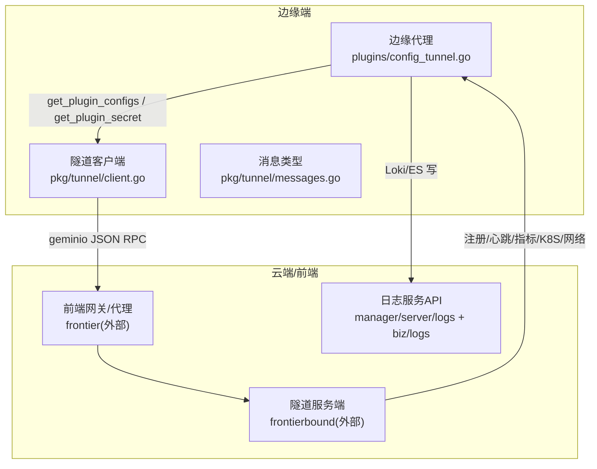
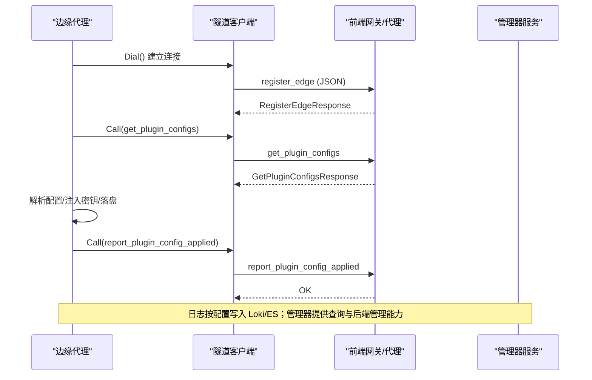
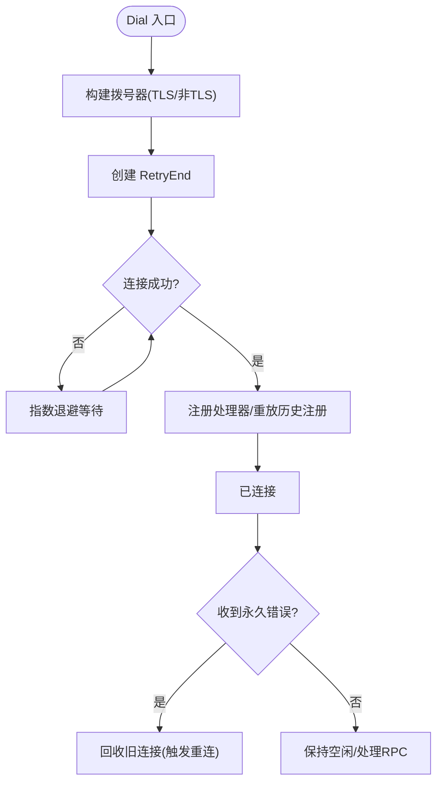
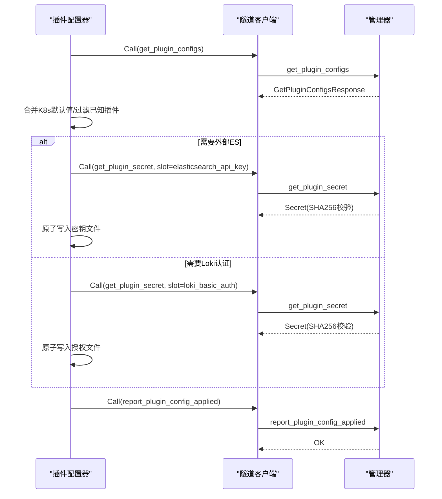
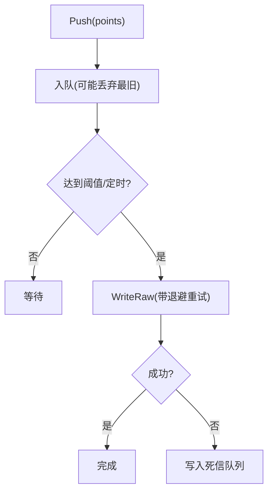
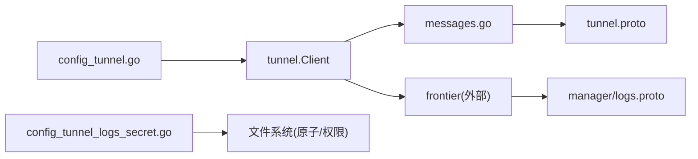

# 日志传输

<cite>
**本文引用的文件**
- [tunnel.proto](file://api/tunnel/v1/tunnel.proto)
- [logs.proto](file://api/manager/logs/v1/logs.proto)
- [client.go](file://internal/pkg/tunnel/client.go)
- [messages.go](file://internal/pkg/tunnel/messages.go)
- [types.go](file://internal/pkg/tunnel/types.go)
- [doc.go](file://internal/pkg/tunnel/doc.go)
- [config_tunnel.go](file://internal/edgeagent/plugins/config_tunnel.go)
- [config_tunnel_logs_secret.go](file://internal/edgeagent/plugins/config_tunnel_logs_secret.go)
- [ingester.go](file://internal/manager/biz/metric/ingester.go)
- [metrics_batch.go](file://internal/edgeagent/k8s/metrics_batch.go)
</cite>

## 目录
1. [简介](#简介)
2. [项目结构](#项目结构)
3. [核心组件](#核心组件)
4. [架构总览](#架构总览)
5. [详细组件分析](#详细组件分析)
6. [依赖关系分析](#依赖关系分析)
7. [性能与容量规划](#性能与容量规划)
8. [故障排查指南](#故障排查指南)
9. [结论](#结论)
10. [附录：协议与消息规范](#附录协议与消息规范)

## 简介
本文件面向 Ongrid 日志从边缘节点到云端管理器的传输机制，围绕基于 Tunnel 协议的实时数据传输、批量传输、断线重连、数据压缩与加密、带宽优化、队列与背压控制、故障恢复、协议与消息格式、错误处理策略以及监控诊断与容量规划进行系统化说明。文档以代码为依据，聚焦 edge → manager/frontier 的隧道通道、配置下发、密钥注入、日志后端选择与连接检查等关键环节。

## 项目结构
- 协议定义
  - 隧道协议（edge ↔ manager/frontier）：位于 api/tunnel/v1/tunnel.proto，定义了注册、心跳、指标推送、Kubernetes 资源描述/操作、网络发现等 RPC 方法及其消息体。
  - 管理器日志服务 API：位于 api/manager/logs/v1/logs.proto，提供日志搜索、字段查询、直方图、上下文、后端管理与连接检查等能力。
- 边缘侧隧道客户端
  - internal/pkg/tunnel：实现基于 geminio 的长连接、自动重拨、RPC 编解码、流式通道、回调与生命周期管理。
  - internal/edgeagent/plugins：插件配置拉取与落地，包含通过隧道获取 logs 插件配置、注入安全凭据、生成运行时文件并上报应用结果。
- 管理器侧接收与处理
  - internal/manager/biz/metric：指标批处理与写入（示例体现批量、退避、死信队列）。
  - internal/manager/server/logs：日志服务 HTTP 接口与后端管理逻辑（与 logs.proto 对应）。

图表来源
- [client.go:81-165](file://internal/pkg/tunnel/client.go#L81-L165)
- [messages.go:18-96](file://internal/pkg/tunnel/messages.go#L18-L96)
- [config_tunnel.go:100-186](file://internal/edgeagent/plugins/config_tunnel.go#L100-L186)
- [logs.proto:11-25](file://api/manager/logs/v1/logs.proto#L11-L25)

章节来源
- [doc.go:1-14](file://internal/pkg/tunnel/doc.go#L1-L14)
- [tunnel.proto:1-120](file://api/tunnel/v1/tunnel.proto#L1-L120)
- [logs.proto:1-120](file://api/manager/logs/v1/logs.proto#L1-L120)

## 核心组件
- 隧道客户端（Edge 侧）
  - 负责建立和维护与云端的长连接，支持指数退避重连、TLS CA 校验、连接代际切换、错误路由回收、回调通知（重连后重新注册）。
  - 提供 Call/AcceptStream/RegisterHandler/Dial/Close 等统一接口。
- 消息与协议
  - 使用 JSON 在 wire 上承载（MVP），方法名驱动分发；未来可切换到二进制 proto。
  - 关键方法包括 register_edge、heartbeat、push_host_metrics、get_plugin_configs、get_plugin_secret、report_plugin_config_applied、query_k8s_logs、describe_k8s_resource、execute_k8s_action 等。
- 插件配置与日志后端
  - 通过隧道拉取 logs 插件配置，结合环境默认值与 K8s 场景补全，必要时下载并原子化写入受管密钥文件（Elasticsearch API Key、Loki Basic Auth、CA、探针文件），并上报应用结果。
- 管理器日志服务
  - 暴露日志搜索、字段、直方图、上下文、后端选择/测试/连接检查等 REST/gRPC 风格接口，用于运维与查询。

章节来源
- [client.go:24-165](file://internal/pkg/tunnel/client.go#L24-L165)
- [messages.go:18-96](file://internal/pkg/tunnel/messages.go#L18-L96)
- [config_tunnel.go:100-186](file://internal/edgeagent/plugins/config_tunnel.go#L100-L186)
- [config_tunnel_logs_secret.go:27-88](file://internal/edgeagent/plugins/config_tunnel_logs_secret.go#L27-L88)
- [logs.proto:11-25](file://api/manager/logs/v1/logs.proto#L11-L25)

## 架构总览
Tunnel 是边缘到云端的“反向通道”，由边缘主动发起并保持长连接。管理器通过前端网关/代理（frontier）终止隧道，再转发至各业务服务（如日志服务）。日志采集插件根据下发的配置将日志推送到 Loki 或 Elasticsearch；同时通过隧道完成配置同步、密钥注入与状态上报。

图表来源
- [client.go:81-165](file://internal/pkg/tunnel/client.go#L81-L165)
- [messages.go:259-327](file://internal/pkg/tunnel/messages.go#L259-L327)
- [config_tunnel.go:100-186](file://internal/edgeagent/plugins/config_tunnel.go#L100-L186)
- [config_tunnel_logs_secret.go:200-232](file://internal/edgeagent/plugins/config_tunnel_logs_secret.go#L200-L232)

## 详细组件分析

### 隧道客户端与连接管理
- 连接建立与重连
  - Dial 使用指数退避（1s→2s→…上限60s）重试，成功后交由底层 RetryEnd 接管断线重连。
  - 支持 TLS CA 校验，最小版本 TLS1.2。
- 连接代际与路由回收
  - 维护 active/pending 连接与 generation，避免并发重连导致的竞态。
  - 对特定错误（如 Frontier 路由失效、ID 不匹配）触发回收旧连接，促使单一串行重连。
- 回调与重连后动作
  - OnReconnect 回调在连接恢复后执行，用于重新注册 edge 身份与处理器。
- 流式通道
  - AcceptStream 支持双向流（如 WebSSH 透传），Meta 携带目标信息。

图表来源
- [client.go:81-165](file://internal/pkg/tunnel/client.go#L81-L165)
- [client.go:272-361](file://internal/pkg/tunnel/client.go#L272-L361)

章节来源
- [client.go:24-165](file://internal/pkg/tunnel/client.go#L24-L165)
- [client.go:272-361](file://internal/pkg/tunnel/client.go#L272-L361)
- [types.go:68-105](file://internal/pkg/tunnel/types.go#L68-L105)

### 插件配置拉取与日志后端落地
- 配置拉取
  - 通过 MethodGetPluginConfigs 获取 logs 插件配置；失败时回退到环境变量默认配置，保证离线可用。
  - 针对 K8s 场景自动注入 cluster_id、node_name、pod_log_path 等默认项，并关闭不必要的 k8sattributes。
- 密钥注入与原子化落盘
  - 根据 backend 类型（external_elasticsearch 或 Loki）分别拉取并校验 secret，写入受管目录（权限严格、防符号链接、原子替换）。
  - 支持探针文件（log_probe_file）用于连接性验证。
- 应用结果上报
  - 仅当存在 Manager 下发的 probe id 时才上报 report_plugin_config_applied，减少控制面噪音。
  - 错误分类为可观测标签（如 collector_binary_missing、collector_not_ready 等）。

图表来源
- [config_tunnel.go:100-186](file://internal/edgeagent/plugins/config_tunnel.go#L100-L186)
- [config_tunnel_logs_secret.go:27-88](file://internal/edgeagent/plugins/config_tunnel_logs_secret.go#L27-L88)
- [config_tunnel_logs_secret.go:151-198](file://internal/edgeagent/plugins/config_tunnel_logs_secret.go#L151-L198)
- [config_tunnel_logs_secret.go:200-232](file://internal/edgeagent/plugins/config_tunnel_logs_secret.go#L200-L232)

章节来源
- [config_tunnel.go:100-186](file://internal/edgeagent/plugins/config_tunnel.go#L100-L186)
- [config_tunnel_logs_secret.go:27-88](file://internal/edgeagent/plugins/config_tunnel_logs_secret.go#L27-L88)
- [config_tunnel_logs_secret.go:151-198](file://internal/edgeagent/plugins/config_tunnel_logs_secret.go#L151-L198)
- [config_tunnel_logs_secret.go:200-232](file://internal/edgeagent/plugins/config_tunnel_logs_secret.go#L200-L232)

### 批量与实时传输、背压与死信
- 主机指标批量推送
  - 边缘侧以批次方式 push_host_metrics，服务端 Ingester 采用缓冲队列+定时/阈值 flush。
  - 背压：缓冲区满时丢弃最旧点并计数；flush 失败按退避重试，最终进入死信队列。
- Prometheus 样本批处理
  - 边缘侧 metricsBatcher 按样本数与编码字节数切分批次，超限则 Flush 发送；统计成功/失败/拒绝样本。

图表来源
- [ingester.go:163-261](file://internal/manager/biz/metric/ingester.go#L163-L261)
- [metrics_batch.go:29-119](file://internal/edgeagent/k8s/metrics_batch.go#L29-L119)

章节来源
- [ingester.go:163-261](file://internal/manager/biz/metric/ingester.go#L163-L261)
- [metrics_batch.go:29-119](file://internal/edgeagent/k8s/metrics_batch.go#L29-L119)

### 日志查询与管理接口
- 管理器日志服务提供 SearchLogs、GetLogFields、GetLogHistogram、GetLogContext、后端选择/测试/连接检查等接口，便于运维检索与排障。
- 连接检查可聚合各边缘在线/验证/失败/离线状态，辅助定位问题。

章节来源
- [logs.proto:11-25](file://api/manager/logs/v1/logs.proto#L11-L25)
- [logs.proto:189-337](file://api/manager/logs/v1/logs.proto#L189-L337)

## 依赖关系分析
- 边缘侧
  - plugins/config_tunnel.go 依赖 tunnel.Client 调用 get_plugin_configs/get_plugin_secret/report_plugin_config_applied。
  - config_tunnel_logs_secret.go 依赖文件系统原子写入与安全校验。
- 云端侧
  - frontier 终止隧道，manager 暴露日志服务 API。
- 协议层
  - messages.go 与 tunnel.proto 保持一致的字段命名约定（json_name），确保跨语言兼容。

图表来源
- [config_tunnel.go:100-186](file://internal/edgeagent/plugins/config_tunnel.go#L100-L186)
- [config_tunnel_logs_secret.go:27-88](file://internal/edgeagent/plugins/config_tunnel_logs_secret.go#L27-L88)
- [messages.go:18-96](file://internal/pkg/tunnel/messages.go#L18-L96)
- [tunnel.proto:1-120](file://api/tunnel/v1/tunnel.proto#L1-L120)
- [logs.proto:11-25](file://api/manager/logs/v1/logs.proto#L11-L25)

章节来源
- [config_tunnel.go:100-186](file://internal/edgeagent/plugins/config_tunnel.go#L100-L186)
- [config_tunnel_logs_secret.go:27-88](file://internal/edgeagent/plugins/config_tunnel_logs_secret.go#L27-L88)
- [messages.go:18-96](file://internal/pkg/tunnel/messages.go#L18-L96)
- [tunnel.proto:1-120](file://api/tunnel/v1/tunnel.proto#L1-L120)
- [logs.proto:11-25](file://api/manager/logs/v1/logs.proto#L11-L25)

## 性能与容量规划
- 传输模式
  - 实时：register_edge、heartbeat、get_plugin_configs、get_plugin_secret、report_plugin_config_applied 等短请求低延迟交互。
  - 批量：push_host_metrics、Prometheus 样本批处理，降低协议开销。
- 压缩与加密
  - 传输加密：支持 TLS（最小 TLS1.2），可通过 CA 文件校验服务器证书。
  - 压缩：当前 MVP 使用 JSON 明文；若需压缩可在上层（如 gRPC/TLS 层或后续二进制 proto）启用，当前代码未内置 payload 级压缩。
- 带宽优化
  - 批量化与去重：服务端接受条数反馈，避免重复。
  - 限制单次大小：边缘侧 metricsBatcher 按样本数与编码字节数限制批次大小，防止拥塞。
- 队列与背压
  - 服务端 Ingester 使用有界缓冲，满则丢弃最旧点并计数；flush 失败重试后进入死信队列。
- 容量规划建议
  - 依据峰值样本量与平均包大小估算吞吐，调整 batch size、flush interval 与缓冲容量。
  - 关注 dropped 与 dead-letter 指标，评估是否需要扩容或调优。

章节来源
- [client.go:167-206](file://internal/pkg/tunnel/client.go#L167-L206)
- [metrics_batch.go:29-119](file://internal/edgeagent/k8s/metrics_batch.go#L29-L119)
- [ingester.go:163-261](file://internal/manager/biz/metric/ingester.go#L163-L261)

## 故障排查指南
- 连接问题
  - 现象：反复 dial 失败或频繁重连。
  - 排查：检查 ServerAddr/CloudAddr、TLS CA 配置、网络可达性与证书有效性；关注指数退避日志。
- 路由/身份问题
  - 现象：报 “no such rpc”、“mismatch clientID”、“edge binding not ready; re-register required”。
  - 处理：客户端会回收旧连接并重连；确认 register_edge 成功且 heartbeat 正常。
- 配置/密钥问题
  - 现象：日志插件无法启动或连接后端失败。
  - 排查：确认 get_plugin_configs 返回有效配置；检查 get_plugin_secret 返回内容与 SHA256 一致；查看受管目录下密钥文件是否原子写入成功；核对权限与路径。
- 写入失败与丢数据
  - 现象：指标/日志写入失败或出现死信。
  - 排查：观察 Ingester 的 write 成功/失败计数、batch size、dropped 计数；检查后端健康与磁盘空间；定位死信原因。
- 日志查询与后端状态
  - 使用日志服务的后端选择/测试/连接检查接口，确认所选后端连通性与版本检测。

章节来源
- [client.go:81-165](file://internal/pkg/tunnel/client.go#L81-L165)
- [client.go:322-361](file://internal/pkg/tunnel/client.go#L322-L361)
- [config_tunnel_logs_secret.go:151-198](file://internal/edgeagent/plugins/config_tunnel_logs_secret.go#L151-L198)
- [config_tunnel_logs_secret.go:200-232](file://internal/edgeagent/plugins/config_tunnel_logs_secret.go#L200-L232)
- [ingester.go:200-261](file://internal/manager/biz/metric/ingester.go#L200-L261)
- [logs.proto:189-337](file://api/manager/logs/v1/logs.proto#L189-L337)

## 结论
Ongrid 的日志传输以 Tunnel 为核心通道，结合插件配置拉取与密钥注入，实现了边缘到云端的可靠、可控的数据通路。通过批量与实时混合模式、严格的连接管理与错误回收、以及背压与死信机制，系统在弱网与高负载下仍具备良好鲁棒性。配合管理器日志服务，可实现端到端的可观测与排障。后续可在二进制 proto 与压缩方面进一步优化吞吐与带宽占用。

## 附录：协议与消息规范
- 隧道方法（节选）
  - register_edge：首次注册/重连，携带主机信息与 agent 版本。
  - heartbeat：周期性心跳，附带可选状态位与插件健康。
  - push_host_metrics：批量上报主机指标点。
  - get_plugin_configs：拉取插件配置快照。
  - get_plugin_secret：按固定槽位拉取受管密钥，含内容哈希校验。
  - report_plugin_config_applied：上报配置应用结果（仅探针场景）。
  - query_k8s_logs/describe_k8s_resource/execute_k8s_action：Kubernetes 资源只读查询与受限写操作。
- 日志服务 API（节选）
  - SearchLogs/GetLogFields/GetLogHistogram/GetLogContext：日志检索与元数据查询。
  - SelectLogBackend/TestLogBackend/StartLogBackendConnectionCheck：后端选择与健康检查。

章节来源
- [tunnel.proto:73-120](file://api/tunnel/v1/tunnel.proto#L73-L120)
- [tunnel.proto:197-440](file://api/tunnel/v1/tunnel.proto#L197-L440)
- [tunnel.proto:442-524](file://api/tunnel/v1/tunnel.proto#L442-L524)
- [logs.proto:11-25](file://api/manager/logs/v1/logs.proto#L11-L25)
- [logs.proto:189-337](file://api/manager/logs/v1/logs.proto#L189-L337)