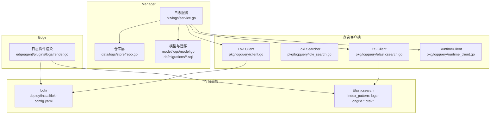
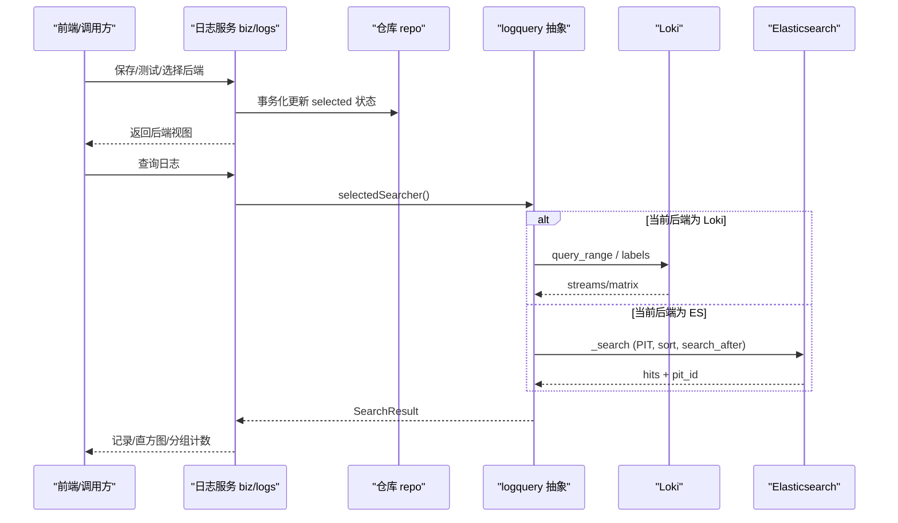
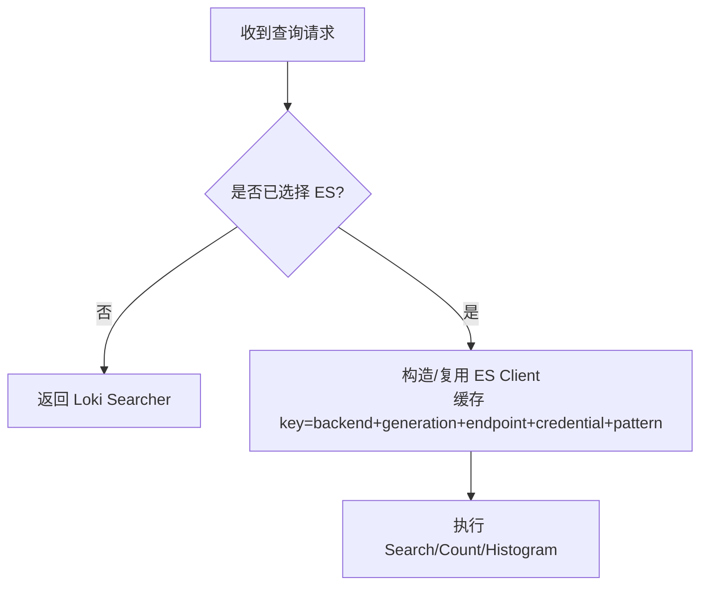
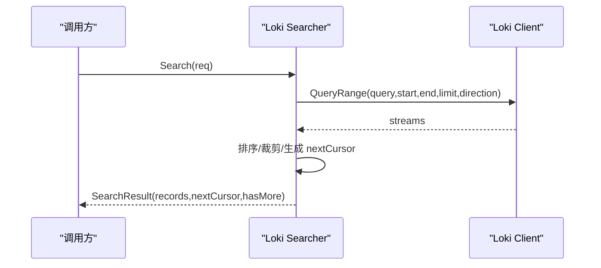
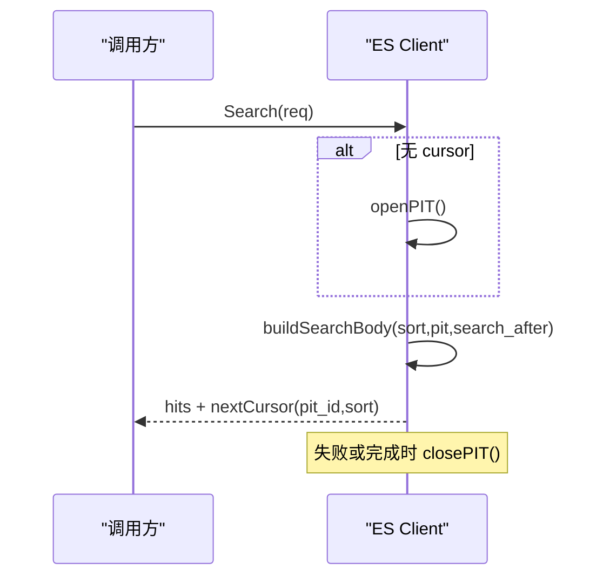
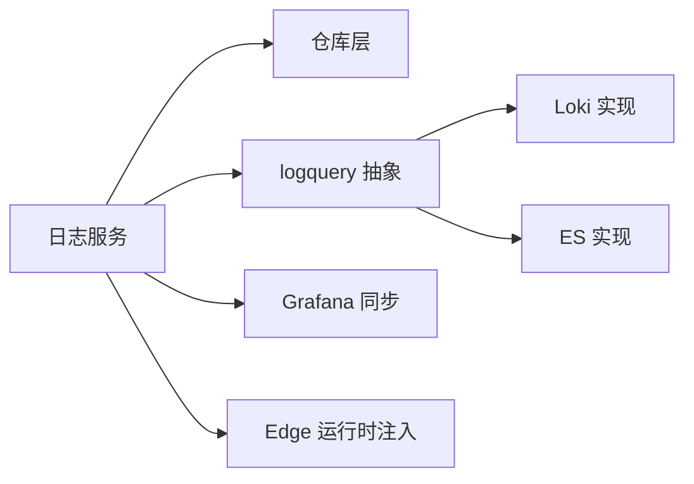

# 日志存储

<cite>
**本文引用的文件**
- [internal/pkg/logquery/client.go](file://internal/pkg/logquery/client.go)
- [internal/pkg/logquery/loki_search.go](file://internal/pkg/logquery/loki_search.go)
- [internal/pkg/logquery/elasticsearch.go](file://internal/pkg/logquery/elasticsearch.go)
- [internal/pkg/logquery/runtime_client.go](file://internal/pkg/logquery/runtime_client.go)
- [internal/manager/biz/logs/service.go](file://internal/manager/biz/logs/service.go)
- [internal/manager/data/logs/store/repo.go](file://internal/manager/data/logs/store/repo.go)
- [internal/manager/model/logs/model.go](file://internal/manager/model/logs/model.go)
- [db/migrations/20260818160000_create_log_backends.up.sql](file://db/migrations/20260818160000_create_log_backends.up.sql)
- [deploy/install/loki-config.yaml](file://deploy/install/loki-config.yaml)
- [internal/edgeagent/plugins/logs/render.go](file://internal/edgeagent/plugins/logs/render.go)
- [web/src/api/logs.ts](file://web/src/api/logs.ts)
- [docs/rfc/RFC-003-otel-elasticsearch-logs.md](file://docs/rfc/RFC-003-otel-elasticsearch-logs.md)
</cite>

## 目录
1. [简介](#简介)
2. [项目结构](#项目结构)
3. [核心组件](#核心组件)
4. [架构总览](#架构总览)
5. [详细组件分析](#详细组件分析)
6. [依赖关系分析](#依赖关系分析)
7. [性能与容量规划](#性能与容量规划)
8. [监控、故障排查与扩展性](#监控故障排查与扩展性)
9. [结论](#结论)
10. [附录](#附录)

## 简介
本文件系统性阐述 Ongrid 的日志存储方案：以 Loki 为内置默认后端，同时支持外部 Elasticsearch 作为可选后端。系统采用“只选一个当前后端”的产品模型，Edge 侧采集写入所选后端，Manager 侧查询路由到当前后端；历史数据不联邦查询，切换后旧数据留在原后端由外部工具访问。文档覆盖索引策略、分片机制、生命周期管理、存储优化（压缩、冷热分离、归档）、多租户隔离、权限控制与审计追踪、容量规划、性能调优、备份恢复、监控指标、故障排查与扩展性指导。

## 项目结构
- Manager 控制面负责后端配置、选择、连接探测、Grafana 数据源同步、Edge 运行时注入等。
- Edge 插件根据 Manager 下发的运行时配置将 OTel 日志写入 Loki 或 Elasticsearch Data Stream。
- logquery 包提供后端无关的搜索接口，分别实现 Loki 与 Elasticsearch 的具体查询逻辑。
- 数据库持久化仅保存后端元数据与分配状态，不存储日志负载。

图表来源
- [internal/manager/biz/logs/service.go:230-265](file://internal/manager/biz/logs/service.go#L230-L265)
- [internal/manager/data/logs/store/repo.go:15-141](file://internal/manager/data/logs/store/repo.go#L15-L141)
- [internal/manager/model/logs/model.go:24-81](file://internal/manager/model/logs/model.go#L24-L81)
- [db/migrations/20260818160000_create_log_backends.up.sql:1-51](file://db/migrations/20260818160000_create_log_backends.up.sql#L1-L51)
- [internal/edgeagent/plugins/logs/render.go:449-481](file://internal/edgeagent/plugins/logs/render.go#L449-L481)
- [internal/pkg/logquery/client.go:53-99](file://internal/pkg/logquery/client.go#L53-L99)
- [internal/pkg/logquery/loki_search.go:30-118](file://internal/pkg/logquery/loki_search.go#L30-L118)
- [internal/pkg/logquery/elasticsearch.go:40-86](file://internal/pkg/logquery/elasticsearch.go#L40-L86)
- [internal/pkg/logquery/runtime_client.go:16-51](file://internal/pkg/logquery/runtime_client.go#L16-L51)
- [deploy/install/loki-config.yaml:1-76](file://deploy/install/loki-config.yaml#L1-L76)

章节来源
- [internal/manager/biz/logs/service.go:230-265](file://internal/manager/biz/logs/service.go#L230-L265)
- [internal/manager/data/logs/store/repo.go:15-141](file://internal/manager/data/logs/store/repo.go#L15-L141)
- [internal/manager/model/logs/model.go:24-81](file://internal/manager/model/logs/model.go#L24-L81)
- [db/migrations/20260818160000_create_log_backends.up.sql:1-51](file://db/migrations/20260818160000_create_log_backends.up.sql#L1-L51)
- [internal/edgeagent/plugins/logs/render.go:449-481](file://internal/edgeagent/plugins/logs/render.go#L449-L481)
- [internal/pkg/logquery/client.go:53-99](file://internal/pkg/logquery/client.go#L53-L99)
- [internal/pkg/logquery/loki_search.go:30-118](file://internal/pkg/logquery/loki_search.go#L30-L118)
- [internal/pkg/logquery/elasticsearch.go:40-86](file://internal/pkg/logquery/elasticsearch.go#L40-L86)
- [internal/pkg/logquery/runtime_client.go:16-51](file://internal/pkg/logquery/runtime_client.go#L16-L51)
- [deploy/install/loki-config.yaml:1-76](file://deploy/install/loki-config.yaml#L1-L76)

## 核心组件
- 日志服务（Manager）：负责后端配置保存、测试、选择、连接检查、Grafana 数据源同步、Edge 运行时注入。
- 仓库层（Repo）：持久化后端配置与 Edge 分配状态，支持事务化选择与回滚。
- 模型与迁移：定义 Backend 与 Assignment 表结构及软删除标记。
- 查询客户端：
  - Loki Client：封装 /query_range、labels、label values 调用，单租户 X-Scope-OrgID。
  - Loki Searcher：实现分页 cursor、聚合 count/histogram、字段值扫描。
  - Elasticsearch Client：基于固定 index pattern 的安全查询，PIT 游标、composite 聚合、版本与权限校验。
  - RuntimeClient：动态解析 Loki 端点、Basic Auth、TLS，缓存 HTTP 客户端。
- Edge 插件：根据后端类型注入 data stream 路由（dataset/namespace），批量发送日志。

章节来源
- [internal/manager/biz/logs/service.go:303-507](file://internal/manager/biz/logs/service.go#L303-L507)
- [internal/manager/data/logs/store/repo.go:19-141](file://internal/manager/data/logs/store/repo.go#L19-L141)
- [internal/manager/model/logs/model.go:24-81](file://internal/manager/model/logs/model.go#L24-L81)
- [internal/pkg/logquery/client.go:120-171](file://internal/pkg/logquery/client.go#L120-L171)
- [internal/pkg/logquery/loki_search.go:30-118](file://internal/pkg/logquery/loki_search.go#L30-L118)
- [internal/pkg/logquery/elasticsearch.go:88-188](file://internal/pkg/logquery/elasticsearch.go#L88-L188)
- [internal/pkg/logquery/runtime_client.go:53-83](file://internal/pkg/logquery/runtime_client.go#L53-L83)
- [internal/edgeagent/plugins/logs/render.go:449-481](file://internal/edgeagent/plugins/logs/render.go#L449-L481)

## 架构总览
Ongrid 采用“单一当前后端”的读写路径：
- 写路径：Edge 插件根据 Manager 下发的运行时配置，将 OTel 日志写入当前后端（Loki 或 Elasticsearch）。
- 读路径：Manager 通过 logquery 抽象层选择当前后端进行查询；若未选择外部 ES，则使用内置 Loki 查询路径。
- 后端选择：Manager 支持保存多个 ES 配置，但仅有一个处于 selected 状态；也可显式切换到内置 Loki。
- 数据隔离：Loki 通过 X-Scope-OrgID 单租户；ES 通过 dataset/namespace/index_pattern 隔离。

图表来源
- [internal/manager/biz/logs/service.go:233-268](file://internal/manager/biz/logs/service.go#L233-L268)
- [internal/pkg/logquery/loki_search.go:30-118](file://internal/pkg/logquery/loki_search.go#L30-L118)
- [internal/pkg/logquery/elasticsearch.go:88-188](file://internal/pkg/logquery/elasticsearch.go#L88-L188)
- [internal/manager/data/logs/store/repo.go:61-106](file://internal/manager/data/logs/store/repo.go#L61-L106)

章节来源
- [internal/manager/biz/logs/service.go:233-268](file://internal/manager/biz/logs/service.go#L233-L268)
- [internal/pkg/logquery/loki_search.go:30-118](file://internal/pkg/logquery/loki_search.go#L30-L118)
- [internal/pkg/logquery/elasticsearch.go:88-188](file://internal/pkg/logquery/elasticsearch.go#L88-L188)
- [internal/manager/data/logs/store/repo.go:61-106](file://internal/manager/data/logs/store/repo.go#L61-L106)

## 详细组件分析

### 后端选择与路由
- 选择 ES：事务化将其他后端置为 unselected，设置 selected 并记录检测版本与测试时间，清理设备分配。
- 选择内置 Loki：将所有 ES 配置取消选中，通知 Edge 重新下发内置 Loki 探针。
- 查询路由：selectedSearcher 优先返回 ES 客户端（带 API Key、Index Pattern 缓存），否则回退到 Loki。

图表来源
- [internal/manager/biz/logs/service.go:233-268](file://internal/manager/biz/logs/service.go#L233-L268)
- [internal/manager/data/logs/store/repo.go:61-106](file://internal/manager/data/logs/store/repo.go#L61-L106)

章节来源
- [internal/manager/biz/logs/service.go:233-268](file://internal/manager/biz/logs/service.go#L233-L268)
- [internal/manager/data/logs/store/repo.go:61-106](file://internal/manager/data/logs/store/repo.go#L61-L106)

### Loki 查询实现
- QueryRange：构建 LogQL，限制 limit，方向默认 backward，强制单租户 X-Scope-OrgID。
- Cursor 分页：基于 last timestamp 与 skip 数量编码游标，处理边界重叠避免重复/遗漏。
- Count/Grouped：使用 instant query 与 sum by 标签维度，限制分组上限。
- FieldValues：对可索引标签走 label values；否则扫描结果集去重，限制扫描条数。
- Histogram：按区间对齐计算，处理 epoch 对齐偏移，合并尾部部分桶。

图表来源
- [internal/pkg/logquery/loki_search.go:30-118](file://internal/pkg/logquery/loki_search.go#L30-L118)
- [internal/pkg/logquery/client.go:120-171](file://internal/pkg/logquery/client.go#L120-L171)

章节来源
- [internal/pkg/logquery/loki_search.go:30-118](file://internal/pkg/logquery/loki_search.go#L30-L118)
- [internal/pkg/logquery/client.go:120-171](file://internal/pkg/logquery/client.go#L120-L171)

### Elasticsearch 查询实现
- 安全约束：固定 index pattern，拒绝不安全 endpoint/凭据/通配符。
- PIT 游标：首次打开 PIT，后续 search_after 维持一致性；失败或完成主动关闭 PIT。
- Count/Grouped：count API 与 composite aggregation 分页遍历，限制分组上限。
- FieldValues：terms 聚合获取字段值。
- Histogram：date_histogram 固定间隔，设置 extended/hard bounds 与 offset。

图表来源
- [internal/pkg/logquery/elasticsearch.go:88-188](file://internal/pkg/logquery/elasticsearch.go#L88-L188)
- [internal/pkg/logquery/elasticsearch.go:522-551](file://internal/pkg/logquery/elasticsearch.go#L522-L551)

章节来源
- [internal/pkg/logquery/elasticsearch.go:88-188](file://internal/pkg/logquery/elasticsearch.go#L88-L188)
- [internal/pkg/logquery/elasticsearch.go:522-551](file://internal/pkg/logquery/elasticsearch.go#L522-L551)

### 运行时 Loki 客户端
- 动态解析：每次调用前解析 Loki Endpoint、Basic Auth、TLS 设置，变更无需重启。
- 客户端缓存：相同 endpoint 复用 http.Client，减少握手开销。
- 安全：最小 TLS 版本，可选跳过验证（仅测试环境）。

章节来源
- [internal/pkg/logquery/runtime_client.go:16-83](file://internal/pkg/logquery/runtime_client.go#L16-L83)

### Edge 写入与数据流路由
- 当后端为 ES 时，插件注入 data_stream.type=logs、dataset、namespace，确保写入正确的数据流。
- 批量参数：send_batch_size、send_batch_max_size、timeout 控制吞吐与延迟。
- 安全校验：拒绝 inline API key、plain HTTP、含凭据的 endpoint、相对路径 secret、不安全 dataset/namespace。

章节来源
- [internal/edgeagent/plugins/logs/render.go:449-481](file://internal/edgeagent/plugins/logs/render.go#L449-L481)

### 控制面数据模型与迁移
- Backend：名称、类型、状态、版本 generation、写/读端点、数据集/命名空间、索引模式、凭据引用、CA、Kibana URL、TLS、检测版本、测试时间。
- Assignment：每个 Edge 的后端分配状态、期望/应用 generation、探针 ID、最近成功写入时间、错误信息。
- 迁移：创建两张表，包含唯一键与索引，支持软删除标记回填。

章节来源
- [internal/manager/model/logs/model.go:24-81](file://internal/manager/model/logs/model.go#L24-L81)
- [db/migrations/20260818160000_create_log_backends.up.sql:1-51](file://db/migrations/20260818160000_create_log_backends.up.sql#L1-L51)

## 依赖关系分析
- Manager 日志服务依赖仓库层进行后端配置与分配的状态管理。
- 查询层通过 logquery 抽象屏蔽后端差异，Loki 与 ES 各自实现 Searcher。
- Edge 插件依赖 Manager 下发的运行时配置，决定写入目标与路由字段。
- Grafana 数据源同步：选择 ES 时同步 ES 数据源，选择 Loki 时同步 Loki 数据源。

图表来源
- [internal/manager/biz/logs/service.go:230-265](file://internal/manager/biz/logs/service.go#L230-L265)
- [internal/manager/data/logs/store/repo.go:15-141](file://internal/manager/data/logs/store/repo.go#L15-L141)
- [internal/pkg/logquery/client.go:53-99](file://internal/pkg/logquery/client.go#L53-L99)
- [internal/pkg/logquery/loki_search.go:30-118](file://internal/pkg/logquery/loki_search.go#L30-L118)
- [internal/pkg/logquery/elasticsearch.go:40-86](file://internal/pkg/logquery/elasticsearch.go#L40-L86)

章节来源
- [internal/manager/biz/logs/service.go:230-265](file://internal/manager/biz/logs/service.go#L230-L265)
- [internal/manager/data/logs/store/repo.go:15-141](file://internal/manager/data/logs/store/repo.go#L15-L141)
- [internal/pkg/logquery/client.go:53-99](file://internal/pkg/logquery/client.go#L53-L99)
- [internal/pkg/logquery/loki_search.go:30-118](file://internal/pkg/logquery/loki_search.go#L30-L118)
- [internal/pkg/logquery/elasticsearch.go:40-86](file://internal/pkg/logquery/elasticsearch.go#L40-L86)

## 性能与容量规划

### 索引策略与分片机制
- Loki：
  - 使用 TSDB v13 schema，index 前缀 index_，周期 24h。
  - 结构化元数据与索引标签：device_id、cluster_id、ongrid_source、namespace、service.name 等。
  - 限制：最大全局流数、查询系列数、回溯窗口。
- Elasticsearch：
  - 固定 index pattern：logs-ongrid.*.otel-*，通过 dataset/namespace 路由。
  - 查询使用 @timestamp 排序与 shard_doc 稳定顺序，PIT 保证一致性。
  - 聚合使用 composite 分页，避免高基数截断。

章节来源
- [deploy/install/loki-config.yaml:21-59](file://deploy/install/loki-config.yaml#L21-L59)
- [internal/pkg/logquery/elasticsearch.go:19-31](file://internal/pkg/logquery/elasticsearch.go#L19-L31)
- [internal/pkg/logquery/elasticsearch.go:553-591](file://internal/pkg/logquery/elasticsearch.go#L553-L591)

### 数据生命周期管理
- Loki：
  - retention_period 设置为 720h（约 30 天），compactor 启用删除请求存储。
  - reject_old_samples 与 max_age 防止过期样本写入。
- Elasticsearch：
  - 产品层不直接管理 ES 生命周期，建议结合 ES ILM 策略按 dataset/namespace 设置保留期。
  - 查询层限制响应大小与内存预算，避免 OOM。

章节来源
- [deploy/install/loki-config.yaml:52-64](file://deploy/install/loki-config.yaml#L52-L64)
- [internal/pkg/logquery/elasticsearch.go:23-31](file://internal/pkg/logquery/elasticsearch.go#L23-L31)

### 存储优化技术
- 压缩：Loki 使用 TSDB 压缩存储；ES 默认压缩，可通过索引模板调整。
- 冷热分离：ES 建议通过 ILM 将热数据置于高性能节点，冷数据转至低成本存储；Loki 通过 compactor 与对象存储（filesystem）配合。
- 归档策略：产品不查询旧后端历史数据，建议通过外部工具按需访问；Manager 选择 ES 前需迁移告警规则为后端中性查询。

章节来源
- [docs/rfc/RFC-003-otel-elasticsearch-logs.md:83-119](file://docs/rfc/RFC-003-otel-elasticsearch-logs.md#L83-L119)
- [deploy/install/loki-config.yaml:61-64](file://deploy/install/loki-config.yaml#L61-L64)

### 多租户数据隔离
- Loki：X-Scope-OrgID 固定为 ongrid，单租户部署无需额外配置。
- ES：通过 dataset/namespace/index_pattern 隔离，严格校验输入，禁止不安全模式。

章节来源
- [internal/pkg/logquery/client.go:245-250](file://internal/pkg/logquery/client.go#L245-L250)
- [internal/edgeagent/plugins/logs/render.go:449-481](file://internal/edgeagent/plugins/logs/render.go#L449-L481)
- [internal/pkg/logquery/elasticsearch.go:58-86](file://internal/pkg/logquery/elasticsearch.go#L58-L86)

### 权限控制与审计追踪
- ES 权限：RequirePrivileges 校验 API Key 对集群与索引的权限；写/读密钥必须不同。
- 审计：Assignment 表记录探针 ID、最近探针时间、最近成功写入时间、错误信息，便于追踪。
- 前端：日志后端视图包含 current_backend、status、generation、last_test_at 等字段，便于操作审计。

章节来源
- [internal/pkg/logquery/elasticsearch.go:470-520](file://internal/pkg/logquery/elasticsearch.go#L470-L520)
- [internal/manager/model/logs/model.go:61-81](file://internal/manager/model/logs/model.go#L61-L81)
- [web/src/api/logs.ts:112-160](file://web/src/api/logs.ts#L112-L160)

### 容量规划
- Loki：
  - ingestion_rate_mb 与 burst 限制保护后端；max_query_series 与 lookback 限制查询资源。
  - 建议根据日志量级评估磁盘与 CPU，合理设置 retention。
- ES：
  - 限制响应字节与每 hit 信封大小，避免大查询导致内存压力。
  - 建议按 dataset/namespace 规划分片与副本，平衡查询与写入吞吐。

章节来源
- [deploy/install/loki-config.yaml:52-59](file://deploy/install/loki-config.yaml#L52-L59)
- [internal/pkg/logquery/elasticsearch.go:23-31](file://internal/pkg/logquery/elasticsearch.go#L23-L31)

### 备份恢复
- Loki：文件系统后端 chunks/rules 目录需定期快照；compactor 删除请求存储也需纳入备份。
- ES：建议基于快照与恢复（Snapshot & Restore）策略，按 index pattern 或 data stream 粒度备份。
- 控制面：Manager 数据库（Backend/Assignment）需独立备份，确保后端选择与分配状态可恢复。

[本节为通用指导，不直接分析具体文件]

## 监控、故障排查与扩展性

### 监控指标
- Loki：
  - 关注 ingestion rate、retention、compactor 状态、查询系列数与超时。
- ES：
  - 关注 PIT 生命周期、search_after 进度、composite 聚合分页、响应大小与耗时。
- Manager：
  - 关注后端选择状态、连接检查统计（online/verified/pending/failed/offline）、Grafana 同步结果。

章节来源
- [deploy/install/loki-config.yaml:52-64](file://deploy/install/loki-config.yaml#L52-L64)
- [internal/manager/biz/logs/service.go:509-703](file://internal/manager/biz/logs/service.go#L509-L703)
- [internal/pkg/logquery/elasticsearch.go:88-188](file://internal/pkg/logquery/elasticsearch.go#L88-L188)

### 故障排查
- 查询失败：
  - Loki：检查 query_range 返回 status 与 error，确认 start/end 与 limit 合理性。
  - ES：检查 PIT 是否成功关闭，search_after 是否前进，composite after_key 是否循环。
- 连接检查：
  - 查看 Assignment 状态与 last_error，确认 Edge 在线与探针生效。
- 权限问题：
  - ES RequirePrivileges 返回缺失权限列表，修正 API Key 权限。

章节来源
- [internal/pkg/logquery/client.go:232-271](file://internal/pkg/logquery/client.go#L232-L271)
- [internal/pkg/logquery/elasticsearch.go:522-551](file://internal/pkg/logquery/elasticsearch.go#L522-L551)
- [internal/manager/data/logs/store/repo.go:108-141](file://internal/manager/data/logs/store/repo.go#L108-L141)
- [internal/pkg/logquery/elasticsearch.go:470-520](file://internal/pkg/logquery/elasticsearch.go#L470-L520)

### 扩展性设计
- 后端无关：logquery 抽象使未来替换 Loki 为其他兼容后端（如 VictoriaLogs）无需改动导入路径。
- 运行时配置：RuntimeClient 支持动态端点与认证变更，无需重启。
- 只选一个后端：简化查询语义与性能可控，历史数据由外部工具访问，降低复杂度。

章节来源
- [internal/pkg/logquery/client.go:1-13](file://internal/pkg/logquery/client.go#L1-L13)
- [internal/pkg/logquery/runtime_client.go:16-51](file://internal/pkg/logquery/runtime_client.go#L16-L51)
- [docs/rfc/RFC-003-otel-elasticsearch-logs.md:83-119](file://docs/rfc/RFC-003-otel-elasticsearch-logs.md#L83-L119)

## 结论
Ongrid 的日志存储采用“单一当前后端”的设计，兼顾简单性与性能可控性。Loki 作为内置默认后端提供开箱即用的能力，Elasticsearch 作为可选后端满足企业级需求。通过严格的索引策略、分片机制、生命周期管理与权限控制，系统在多租户隔离、容量规划、性能调优与扩展性方面具备良好基础。建议在 ES 侧结合 ILM 实现冷热分离与归档，在 Loki 侧合理设置 retention 与 compactor，并通过监控与故障排查保障稳定性。

[本节为总结，不直接分析具体文件]

## 附录

### API 与前端集成要点
- 前端日志后端视图包含 current_backend、current_backend_id、status、generation、write/query endpoints、dataset、namespace、index_pattern、credentials、kibana_url、tls_insecure、detected_version、last_test_at 等字段。
- 常用 API：获取后端、保存后端、直方图查询等。

章节来源
- [web/src/api/logs.ts:108-160](file://web/src/api/logs.ts#L108-L160)