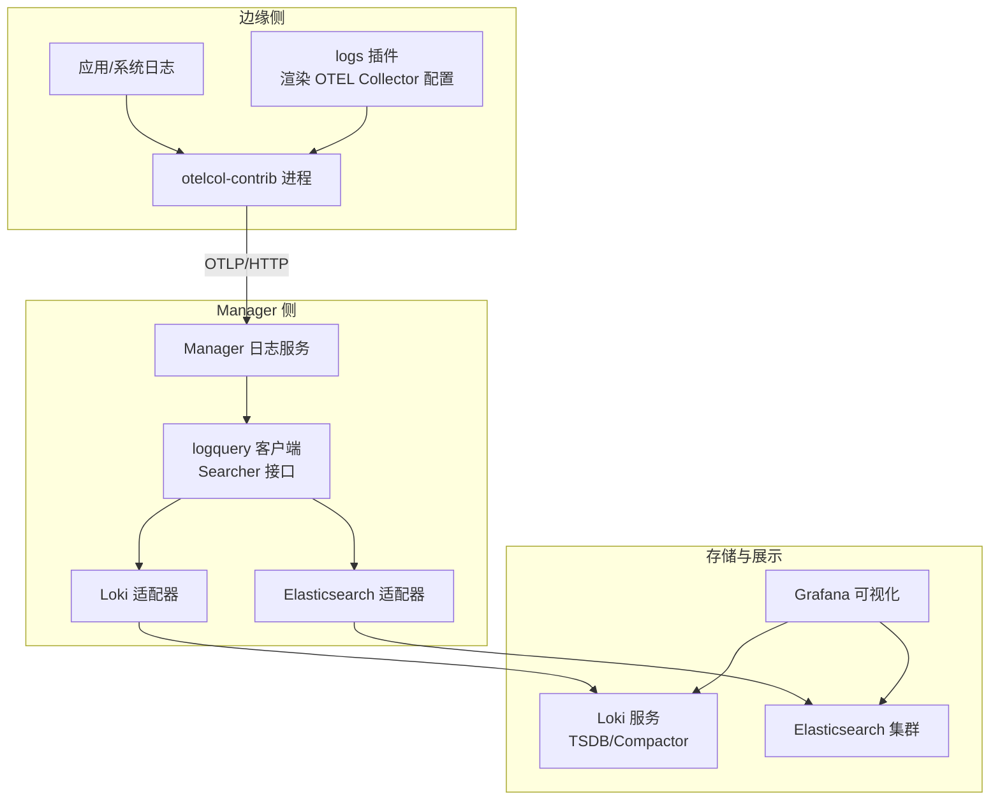
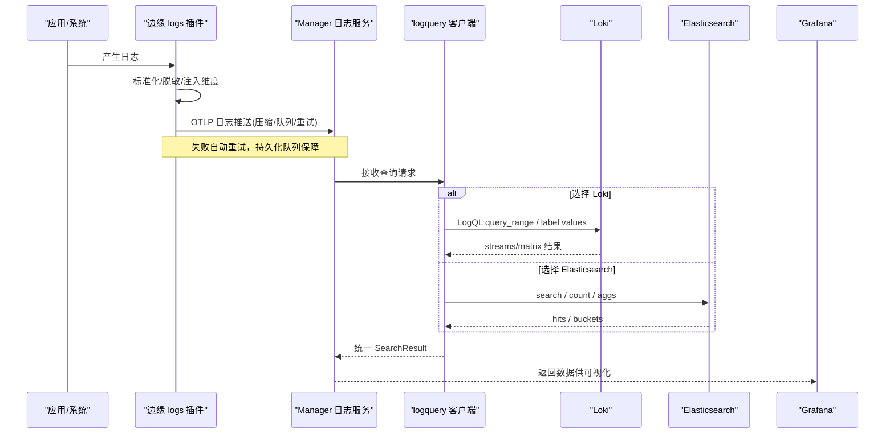
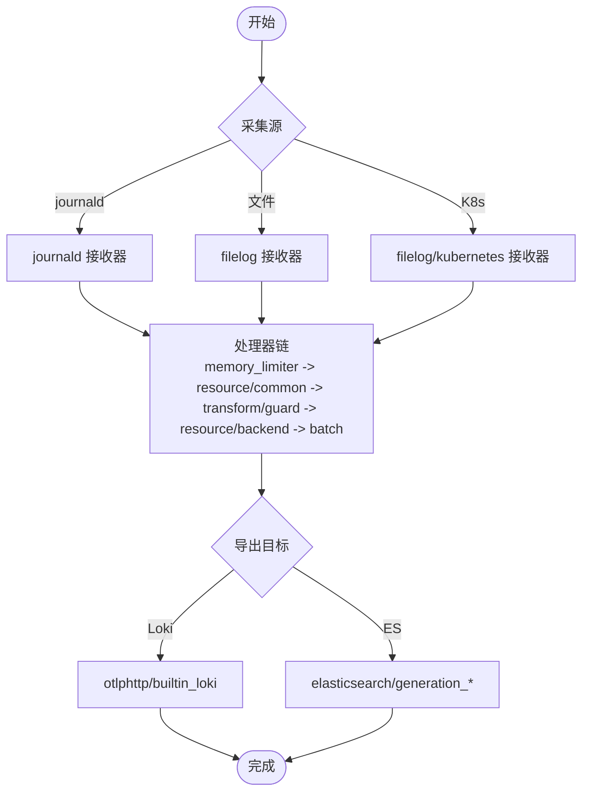
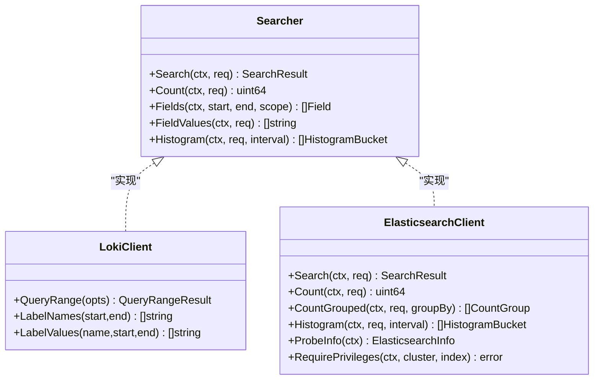
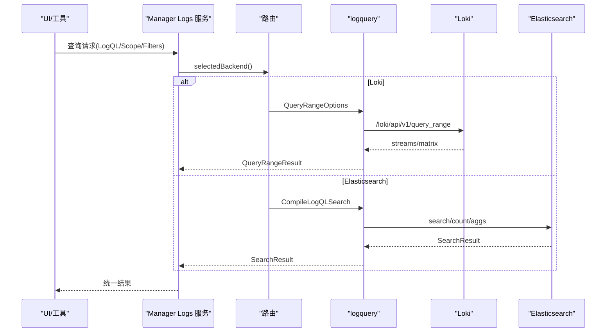
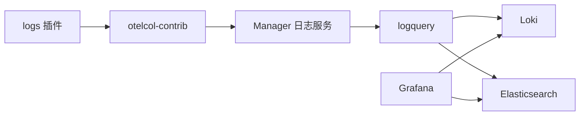

# 日志数据流

<cite>
**本文引用的文件**
- [internal/pkg/logquery/client.go](file://internal/pkg/logquery/client.go)
- [internal/pkg/logquery/loki_search.go](file://internal/pkg/logquery/loki_search.go)
- [internal/pkg/logquery/elasticsearch.go](file://internal/pkg/logquery/elasticsearch.go)
- [internal/pkg/logquery/search.go](file://internal/pkg/logquery/search.go)
- [internal/manager/biz/logs/query_logql.go](file://internal/manager/biz/logs/query_logql.go)
- [internal/edgeagent/plugins/logs/plugin.go](file://internal/edgeagent/plugins/logs/plugin.go)
- [internal/edgeagent/plugins/logs/render.go](file://internal/edgeagent/plugins/logs/render.go)
- [deploy/install/docker-compose.yml](file://deploy/install/docker-compose.yml)
- [deploy/install/loki-config.yaml](file://deploy/install/loki-config.yaml)
</cite>

## 目录
1. [简介](#简介)
2. [项目结构](#项目结构)
3. [核心组件](#核心组件)
4. [架构总览](#架构总览)
5. [详细组件分析](#详细组件分析)
6. [依赖关系分析](#依赖关系分析)
7. [性能与容量规划](#性能与容量规划)
8. [故障排查指南](#故障排查指南)
9. [结论](#结论)
10. [附录](#附录)

## 简介
本文件系统化梳理 Ongrid 的日志数据流，覆盖从边缘侧采集、传输、存储到查询与可视化的完整链路。重点说明：
- Loki 集成架构与 OTLP 日志接入路径
- LogQL 查询引擎在 Manager 侧的路由与适配
- 日志聚合机制（计数、直方图、分组）
- 日志格式标准化、字段提取、索引策略与存储优化
- 实时流处理、批量写入与故障恢复
- 压缩、轮转与容量规划
- 查询优化技巧与常见问题定位

## 项目结构
Ongrid 的日志子系统由“边缘采集插件 + Manager 查询客户端 + 后端存储”三部分构成：
- 边缘侧：logs 插件以独立 otelcol-contrib 进程运行，负责本地日志采集、标准化、批量化并推送到后端
- Manager 侧：logquery 包提供后端无关的 Searcher 接口，分别实现 Loki 与 Elasticsearch 的查询适配
- 存储层：默认内置 Loki（单节点 TSDB），可选外部 Elasticsearch；Grafana 通过数据源配置进行可视化

图表来源
- [internal/edgeagent/plugins/logs/render.go:52-252](file://internal/edgeagent/plugins/logs/render.go#L52-L252)
- [internal/pkg/logquery/search.go:138-159](file://internal/pkg/logquery/search.go#L138-L159)
- [deploy/install/docker-compose.yml:383-402](file://deploy/install/docker-compose.yml#L383-L402)

章节来源
- [internal/edgeagent/plugins/logs/plugin.go:1-41](file://internal/edgeagent/plugins/logs/plugin.go#L1-L41)
- [internal/edgeagent/plugins/logs/render.go:52-252](file://internal/edgeagent/plugins/logs/render.go#L52-L252)
- [internal/pkg/logquery/search.go:138-159](file://internal/pkg/logquery/search.go#L138-L159)
- [deploy/install/docker-compose.yml:383-402](file://deploy/install/docker-compose.yml#L383-L402)

## 核心组件
- 边缘日志插件（logs plugin）
  - 以子进程方式管理 otelcol-contrib，动态渲染配置，支持 journald、文件、Kubernetes Pod 日志
  - 标准化字段、脱敏敏感信息、注入资源维度（device_id、cluster_id、namespace、workload 等）
  - 批量发送、持久化队列、重试与内存限制，确保高可用
- Manager 日志查询客户端（logquery）
  - 统一 Searcher 接口，屏蔽 Loki/Elasticsearch 差异
  - 支持分页游标、范围查询、计数、分组计数、直方图、字段值枚举
  - 对 LogQL 表达式进行安全编译与路由
- 存储后端
  - Loki：单节点 TSDB，结构化元数据、索引标签、保留期与压缩
  - Elasticsearch：OTel 文档模式，PIT 分页、复合聚合、版本校验与权限检查

章节来源
- [internal/edgeagent/plugins/logs/render.go:52-252](file://internal/edgeagent/plugins/logs/render.go#L52-L252)
- [internal/pkg/logquery/search.go:138-159](file://internal/pkg/logquery/search.go#L138-L159)
- [internal/pkg/logquery/client.go:1-120](file://internal/pkg/logquery/client.go#L1-L120)
- [internal/pkg/logquery/loki_search.go:30-118](file://internal/pkg/logquery/loki_search.go#L30-L118)
- [internal/pkg/logquery/elasticsearch.go:33-86](file://internal/pkg/logquery/elasticsearch.go#L33-L86)

## 架构总览
下图展示了从应用输出到可视化的端到端流程，包括采集、标准化、传输、存储与查询。

图表来源
- [internal/edgeagent/plugins/logs/render.go:174-208](file://internal/edgeagent/plugins/logs/render.go#L174-L208)
- [internal/pkg/logquery/client.go:120-171](file://internal/pkg/logquery/client.go#L120-L171)
- [internal/pkg/logquery/loki_search.go:30-118](file://internal/pkg/logquery/loki_search.go#L30-L118)
- [internal/pkg/logquery/elasticsearch.go:88-175](file://internal/pkg/logquery/elasticsearch.go#L88-L175)

## 详细组件分析

### 边缘采集与标准化（logs 插件）
- 采集源
  - journald/systemd：读取系统日志，映射 MESSAGE 为 body，注入 device_id 与 ongrid_source
  - 文件：支持 include/exclude、JSON/正则解析、多行合并、最大日志大小限制
  - Kubernetes：Pod 日志路径过滤，容器元数据解析，排除系统组件日志
- 标准化与脱敏
  - 级别检测：从 attributes/body 推断 severity_text/number，统一归一
  - 敏感信息保护：正则替换 body 中的密码/密钥片段，删除匹配键名的属性
  - 资源维度：注入 device_id、cluster_id、cluster_name、k8s.*、service.name、data_stream.* 等
- 批处理与可靠性
  - batch processor：固定批次大小与超时，提升吞吐
  - sending_queue：持久化队列，消费者数、阻塞溢出策略
  - retry_on_failure：指数退避与无限时长重试
  - memory_limiter：限制内存使用，防止 OOM
- 导出器
  - 内置 Loki：OTLP HTTP 导出，gzip 压缩，认证头或文件注入
  - 外部 Elasticsearch：OTel mapping，API Key 文件，TLS/CA 配置，按 generation 路由

图表来源
- [internal/edgeagent/plugins/logs/render.go:89-208](file://internal/edgeagent/plugins/logs/render.go#L89-L208)
- [internal/edgeagent/plugins/logs/render.go:254-296](file://internal/edgeagent/plugins/logs/render.go#L254-L296)
- [internal/edgeagent/plugins/logs/render.go:469-600](file://internal/edgeagent/plugins/logs/render.go#L469-L600)

章节来源
- [internal/edgeagent/plugins/logs/render.go:89-208](file://internal/edgeagent/plugins/logs/render.go#L89-L208)
- [internal/edgeagent/plugins/logs/render.go:254-296](file://internal/edgeagent/plugins/logs/render.go#L254-L296)
- [internal/edgeagent/plugins/logs/render.go:469-600](file://internal/edgeagent/plugins/logs/render.go#L469-L600)

### Manager 查询适配（logquery）
- 统一接口
  - Searcher：Search、Count、Fields、FieldValues、Histogram
  - GroupedCounter：CountGrouped（支持 Loki/Elasticsearch 分组计数）
  - CursorCloser：释放后端游标（Elasticsearch PIT）
- Loki 适配
  - QueryRange：调用 /loki/api/v1/query_range，设置 X-Scope-OrgID 为 ongrid
  - LabelNames/LabelValues：用于 UI 标签自动补全
  - 编译 LogQL：将 Scope/Filters/Keywords 转换为安全的 matchers 与 line filters
  - 分页：基于时间戳与 skip 的 cursor，避免重复与遗漏
- Elasticsearch 适配
  - Search：使用 PIT 与 search_after 分页，限定 source 字段，控制响应大小
  - Count/CountGrouped：terms/composite 聚合，保证高基数场景稳定
  - Histogram：date_histogram 固定区间，边界对齐与偏移修正
  - 权限与版本：ProbeInfo/RequirePrivileges 校验 API Key 与集群版本

图表来源
- [internal/pkg/logquery/search.go:138-159](file://internal/pkg/logquery/search.go#L138-L159)
- [internal/pkg/logquery/client.go:120-171](file://internal/pkg/logquery/client.go#L120-L171)
- [internal/pkg/logquery/loki_search.go:30-118](file://internal/pkg/logquery/loki_search.go#L30-L118)
- [internal/pkg/logquery/elasticsearch.go:88-175](file://internal/pkg/logquery/elasticsearch.go#L88-L175)

章节来源
- [internal/pkg/logquery/search.go:138-159](file://internal/pkg/logquery/search.go#L138-L159)
- [internal/pkg/logquery/client.go:120-171](file://internal/pkg/logquery/client.go#L120-L171)
- [internal/pkg/logquery/loki_search.go:30-118](file://internal/pkg/logquery/loki_search.go#L30-L118)
- [internal/pkg/logquery/elasticsearch.go:88-175](file://internal/pkg/logquery/elasticsearch.go#L88-L175)

### LogQL 路由与查询
- Manager 层根据当前选定的后端路由查询：
  - Loki：直接传递原始 LogQL 表达式，返回原生 QueryRangeResult
  - Elasticsearch：将 LogQL 编译为安全的搜索子集，返回 SearchResult
- 安全与限制
  - 关键词与过滤器数量上限
  - 时间窗口上限（30 天）
  - 结果行数限制与游标分页
  - 字段白名单与操作符校验

图表来源
- [internal/manager/biz/logs/query_logql.go:16-49](file://internal/manager/biz/logs/query_logql.go#L16-L49)
- [internal/pkg/logquery/client.go:120-171](file://internal/pkg/logquery/client.go#L120-L171)
- [internal/pkg/logquery/loki_search.go:390-526](file://internal/pkg/logquery/loki_search.go#L390-L526)
- [internal/pkg/logquery/elasticsearch.go:593-669](file://internal/pkg/logquery/elasticsearch.go#L593-L669)

章节来源
- [internal/manager/biz/logs/query_logql.go:16-49](file://internal/manager/biz/logs/query_logql.go#L16-L49)
- [internal/pkg/logquery/loki_search.go:390-526](file://internal/pkg/logquery/loki_search.go#L390-L526)
- [internal/pkg/logquery/elasticsearch.go:593-669](file://internal/pkg/logquery/elasticsearch.go#L593-L669)

### 存储与索引策略（Loki）
- 存储与索引
  - TSDB + 文件系统对象存储，schema v13，索引前缀 index_，周期 24h
  - 允许结构化元数据，OTLP 资源属性中部分作为索引标签（device_id、cluster_id、ongrid_source、namespace、service.name）
  - 其他维度（workload、pod、container、node、filename、unit）作为结构化元数据
- 保留与限流
  - 保留期 720h（30 天），compactor 启用
  - 全局流基数限制、摄入速率与突发限制、拒绝旧样本
- 查询限制
  - 最大查询系列数、最大回溯时间

章节来源
- [deploy/install/loki-config.yaml:1-76](file://deploy/install/loki-config.yaml#L1-L76)

### 存储与索引策略（Elasticsearch）
- 文档模式
  - OTel mapping，固定索引模式 logs-ongrid.*.otel-*
  - 字段路径：resource.attributes.*、attributes.*、body.text、trace_id、span_id 等
- 查询与聚合
  - search_after 分页，PIT 保持上下文一致性
  - composite aggregation 分组计数，避免高基数截断
  - date_histogram 直方图，固定区间与边界对齐
- 安全与兼容
  - API Key 鉴权，版本要求 8.16+
  - RequirePrivileges 校验所需权限

章节来源
- [internal/pkg/logquery/elasticsearch.go:19-49](file://internal/pkg/logquery/elasticsearch.go#L19-L49)
- [internal/pkg/logquery/elasticsearch.go:88-175](file://internal/pkg/logquery/elasticsearch.go#L88-L175)
- [internal/pkg/logquery/elasticsearch.go:211-302](file://internal/pkg/logquery/elasticsearch.go#L211-L302)
- [internal/pkg/logquery/elasticsearch.go:362-424](file://internal/pkg/logquery/elasticsearch.go#L362-L424)
- [internal/pkg/logquery/elasticsearch.go:426-520](file://internal/pkg/logquery/elasticsearch.go#L426-L520)

## 依赖关系分析
- 边缘插件依赖
  - otelcol-contrib 二进制，配置文件由 render.go 生成
  - 通过 sending_queue 与 retry_on_failure 保障网络抖动下的可靠性
- Manager 查询依赖
  - logquery.Client 封装 HTTP 调用，设置 OrgID 与超时
  - Loki 适配器编译 LogQL，Elasticsearch 适配器构建 DSL
- 部署依赖
  - docker-compose 编排 Loki、Prometheus、Tempo、Grafana 等
  - Loki 配置挂载 local-config.yaml，数据卷持久化

图表来源
- [internal/edgeagent/plugins/logs/plugin.go:20-41](file://internal/edgeagent/plugins/logs/plugin.go#L20-L41)
- [internal/pkg/logquery/client.go:120-171](file://internal/pkg/logquery/client.go#L120-L171)
- [deploy/install/docker-compose.yml:383-402](file://deploy/install/docker-compose.yml#L383-L402)

章节来源
- [internal/edgeagent/plugins/logs/plugin.go:20-41](file://internal/edgeagent/plugins/logs/plugin.go#L20-L41)
- [internal/pkg/logquery/client.go:120-171](file://internal/pkg/logquery/client.go#L120-L171)
- [deploy/install/docker-compose.yml:383-402](file://deploy/install/docker-compose.yml#L383-L402)

## 性能与容量规划
- 采集侧
  - 批处理：send_batch_size=1024，send_batch_max_size=2048，timeout=1s
  - 队列：queue_size=5000，num_consumers=4，block_on_overflow=true
  - 内存限制：limit_mib/spike_limit_mib 可配置，防止 OOM
  - 压缩：OTLP 导出 gzip，减少带宽占用
- 存储侧（Loki）
  - 摄入速率：ingestion_rate_mb=8，burst=16
  - 保留期：720h（30 天），compactor 启用
  - 基数控制：max_global_streams_per_user=10000
- 存储侧（Elasticsearch）
  - 响应大小限制：maxESResponseBytes 与 maxESSearchHitBytes
  - 聚合分页：composite after_key 迭代，避免一次性加载
- 查询侧
  - 时间窗口上限 30 天，limit 默认 200，最大 1000
  - 游标分页：Loki 基于时间戳与 skip，ES 基于 search_after
  - 直方图：interval 对齐 epoch，必要时 offset 修正

章节来源
- [internal/edgeagent/plugins/logs/render.go:174-208](file://internal/edgeagent/plugins/logs/render.go#L174-L208)
- [internal/edgeagent/plugins/logs/render.go:469-600](file://internal/edgeagent/plugins/logs/render.go#L469-L600)
- [deploy/install/loki-config.yaml:31-60](file://deploy/install/loki-config.yaml#L31-L60)
- [internal/pkg/logquery/elasticsearch.go:19-31](file://internal/pkg/logquery/elasticsearch.go#L19-L31)
- [internal/pkg/logquery/search.go:13-22](file://internal/pkg/logquery/search.go#L13-L22)

## 故障排查指南
- 采集问题
  - 确认采集源是否启用（journald/file/K8s），路径与模式合法
  - 检查发送队列与重试配置，观察健康检查端口
  - 验证认证头或 API Key 文件路径与权限
- 传输问题
  - 网络连通性、TLS 证书与跳过验证选项
  - 压缩与超时配置是否合理
- 存储问题
  - Loki：检查 retention_period、compactor、索引周期与对象存储路径
  - Elasticsearch：版本校验、API Key 权限、索引模式匹配
- 查询问题
  - 时间窗口是否超过 MaxSearchWindow
  - limit 是否过大导致响应体超限
  - 游标是否有效（backend、direction、timestamp/sort）
  - LogQL 表达式是否被安全编译（关键字/过滤器白名单）

章节来源
- [internal/edgeagent/plugins/logs/render.go:502-600](file://internal/edgeagent/plugins/logs/render.go#L502-L600)
- [internal/pkg/logquery/client.go:232-271](file://internal/pkg/logquery/client.go#L232-L271)
- [internal/pkg/logquery/loki_search.go:30-118](file://internal/pkg/logquery/loki_search.go#L30-L118)
- [internal/pkg/logquery/elasticsearch.go:88-175](file://internal/pkg/logquery/elasticsearch.go#L88-L175)
- [deploy/install/loki-config.yaml:31-60](file://deploy/install/loki-config.yaml#L31-L60)

## 结论
Ongrid 的日志数据流以“边缘采集标准化 + Manager 查询适配 + 多后端存储”为核心，兼顾高性能与高可用。通过 OTLP 管道、批处理与持久化队列保障采集稳定性；通过统一的 Searcher 接口屏蔽后端差异；通过 Loki 与 Elasticsearch 的差异化优化满足不同规模与合规需求。结合合理的索引策略、压缩与保留期配置，可实现可扩展的日志平台。

## 附录
- 关键配置位置
  - Loki 配置：deploy/install/loki-config.yaml
  - 服务编排：deploy/install/docker-compose.yml
  - 边缘插件渲染：internal/edgeagent/plugins/logs/render.go
  - Manager 查询客户端：internal/pkg/logquery/*.go