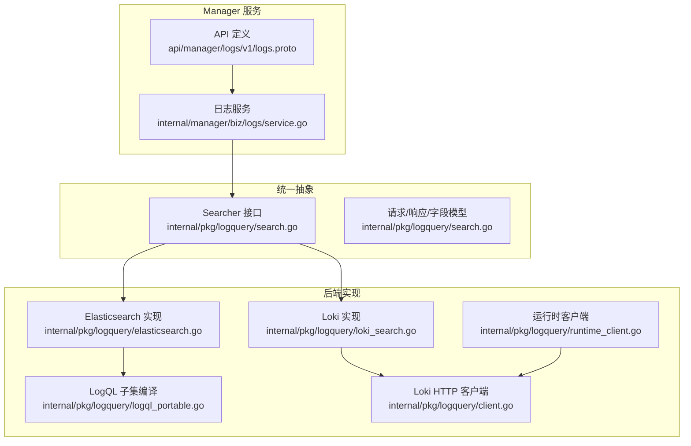
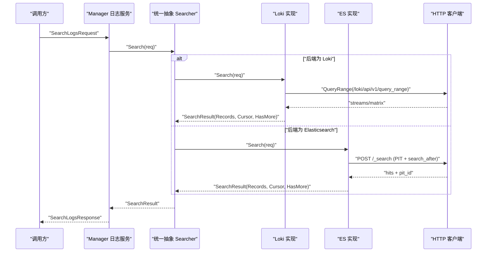
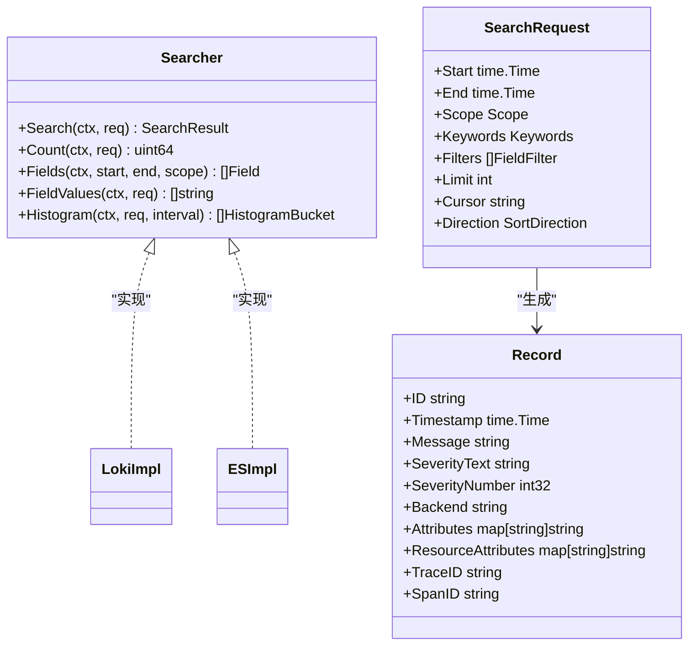
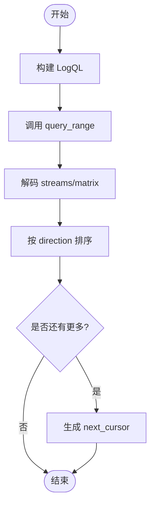
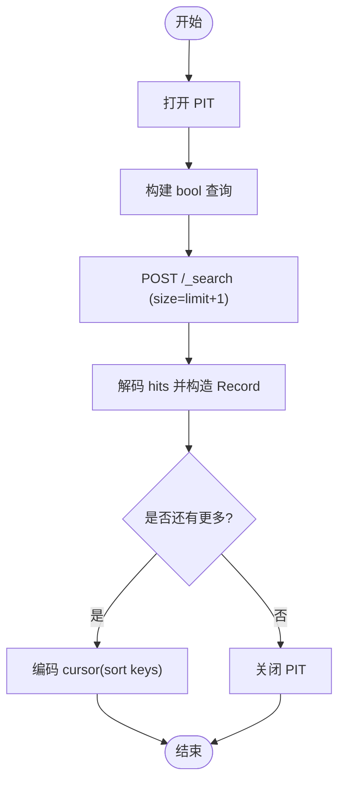
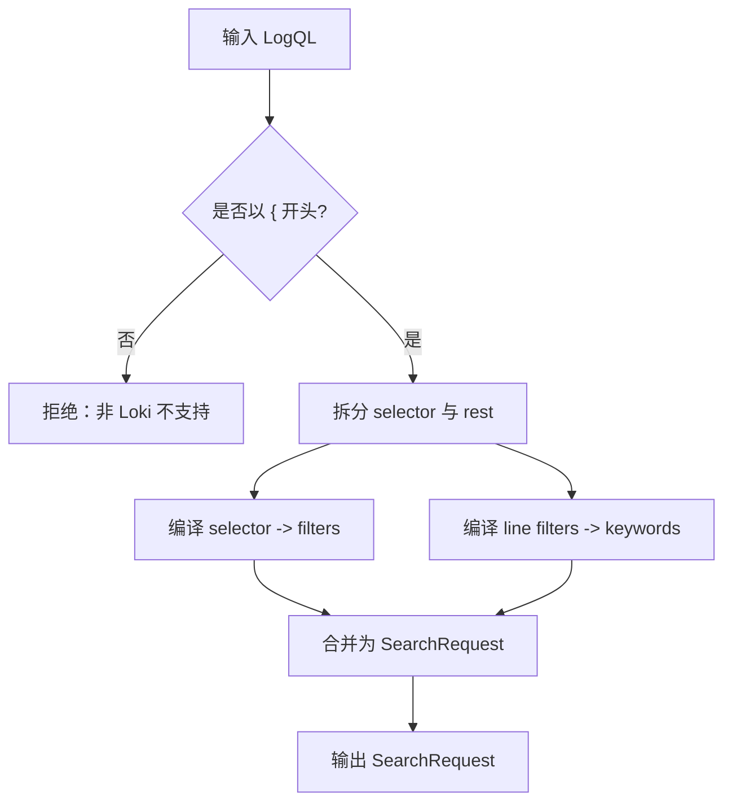
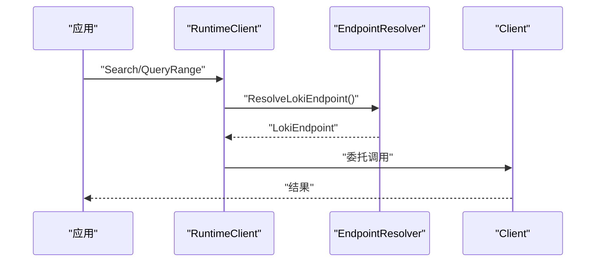
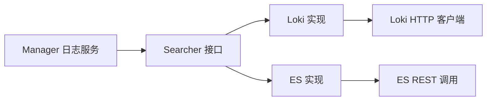

# 日志查询

<cite>
**本文引用的文件**
- [client.go](file://internal/pkg/logquery/client.go)
- [search.go](file://internal/pkg/logquery/search.go)
- [logql_portable.go](file://internal/pkg/logquery/logql_portable.go)
- [elasticsearch.go](file://internal/pkg/logquery/elasticsearch.go)
- [loki_search.go](file://internal/pkg/logquery/loki_search.go)
- [runtime_client.go](file://internal/pkg/logquery/runtime_client.go)
- [service.go](file://internal/manager/biz/logs/service.go)
- [logs.proto](file://api/manager/logs/v1/logs.proto)
</cite>

## 目录
1. [简介](#简介)
2. [项目结构](#项目结构)
3. [核心组件](#核心组件)
4. [架构总览](#架构总览)
5. [详细组件分析](#详细组件分析)
6. [依赖关系分析](#依赖关系分析)
7. [性能与优化](#性能与优化)
8. [故障排查指南](#故障排查指南)
9. [结论](#结论)
10. [附录](#附录)

## 简介
本文件系统化说明 Ongrid 的日志查询能力：统一的日志查询接口设计、多后端（Loki 与 Elasticsearch）查询协调机制、LogQL 子集编译与执行优化、查询范围过滤/关键词搜索/字段筛选、分页游标与排序策略，以及并发控制、缓存策略与最佳实践。文档面向不同技术背景的读者，提供从高层到代码级的可视化说明与可操作建议。

## 项目结构
Ongrid 日志查询由“统一抽象 + 多后端实现 + Manager 服务编排”构成：
- 统一抽象层：定义 Searcher 接口、请求/响应模型、字段白名单、游标与聚合等通用契约。
- 后端实现层：分别基于 Loki 与 Elasticsearch 实现 Searcher，屏蔽底层差异。
- Manager 服务层：负责后端选择、凭证管理、连接检查、Grafana 同步与对外 API。

图表来源
- [service.go:230-247](file://internal/manager/biz/logs/service.go#L230-L247)
- [logs.proto:9-25](file://api/manager/logs/v1/logs.proto#L9-L25)
- [search.go:138-159](file://internal/pkg/logquery/search.go#L138-L159)
- [loki_search.go:30-118](file://internal/pkg/logquery/loki_search.go#L30-L118)
- [elasticsearch.go:40-175](file://internal/pkg/logquery/elasticsearch.go#L40-L175)
- [logql_portable.go:21-84](file://internal/pkg/logquery/logql_portable.go#L21-L84)
- [client.go:53-171](file://internal/pkg/logquery/client.go#L53-L171)
- [runtime_client.go:32-83](file://internal/pkg/logquery/runtime_client.go#L32-L83)

章节来源
- [service.go:230-247](file://internal/manager/biz/logs/service.go#L230-L247)
- [logs.proto:9-25](file://api/manager/logs/v1/logs.proto#L9-L25)
- [search.go:138-159](file://internal/pkg/logquery/search.go#L138-L159)

## 核心组件
- 统一搜索接口 Searcher：定义 Search/Count/Fields/FieldValues/Histogram/CountGrouped 等后端无关方法，确保上层调用不感知具体存储。
- 请求与模型：SearchRequest/SearchResult/Record/Scope/Keywords/Filters 等，限定时间窗口、范围维度、关键词匹配模式、字段过滤、分页游标与排序方向。
- 字段白名单与映射：LookupField/AllowedFields 暴露产品级字段名，并映射到 Loki label/Elasticsearch path，屏蔽后端差异。
- 后端实现：
  - Loki：通过 QueryRange/LabelNames/LabelValues 访问 /loki/api/v1/*，支持流式结果与矩阵结果；使用 count_over_time 做精确计数与直方图。
  - Elasticsearch：通过 REST API 构建 bool/query/aggs，使用 PIT+search_after 实现稳定分页；composite aggregation 实现分组计数。
- 运行时客户端 RuntimeClient：按当前配置解析 Loki 端点与认证，复用 HTTP 连接，支持热更新。
- Manager 日志服务：管理外部后端配置、选择、连接检查、Grafana 数据源同步，并提供对外 gRPC/REST 接口。

章节来源
- [search.go:138-159](file://internal/pkg/logquery/search.go#L138-L159)
- [search.go:243-420](file://internal/pkg/logquery/search.go#L243-L420)
- [loki_search.go:30-118](file://internal/pkg/logquery/loki_search.go#L30-L118)
- [elasticsearch.go:40-175](file://internal/pkg/logquery/elasticsearch.go#L40-L175)
- [runtime_client.go:32-83](file://internal/pkg/logquery/runtime_client.go#L32-L83)
- [service.go:230-247](file://internal/manager/biz/logs/service.go#L230-L247)

## 架构总览
下图展示一次日志查询从 Manager 到后端的完整流程，包括后端选择、参数校验、查询编译、分页游标与结果归一化。

图表来源
- [service.go:230-247](file://internal/manager/biz/logs/service.go#L230-L247)
- [loki_search.go:30-118](file://internal/pkg/logquery/loki_search.go#L30-L118)
- [elasticsearch.go:88-175](file://internal/pkg/logquery/elasticsearch.go#L88-L175)
- [client.go:124-171](file://internal/pkg/logquery/client.go#L124-L171)

## 详细组件分析

### 统一查询接口与数据模型
- Searcher 接口：提供 Search/Count/Fields/FieldValues/Histogram/CountGrouped，保证跨后端一致体验。
- SearchRequest：包含 start/end、scope、keywords、filters、limit、cursor、direction，所有字段在 NormalizeAndValidate 中严格校验。
- Record/SearchResult：统一记录结构与分页元信息（next_cursor、has_more、took_ms、backends）。
- 字段白名单：LookupField 将逻辑字段名映射到 Loki label 或 Elasticsearch path，限制用户可筛选/聚合的字段集合。

图表来源
- [search.go:138-159](file://internal/pkg/logquery/search.go#L138-L159)
- [search.go:78-109](file://internal/pkg/logquery/search.go#L78-L109)
- [search.go:243-420](file://internal/pkg/logquery/search.go#L243-L420)

章节来源
- [search.go:78-109](file://internal/pkg/logquery/search.go#L78-L109)
- [search.go:138-159](file://internal/pkg/logquery/search.go#L138-L159)
- [search.go:243-420](file://internal/pkg/logquery/search.go#L243-L420)

### Loki 后端实现
- 查询构建：compileLogQL 将 SearchRequest 转换为 LogQL 表达式，仅允许安全子集（stream selector、|=/!=/|~/!~），拒绝 parser stages/unwrap/metric 表达式。
- 分页与游标：使用 lokiCursor（timestamp/skip/direction）结合 query_range 的 exclusive 边界处理，避免重复或缺失。
- 计数与直方图：Count 使用 count_over_time 瞬时查询；Histogram 使用 query_range 矩阵结果并按区间对齐计算。
- 字段值获取：优先走 LabelValues（索引字段且无 scope），否则回退到扫描 Search 结果去重。

图表来源
- [loki_search.go:30-118](file://internal/pkg/logquery/loki_search.go#L30-L118)
- [loki_search.go:318-388](file://internal/pkg/logquery/loki_search.go#L318-L388)
- [client.go:124-171](file://internal/pkg/logquery/client.go#L124-L171)

章节来源
- [loki_search.go:30-118](file://internal/pkg/logquery/loki_search.go#L30-L118)
- [loki_search.go:318-388](file://internal/pkg/logquery/loki_search.go#L318-L388)
- [client.go:124-171](file://internal/pkg/logquery/client.go#L124-L171)

### Elasticsearch 后端实现
- 查询构建：buildElasticsearchQuery 将 SearchRequest 转为 bool 查询，keyword 使用 match_phrase，filter 使用 term/terms/prefix/exists 等。
- 分页与游标：使用 PIT 保持一致性，search_after 携带上次命中 sort 键，避免深分页性能问题。
- 分组计数：CountGrouped 使用 composite aggregation 分页遍历桶，避免高基数截断。
- 直方图：date_histogram 固定间隔，extended_bounds/hard_bounds 保证边界一致。

图表来源
- [elasticsearch.go:88-175](file://internal/pkg/logquery/elasticsearch.go#L88-L175)
- [elasticsearch.go:214-302](file://internal/pkg/logquery/elasticsearch.go#L214-L302)
- [elasticsearch.go:362-424](file://internal/pkg/logquery/elasticsearch.go#L362-L424)
- [elasticsearch.go:553-591](file://internal/pkg/logquery/elasticsearch.go#L553-L591)

章节来源
- [elasticsearch.go:88-175](file://internal/pkg/logquery/elasticsearch.go#L88-L175)
- [elasticsearch.go:214-302](file://internal/pkg/logquery/elasticsearch.go#L214-L302)
- [elasticsearch.go:362-424](file://internal/pkg/logquery/elasticsearch.go#L362-L424)
- [elasticsearch.go:553-591](file://internal/pkg/logquery/elasticsearch.go#L553-L591)

### LogQL 子集编译
- 支持语法：stream selector（=、!=、=~、!~）、行过滤器（|=、!=、|~、!~），仅接受字面量正则交替，拒绝大小写不敏感与复杂正则。
- 限制：禁止 metric 表达式、parser stages、unwrap；当 Step>0 或非以 { 开头时直接拒绝。
- 转换目标：将 LogQL 翻译为后端无关的 SearchRequest（filters/keywords/limit/direction），再由各后端实现执行。

图表来源
- [logql_portable.go:21-84](file://internal/pkg/logquery/logql_portable.go#L21-L84)
- [logql_portable.go:114-174](file://internal/pkg/logquery/logql_portable.go#L114-L174)
- [logql_portable.go:262-320](file://internal/pkg/logquery/logql_portable.go#L262-L320)

章节来源
- [logql_portable.go:21-84](file://internal/pkg/logquery/logql_portable.go#L21-L84)
- [logql_portable.go:114-174](file://internal/pkg/logquery/logql_portable.go#L114-L174)
- [logql_portable.go:262-320](file://internal/pkg/logquery/logql_portable.go#L262-L320)

### 运行时客户端与后端选择
- RuntimeClient：每次调用前解析 Loki 端点与认证，缓存 http.Client，变更时重建连接，支持 Basic Auth 与 TLS 开关。
- Manager 服务：维护后端配置、选择状态、连接检查、Grafana 同步；对外暴露 gRPC/REST 接口（SearchLogs、GetLogFields、GetLogHistogram、SelectLoki 等）。

图表来源
- [runtime_client.go:32-83](file://internal/pkg/logquery/runtime_client.go#L32-L83)
- [runtime_client.go:130-160](file://internal/pkg/logquery/runtime_client.go#L130-L160)
- [service.go:705-739](file://internal/manager/biz/logs/service.go#L705-L739)

章节来源
- [runtime_client.go:32-83](file://internal/pkg/logquery/runtime_client.go#L32-L83)
- [service.go:705-739](file://internal/manager/biz/logs/service.go#L705-L739)

## 依赖关系分析
- 耦合度：Searcher 作为稳定接口解耦上层与后端；Loki/ES 各自封装协议细节；Manager 服务通过接口注入，降低硬依赖。
- 外部依赖：Loki HTTP API、Elasticsearch REST API；Manager 还依赖 Grafana 数据源同步与 Edge 连接检查。
- 循环依赖：未发现明显循环；包内职责清晰，分层明确。

图表来源
- [service.go:230-247](file://internal/manager/biz/logs/service.go#L230-L247)
- [search.go:138-159](file://internal/pkg/logquery/search.go#L138-L159)
- [loki_search.go:30-118](file://internal/pkg/logquery/loki_search.go#L30-L118)
- [elasticsearch.go:40-175](file://internal/pkg/logquery/elasticsearch.go#L40-L175)
- [client.go:53-171](file://internal/pkg/logquery/client.go#L53-L171)

章节来源
- [service.go:230-247](file://internal/manager/biz/logs/service.go#L230-L247)
- [search.go:138-159](file://internal/pkg/logquery/search.go#L138-L159)

## 性能与优化
- 查询范围与限制：
  - 最大时间窗口 MaxSearchWindow、最大 limit 与关键字/过滤数量限制，防止大查询拖垮后端。
  - Loki 读取体限制 8MiB，ES 响应体限制 16MiB/32MiB，保护进程内存。
- 分页与游标：
  - Loki：基于 timestamp+skip 的轻量游标，适合流式翻页。
  - ES：PIT + search_after，避免深分页与重复扫描。
- 排序策略：
  - 默认 backward（最新在前），可按需 forward；Loki 与 ES 均按 @timestamp/_shard_doc 或 ID 稳定排序。
- 聚合优化：
  - ES CountGrouped 使用 composite aggregation 分页遍历，避免 terms size 限制导致的高基数截断。
  - Loki Histogram 使用 query_range 矩阵结果并按步长对齐，减少误差。
- 并发与缓存：
  - RuntimeClient 缓存 http.Client，端点变化时重建连接，减少握手开销。
  - Manager 服务对后端选择与连接检查使用互斥锁，避免竞态。
- 资源释放：
  - ES PIT 在失败或完成时及时关闭，避免服务端上下文泄漏。

章节来源
- [search.go:13-22](file://internal/pkg/logquery/search.go#L13-L22)
- [client.go:257-270](file://internal/pkg/logquery/client.go#L257-L270)
- [elasticsearch.go:522-551](file://internal/pkg/logquery/elasticsearch.go#L522-L551)
- [runtime_client.go:67-83](file://internal/pkg/logquery/runtime_client.go#L67-L83)
- [service.go:303-340](file://internal/manager/biz/logs/service.go#L303-L340)

## 故障排查指南
- 常见错误与定位：
  - 空查询/无效时间窗口：NormalizeAndValidate 会返回明确错误，检查 start/end 与顺序。
  - 非法字段/操作符：LookupField 白名单校验，确认 field/operator/values 合法。
  - 游标无效：decodeCursor 失败或后端不一致，重新发起查询或使用新游标。
  - 权限不足：ES RequirePrivileges 检查缺失权限，核对 API Key 与 index 权限。
  - 后端不可达：HTTP 非 200 或超时，检查网络、证书与代理。
- 调试建议：
  - 启用 slog 日志，关注 logquery 模块告警与错误。
  - 缩小时间窗口与 limit，逐步扩大定位瓶颈。
  - 使用 GetLogFields/GetLogFieldValues 验证字段可用性与取值范围。
  - 对 ES 使用 _count 与简单 bool 查询先验证过滤条件。

章节来源
- [search.go:257-338](file://internal/pkg/logquery/search.go#L257-L338)
- [search.go:340-366](file://internal/pkg/logquery/search.go#L340-L366)
- [elasticsearch.go:470-520](file://internal/pkg/logquery/elasticsearch.go#L470-L520)
- [client.go:232-270](file://internal/pkg/logquery/client.go#L232-L270)

## 结论
Ongrid 日志查询通过统一 Searcher 接口屏蔽 Loki 与 Elasticsearch 的差异，提供一致的查询语义、分页与聚合能力。LogQL 子集编译确保安全性与可移植性，Manager 服务负责后端选择与运维闭环。建议在大规模场景下合理设置时间窗口与 limit，利用游标与聚合优化性能，并通过字段白名单与权限控制保障系统稳定性。

## 附录

### API 概览（来自 logs.proto）
- 搜索与游标：SearchLogs、CloseLogCursor
- 字段与值：GetLogFields、GetLogFieldValues
- 直方图：GetLogHistogram
- 上下文：GetLogContext
- 后端管理：GetLogBackend、PutLogBackend、TestLogBackend、SelectLogBackend、StartLogBackendConnectionCheck、GetLogBackendConnectionCheck
- 内置 Loki：SelectLoki

章节来源
- [logs.proto:9-25](file://api/manager/logs/v1/logs.proto#L9-L25)
- [logs.proto:76-114](file://api/manager/logs/v1/logs.proto#L76-L114)
- [logs.proto:125-172](file://api/manager/logs/v1/logs.proto#L125-L172)
- [logs.proto:174-187](file://api/manager/logs/v1/logs.proto#L174-L187)
- [logs.proto:189-346](file://api/manager/logs/v1/logs.proto#L189-L346)