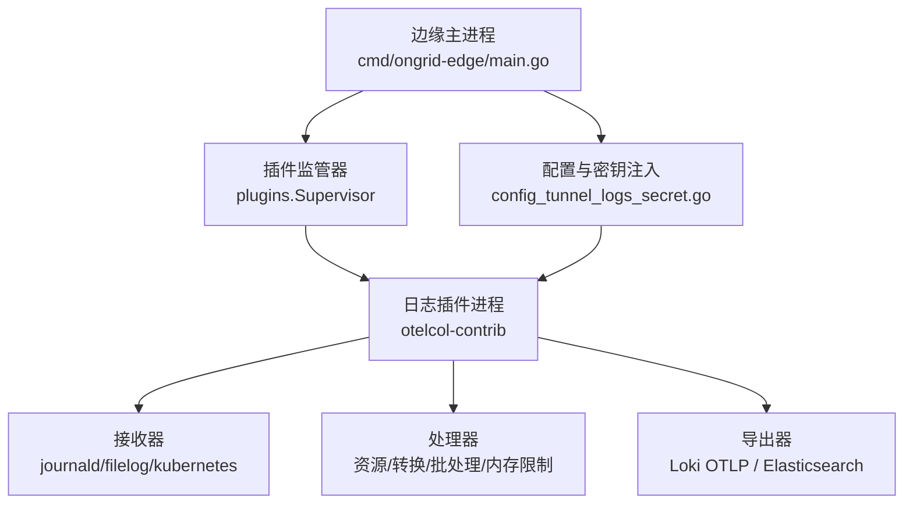
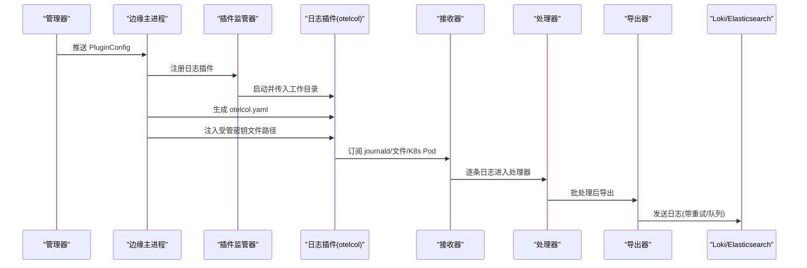
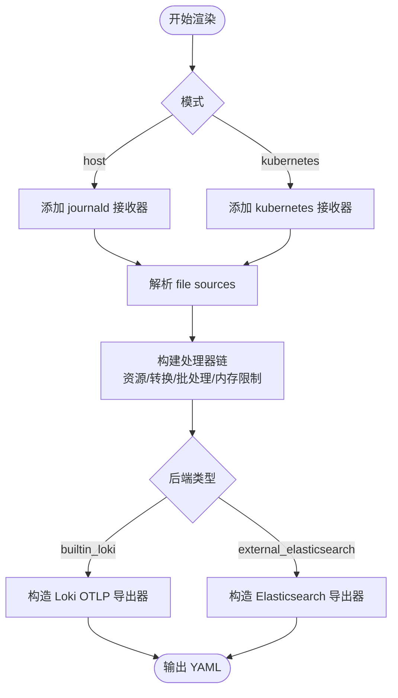
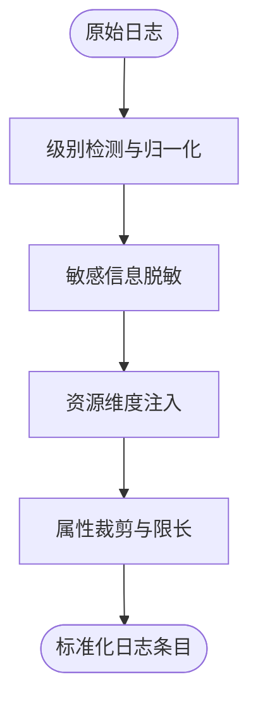
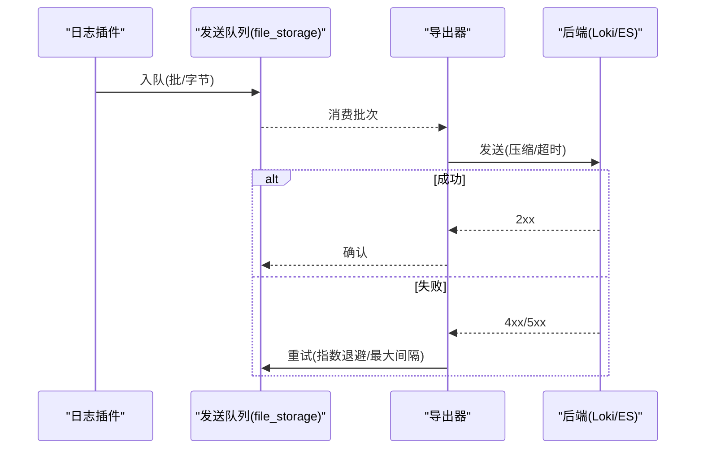
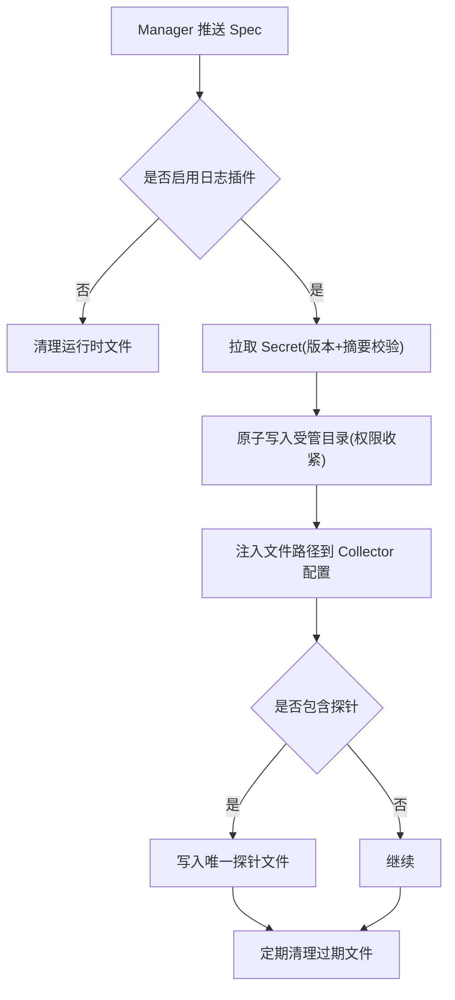
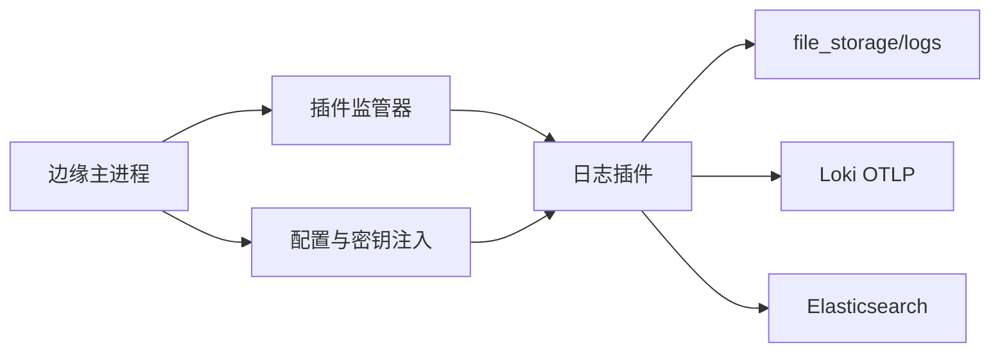

# 日志采集

<cite>
**本文引用的文件**
- [cmd/ongrid-edge/main.go](file://cmd/ongrid-edge/main.go)
- [internal/edgeagent/plugins/logs/plugin.go](file://internal/edgeagent/plugins/logs/plugin.go)
- [internal/edgeagent/plugins/logs/render.go](file://internal/edgeagent/plugins/logs/render.go)
- [internal/edgeagent/plugins/config_tunnel_logs_secret.go](file://internal/edgeagent/plugins/config_tunnel_logs_secret.go)
- [internal/edgeagent/config/rotation.go](file://internal/edgeagent/config/rotation.go)
- [internal/manager/biz/alert/legacy_log_migration.go](file://internal/manager/biz/alert/legacy_log_migration.go)
- [internal/manager/server/logs/http.go](file://internal/manager/server/logs/http.go)
</cite>

## 目录
1. [简介](#简介)
2. [项目结构](#项目结构)
3. [核心组件](#核心组件)
4. [架构总览](#架构总览)
5. [详细组件分析](#详细组件分析)
6. [依赖关系分析](#依赖关系分析)
7. [性能与内存优化](#性能与内存优化)
8. [故障排查指南](#故障排查指南)
9. [结论](#结论)
10. [附录：配置示例与监控指标](#附录：配置示例与监控指标)

## 简介
本文件面向 Ongrid 边缘侧的日志采集子系统，说明边缘代理如何从多种来源（应用日志、系统日志、容器日志、文件日志）采集数据，如何进行格式标准化、字段提取与预处理，如何实现多源聚合、去重、错误重试与缓冲持久化，并给出轮转策略、内存优化、配置示例与常见问题排查方法。

## 项目结构
Ongrid 边缘侧通过“插件”机制运行独立的 otelcol-contrib 子进程来承担日志采集与导出职责；主进程负责生命周期管理、配置下发、密钥注入与健康检查。关键路径如下：
- 边缘主进程：负责启动插件、注册能力、暴露本地 /metrics 与 /healthz。
- 日志插件：封装 otelcol-contrib，渲染 Collector 配置，管理存储扩展、处理器管道与导出器。
- 配置与密钥：通过隧道从管理器拉取 PluginConfig，并将敏感信息以受管文件形式落地，供 Collector 使用。
- 后端支持：内置 Loki OTLP 或外部 Elasticsearch，均启用发送队列与重试。

图表来源
- [cmd/ongrid-edge/main.go:309-416](file://cmd/ongrid-edge/main.go#L309-L416)
- [internal/edgeagent/plugins/logs/plugin.go:1-42](file://internal/edgeagent/plugins/logs/plugin.go#L1-L42)
- [internal/edgeagent/plugins/config_tunnel_logs_secret.go:27-88](file://internal/edgeagent/plugins/config_tunnel_logs_secret.go#L27-L88)

章节来源
- [cmd/ongrid-edge/main.go:309-416](file://cmd/ongrid-edge/main.go#L309-L416)
- [internal/edgeagent/plugins/logs/plugin.go:1-42](file://internal/edgeagent/plugins/logs/plugin.go#L1-L42)
- [internal/edgeagent/plugins/config_tunnel_logs_secret.go:27-88](file://internal/edgeagent/plugins/config_tunnel_logs_secret.go#L27-L88)

## 核心组件
- 日志插件进程：基于 otelcol-contrib，读取本地 journald、文件与 Kubernetes Pod 日志，统一处理后写入后端。
- 配置渲染器：将 Manager 下发的 PluginSpec 转换为 Collector YAML，包含接收器、处理器、导出器与存储扩展。
- 配置与密钥注入：从管理器获取 Secret（如 Loki 认证、Elasticsearch API Key），安全落盘并注入到 Collector 配置中。
- 后端导出：支持内置 Loki OTLP 与外部 Elasticsearch，均启用发送队列、压缩与重试。
- 健康与遥测：插件暴露健康端点与 Prometheus 指标，便于监控与自愈。

章节来源
- [internal/edgeagent/plugins/logs/render.go:52-251](file://internal/edgeagent/plugins/logs/render.go#L52-L251)
- [internal/edgeagent/plugins/config_tunnel_logs_secret.go:27-88](file://internal/edgeagent/plugins/config_tunnel_logs_secret.go#L27-L88)
- [internal/edgeagent/plugins/logs/render.go:502-600](file://internal/edgeagent/plugins/logs/render.go#L502-L600)

## 架构总览
下图展示了从边缘主进程到日志插件再到后端的完整链路，包括配置下发、密钥注入、接收器、处理器与导出器。

图表来源
- [cmd/ongrid-edge/main.go:309-416](file://cmd/ongrid-edge/main.go#L309-L416)
- [internal/edgeagent/plugins/logs/plugin.go:20-41](file://internal/edgeagent/plugins/logs/plugin.go#L20-L41)
- [internal/edgeagent/plugins/logs/render.go:52-251](file://internal/edgeagent/plugins/logs/render.go#L52-L251)
- [internal/edgeagent/plugins/config_tunnel_logs_secret.go:27-88](file://internal/edgeagent/plugins/config_tunnel_logs_secret.go#L27-L88)

## 详细组件分析

### 日志插件进程与配置渲染
- 插件入口：创建 otelcol-contrib 子进程，指定二进制与工作目录，提供配置渲染与校验函数。
- 配置渲染：根据 mode/host 或 kubernetes 选择不同接收器集合；构建资源属性、转换守卫、批处理与内存限制处理器；选择后端导出器并组装服务管线。
- 存储扩展：启用 file_storage/logs 作为持久化存储，用于 receiver 偏移量与发送队列，保障重启不丢、断线恢复。
- 健康与指标：启用 health_check 与 Prometheus 指标读取器，便于外部监控。

图表来源
- [internal/edgeagent/plugins/logs/render.go:52-251](file://internal/edgeagent/plugins/logs/render.go#L52-L251)
- [internal/edgeagent/plugins/logs/render.go:298-388](file://internal/edgeagent/plugins/logs/render.go#L298-L388)
- [internal/edgeagent/plugins/logs/render.go:502-600](file://internal/edgeagent/plugins/logs/render.go#L502-L600)

章节来源
- [internal/edgeagent/plugins/logs/plugin.go:20-41](file://internal/edgeagent/plugins/logs/plugin.go#L20-L41)
- [internal/edgeagent/plugins/logs/render.go:52-251](file://internal/edgeagent/plugins/logs/render.go#L52-L251)

### 多源采集与字段标准化
- 多源接入：
  - 系统日志：journald 接收器，可过滤 units 与目录。
  - 文件日志：filelog 接收器，支持 include/exclude、JSON/正则解析、多行合并、起始位置控制。
  - 容器日志：Kubernetes 模式下读取 Pod 日志目录，默认排除 ongrid 自身组件日志。
- 字段标准化：
  - 级别检测：从 attributes/body 推断 severity_text，并映射为语义化级别与数字级别。
  - 敏感信息脱敏：对 body 中的常见敏感键值进行掩码，删除匹配的属性键。
  - 资源维度：统一注入 device_id、cluster_id、service.name、namespace/pod/container/node/workload 等稳定维度。
  - 属性裁剪：限制属性数量与长度，避免下游压力。
- 多行与解析：
  - 支持 line_start_pattern/line_end_pattern 组合的多行日志。
  - JSON 解析与正则解析，按 source 粒度配置。

图表来源
- [internal/edgeagent/plugins/logs/render.go:151-189](file://internal/edgeagent/plugins/logs/render.go#L151-L189)
- [internal/edgeagent/plugins/logs/render.go:254-296](file://internal/edgeagent/plugins/logs/render.go#L254-L296)
- [internal/edgeagent/plugins/logs/render.go:343-388](file://internal/edgeagent/plugins/logs/render.go#L343-L388)

章节来源
- [internal/edgeagent/plugins/logs/render.go:151-189](file://internal/edgeagent/plugins/logs/render.go#L151-L189)
- [internal/edgeagent/plugins/logs/render.go:254-296](file://internal/edgeagent/plugins/logs/render.go#L254-L296)
- [internal/edgeagent/plugins/logs/render.go:343-388](file://internal/edgeagent/plugins/logs/render.go#L343-L388)

### 后端导出、队列与重试
- 内置 Loki：
  - 自动将 push 地址转换为 OTLP logs 端点。
  - 支持 edge/basic/none 认证模式；禁止内联授权，强制使用受管文件。
  - 启用 gzip 压缩、超时与发送队列，失败指数退避重试。
- 外部 Elasticsearch：
  - 要求 HTTPS（可配置跳过校验），必须通过受管文件注入 API Key，支持 CA 证书。
  - 强制 mapping 模式为 otel，确保查询兼容。
  - 发送队列按字节批量，支持重试与状态码过滤。
- 发送队列与持久化：
  - 使用 file_storage/logs 作为队列与 receiver 偏移存储，保证崩溃恢复与顺序性。

图表来源
- [internal/edgeagent/plugins/logs/render.go:502-600](file://internal/edgeagent/plugins/logs/render.go#L502-L600)
- [internal/edgeagent/plugins/logs/render.go:209-246](file://internal/edgeagent/plugins/logs/render.go#L209-L246)

章节来源
- [internal/edgeagent/plugins/logs/render.go:502-600](file://internal/edgeagent/plugins/logs/render.go#L502-L600)
- [internal/edgeagent/plugins/logs/render.go:209-246](file://internal/edgeagent/plugins/logs/render.go#L209-L246)

### 配置与密钥注入、探针与清理
- 密钥注入：
  - 从管理器拉取 Secret（Loki Basic Auth、Elasticsearch API Key），校验版本与摘要后原子写入受管目录，权限收紧。
  - 将文件路径注入到 Collector 配置，避免明文敏感信息进入配置。
- 探针机制：
  - 支持 log_probe_id 与受管 probe 文件，用于端到端连通性验证；每次 generation 生成唯一文件名，避免偏移重复。
- 运行时清理：
  - 仅保留当前生效的密钥与探针文件，过期文件自动清理，防止磁盘膨胀。

图表来源
- [internal/edgeagent/plugins/config_tunnel_logs_secret.go:27-88](file://internal/edgeagent/plugins/config_tunnel_logs_secret.go#L27-L88)
- [internal/edgeagent/plugins/config_tunnel_logs_secret.go:151-198](file://internal/edgeagent/plugins/config_tunnel_logs_secret.go#L151-L198)
- [internal/edgeagent/plugins/config_tunnel_logs_secret.go:118-149](file://internal/edgeagent/plugins/config_tunnel_logs_secret.go#L118-L149)

章节来源
- [internal/edgeagent/plugins/config_tunnel_logs_secret.go:27-88](file://internal/edgeagent/plugins/config_tunnel_logs_secret.go#L27-L88)
- [internal/edgeagent/plugins/config_tunnel_logs_secret.go:151-198](file://internal/edgeagent/plugins/config_tunnel_logs_secret.go#L151-L198)
- [internal/edgeagent/plugins/config_tunnel_logs_secret.go:118-149](file://internal/edgeagent/plugins/config_tunnel_logs_secret.go#L118-L149)

### 去重与多源聚合
- 多源聚合：通过 receivers 列表汇聚 journald、filelog、kubernetes 三类来源，统一进入 processors 管道。
- 去重策略：
  - 代码未实现显式去重逻辑；但通过稳定的 resource 维度（device_id、cluster_id、service.name、namespace/pod/container/node/workload）与 source_id 标识，可在后端进行分组与去重。
  - 历史兼容：后端维护 legacy 流分组维度，确保阈值与去重键稳定。

章节来源
- [internal/edgeagent/plugins/logs/render.go:89-126](file://internal/edgeagent/plugins/logs/render.go#L89-L126)
- [internal/manager/biz/alert/legacy_log_migration.go:16-22](file://internal/manager/biz/alert/legacy_log_migration.go#L16-L22)

## 依赖关系分析
- 边缘主进程依赖插件监管器启动日志插件，并通过隧道拉取配置与密钥。
- 日志插件依赖 otelcol-contrib 二进制与 file_storage 扩展，依赖后端网络可达性与鉴权。
- 管理器通过 HTTP API 暴露日志后端管理能力，错误码与状态在接口层统一映射。

图表来源
- [cmd/ongrid-edge/main.go:309-416](file://cmd/ongrid-edge/main.go#L309-L416)
- [internal/edgeagent/plugins/logs/render.go:209-246](file://internal/edgeagent/plugins/logs/render.go#L209-L246)
- [internal/edgeagent/plugins/config_tunnel_logs_secret.go:27-88](file://internal/edgeagent/plugins/config_tunnel_logs_secret.go#L27-L88)

章节来源
- [cmd/ongrid-edge/main.go:309-416](file://cmd/ongrid-edge/main.go#L309-L416)
- [internal/edgeagent/plugins/logs/render.go:209-246](file://internal/edgeagent/plugins/logs/render.go#L209-L246)
- [internal/edgeagent/plugins/config_tunnel_logs_secret.go:27-88](file://internal/edgeagent/plugins/config_tunnel_logs_secret.go#L27-L88)

## 性能与内存优化
- 内存限制：
  - 使用 memory_limiter 处理器，设置 limit_mib 与 spike_limit_mib，防止突发流量导致 OOM。
- 批处理与队列：
  - 日志批处理器设置 send_batch_size/send_batch_max_size/timeout，平衡吞吐与时延。
  - 发送队列按请求或字节大小触发，block_on_overflow 保护上游。
- 存储与压缩：
  - file_storage/logs 持久化偏移与队列，支持 compaction 与 fsync 保障一致性。
  - 导出器启用 gzip 压缩，降低带宽占用。
- 属性裁剪：
  - 限制属性数量与长度，减少序列化与传输开销。
- Token 轮转：
  - 提供 token 轮转周期钳制逻辑，避免过长或过短导致的运维风险。

章节来源
- [internal/edgeagent/plugins/logs/render.go:174-189](file://internal/edgeagent/plugins/logs/render.go#L174-L189)
- [internal/edgeagent/plugins/logs/render.go:469-473](file://internal/edgeagent/plugins/logs/render.go#L469-L473)
- [internal/edgeagent/plugins/logs/render.go:209-246](file://internal/edgeagent/plugins/logs/render.go#L209-L246)
- [internal/edgeagent/plugins/logs/render.go:502-600](file://internal/edgeagent/plugins/logs/render.go#L502-L600)
- [internal/edgeagent/config/rotation.go:5-37](file://internal/edgeagent/config/rotation.go#L5-L37)

## 故障排查指南
- 插件未启动或配置拒绝：
  - 检查 PluginConfig 是否包含必要字段（backend_generation、mode、source 等）。
  - 查看插件健康端点与 Prometheus 指标，定位启动失败原因。
- 密钥注入失败：
  - 确认管理器返回的 Secret 版本与摘要一致，受管目录权限正确，无软链接覆盖。
  - 关注错误分类：secret_materialization_failed、collector_config_rejected、collector_binary_missing、collector_not_ready、collector_start_failed。
- 后端不可达或限流：
  - 检查网络连通与 TLS 配置；Loki/ES 可能返回 429/5xx，插件会重试。
  - 调整发送队列大小与批处理参数，缓解背压。
- 磁盘空间不足：
  - 清理过期运行时文件；检查 journald 与 logrotate 策略；必要时限制源端日志速率。
- 管理器接口错误：
  - 参考 HTTP 层错误码映射，快速定位 LOG_BACKEND_* 错误。

章节来源
- [internal/edgeagent/plugins/config_tunnel_logs_secret.go:200-252](file://internal/edgeagent/plugins/config_tunnel_logs_secret.go#L200-L252)
- [internal/manager/server/logs/http.go:771-784](file://internal/manager/server/logs/http.go#L771-L784)

## 结论
Ongrid 边缘日志采集采用插件化架构，将采集、标准化、缓冲与导出解耦，通过受管密钥与持久化队列保障可靠性与安全性。其支持 journald、文件与 K8s Pod 多源采集，具备严格的字段标准化与敏感信息脱敏，并提供灵活的内存与批处理调优手段。结合管理器下发的配置与密钥，可实现高可用、可扩展的日志采集体系。

## 附录：配置示例与监控指标

### 配置要点（文本描述）
- 模式与后端：
  - mode: host 或 kubernetes；backend: builtin_loki 或 external_elasticsearch。
- 接收器：
  - journald：units、directory、start_at。
  - file_sources：id、include/exclude、parser(json/regex/plain)、multiline、start_at、exclude_older_than。
  - kubernetes：pod_log_path、exclude、start_at。
- 资源与标签：
  - extra_labels/extra_attrs：注入自定义资源维度，需符合命名规范与安全约束。
- 导出器：
  - Loki：endpoint、auth_mode(edge/basic/none)、authorization_file。
  - Elasticsearch：endpoints、api_key_file、ca_file、mapping.allowed_modes=otel。
- 队列与批处理：
  - sending_queue：storage=file_storage/logs，num_consumers、queue_size、block_on_overflow。
  - batch：send_batch_size、send_batch_max_size、timeout。
- 内存限制：
  - memory_limiter：limit_mib、spike_limit_mib。

### 监控指标与端点
- 插件健康：
  - health_check/logs 端点用于就绪探测。
- 指标暴露：
  - Prometheus 指标读取器监听本地端口，暴露插件内部指标（如队列长度、批大小、错误计数等）。
- 管理器接口：
  - 日志后端操作错误通过 HTTP 层统一映射为 LOG_BACKEND_* 错误码，便于告警与排障。

章节来源
- [internal/edgeagent/plugins/logs/render.go:209-246](file://internal/edgeagent/plugins/logs/render.go#L209-L246)
- [internal/edgeagent/plugins/logs/render.go:502-600](file://internal/edgeagent/plugins/logs/render.go#L502-L600)
- [internal/manager/server/logs/http.go:771-784](file://internal/manager/server/logs/http.go#L771-L784)