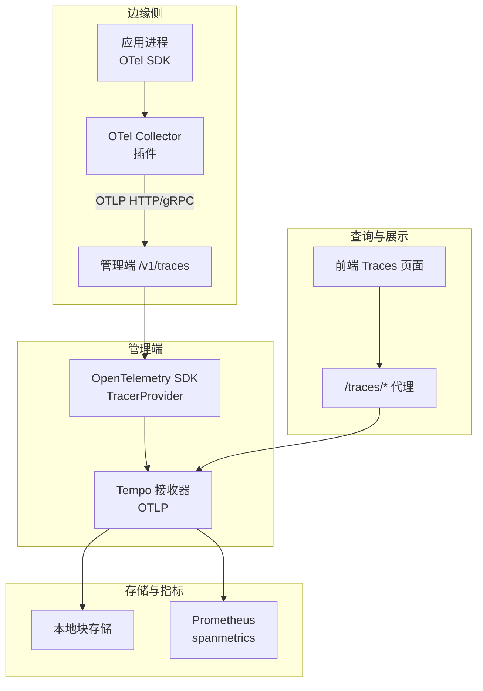
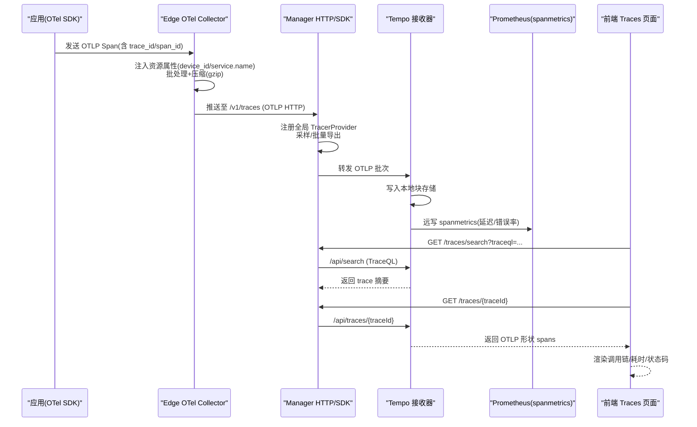
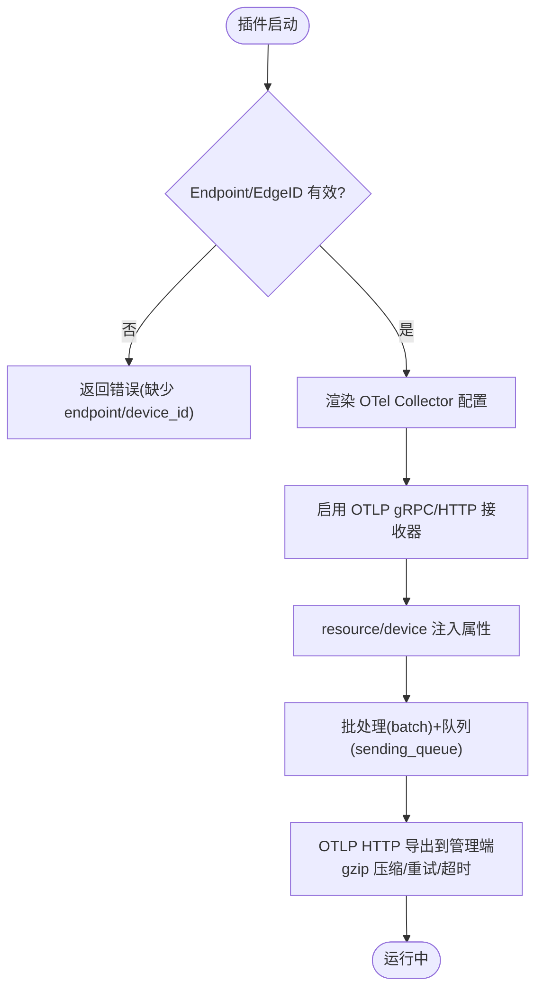
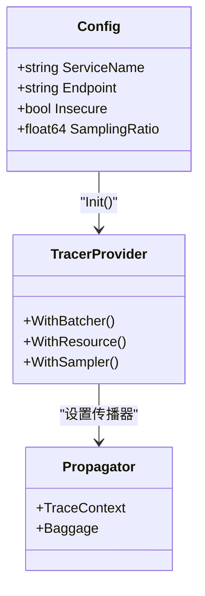
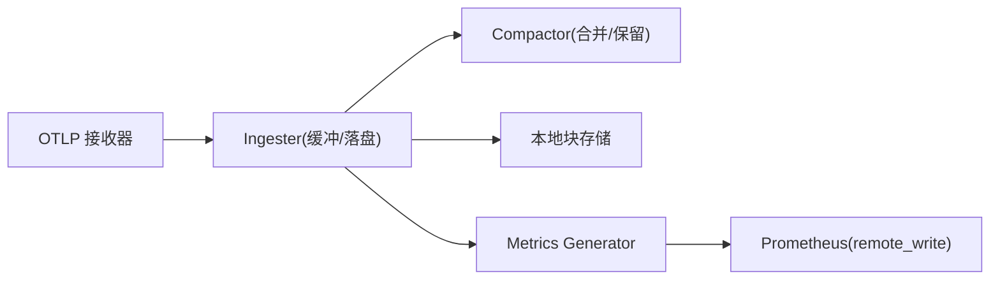
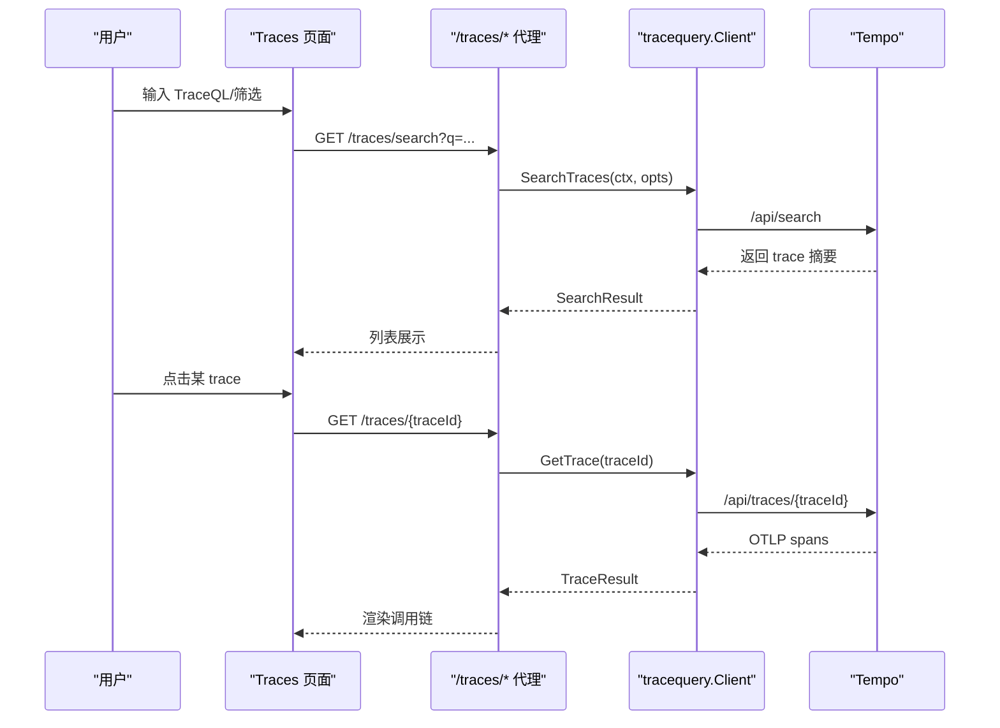
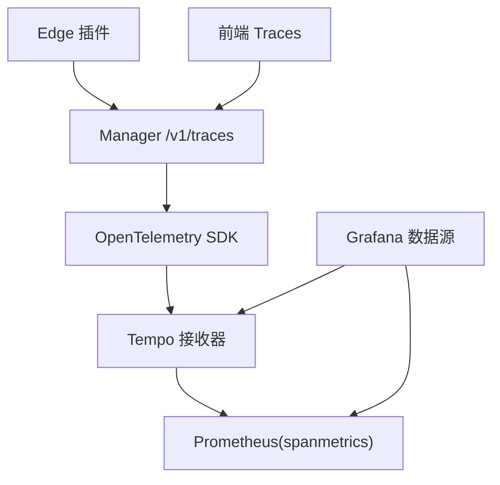

# 追踪数据流

<cite>
**本文引用的文件**
- [internal/pkg/tracing/tracing.go](file://internal/pkg/tracing/tracing.go)
- [internal/pkg/tracequery/client.go](file://internal/pkg/tracequery/client.go)
- [deploy/install/tempo-config.yaml](file://deploy/install/tempo-config.yaml)
- [deploy/grafana/provisioning/datasources/tempo.yml](file://deploy/grafana/provisioning/datasources/tempo.yml)
- [internal/edgeagent/plugins/traces/render.go](file://internal/edgeagent/plugins/traces/render.go)
- [cmd/ongrid/main.go](file://cmd/ongrid/main.go)
- [web/src/pages/Traces.tsx](file://web/src/pages/Traces.tsx)
- [web/src/api/traces.ts](file://web/src/api/traces.ts)
- [internal/manager/biz/aiops/tools/query_traceql.go](file://internal/manager/biz/aiops/tools/query_traceql.go)
</cite>

## 目录
1. [简介](#简介)
2. [项目结构](#项目结构)
3. [核心组件](#核心组件)
4. [架构总览](#架构总览)
5. [详细组件分析](#详细组件分析)
6. [依赖关系分析](#依赖关系分析)
7. [性能与成本优化](#性能与成本优化)
8. [故障排查指南](#故障排查指南)
9. [结论](#结论)
10. [附录](#附录)

## 简介
本文件系统性梳理 Ongrid 的分布式追踪数据流，覆盖从服务埋点到前端展示的完整链路：OpenTelemetry 集成、Span 数据模型与 Trace 关联机制、采样策略、压缩传输、存储与查询优化、链路分析与可视化。重点说明 manager（云端）与 edge（边缘侧）如何协作，以及 Tempo 在存储与查询中的角色。

## 项目结构
追踪相关代码分布在以下层次：
- 采集层（Edge 侧）：通过 OTel Collector 插件接收本地应用的 OTLP 流量，注入设备维度资源属性，批量压缩后推送到管理端。
- 接入层（Manager 侧）：初始化 OpenTelemetry SDK，配置 TracerProvider、传播器与采样；提供 HTTP 中间件自动为请求打点。
- 存储与生成层：Tempo 接收 OTLP，写入本地块存储，并通过 metrics-generator 将 span 指标远写到 Prometheus。
- 查询与展示层：Manager 暴露 /traces/* 接口代理 Tempo 搜索与详情；前端 Traces 页面使用 TraceQL 检索并渲染调用链。

图表来源
- [internal/edgeagent/plugins/traces/render.go:35-234](file://internal/edgeagent/plugins/traces/render.go#L35-L234)
- [internal/pkg/tracing/tracing.go:60-105](file://internal/pkg/tracing/tracing.go#L60-L105)
- [deploy/install/tempo-config.yaml:10-73](file://deploy/install/tempo-config.yaml#L10-L73)
- [web/src/pages/Traces.tsx:146-331](file://web/src/pages/Traces.tsx#L146-L331)
- [web/src/api/traces.ts:81-113](file://web/src/api/traces.ts#L81-L113)

章节来源
- [internal/edgeagent/plugins/traces/render.go:35-234](file://internal/edgeagent/plugins/traces/render.go#L35-L234)
- [internal/pkg/tracing/tracing.go:60-105](file://internal/pkg/tracing/tracing.go#L60-L105)
- [deploy/install/tempo-config.yaml:10-73](file://deploy/install/tempo-config.yaml#L10-L73)
- [web/src/pages/Traces.tsx:146-331](file://web/src/pages/Traces.tsx#L146-L331)
- [web/src/api/traces.ts:81-113](file://web/src/api/traces.ts#L81-L113)

## 核心组件
- 边缘侧 OTel Collector 插件：负责本地 OTLP 接收、资源属性注入（device_id、service.name 等）、批处理与压缩、发送队列与重试，支持可选内存限流与 Kubernetes 属性增强。
- 管理端 OpenTelemetry 初始化：构建 TracerProvider、设置采样率、批量导出到 Tempo、配置跨进程传播器（TraceContext + Baggage）。
- Tempo 配置：开启 OTLP gRPC/HTTP 接收器，设置 ingester/compactor 参数，启用 metrics-generator 将 span 指标远写到 Prometheus。
- 查询客户端：封装对 Tempo 的 /api/search 与 /api/traces/<id> 访问，支持 TraceQL 与标签模式过滤，限制单次响应大小。
- 前端 Traces 页面：基于 TraceQL 检索、下拉选择 service/operation、直接按 traceId 查找，并提供“深度分析”跳转 Grafana Explore。

章节来源
- [internal/edgeagent/plugins/traces/render.go:35-234](file://internal/edgeagent/plugins/traces/render.go#L35-L234)
- [internal/pkg/tracing/tracing.go:35-105](file://internal/pkg/tracing/tracing.go#L35-L105)
- [deploy/install/tempo-config.yaml:10-73](file://deploy/install/tempo-config.yaml#L10-L73)
- [internal/pkg/tracequery/client.go:89-201](file://internal/pkg/tracequery/client.go#L89-L201)
- [web/src/pages/Traces.tsx:146-331](file://web/src/pages/Traces.tsx#L146-L331)

## 架构总览
下图展示了从服务埋点到前端展示的端到端流程，包括 Edge 侧采集、Manager 侧接入、Tempo 存储与指标生成、以及前端查询与可视化。

图表来源
- [internal/edgeagent/plugins/traces/render.go:35-234](file://internal/edgeagent/plugins/traces/render.go#L35-L234)
- [internal/pkg/tracing/tracing.go:60-105](file://internal/pkg/tracing/tracing.go#L60-L105)
- [deploy/install/tempo-config.yaml:10-73](file://deploy/install/tempo-config.yaml#L10-L73)
- [web/src/pages/Traces.tsx:146-331](file://web/src/pages/Traces.tsx#L146-L331)
- [web/src/api/traces.ts:81-113](file://web/src/api/traces.ts#L81-L113)

## 详细组件分析

### 边缘侧采集与传输（OTel Collector 插件）
- 接收器：同时启用 OTLP gRPC 与 HTTP，绑定到容器/主机可达地址，避免暴露到公网。
- 处理器：
  - 可选 memory_limiter 控制内存峰值。
  - 可选 k8sattributes 注入 Pod/Node/Deployment 等元信息。
  - resource/device 统一注入 device_id、ongrid_source 及额外属性，便于下游按设备或集群过滤。
- 批处理与队列：batch 聚合与 sending_queue 缓冲，支持重试与超时控制。
- 导出器：OTLP HTTP 指向管理端 /v1/traces，默认启用 gzip 压缩，支持 TLS 跳过校验（默认自签证书场景）。
- 边界条件：当未设置 EdgeID 且未显式允许省略 device_id 时，拒绝生成配置，确保下游可追溯。

图表来源
- [internal/edgeagent/plugins/traces/render.go:35-234](file://internal/edgeagent/plugins/traces/render.go#L35-L234)
- [internal/edgeagent/plugins/traces/render.go:283-334](file://internal/edgeagent/plugins/traces/render.go#L283-L334)

章节来源
- [internal/edgeagent/plugins/traces/render.go:35-234](file://internal/edgeagent/plugins/traces/render.go#L35-L234)
- [internal/edgeagent/plugins/traces/render.go:283-334](file://internal/edgeagent/plugins/traces/render.go#L283-L334)

### 管理端 OpenTelemetry 集成与采样
- 初始化：根据配置创建 OTLP HTTP exporter，构造 Resource（仅包含 service.name），设置 TracerProvider 与 TextMapPropagator（TraceContext + Baggage）。
- 采样：父级继承 + 根 Span 按比例采样（默认全量），可通过 SamplingRatio 调整。
- 批量导出：2 秒快速刷新，减少事故排查时的延迟。
- 入口埋点：通过 otelhttp 中间件为 HTTP 请求自动产生 Span。

图表来源
- [internal/pkg/tracing/tracing.go:35-105](file://internal/pkg/tracing/tracing.go#L35-L105)

章节来源
- [internal/pkg/tracing/tracing.go:35-105](file://internal/pkg/tracing/tracing.go#L35-L105)
- [cmd/ongrid/main.go:60-70](file://cmd/ongrid/main.go#L60-L70)

### Tempo 存储与指标生成
- 接收器：同时监听 gRPC(4317) 与 HTTP(4318)。
- 写入路径：ingester 缓冲并落盘为块，compactor 定期合并与保留策略（默认 7 天）。
- 指标生成：metrics-generator 将 span 转换为 Prometheus 指标（如 traces_spanmetrics_calls_total），remote_write 到内部 Prometheus，供 RED 面板与评估器复用。
- 安全与容量：单租户速率限制、最大 trace 大小限制、WAL/池化参数调优。

图表来源
- [deploy/install/tempo-config.yaml:10-73](file://deploy/install/tempo-config.yaml#L10-L73)

章节来源
- [deploy/install/tempo-config.yaml:10-73](file://deploy/install/tempo-config.yaml#L10-L73)

### 查询与前端展示
- 后端查询客户端：封装 /api/search 与 /api/traces/<id>，支持 TraceQL 与标签模式，限制响应体大小，兼容不同版本 Tempo 的返回结构。
- 前端 Traces 页面：
  - 默认时间范围与空查询行为：打开即看到结果，降低操作门槛。
  - 筛选：service、operation、TraceQL、traceId 直达。
  - 深度分析：构建 Grafana Explore URL，透传 TraceQL 或基于 service/operation 合成。
  - 数据解析：兼容 batches 与 resourceSpans 两种 OTLP 包装形式，提取 span 列表并按耗时排序。

图表来源
- [internal/pkg/tracequery/client.go:89-201](file://internal/pkg/tracequery/client.go#L89-L201)
- [web/src/pages/Traces.tsx:146-331](file://web/src/pages/Traces.tsx#L146-L331)
- [web/src/api/traces.ts:81-113](file://web/src/api/traces.ts#L81-L113)

章节来源
- [internal/pkg/tracequery/client.go:89-201](file://internal/pkg/tracequery/client.go#L89-L201)
- [web/src/pages/Traces.tsx:146-331](file://web/src/pages/Traces.tsx#L146-L331)
- [web/src/api/traces.ts:81-113](file://web/src/api/traces.ts#L81-L113)

### Span 数据模型与 Trace 关联机制
- Span 关键字段：name、start/end、parent_span_id、trace_id、status.code、attributes。
- Trace 重建：通过 parent_span_id 链接形成树状调用链；前端兼容多种 OTLP 包装格式。
- 资源属性：service.name、device_id、ongrid_source 等用于过滤与聚合；Grafana 数据源配置了 tracesToLogs/metrics 映射以便联动。

章节来源
- [web/src/pages/Traces.tsx:762-802](file://web/src/pages/Traces.tsx#L762-L802)
- [deploy/grafana/provisioning/datasources/tempo.yml:18-51](file://deploy/grafana/provisioning/datasources/tempo.yml#L18-L51)

## 依赖关系分析
- Edge 插件依赖 Manager 提供的 /v1/traces 端点与鉴权头；若缺失则拒绝生成配置。
- Manager 依赖 OpenTelemetry SDK 与 Tempo 接收器；通过 TracerProvider 与传播器实现跨进程链路传递。
- 查询层依赖 Tempo API；前端通过 /traces/* 间接访问，避免直连外部系统。
- Grafana 数据源依赖 Tempo 与 Prometheus，启用 tracesToLogs/metrics 以支持跨信号钻取。

图表来源
- [internal/edgeagent/plugins/traces/render.go:35-234](file://internal/edgeagent/plugins/traces/render.go#L35-L234)
- [internal/pkg/tracing/tracing.go:60-105](file://internal/pkg/tracing/tracing.go#L60-L105)
- [deploy/install/tempo-config.yaml:10-73](file://deploy/install/tempo-config.yaml#L10-L73)
- [deploy/grafana/provisioning/datasources/tempo.yml:18-51](file://deploy/grafana/provisioning/datasources/tempo.yml#L18-L51)

章节来源
- [internal/edgeagent/plugins/traces/render.go:35-234](file://internal/edgeagent/plugins/traces/render.go#L35-L234)
- [internal/pkg/tracing/tracing.go:60-105](file://internal/pkg/tracing/tracing.go#L60-L105)
- [deploy/install/tempo-config.yaml:10-73](file://deploy/install/tempo-config.yaml#L10-L73)
- [deploy/grafana/provisioning/datasources/tempo.yml:18-51](file://deploy/grafana/provisioning/datasources/tempo.yml#L18-L51)

## 性能与成本优化
- 采样策略
  - 边缘侧：head sampling（应用侧 OTel SDK 概率），默认全量，配合管理端 tail sampling 进一步过滤。
  - 管理侧：TracerProvider 使用 TraceIDRatioBased 比例采样，可按规模下调。
- 传输优化
  - 批量导出：2 秒快速刷新，平衡实时性与吞吐。
  - 压缩：Exporter 启用 gzip，降低带宽占用。
  - 队列与重试：sending_queue 与 retry_on_failure 提升稳定性。
- 存储优化
  - 块大小与保留期：max_block_bytes ~100MB，block_retention 7 天，兼顾查询性能与存储成本。
  - 指标生成：spanmetrics 远写到 Prometheus，复用现有 RED 面板与评估器。
- 查询优化
  - 优先使用 traceId 精确查找（O(1)），TraceQL 跨属性扫描代价较高；结合 service/operation 缩小范围。
  - 限制单次响应体大小，避免大 trace 拖慢网络与前端渲染。

章节来源
- [internal/pkg/tracing/tracing.go:60-105](file://internal/pkg/tracing/tracing.go#L60-L105)
- [internal/edgeagent/plugins/traces/render.go:117-163](file://internal/edgeagent/plugins/traces/render.go#L117-L163)
- [deploy/install/tempo-config.yaml:19-73](file://deploy/install/tempo-config.yaml#L19-L73)
- [internal/pkg/tracequery/client.go:203-243](file://internal/pkg/tracequery/client.go#L203-L243)

## 故障排查指南
- 无法采集
  - 检查 Edge 插件是否收到 Endpoint 与 EdgeID；若未设置且不允许省略 device_id，将拒绝生成配置。
  - 确认 OTLP 接收器端口与鉴权头正确。
- 无数据或延迟高
  - 检查 TracerProvider 采样率与批量导出时间；确认 exporter 连接正常。
  - 查看 Tempo ingester/compactor 参数与磁盘空间。
- 查询失败
  - /api/search 与 /api/traces/<id> 非 200 会记录警告并返回错误；注意网络与鉴权。
  - 前端兼容不同 Tempo 版本的返回结构，若为空需检查 TraceQL 与时间窗口。
- 指标不更新
  - 确认 metrics-generator remote_write 目标可达，Prometheus 已启用接收器。

章节来源
- [internal/edgeagent/plugins/traces/render.go:283-334](file://internal/edgeagent/plugins/traces/render.go#L283-L334)
- [internal/pkg/tracequery/client.go:203-243](file://internal/pkg/tracequery/client.go#L203-L243)
- [deploy/install/tempo-config.yaml:30-73](file://deploy/install/tempo-config.yaml#L30-L73)

## 结论
Ongrid 的追踪数据流以 OpenTelemetry 为核心，Edge 侧负责轻量采集与稳定传输，Manager 侧完成接入与采样，Tempo 承担高效存储与指标生成，前端通过 TraceQL 与 Grafana 联动实现可视化与分析。通过合理的采样、压缩、队列与存储策略，系统在可扩展性、实时性与成本之间取得平衡。生产环境建议：
- 明确 head/tail 采样策略，按业务重要性分层。
- 严格限定 TraceQL 查询范围，优先使用 traceId 定位。
- 监控 Tempo 与 Prometheus 的健康与容量，及时调整保留期与块大小。
- 利用 tracesToLogs/metrics 能力，打通日志与指标，加速排障。

## 附录
- AI 工具调用 TraceQL：支持 service/operation/duration 等过滤，limit 上限控制返回数量。

章节来源
- [internal/manager/biz/aiops/tools/query_traceql.go:29-88](file://internal/manager/biz/aiops/tools/query_traceql.go#L29-L88)