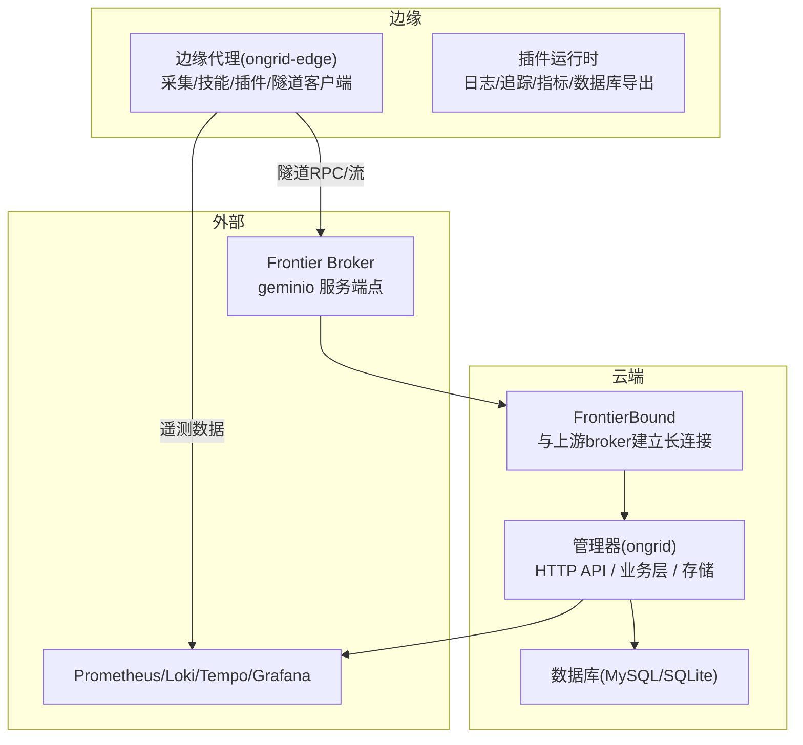
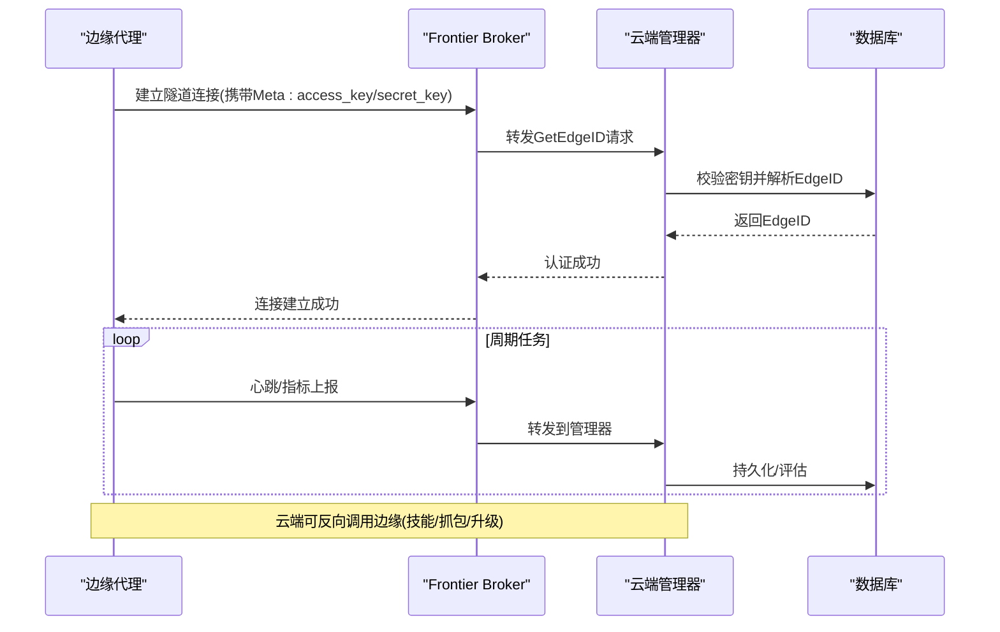
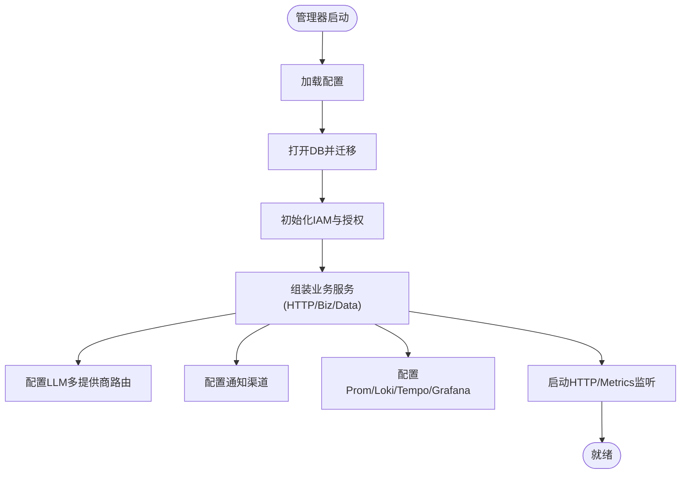
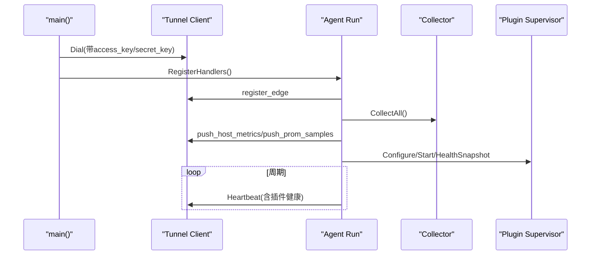
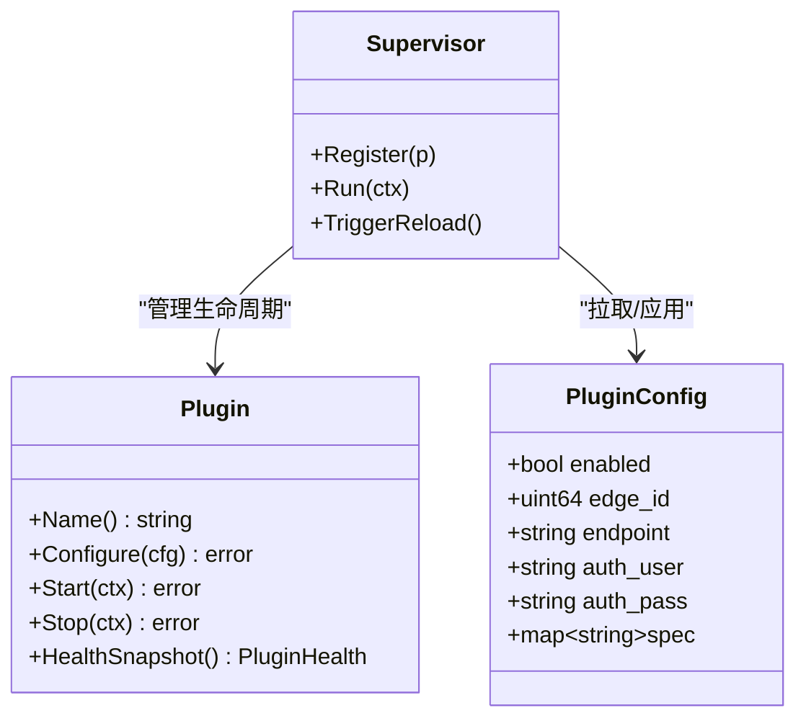
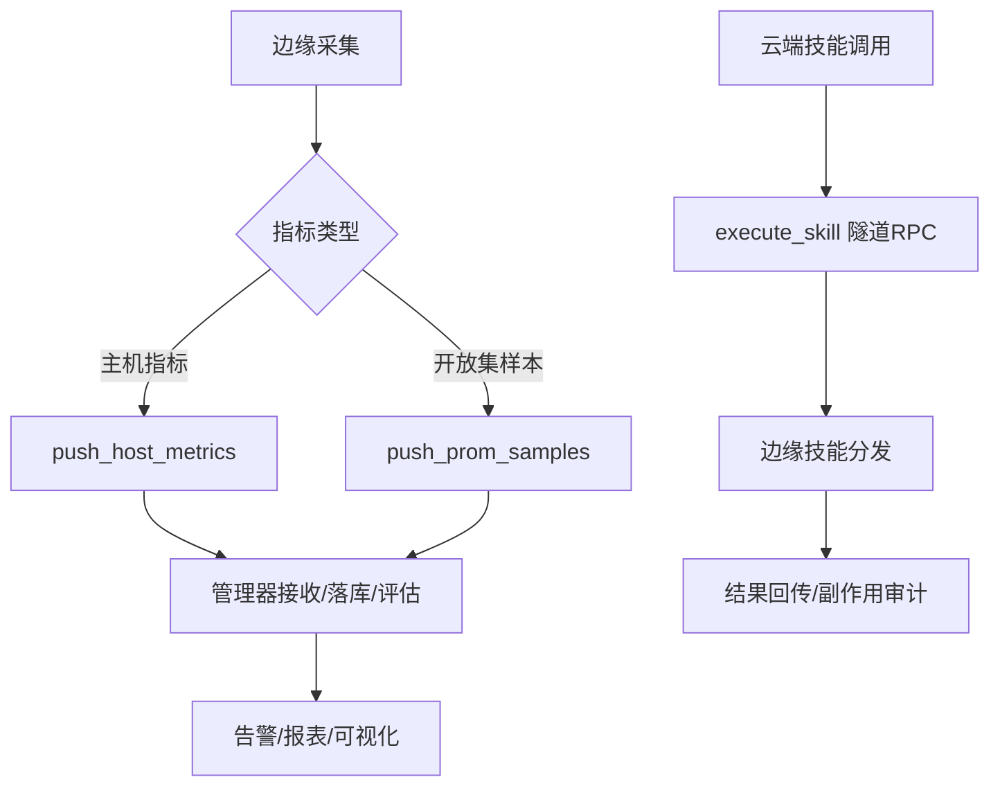
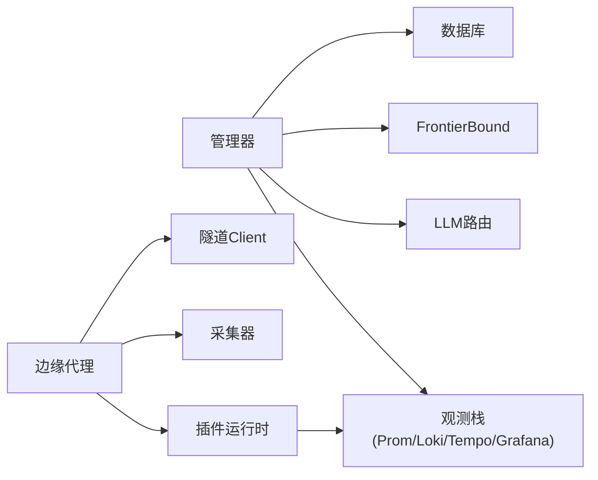

# 整体架构概览

<cite>
**本文引用的文件**
- [README.md](file://README.md)
- [cmd/ongrid/main.go](file://cmd/ongrid/main.go)
- [cmd/ongrid-edge/main.go](file://cmd/ongrid-edge/main.go)
- [internal/pkg/tunnel/types.go](file://internal/pkg/tunnel/types.go)
- [internal/pkg/tunnel/messages.go](file://internal/pkg/tunnel/messages.go)
- [internal/pkg/tunnel/doc.go](file://internal/pkg/tunnel/doc.go)
- [internal/manager/service/frontierbound/handlers.go](file://internal/manager/service/frontierbound/handlers.go)
- [internal/manager/service/frontierbound/doc.go](file://internal/manager/service/frontierbound/doc.go)
- [internal/edgeagent/biz/agent.go](file://internal/edgeagent/biz/agent.go)
- [internal/edgeagent/plugins/plugin.go](file://internal/edgeagent/plugins/plugin.go)
- [internal/manager/model/edge/plugin_config.go](file://internal/manager/model/edge/plugin_config.go)
- [internal/pkg/config/config.go](file://internal/pkg/config/config.go)
- [api/README.md](file://api/README.md)
</cite>

## 目录
1. [简介](#简介)
2. [项目结构](#项目结构)
3. [核心组件](#核心组件)
4. [架构总览](#架构总览)
5. [详细组件分析](#详细组件分析)
6. [依赖关系分析](#依赖关系分析)
7. [性能与可扩展性](#性能与可扩展性)
8. [故障排查指南](#故障排查指南)
9. [结论](#结论)

## 简介
Ongrid 采用“云端管理器 + 边缘代理”的双层架构，通过零信任安全模型、插件化扩展和事件驱动的数据面，实现跨主机与 Kubernetes 的观测、诊断与自动化运维。云端管理器负责编排、鉴权、存储与对外 API；边缘代理负责采集、执行技能、上报遥测并维护与云端的长连接通道。系统以边界清晰的微服务（bounded context）组织代码，并通过统一的隧道协议在云端与边缘之间进行双向通信。

## 项目结构
仓库按职责分层：
- cmd：可执行程序入口（云端 ongrid、边缘 ongrid-edge）
- internal：核心业务逻辑，按 bounded context 划分（iam、manager、edgeagent、skill 等）
- api：公共 API 契约（proto），作为单一事实来源
- deploy：部署脚本与 Helm Chart
- web：前端 SPA
- scripts：发布与测试脚本

图表来源
- [cmd/ongrid/main.go:1-10](file://cmd/ongrid/main.go#L1-L10)
- [cmd/ongrid-edge/main.go:1-10](file://cmd/ongrid-edge/main.go#L1-L10)
- [internal/pkg/tunnel/doc.go:1-13](file://internal/pkg/tunnel/doc.go#L1-L13)
- [internal/manager/service/frontierbound/doc.go:1-15](file://internal/manager/service/frontierbound/doc.go#L1-L15)

章节来源
- [cmd/ongrid/main.go:1-10](file://cmd/ongrid/main.go#L1-L10)
- [cmd/ongrid-edge/main.go:1-10](file://cmd/ongrid-edge/main.go#L1-L10)
- [api/README.md:1-42](file://api/README.md#L1-L42)

## 核心组件
- 云端管理器（ongrid）
  - 提供 HTTP API、鉴权（JWT）、RBAC（Casbin）、多租户组织与成员管理
  - 业务域：告警、设备/边缘、Kubernetes、日志/追踪/指标、工作流、知识、MCP、技能、报告、审批、网络拓扑等
  - 通过 FrontierBound 与上游 broker 建立长连接，注册生命周期回调并调用边缘
- 边缘代理（ongrid-edge）
  - 维护到云端的隧道连接，周期性心跳与指标上报
  - 注册云端下发的 RPC 处理器（技能执行、抓包、进程查询等）
  - 插件运行时：日志、追踪、指标、数据库导出等能力，支持子进程或进程内运行
- 隧道与消息
  - 统一 JSON RPC 与流式通道，承载心跳、指标、技能、升级、抓包等
- 配置与集成
  - 集中式环境变量配置，支持 Prometheus/Loki/Tempo/Grafana、LLM 多提供商路由、通知渠道等

章节来源
- [cmd/ongrid/main.go:208-300](file://cmd/ongrid/main.go#L208-L300)
- [cmd/ongrid-edge/main.go:66-150](file://cmd/ongrid-edge/main.go#L66-L150)
- [internal/pkg/config/config.go:18-63](file://internal/pkg/config/config.go#L18-L63)

## 架构总览
Ongrid 的核心交互由“边缘主动拨号至云端”的零信任模式驱动：
- 边缘代理通过访问密钥对认证后，建立到上游 frontier broker 的长连接
- 云端管理器通过 FrontierBound 订阅边缘上线/下线事件，并在需要时反向调用边缘
- 所有控制面与数据面均不暴露入站端口，降低攻击面

图表来源
- [internal/pkg/tunnel/types.go:8-31](file://internal/pkg/tunnel/types.go#L8-L31)
- [internal/manager/service/frontierbound/handlers.go:164-207](file://internal/manager/service/frontierbound/handlers.go#L164-L207)
- [internal/pkg/tunnel/doc.go:1-13](file://internal/pkg/tunnel/doc.go#L1-L13)

章节来源
- [internal/pkg/tunnel/types.go:8-31](file://internal/pkg/tunnel/types.go#L8-L31)
- [internal/manager/service/frontierbound/handlers.go:164-207](file://internal/manager/service/frontierbound/handlers.go#L164-L207)

## 详细组件分析

### 云端管理器（Manager）
- 启动流程
  - 加载配置、初始化日志与追踪
  - 打开数据库并执行迁移
  - 初始化 IAM（用户、组织、成员、授权策略）
  - 构建各业务域的服务层与 HTTP 处理器
  - 接入 LLM 多提供商路由、通知、监控、Grafana 集成等
- 关键职责
  - 边缘生命周期管理（注册、在线/离线状态）
  - 告警评估、知识库、工作流、技能注册与执行调度
  - 通过 FrontierBound 调用边缘执行技能、抓包、升级等

图表来源
- [cmd/ongrid/main.go:208-300](file://cmd/ongrid/main.go#L208-L300)
- [internal/pkg/config/config.go:417-549](file://internal/pkg/config/config.go#L417-L549)

章节来源
- [cmd/ongrid/main.go:208-300](file://cmd/ongrid/main.go#L208-L300)
- [internal/pkg/config/config.go:417-549](file://internal/pkg/config/config.go#L417-L549)

### 边缘代理（Edge Agent）
- 启动流程
  - 加载配置、可选 K8s 模式识别与凭证获取
  - 建立隧道客户端，注册云端下发 RPC 处理器
  - 启动采集器（嵌入式/抓取模式）与插件运行时
  - 进入主循环：心跳、指标上报、网络发现、插件健康上报
- 关键职责
  - 周期性采集主机/进程/网络信息并上报
  - 执行云端下发的技能（如抓包、探针、文件读取等）
  - 管理插件生命周期（logs/traces/metrics/db-exporters）

图表来源
- [cmd/ongrid-edge/main.go:136-150](file://cmd/ongrid-edge/main.go#L136-L150)
- [internal/edgeagent/biz/agent.go:186-271](file://internal/edgeagent/biz/agent.go#L186-L271)
- [internal/edgeagent/plugins/plugin.go:18-52](file://internal/edgeagent/plugins/plugin.go#L18-L52)

章节来源
- [cmd/ongrid-edge/main.go:136-150](file://cmd/ongrid-edge/main.go#L136-L150)
- [internal/edgeagent/biz/agent.go:186-271](file://internal/edgeagent/biz/agent.go#L186-L271)
- [internal/edgeagent/plugins/plugin.go:18-52](file://internal/edgeagent/plugins/plugin.go#L18-L52)

### 插件化架构
- 插件接口
  - Name/Configure/Start/Stop/HealthSnapshot 构成统一生命周期
  - 支持进程内（goroutine）与子进程（如 otelcol-contrib）两种形态
- 配置来源
  - 管理器侧 per-edge 配置表（enabled + spec_json），通过隧道推送
  - 本地环境变量回退，保证离线可用性
- 健康上报
  - 插件状态、错误、重启次数、目标级健康快照随心跳上报

图表来源
- [internal/edgeagent/plugins/plugin.go:18-135](file://internal/edgeagent/plugins/plugin.go#L18-L135)
- [internal/manager/model/edge/plugin_config.go:9-34](file://internal/manager/model/edge/plugin_config.go#L9-L34)

章节来源
- [internal/edgeagent/plugins/plugin.go:18-135](file://internal/edgeagent/plugins/plugin.go#L18-L135)
- [internal/manager/model/edge/plugin_config.go:9-34](file://internal/manager/model/edge/plugin_config.go#L9-L34)

### 事件驱动与数据面
- 事件来源
  - 边缘心跳、指标、网络发现、插件健康变更
  - 云端告警评估结果、工作流触发、AI 工具调用
- 数据路径
  - 指标：push_host_metrics（快速路径）与 push_prom_samples（开放集）
  - 日志/追踪：插件直推至 Loki/Tempo，经管理器公开端点鉴权
  - 技能执行：云端通过隧道下发 execute_skill，边缘分发到内置/自定义技能

图表来源
- [internal/edgeagent/biz/agent.go:608-693](file://internal/edgeagent/biz/agent.go#L608-L693)
- [internal/pkg/tunnel/messages.go:188-220](file://internal/pkg/tunnel/messages.go#L188-L220)

章节来源
- [internal/edgeagent/biz/agent.go:608-693](file://internal/edgeagent/biz/agent.go#L608-L693)
- [internal/pkg/tunnel/messages.go:188-220](file://internal/pkg/tunnel/messages.go#L188-L220)

### 零信任安全模型
- 无入站端口：边缘主动拨号至云端，避免暴露 SSH/HTTP 端口
- 强身份：每次连接携带 Meta（access_key/secret_key），云端通过 AccessKeyAuthenticator 验证并绑定 EdgeID
- 最小权限：HTTP 层使用 RBAC 中间件，敏感操作需审批与工作流约束
- 传输安全：支持 TLS CA 校验与证书配置

章节来源
- [internal/pkg/tunnel/types.go:26-31](file://internal/pkg/tunnel/types.go#L26-L31)
- [internal/manager/service/frontierbound/handlers.go:164-207](file://internal/manager/service/frontierbound/handlers.go#L164-L207)
- [internal/pkg/config/config.go:288-304](file://internal/pkg/config/config.go#L288-L304)

### 微服务边界与职责划分
- iam：用户、组织、成员、授权（Casbin）
- manager：各业务域（alert/device/k8s/logs/metric/topology/aiops/skill/report/...）
- edgeagent：采集、技能执行、插件管理、隧道客户端
- skill：技能注册与分发（内置/外部）
- pkg：共享基础设施（auth、config、tunnel、notify、prom、logquery 等）

章节来源
- [cmd/ongrid/main.go:72-196](file://cmd/ongrid/main.go#L72-L196)
- [cmd/ongrid-edge/main.go:32-56](file://cmd/ongrid-edge/main.go#L32-L56)

## 依赖关系分析
- 云端管理器依赖
  - 数据库（MySQL/SQLite）用于持久化
  - FrontierBound 用于与 broker 通信
  - LLM 多提供商路由、通知、监控、Grafana/Loki/Tempo 集成
- 边缘代理依赖
  - 隧道客户端（tunnel.Client）
  - 采集器（嵌入式/抓取）
  - 插件运行时（日志/追踪/指标/数据库导出）
- 外部依赖
  - Prometheus/Loki/Tempo/Grafana（观测栈）
  - LLM 提供商（OpenAI/Anthropic/Gemini/DeepSeek/Kimi/智谱）

图表来源
- [cmd/ongrid/main.go:208-300](file://cmd/ongrid/main.go#L208-L300)
- [cmd/ongrid-edge/main.go:136-150](file://cmd/ongrid-edge/main.go#L136-L150)
- [internal/pkg/config/config.go:417-549](file://internal/pkg/config/config.go#L417-L549)

章节来源
- [cmd/ongrid/main.go:208-300](file://cmd/ongrid/main.go#L208-L300)
- [cmd/ongrid-edge/main.go:136-150](file://cmd/ongrid-edge/main.go#L136-L150)
- [internal/pkg/config/config.go:417-549](file://internal/pkg/config/config.go#L417-L549)

## 性能与可扩展性
- 性能考量
  - 指标双路径：快速路径（host metrics）与开放集（prom samples）兼顾低延迟与高吞吐
  - 批处理与限流：指标批量推送、采样限制、超时控制
  - 插件隔离：子进程插件崩溃不影响主进程，健康快照及时上报
  - 连接恢复：隧道层自动重连，心跳失败阈值触发重新注册
- 可扩展性设计
  - 插件化：新增能力只需实现 Plugin 接口并注册
  - 多提供商 LLM：动态路由与缓存，支持热更新
  - 配置中心：per-edge 插件配置与全局设置分离，支持灰度与回滚
  - 边界清晰：bounded context 减少耦合，便于独立演进

章节来源
- [internal/edgeagent/biz/agent.go:608-693](file://internal/edgeagent/biz/agent.go#L608-L693)
- [internal/edgeagent/plugins/plugin.go:18-135](file://internal/edgeagent/plugins/plugin.go#L18-L135)
- [internal/pkg/config/config.go:417-549](file://internal/pkg/config/config.go#L417-L549)

## 故障排查指南
- 常见问题定位
  - 边缘无法注册：检查 access_key/secret_key 与云端认证逻辑
  - 心跳失败：查看连续失败计数与重新注册逻辑
  - 插件崩溃：通过健康快照中的 last_error 与 restart_count 定位
  - 指标未入库：确认 push_host_metrics/push_prom_samples 是否被接受
- 建议步骤
  - 查看管理器日志中 GetEdgeID/EdgeOnline 回调
  - 检查边缘隧道连接与 OnReconnect 回调
  - 核对插件配置（enabled/spec）与端点可达性
  - 验证数据库迁移与鉴权中间件生效

章节来源
- [internal/manager/service/frontierbound/handlers.go:164-207](file://internal/manager/service/frontierbound/handlers.go#L164-L207)
- [internal/edgeagent/biz/agent.go:530-602](file://internal/edgeagent/biz/agent.go#L530-L602)
- [internal/edgeagent/plugins/plugin.go:83-108](file://internal/edgeagent/plugins/plugin.go#L83-L108)

## 结论
Ongrid 通过“云端管理器 + 边缘代理”的双层架构，结合零信任安全、插件化扩展与事件驱动数据面，实现了高内聚、低耦合的可观测与自动化运维平台。其清晰的边界、灵活的配置与健壮的连接恢复机制，为大规模分布式环境的稳定运行提供了坚实基础。未来可在插件生态、AI 能力与多租户方面持续演进，进一步提升系统的可扩展性与易用性。