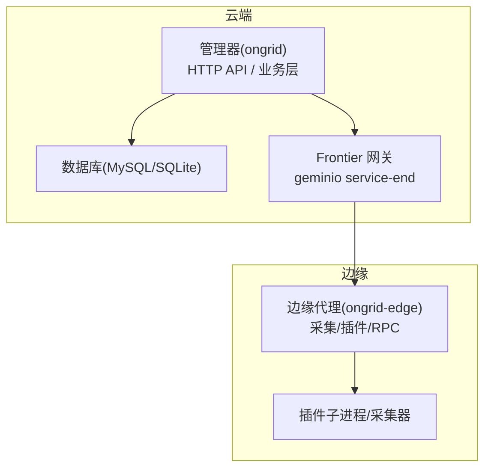
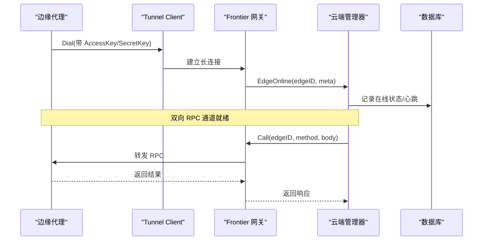
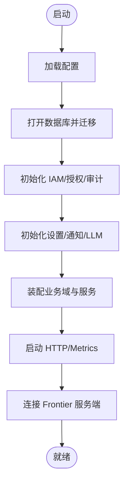
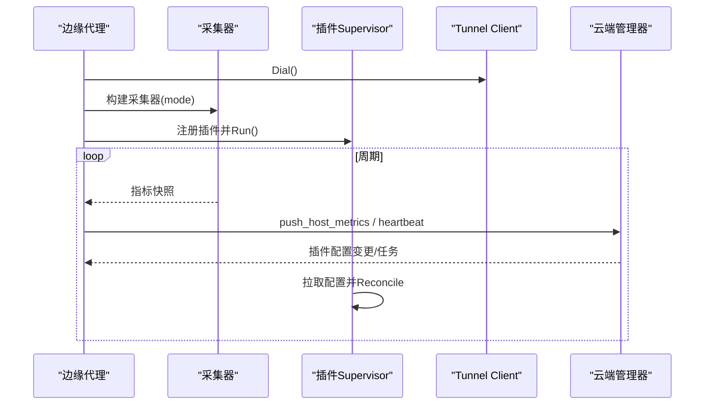
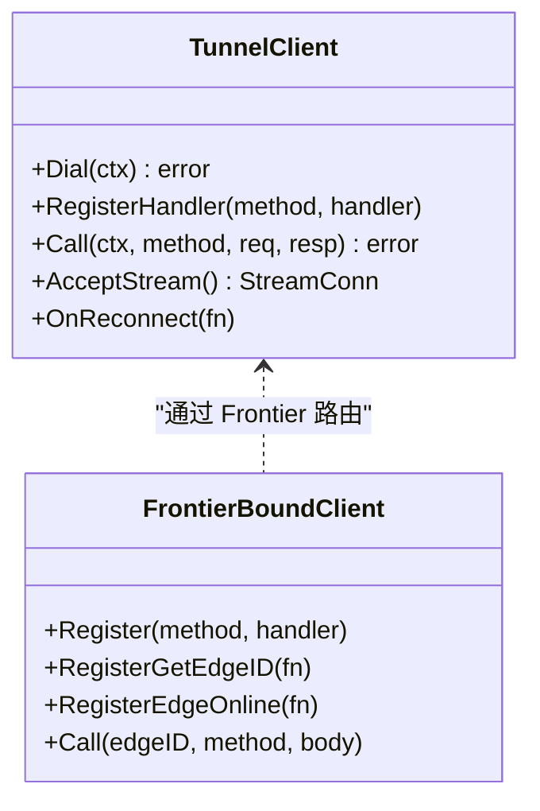
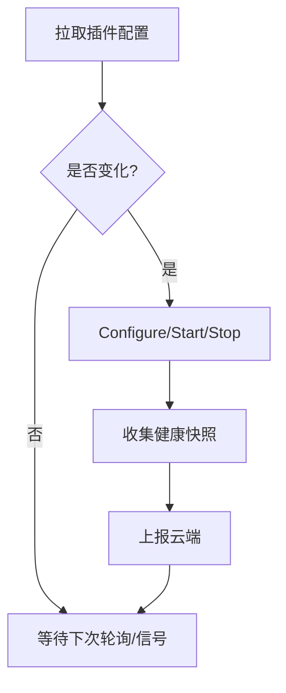
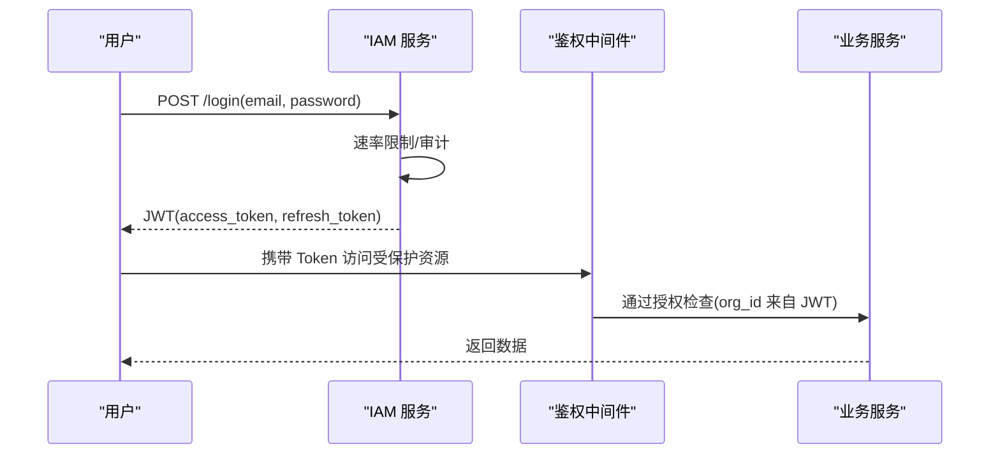
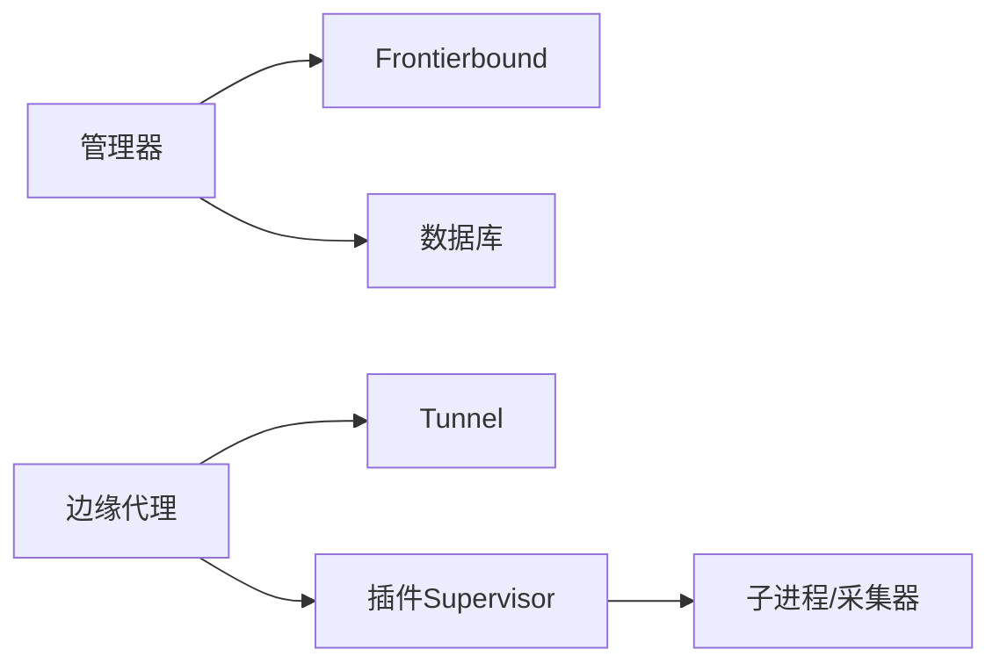

# 架构设计

<cite>
**本文引用的文件**
- [README.md](file://README.md)
- [cmd/ongrid/main.go](file://cmd/ongrid/main.go)
- [cmd/ongrid-edge/main.go](file://cmd/ongrid-edge/main.go)
- [internal/pkg/tunnel/client.go](file://internal/pkg/tunnel/client.go)
- [internal/manager/service/frontierbound/client.go](file://internal/manager/service/frontierbound/client.go)
- [internal/manager/service/frontierbound/handlers.go](file://internal/manager/service/frontierbound/handlers.go)
- [internal/edgeagent/plugins/supervisor.go](file://internal/edgeagent/plugins/supervisor.go)
- [internal/edgeagent/plugins/subprocess.go](file://internal/edgeagent/plugins/subprocess.go)
- [internal/pkg/config/config.go](file://internal/pkg/config/config.go)
- [api/README.md](file://api/README.md)
- [internal/iam/biz/authz/authz.go](file://internal/iam/biz/authz/authz.go)
- [internal/iam/server/http.go](file://internal/iam/server/http.go)
- [internal/pkg/dbx/migrate.go](file://internal/pkg/dbx/migrate.go)
</cite>

## 目录
1. [简介](#简介)
2. [项目结构](#项目结构)
3. [核心组件](#核心组件)
4. [架构总览](#架构总览)
5. [详细组件分析](#详细组件分析)
6. [依赖关系分析](#依赖关系分析)
7. [性能考量](#性能考量)
8. [故障排查指南](#故障排查指南)
9. [结论](#结论)
10. [附录](#附录)

## 简介
Ongrid 是一个面向运维的 AI Agent 平台，采用“云端管理器 + 边缘代理”的微服务架构。通过零信任安全模型、插件化扩展与事件驱动机制，实现对多集群、多主机环境的统一可观测、自动诊断与远程执行能力。系统以“边端主动拨号”的方式建立长连接通道，避免在目标主机暴露入站端口；同时提供浏览器 SSH、告警驱动的自动调查、RCA 根因定位、知识检索与技能编排等能力。

## 项目结构
仓库采用按领域边界（Bounded Context）组织：
- cmd：进程入口（云端管理器 ongrid、边缘代理 ongrid-edge）
- internal：核心实现，包含 IAM、Manager、EdgeAgent、通用工具包
- api：API 契约（proto），作为单一事实来源
- deploy：部署脚本与 Helm Chart
- db：数据库迁移脚本
- web：前端 SPA

图表来源
- [cmd/ongrid/main.go:1-13](file://cmd/ongrid/main.go#L1-L13)
- [cmd/ongrid-edge/main.go:1-3](file://cmd/ongrid-edge/main.go#L1-L3)
- [internal/pkg/tunnel/client.go:1-22](file://internal/pkg/tunnel/client.go#L1-L22)
- [internal/manager/service/frontierbound/client.go:1-15](file://internal/manager/service/frontierbound/client.go#L1-L15)

章节来源
- [cmd/ongrid/main.go:1-13](file://cmd/ongrid/main.go#L1-L13)
- [cmd/ongrid-edge/main.go:1-3](file://cmd/ongrid-edge/main.go#L1-L3)
- [api/README.md:1-42](file://api/README.md#L1-L42)

## 核心组件
- 云端管理器（ongrid）
  - 负责 HTTP 接口、IAM、AIops、告警、Kubernetes、日志/指标/追踪集成、工作流与报告等
  - 通过 Frontier 服务端 SDK 维护与边缘的长连接，并支持反向调用到指定边缘
- 边缘代理（ongrid-edge）
  - 负责向云端建立隧道、上报主机指标、注册 RPC 处理器、管理插件生命周期
  - 支持 Kubernetes 控制器/节点模式、遥测网关、插件配置热更新
- 通信层（tunnel）
  - 基于 geminio 的可靠、可重连的双向 RPC 通道，封装认证、重试、流式传输
- 插件体系（plugins）
  - Supervisor 统一管理插件配置拉取、启停、健康检查与重启；支持子进程与 in-process 插件
- 配置中心（config）
  - 集中从环境变量加载运行时配置，覆盖数据库、LLM、通知、Prometheus、Grafana、Alert 等

章节来源
- [cmd/ongrid/main.go:208-300](file://cmd/ongrid/main.go#L208-L300)
- [cmd/ongrid-edge/main.go:66-160](file://cmd/ongrid-edge/main.go#L66-L160)
- [internal/pkg/tunnel/client.go:24-85](file://internal/pkg/tunnel/client.go#L24-L85)
- [internal/edgeagent/plugins/supervisor.go:12-35](file://internal/edgeagent/plugins/supervisor.go#L12-L35)
- [internal/pkg/config/config.go:18-63](file://internal/pkg/config/config.go#L18-L63)

## 架构总览
Ongrid 采用“边端主动出网”的零信任网络模型：边缘代理主动拨号至云端 Frontier 网关，管理器通过 Frontier 反向调用边缘。所有数据面不暴露入站端口，降低攻击面。

图表来源
- [internal/pkg/tunnel/client.go:81-165](file://internal/pkg/tunnel/client.go#L81-L165)
- [internal/manager/service/frontierbound/handlers.go:164-207](file://internal/manager/service/frontierbound/handlers.go#L164-L207)
- [cmd/ongrid/main.go:1-13](file://cmd/ongrid/main.go#L1-L13)

## 详细组件分析

### 云端管理器（ongrid）
- 启动流程
  - 加载配置、初始化日志与追踪、打开数据库并执行迁移
  - 初始化 IAM（用户、组织、成员、授权策略）、审计日志、设置项、通知路由
  - 构建 LLM 多提供商路由器，注入系统设置解析器，支持热更新
  - 组装各业务域（设备、边缘、K8s、日志、指标、拓扑、Webshell、MCP、市场等）
  - 启动 HTTP 服务、Prometheus 指标、Frontier 客户端（service-end）
- 关键职责
  - 对外暴露 REST API（由 proto 定义，手写 handler）
  - 通过 Frontierbound 管理边缘生命周期（GetEdgeID、EdgeOnline、EdgeOffline）
  - 对边缘发起反向调用（如升级、遥测、工具执行）

图表来源
- [cmd/ongrid/main.go:208-300](file://cmd/ongrid/main.go#L208-L300)
- [internal/manager/service/frontierbound/client.go:1-25](file://internal/manager/service/frontierbound/client.go#L1-L25)

章节来源
- [cmd/ongrid/main.go:208-300](file://cmd/ongrid/main.go#L208-L300)
- [internal/manager/service/frontierbound/client.go:1-25](file://internal/manager/service/frontierbound/client.go#L1-L25)

### 边缘代理（ongrid-edge）
- 启动流程
  - 处理 K8s 命令模式（host runtime、upgrade、enroll）
  - 加载配置、创建 Prometheus 指标、建立 Tunnel 客户端
  - 根据模式构建采集器（embedded/scrape/off/auto）
  - 注册宿主能力（bash、host_files、restart_service、operator、webshell）
  - 运行 Agent 主循环，按需启用插件运行时（logs/traces/metrics/hostmetrics/procmetrics/databasemetrics）
- 关键职责
  - 维持与云端的长连接，周期性上报指标与健康快照
  - 接收云端反向调用，执行宿主机操作或插件任务
  - 在 K8s 模式下支持控制器/节点角色与遥测网关

图表来源
- [cmd/ongrid-edge/main.go:136-160](file://cmd/ongrid-edge/main.go#L136-L160)
- [cmd/ongrid-edge/main.go:222-280](file://cmd/ongrid-edge/main.go#L222-L280)
- [internal/edgeagent/plugins/supervisor.go:112-133](file://internal/edgeagent/plugins/supervisor.go#L112-L133)

章节来源
- [cmd/ongrid-edge/main.go:66-160](file://cmd/ongrid-edge/main.go#L66-L160)
- [cmd/ongrid-edge/main.go:222-280](file://cmd/ongrid-edge/main.go#L222-L280)
- [internal/edgeagent/plugins/supervisor.go:112-133](file://internal/edgeagent/plugins/supervisor.go#L112-L133)

### 通信协议与通道（Tunnel）
- 使用 geminio 建立可靠的、可重连的双向 RPC 通道
- 边缘侧维护连接代数与回退策略，遇到路由失效时自动回收并重连
- 云端通过 Frontierbound 将边缘身份映射为 edgeID，并分发反向调用

图表来源
- [internal/pkg/tunnel/client.go:24-85](file://internal/pkg/tunnel/client.go#L24-L85)
- [internal/manager/service/frontierbound/client.go:179-218](file://internal/manager/service/frontierbound/client.go#L179-L218)

章节来源
- [internal/pkg/tunnel/client.go:24-85](file://internal/pkg/tunnel/client.go#L24-L85)
- [internal/manager/service/frontierbound/client.go:179-218](file://internal/manager/service/frontierbound/client.go#L179-L218)

### 插件化架构（Plugins）
- Supervisor 负责：
  - 定期从云端拉取插件配置快照
  - 对比期望态与实际态，执行 Configure/Start/Stop
  - 收集健康快照并通过心跳上报
  - 支持子进程插件的崩溃重启与优雅关闭
- 插件类型：
  - 子进程插件（logs、traces、hostmetrics、procmetrics、databasemetrics）
  - 进程内插件（metrics、custommetrics）

图表来源
- [internal/edgeagent/plugins/supervisor.go:135-243](file://internal/edgeagent/plugins/supervisor.go#L135-L243)
- [internal/edgeagent/plugins/subprocess.go:208-308](file://internal/edgeagent/plugins/subprocess.go#L208-L308)

章节来源
- [internal/edgeagent/plugins/supervisor.go:135-243](file://internal/edgeagent/plugins/supervisor.go#L135-L243)
- [internal/edgeagent/plugins/subprocess.go:208-308](file://internal/edgeagent/plugins/subprocess.go#L208-L308)

### 零信任安全模型
- 认证与授权
  - 登录流程：速率限制、失败审计、JWT 签发
  - 授权：基于 Casbin 的 RBAC，组织级隔离，超级用户短路保护
- 数据传输
  - 边缘主动拨号，无入站端口暴露
  - 连接元数据携带 AccessKey/SecretKey，云端校验后绑定 edgeID
- 密钥与凭据
  - 加密凭证库、系统设置中的敏感字段、TLS CA 校验

图表来源
- [internal/iam/server/http.go:221-269](file://internal/iam/server/http.go#L221-L269)
- [internal/iam/biz/authz/authz.go:1-44](file://internal/iam/biz/authz/authz.go#L1-L44)
- [internal/manager/service/frontierbound/handlers.go:164-207](file://internal/manager/service/frontierbound/handlers.go#L164-L207)

章节来源
- [internal/iam/server/http.go:221-269](file://internal/iam/server/http.go#L221-L269)
- [internal/iam/biz/authz/authz.go:1-44](file://internal/iam/biz/authz/authz.go#L1-L44)
- [internal/manager/service/frontierbound/handlers.go:164-207](file://internal/manager/service/frontierbound/handlers.go#L164-L207)

### 事件驱动与可扩展性
- 事件驱动
  - 插件配置变更通过 RPC 触发 Supervisor 重新拉取并 Reconcile
  - 边缘心跳与指标推送形成持续的事件流，驱动告警评估与可视化
- 可扩展点
  - 新增插件：实现 Plugin 接口，注册到 Supervisor
  - 新增业务域：遵循 Bounded Context 分层（biz/data/model/server/service）
  - 新增 LLM 提供商：通过配置注入 ProviderConfig，动态路由

章节来源
- [internal/edgeagent/plugins/supervisor.go:84-92](file://internal/edgeagent/plugins/supervisor.go#L84-L92)
- [internal/pkg/config/config.go:457-482](file://internal/pkg/config/config.go#L457-L482)

## 依赖关系分析
- 组件耦合
  - 管理器依赖 Frontierbound 与数据库；边缘依赖 Tunnel 与插件系统
  - 插件系统与边缘强耦合，但通过 Supervisor 抽象解耦具体实现
- 外部依赖
  - Frontier（geminio）：消息路由与长连接
  - 数据库：MySQL（生产）/ SQLite（开发）
  - 可观测栈：Prometheus/Loki/Tempo/Grafana（可选）
- 潜在循环依赖
  - 通过分层（server/biz/data）与接口（Caller/Plugin）避免循环

图表来源
- [cmd/ongrid/main.go:208-300](file://cmd/ongrid/main.go#L208-L300)
- [cmd/ongrid-edge/main.go:136-160](file://cmd/ongrid-edge/main.go#L136-L160)
- [internal/edgeagent/plugins/supervisor.go:112-133](file://internal/edgeagent/plugins/supervisor.go#L112-L133)

章节来源
- [cmd/ongrid/main.go:208-300](file://cmd/ongrid/main.go#L208-L300)
- [cmd/ongrid-edge/main.go:136-160](file://cmd/ongrid-edge/main.go#L136-L160)
- [internal/edgeagent/plugins/supervisor.go:112-133](file://internal/edgeagent/plugins/supervisor.go#L112-L133)

## 性能考量
- 连接与重连
  - Tunnel 客户端指数退避重连，最大 60s；连接代数避免并发竞态
- 数据采集
  - 支持 embedded/scrape/off 多种模式，减少重复采样与噪声
  - 插件子进程崩溃重启带指数退避，上限 5 分钟
- 数据库
  - GORM AutoMigrate 顺序执行，慢迁移有日志；SQLite 开启 WAL 与外键约束
- 可观测性
  - 内置 Prometheus 指标与 OTel 追踪，便于定位瓶颈

章节来源
- [internal/pkg/tunnel/client.go:81-165](file://internal/pkg/tunnel/client.go#L81-L165)
- [internal/edgeagent/plugins/subprocess.go:267-308](file://internal/edgeagent/plugins/subprocess.go#L267-L308)
- [internal/pkg/dbx/migrate.go:20-46](file://internal/pkg/dbx/migrate.go#L20-L46)
- [internal/pkg/dbx/dbx.go:79-128](file://internal/pkg/dbx/dbx.go#L79-L128)

## 故障排查指南
- 连接问题
  - 检查边缘 CloudAddr、AccessKey/SecretKey；查看 Tunnel Dial 日志与重连次数
- 插件异常
  - 查看 Supervisor reconcile 日志与插件健康快照；确认二进制存在与工作目录权限
- 数据库迁移
  - 关注 RunMigrations 索引与耗时；确认 DSN 与方言正确
- 认证失败
  - 检查 IAM 登录速率限制与审计事件；确认 JWT Secret 已替换默认值

章节来源
- [internal/pkg/tunnel/client.go:145-165](file://internal/pkg/tunnel/client.go#L145-L165)
- [internal/edgeagent/plugins/subprocess.go:216-228](file://internal/edgeagent/plugins/subprocess.go#L216-L228)
- [internal/pkg/dbx/migrate.go:20-46](file://internal/pkg/dbx/migrate.go#L20-L46)
- [internal/iam/server/http.go:221-269](file://internal/iam/server/http.go#L221-L269)

## 结论
Ongrid 通过“边端主动出网”的零信任模型、插件化架构与事件驱动机制，实现了高可用、可扩展的云边协同运维平台。管理器聚焦业务编排与对外 API，边缘代理专注数据采集与本地执行，二者通过 Tunnel 与 Frontier 进行稳定通信。系统在安全性、可观测性与可维护性方面做了充分设计，适合大规模多云/多集群环境。

## 附录
- API 契约
  - 所有公共 API 以 proto 定义，REST 由手写 handler 实现，确保前后端一致
- 部署与配置
  - 通过环境变量集中配置，支持 MySQL/SQLite、多 LLM 提供商、通知渠道、Prometheus/Grafana/Loki/Tempo 集成

章节来源
- [api/README.md:1-42](file://api/README.md#L1-L42)
- [internal/pkg/config/config.go:417-549](file://internal/pkg/config/config.go#L417-L549)