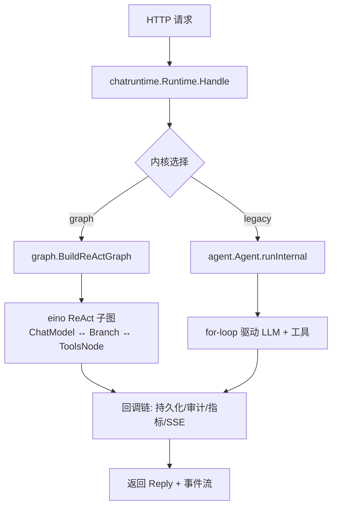
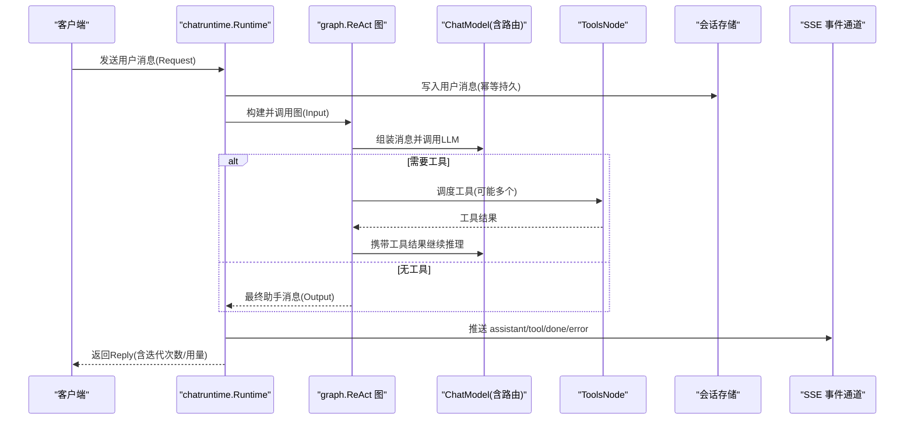
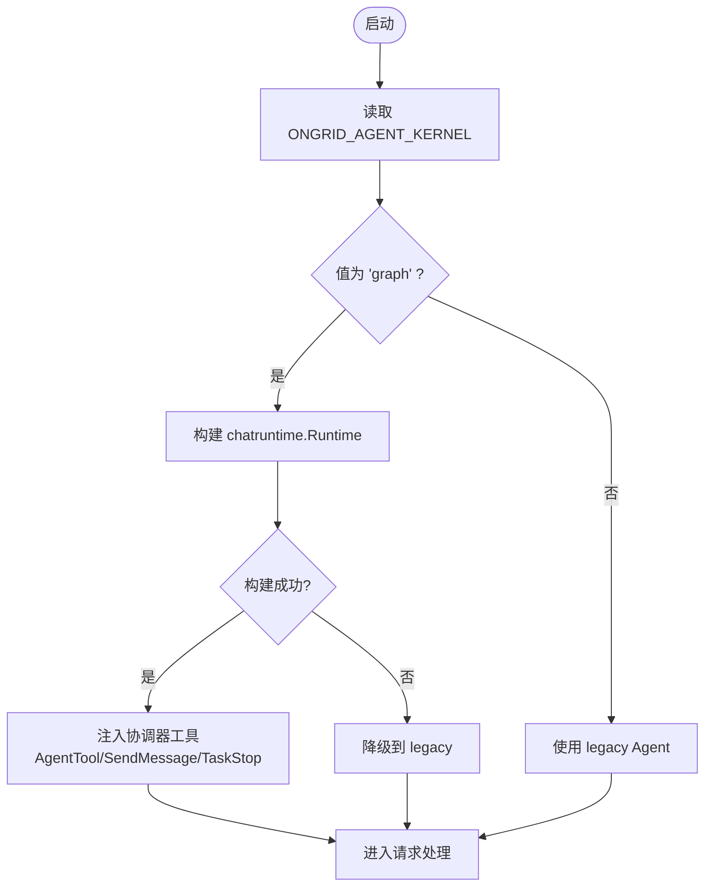
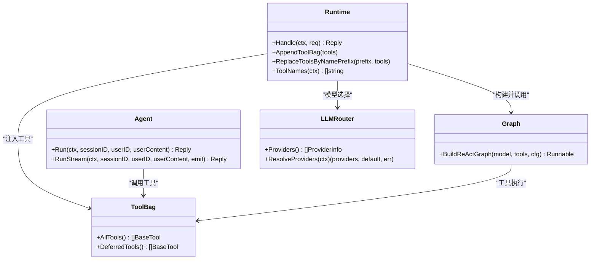

# AI Agent 协调器

<cite>
**本文引用的文件**
- [internal/manager/biz/aiops/chatruntime/runtime.go](file://internal/manager/biz/aiops/chatruntime/runtime.go)
- [internal/manager/biz/aiops/graph/types.go](file://internal/manager/biz/aiops/graph/types.go)
- [internal/manager/biz/aiops/graph/react.go](file://internal/manager/biz/aiops/graph/react.go)
- [internal/manager/biz/aiops/agent/agent.go](file://internal/manager/biz/aiops/agent/agent.go)
- [cmd/ongrid/main.go](file://cmd/ongrid/main.go)
- [internal/manager/service/aiops/service_kernel_test.go](file://internal/manager/service/aiops/service_kernel_test.go)
- [cmd/ongrid/main_kernel_test.go](file://cmd/ongrid/main_kernel_test.go)
- [internal/manager/biz/aiops/tools/config_tools.go](file://internal/manager/biz/aiops/tools/config_tools.go)
- [internal/manager/biz/aiops/tools/decorators/review_gate.go](file://internal/manager/biz/aiops/tools/decorators/review_gate.go)
- [internal/pkg/llm/client.go](file://internal/pkg/llm/client.go)
- [internal/pkg/llm/router.go](file://internal/pkg/llm/router.go)
</cite>

## 目录
1. [简介](#简介)
2. [项目结构](#项目结构)
3. [核心组件](#核心组件)
4. [架构总览](#架构总览)
5. [详细组件分析](#详细组件分析)
6. [依赖关系分析](#依赖关系分析)
7. [性能与资源管理](#性能与资源管理)
8. [故障排查指南](#故障排查指南)
9. [结论](#结论)
10. [附录：配置与使用示例](#附录：配置与使用示例)

## 简介
本文件面向“AI Agent 协调器”的深入技术文档，聚焦以下目标：
- 对话循环管理、工具调用调度、会话状态维护与上下文处理
- 两种内核模式（legacy 与 graph）的工作原理与切换机制
- Agent 生命周期管理、错误处理策略、超时控制与资源清理
- 与 LLM 提供商的交互流程、工具注册表管理与执行结果处理
- 提供具体代码路径，展示如何配置和使用不同内核模式

该协调器在管理器侧承载用户消息到 LLM 的完整闭环：组装上下文、驱动 ReAct 循环、调度工具、持久化会话与审计指标，并以 SSE 流式事件向前端反馈。

## 项目结构
- 协调器入口与运行时编排位于 chatruntime.Runtime，负责权限校验、技能解析、系统提示组装、历史加载、图构建与回调链装配，并统一对外暴露 Handle 接口。
- 图内核基于 cloudwego/eino 的 ReAct 子图，封装 MessageAssembler → ReActSubgraph → OutputProjector 的标准拓扑，屏蔽内部细节并提供稳定的节点名用于审计与 SSE。
- 遗留内核 agent.Agent 以 for-loop 形式实现相同语义：轮询 LLM、串行执行工具、持久化消息与工具调用、SSE 事件推送。
- 启动层 cmd/ongrid/main.go 根据环境变量选择内核，并在 graph 模式下注入协调器专属工具（AgentTool/SendMessage/TaskStop）。

图表来源
- [internal/manager/biz/aiops/chatruntime/runtime.go:516-800](file://internal/manager/biz/aiops/chatruntime/runtime.go#L516-L800)
- [internal/manager/biz/aiops/graph/react.go:45-188](file://internal/manager/biz/aiops/graph/react.go#L45-L188)
- [internal/manager/biz/aiops/agent/agent.go:331-723](file://internal/manager/biz/aiops/agent/agent.go#L331-L723)

章节来源
- [internal/manager/biz/aiops/chatruntime/runtime.go:1-800](file://internal/manager/biz/aiops/chatruntime/runtime.go#L1-L800)
- [internal/manager/biz/aiops/graph/react.go:1-188](file://internal/manager/biz/aiops/graph/react.go#L1-L188)
- [internal/manager/biz/aiops/agent/agent.go:1-800](file://internal/manager/biz/aiops/agent/agent.go#L1-L800)
- [cmd/ongrid/main.go:1530-1729](file://cmd/ongrid/main.go#L1530-L1729)

## 核心组件
- chatruntime.Runtime：进程内编排入口，负责会话所有权校验、@-mention 内联、系统提示组装、历史加载、图构建、回调链装配、SSE 事件映射与最终 Reply 翻译。
- graph.ReAct 图：基于 eino 的 ReAct 子图，提供标准对话循环；外层包装 MessageAssembler 与 OutputProjector，稳定节点名便于审计与 SSE。
- agent.Agent：遗留内核，显式 for-loop 驱动 LLM 与工具，保持与前端一致的 SSE 事件形状。
- 工具注册表与装饰器链：BaseTool 列表经装饰器（如 ReviewGate）后注入图或 legacy 路径；支持动态替换与按前缀替换。
- LLM 路由与模型选择：通过 RoutingChatModel 与 per-call model/provider 选项，支持运行时模型选择与预算限制。

章节来源
- [internal/manager/biz/aiops/chatruntime/runtime.go:179-245](file://internal/manager/biz/aiops/chatruntime/runtime.go#L179-L245)
- [internal/manager/biz/aiops/graph/types.go:38-180](file://internal/manager/biz/aiops/graph/types.go#L38-L180)
- [internal/manager/biz/aiops/agent/agent.go:40-62](file://internal/manager/biz/aiops/agent/agent.go#L40-L62)
- [internal/manager/biz/aiops/tools/config_tools.go:1-200](file://internal/manager/biz/aiops/tools/config_tools.go#L1-L200)
- [internal/pkg/llm/router.go:1-200](file://internal/pkg/llm/router.go#L1-L200)

## 架构总览
协调器将“用户消息”转化为“可执行的 ReAct 循环”，在图内核中由 eino 管理分支与工具节点；在遗留内核中由 for-loop 显式管理。两者均通过回调链完成持久化、审计、指标与 SSE 事件输出。

图表来源
- [internal/manager/biz/aiops/chatruntime/runtime.go:516-800](file://internal/manager/biz/aiops/chatruntime/runtime.go#L516-L800)
- [internal/manager/biz/aiops/graph/react.go:45-188](file://internal/manager/biz/aiops/graph/react.go#L45-L188)
- [internal/manager/biz/aiops/agent/agent.go:331-723](file://internal/manager/biz/aiops/agent/agent.go#L331-L723)

## 详细组件分析

### 对话循环与上下文处理
- 图内核：MessageAssembler 将 Input(SystemPrompt、History、UserText、MentionsRendered、AgentReminder、DynamicHints、Locale) 转换为 eino 消息序列，并在每轮注入 system-reminder 块以保持长期会话的规则不漂移。OutputProjector 提取最终助手消息与用量。
- 遗留内核：显式 for-loop 每次调用 LLM，追加助手消息与工具结果到工作历史，直到无工具调用或达到最大迭代次数。
- 上下文增强：@-mention 内联为 markdown 前导文本；语言指令（Locale）被注入系统提示与提醒块，确保回答语言一致。

章节来源
- [internal/manager/biz/aiops/graph/react.go:137-188](file://internal/manager/biz/aiops/graph/react.go#L137-L188)
- [internal/manager/biz/aiops/graph/react.go:190-355](file://internal/manager/biz/aiops/graph/react.go#L190-L355)
- [internal/manager/biz/aiops/agent/agent.go:331-723](file://internal/manager/biz/aiops/agent/agent.go#L331-L723)

### 工具调用调度与结果处理
- 图内核：ToolsNode 接收模型的工具调用，未知工具通过 UnknownToolsHandler 返回友好提示，避免中断运行；工具结果通过回调链持久化并回灌给模型继续推理。
- 遗留内核：串行执行每个工具，记录 pending/success/error/timeout，持久化工具消息并追加到历史。
- 工具注册表：BaseTool 列表经装饰器链（如 ReviewGate）后注入；支持 AppendToolBag、ReplaceToolsByNamePrefix 动态更新；视图角色与写能力门控会过滤工具集合。

章节来源
- [internal/manager/biz/aiops/graph/react.go:88-130](file://internal/manager/biz/aiops/graph/react.go#L88-L130)
- [internal/manager/biz/aiops/chatruntime/runtime.go:374-445](file://internal/manager/biz/aiops/chatruntime/runtime.go#L374-L445)
- [internal/manager/biz/aiops/agent/agent.go:492-692](file://internal/manager/biz/aiops/agent/agent.go#L492-L692)
- [internal/manager/biz/aiops/tools/decorators/review_gate.go:1-200](file://internal/manager/biz/aiops/tools/decorators/review_gate.go#L1-L200)

### 会话状态维护与审计
- 会话所有权校验：Handle 先获取 Session 并校验 UserID，非所有者返回 NotFound，避免泄露存在性信息。
- 持久化顺序：先持久化用户消息，再运行图/loop；助手与工具结果通过回调链或显式写入；审计、指标、SSE 通过回调链统一接入。
- 历史回放：从存储读取最近 N 条消息，转换为 eino 消息或 llm.Message 供模型消费；工具调用 ID 配对与重放逻辑保证严格格式。

章节来源
- [internal/manager/biz/aiops/chatruntime/runtime.go:516-578](file://internal/manager/biz/aiops/chatruntime/runtime.go#L516-L578)
- [internal/manager/biz/aiops/agent/agent.go:331-395](file://internal/manager/biz/aiops/agent/agent.go#L331-L395)
- [internal/manager/biz/aiops/agent/agent.go:725-800](file://internal/manager/biz/aiops/agent/agent.go#L725-L800)

### 内核模式与切换机制
- 环境变量：ONGRID_AGENT_KERNEL 决定内核模式。默认行为在测试中显示为 graph（新内核），但服务层对非法值回退到 legacy。
- 启动时构建：当 kernel=graph 时，尝试构建 chatruntime.Runtime；若失败则降级到 legacy，避免启动崩溃。
- 服务层分发：service.NewWithKernel 根据 Kernel 类型分派到 Runtime 或 legacy Agent；非所有者检查在服务层提前完成。

图表来源
- [cmd/ongrid/main.go:1530-1598](file://cmd/ongrid/main.go#L1530-L1598)
- [internal/manager/service/aiops/service_kernel_test.go:121-141](file://internal/manager/service/aiops/service_kernel_test.go#L121-L141)
- [cmd/ongrid/main_kernel_test.go:10-56](file://cmd/ongrid/main_kernel_test.go#L10-L56)

章节来源
- [cmd/ongrid/main.go:1530-1598](file://cmd/ongrid/main.go#L1530-L1598)
- [internal/manager/service/aiops/service_kernel_test.go:121-141](file://internal/manager/service/aiops/service_kernel_test.go#L121-L141)
- [cmd/ongrid/main_kernel_test.go:10-56](file://cmd/ongrid/main_kernel_test.go#L10-L56)

### Agent 生命周期管理
- 构造期：Runtime 要求 Sessions 与 ChatModel；默认 HistoryLimit 为 50；日志器可选。
- 运行期：Handle 完成权限校验、上下文组装、图构建与回调链装配；SSE 事件在回调链中发射；Reply 包含最终消息、迭代次数与用量。
- 结束期：图完成后输出 AssistantMessage、Usage；遗留内核在达到 MaxIterations 时输出友好提示并终止。

章节来源
- [internal/manager/biz/aiops/chatruntime/runtime.go:306-323](file://internal/manager/biz/aiops/chatruntime/runtime.go#L306-L323)
- [internal/manager/biz/aiops/chatruntime/runtime.go:516-800](file://internal/manager/biz/aiops/chatruntime/runtime.go#L516-L800)
- [internal/manager/biz/aiops/agent/agent.go:695-723](file://internal/manager/biz/aiops/agent/agent.go#L695-L723)

### 错误处理策略
- 未知工具：图内核通过 UnknownToolsHandler 返回友好提示，避免中断；遗留内核对 web_search 禁用与 mutating 工具进行本地拒绝。
- 超时控制：工具级超时由 BaseTool 装饰器链与 Config.ToolTimeout 控制；遗留内核对特定工具设置更长超时。
- 最大迭代：图内核通过 MaxStep 与 MaxIterations 双重保护；遗留内核在达到上限时输出总结性消息并返回。

章节来源
- [internal/manager/biz/aiops/graph/react.go:97-130](file://internal/manager/biz/aiops/graph/react.go#L97-L130)
- [internal/manager/biz/aiops/agent/agent.go:248-253](file://internal/manager/biz/aiops/agent/agent.go#L248-L253)
- [internal/manager/biz/aiops/agent/agent.go:419-723](file://internal/manager/biz/aiops/agent/agent.go#L419-L723)

### 与 LLM 提供商的交互流程
- 模型选择：per-call Provider/Model 通过 compose.WithChatModelOption 传入；RoutingChatModel.pick 消费 WithProvider，底层 clientChatModel 消费 WithModel。
- 预算与指标：MetricsHandler 统计每轮 ChatModel 调用次数与 token 用量；BudgetStopModel 包装模型以支持预算停止。
- 健康检查：系统健康检查可探测 LLM provider 是否配置与可用。

章节来源
- [internal/manager/biz/aiops/chatruntime/runtime.go:761-786](file://internal/manager/biz/aiops/chatruntime/runtime.go#L761-L786)
- [internal/manager/biz/aiops/graph/types.go:132-180](file://internal/manager/biz/aiops/graph/types.go#L132-L180)
- [internal/pkg/llm/client.go:1-200](file://internal/pkg/llm/client.go#L1-L200)
- [internal/pkg/llm/router.go:1-200](file://internal/pkg/llm/router.go#L1-L200)

### 工具注册表管理与执行结果处理
- 注册与装饰：BaseTool 列表经装饰器链（ReviewGate 等）后注入；支持 AppendToolBag 与 ReplaceToolsByNamePrefix 动态更新。
- 权限门控：viewer 角色与 AgentWriteEnabled 开关会过滤写工具；session 的 persona 也可进一步约束工具可见性。
- 结果处理：工具执行结果通过回调链持久化为 tool_call 行与 role=tool 消息；SSE 事件 tool_start/tool_end 推送进度与结果摘要。

章节来源
- [internal/manager/biz/aiops/chatruntime/runtime.go:374-445](file://internal/manager/biz/aiops/chatruntime/runtime.go#L374-L445)
- [internal/manager/biz/aiops/chatruntime/runtime.go:597-700](file://internal/manager/biz/aiops/chatruntime/runtime.go#L597-L700)
- [internal/manager/biz/aiops/agent/agent.go:492-692](file://internal/manager/biz/aiops/agent/agent.go#L492-L692)

## 依赖关系分析
- chatruntime.Runtime 依赖：
  - SessionRepo：会话与消息持久化
  - ToolCallingChatModel：LLM 调用与工具调用
  - SkillRegistry/AgentRegistry：技能与人格解析
  - CallbackDeps：持久化、审计、指标、SSE 等横切依赖
- graph.ReAct 依赖：
  - eino 的 react.Agent 与 ToolsNode
  - BaseTool 适配器（WrapBaseTools）
- agent.Agent 依赖：
  - llm.Client、tools.Registry、SessionRepo
  - MentionResolver、装饰器链（legacy 下需额外安全门控）

图表来源
- [internal/manager/biz/aiops/chatruntime/runtime.go:279-514](file://internal/manager/biz/aiops/chatruntime/runtime.go#L279-L514)
- [internal/manager/biz/aiops/graph/react.go:78-188](file://internal/manager/biz/aiops/graph/react.go#L78-L188)
- [internal/manager/biz/aiops/agent/agent.go:255-301](file://internal/manager/biz/aiops/agent/agent.go#L255-L301)
- [internal/pkg/llm/router.go:1-200](file://internal/pkg/llm/router.go#L1-L200)

章节来源
- [internal/manager/biz/aiops/chatruntime/runtime.go:279-514](file://internal/manager/biz/aiops/chatruntime/runtime.go#L279-L514)
- [internal/manager/biz/aiops/graph/react.go:78-188](file://internal/manager/biz/aiops/graph/react.go#L78-L188)
- [internal/manager/biz/aiops/agent/agent.go:255-301](file://internal/manager/biz/aiops/agent/agent.go#L255-L301)
- [internal/pkg/llm/router.go:1-200](file://internal/pkg/llm/router.go#L1-L200)

## 性能与资源管理
- 图构建成本：每次请求构建图（轻量），未来可按 (toolBag 标识, cfg) 缓存以提升吞吐。
- 迭代预算：MaxIterations 与 MaxStep 共同限制；persona 级别可覆盖 MaxTurns，防止协调器无限循环。
- 工具超时：Config.ToolTimeout 默认 15s；协调器工具（AgentTool）使用更长超时以避免误杀。
- 资源清理：回调链负责持久化与审计；SSE 事件在请求结束时释放；worker 生命周期由 Runtime 管理，后续 PR 将增加 TTL 清理。

章节来源
- [internal/manager/biz/aiops/chatruntime/runtime.go:706-744](file://internal/manager/biz/aiops/chatruntime/runtime.go#L706-L744)
- [internal/manager/biz/aiops/graph/types.go:132-180](file://internal/manager/biz/aiops/graph/types.go#L132-L180)
- [cmd/ongrid/main.go:1566-1592](file://cmd/ongrid/main.go#L1566-L1592)

## 故障排查指南
- 无法选择模型：检查 per-call Provider/Model 是否正确传入；确认 RoutingChatModel 已配置且 ResolveProviders 返回有效提供者。
- 工具不可用：图内核 UnknownToolsHandler 会返回友好提示；检查工具注册表是否包含该工具，或是否被 persona/权限门控过滤。
- 会话无响应：确认用户消息已持久化；检查历史加载与 @-mention 内联是否生效；查看 SSE 事件是否有 assistant/tool/done/error。
- 内核切换异常：验证 ONGRID_AGENT_KERNEL 值；graph 构建失败会自动降级到 legacy；服务层对非所有者请求直接返回 NotFound。

章节来源
- [internal/manager/biz/aiops/graph/react.go:97-130](file://internal/manager/biz/aiops/graph/react.go#L97-L130)
- [internal/manager/biz/aiops/chatruntime/runtime.go:516-578](file://internal/manager/biz/aiops/chatruntime/runtime.go#L516-L578)
- [internal/manager/service/aiops/service_kernel_test.go:240-273](file://internal/manager/service/aiops/service_kernel_test.go#L240-L273)

## 结论
AI Agent 协调器通过 chatruntime.Runtime 统一编排对话循环、工具调度与会话状态，支持两种内核模式以满足不同部署需求。图内核利用 eino 的 ReAct 子图提供稳定拓扑与审计能力；遗留内核保持向后兼容。通过权限门控、预算限制与超时控制，系统在安全性与稳定性之间取得平衡。

## 附录：配置与使用示例

### 启用 graph 内核
- 设置环境变量：
  - 名称：ONGRID_AGENT_KERNEL
  - 值：graph
- 启动时会尝试构建 chatruntime.Runtime；若失败则自动降级到 legacy。

章节来源
- [cmd/ongrid/main.go:1530-1598](file://cmd/ongrid/main.go#L1530-L1598)
- [cmd/ongrid/main_kernel_test.go:10-56](file://cmd/ongrid/main_kernel_test.go#L10-L56)

### 配置 per-call 模型与提供商
- 在 Request 中设置 Provider 与 Model；运行时通过 compose.WithChatModelOption 传入 ChatModel 节点。
- 适用于 SPA 模型选择器场景，确保用户选择的模型生效。

章节来源
- [internal/manager/biz/aiops/chatruntime/runtime.go:761-786](file://internal/manager/biz/aiops/chatruntime/runtime.go#L761-L786)

### 动态更新工具注册表
- 使用 AppendToolBag 添加协调器专属工具（AgentTool/SendMessage/TaskStop）。
- 使用 ReplaceToolsByNamePrefix 按前缀替换工具（例如 MCP 服务器刷新）。

章节来源
- [internal/manager/biz/aiops/chatruntime/runtime.go:374-445](file://internal/manager/biz/aiops/chatruntime/runtime.go#L374-L445)
- [cmd/ongrid/main.go:1566-1592](file://cmd/ongrid/main.go#L1566-L1592)

### 限制写操作与只读模式
- 设置 AgentWriteEnabled 函数，返回 false 时强制只读工具集。
- viewer 角色自动过滤写工具；persona 也可进一步约束工具可见性。

章节来源
- [internal/manager/biz/aiops/chatruntime/runtime.go:634-700](file://internal/manager/biz/aiops/chatruntime/runtime.go#L634-L700)