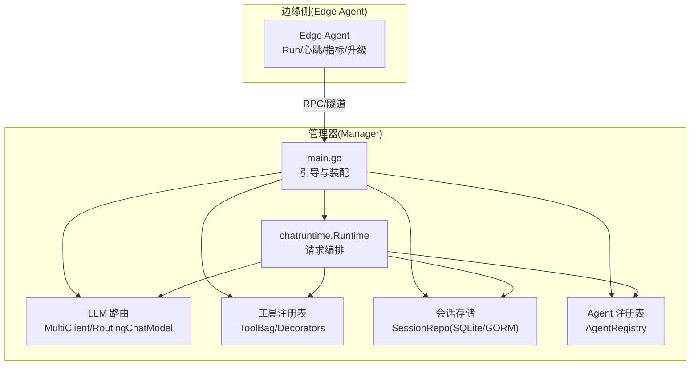
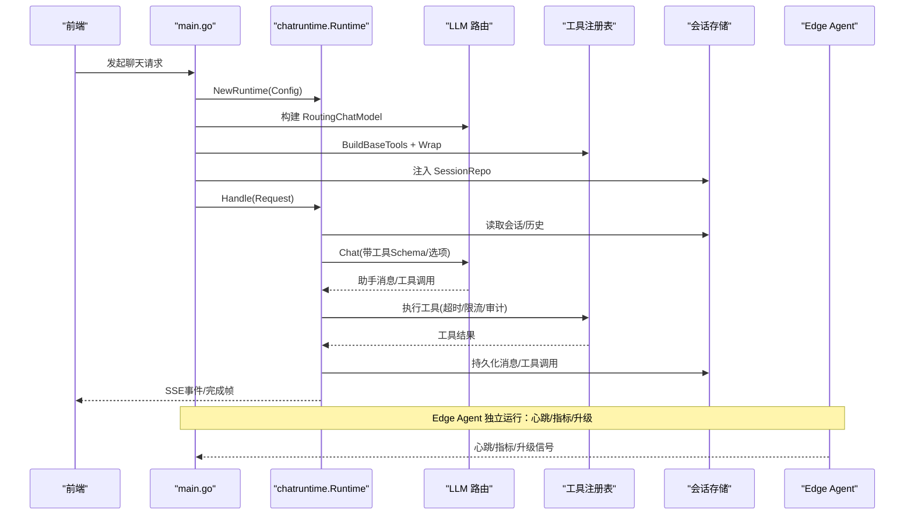
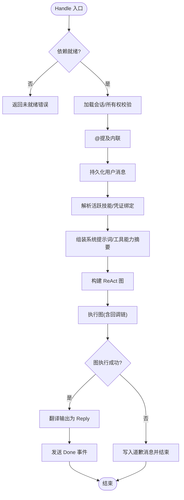
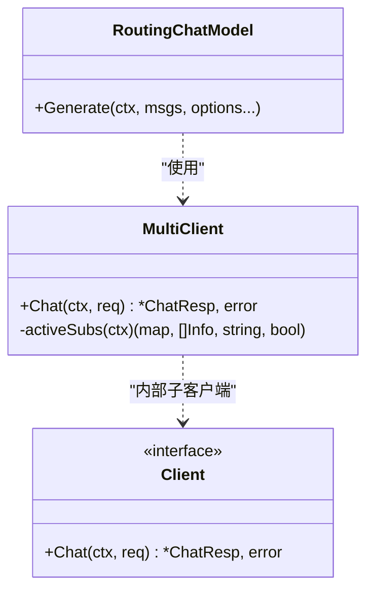
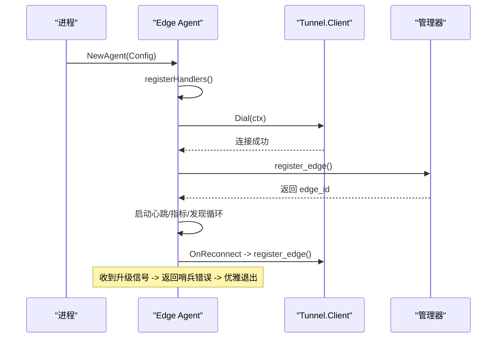
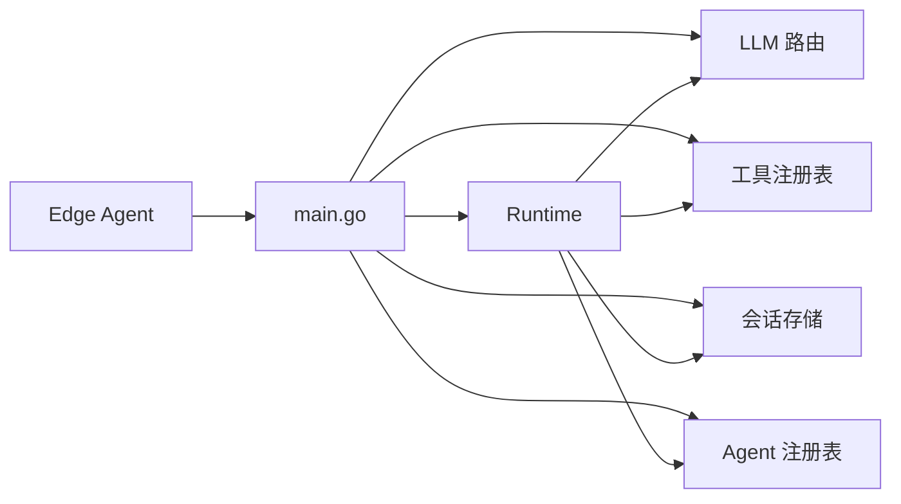

# Agent 生命周期管理

<cite>
**本文引用的文件**
- [cmd/ongrid/main.go](file://cmd/ongrid/main.go)
- [internal/manager/biz/aiops/chatruntime/runtime.go](file://internal/manager/biz/aiops/chatruntime/runtime.go)
- [internal/manager/biz/aiops/chatruntime/agent_registry.go](file://internal/manager/biz/aiops/chatruntime/agent_registry.go)
- [internal/pkg/llm/client.go](file://internal/pkg/llm/client.go)
- [internal/pkg/llm/router.go](file://internal/pkg/llm/router.go)
- [internal/pkg/llm/eino_routing.go](file://internal/pkg/llm/eino_routing.go)
- [internal/manager/biz/aiops/tools/registry_basetool.go](file://internal/manager/biz/aiops/tools/registry_basetool.go)
- [internal/manager/data/aiops/store/session.go](file://internal/manager/data/aiops/store/session.go)
- [internal/edgeagent/biz/agent.go](file://internal/edgeagent/biz/agent.go)
</cite>

## 目录
1. [简介](#简介)
2. [项目结构](#项目结构)
3. [核心组件](#核心组件)
4. [架构总览](#架构总览)
5. [详细组件分析](#详细组件分析)
6. [依赖关系分析](#依赖关系分析)
7. [性能考量](#性能考量)
8. [故障排查指南](#故障排查指南)
9. [结论](#结论)
10. [附录：配置与启动示例](#附录：配置与启动示例)

## 简介
本文件围绕 Agent 的生命周期管理，系统性阐述从进程启动、配置加载、依赖注入到运行时执行与优雅关闭的完整流程。重点覆盖：
- Agent 实例创建、参数校验、默认值设置与错误处理
- 与 LLM 客户端、工具注册表、会话存储等核心组件的绑定关系
- 生命周期钩子、资源清理策略与优雅关闭
- 多 Agent（协调者与专家）角色、权限控制与工具白名单
- 常见初始化错误的定位与修复建议

## 项目结构
Agent 生命周期涉及两条主线：
- 管理器侧（Manager）：负责构建 chatruntime.Runtime、装配 LLM 路由、工具集、技能与 Agent 注册表，并处理每次用户请求的执行流。
- 边缘侧（Edge Agent）：负责心跳、指标上报、能力发现、远程升级与 RPC 处理器注册。

图表来源
- [cmd/ongrid/main.go:3800-4100](file://cmd/ongrid/main.go#L3800-L4100)
- [internal/manager/biz/aiops/chatruntime/runtime.go:179-323](file://internal/manager/biz/aiops/chatruntime/runtime.go#L179-L323)
- [internal/pkg/llm/router.go:274-311](file://internal/pkg/llm/router.go#L274-L311)
- [internal/manager/biz/aiops/tools/registry_basetool.go:34-61](file://internal/manager/biz/aiops/tools/registry_basetool.go#L34-L61)
- [internal/manager/data/aiops/store/session.go:21-42](file://internal/manager/data/aiops/store/session.go#L21-L42)
- [internal/edgeagent/biz/agent.go:134-271](file://internal/edgeagent/biz/agent.go#L134-L271)

章节来源
- [cmd/ongrid/main.go:3800-4100](file://cmd/ongrid/main.go#L3800-L4100)
- [internal/manager/biz/aiops/chatruntime/runtime.go:179-323](file://internal/manager/biz/aiops/chatruntime/runtime.go#L179-L323)

## 核心组件
- 管理器运行时 Runtime：单例装配，按请求执行 ReAct 图，串联会话、模型、工具、回调链（持久化、审计、预算、SSE）。
- LLM 客户端与路由：支持多提供商（OpenAI/Anthropic/Zhipu/Gemini/自定义），提供 per-call 模型选择与默认解析。
- 工具注册表与装饰器：统一超时、限流、审计、度量；支持延迟模式与动态替换。
- 会话存储：SQLite/GORM 实现，提供 Session/Message/ToolCall 的 CRUD。
- Agent 注册表：加载磁盘 Agent 定义与内置 Agent，支持热重载与按名查找。
- 边缘 Agent：心跳、指标、网络发现、远程升级、能力 RPC 注册。

章节来源
- [internal/manager/biz/aiops/chatruntime/runtime.go:179-323](file://internal/manager/biz/aiops/chatruntime/runtime.go#L179-L323)
- [internal/pkg/llm/router.go:274-311](file://internal/pkg/llm/router.go#L274-L311)
- [internal/pkg/llm/eino_routing.go:38-76](file://internal/pkg/llm/eino_routing.go#L38-L76)
- [internal/manager/biz/aiops/tools/registry_basetool.go:34-61](file://internal/manager/biz/aiops/tools/registry_basetool.go#L34-L61)
- [internal/manager/data/aiops/store/session.go:21-42](file://internal/manager/data/aiops/store/session.go#L21-L42)
- [internal/manager/biz/aiops/chatruntime/agent_registry.go:8-76](file://internal/manager/biz/aiops/chatruntime/agent_registry.go#L8-L76)
- [internal/edgeagent/biz/agent.go:134-271](file://internal/edgeagent/biz/agent.go#L134-L271)

## 架构总览
下图展示一次用户请求从进入管理器到调用 LLM、工具执行、结果返回的端到端流程，以及 Edge Agent 的心跳/指标/升级通道。

图表来源
- [cmd/ongrid/main.go:3855-4100](file://cmd/ongrid/main.go#L3855-L4100)
- [internal/manager/biz/aiops/chatruntime/runtime.go:516-911](file://internal/manager/biz/aiops/chatruntime/runtime.go#L516-L911)
- [internal/pkg/llm/router.go:274-311](file://internal/pkg/llm/router.go#L274-L311)
- [internal/manager/biz/aiops/tools/registry_basetool.go:34-61](file://internal/manager/biz/aiops/tools/registry_basetool.go#L34-L61)
- [internal/manager/data/aiops/store/session.go:21-42](file://internal/manager/data/aiops/store/session.go#L21-L42)
- [internal/edgeagent/biz/agent.go:186-271](file://internal/edgeagent/biz/agent.go#L186-L271)

## 详细组件分析

### 管理器运行时 Runtime：初始化、参数校验、默认值与错误处理
- 构造与校验
  - 要求注入 Sessions 与 ChatModel，否则返回“未就绪”错误。
  - HistoryLimit 默认 50；Logger 可空回退到默认。
- 请求处理主流程
  - 所有权校验（session.user_id == req.UserID）。
  - @提及内联、用户消息先落库（崩溃恢复保证）。
  - 解析活跃技能、组装系统提示词、按角色与 Agent 角色裁剪工具集。
  - 构建 eino 历史、组装 ReAct 图、执行并持久化。
  - 将图输出翻译为 Reply，发送 Done 事件。
- 错误处理
  - 图级错误软失败：写入道歉消息并正常结束，避免 SPA 看到原始 stream error。
  - 会话不存在或无权限时返回 NotFound，不泄露存在性信息。

图表来源
- [internal/manager/biz/aiops/chatruntime/runtime.go:306-323](file://internal/manager/biz/aiops/chatruntime/runtime.go#L306-L323)
- [internal/manager/biz/aiops/chatruntime/runtime.go:516-911](file://internal/manager/biz/aiops/chatruntime/runtime.go#L516-L911)

章节来源
- [internal/manager/biz/aiops/chatruntime/runtime.go:306-323](file://internal/manager/biz/aiops/chatruntime/runtime.go#L306-L323)
- [internal/manager/biz/aiops/chatruntime/runtime.go:516-911](file://internal/manager/biz/aiops/chatruntime/runtime.go#L516-L911)

### LLM 客户端与路由：多提供商、默认解析与 per-call 选择
- 多提供商路由
  - MultiClient 根据 ChatReq.Provider 分发到对应子客户端；为空则走默认。
  - 支持 OpenAI/Anthropic/Zhipu/Gemini/自定义等，均通过 OpenAI 兼容接口。
- 默认解析
  - 可从设置服务动态解析默认提供商与模型；未配置时回退到环境变量或首字母排序的提供者。
- per-call 选择
  - 通过 WithProvider 在 eino 选项中指定提供商；RoutingChatModel 消费该选项。
- 错误与限制
  - 未配置提供商或未找到提供商会返回明确错误；预算超限时返回预算错误。

图表来源
- [internal/pkg/llm/router.go:274-311](file://internal/pkg/llm/router.go#L274-L311)
- [internal/pkg/llm/eino_routing.go:38-76](file://internal/pkg/llm/eino_routing.go#L38-L76)
- [internal/pkg/llm/client.go:125-128](file://internal/pkg/llm/client.go#L125-L128)

章节来源
- [internal/pkg/llm/router.go:274-311](file://internal/pkg/llm/router.go#L274-L311)
- [internal/pkg/llm/eino_routing.go:38-76](file://internal/pkg/llm/eino_routing.go#L38-L76)
- [internal/pkg/llm/client.go:125-128](file://internal/pkg/llm/client.go#L125-L128)

### 工具注册表与装饰器：统一横切能力
- 构建与包装
  - Registry.BuildBaseTools 生成基础工具集合，再经 AppendHostFilesTools 扩展，最后用标准装饰器链包裹（超时、限流、审计、度量）。
  - 支持延迟模式：当工具数量超过阈值时，对 LLM 隐藏部分 Schema，通过 ToolSearch 按需获取。
- 动态更新
  - Runtime 支持 ReplaceToolsByNamePrefix，便于 MCP 刷新后替换一组工具而不影响其他工具。
- 权限与可见性
  - 通过角色与 Agent 角色过滤工具集；viewer 强制只读；管理员开关可全局禁用写操作。

章节来源
- [internal/manager/biz/aiops/tools/registry_basetool.go:34-61](file://internal/manager/biz/aiops/tools/registry_basetool.go#L34-L61)
- [internal/manager/biz/aiops/chatruntime/runtime.go:374-445](file://internal/manager/biz/aiops/chatruntime/runtime.go#L374-L445)
- [internal/manager/biz/aiops/chatruntime/runtime.go:622-700](file://internal/manager/biz/aiops/chatruntime/runtime.go#L622-L700)

### 会话存储：持久化与一致性
- 仓库实现
  - SessionRepo 基于 GORM/SQLite，提供 Create/Get/List/Close/Rename/Delete 等方法。
  - 新建会话时填充 RootSessionID、OwnerAgentID、Initiator/Audience 等默认字段。
- 与 Runtime 集成
  - Runtime 在每次请求中先追加用户消息，再读取历史；图回调链负责 assistant 与 tool_call 的持久化。
  - 图执行异常时，仍尽力写入道歉消息，确保前端体验一致。

章节来源
- [internal/manager/data/aiops/store/session.go:21-42](file://internal/manager/data/aiops/store/session.go#L21-L42)
- [internal/manager/biz/aiops/chatruntime/runtime.go:561-578](file://internal/manager/biz/aiops/chatruntime/runtime.go#L561-L578)
- [internal/manager/biz/aiops/chatruntime/runtime.go:840-874](file://internal/manager/biz/aiops/chatruntime/runtime.go#L840-L874)

### Agent 注册表：加载、热重载与角色裁剪
- 加载与热重载
  - Load/Reload 扫描 agentsRoot 及可选额外根，解析 Agent 定义；并发安全，原子替换切片。
  - 支持 Add/AddAll/Replace/Remove，便于内置 Agent 与用户编辑路径。
- 角色与工具裁剪
  - Runtime 根据会话的 AgentID 选择 persona，应用其 SystemPrompt、CriticalReminder 与 MaxTurns。
  - 按 persona 的 Tools 白名单/黑名单裁剪工具集；协调者保留必要控制工具。

章节来源
- [internal/manager/biz/aiops/chatruntime/agent_registry.go:8-76](file://internal/manager/biz/aiops/chatruntime/agent_registry.go#L8-L76)
- [internal/manager/biz/aiops/chatruntime/runtime.go:649-700](file://internal/manager/biz/aiops/chatruntime/runtime.go#L649-L700)

### 边缘 Agent：生命周期、钩子与优雅关闭
- 构造与默认值
  - NewAgent 对 HeartbeatInterval/MetricsInterval/MetricsBatchSize 设置默认值；Kubernetes 环境下禁用抓包能力。
- 启动流程
  - Run：注册云→边处理器 → 建立隧道连接 → register_edge → 启动心跳/指标/网络发现循环 → 监听升级信号。
  - OnReconnect 回调：隧道重连后重新 register_edge，保持 edge_id 绑定。
- 优雅关闭
  - 收到升级信号时，goroutine 返回哨兵错误，errgroup 取消上下文，所有循环退出；Run 将哨兵错误转换为 nil，使 systemd 视为干净退出并重启。
  - 健康标记：register_edge 成功后写入 healthy_marker，用于下次启动判断升级是否健康。

图表来源
- [internal/edgeagent/biz/agent.go:134-271](file://internal/edgeagent/biz/agent.go#L134-L271)
- [internal/edgeagent/biz/agent.go:480-510](file://internal/edgeagent/biz/agent.go#L480-L510)
- [internal/edgeagent/biz/agent.go:530-602](file://internal/edgeagent/biz/agent.go#L530-L602)

章节来源
- [internal/edgeagent/biz/agent.go:134-271](file://internal/edgeagent/biz/agent.go#L134-L271)
- [internal/edgeagent/biz/agent.go:480-510](file://internal/edgeagent/biz/agent.go#L480-L510)
- [internal/edgeagent/biz/agent.go:530-602](file://internal/edgeagent/biz/agent.go#L530-L602)

## 依赖关系分析
- main.go 作为装配中心：
  - 预加载 Skill/Agent 注册表，确保 /v1/agents 可用。
  - 构建 LLM 路由（inner models + default resolver）。
  - 构建工具集并包装装饰器链。
  - 注入 SessionRepo、CallbackDeps（持久化/审计/度量/预算）。
  - 最终构建 Runtime 并附加协调者专用工具。
- Runtime 依赖：
  - SessionRepo：会话与消息持久化。
  - ChatModel：eino 模型封装，支持 per-call provider/model。
  - ToolBag：已装饰的工具集合，供图节点调用。
  - AgentRegistry/SkillRegistry：决定 persona 与系统提示词。
- Edge Agent 依赖：
  - tunnel.Client：与管理器通信，承载心跳/指标/升级等 RPC。

图表来源
- [cmd/ongrid/main.go:3800-4100](file://cmd/ongrid/main.go#L3800-L4100)
- [internal/manager/biz/aiops/chatruntime/runtime.go:179-323](file://internal/manager/biz/aiops/chatruntime/runtime.go#L179-L323)
- [internal/edgeagent/biz/agent.go:186-271](file://internal/edgeagent/biz/agent.go#L186-L271)

章节来源
- [cmd/ongrid/main.go:3800-4100](file://cmd/ongrid/main.go#L3800-L4100)
- [internal/manager/biz/aiops/chatruntime/runtime.go:179-323](file://internal/manager/biz/aiops/chatruntime/runtime.go#L179-L323)
- [internal/edgeagent/biz/agent.go:186-271](file://internal/edgeagent/biz/agent.go#L186-L271)

## 性能考量
- 图构建成本：每次请求重建图（轻量），未来可按 (toolBag 标识, Config) 缓存。
- 工具延迟加载：当工具数量超过阈值时，仅暴露必要 Schema，降低 LLM 输入体积。
- 超时与限流：工具统一超时与令牌桶限流，避免长尾任务阻塞。
- 预算控制：按日 token 预算限制，防止滥用。
- 历史长度：HistoryLimit 默认 50，平衡上下文与成本。
- Edge 指标推送：批量推送与快速失败，避免堆积。

[本节为通用指导，无需特定文件引用]

## 故障排查指南
- 未配置 LLM 提供商
  - 现象：构建 Runtime 时报错“no LLM provider configured”。
  - 处理：检查设置服务或环境变量，确保至少一个提供商可用。
- 会话不存在或无权限
  - 现象：Handle 返回 NotFound。
  - 处理：确认 session_id 有效且当前用户拥有该会话。
- 图执行异常（如超出最大步数）
  - 现象：前端出现“stream error”。
  - 处理：Runtime 会写入道歉消息并结束；检查 MaxIterations 与工具调用逻辑。
- Edge 无法注册或心跳失败
  - 现象：register_edge 失败或心跳连续失败。
  - 处理：检查认证与网络；OnReconnect 会自动重试；连续失败达到阈值会记录 stuck 错误。
- 升级卡住
  - 现象：systemd 未收到 EXIT 导致无法切换二进制。
  - 处理：确保升级信号能触发优雅退出；检查 healthy_marker 写入与脚本逻辑。

章节来源
- [cmd/ongrid/main.go:3941-3943](file://cmd/ongrid/main.go#L3941-L3943)
- [internal/manager/biz/aiops/chatruntime/runtime.go:536-545](file://internal/manager/biz/aiops/chatruntime/runtime.go#L536-L545)
- [internal/manager/biz/aiops/chatruntime/runtime.go:840-874](file://internal/manager/biz/aiops/chatruntime/runtime.go#L840-L874)
- [internal/edgeagent/biz/agent.go:220-236](file://internal/edgeagent/biz/agent.go#L220-L236)
- [internal/edgeagent/biz/agent.go:530-602](file://internal/edgeagent/biz/agent.go#L530-L602)
- [internal/edgeagent/biz/agent.go:328-353](file://internal/edgeagent/biz/agent.go#L328-L353)

## 结论
本项目的 Agent 生命周期管理以“管理器运行时 + 边缘 Agent”双轨设计实现：管理器侧负责复杂编排、权限控制与多提供商 LLM 路由；边缘侧负责稳定上报与远程升级。通过严格的参数校验、默认值设置、装饰器链与优雅关闭机制，系统在可用性、可观测性与可维护性之间取得良好平衡。

[本节为总结，无需特定文件引用]

## 附录：配置与启动示例
- 管理器侧启动要点
  - 预加载 Skill/Agent 注册表，确保 /v1/agents 可用。
  - 构建 LLM 路由（inner models + default resolver），至少一个提供商需配置。
  - 构建工具集并包装装饰器链，注入 SessionRepo 与 CallbackDeps。
  - 构建 Runtime，附加协调者专用工具（AgentTool/SendMessage/TaskStop）。
- 边缘侧启动要点
  - 设置心跳/指标间隔与批次大小；启用网络发现（可选）。
  - 注册云→边处理器；建立隧道连接并完成 register_edge。
  - 启动心跳/指标/网络发现循环；监听升级信号并优雅退出。
- 常见初始化错误场景
  - 未配置 LLM 提供商：补充提供商配置或环境变量。
  - 会话存储不可用：检查数据库迁移与连接。
  - 工具注册失败：检查依赖注入（Prom/Log/Trace/Alert 等）是否齐全。
  - Edge 注册失败：检查认证与网络连通性。

章节来源
- [cmd/ongrid/main.go:3800-4100](file://cmd/ongrid/main.go#L3800-L4100)
- [internal/edgeagent/biz/agent.go:134-271](file://internal/edgeagent/biz/agent.go#L134-L271)