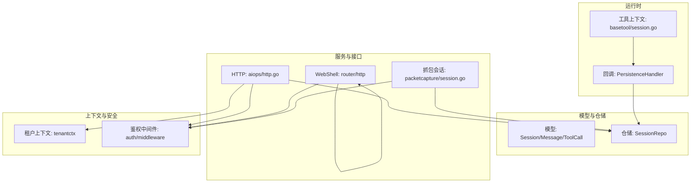
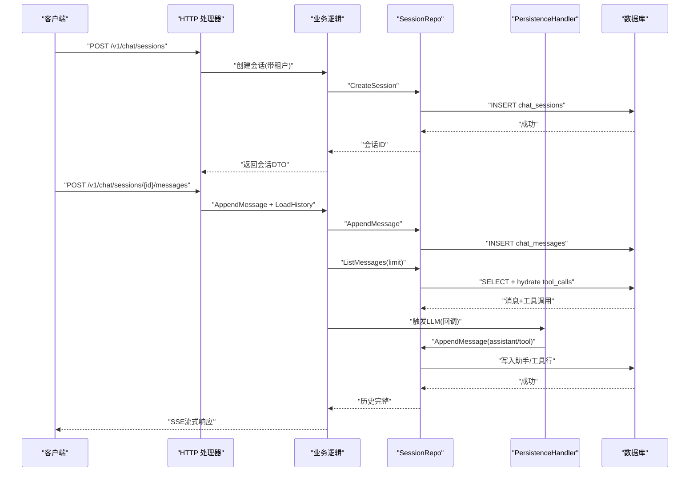
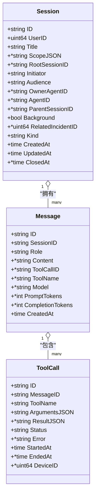
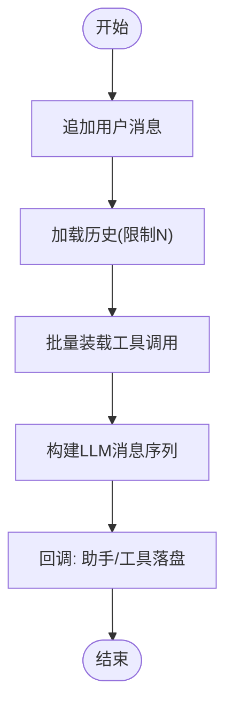
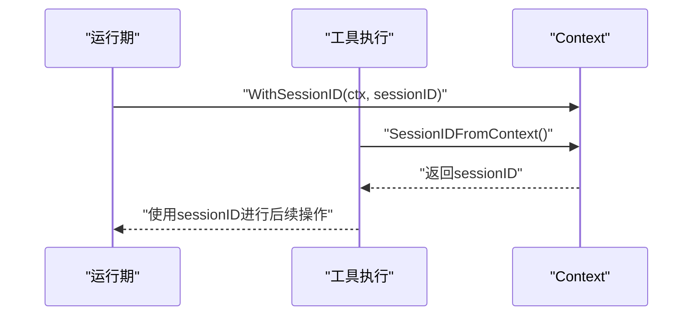
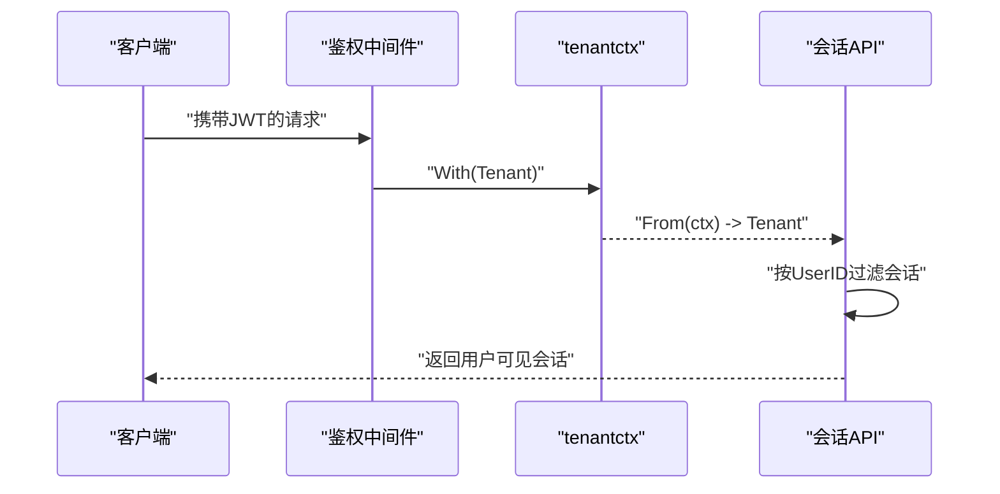
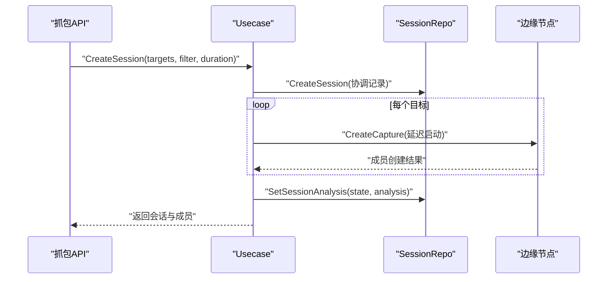
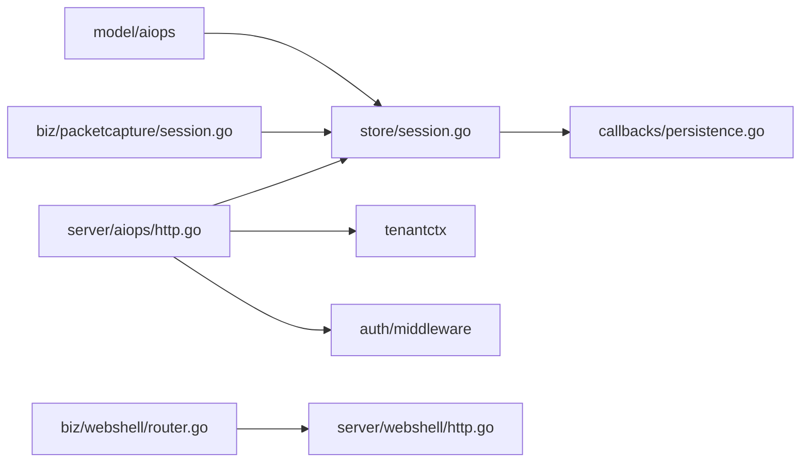

# 会话状态管理

<cite>
**本文引用的文件**
- [internal/manager/data/aiops/store/session.go](file://internal/manager/data/aiops/store/session.go)
- [internal/manager/model/aiops/model.go](file://internal/manager/model/aiops/model.go)
- [internal/manager/biz/aiops/graph/callbacks/persistence.go](file://internal/manager/biz/aiops/graph/callbacks/persistence.go)
- [internal/manager/biz/aiops/tools/basetool/session.go](file://internal/manager/biz/aiops/tools/basetool/session.go)
- [internal/manager/server/aiops/http.go](file://internal/manager/server/aiops/http.go)
- [internal/pkg/tenantctx/tenantctx.go](file://internal/pkg/tenantctx/tenantctx.go)
- [internal/pkg/auth/middleware.go](file://internal/pkg/auth/middleware.go)
- [internal/manager/biz/webshell/router.go](file://internal/manager/biz/webshell/router.go)
- [internal/manager/server/webshell/http.go](file://internal/manager/server/webshell/http.go)
- [internal/manager/biz/packetcapture/session.go](file://internal/manager/biz/packetcapture/session.go)
- [internal/pkg/dbx/doc.go](file://internal/pkg/dbx/doc.go)
</cite>

## 目录
1. [简介](#简介)
2. [项目结构](#项目结构)
3. [核心组件](#核心组件)
4. [架构总览](#架构总览)
5. [详细组件分析](#详细组件分析)
6. [依赖关系分析](#依赖关系分析)
7. [性能考量](#性能考量)
8. [故障排查指南](#故障排查指南)
9. [结论](#结论)
10. [附录](#附录)

## 简介
本文件围绕“会话状态管理”展开，系统性说明会话的创建、持久化、恢复与清理机制；解释会话数据结构设计、消息历史管理与上下文状态维护；覆盖多租户隔离、权限控制与并发安全；并给出存储策略、数据迁移方案与性能优化建议。同时提供操作会话对象、查询历史消息与管理生命周期的实践路径，以及异常处理要点。

## 项目结构
会话能力横跨模型定义、仓储实现、回调持久化、HTTP 接口、上下文传递与并发控制等层次：
- 模型层：会话、消息、工具调用等实体定义与默认值填充
- 仓储层：基于 GORM 的会话与消息读写、批量关联装载、事务删除
- 回调层：在 LLM 执行生命周期中自动落盘助手回复与工具调用
- HTTP 层：会话列表、详情、重命名、关闭、删除等接口
- 上下文层：请求级租户信息与会话 ID 传播
- 并发与安全：活跃会话计数、空闲超时清理、鉴权中间件



图表来源
- [internal/manager/model/aiops/model.go:25-88](file://internal/manager/model/aiops/model.go#L25-L88)
- [internal/manager/data/aiops/store/session.go:21-42](file://internal/manager/data/aiops/store/session.go#L21-L42)
- [internal/manager/biz/aiops/graph/callbacks/persistence.go:223-251](file://internal/manager/biz/aiops/graph/callbacks/persistence.go#L223-L251)
- [internal/manager/biz/aiops/tools/basetool/session.go:17-34](file://internal/manager/biz/aiops/tools/basetool/session.go#L17-L34)
- [internal/manager/server/aiops/http.go:1000-1041](file://internal/manager/server/aiops/http.go#L1000-L1041)
- [internal/pkg/tenantctx/tenantctx.go:13-49](file://internal/pkg/tenantctx/tenantctx.go#L13-L49)
- [internal/pkg/auth/middleware.go:40-67](file://internal/pkg/auth/middleware.go#L40-L67)
- [internal/manager/biz/webshell/router.go:92-139](file://internal/manager/biz/webshell/router.go#L92-L139)
- [internal/manager/server/webshell/http.go:397-432](file://internal/manager/server/webshell/http.go#L397-L432)
- [internal/manager/biz/packetcapture/session.go:55-110](file://internal/manager/biz/packetcapture/session.go#L55-L110)

章节来源
- [internal/manager/model/aiops/model.go:25-88](file://internal/manager/model/aiops/model.go#L25-L88)
- [internal/manager/data/aiops/store/session.go:21-42](file://internal/manager/data/aiops/store/session.go#L21-L42)
- [internal/manager/biz/aiops/graph/callbacks/persistence.go:223-251](file://internal/manager/biz/aiops/graph/callbacks/persistence.go#L223-L251)
- [internal/manager/biz/aiops/tools/basetool/session.go:17-34](file://internal/manager/biz/aiops/tools/basetool/session.go#L17-L34)
- [internal/manager/server/aiops/http.go:1000-1041](file://internal/manager/server/aiops/http.go#L1000-L1041)
- [internal/pkg/tenantctx/tenantctx.go:13-49](file://internal/pkg/tenantctx/tenantctx.go#L13-L49)
- [internal/pkg/auth/middleware.go:40-67](file://internal/pkg/auth/middleware.go#L40-L67)
- [internal/manager/biz/webshell/router.go:92-139](file://internal/manager/biz/webshell/router.go#L92-L139)
- [internal/manager/server/webshell/http.go:397-432](file://internal/manager/server/webshell/http.go#L397-L432)
- [internal/manager/biz/packetcapture/session.go:55-110](file://internal/manager/biz/packetcapture/session.go#L55-L110)

## 核心组件
- 会话模型与会话生命周期
  - 会话包含用户归属、可见性（audience）、发起者（initiator）、父/根会话、负责人工智能体等元数据，支持软关闭与审计追踪
  - 消息按角色区分 user/assistant/tool/system，工具调用独立表记录，支持 pending/success/error/timeout 状态
- 仓储实现
  - 会话 CRUD、按父会话枚举、按用户分页列出（过滤 audience）
  - 消息追加与历史加载（含工具调用批量装载），会话删除使用事务保证一致性
  - 工具调用结果更新与挂起任务终结
- 回调持久化
  - 在 LLM 回调 OnStart/OnEnd 时自动写入助手消息与工具调用，失败可观测
- 上下文与会话 ID 传播
  - 通过 context 将 chat session id 注入到工具执行链路，便于后续异步工作关联回会话
- WebShell 会话并发与空闲清理
  - 维护活跃会话集合，统计用户/设备维度并发数，空闲超时终止
- 抓包会话
  - 协调多成员采集，统一状态分析与完成通知，支持取消/停止/刷新

章节来源
- [internal/manager/model/aiops/model.go:25-88](file://internal/manager/model/aiops/model.go#L25-L88)
- [internal/manager/model/aiops/model.go:135-200](file://internal/manager/model/aiops/model.go#L135-L200)
- [internal/manager/data/aiops/store/session.go:36-160](file://internal/manager/data/aiops/store/session.go#L36-L160)
- [internal/manager/data/aiops/store/session.go:162-241](file://internal/manager/data/aiops/store/session.go#L162-L241)
- [internal/manager/data/aiops/store/session.go:243-323](file://internal/manager/data/aiops/store/session.go#L243-L323)
- [internal/manager/biz/aiops/graph/callbacks/persistence.go:223-251](file://internal/manager/biz/aiops/graph/callbacks/persistence.go#L223-L251)
- [internal/manager/biz/aiops/tools/basetool/session.go:17-34](file://internal/manager/biz/aiops/tools/basetool/session.go#L17-L34)
- [internal/manager/biz/webshell/router.go:92-139](file://internal/manager/biz/webshell/router.go#L92-L139)
- [internal/manager/server/webshell/http.go:397-432](file://internal/manager/server/webshell/http.go#L397-L432)
- [internal/manager/biz/packetcapture/session.go:55-110](file://internal/manager/biz/packetcapture/session.go#L55-L110)

## 架构总览
会话状态管理的关键流程如下：
- 创建会话：HTTP 接收请求，校验租户与权限，写入会话记录
- 发送消息：先持久化用户消息，再加载历史（含工具调用），构建 LLM 输入
- 助手回复与工具调用：回调层自动落盘，SSE 推送时携带消息 ID
- 会话恢复：通过会话 ID 加载历史消息与工具调用，重建上下文
- 会话清理：软关闭或硬删除（事务），工具调用收尾（pending→error）



图表来源
- [internal/manager/server/aiops/http.go:1000-1041](file://internal/manager/server/aiops/http.go#L1000-L1041)
- [internal/manager/data/aiops/store/session.go:36-42](file://internal/manager/data/aiops/store/session.go#L36-L42)
- [internal/manager/data/aiops/store/session.go:162-207](file://internal/manager/data/aiops/store/session.go#L162-L207)
- [internal/manager/biz/aiops/graph/callbacks/persistence.go:476-514](file://internal/manager/biz/aiops/graph/callbacks/persistence.go#L476-L514)

## 详细组件分析

### 会话模型与数据结构
- 会话字段涵盖用户、标题、范围、根/父会话、发起者、可见性、负责人工智能体、关联告警、类型、时间戳与关闭时间
- 消息字段涵盖角色、内容、工具调用标识、模型溯源、Token 用量、时间戳
- 工具调用字段涵盖名称、参数/结果 JSON、状态、错误、起止时间与设备关联
- BeforeCreate 钩子确保 ID、根会话、默认发起者与可见性等默认值一致



图表来源
- [internal/manager/model/aiops/model.go:25-88](file://internal/manager/model/aiops/model.go#L25-L88)
- [internal/manager/model/aiops/model.go:135-200](file://internal/manager/model/aiops/model.go#L135-L200)

章节来源
- [internal/manager/model/aiops/model.go:25-88](file://internal/manager/model/aiops/model.go#L25-L88)
- [internal/manager/model/aiops/model.go:135-200](file://internal/manager/model/aiops/model.go#L135-L200)

### 会话持久化与恢复
- 创建会话：插入会话记录，自动生成 ID 与默认字段
- 追加消息：用户消息优先落盘，随后加载历史（限制条数），并按顺序反转以维持对话时序
- 历史恢复：批量装载 assistant 消息的工具调用，避免严格 LLM 对 orphan tool message 的拒绝
- 会话关闭/重命名/删除：软关闭标记时间；重命名更新时间戳；删除使用事务依次清理工具调用、消息与会话
- 工具调用收尾：会话结束时将仍为 pending 的工具调用置为 error，保障 UI 与审计一致性



图表来源
- [internal/manager/data/aiops/store/session.go:162-207](file://internal/manager/data/aiops/store/session.go#L162-L207)
- [internal/manager/data/aiops/store/session.go:209-241](file://internal/manager/data/aiops/store/session.go#L209-L241)
- [internal/manager/biz/aiops/graph/callbacks/persistence.go:476-514](file://internal/manager/biz/aiops/graph/callbacks/persistence.go#L476-L514)

章节来源
- [internal/manager/data/aiops/store/session.go:36-160](file://internal/manager/data/aiops/store/session.go#L36-L160)
- [internal/manager/data/aiops/store/session.go:162-241](file://internal/manager/data/aiops/store/session.go#L162-L241)
- [internal/manager/data/aiops/store/session.go:243-323](file://internal/manager/data/aiops/store/session.go#L243-L323)
- [internal/manager/biz/aiops/graph/callbacks/persistence.go:476-514](file://internal/manager/biz/aiops/graph/callbacks/persistence.go#L476-L514)

### 上下文与会话 ID 传播
- 通过 context 键值对将 chat session id 注入到工具执行链路，使异步任务能回溯到原始会话
- 工具侧读取会话 ID，用于解析每会话工作空间或审批载荷中的会话关联



图表来源
- [internal/manager/biz/aiops/tools/basetool/session.go:17-34](file://internal/manager/biz/aiops/tools/basetool/session.go#L17-L34)

章节来源
- [internal/manager/biz/aiops/tools/basetool/session.go:17-34](file://internal/manager/biz/aiops/tools/basetool/session.go#L17-L34)

### 多租户与会话隔离
- 请求级租户信息通过鉴权中间件从 JWT 解析并注入上下文，下游通过 tenantctx 获取
- 会话列表按用户 ID 过滤，且仅展示 audience=user 的会话，内部工作会话不污染主界面
- 会话模型包含 initiator/audience 等审计字段，用于区分用户对话与工作会话



图表来源
- [internal/pkg/auth/middleware.go:40-67](file://internal/pkg/auth/middleware.go#L40-L67)
- [internal/pkg/tenantctx/tenantctx.go:13-49](file://internal/pkg/tenantctx/tenantctx.go#L13-L49)
- [internal/manager/data/aiops/store/session.go:75-99](file://internal/manager/data/aiops/store/session.go#L75-L99)

章节来源
- [internal/pkg/auth/middleware.go:40-67](file://internal/pkg/auth/middleware.go#L40-L67)
- [internal/pkg/tenantctx/tenantctx.go:13-49](file://internal/pkg/tenantctx/tenantctx.go#L13-L49)
- [internal/manager/data/aiops/store/session.go:75-99](file://internal/manager/data/aiops/store/session.go#L75-L99)

### 会话权限控制
- 鉴权中间件负责解析 JWT 并设置租户上下文
- 授权中间件封装 casbin 能力，提供细粒度资源访问控制（如 edge:*、knowledge:doc 等）
- 会话相关接口需具备相应权限方可访问

章节来源
- [internal/pkg/auth/middleware.go:40-67](file://internal/pkg/auth/middleware.go#L40-L67)
- [internal/pkg/authzmw/middleware.go:1-55](file://internal/pkg/authzmw/middleware.go#L1-L55)
- [internal/iam/biz/authz/authz.go:1-84](file://internal/iam/biz/authz/authz.go#L1-L84)

### 并发访问安全与会话清理
- WebShell 活跃会话管理：维护会话元信息，支持 TouchInput 更新最后输入时间，Active() 快照当前活跃会话，CountByUser/CountByDevice 统计并发
- 空闲超时清理：定时轮询 LastInputAt，超过阈值则终止会话
- 会话删除：使用事务顺序删除工具调用、消息与会话，避免孤儿数据

```mermaid
flowchart TD
A["定时器Tick"] --> B["读取活跃会话"]
B --> C{"是否存在目标会话?"}
C -- 否 --> A
C -- 是 --> D{"LastInputAt是否过期?"}
D -- 否 --> A
D -- 是 --> E["终止会话(原因: idle timeout)")
E --> A
```

图表来源
- [internal/manager/biz/webshell/router.go:92-139](file://internal/manager/biz/webshell/router.go#L92-L139)
- [internal/manager/server/webshell/http.go:397-432](file://internal/manager/server/webshell/http.go#L397-L432)
- [internal/manager/data/aiops/store/session.go:132-160](file://internal/manager/data/aiops/store/session.go#L132-L160)

章节来源
- [internal/manager/biz/webshell/router.go:92-139](file://internal/manager/biz/webshell/router.go#L92-L139)
- [internal/manager/server/webshell/http.go:397-432](file://internal/manager/server/webshell/http.go#L397-L432)
- [internal/manager/data/aiops/store/session.go:132-160](file://internal/manager/data/aiops/store/session.go#L132-L160)

### 抓包会话的生命周期
- 创建会话：生成协调记录，预计算计划启动时间，逐个创建成员捕获
- 状态分析：根据成员状态汇总会话状态（收集/部分/就绪/失败/取消）
- 完成通知：当会话达到终态且未通知过，回调上层并标记已通知
- 取消/停止：对非终态成员逐一发送取消/停止指令，保持可观测性



图表来源
- [internal/manager/biz/packetcapture/session.go:55-110](file://internal/manager/biz/packetcapture/session.go#L55-L110)
- [internal/manager/biz/packetcapture/session.go:252-298](file://internal/manager/biz/packetcapture/session.go#L252-L298)

章节来源
- [internal/manager/biz/packetcapture/session.go:55-110](file://internal/manager/biz/packetcapture/session.go#L55-L110)
- [internal/manager/biz/packetcapture/session.go:252-298](file://internal/manager/biz/packetcapture/session.go#L252-L298)

## 依赖关系分析
- 模型与仓储：SessionRepo 依赖 model.Session/Message/ToolCall，并通过 GORM 执行 SQL
- 回调与仓储：PersistenceHandler 依赖 SessionRepo 写入助手与工具调用
- HTTP 与服务：HTTP 层依赖仓储与模型 DTO 转换，结合租户上下文与鉴权中间件
- 上下文：tenantctx 提供请求级租户信息；basetool 提供会话 ID 传播
- 并发与清理：webshell router 维护活跃会话，http 层执行空闲清理



图表来源
- [internal/manager/model/aiops/model.go:25-88](file://internal/manager/model/aiops/model.go#L25-L88)
- [internal/manager/data/aiops/store/session.go:21-42](file://internal/manager/data/aiops/store/session.go#L21-L42)
- [internal/manager/biz/aiops/graph/callbacks/persistence.go:223-251](file://internal/manager/biz/aiops/graph/callbacks/persistence.go#L223-L251)
- [internal/manager/server/aiops/http.go:1000-1041](file://internal/manager/server/aiops/http.go#L1000-L1041)
- [internal/pkg/tenantctx/tenantctx.go:13-49](file://internal/pkg/tenantctx/tenantctx.go#L13-L49)
- [internal/pkg/auth/middleware.go:40-67](file://internal/pkg/auth/middleware.go#L40-L67)
- [internal/manager/biz/webshell/router.go:92-139](file://internal/manager/biz/webshell/router.go#L92-L139)
- [internal/manager/server/webshell/http.go:397-432](file://internal/manager/server/webshell/http.go#L397-L432)
- [internal/manager/biz/packetcapture/session.go:55-110](file://internal/manager/biz/packetcapture/session.go#L55-L110)

章节来源
- [internal/manager/model/aiops/model.go:25-88](file://internal/manager/model/aiops/model.go#L25-L88)
- [internal/manager/data/aiops/store/session.go:21-42](file://internal/manager/data/aiops/store/session.go#L21-L42)
- [internal/manager/biz/aiops/graph/callbacks/persistence.go:223-251](file://internal/manager/biz/aiops/graph/callbacks/persistence.go#L223-L251)
- [internal/manager/server/aiops/http.go:1000-1041](file://internal/manager/server/aiops/http.go#L1000-L1041)
- [internal/pkg/tenantctx/tenantctx.go:13-49](file://internal/pkg/tenantctx/tenantctx.go#L13-L49)
- [internal/pkg/auth/middleware.go:40-67](file://internal/pkg/auth/middleware.go#L40-L67)
- [internal/manager/biz/webshell/router.go:92-139](file://internal/manager/biz/webshell/router.go#L92-L139)
- [internal/manager/server/webshell/http.go:397-432](file://internal/manager/server/webshell/http.go#L397-L432)
- [internal/manager/biz/packetcapture/session.go:55-110](file://internal/manager/biz/packetcapture/session.go#L55-L110)

## 性能考量
- 历史加载与工具调用装载
  - 使用 LIMIT 限制历史条数，减少内存与网络开销
  - 批量装载 assistant 消息的工具调用，避免 N+1 查询
- Token 聚合
  - 使用单条 Raw SQL 聚合 prompt/completion tokens 与请求数，降低 ORM 链成本
- 删除事务
  - 会话删除在事务内顺序清理工具调用、消息与会话，避免孤儿数据与不一致
- 回调落盘
  - 在回调 OnEnd 时写入助手消息，必要时在 OnStart 短路昂贵步骤，减少无效 IO
- WebShell 并发
  - Active() 快照与 CountByUser/Device 统计，避免全局锁竞争影响高并发

章节来源
- [internal/manager/data/aiops/store/session.go:176-207](file://internal/manager/data/aiops/store/session.go#L176-L207)
- [internal/manager/data/aiops/store/session.go:209-241](file://internal/manager/data/aiops/store/session.go#L209-L241)
- [internal/manager/data/aiops/store/session.go:251-268](file://internal/manager/data/aiops/store/session.go#L251-L268)
- [internal/manager/data/aiops/store/session.go:132-160](file://internal/manager/data/aiops/store/session.go#L132-L160)
- [internal/manager/biz/aiops/graph/callbacks/persistence.go:253-277](file://internal/manager/biz/aiops/graph/callbacks/persistence.go#L253-L277)
- [internal/manager/biz/webshell/router.go:103-139](file://internal/manager/biz/webshell/router.go#L103-L139)

## 故障排查指南
- 常见错误与映射
  - 不存在：GetSession/CloseSession/RenameSession/DeleteSession 找不到记录时返回 not-found
  - 冲突：AppendMessage 重复写入时返回 conflict
  - 无效：传入 nil 会话/消息时返回 invalid
- 回调失败可观测
  - 持久化失败计数器与工具响应丢失计数器，便于定位写入问题
- 会话清理异常
  - WebShell 空闲清理超时后终止会话，检查 LastInputAt 更新是否及时
- 抓包会话异常
  - 成员创建失败会记录 member_errors，会话状态可能为 partial/failed，需检查边缘节点可达性与参数

章节来源
- [internal/manager/data/aiops/store/session.go:44-54](file://internal/manager/data/aiops/store/session.go#L44-L54)
- [internal/manager/data/aiops/store/session.go:101-130](file://internal/manager/data/aiops/store/session.go#L101-L130)
- [internal/manager/data/aiops/store/session.go:132-160](file://internal/manager/data/aiops/store/session.go#L132-L160)
- [internal/manager/data/aiops/store/session.go:162-174](file://internal/manager/data/aiops/store/session.go#L162-L174)
- [internal/manager/biz/aiops/graph/callbacks/persistence.go:223-251](file://internal/manager/biz/aiops/graph/callbacks/persistence.go#L223-L251)
- [internal/manager/server/webshell/http.go:397-432](file://internal/manager/server/webshell/http.go#L397-L432)
- [internal/manager/biz/packetcapture/session.go:55-110](file://internal/manager/biz/packetcapture/session.go#L55-L110)

## 结论
该会话状态管理体系通过清晰的模型定义、稳健的仓储实现、可靠的回调持久化与完善的上下文传播，实现了会话的创建、持久化、恢复与清理闭环。结合多租户隔离、权限控制与并发安全机制，满足生产环境的高可用与可观测需求。配合合理的性能优化与故障排查策略，可在大规模场景下稳定运行。

## 附录
- 数据迁移策略
  - 使用 GORM AutoMigrate 管理 schema 变更，各数据层暴露 Migrator 函数，由启动流程统一执行
  - 会话与消息表通过模型注解与索引优化查询性能
- 操作示例路径
  - 创建会话：参考 HTTP 处理器与会话 DTO 转换
  - 追加消息与加载历史：参考仓储的 AppendMessage 与 ListMessages
  - 会话关闭/重命名/删除：参考仓储对应方法
  - 工具调用结果更新与挂起终结：参考仓储 UpdateToolCallResult 与 FinalizePendingToolCalls
  - WebShell 会话并发与清理：参考 router 与 http 层的活跃会话与空闲超时逻辑
  - 抓包会话：参考 Usecase 的 CreateSession/CancelSession/StopSession/RefreshSession

章节来源
- [internal/pkg/dbx/doc.go:1-25](file://internal/pkg/dbx/doc.go#L1-L25)
- [internal/manager/server/aiops/http.go:1000-1041](file://internal/manager/server/aiops/http.go#L1000-L1041)
- [internal/manager/data/aiops/store/session.go:36-160](file://internal/manager/data/aiops/store/session.go#L36-L160)
- [internal/manager/data/aiops/store/session.go:162-241](file://internal/manager/data/aiops/store/session.go#L162-L241)
- [internal/manager/data/aiops/store/session.go:243-323](file://internal/manager/data/aiops/store/session.go#L243-L323)
- [internal/manager/biz/webshell/router.go:92-139](file://internal/manager/biz/webshell/router.go#L92-L139)
- [internal/manager/server/webshell/http.go:397-432](file://internal/manager/server/webshell/http.go#L397-L432)
- [internal/manager/biz/packetcapture/session.go:55-110](file://internal/manager/biz/packetcapture/session.go#L55-L110)