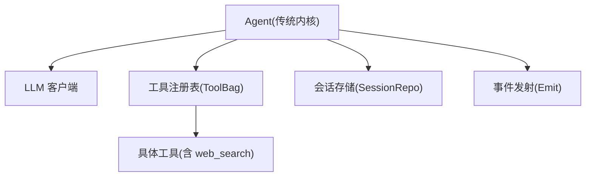
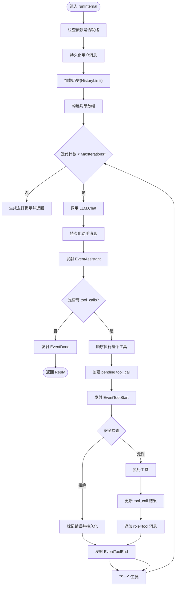
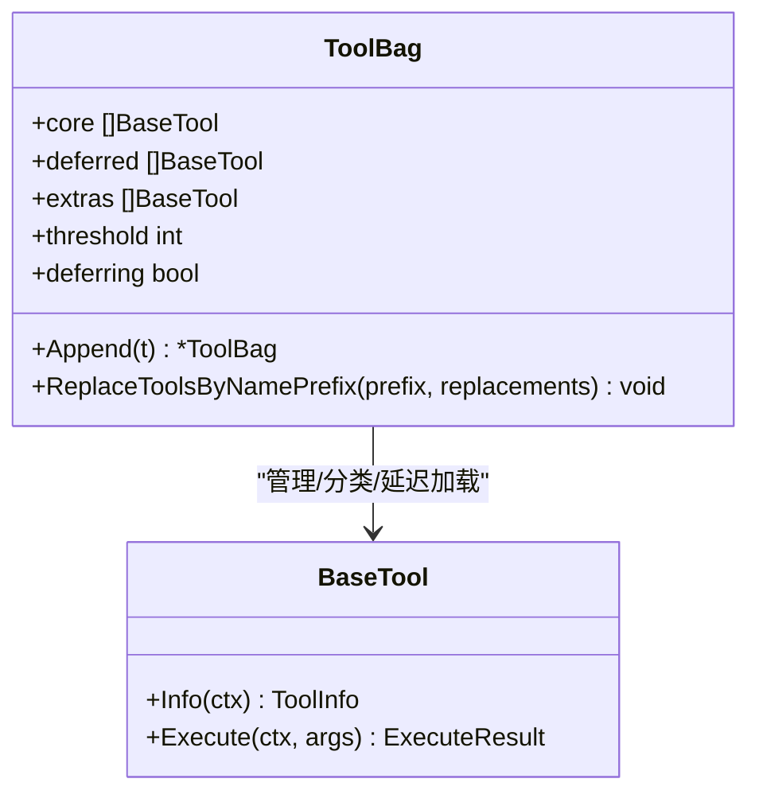
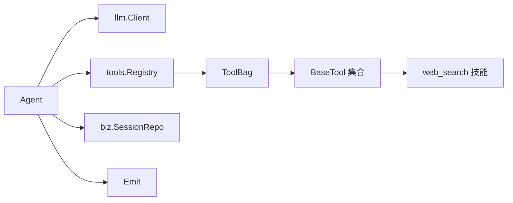

# 传统内核模式

<cite>
**本文引用的文件**
- [agent.go](file://internal/manager/biz/aiops/agent/agent.go)
- [tool_call.go](file://internal/manager/biz/aiops/tools/basetool/tool_call.go)
- [toolbag.go](file://internal/manager/biz/aiops/tools/toolbag.go)
- [web_search.go](file://internal/skill/builtin/web_search.go)
- [service_kernel_test.go](file://internal/manager/service/aiops/service_kernel_test.go)
</cite>

## 目录
1. [简介](#简介)
2. [项目结构](#项目结构)
3. [核心组件](#核心组件)
4. [架构总览](#架构总览)
5. [详细组件分析](#详细组件分析)
6. [依赖关系分析](#依赖关系分析)
7. [性能考量](#性能考量)
8. [故障排查指南](#故障排查指南)
9. [结论](#结论)

## 简介
本文件面向“传统内核模式”（legacy kernel），聚焦基于闭包的 Agent 实现、工具调用处理流程与状态管理。文档解释传统内核如何加载会话历史、调用 LLM、执行工具并回写结果，同时说明关键配置项（如 MaxIterations、ToolTimeout、HistoryLimit）的作用与默认值，以及安全限制（mutating tools 拒绝机制、web_search 过滤逻辑）。文末提供事件类型的使用场景与数据格式说明，并通过流程图展示完整执行过程。

## 项目结构
与传统内核相关的核心代码集中在 AIOPS 子系统中：
- 传统内核的 Agent 主循环与事件发射位于 agent 包
- 工具注册表与延迟加载策略在 tools 包
- web_search 技能实现在 skill/builtin 包
- 服务层对 legacy/graph 内核的路由选择通过 service 层测试覆盖



图表来源
- [agent.go:255-301](file://internal/manager/biz/aiops/agent/agent.go#L255-L301)
- [toolbag.go:157-200](file://internal/manager/biz/aiops/tools/toolbag.go#L157-L200)
- [web_search.go:307-324](file://internal/skill/builtin/web_search.go#L307-L324)

章节来源
- [agent.go:1-16](file://internal/manager/biz/aiops/agent/agent.go#L1-L16)
- [toolbag.go:1-33](file://internal/manager/biz/aiops/tools/toolbag.go#L1-L33)

## 核心组件
- Agent（传统内核）
  - 负责加载历史、组装消息、调用 LLM、执行工具、持久化结果、发射事件
  - 支持流式回调 Emit，用于 SSE 等推送
- 工具注册表 ToolBag
  - 将工具分为 core 与 specialty，超过阈值时对 specialty 进行 schema 延迟暴露
- web_search 技能
  - 默认关闭；仅在用户显式开启时暴露给模型并可被调用
- 上下文工具调用 ID 传递
  - 传统内核在执行前将 tool-call 行 ID 注入上下文，便于审批卡片关联

章节来源
- [agent.go:40-62](file://internal/manager/biz/aiops/agent/agent.go#L40-L62)
- [toolbag.go:157-200](file://internal/manager/biz/aiops/tools/toolbag.go#L157-L200)
- [tool_call.go:1-22](file://internal/manager/biz/aiops/tools/basetool/tool_call.go#L1-L22)

## 架构总览
传统内核的执行主循环如下：
- 校验依赖是否就绪
- 写入用户消息并加载历史
- 构建发送给 LLM 的消息数组（包含系统提示、历史、工具 schema）
- 最多迭代 MaxIterations 次：
  - 调用 LLM.Chat，得到回复与可能的工具调用列表
  - 持久化助手消息（可能为空文本但携带 tool_calls）
  - 若无工具调用，结束并返回 Reply
  - 否则顺序执行每个工具：
    - 创建 pending 的 tool_call 记录
    - 发射 tool_start 事件
    - 安全检查（web_search 开关、mutating tools 拒绝）
    - 执行工具并记录结果
    - 发射 tool_end 事件
    - 将 role=tool 的结果消息追加到历史，供下一轮 LLM 使用
- 若达到最大迭代次数仍未收敛，返回友好提示或错误

```mermaid
sequenceDiagram
participant U as "调用方"
participant AG as "Agent(传统内核)"
participant DB as "会话存储"
participant L as "LLM"
participant TR as "工具注册表"
participant EM as "事件发射"
U->>AG : RunStream(sessionID, userID, userContent, emit)
AG->>DB : AppendMessage(用户消息)
AG->>DB : ListMessages(HistoryLimit)
loop 最多 MaxIterations 次
AG->>L : Chat(messages, tools, temperature)
L-->>AG : 回复(可能含 tool_calls)
AG->>DB : AppendMessage(助手消息)
AG->>EM : EventAssistant
alt 无 tool_calls
AG->>EM : EventDone(Reply)
AG-->>U : 返回 Reply
else 有 tool_calls
for each tool_call
AG->>DB : CreateToolCall(pending)
AG->>EM : EventToolStart
AG->>AG : 安全检查(web_search/mutating)
alt 允许执行
AG->>TR : Invoke(name, args)
TR-->>AG : ExecuteResult
AG->>DB : UpdateToolCallResult(success/error)
AG->>DB : AppendMessage(role=tool)
AG->>EM : EventToolEnd
else 拒绝执行
AG->>DB : UpdateToolCallResult(error)
AG->>DB : AppendMessage(role=tool)
AG->>EM : EventToolEnd
end
end
end
end
AG-->>U : 返回 Reply 或错误
```

图表来源
- [agent.go:331-723](file://internal/manager/biz/aiops/agent/agent.go#L331-L723)

章节来源
- [agent.go:331-723](file://internal/manager/biz/aiops/agent/agent.go#L331-L723)

## 详细组件分析

### 传统内核 Agent 主循环与状态管理
- 入口方法
  - Run：阻塞式调用，内部委托 RunStream
  - RunStream / RunStreamWithOpts：统一走 runInternal，支持 per-call 选项（Provider/Model/Mentions/WebSearchEnabled/Locale）
- 状态管理
  - 会话所有权校验：非所有者直接返回未找到错误
  - 写入用户消息后加载历史（受 HistoryLimit 限制）
  - 每轮迭代：
    - 持久化助手消息（即使 Content 为空，也可能携带 tool_calls）
    - 为每个 tool_call 创建 pending 记录，随后更新为 success/error/timeout
    - 将 role=tool 的结果消息追加到历史，确保下一轮 LLM 可见
- 事件发射
  - EventAssistant：每次助手消息持久化后发射，包含 PendingToolCalls
  - EventToolStart：工具执行前发射，携带 ArgsJSON
  - EventToolEnd：工具完成后发射，携带 Status/DurationMs/ResultJSON/Error
  - EventDone：最终成功时发射，携带 Reply（含 Message、Usage、Iterations、ToolCalls）



图表来源
- [agent.go:331-723](file://internal/manager/biz/aiops/agent/agent.go#L331-L723)

章节来源
- [agent.go:331-723](file://internal/manager/biz/aiops/agent/agent.go#L331-L723)

### 配置参数与作用
- Config 字段
  - Model：LLM 模型标识，默认 gpt-5.4
  - Temperature：采样温度，默认 0.1
  - MaxIterations：外层工具调用循环上限，默认 30
  - SystemPrompt：可选的系统提示，附加到每轮请求
  - ToolTimeout：单个工具的超时时间，默认 15 秒
  - HistoryLimit：回放的历史消息条数上限，默认 50
- 行为影响
  - MaxIterations 控制 ReAct 式循环预算，避免无限迭代
  - ToolTimeout 保护长耗时工具，防止卡死
  - HistoryLimit 控制上下文大小，平衡记忆与成本

章节来源
- [agent.go:40-54](file://internal/manager/biz/aiops/agent/agent.go#L40-L54)
- [agent.go:276-301](file://internal/manager/biz/aiops/agent/agent.go#L276-L301)

### 安全限制
- mutating tools 拒绝机制
  - 传统内核维护一个“变更类工具”黑名单，包括 host_restart_service、capture_pcap
  - 当模型发起这些工具调用时，传统内核直接拒绝并记录错误，不会执行实际变更
  - 原因：新图内核通过 ReviewGate 装饰器实现 SOP 双签审核，传统内核不具备该链路，因此以名称白名单方式兜底
- web_search 过滤逻辑
  - 默认关闭：不在 schema 中暴露 web_search，防止模型滥用公共搜索消耗配额
  - 运行时双重防护：即使历史中出现旧 tool_call，也会在当前 turn 再次拒绝
  - 开启条件：RunOptions.WebSearchEnabled 为 true（通常由前端 globe 切换触发）
  - 技能实现：SearXNG/Tavily 后端，默认 SearXNG 且启用 safesearch

章节来源
- [agent.go:229-246](file://internal/manager/biz/aiops/agent/agent.go#L229-L246)
- [agent.go:406-417](file://internal/manager/biz/aiops/agent/agent.go#L406-L417)
- [agent.go:519-572](file://internal/manager/biz/aiops/agent/agent.go#L519-L572)
- [web_search.go:307-324](file://internal/skill/builtin/web_search.go#L307-L324)

### 事件类型与数据格式
- EventAssistant
  - 触发时机：每次助手消息持久化后
  - 数据：Iteration、MessageID、Content、CreatedAt、PendingToolCalls
- EventToolStart
  - 触发时机：tool_call 行持久化为 pending 后，工具执行前
  - 数据：ToolCallID、Name、Status=pending、StartedAt、ArgsJSON
- EventToolEnd
  - 触发时机：工具完成（success/error/timeout）
  - 数据：ToolCallID、Name、DeviceID、Status、StartedAt、EndedAt、DurationMs、Error、ArgsJSON、ResultJSON
- EventDone
  - 触发时机：最终成功返回
  - 数据：Reply（Message、Usage、Iterations、ToolCalls）

章节来源
- [agent.go:69-92](file://internal/manager/biz/aiops/agent/agent.go#L69-L92)
- [agent.go:94-156](file://internal/manager/biz/aiops/agent/agent.go#L94-L156)
- [agent.go:459-489](file://internal/manager/biz/aiops/agent/agent.go#L459-L489)
- [agent.go:511-550](file://internal/manager/biz/aiops/agent/agent.go#L511-L550)
- [agent.go:653-667](file://internal/manager/biz/aiops/agent/agent.go#L653-L667)

### 工具调用处理流程（传统内核）
- 工具注册与延迟加载
  - ToolBag 将工具分为 core 与 specialty；超过阈值时对 specialty 进行 schema 延迟暴露，减少 prompt 开销
  - 核心工具始终暴露完整 schema，特殊工具按需获取
- 工具执行
  - 传统内核顺序执行每个 tool_call，并在执行前注入 tool-call 行 ID 到上下文，便于审批卡片关联
  - 执行结果持久化并追加 role=tool 消息，供下一轮 LLM 使用



图表来源
- [toolbag.go:157-200](file://internal/manager/biz/aiops/tools/toolbag.go#L157-L200)
- [toolbag.go:310-348](file://internal/manager/biz/aiops/tools/toolbag.go#L310-L348)

章节来源
- [toolbag.go:1-33](file://internal/manager/biz/aiops/tools/toolbag.go#L1-L33)
- [toolbag.go:157-200](file://internal/manager/biz/aiops/tools/toolbag.go#L157-L200)
- [toolbag.go:310-348](file://internal/manager/biz/aiops/tools/toolbag.go#L310-L348)

### 与传统内核相关的事件使用场景
- EventAssistant：UI 渲染占位符（PendingToolCalls > 0）或显示助手文本
- EventToolStart：展示工具即将执行的卡片，显示参数摘要
- EventToolEnd：更新工具卡片状态（成功/失败/超时），展示结果或错误
- EventDone：结束对话气泡，显示最终回复与用量统计

章节来源
- [agent.go:69-92](file://internal/manager/biz/aiops/agent/agent.go#L69-L92)
- [agent.go:459-489](file://internal/manager/biz/aiops/agent/agent.go#L459-L489)
- [agent.go:511-550](file://internal/manager/biz/aiops/agent/agent.go#L511-L550)
- [agent.go:653-667](file://internal/manager/biz/aiops/agent/agent.go#L653-L667)

## 依赖关系分析
- Agent 依赖
  - llm.Client：用于聊天与工具调用
  - tools.Registry：工具注册与调度
  - biz.SessionRepo：会话与工具调用记录的持久化
  - Emit：事件回调（nil 时为无操作）
- 工具注册表依赖
  - basetool.BaseTool：工具抽象接口
  - 分层策略：core 与 specialty，阈值控制延迟加载
- web_search 技能依赖
  - 外部搜索引擎（SearXNG/Tavily），默认启用 safesearch 与安全头



图表来源
- [agent.go:255-301](file://internal/manager/biz/aiops/agent/agent.go#L255-L301)
- [toolbag.go:157-200](file://internal/manager/biz/aiops/tools/toolbag.go#L157-L200)
- [web_search.go:307-324](file://internal/skill/builtin/web_search.go#L307-L324)

章节来源
- [agent.go:255-301](file://internal/manager/biz/aiops/agent/agent.go#L255-L301)
- [toolbag.go:157-200](file://internal/manager/biz/aiops/tools/toolbag.go#L157-L200)

## 性能考量
- Prompt 预算优化
  - ToolBag 延迟加载 specialty 工具的完整 schema，降低 LLM 请求体大小
- 工具执行预算
  - ToolTimeout 防止单工具长时间占用
  - MaxIterations 限制整体 ReAct 循环次数，避免重复无效调用
- 历史长度控制
  - HistoryLimit 控制上下文规模，避免过长导致成本上升与响应变慢
- 并发与缓存
  - 传统内核顺序执行工具，简化状态管理；新图内核具备更丰富的缓存与并发控制

[本节为通用指导，不直接分析具体文件]

## 故障排查指南
- 常见错误
  - 依赖未就绪：ErrNotWiredYet（llm/tools/sessions 未注入）
  - 非会话所有者：ErrNotFound（权限校验失败）
  - 达到最大迭代：友好提示或 ErrMaxIterationsReached
- 工具调用问题
  - web_search 被拒绝：确认 RunOptions.WebSearchEnabled 是否为 true
  - mutating tools 被拒绝：传统内核不支持，需切换到 graph 内核以获得 SOP 审核
  - 工具超时：检查 ToolTimeout 设置与工具实现
- 事件缺失
  - 确认 Emit 是否正确传入；若为 nil，则事件不输出
  - 检查 SSE/HTTP 层是否正确转发事件

章节来源
- [agent.go:331-350](file://internal/manager/biz/aiops/agent/agent.go#L331-L350)
- [agent.go:695-723](file://internal/manager/biz/aiops/agent/agent.go#L695-L723)
- [agent.go:519-572](file://internal/manager/biz/aiops/agent/agent.go#L519-L572)
- [service_kernel_test.go:154-164](file://internal/manager/service/aiops/service_kernel_test.go#L154-L164)

## 结论
传统内核模式通过简洁的闭包式 Agent 实现，提供了稳定的 ReAct 式工具调用循环。其核心优势在于：
- 清晰的配置项（MaxIterations、ToolTimeout、HistoryLimit）与默认值
- 严格的安全限制（mutating tools 拒绝、web_search 默认关闭）
- 完善的事件体系（EventAssistant、EventToolStart、EventToolEnd、EventDone）
- 工具注册的延迟加载策略，优化 prompt 预算

对于需要 SOP 审核与更复杂编排的场景，建议迁移至新的图内核；传统内核仍适用于简单、安全的工具调用流程。

[本节为总结性内容，不直接分析具体文件]