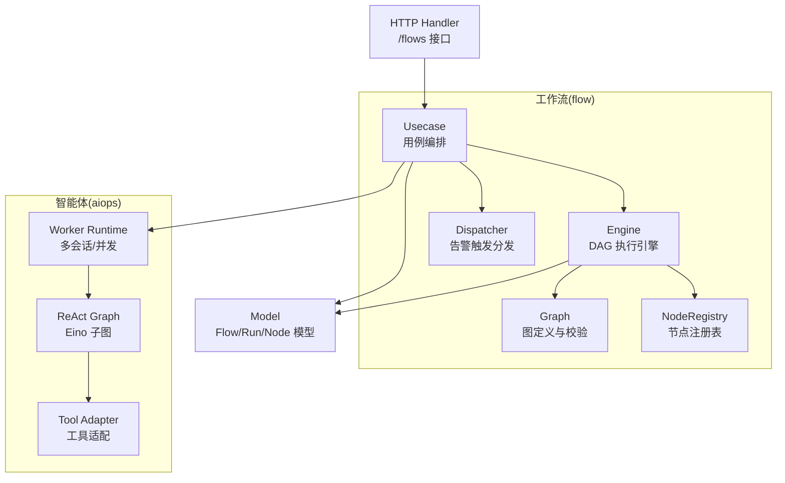
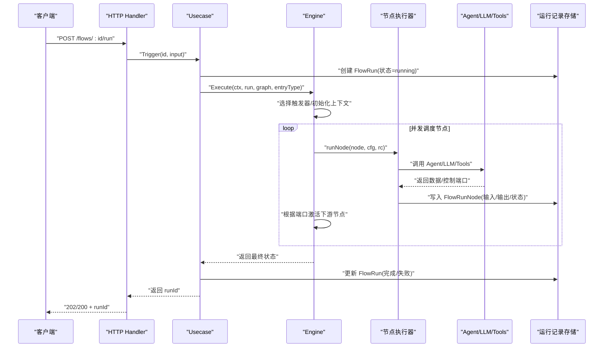
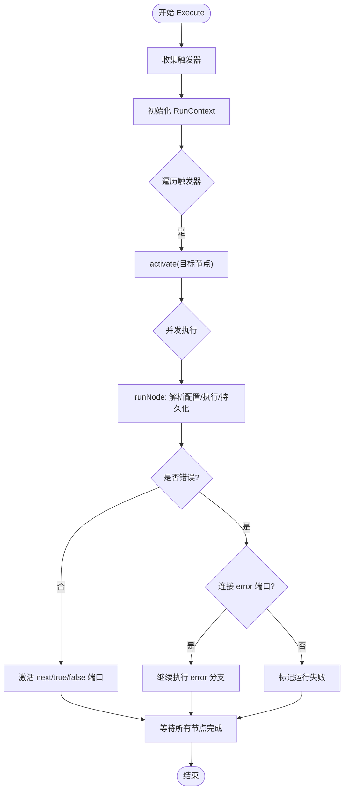
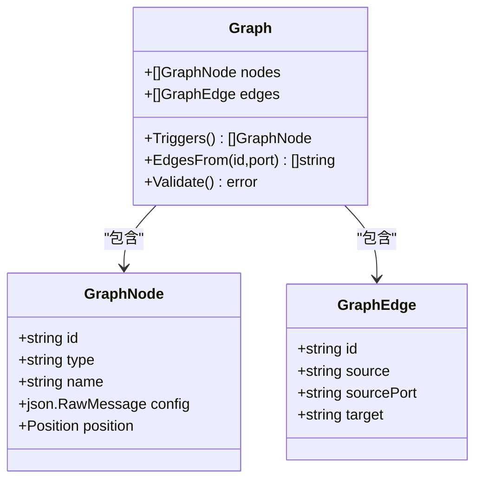
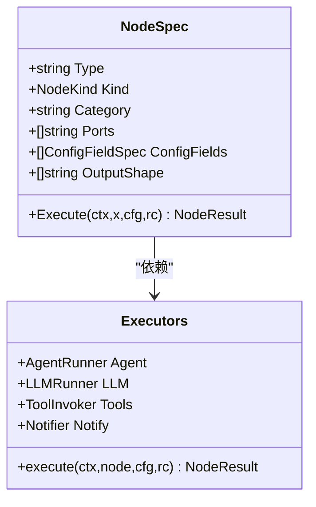
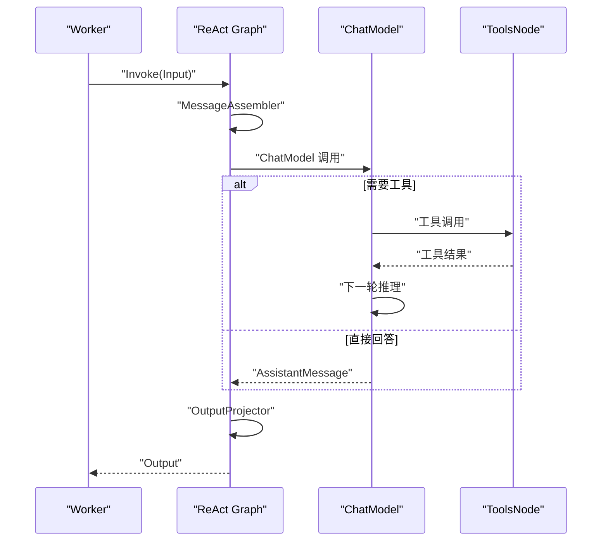
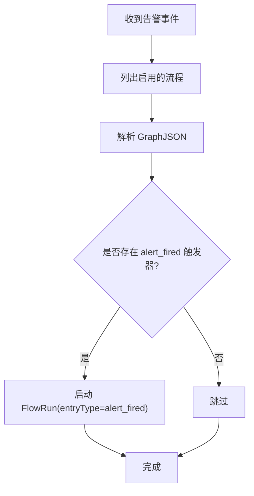
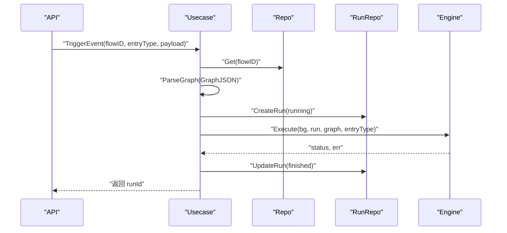
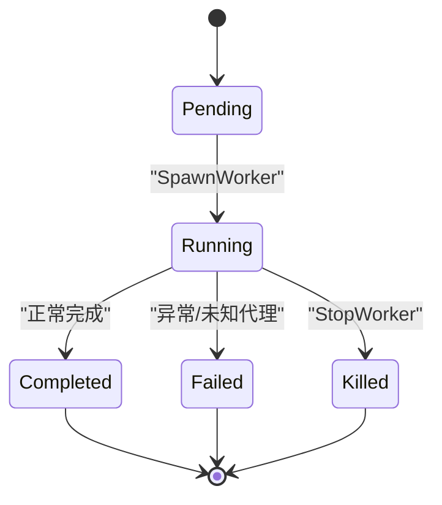
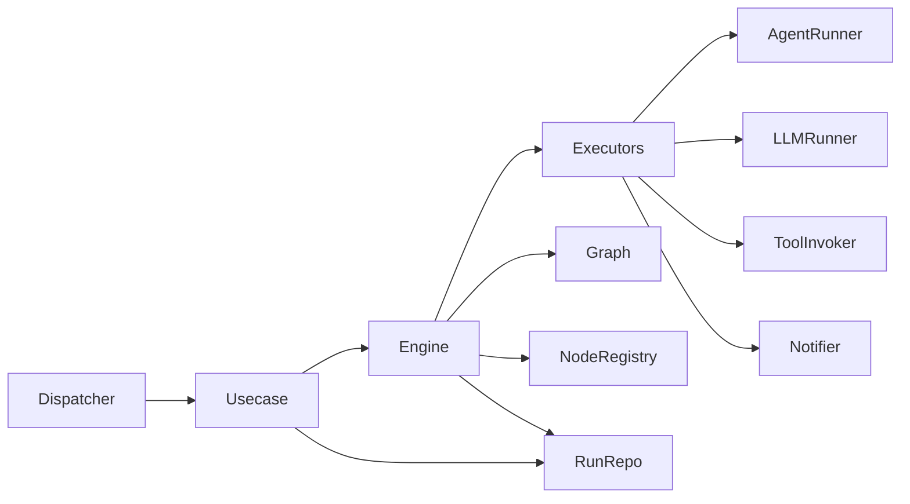

# 图内核模式

<cite>
**本文引用的文件**
- [engine.go](file://internal/manager/biz/flow/engine.go)
- [graph.go](file://internal/manager/biz/flow/graph.go)
- [noderegistry.go](file://internal/manager/biz/flow/noderegistry.go)
- [nodes.go](file://internal/manager/biz/flow/nodes.go)
- [usecase.go](file://internal/manager/biz/flow/usecase.go)
- [dispatcher.go](file://internal/manager/biz/flow/dispatcher.go)
- [model.go](file://internal/manager/model/flow/model.go)
- [react.go](file://internal/manager/biz/aiops/graph/react.go)
- [tool_adapter.go](file://internal/manager/biz/aiops/graph/tool_adapter.go)
- [worker.go](file://internal/manager/biz/aiops/chatruntime/worker.go)
- [http.go](file://internal/manager/server/flow/http.go)
</cite>

## 目录
1. [简介](#简介)
2. [项目结构](#项目结构)
3. [核心组件](#核心组件)
4. [架构总览](#架构总览)
5. [详细组件分析](#详细组件分析)
6. [依赖关系分析](#依赖关系分析)
7. [性能与执行策略](#性能与执行策略)
8. [故障排查指南](#故障排查指南)
9. [结论](#结论)
10. [附录：配置与示例](#附录：配置与示例)

## 简介
本文件系统性阐述图内核模式的架构设计与工作原理。该图内核以“工作流即图”的方式编排节点，基于 Eino 框架的 ReAct Agent 子图驱动智能体对话与工具调用，并通过 DAG 引擎实现并发、容错、可观测的执行。相比传统过程式内核，图内核具备以下优势：
- 更好的错误处理：支持 error 端口分支、panic 恢复、失败传播与可控降级。
- SOP 审核集成：通过回调与审计通道将 LLM 调用、工具调用、审批事件等纳入统一审计与 SSE 流。
- 并发执行支持：按 fan-out 并发调度节点，限制最大并发度，避免资源耗尽。
- 可插拔节点体系：通过注册表声明节点类型、控制端口、配置表单与执行器，新增节点无需改动核心。
- 可观测性与可维护性：运行期持久化每次节点输入输出、状态与耗时，便于回放与排障。

## 项目结构
图内核位于 manager 业务层，围绕 flow（工作流）与 aiops（智能体）两大模块协作：
- flow 包提供 DAG 定义、解析校验、执行引擎、节点注册与调度、触发器分发、用例编排与 HTTP 接口。
- aiops/graph 使用 Eino compose 构建 ReAct 子图，封装消息组装、模型调用、工具调用与输出投影。
- chatruntime 管理多 Worker 生命周期、会话与 SSE 事件，支撑后台任务与协同。
- model/flow 定义流程定义与运行记录的数据模型。

图表来源
- [engine.go:67-113](file://internal/manager/biz/flow/engine.go#L67-L113)
- [graph.go:97-187](file://internal/manager/biz/flow/graph.go#L97-L187)
- [noderegistry.go:93-197](file://internal/manager/biz/flow/noderegistry.go#L93-L197)
- [react.go:78-187](file://internal/manager/biz/aiops/graph/react.go#L78-L187)
- [worker.go:249-428](file://internal/manager/biz/aiops/chatruntime/worker.go#L249-L428)
- [usecase.go:277-343](file://internal/manager/biz/flow/usecase.go#L277-L343)
- [http.go:1-30](file://internal/manager/server/flow/http.go#L1-L30)

章节来源
- [engine.go:67-113](file://internal/manager/biz/flow/engine.go#L67-L113)
- [graph.go:97-187](file://internal/manager/biz/flow/graph.go#L97-L187)
- [noderegistry.go:93-197](file://internal/manager/biz/flow/noderegistry.go#L93-L197)
- [react.go:78-187](file://internal/manager/biz/aiops/graph/react.go#L78-L187)
- [worker.go:249-428](file://internal/manager/biz/aiops/chatruntime/worker.go#L249-L428)
- [usecase.go:277-343](file://internal/manager/biz/flow/usecase.go#L277-L343)
- [http.go:1-30](file://internal/manager/server/flow/http.go#L1-L30)

## 核心组件
- 图定义与校验：Graph 描述节点与边，ParseGraph/Validate 保证 ID 唯一、类型已知、端口合法、无环且触发器不可被入边指向。
- 执行引擎：Engine.Execute 从触发器启动，按 fan-out 并发调度节点，维护 OR-join 语义（执行一次），错误可走 error 端口或标记失败。
- 节点注册表：NodeSpec 声明节点行为（Kind）、类别、控制端口、配置字段、输出形状与 Execute 函数；新增节点只需注册。
- 节点执行器：Executors 聚合 AgentRunner、LLMRunner、ToolInvoker、Notifier 等能力；各内置节点（trigger/agent/llm/tool/condition/notify/set/transform/http_request）通过注册表绑定。
- 用例编排：Usecase 负责创建/更新流程、触发运行（手动/告警/定时）、测试单节点、清理历史运行。
- 触发器分发：Dispatcher 监听告警事件，匹配 trigger.alert_fired 并启动对应 Flow Run。
- ReAct 子图：基于 Eino 的 react.Agent 构建 MessageAssembler → ReActSubgraph → OutputProjector 的三段式图，封装模型调用与工具调用。
- Worker 运行时：管理多 Worker 的生命周期、会话、SSE 事件与后台任务，支持停止、继续与结果通知。

章节来源
- [graph.go:97-187](file://internal/manager/biz/flow/graph.go#L97-L187)
- [engine.go:67-113](file://internal/manager/biz/flow/engine.go#L67-L113)
- [noderegistry.go:93-197](file://internal/manager/biz/flow/noderegistry.go#L93-L197)
- [nodes.go:60-86](file://internal/manager/biz/flow/nodes.go#L60-L86)
- [usecase.go:277-343](file://internal/manager/biz/flow/usecase.go#L277-L343)
- [dispatcher.go:38-81](file://internal/manager/biz/flow/dispatcher.go#L38-L81)
- [react.go:78-187](file://internal/manager/biz/aiops/graph/react.go#L78-L187)
- [worker.go:249-428](file://internal/manager/biz/aiops/chatruntime/worker.go#L249-L428)

## 架构总览
下图展示从 HTTP 请求到图执行的端到端流程，以及 ReAct 子图的内部拓扑。

图表来源
- [http.go:1-30](file://internal/manager/server/flow/http.go#L1-L30)
- [usecase.go:277-343](file://internal/manager/biz/flow/usecase.go#L277-L343)
- [engine.go:67-113](file://internal/manager/biz/flow/engine.go#L67-L113)
- [engine.go:161-260](file://internal/manager/biz/flow/engine.go#L161-L260)
- [model.go:29-117](file://internal/manager/model/flow/model.go#L29-L117)

## 详细组件分析

### DAG 执行引擎（Engine）
- 入口：Execute(ctx, run, graph, entryType)，从触发器集合中选择入口，构造 RunContext（包含 trigger、nodes、vars）。
- 并发与限流：每个节点在独立 goroutine 中执行，使用信号量限制最大并发节点数，防止扇出爆炸。
- 执行一次与 OR-join：同一节点在同一运行中仅执行一次，后续到达视为 no-op，避免菱形合并死锁。
- 错误处理：节点错误优先走 error 端口；若无 error 边则标记运行失败，并在完成后汇总首个错误。
- 恢复机制：主 goroutine 与每个节点 goroutine 均 recover panic，确保进程稳定。
- 持久化：每个节点开始/结束写入 FlowRunNode，记录输入、输出、控制端口与错误信息。

图表来源
- [engine.go:67-113](file://internal/manager/biz/flow/engine.go#L67-L113)
- [engine.go:115-159](file://internal/manager/biz/flow/engine.go#L115-L159)
- [engine.go:161-260](file://internal/manager/biz/flow/engine.go#L161-L260)

章节来源
- [engine.go:67-113](file://internal/manager/biz/flow/engine.go#L67-L113)
- [engine.go:115-159](file://internal/manager/biz/flow/engine.go#L115-L159)
- [engine.go:161-260](file://internal/manager/biz/flow/engine.go#L161-L260)

### 图定义与校验（Graph）
- 数据结构：Graph 由 Nodes 与 Edges 组成；Edge 默认 sourcePort 为 next。
- 校验规则：
  - 节点 ID 格式与唯一性。
  - 节点类型必须已注册。
  - 边的源/目标必须存在，且端口合法（error 端口特殊处理）。
  - 触发器节点不允许有入边。
  - 使用 Kahn 算法检测环。
- 辅助方法：Triggers() 获取触发器；EdgesFrom(id, port) 获取某端口出发的目标节点。

图表来源
- [graph.go:48-76](file://internal/manager/biz/flow/graph.go#L48-L76)
- [graph.go:97-187](file://internal/manager/biz/flow/graph.go#L97-L187)

章节来源
- [graph.go:97-187](file://internal/manager/biz/flow/graph.go#L97-L187)

### 节点注册表与执行器（NodeRegistry & Executors）
- 节点分类：KindTrigger/Action/Control/Data，用于引擎与校验器统一处理，不依赖字符串前缀约定。
- 节点规格：NodeSpec 声明类型、类别、端口、配置字段、输出形状与 Execute 函数。
- 内置节点：
  - trigger.manual/trigger.alert_fired/trigger.cron：入口节点，输出 trigger payload。
  - agent：调用 AgentRunner，支持结构化输出 schema。
  - llm：单次 LLM 调用，支持结构化输出 schema。
  - tool：调用 ToolInvoker，参数来自 BaseTool 的 schema。
  - condition：表达式求值，输出 true/false。
  - notify：发送通知。
  - set：设置变量（Vars 写回由引擎在锁内应用）。
  - transform：字段映射。
  - http_request：发起 HTTP 请求，支持超时控制。
- 执行器：Executors.execute 根据节点类型查找 NodeSpec 并调用其 Execute。

图表来源
- [noderegistry.go:18-61](file://internal/manager/biz/flow/noderegistry.go#L18-L61)
- [noderegistry.go:93-197](file://internal/manager/biz/flow/noderegistry.go#L93-L197)
- [nodes.go:60-86](file://internal/manager/biz/flow/nodes.go#L60-L86)

章节来源
- [noderegistry.go:18-61](file://internal/manager/biz/flow/noderegistry.go#L18-L61)
- [noderegistry.go:93-197](file://internal/manager/biz/flow/noderegistry.go#L93-L197)
- [nodes.go:60-86](file://internal/manager/biz/flow/nodes.go#L60-L86)

### ReAct 子图（Eino 集成）
- 拓扑：MessageAssembler → ReActSubgraph → OutputProjector。
- 功能：
  - 组装系统提示、历史消息、每轮注入的 system-reminder 与用户文本。
  - 复用 eino 的 react.Agent 子图，内置 ChatModel ↔ ToolsNode 循环。
  - 未知工具处理：UnknownToolsHandler 返回友好提示，避免整次运行中断。
  - 步数预算：MaxStep 与 MaxRunSteps 合理放大，避免过早截断。
- 工具适配：WrapBaseTool 将内部 BaseTool 适配为 eino 的 InvokableTool，透传调用选项与持久化。

图表来源
- [react.go:78-187](file://internal/manager/biz/aiops/graph/react.go#L78-L187)
- [react.go:190-248](file://internal/manager/biz/aiops/graph/react.go#L190-L248)
- [tool_adapter.go:241-269](file://internal/manager/biz/aiops/graph/tool_adapter.go#L241-L269)

章节来源
- [react.go:78-187](file://internal/manager/biz/aiops/graph/react.go#L78-L187)
- [react.go:190-248](file://internal/manager/biz/aiops/graph/react.go#L190-L248)
- [tool_adapter.go:241-269](file://internal/manager/biz/aiops/graph/tool_adapter.go#L241-L269)

### 触发器分发（Dispatcher）
- 当告警产生时，Dispatcher 非阻塞地扫描启用中的流程，匹配 trigger.alert_fired 的配置（规则名包含、最低严重度），并以 incident 上下文作为 {{trigger.*}} 启动运行。
- 每个流程在每个告警下最多启动一次运行。

图表来源
- [dispatcher.go:38-81](file://internal/manager/biz/flow/dispatcher.go#L38-L81)

章节来源
- [dispatcher.go:38-81](file://internal/manager/biz/flow/dispatcher.go#L38-L81)

### 用例编排（Usecase）
- 创建/更新流程：保存 GraphJSON，版本递增，执行图校验。
- 触发运行：
  - 手动：Trigger(id, input)。
  - 事件：TriggerEvent(flowID, entryType, payload)。
  - 内部：triggerRun 创建 FlowRun，分离上下文，异步执行 Engine.Execute，完成后更新状态。
- 测试单节点：TestNode 隔离执行单个节点，避免副作用（如 notify、写类工具）。
- 清理：HealStaleRuns、PruneOldRuns。

图表来源
- [usecase.go:277-343](file://internal/manager/biz/flow/usecase.go#L277-L343)

章节来源
- [usecase.go:277-343](file://internal/manager/biz/flow/usecase.go#L277-L343)

### Worker 运行时（chatruntime）
- 生命周期：pending → running → completed/failed/killed。
- 后台任务：Background=true 时立即返回 running，完成后通过 ParentEmit 推送 task_notification。
- 会话与审计：为每个 worker 创建会话行，持久化用户消息与工具调用帧，支持父子会话关系。
- 工具过滤：按 persona 白名单/黑名单裁剪工具集，viewer 模式仅读。
- 停止与继续：StopWorker 取消运行；SendToWorker 追加消息继续执行。

图表来源
- [worker.go:60-79](file://internal/manager/biz/aiops/chatruntime/worker.go#L60-L79)
- [worker.go:249-428](file://internal/manager/biz/aiops/chatruntime/worker.go#L249-L428)

章节来源
- [worker.go:60-79](file://internal/manager/biz/aiops/chatruntime/worker.go#L60-L79)
- [worker.go:249-428](file://internal/manager/biz/aiops/chatruntime/worker.go#L249-L428)

## 依赖关系分析
- 低耦合：Engine 通过 Executors 抽象与外部子系统（Agent/LLM/Tools/Notify）解耦，便于测试与替换。
- 注册表驱动：NodeSpec 集中声明节点行为，引擎与前端共享同一份元数据，减少硬编码。
- Eino 集成：ReAct 子图通过 compose 构建，回调链在 Invoke 时注入，避免编译期绑定，支持 per-call 审计与度量。
- 数据流：数据通过 RunContext 共享（{{trigger.*}}/{{nodes.*}}/{{vars.*}}），边仅承载控制流，简化跨节点数据传递。

图表来源
- [nodes.go:60-86](file://internal/manager/biz/flow/nodes.go#L60-L86)
- [engine.go:67-113](file://internal/manager/biz/flow/engine.go#L67-L113)
- [usecase.go:277-343](file://internal/manager/biz/flow/usecase.go#L277-L343)
- [dispatcher.go:38-81](file://internal/manager/biz/flow/dispatcher.go#L38-L81)

章节来源
- [nodes.go:60-86](file://internal/manager/biz/flow/nodes.go#L60-L86)
- [engine.go:67-113](file://internal/manager/biz/flow/engine.go#L67-L113)
- [usecase.go:277-343](file://internal/manager/biz/flow/usecase.go#L277-L343)
- [dispatcher.go:38-81](file://internal/manager/biz/flow/dispatcher.go#L38-L81)

## 性能与执行策略
- 并发控制：maxConcurrentNodes 限制同时运行的节点数，避免资源竞争。
- 超时控制：
  - 默认节点超时：2 分钟。
  - Agent 节点超时：15 分钟（ReAct 可能较长）。
  - LLM 节点超时：3 分钟。
  - HTTP 请求节点支持 timeout_seconds 配置（默认 30，最大 120）。
- 重试机制：当前未内置自动重试；可在上游（如 Dispatcher/Usecase）对特定场景进行重试包装。
- 熔断策略：
  - 未知工具处理：返回友好提示，避免整次运行中断。
  - 步数预算：ReAct 子图通过 MaxStep/MaxRunSteps 限制迭代次数，防止无限循环。
  - 工具调用预算：工具适配器对重复调用进行预算控制，超出后返回 call_budget_exceeded 指令。
- 运行清理：支持 Stale Runs 修复与旧运行修剪，避免历史膨胀。

章节来源
- [engine.go:30-32](file://internal/manager/biz/flow/engine.go#L30-L32)
- [nodes.go:68-75](file://internal/manager/biz/flow/nodes.go#L68-L75)
- [noderegistry.go:184-196](file://internal/manager/biz/flow/noderegistry.go#L184-L196)
- [react.go:111-123](file://internal/manager/biz/aiops/graph/react.go#L111-L123)
- [react.go:178-183](file://internal/manager/biz/aiops/graph/react.go#L178-L183)
- [tool_adapter.go:225-239](file://internal/manager/biz/aiops/graph/tool_adapter.go#L225-L239)
- [usecase.go:372-409](file://internal/manager/biz/flow/usecase.go#L372-L409)

## 故障排查指南
- 常见错误定位：
  - 图校验失败：检查节点 ID、类型、端口合法性与环检测。
  - 触发器缺失：确认 entryType 对应的触发器存在于图中。
  - 节点执行失败：查看 FlowRunNode 的 InputJSON/OutputJSON/Error/FiredPort。
  - 运行失败：Engine 会记录首个错误；若连接了 error 端口，运行可能成功但分支失败。
- 调试建议：
  - 使用 TestNode 验证单节点输出与字段引用。
  - 通过 RunContext 模板（{{trigger.*}}/{{nodes.*}}/{{vars.*}}）逐步验证数据流转。
  - 关注日志中的 panic 堆栈与节点级 panic 恢复信息。
- 恢复与清理：
  - 服务重启后，使用 HealStaleRuns 修复卡住的运行。
  - 定期 PruneOldRuns 清理历史运行。

章节来源
- [graph.go:97-187](file://internal/manager/biz/flow/graph.go#L97-L187)
- [engine.go:67-113](file://internal/manager/biz/flow/engine.go#L67-L113)
- [engine.go:161-260](file://internal/manager/biz/flow/engine.go#L161-L260)
- [usecase.go:185-221](file://internal/manager/biz/flow/usecase.go#L185-L221)
- [usecase.go:372-409](file://internal/manager/biz/flow/usecase.go#L372-L409)

## 结论
图内核模式通过“图即工作流”的设计，将复杂的多步骤、多工具、多智能体的编排可视化、可配置、可观测。结合 Eino 的 ReAct 子图，实现了强大的智能体对话与工具调用能力；通过 DAG 引擎的并发、容错与可插拔节点体系，提供了高可靠、可扩展的执行环境。相比传统内核，图内核在错误处理、SOP 审核集成、并发执行等方面具有显著优势，适合运维自动化、事件响应、知识检索与报告生成等复杂场景。

## 附录：配置与示例
- 节点超时与重试：
  - 默认节点超时：2 分钟；Agent 节点：15 分钟；LLM 节点：3 分钟。
  - HTTP 请求节点支持 timeout_seconds（默认 30，最大 120）。
  - 重试需在上层实现（如 Dispatcher/Usecase 包装）。
- 熔断策略：
  - 未知工具处理：返回友好提示，避免中断。
  - 步数预算：MaxStep/MaxRunSteps 限制迭代次数。
  - 工具调用预算：call_budget_exceeded 指令限制重复调用。
- 执行流程示例（路径参考）：
  - 会话初始化与图构建：[usecase.go:277-343](file://internal/manager/biz/flow/usecase.go#L277-L343)
  - 图校验与触发器选择：[graph.go:97-187](file://internal/manager/biz/flow/graph.go#L97-L187)
  - 节点执行与结果聚合：[engine.go:161-260](file://internal/manager/biz/flow/engine.go#L161-L260)
  - ReAct 子图调用：[react.go:78-187](file://internal/manager/biz/aiops/graph/react.go#L78-L187)
  - 工具适配与调用：[tool_adapter.go:241-269](file://internal/manager/biz/aiops/graph/tool_adapter.go#L241-L269)
  - Worker 生命周期：[worker.go:249-428](file://internal/manager/biz/aiops/chatruntime/worker.go#L249-L428)
  - HTTP 接口：[http.go:1-30](file://internal/manager/server/flow/http.go#L1-L30)

章节来源
- [nodes.go:68-75](file://internal/manager/biz/flow/nodes.go#L68-L75)
- [noderegistry.go:184-196](file://internal/manager/biz/flow/noderegistry.go#L184-L196)
- [react.go:111-123](file://internal/manager/biz/aiops/graph/react.go#L111-L123)
- [react.go:178-183](file://internal/manager/biz/aiops/graph/react.go#L178-L183)
- [tool_adapter.go:225-239](file://internal/manager/biz/aiops/graph/tool_adapter.go#L225-L239)
- [usecase.go:277-343](file://internal/manager/biz/flow/usecase.go#L277-L343)
- [graph.go:97-187](file://internal/manager/biz/flow/graph.go#L97-L187)
- [engine.go:161-260](file://internal/manager/biz/flow/engine.go#L161-L260)
- [react.go:78-187](file://internal/manager/biz/aiops/graph/react.go#L78-L187)
- [tool_adapter.go:241-269](file://internal/manager/biz/aiops/graph/tool_adapter.go#L241-L269)
- [worker.go:249-428](file://internal/manager/biz/aiops/chatruntime/worker.go#L249-L428)
- [http.go:1-30](file://internal/manager/server/flow/http.go#L1-L30)