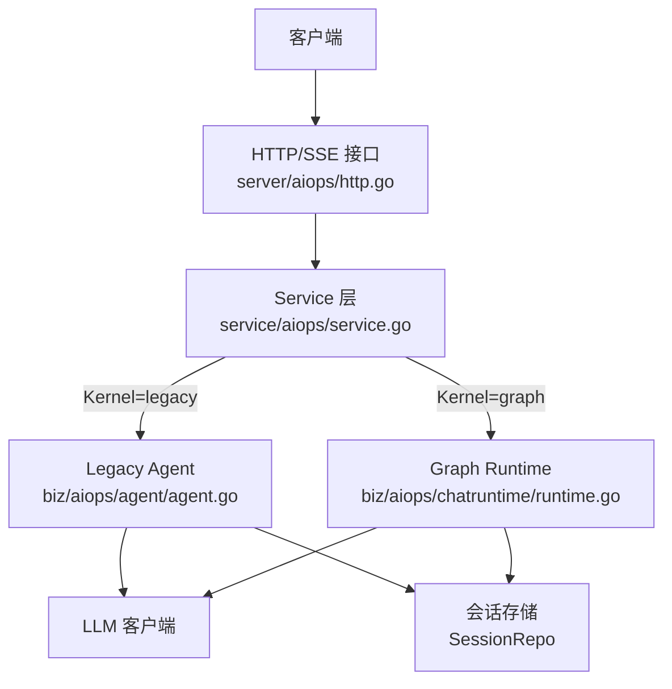
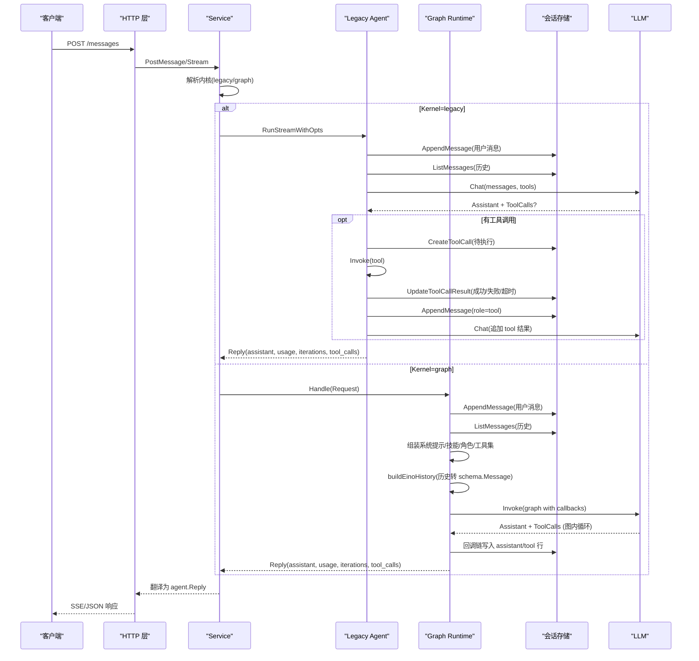
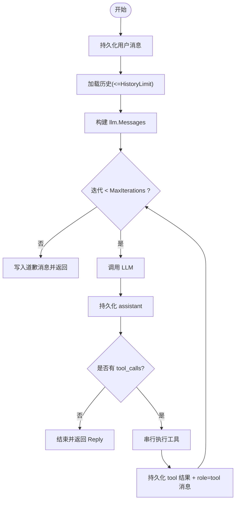
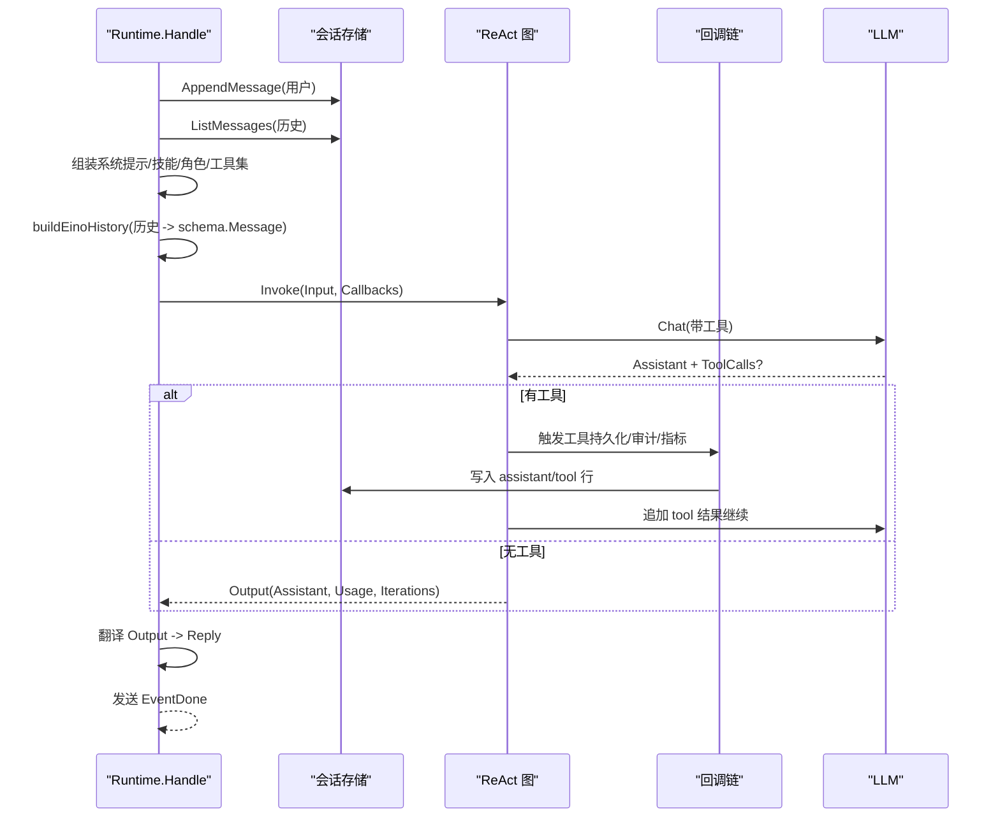
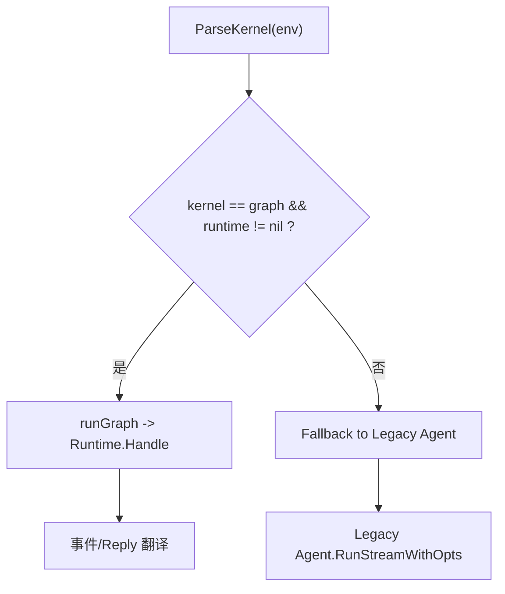
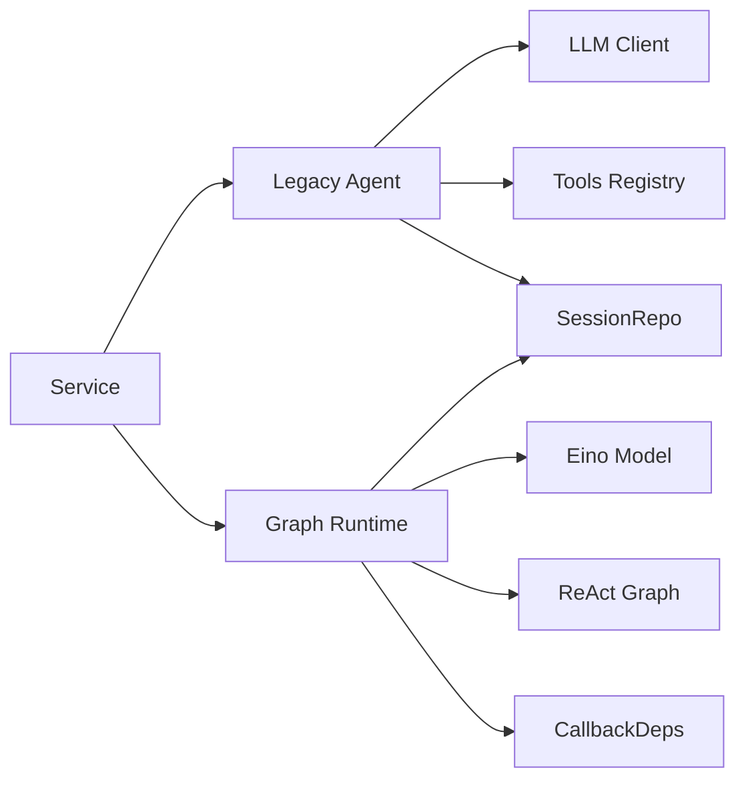

# 对话循环引擎

<cite>
**本文引用的文件**
- [agent.go](file://internal/manager/biz/aiops/agent/agent.go)
- [service.go](file://internal/manager/service/aiops/service.go)
- [runtime.go](file://internal/manager/biz/aiops/chatruntime/runtime.go)
- [types.go](file://internal/manager/biz/aiops/graph/types.go)
- [http.go](file://internal/manager/server/aiops/http.go)
</cite>

## 目录
1. [简介](#简介)
2. [项目结构](#项目结构)
3. [核心组件](#核心组件)
4. [架构总览](#架构总览)
5. [详细组件分析](#详细组件分析)
6. [依赖关系分析](#依赖关系分析)
7. [性能与超时控制](#性能与超时控制)
8. [故障排查指南](#故障排查指南)
9. [结论](#结论)
10. [附录：扩展点与自定义示例](#附录：扩展点与自定义示例)

## 简介
本文件面向“对话循环引擎”的深入文档，聚焦 Agent 的核心对话循环机制：用户消息处理、历史消息加载、LLM 调用流程、响应处理；两种内核模式（legacy 与 graph）的工作原理与切换机制；对话状态管理、上下文构建、消息序列化/反序列化；最大迭代次数控制、超时处理与错误恢复策略；并提供具体代码路径与流程图，帮助读者理解执行细节与可扩展点。

## 项目结构
对话循环引擎位于 manager/aiops 业务层，由服务层选择内核并调度到 legacy agent 或 graph runtime：
- 服务层 service/aiops：负责请求路由、权限校验、内核选择、SSE 事件桥接
- Legacy 内核 internal/manager/biz/aiops/agent：基于 for 循环的 ReAct 式工具调用
- Graph 内核 internal/manager/biz/aiops/chatruntime：基于 eino 图编排的重入式 ReAct 循环
- 图配置 internal/manager/biz/aiops/graph/types.go：图运行参数与输出结构
- HTTP 层 internal/manager/server/aiops/http.go：将 Reply 转为 SSE/JSON 响应

图表来源
- [service.go:334-380](file://internal/manager/service/aiops/service.go#L334-L380)
- [agent.go:303-331](file://internal/manager/biz/aiops/agent/agent.go#L303-L331)
- [runtime.go:516-840](file://internal/manager/biz/aiops/chatruntime/runtime.go#L516-L840)
- [http.go:1043-1081](file://internal/manager/server/aiops/http.go#L1043-L1081)

章节来源
- [service.go:1-123](file://internal/manager/service/aiops/service.go#L1-L123)
- [agent.go:1-15](file://internal/manager/biz/aiops/agent/agent.go#L1-L15)
- [runtime.go:1-36](file://internal/manager/biz/aiops/chatruntime/runtime.go#L1-L36)

## 核心组件
- Service 层：统一入口，解析内核类型，维护取消表以支持“停止”中断，兼容 legacy 与 graph 的事件格式
- Legacy Agent：显式 for 循环驱动 ReAct，逐轮调用 LLM，串行执行工具，持久化 assistant/tool 消息，统计 token 用量
- Graph Runtime：通过 eino 图编排 ReAct，回调链负责持久化、审计、指标、预算、SSE 等横切关注点
- Graph Config/Output：定义最大迭代、工具持久化、输出结构（最终 assistant 消息、迭代计数、token 用量）
- HTTP 适配：将 Reply 转换为 SSE/JSON DTO，保持前后端契约不变

章节来源
- [service.go:48-123](file://internal/manager/service/aiops/service.go#L48-L123)
- [agent.go:36-62](file://internal/manager/biz/aiops/agent/agent.go#L36-L62)
- [runtime.go:149-177](file://internal/manager/biz/aiops/chatruntime/runtime.go#L149-L177)
- [types.go:110-141](file://internal/manager/biz/aiops/graph/types.go#L110-L141)
- [http.go:1043-1081](file://internal/manager/server/aiops/http.go#L1043-L1081)

## 架构总览
下图展示一次用户消息从 HTTP 进入，经 Service 选择内核，再到 Legacy Agent 或 Graph Runtime 的完整流程，包括历史加载、上下文构建、LLM 调用、工具执行、结果持久化与 SSE 事件回传。

图表来源
- [service.go:334-380](file://internal/manager/service/aiops/service.go#L334-L380)
- [agent.go:331-723](file://internal/manager/biz/aiops/agent/agent.go#L331-L723)
- [runtime.go:516-912](file://internal/manager/biz/aiops/chatruntime/runtime.go#L516-L912)
- [http.go:1043-1081](file://internal/manager/server/aiops/http.go#L1043-L1081)

## 详细组件分析

### Legacy Agent 对话循环
- 用户消息处理：先持久化用户消息（含 @mention 扩写），再加载历史（受 HistoryLimit 限制）
- 上下文构建：buildMessages 将历史转为 llm.Message，包含 system/user/assistant/tool，按 tool_call_id 配对 tool 结果
- LLM 调用：每轮调用 llm.Chat，累积 Usage，持久化 assistant 消息（可能无文本但有 tool_calls）
- 工具执行：串行执行每个 tool_call，记录 pending/success/error/timeout，持久化 tool 结果并追加 role=tool 消息
- 终止条件：assistant 未请求工具则结束；否则继续下一轮
- 最大迭代控制：超过 MaxIterations 时写入友好道歉消息并返回

图表来源
- [agent.go:331-723](file://internal/manager/biz/aiops/agent/agent.go#L331-L723)

章节来源
- [agent.go:331-723](file://internal/manager/biz/aiops/agent/agent.go#L331-L723)

### Graph Runtime 对话循环
- 用户消息处理：同样先持久化用户消息（含 @mention 扩写），再加载历史
- 上下文构建：根据 SkillRegistry、AgentPersona、全局 BasePrompt 组装系统提示；构建 eino history（buildEinoHistory）
- 图编排：BuildReActGraph 构造 ReAct 图，回调链负责持久化、审计、指标、预算、SSE
- LLM 调用：Invoke(graph)，图内部进行多轮 ReAct，自动处理 tool 调用与结果注入
- 错误恢复：图级错误软失败，写入道歉消息并发送 Done，保证前端体验一致
- 回复转换：将 Output 转为 Reply，携带 assistant、usage、iterations、tool_calls

图表来源
- [runtime.go:516-912](file://internal/manager/biz/aiops/chatruntime/runtime.go#L516-L912)
- [runtime.go:1119-1280](file://internal/manager/biz/aiops/chatruntime/runtime.go#L1119-L1280)

章节来源
- [runtime.go:516-912](file://internal/manager/biz/aiops/chatruntime/runtime.go#L516-L912)
- [runtime.go:1119-1280](file://internal/manager/biz/aiops/chatruntime/runtime.go#L1119-L1280)

### 内核切换机制
- 环境变量解析：ParseKernel 将字符串解析为 Kernel（默认 graph，显式 legacy 走旧路径）
- Service.runWithKernel：若 kernel=graph 且 runtime!=nil，则走 runGraph；否则 fallback 到 legacy
- 事件桥接：translateRuntimeEvent 将 graph 事件映射为 legacy 事件名，确保 SSE 帧名称字节相等
- 降级保护：kernel=graph 但 runtime=nil 时记录警告并回退 legacy

图表来源
- [service.go:60-71](file://internal/manager/service/aiops/service.go#L60-L71)
- [service.go:334-380](file://internal/manager/service/aiops/service.go#L334-L380)
- [service.go:438-471](file://internal/manager/service/aiops/service.go#L438-L471)

章节来源
- [service.go:60-71](file://internal/manager/service/aiops/service.go#L60-L71)
- [service.go:334-380](file://internal/manager/service/aiops/service.go#L334-L380)
- [service.go:438-471](file://internal/manager/service/aiops/service.go#L438-L471)

### 对话状态管理与上下文构建
- 会话所有权：Service 与 Runtime/Agent 均检查 session.owner，非 owner 返回 ErrNotFound
- 上下文构建：
  - Legacy：buildMessages 将历史转为 llm.Message，按 tool_call_id 配对 tool 结果
  - Graph：buildEinoHistory 将历史转为 schema.Message，严格保证 tool 消息紧随 tool_calls
- 工具暴露控制：
  - Legacy：根据 WebSearchEnabled、K8s 操作权限过滤工具 schema
  - Graph：根据 viewer 角色、AgentWriteEnabled、Persona 白名单过滤工具集
- 动态提示：Graph 计算 per-turn hints（连续失败、重复调用、未执行的承诺等）注入 system-reminder

章节来源
- [agent.go:396-418](file://internal/manager/biz/aiops/agent/agent.go#L396-L418)
- [agent.go:725-800](file://internal/manager/biz/aiops/agent/agent.go#L725-L800)
- [runtime.go:597-700](file://internal/manager/biz/aiops/chatruntime/runtime.go#L597-L700)
- [runtime.go:1332-1375](file://internal/manager/biz/aiops/chatruntime/runtime.go#L1332-L1375)

### 消息序列化与反序列化
- Legacy：buildMessages 将 model.Message 转为 llm.Message，处理 tool replay（tool_call_id 优先，顺序回退）
- Graph：buildEinoHistory 将 aiopsmodel.Message 转为 schema.Message，严格配对 tool_calls 与 tool 结果，丢弃孤儿 tool 消息
- 兼容性：两者都保证 provider 对 tool 消息顺序的要求（如 DeepSeek v4+ 拒绝 orphan tool）

章节来源
- [agent.go:725-800](file://internal/manager/biz/aiops/agent/agent.go#L725-L800)
- [runtime.go:1119-1280](file://internal/manager/biz/aiops/chatruntime/runtime.go#L1119-L1280)

### 最大迭代次数控制、超时与错误恢复
- Legacy：
  - MaxIterations：默认 30，超出后写入道歉消息并返回
  - ToolTimeout：默认 15s，per-tool 超时
  - 错误恢复：工具执行异常/超时分类并持久化，继续循环直到终止或达到上限
- Graph：
  - GraphCfg.MaxIterations：可被 Persona 覆盖，防止协调器无限链式调用
  - 图级错误：软失败，写入道歉消息并发送 Done，避免前端流错误
  - 工具预算/重复检测：动态 hints 提示模型停止重复调用

章节来源
- [agent.go:40-54](file://internal/manager/biz/aiops/agent/agent.go#L40-L54)
- [agent.go:419-723](file://internal/manager/biz/aiops/agent/agent.go#L419-L723)
- [runtime.go:710-721](file://internal/manager/biz/aiops/chatruntime/runtime.go#L710-L721)
- [runtime.go:830-874](file://internal/manager/biz/aiops/chatruntime/runtime.go#L830-L874)
- [runtime.go:1332-1375](file://internal/manager/biz/aiops/chatruntime/runtime.go#L1332-L1375)

## 依赖关系分析
- Service 依赖：
  - Legacy Agent：for-loop ReAct 实现
  - Graph Runtime：eino 图编排与回调链
  - SessionRepo：会话/消息/工具调用持久化
  - UsageUsecase：用量统计
- Agent 依赖：
  - LLM Client：Chat 接口
  - Tools Registry：工具注册与调用
  - SessionRepo：消息/工具调用存储
- Runtime 依赖：
  - Eino Model：ToolCallingChatModel
  - Graph：BuildReActGraph
  - CallbackDeps：持久化、审计、指标、预算、SSE
  - Skill/Agent Registry：技能与角色配置

图表来源
- [service.go:73-123](file://internal/manager/service/aiops/service.go#L73-L123)
- [agent.go:255-301](file://internal/manager/biz/aiops/agent/agent.go#L255-L301)
- [runtime.go:179-245](file://internal/manager/biz/aiops/chatruntime/runtime.go#L179-L245)

章节来源
- [service.go:73-123](file://internal/manager/service/aiops/service.go#L73-L123)
- [agent.go:255-301](file://internal/manager/biz/aiops/agent/agent.go#L255-L301)
- [runtime.go:179-245](file://internal/manager/biz/aiops/chatruntime/runtime.go#L179-L245)

## 性能与超时控制
- 历史加载限制：HistoryLimit 控制回放消息数量，避免上下文过大
- 工具超时：Legacy 每工具默认 15s，Graph 通过回调链与图配置控制
- 最大迭代：Legacy 默认 30，Graph 可由 Persona 覆盖，防止长链调用
- 资源释放：Graph 在退出时 FinalizeBatches 清理未完成批处理
- SSE 流控：事件桥接确保 SPA 无需改动，避免多余帧

章节来源
- [agent.go:40-54](file://internal/manager/biz/aiops/agent/agent.go#L40-L54)
- [runtime.go:822-829](file://internal/manager/biz/aiops/chatruntime/runtime.go#L822-L829)
- [runtime.go:710-721](file://internal/manager/biz/aiops/chatruntime/runtime.go#L710-L721)

## 故障排查指南
- 常见错误：
  - 工具未找到：Graph 中工具名不在 schema，会触发软失败并给出友好提示
  - 超迭代：Legacy 写入道歉消息；Graph 通过 max steps 控制
  - 孤儿 tool 消息：buildEinoHistory 会丢弃，避免 provider 400
- 定位步骤：
  - 查看 SSE 事件序列（assistant/tool/done）
  - 检查 tool_call 状态（pending/success/error/timeout）
  - 确认 HistoryLimit 与 MaxIterations 配置
  - 验证 Persona 工具白名单与 AgentWriteEnabled 设置

章节来源
- [runtime.go:1675-1696](file://internal/manager/biz/aiops/chatruntime/runtime.go#L1675-L1696)
- [agent.go:695-723](file://internal/manager/biz/aiops/agent/agent.go#L695-L723)
- [runtime.go:1119-1280](file://internal/manager/biz/aiops/chatruntime/runtime.go#L1119-L1280)

## 结论
对话循环引擎通过 Service 层统一抽象，提供 legacy 与 graph 两种内核实现，既保持向后兼容又支持更强大的图编排能力。Legacy 内核简单直观，适合快速迭代；Graph 内核通过回调链与动态提示提升鲁棒性与可观测性。两者在消息序列化、工具执行、错误恢复上保持一致行为，确保前端与下游系统无感知切换。

## 附录：扩展点与自定义示例
- 自定义工具：
  - Legacy：注册到 tools.Registry，并在 Schema 中声明；注意 WebSearchEnabled 与 K8s 权限过滤
  - Graph：添加到 ToolBag，或通过 ReplaceToolsByNamePrefix 动态替换
- 自定义 Persona：
  - 设置 AgentID，指定 SystemPrompt、工具白名单、MaxTurns
- 自定义历史回放：
  - 调整 HistoryLimit，确保 buildMessages/buildEinoHistory 能正确配对 tool_calls
- 自定义超时与迭代：
  - Legacy：Config.ToolTimeout、Config.MaxIterations
  - Graph：GraphCfg.MaxIterations，结合 Persona 覆盖

章节来源
- [agent.go:40-54](file://internal/manager/biz/aiops/agent/agent.go#L40-L54)
- [runtime.go:179-245](file://internal/manager/biz/aiops/chatruntime/runtime.go#L179-L245)
- [runtime.go:615-677](file://internal/manager/biz/aiops/chatruntime/runtime.go#L615-L677)