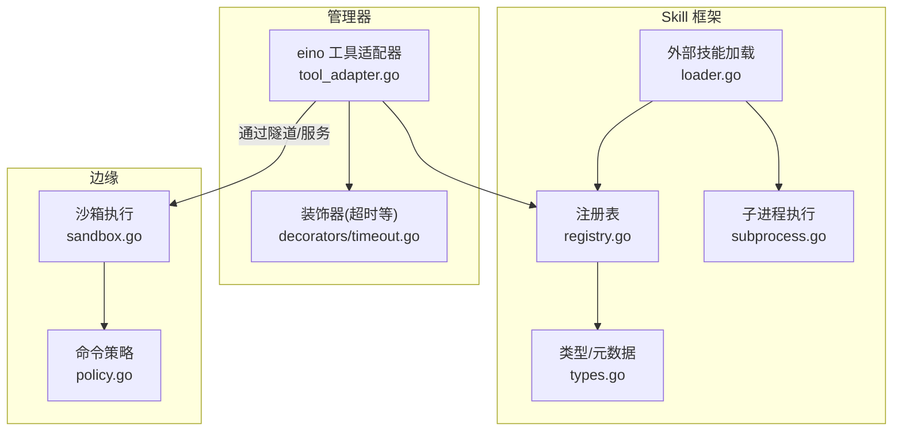
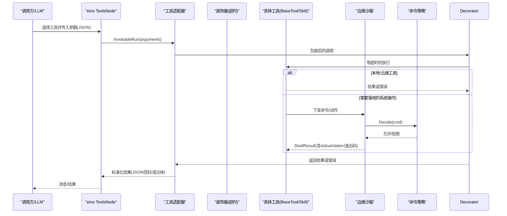
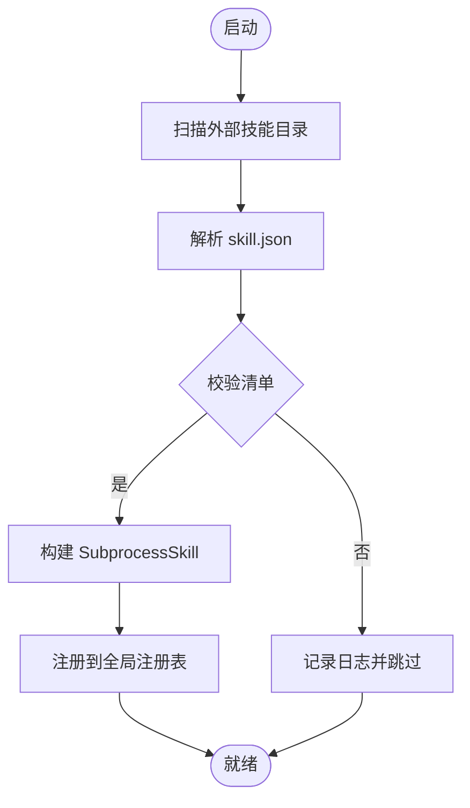
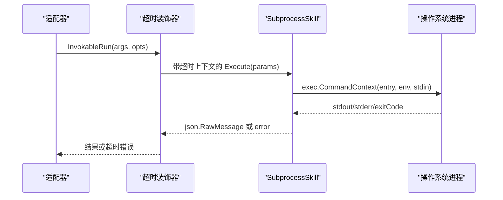
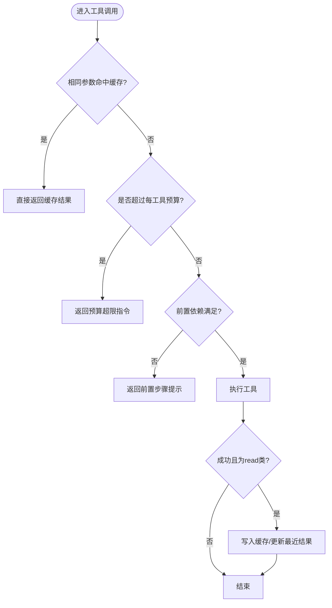
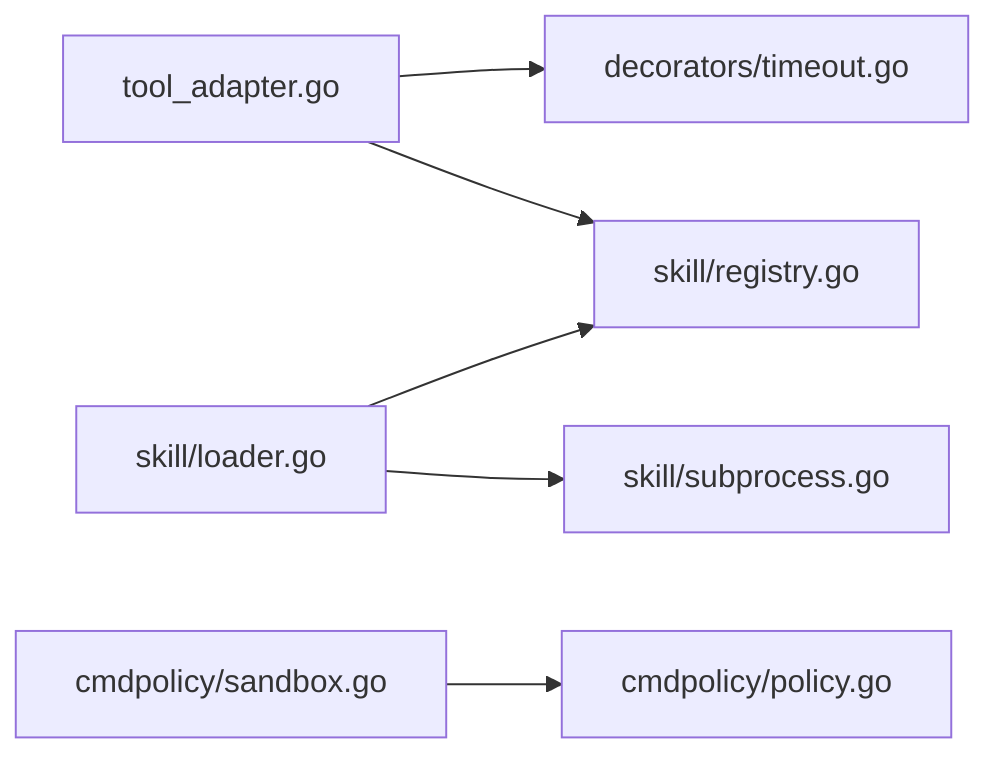

# 工具执行

<cite>
**本文引用的文件**
- [internal/skill/registry.go](file://internal/skill/registry.go)
- [internal/skill/types.go](file://internal/skill/types.go)
- [internal/skill/loader.go](file://internal/skill/loader.go)
- [internal/skill/subprocess.go](file://internal/skill/subprocess.go)
- [internal/edgeagent/cmdpolicy/policy.go](file://internal/edgeagent/cmdpolicy/policy.go)
- [internal/edgeagent/cmdpolicy/sandbox.go](file://internal/edgeagent/cmdpolicy/sandbox.go)
- [internal/manager/biz/aiops/graph/tool_adapter.go](file://internal/manager/biz/aiops/graph/tool_adapter.go)
- [internal/manager/biz/aiops/tools/decorators/timeout.go](file://internal/manager/biz/aiops/tools/decorators/timeout.go)
</cite>

## 目录
1. [简介](#简介)
2. [项目结构](#项目结构)
3. [核心组件](#核心组件)
4. [架构总览](#架构总览)
5. [详细组件分析](#详细组件分析)
6. [依赖关系分析](#依赖关系分析)
7. [性能考量](#性能考量)
8. [故障排查指南](#故障排查指南)
9. [结论](#结论)
10. [附录](#附录)

## 简介
本文件系统性说明 ongrid 中“工具执行”的完整机制，覆盖：
- 工具注册与发现（Skill 注册表、外部技能加载）
- 参数校验与上下文构建（Schema 校验、调用选项注入）
- 执行流程（适配器包装、装饰器链、子进程/命令执行）
- 超时控制、错误处理与重试策略
- 安全检查（权限分类、沙箱隔离、路径/网络白名单、资源限制）
- 与对话循环的集成（图执行层、并行调用、预算与去重）
- 端到端示例流程（查找工具、解析参数、执行调用、封装结果）

## 项目结构
与工具执行相关的关键模块分布在以下层次：
- Skill 框架（设备侧/管理侧能力抽象、注册表、外部技能加载与子进程执行）
- 边缘命令策略与沙箱（命令白名单、读写分类、路径/网络白名单、输出限流、超时）
- 管理器工具适配层（将内部 BaseTool 适配到 eino 工具节点，提供缓存、预算、审计等横切能力）
- 装饰器（如超时装饰器）

图表来源
- [internal/manager/biz/aiops/graph/tool_adapter.go:241-324](file://internal/manager/biz/aiops/graph/tool_adapter.go#L241-L324)
- [internal/skill/registry.go:10-47](file://internal/skill/registry.go#L10-L47)
- [internal/skill/loader.go:69-160](file://internal/skill/loader.go#L69-L160)
- [internal/skill/subprocess.go:30-78](file://internal/skill/subprocess.go#L30-L78)
- [internal/edgeagent/cmdpolicy/policy.go:33-49](file://internal/edgeagent/cmdpolicy/policy.go#L33-L49)
- [internal/edgeagent/cmdpolicy/sandbox.go:17-38](file://internal/edgeagent/cmdpolicy/sandbox.go#L17-L38)

章节来源
- [internal/skill/registry.go:10-47](file://internal/skill/registry.go#L10-L47)
- [internal/skill/types.go:18-27](file://internal/skill/types.go#L18-L27)
- [internal/skill/loader.go:69-160](file://internal/skill/loader.go#L69-L160)
- [internal/skill/subprocess.go:30-78](file://internal/skill/subprocess.go#L30-L78)
- [internal/edgeagent/cmdpolicy/policy.go:33-49](file://internal/edgeagent/cmdpolicy/policy.go#L33-L49)
- [internal/edgeagent/cmdpolicy/sandbox.go:17-38](file://internal/edgeagent/cmdpolicy/sandbox.go#L17-L38)
- [internal/manager/biz/aiops/graph/tool_adapter.go:241-324](file://internal/manager/biz/aiops/graph/tool_adapter.go#L241-L324)

## 核心组件
- Skill 注册表：进程级全局注册表，维护 Key->Executor 映射，支持按权限类过滤。
- Skill 类型与元数据：定义 Class（safe/mutating/dangerous）、Scope（host/manager）、Param Schema、Executor 接口。
- 外部技能加载：扫描 skill.json 清单，校验并注册 SubprocessSkill，强制 ScopeManager 与绝对路径白名单。
- 子进程执行：以 stdin/stdout 交换 JSON，带超时、环境变量白名单、输出大小限制。
- 命令策略与沙箱：基于二进制白名单、读写分类、路径/网络白名单、输出上限与超时，安全执行 shell 管道。
- 工具适配器：将内部 BaseTool 适配为 eino 工具，提供相同调用去重、每工具调用预算、错误转 JSON 信封、审计持久化。
- 超时装饰器：为工具调用施加超时边界，超时错误可被上层识别。

章节来源
- [internal/skill/registry.go:10-47](file://internal/skill/registry.go#L10-L47)
- [internal/skill/types.go:35-61](file://internal/skill/types.go#L35-L61)
- [internal/skill/loader.go:176-253](file://internal/skill/loader.go#L176-L253)
- [internal/skill/subprocess.go:99-172](file://internal/skill/subprocess.go#L99-L172)
- [internal/edgeagent/cmdpolicy/policy.go:33-49](file://internal/edgeagent/cmdpolicy/policy.go#L33-L49)
- [internal/edgeagent/cmdpolicy/sandbox.go:134-188](file://internal/edgeagent/cmdpolicy/sandbox.go#L134-L188)
- [internal/manager/biz/aiops/graph/tool_adapter.go:241-324](file://internal/manager/biz/aiops/graph/tool_adapter.go#L241-L324)
- [internal/manager/biz/aiops/tools/decorators/timeout.go:40-78](file://internal/manager/biz/aiops/tools/decorators/timeout.go#L40-L78)

## 架构总览
工具执行在管理器侧由 eino 工具节点驱动，经适配器进入具体工具实现；对需要落地的系统操作，管理器通过隧道下发到边缘，由 cmdpolicy 沙箱进行策略判定与安全执行。

图表来源
- [internal/manager/biz/aiops/graph/tool_adapter.go:382-489](file://internal/manager/biz/aiops/graph/tool_adapter.go#L382-L489)
- [internal/manager/biz/aiops/tools/decorators/timeout.go:40-78](file://internal/manager/biz/aiops/tools/decorators/timeout.go#L40-L78)
- [internal/edgeagent/cmdpolicy/sandbox.go:134-188](file://internal/edgeagent/cmdpolicy/sandbox.go#L134-L188)
- [internal/edgeagent/cmdpolicy/policy.go:703-800](file://internal/edgeagent/cmdpolicy/policy.go#L703-L800)

## 详细组件分析

### 工具注册与发现
- 注册表：进程级全局 Registry，init 阶段完成注册；并发读安全。支持 All/AllByClass 枚举，供管理器构建 LLM 工具集。
- 元数据校验：注册时对 Metadata 做严格校验（Key/Name/Description/Class/Scope/Params），失败即 panic，避免运行时未知行为。
- 外部技能加载：Loader 遍历配置目录下的 skill.json，解析清单，校验并构造 SubprocessSkill，强制 Scope=manager 且 Entry 必须位于白名单根目录下，最终注册到全局注册表。

图表来源
- [internal/skill/loader.go:69-160](file://internal/skill/loader.go#L69-L160)
- [internal/skill/loader.go:176-253](file://internal/skill/loader.go#L176-L253)
- [internal/skill/registry.go:56-74](file://internal/skill/registry.go#L56-L74)

章节来源
- [internal/skill/registry.go:10-47](file://internal/skill/registry.go#L10-L47)
- [internal/skill/registry.go:56-74](file://internal/skill/registry.go#L56-L74)
- [internal/skill/types.go:127-175](file://internal/skill/types.go#L127-L175)
- [internal/skill/loader.go:69-160](file://internal/skill/loader.go#L69-L160)
- [internal/skill/loader.go:176-253](file://internal/skill/loader.go#L176-L253)

### 参数验证与上下文构建
- 参数 Schema：Skill 元数据声明 ParamSchema，或由 RawSchemaProvider 提供原始 JSON Schema；管理器据此生成 LLM 工具描述与 UI 表单。
- 调用选项：通过 eino 的 Option 机制注入租户/用户/设备等上下文（WithInvokeOpts），并在适配器中传递给底层工具。
- 审计上下文：适配器支持注入 ToolInvocationPersistence，用于记录工具开始/结束及入参/出参。

章节来源
- [internal/skill/types.go:63-97](file://internal/skill/types.go#L63-L97)
- [internal/skill/types.go:177-188](file://internal/skill/types.go#L177-L188)
- [internal/manager/biz/aiops/graph/tool_adapter.go:263-306](file://internal/manager/biz/aiops/graph/tool_adapter.go#L263-L306)
- [internal/manager/biz/aiops/graph/tool_adapter.go:271-287](file://internal/manager/biz/aiops/graph/tool_adapter.go#L271-L287)

### 执行上下文与调用链
- 适配器桥接：WrapBaseTool 将内部 BaseTool 适配为 eino InvokableTool；Info 合并 when_to_use 与参数 Schema；InvokableRun 负责缓存、预算、错误转换与审计。
- 装饰器链：超时装饰器在 InvokableRun 外层包裹 context.WithTimeout，超时错误可被上层识别。
- 子进程执行：SubprocessSkill 以 stdin/stdout 与外部可执行程序通信，默认 30s 超时，环境变量白名单，输出上限保护内存。

图表来源
- [internal/manager/biz/aiops/graph/tool_adapter.go:382-489](file://internal/manager/biz/aiops/graph/tool_adapter.go#L382-L489)
- [internal/manager/biz/aiops/tools/decorators/timeout.go:40-78](file://internal/manager/biz/aiops/tools/decorators/timeout.go#L40-L78)
- [internal/skill/subprocess.go:99-172](file://internal/skill/subprocess.go#L99-L172)

章节来源
- [internal/manager/biz/aiops/graph/tool_adapter.go:308-380](file://internal/manager/biz/aiops/graph/tool_adapter.go#L308-L380)
- [internal/manager/biz/aiops/tools/decorators/timeout.go:40-78](file://internal/manager/biz/aiops/tools/decorators/timeout.go#L40-L78)
- [internal/skill/subprocess.go:99-172](file://internal/skill/subprocess.go#L99-L172)

### 超时控制、错误处理与重试
- 超时控制：
  - 管理器工具：超时装饰器为每次调用设置 deadline，超时返回 ErrToolTimeout。
  - 子进程技能：默认 30s 超时，可通过清单配置；父上下文取消也会终止子进程。
  - 边缘命令：Sandbox 使用 Policy.Timeout 作为整体超时，管道内任一环节超时则整体取消。
- 错误处理：
  - 适配器将工具错误转换为 JSON 信封（包含 error/status），避免中断整个图执行，使 LLM 能继续决策。
  - 子进程非零退出码会携带 stderr 尾部信息便于诊断。
  - 边缘沙箱将策略拒绝、超时、启动失败等统一封装为 ShellResult，区分 Allowed=false 与 ExitCode=-1。
- 重试机制：
  - 代码未内置通用重试；重试策略应由上层（图编排/会话层）根据错误类型决定。
  - 适配器对部分工具（如 draft_config_change）有特殊的计数与预算规则，避免在修复过程中误扣预算。

章节来源
- [internal/manager/biz/aiops/tools/decorators/timeout.go:40-78](file://internal/manager/biz/aiops/tools/decorators/timeout.go#L40-L78)
- [internal/skill/subprocess.go:145-172](file://internal/skill/subprocess.go#L145-L172)
- [internal/edgeagent/cmdpolicy/sandbox.go:134-188](file://internal/edgeagent/cmdpolicy/sandbox.go#L134-L188)
- [internal/manager/biz/aiops/graph/tool_adapter.go:382-489](file://internal/manager/biz/aiops/graph/tool_adapter.go#L382-L489)

### 安全检查：权限、沙箱与资源限制
- 权限分类（Skill Class）：
  - safe：只读无副作用，AI 可直接调用。
  - mutating：可逆修改，需人工审批。
  - dangerous：不可逆/集群影响，需签名 SOP + 双审。
- 沙箱隔离（边缘命令）：
  - 二进制白名单与读写分类：read/system/read-only 类放行；mixed 类依据参数匹配判断；network 类额外检查目标主机白名单。
  - 路径白名单：所有 argv 中的绝对路径需通过 PathValidator。
  - 输出限制：stdout/stderr 截断，防止内存膨胀；Truncated 标志提示 LLM 调整命令。
  - 超时：默认 30s，可配置；管道整体受超时控制。
- 资源限制（管理器子进程）：
  - 最大 stdout 16MiB，stderr 尾部保留 4KiB。
  - 环境变量白名单：仅显式允许的变量注入子进程。
  - 入口路径白名单：外部技能 entry 必须位于配置的 allowlist 根目录下，禁止符号链接逃逸。

章节来源
- [internal/skill/types.go:18-27](file://internal/skill/types.go#L18-L27)
- [internal/edgeagent/cmdpolicy/policy.go:33-49](file://internal/edgeagent/cmdpolicy/policy.go#L33-L49)
- [internal/edgeagent/cmdpolicy/sandbox.go:17-38](file://internal/edgeagent/cmdpolicy/sandbox.go#L17-L38)
- [internal/edgeagent/cmdpolicy/sandbox.go:76-132](file://internal/edgeagent/cmdpolicy/sandbox.go#L76-L132)
- [internal/skill/subprocess.go:17-28](file://internal/skill/subprocess.go#L17-L28)
- [internal/skill/loader.go:176-253](file://internal/skill/loader.go#L176-L253)

### 与对话循环的集成、并行调用与依赖
- 图执行集成：eino ToolsNode 接收适配器暴露的工具；适配器负责将错误转为 JSON 信封，保证对话不中断。
- 相同调用去重：read 类工具对完全相同的参数进行缓存，避免重复执行昂贵查询。
- 每工具调用预算：同一轮用户消息内，单工具最多执行 N 次（默认 10，特定工具有更严限制），超限返回合成指令引导模型收敛。
- 并行调用：测试覆盖了并发场景，确保预算与缓存正确工作；实际并行度由 eino 调度决定。
- 依赖关系：某些工具存在前置依赖（如 draft_config_change 需要先调用 list_metric_catalog），适配器在预检阶段拦截并返回必要步骤提示。

图表来源
- [internal/manager/biz/aiops/graph/tool_adapter.go:415-489](file://internal/manager/biz/aiops/graph/tool_adapter.go#L415-L489)
- [internal/manager/biz/aiops/graph/tool_adapter.go:157-202](file://internal/manager/biz/aiops/graph/tool_adapter.go#L157-L202)
- [internal/manager/biz/aiops/graph/tool_adapter.go:94-118](file://internal/manager/biz/aiops/graph/tool_adapter.go#L94-L118)

章节来源
- [internal/manager/biz/aiops/graph/tool_adapter.go:17-36](file://internal/manager/biz/aiops/graph/tool_adapter.go#L17-L36)
- [internal/manager/biz/aiops/graph/tool_adapter.go:94-118](file://internal/manager/biz/aiops/graph/tool_adapter.go#L94-L118)
- [internal/manager/biz/aiops/graph/tool_adapter.go:157-202](file://internal/manager/biz/aiops/graph/tool_adapter.go#L157-L202)
- [internal/manager/biz/aiops/graph/tool_adapter.go:415-489](file://internal/manager/biz/aiops/graph/tool_adapter.go#L415-L489)

### 端到端调用流程示例（从查找至结果封装）
- 查找工具：管理器通过注册表枚举可用工具（可按 Class 过滤），或 eino 根据 Schema 选择工具。
- 参数解析：基于 ParamSchema 或 RawSchemaProvider 生成的 JSON Schema 校验入参。
- 执行调用：
  - 本地/云端工具：适配器 -> 装饰器 -> 具体实现。
  - 边缘命令：适配器 -> 隧道 -> 边缘沙箱 -> 策略判定 -> 执行管道。
- 结果封装：
  - 成功：返回 JSON 结果（子进程 stdout）。
  - 失败：适配器将错误转为 {error,status} 信封；边缘沙箱返回 ShellResult 并标记 Truncated/ExitCode。

章节来源
- [internal/skill/registry.go:42-54](file://internal/skill/registry.go#L42-L54)
- [internal/skill/types.go:63-97](file://internal/skill/types.go#L63-L97)
- [internal/manager/biz/aiops/graph/tool_adapter.go:382-489](file://internal/manager/biz/aiops/graph/tool_adapter.go#L382-L489)
- [internal/skill/subprocess.go:99-172](file://internal/skill/subprocess.go#L99-L172)
- [internal/edgeagent/cmdpolicy/sandbox.go:134-188](file://internal/edgeagent/cmdpolicy/sandbox.go#L134-L188)

## 依赖关系分析
- 管理器侧：
  - tool_adapter 依赖 basetool 与 eino 工具接口，并通过装饰器链叠加横切能力。
  - 超时装饰器依赖 context 超时语义，向上抛出可识别的错误。
- Skill 框架：
  - loader 依赖 registry 与 types，负责将外部技能装配为 SubprocessSkill 并注册。
  - subprocess 依赖 os/exec，负责子进程生命周期与 I/O 限流。
- 边缘侧：
  - sandbox 依赖 policy，组合路径/网络白名单与输出限制，执行命令管道。
  - policy 维护二进制白名单、读写分类与默认限制。

图表来源
- [internal/manager/biz/aiops/graph/tool_adapter.go:241-324](file://internal/manager/biz/aiops/graph/tool_adapter.go#L241-L324)
- [internal/manager/biz/aiops/tools/decorators/timeout.go:40-78](file://internal/manager/biz/aiops/tools/decorators/timeout.go#L40-L78)
- [internal/skill/loader.go:69-160](file://internal/skill/loader.go#L69-L160)
- [internal/skill/subprocess.go:30-78](file://internal/skill/subprocess.go#L30-L78)
- [internal/edgeagent/cmdpolicy/sandbox.go:17-38](file://internal/edgeagent/cmdpolicy/sandbox.go#L17-L38)
- [internal/edgeagent/cmdpolicy/policy.go:33-49](file://internal/edgeagent/cmdpolicy/policy.go#L33-L49)

章节来源
- [internal/manager/biz/aiops/graph/tool_adapter.go:241-324](file://internal/manager/biz/aiops/graph/tool_adapter.go#L241-L324)
- [internal/skill/loader.go:69-160](file://internal/skill/loader.go#L69-L160)
- [internal/edgeagent/cmdpolicy/sandbox.go:17-38](file://internal/edgeagent/cmdpolicy/sandbox.go#L17-L38)

## 性能考量
- 相同调用去重：read 类工具对完全相同参数命中缓存，减少重复执行成本。
- 每工具调用预算：限制单工具在同一轮内的执行次数，防止模型陷入重复查询。
- 输出限流：子进程 stdout 上限 16MiB，stderr 尾部保留 4KiB；边缘命令 stdout/stderr 截断，避免内存爆炸。
- 超时控制：默认 30s，防止长耗时任务阻塞对话。
- 管道执行：边缘命令以管道方式串联多个子进程，最后一段退出码作为整体结果，中间段错误通过 stderr 聚合。

章节来源
- [internal/manager/biz/aiops/graph/tool_adapter.go:17-36](file://internal/manager/biz/aiops/graph/tool_adapter.go#L17-L36)
- [internal/manager/biz/aiops/graph/tool_adapter.go:94-118](file://internal/manager/biz/aiops/graph/tool_adapter.go#L94-L118)
- [internal/skill/subprocess.go:17-28](file://internal/skill/subprocess.go#L17-L28)
- [internal/edgeagent/cmdpolicy/sandbox.go:360-376](file://internal/edgeagent/cmdpolicy/sandbox.go#L360-L376)

## 故障排查指南
- 工具报错但对话未中断：适配器已将错误转为 JSON 信封，检查返回的 error/status 字段定位问题。
- 子进程超时：检查 SubprocessSkill 的 TimeoutSeconds 与父上下文；确认外部程序是否响应及时。
- 边缘命令被拒绝：查看 ShellResult.Reason，常见原因包括二进制不在白名单、参数匹配写操作、路径/网络白名单不通过。
- 输出被截断：ShellResult.Truncated=true 或子进程 stderr 尾部提示，建议调整命令或增加输出上限。
- 预算超限：若出现 call_budget_exceeded，说明该工具在当前轮调用过多，应收敛查询或切换工具。

章节来源
- [internal/manager/biz/aiops/graph/tool_adapter.go:444-489](file://internal/manager/biz/aiops/graph/tool_adapter.go#L444-L489)
- [internal/skill/subprocess.go:145-172](file://internal/skill/subprocess.go#L145-L172)
- [internal/edgeagent/cmdpolicy/sandbox.go:134-188](file://internal/edgeagent/cmdpolicy/sandbox.go#L134-L188)
- [internal/manager/biz/aiops/graph/tool_adapter.go:212-239](file://internal/manager/biz/aiops/graph/tool_adapter.go#L212-L239)

## 结论
ongrid 的工具执行体系围绕“注册-校验-执行-安全-可观测”展开：
- 通过 Skill 框架统一管理设备/管理能力，并以元数据驱动 LLM 工具与 UI。
- 管理器侧通过适配器与装饰器链提供缓存、预算、超时与错误标准化，保障对话稳定性。
- 边缘侧通过 cmdpolicy 沙箱实现细粒度命令白名单、路径/网络白名单与资源限制，确保安全性。
- 与对话循环深度集成，支持并行调用与依赖前置检查，提升效率与可靠性。

## 附录
- 关键常量与默认值：
  - 子进程默认超时：30 秒
  - 子进程 stdout 上限：16 MiB
  - 子进程 stderr 尾部保留：4 KiB
  - 边缘命令默认超时：30 秒
  - 每工具调用预算：默认 10（特定工具更严格）

章节来源
- [internal/skill/subprocess.go:17-28](file://internal/skill/subprocess.go#L17-L28)
- [internal/edgeagent/cmdpolicy/policy.go:26-31](file://internal/edgeagent/cmdpolicy/policy.go#L26-L31)
- [internal/manager/biz/aiops/graph/tool_adapter.go:94-118](file://internal/manager/biz/aiops/graph/tool_adapter.go#L94-L118)