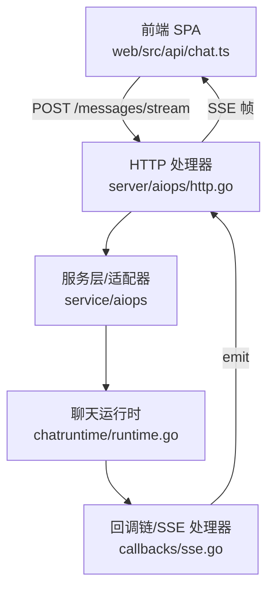
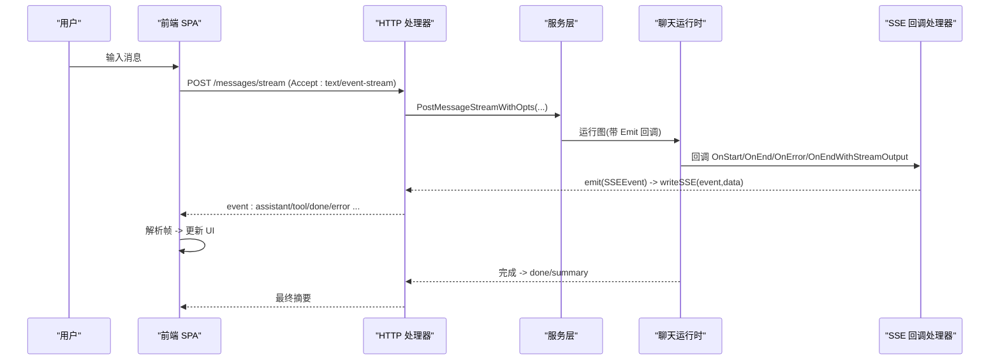
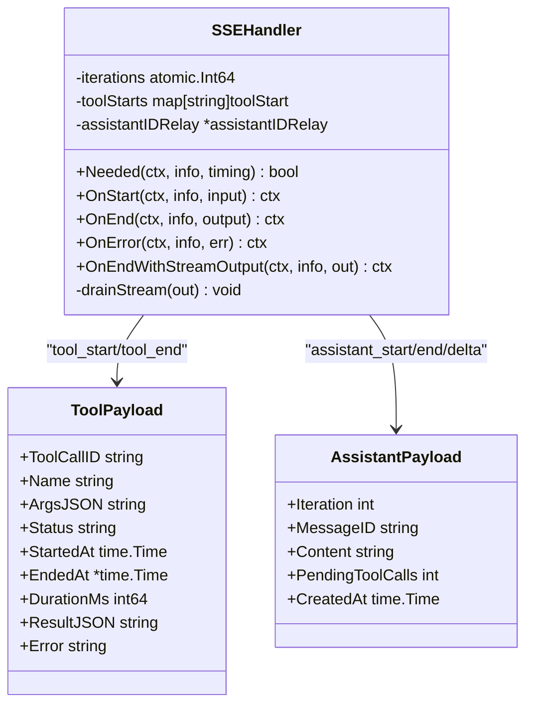
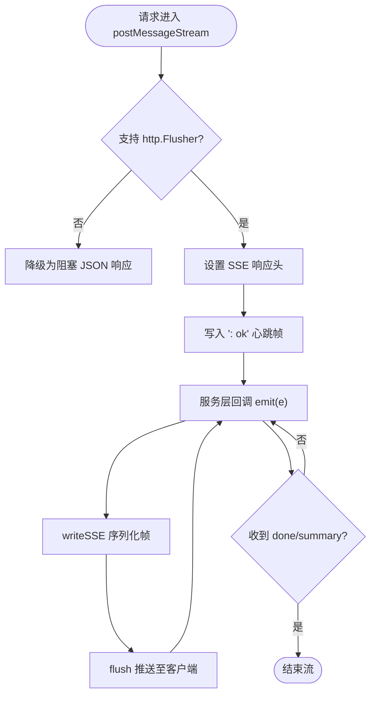
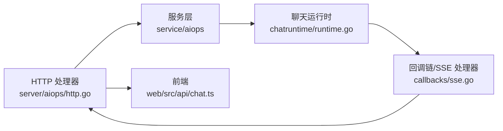

# 流式事件

<cite>
**本文引用的文件**
- [sse.go](file://internal/manager/biz/aiops/graph/callbacks/sse.go)
- [http.go](file://internal/manager/server/aiops/http.go)
- [runtime.go](file://internal/manager/biz/aiops/chatruntime/runtime.go)
- [agent.go](file://internal/manager/biz/aiops/agent/agent.go)
- [chat.ts](file://web/src/api/chat.ts)
- [ChatThread.tsx](file://web/src/pages/ChatThread.tsx)
- [http.go（operatorrun）](file://internal/manager/server/operatorrun/http.go)
</cite>

## 目录
1. [简介](#简介)
2. [项目结构](#项目结构)
3. [核心组件](#核心组件)
4. [架构总览](#架构总览)
5. [详细组件分析](#详细组件分析)
6. [依赖关系分析](#依赖关系分析)
7. [性能与可靠性](#性能与可靠性)
8. [故障排查指南](#故障排查指南)
9. [结论](#结论)
10. [附录：前端使用示例](#附录前端使用示例)

## 简介
本文件面向实现与使用“流式事件”的工程师，系统性说明基于 SSE（Server-Sent Events）的实时交互链路。内容覆盖：
- 事件类型定义、触发时机与数据格式（assistant/tool/done/error/task_notification/approval_pending 等）
- 服务端事件发射器与 HTTP SSE 输出
- 客户端连接管理、错误处理与重连策略
- 前端事件绑定、UI 更新与状态同步流程
- 与传统 HTTP 响应对比及在实时场景下的优势

## 项目结构
SSE 能力贯穿后端服务层、AI 运行时与前端 SPA：
- 后端 HTTP 层提供 /api/v1/chat/sessions/{id}/messages/stream 端点，设置 text/event-stream，按帧推送事件
- AI 运行时通过回调链将图执行过程转换为 SSE 事件
- 前端通过 fetch + ReadableStream 解析 SSE 帧，分发到 onAssistant/onToolStart/onToolEnd/onDone/onError 等回调，驱动 UI 增量渲染

图表来源
- [http.go:539-618](file://internal/manager/server/aiops/http.go#L539-L618)
- [sse.go:149-188](file://internal/manager/biz/aiops/graph/callbacks/sse.go#L149-L188)
- [runtime.go:78-147](file://internal/manager/biz/aiops/chatruntime/runtime.go#L78-L147)
- [chat.ts:247-318](file://web/src/api/chat.ts#L247-L318)

章节来源
- [http.go:143-171](file://internal/manager/server/aiops/http.go#L143-L171)
- [chat.ts:247-318](file://web/src/api/chat.ts#L247-L318)

## 核心组件
- SSE 事件类型与载荷
  - assistant_start / assistant_delta / assistant_end：助手回复的开始、增量片段、结束（完整内容与迭代信息）
  - tool_start / tool_end：工具调用的开始与结束（参数、结果、耗时、状态）
  - done：会话成功终止（最终摘要）
  - error：不可恢复的错误
  - task_notification：后台子任务完成通知
  - approval_pending：需要人工审批的阻塞调用
- 事件发射器
  - callbacks.SSEHandler：监听 eino 回调，将图执行过程转为 SSEEvent
  - http.writeSSE：将事件序列化为标准 SSE 帧并 flush
- 运行时适配
  - chatruntime.toCallbackEmitter：将新事件名映射回旧名称，保持与前端兼容
- 前端接收器
  - streamMessage：建立 SSE 连接，逐帧解析并分发到回调
  - ChatThread：订阅回调，增量更新消息气泡与工具卡片

章节来源
- [sse.go:22-50](file://internal/manager/biz/aiops/graph/callbacks/sse.go#L22-L50)
- [sse.go:141-188](file://internal/manager/biz/aiops/graph/callbacks/sse.go#L141-L188)
- [http.go:740-754](file://internal/manager/server/aiops/http.go#L740-L754)
- [runtime.go:1045-1076](file://internal/manager/biz/aiops/chatruntime/runtime.go#L1045-L1076)
- [chat.ts:247-360](file://web/src/api/chat.ts#L247-L360)

## 架构总览
下图展示一次用户提问到流式响应的端到端时序：

图表来源
- [http.go:539-618](file://internal/manager/server/aiops/http.go#L539-L618)
- [sse.go:235-343](file://internal/manager/biz/aiops/graph/callbacks/sse.go#L235-L343)
- [chat.ts:247-318](file://web/src/api/chat.ts#L247-L318)

## 详细组件分析

### 事件类型与触发时机
- assistant_start：ChatModel 开始生成前，携带 iteration
- assistant_delta：模型流式输出的每个非空片段，携带增量 content
- assistant_end：模型返回后，携带完整 content、iteration、message_id、pending_tool_calls、created_at
- tool_start：工具调用开始前，记录 tool_call_id、name、arguments、started_at、status=pending
- tool_end：工具结束后，记录 status=success/error/timeout、duration_ms、result、error
- done：图执行成功终止，携带 iterations
- error：不可恢复错误，携带 message/code
- task_notification：后台子任务完成，携带 task_id/status/summary/result/error/usage
- approval_pending：阻塞工具等待人工审批，携带 approval_id/tool_call_id/kind/tool_name/command/credentials

章节来源
- [sse.go:22-50](file://internal/manager/biz/aiops/graph/callbacks/sse.go#L22-L50)
- [sse.go:52-139](file://internal/manager/biz/aiops/graph/callbacks/sse.go#L52-L139)
- [http.go:620-738](file://internal/manager/server/aiops/http.go#L620-L738)
- [agent.go:70-140](file://internal/manager/biz/aiops/agent/agent.go#L70-L140)

### 事件发射器：SSEHandler
- 监听 eino 回调，按组件类型与时间点发出对应 SSEEvent
- 维护 iteration 计数器与工具起止时间，计算 duration
- 支持流式输出分片：drainStream 将 ChatModel 的输出切片为 assistant_delta
- 并发安全：toolStarts 使用互斥锁保护；iteration 使用原子变量

图表来源
- [sse.go:172-188](file://internal/manager/biz/aiops/graph/callbacks/sse.go#L172-L188)
- [sse.go:235-343](file://internal/manager/biz/aiops/graph/callbacks/sse.go#L235-L343)
- [sse.go:397-440](file://internal/manager/biz/aiops/graph/callbacks/sse.go#L397-L440)

章节来源
- [sse.go:149-188](file://internal/manager/biz/aiops/graph/callbacks/sse.go#L149-L188)
- [sse.go:235-343](file://internal/manager/biz/aiops/graph/callbacks/sse.go#L235-L343)
- [sse.go:397-440](file://internal/manager/biz/aiops/graph/callbacks/sse.go#L397-L440)

### HTTP SSE 输出与帧格式
- 端点：POST /api/v1/chat/sessions/{id}/messages/stream
- 响应头：Content-Type: text/event-stream，Cache-Control: no-cache，X-Accel-Buffering: no
- 帧格式：event: <type>\ndata: <json>\n\n
- 事件名映射：assistant/tool_start/tool_end/done/task_notification/approval_pending
- 错误处理：若流式写入失败，忽略并让下一次 flush 暴露给上层；若启动失败则写 JSON 错误

图表来源
- [http.go:539-618](file://internal/manager/server/aiops/http.go#L539-L618)
- [http.go:740-754](file://internal/manager/server/aiops/http.go#L740-L754)

章节来源
- [http.go:539-618](file://internal/manager/server/aiops/http.go#L539-L618)
- [http.go:740-754](file://internal/manager/server/aiops/http.go#L740-L754)

### 运行时适配与兼容性
- chatruntime 内部使用新的事件名（assistant_start/delta/end），但通过 toCallbackEmitter 将其映射回 legacy 名称（assistant/tool_start/tool_end/done），确保前端无需改动
- 对 assistant_delta 当前默认丢弃，直到前端完全支持 token-level 增量

章节来源
- [runtime.go:78-99](file://internal/manager/biz/aiops/chatruntime/runtime.go#L78-L99)
- [runtime.go:1045-1076](file://internal/manager/biz/aiops/chatruntime/runtime.go#L1045-L1076)

### 传统 HTTP 响应 vs SSE
- 传统 HTTP：一次性返回完整响应，延迟高，无法体现中间进度
- SSE：长连接、增量推送，适合 LLM 流式输出与工具执行可视化
- 本实现同时保留阻塞接口（/messages）用于兼容或降级场景

章节来源
- [http.go:508-537](file://internal/manager/server/aiops/http.go#L508-L537)
- [http.go:539-618](file://internal/manager/server/aiops/http.go#L539-L618)

## 依赖关系分析
- HTTP 处理器依赖服务层接口，选择阻塞或流式路径
- 服务层将事件回调注入运行时，运行时通过回调链驱动 SSE 处理器
- SSE 处理器依赖 eino 回调体系，捕获模型与工具生命周期
- 前端依赖 API 层的 streamMessage 与事件分发逻辑

图表来源
- [http.go:143-171](file://internal/manager/server/aiops/http.go#L143-L171)
- [runtime.go:78-147](file://internal/manager/biz/aiops/chatruntime/runtime.go#L78-L147)
- [sse.go:149-188](file://internal/manager/biz/aiops/graph/callbacks/sse.go#L149-L188)
- [chat.ts:247-318](file://web/src/api/chat.ts#L247-L318)

章节来源
- [http.go:143-171](file://internal/manager/server/aiops/http.go#L143-L171)
- [runtime.go:78-147](file://internal/manager/biz/aiops/chatruntime/runtime.go#L78-L147)
- [sse.go:149-188](file://internal/manager/biz/aiops/graph/callbacks/sse.go#L149-L188)
- [chat.ts:247-318](file://web/src/api/chat.ts#L247-L318)

## 性能与可靠性
- 低延迟：每收到一个模型片段即推送 assistant_delta，减少首字延迟
- 吞吐：writeSSE 直接 flush，避免缓冲；nginx 配置禁用代理缓冲
- 健壮性：
  - 不支持 Flusher 时自动降级为阻塞 JSON
  - 流中错误以 error 帧形式发送，不改变已发送的状态码
  - 前端支持 AbortSignal 取消连接，释放服务端资源
- 可观测性：tool_start/tool_end 提供 duration_ms、status、error 字段，便于监控与排障

章节来源
- [http.go:579-598](file://internal/manager/server/aiops/http.go#L579-L598)
- [http.go:740-754](file://internal/manager/server/aiops/http.go#L740-L754)
- [chat.ts:247-318](file://web/src/api/chat.ts#L247-L318)

## 故障排查指南
- 连接未建立
  - 检查 Accept: text/event-stream 与 Content-Type
  - 确认服务器返回了 ": ok" 心跳帧
- 事件丢失或乱序
  - 确认前端正确按 \n\n 分割帧，且按 event 类型分发
  - 注意 assistant_delta 在当前版本可能被过滤（需前端升级支持）
- 工具执行卡住
  - 查看 tool_start 与 tool_end 的 duration_ms 与 status
  - 使用 stopSession 主动中断会话
- 网络中断与重连
  - 前端应在 onError 或连接关闭时进行指数退避重连
  - 重连后可拉取历史消息（/messages）补齐状态

章节来源
- [http.go:539-618](file://internal/manager/server/aiops/http.go#L539-L618)
- [chat.ts:247-360](file://web/src/api/chat.ts#L247-L360)

## 结论
本项目实现了完整的 SSE 流式事件链路：从 AI 运行时回调到 HTTP SSE 输出，再到前端增量渲染。通过统一的事件类型与载荷，既保证了向后兼容，又为未来 token-level 流式体验预留扩展空间。结合工具生命周期事件与审批事件，可在复杂工作流中提供实时、可操作的交互体验。

## 附录：前端使用示例
- 建立 SSE 连接并监听事件
  - 调用 streamMessage(sessionId, content, callbacks, options, signal)
  - 在回调中更新 UI：onAssistant 追加消息气泡，onToolStart/onToolEnd 显示工具卡片，onDone 收尾，onError 提示
- 取消与重连
  - 传入 AbortSignal 以中断流
  - 在 onError 或连接关闭时重试，必要时先拉取历史消息

章节来源
- [chat.ts:247-360](file://web/src/api/chat.ts#L247-L360)
- [ChatThread.tsx:246-280](file://web/src/pages/ChatThread.tsx#L246-L280)