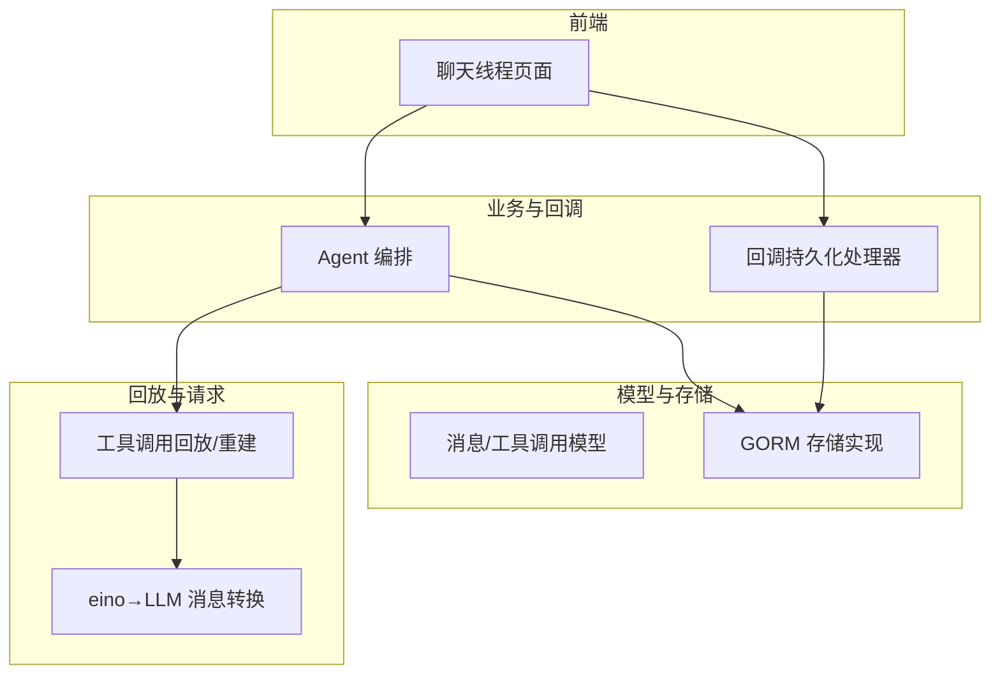
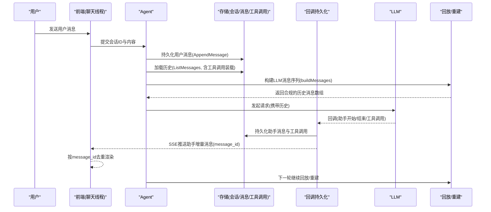
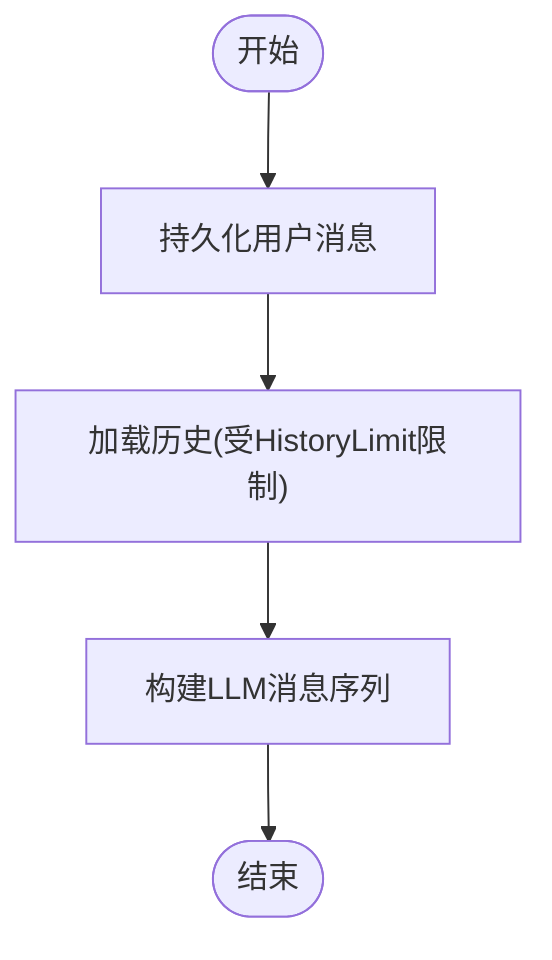
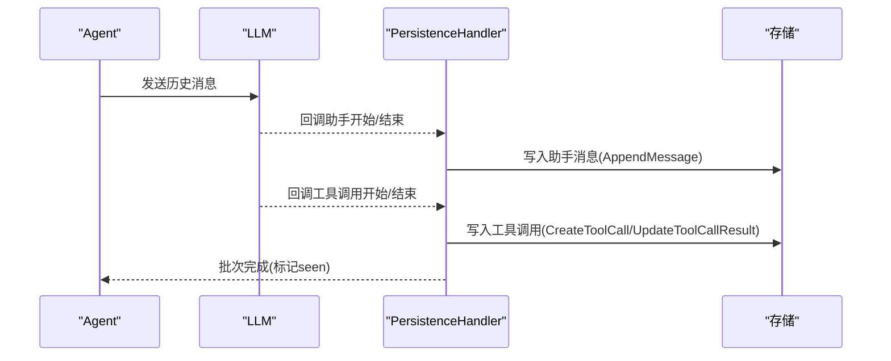
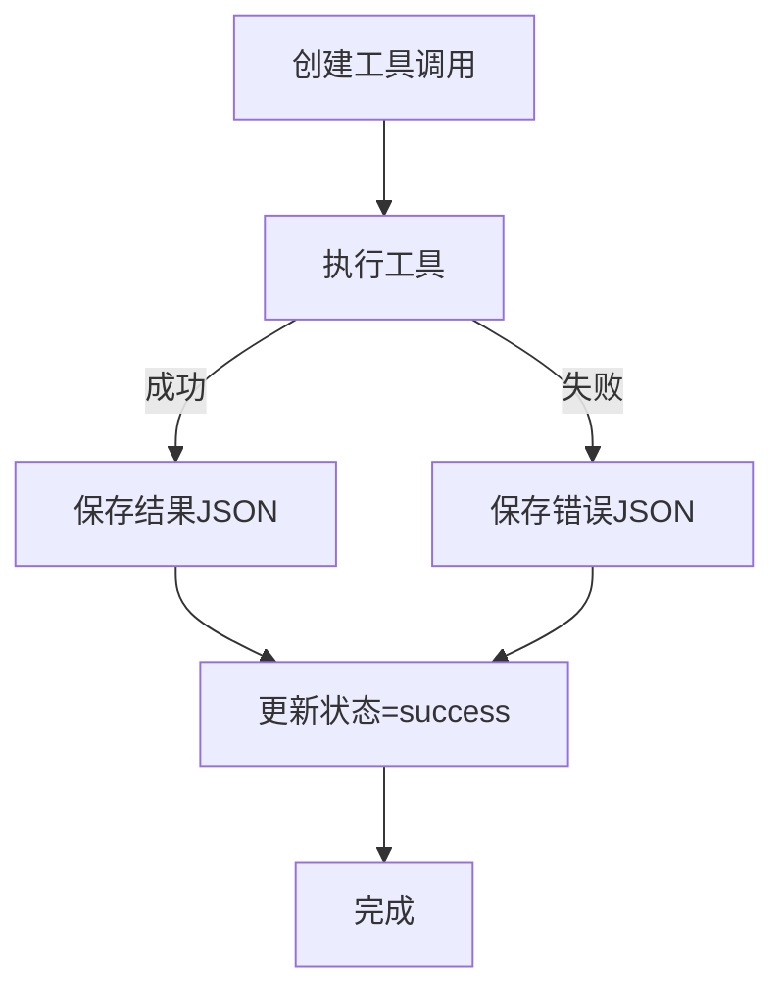
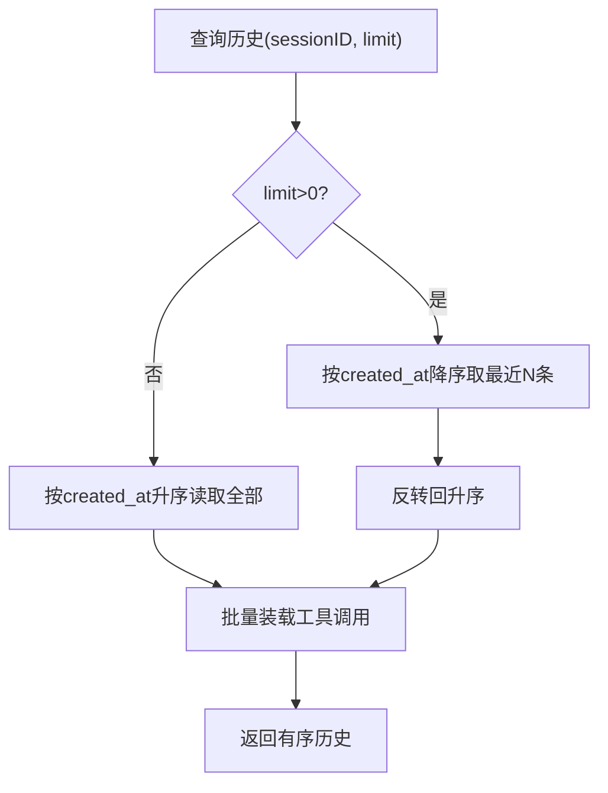
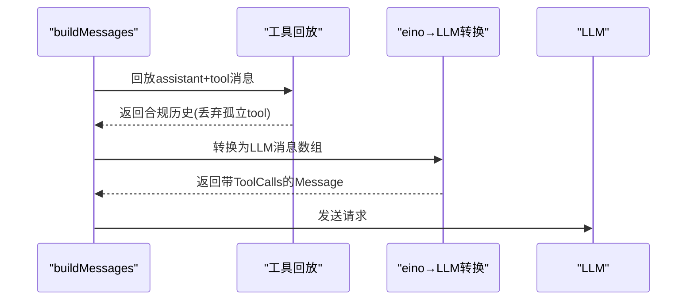
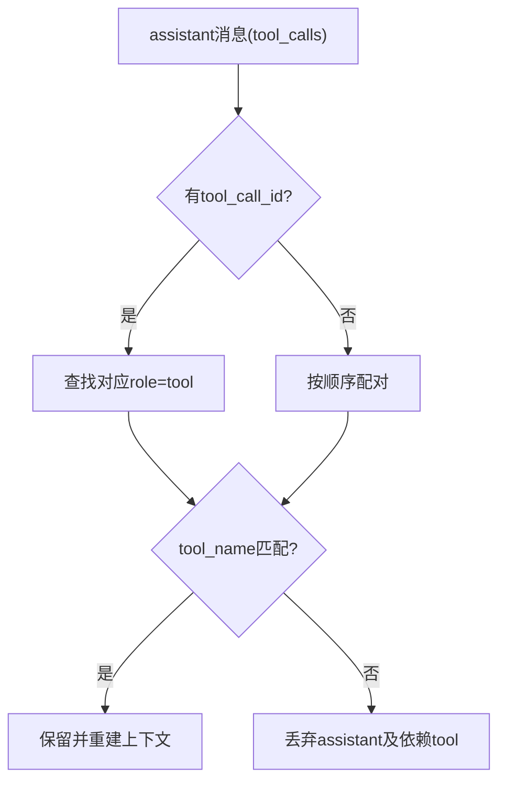
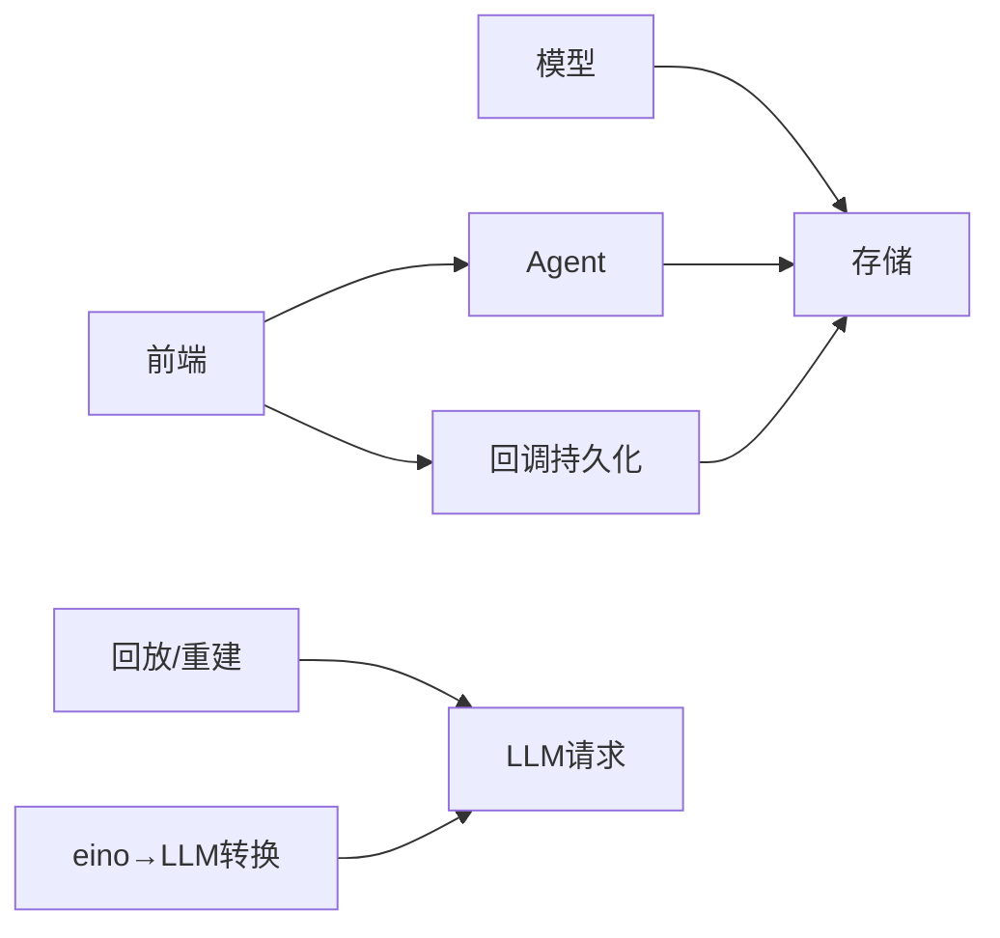

# 消息管理

<cite>
**本文引用的文件**
- [internal/manager/model/aiops/model.go](file://internal/manager/model/aiops/model.go)
- [internal/manager/data/aiops/store/session.go](file://internal/manager/data/aiops/store/session.go)
- [internal/manager/biz/aiops/agent/agent.go](file://internal/manager/biz/aiops/agent/agent.go)
- [internal/manager/biz/aiops/graph/callbacks/persistence.go](file://internal/manager/biz/aiops/graph/callbacks/persistence.go)
- [internal/pkg/llm/eino_routing.go](file://internal/pkg/llm/eino_routing.go)
- [internal/manager/biz/aiops/toolreplay/resolve.go](file://internal/manager/biz/aiops/toolreplay/resolve.go)
- [internal/manager/biz/aiops/chatruntime/runtime.go](file://internal/manager/biz/aiops/chatruntime/runtime.go)
- [internal/manager/server/aiops/http.go](file://internal/manager/server/aiops/http.go)
- [web/src/pages/ChatThread.tsx](file://web/src/pages/ChatThread.tsx)
</cite>

## 目录
1. [简介](#简介)
2. [项目结构](#项目结构)
3. [核心组件](#核心组件)
4. [架构总览](#架构总览)
5. [详细组件分析](#详细组件分析)
6. [依赖关系分析](#依赖关系分析)
7. [性能考量](#性能考量)
8. [故障排查指南](#故障排查指南)
9. [结论](#结论)
10. [附录](#附录)

## 简介
本文件聚焦于对话消息的完整生命周期管理，覆盖用户消息持久化、助手消息生成与落库、工具调用记录与结果回填、历史消息加载与重建 LLM 请求等关键环节。文档同时说明消息序列化/反序列化（JSON）与 tool_call_id 配对机制，并解释 HistoryLimit 的作用与消息裁剪策略，帮助读者理解从“写入—回放—重建”的全链路设计。

## 项目结构
围绕消息管理的代码主要分布在以下层次：
- 数据模型层：定义会话、消息、工具调用的实体结构与约束
- 存储层：基于 GORM 的消息与工具调用读写、批量装载与清理
- 业务编排层：Agent 负责用户消息入队、历史加载、构建 LLM 消息序列
- 回调持久化层：在 LLM 回调中异步持久化助手消息与工具调用，保证流式输出不阻塞主流程
- 回放与重建层：将持久化的消息与工具调用还原为 LLM 可接受的上下文序列
- 前端展示层：通过 SSE 接收助手增量消息，按 message_id 去重渲染

图表来源
- [internal/manager/model/aiops/model.go:135-217](file://internal/manager/model/aiops/model.go#L135-L217)
- [internal/manager/data/aiops/store/session.go:162-241](file://internal/manager/data/aiops/store/session.go#L162-L241)
- [internal/manager/biz/aiops/agent/agent.go:360-469](file://internal/manager/biz/aiops/agent/agent.go#L360-L469)
- [internal/manager/biz/aiops/graph/callbacks/persistence.go:476-575](file://internal/manager/biz/aiops/graph/callbacks/persistence.go#L476-L575)
- [internal/manager/biz/aiops/toolreplay/resolve.go:126-145](file://internal/manager/biz/aiops/toolreplay/resolve.go#L126-L145)
- [internal/pkg/llm/eino_routing.go:430-455](file://internal/pkg/llm/eino_routing.go#L430-L455)
- [web/src/pages/ChatThread.tsx:246-280](file://web/src/pages/ChatThread.tsx#L246-L280)

章节来源
- [internal/manager/model/aiops/model.go:135-217](file://internal/manager/model/aiops/model.go#L135-L217)
- [internal/manager/data/aiops/store/session.go:162-241](file://internal/manager/data/aiops/store/session.go#L162-L241)

## 核心组件
- 消息与工具调用模型：统一角色、内容、工具调用 ID、模型溯源、Token 用量等字段；ToolCall 包含参数 JSON、结果 JSON、状态、时间戳与 LLM 分配的工具调用 ID
- 存储仓库：提供 AppendMessage、ListMessages（含工具调用批量装载）、CreateToolCall、UpdateToolCallResult、FinalizePendingToolCalls 等能力
- Agent 编排：先持久化用户消息，再加载历史并构建 LLM 消息数组；对助手回复进行持久化并加入工作历史
- 回调持久化：在 LLM 回调中异步写入助手消息与工具调用，维护批次以关联 assistant 与 tool 消息
- 回放与重建：根据 LLMCallID 或顺序配对 tool 消息，必要时丢弃无法配对的孤立 tool 消息，确保严格 LLM 提供商不拒绝请求
- eino→LLM 转换：将 eino 消息转换为内部 llm.Message，处理 ToolCalls 的 JSON 参数
- 前端渲染：通过 SSE 接收助手消息，使用 message_id 去重并更新 UI

章节来源
- [internal/manager/model/aiops/model.go:135-217](file://internal/manager/model/aiops/model.go#L135-L217)
- [internal/manager/data/aiops/store/session.go:162-241](file://internal/manager/data/aiops/store/session.go#L162-L241)
- [internal/manager/biz/aiops/agent/agent.go:360-469](file://internal/manager/biz/aiops/agent/agent.go#L360-L469)
- [internal/manager/biz/aiops/graph/callbacks/persistence.go:476-575](file://internal/manager/biz/aiops/graph/callbacks/persistence.go#L476-L575)
- [internal/pkg/llm/eino_routing.go:430-455](file://internal/pkg/llm/eino_routing.go#L430-L455)
- [web/src/pages/ChatThread.tsx:246-280](file://web/src/pages/ChatThread.tsx#L246-L280)

## 架构总览
下图展示了从用户输入到助手回复、工具调用、结果回填以及历史重建的端到端流程。

图表来源
- [internal/manager/biz/aiops/agent/agent.go:360-469](file://internal/manager/biz/aiops/agent/agent.go#L360-L469)
- [internal/manager/data/aiops/store/session.go:162-241](file://internal/manager/data/aiops/store/session.go#L162-L241)
- [internal/manager/biz/aiops/graph/callbacks/persistence.go:476-575](file://internal/manager/biz/aiops/graph/callbacks/persistence.go#L476-L575)
- [web/src/pages/ChatThread.tsx:246-280](file://web/src/pages/ChatThread.tsx#L246-L280)

## 详细组件分析

### 数据模型与存储接口
- Message：承载 role、content、tool_call_id、tool_name、model、prompt_tokens、completion_tokens 等；ToolCalls 为瞬态字段，由 ListMessages 批量装载
- ToolCall：承载 message_id、tool_name、arguments_json、result_json、status、error、started_at、ended_at、device_id、llm_call_id 等
- SessionRepo：提供 AppendMessage、ListMessages（支持 limit 与工具调用装载）、CreateToolCall、UpdateToolCallResult、FinalizePendingToolCalls 等

```mermaid
classDiagram
class Message {
+string ID
+string SessionID
+string Role
+*string Content
+*string ToolCallID
+*string ToolName
+*string Model
+*int PromptTokens
+*int CompletionTokens
+time CreatedAt
+[]ToolCall ToolCalls
}
class ToolCall {
+string ID
+string MessageID
+string ToolName
+string ArgumentsJSON
+*string ResultJSON
+string Status
+*string Error
+time StartedAt
+*time EndedAt
+*uint64 DeviceID
+*string LLMCallID
+time CreatedAt
}
class SessionRepo {
+AppendMessage(ctx, msg) error
+ListMessages(ctx, sessionID, limit) []*Message
+CreateToolCall(ctx, tc) error
+UpdateToolCallResult(ctx, id, status, resultJSON, errStr, endedAt) error
+FinalizePendingToolCalls(ctx, sessionID, resultJSON, errStr, endedAt) (int64, error)
}
Message "1" o-- "*" ToolCall : "装载/关联"
SessionRepo --> Message : "读写"
SessionRepo --> ToolCall : "读写"
```

图表来源
- [internal/manager/model/aiops/model.go:135-217](file://internal/manager/model/aiops/model.go#L135-L217)
- [internal/manager/data/aiops/store/session.go:162-241](file://internal/manager/data/aiops/store/session.go#L162-L241)

章节来源
- [internal/manager/model/aiops/model.go:135-217](file://internal/manager/model/aiops/model.go#L135-L217)
- [internal/manager/data/aiops/store/session.go:162-241](file://internal/manager/data/aiops/store/session.go#L162-L241)

### 用户消息持久化与历史加载
- 用户消息优先持久化，确保崩溃恢复后仍可回放
- 若存在 @-mentions，会先解析为只读上下文块并前置到用户内容中，保证回放一致性
- 随后加载历史（包含刚写入的用户消息），并按 HistoryLimit 限制条数
- 构建 LLM 消息数组时，会将 system 提示、语言指令、用户当前轮次等注入

图表来源
- [internal/manager/biz/aiops/agent/agent.go:360-394](file://internal/manager/biz/aiops/agent/agent.go#L360-L394)

章节来源
- [internal/manager/biz/aiops/agent/agent.go:360-394](file://internal/manager/biz/aiops/agent/agent.go#L360-L394)

### 助手消息生成与回调持久化
- 助手消息可能仅包含工具调用而无文本内容，仍会写入 chat_messages（Content 可为空指针）
- PersistenceHandler 在 OnStart/OnEnd 回调中异步持久化助手消息与工具调用，避免阻塞主流程
- 通过 openBatch/markSeen 维护 assistant 与 tool 的配对批次，确保回放正确性
- 持久化失败通过指标上报，不阻断用户可见请求

图表来源
- [internal/manager/biz/aiops/graph/callbacks/persistence.go:476-575](file://internal/manager/biz/aiops/graph/callbacks/persistence.go#L476-L575)
- [internal/manager/biz/aiops/agent/agent.go:435-469](file://internal/manager/biz/aiops/agent/agent.go#L435-L469)

章节来源
- [internal/manager/biz/aiops/graph/callbacks/persistence.go:476-575](file://internal/manager/biz/aiops/graph/callbacks/persistence.go#L476-L575)
- [internal/manager/biz/aiops/agent/agent.go:435-469](file://internal/manager/biz/aiops/agent/agent.go#L435-L469)

### 工具调用记录与结果存储
- 工具调用参数以 JSON 字符串存储于 arguments_json，结果以 result_json 存储
- 错误路径下，结果存储为 {"error": "..."} 以便 LLM 决策重试或切换工具
- 会话结束时，未完结的工具调用会被标记为错误，保证审计与 UI 状态终态

图表来源
- [internal/manager/data/aiops/store/session.go:243-295](file://internal/manager/data/aiops/store/session.go#L243-L295)
- [internal/manager/biz/aiops/agent/agent.go:885-898](file://internal/manager/biz/aiops/agent/agent.go#L885-L898)

章节来源
- [internal/manager/data/aiops/store/session.go:243-295](file://internal/manager/data/aiops/store/session.go#L243-L295)
- [internal/manager/biz/aiops/agent/agent.go:885-898](file://internal/manager/biz/aiops/agent/agent.go#L885-L898)

### 历史消息加载与 HistoryLimit 策略
- ListMessages 支持 limit：当 limit>0 时取最近 N 条，再反转回升序，便于回放
- 工具调用通过一次批量查询装载到 assistant 消息的 ToolCalls 字段，避免回放时出现孤立 tool 消息
- previousUserTurnBounds 用于定位上一轮用户边界，辅助裁剪与回放

图表来源
- [internal/manager/data/aiops/store/session.go:176-241](file://internal/manager/data/aiops/store/session.go#L176-L241)
- [internal/manager/biz/aiops/chatruntime/runtime.go:1439-1466](file://internal/manager/biz/aiops/chatruntime/runtime.go#L1439-L1466)

章节来源
- [internal/manager/data/aiops/store/session.go:176-241](file://internal/manager/data/aiops/store/session.go#L176-L241)
- [internal/manager/biz/aiops/chatruntime/runtime.go:1439-1466](file://internal/manager/biz/aiops/chatruntime/runtime.go#L1439-L1466)

### 消息序列化/反序列化与 LLM 请求重建
- eino→LLM 转换：将 eino 的 ToolCalls 中的 Function.Arguments 转为内部 JSON 参数，缺失时补为空对象
- buildMessages：将持久化的消息与工具调用还原为 LLM 可接受的消息序列；对无法配对的 tool 消息采取丢弃策略，防止严格提供商拒绝
- toolResultPayload：将工具结果序列化为 JSON，错误时包装为 {"error":"..."}

图表来源
- [internal/pkg/llm/eino_routing.go:430-455](file://internal/pkg/llm/eino_routing.go#L430-L455)
- [internal/manager/biz/aiops/toolreplay/resolve.go:126-145](file://internal/manager/biz/aiops/toolreplay/resolve.go#L126-L145)
- [internal/manager/biz/aiops/agent/agent.go:845-898](file://internal/manager/biz/aiops/agent/agent.go#L845-L898)

章节来源
- [internal/pkg/llm/eino_routing.go:430-455](file://internal/pkg/llm/eino_routing.go#L430-L455)
- [internal/manager/biz/aiops/toolreplay/resolve.go:126-145](file://internal/manager/biz/aiops/toolreplay/resolve.go#L126-L145)
- [internal/manager/biz/aiops/agent/agent.go:845-898](file://internal/manager/biz/aiops/agent/agent.go#L845-L898)

### 消息与工具调用的关联与上下文恢复
- 通过 tool_call_id 将 assistant 的 tool_calls 与后续的 role=tool 消息配对
- 回放时优先使用 LLMCallID；若无则按顺序配对；若名称不匹配则丢弃该 assistant 及其依赖 tool，避免产生孤儿消息
- 前端通过 SSE 的 message_id 去重渲染助手消息，保证幂等显示

图表来源
- [internal/manager/biz/aiops/toolreplay/resolve.go:126-145](file://internal/manager/biz/aiops/toolreplay/resolve.go#L126-L145)
- [web/src/pages/ChatThread.tsx:246-280](file://web/src/pages/ChatThread.tsx#L246-L280)

章节来源
- [internal/manager/biz/aiops/toolreplay/resolve.go:126-145](file://internal/manager/biz/aiops/toolreplay/resolve.go#L126-L145)
- [web/src/pages/ChatThread.tsx:246-280](file://web/src/pages/ChatThread.tsx#L246-L280)

## 依赖关系分析
- 模型与存储：SessionRepo 依赖 model.Message/ToolCall，提供一致的数据访问语义
- Agent 与存储：Agent 通过 SessionRepo 完成用户消息写入与历史加载
- 回调与存储：PersistenceHandler 在 LLM 回调中异步写入助手消息与工具调用
- 回放与转换：toolreplay 与 eino_routing 共同保证历史回放与 LLM 请求格式正确
- 前端与后端：前端通过 SSE 消费助手增量消息，使用 message_id 去重

图表来源
- [internal/manager/model/aiops/model.go:135-217](file://internal/manager/model/aiops/model.go#L135-L217)
- [internal/manager/data/aiops/store/session.go:162-241](file://internal/manager/data/aiops/store/session.go#L162-L241)
- [internal/manager/biz/aiops/agent/agent.go:360-469](file://internal/manager/biz/aiops/agent/agent.go#L360-L469)
- [internal/manager/biz/aiops/graph/callbacks/persistence.go:476-575](file://internal/manager/biz/aiops/graph/callbacks/persistence.go#L476-L575)
- [internal/pkg/llm/eino_routing.go:430-455](file://internal/pkg/llm/eino_routing.go#L430-L455)

章节来源
- [internal/manager/model/aiops/model.go:135-217](file://internal/manager/model/aiops/model.go#L135-L217)
- [internal/manager/data/aiops/store/session.go:162-241](file://internal/manager/data/aiops/store/session.go#L162-L241)
- [internal/manager/biz/aiops/agent/agent.go:360-469](file://internal/manager/biz/aiops/agent/agent.go#L360-L469)
- [internal/manager/biz/aiops/graph/callbacks/persistence.go:476-575](file://internal/manager/biz/aiops/graph/callbacks/persistence.go#L476-L575)
- [internal/pkg/llm/eino_routing.go:430-455](file://internal/pkg/llm/eino_routing.go#L430-L455)

## 性能考量
- 历史加载优化：ListMessages 在 limit>0 时使用 DESC 排序取最近 N 条后再反转，减少不必要的数据传输
- 工具调用批量装载：一次性查询所有 assistant 的工具调用并按顺序附加，避免 N+1 查询
- 异步持久化：回调持久化使用超时控制与后台写入，降低主流程延迟
- 内存与裁剪：HistoryLimit 控制历史大小，结合 previousUserTurnBounds 精准裁剪，避免过长上下文导致内存与 Token 浪费
- 结果截断：工具结果展示时可进行字符级截断，避免 UI 卡顿（仅用于展示，不反馈给 LLM）

[本节为通用指导，无需具体文件引用]

## 故障排查指南
- 助手消息未持久化：检查回调链是否触发 OnEnd，确认 persistenceWriteContext 超时与 Repo.AppendMessage 返回值
- 工具调用未完结：会话结束时调用 FinalizePendingToolCalls 将 pending 标记为 error，检查审计表状态
- 回放出现孤立 tool：确认 tool_call_id 与 tool_name 匹配；若不匹配，回放逻辑会丢弃相关 assistant 以避免错误
- 前端重复渲染：确认 SSE 返回的 message_id 稳定；前端已按 message_id 去重
- 历史不完整：检查 ListMessages 的 limit 设置与 hydrateToolCalls 是否成功装载工具调用

章节来源
- [internal/manager/biz/aiops/graph/callbacks/persistence.go:476-575](file://internal/manager/biz/aiops/graph/callbacks/persistence.go#L476-L575)
- [internal/manager/data/aiops/store/session.go:297-323](file://internal/manager/data/aiops/store/session.go#L297-L323)
- [internal/manager/biz/aiops/toolreplay/resolve.go:126-145](file://internal/manager/biz/aiops/toolreplay/resolve.go#L126-L145)
- [web/src/pages/ChatThread.tsx:246-280](file://web/src/pages/ChatThread.tsx#L246-L280)

## 结论
本系统通过“优先持久化用户消息—异步回调持久化助手与工具—批量装载工具调用—回放与重建”的设计，实现了高可靠、可扩展且对严格 LLM 提供商友好的消息管理方案。借助 tool_call_id 与 LLMCallID 的配对机制，以及 HistoryLimit 与裁剪策略，系统在长会话与高频工具调用场景下仍能保持稳定的上下文一致性与性能表现。

[本节为总结性内容，无需具体文件引用]

## 附录
- API 映射示例（服务端 DTO 转换）：toMessageDTO 将模型字段映射为对外响应结构，包含 role、content、tool_call_id、tool_name、model 等
- 前端 SSE 消费：onAssistant 回调中使用 message_id 作为稳定键，避免重复插入

章节来源
- [internal/manager/server/aiops/http.go:1022-1041](file://internal/manager/server/aiops/http.go#L1022-L1041)
- [web/src/pages/ChatThread.tsx:246-280](file://web/src/pages/ChatThread.tsx#L246-L280)