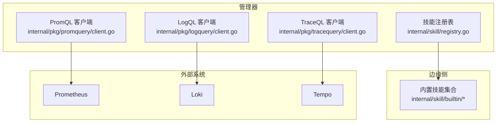
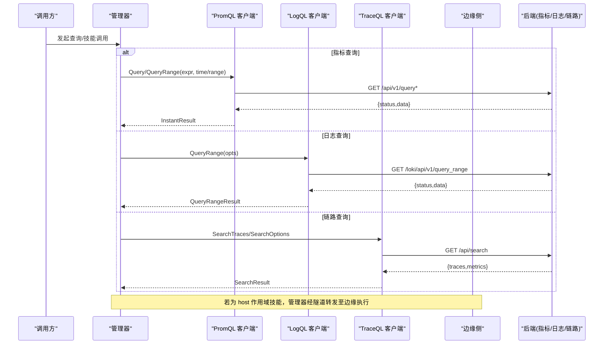
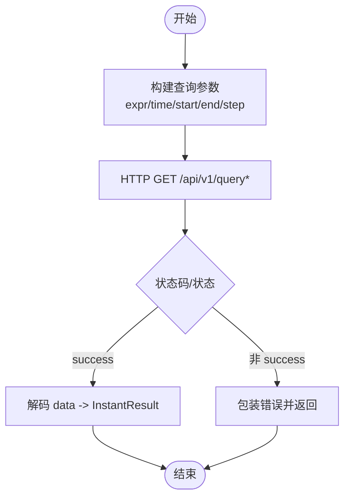
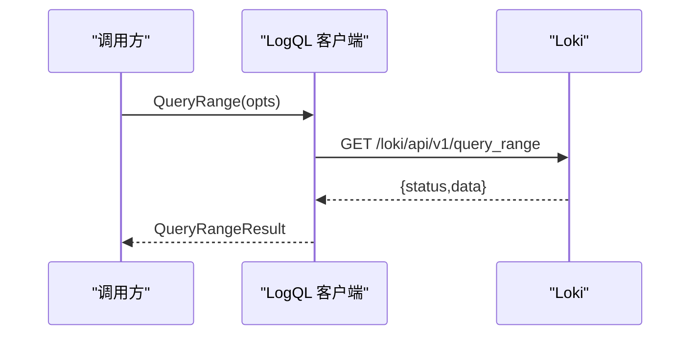
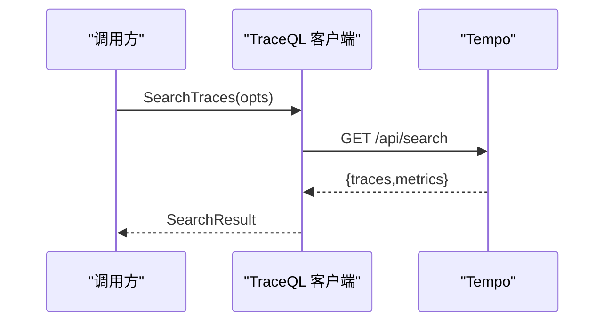
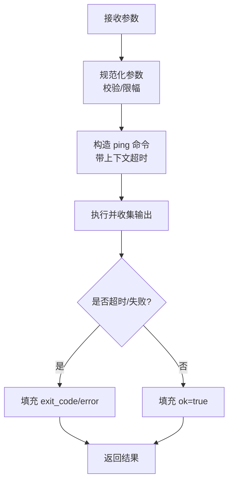
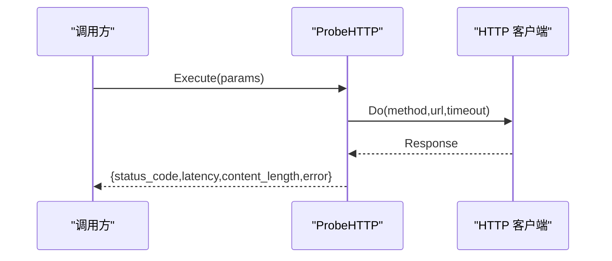
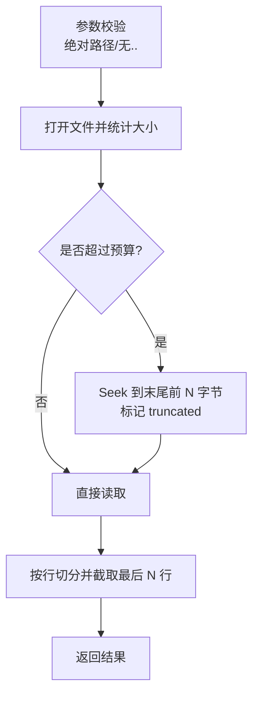
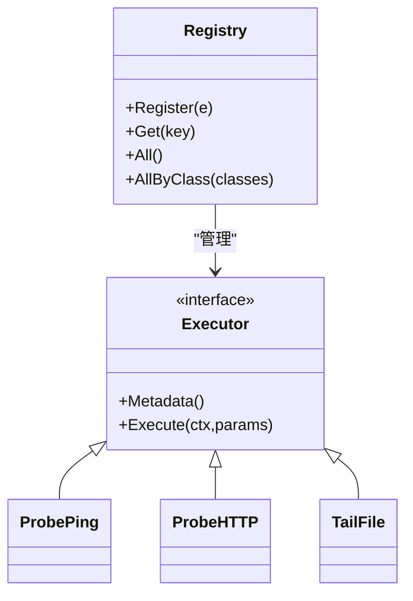

# 内置工具详解

<cite>
**本文引用的文件**
- [internal/skill/types.go](file://internal/skill/types.go)
- [internal/skill/registry.go](file://internal/skill/registry.go)
- [internal/pkg/promquery/client.go](file://internal/pkg/promquery/client.go)
- [internal/pkg/logquery/client.go](file://internal/pkg/logquery/client.go)
- [internal/pkg/tracequery/client.go](file://internal/pkg/tracequery/client.go)
- [internal/skill/builtin/probe_ping.go](file://internal/skill/builtin/probe_ping.go)
- [internal/skill/builtin/probe_http.go](file://internal/skill/builtin/probe_http.go)
- [internal/skill/builtin/tail_file.go](file://internal/skill/builtin/tail_file.go)
</cite>

## 目录
1. [简介](#简介)
2. [项目结构](#项目结构)
3. [核心组件](#核心组件)
4. [架构总览](#架构总览)
5. [详细组件分析](#详细组件分析)
6. [依赖关系分析](#依赖关系分析)
7. [性能考量](#性能考量)
8. [故障排查指南](#故障排查指南)
9. [结论](#结论)
10. [附录](#附录)

## 简介
本文件系统化梳理 Ongrid 提供的“内置工具”，覆盖以下类别：
- 查询类工具：PromQL（指标）、LogQL（日志）、TraceQL（链路）
- 系统监控工具：主机负载、进程列表等（通过边缘侧技能与隧道执行）
- 业务工具：边缘设备查询、拓扑分析（通过管理器服务与数据模型）

文档聚焦每个工具的参数定义、返回值格式、使用场景与最佳实践，并给出组合用法、高级用法以及与外部系统的集成方式。为便于理解，提供代码级架构图与时序图，所有图示均映射到具体源码文件。

## 项目结构
Ongrid 将“可被 AI 或工作流调用的能力”抽象为 Skill（技能），并通过统一注册表暴露给管理器与边缘端。查询类工具以独立的客户端包实现，分别对接 Prometheus、Loki、Tempo。

图表来源
- [internal/skill/registry.go:10-54](file://internal/skill/registry.go#L10-L54)
- [internal/pkg/promquery/client.go:27-82](file://internal/pkg/promquery/client.go#L27-L82)
- [internal/pkg/logquery/client.go:46-100](file://internal/pkg/logquery/client.go#L46-L100)
- [internal/pkg/tracequery/client.go:32-87](file://internal/pkg/tracequery/client.go#L32-L87)

章节来源
- [internal/skill/types.go:1-27](file://internal/skill/types.go#L1-L27)
- [internal/skill/registry.go:10-54](file://internal/skill/registry.go#L10-L54)

## 核心组件
- 技能框架（Skill Framework）
  - 元数据与权限分级：safe/mutating/dangerous，决定调用策略与审批边界
  - 作用域：host（在边缘执行）或 manager（在管理器执行）
  - 参数 Schema：声明式 ParamSchema，自动生成 UI 表单与 LLM 函数调用 JSON Schema
  - 执行器接口：Executor.Metadata + Execute
- 查询客户端
  - PromQL：封装 /api/v1/query 与 /api/v1/query_range，返回 InstantResult（resultType + result 原始 JSON）
  - LogQL：封装 /loki/api/v1/query_range 与 label 枚举，返回 QueryRangeResult（streams/matrix）
  - TraceQL：封装 /api/search 与 /api/traces/<id>，返回 SearchResult/TraceResult（原始 JSON）

章节来源
- [internal/skill/types.go:35-125](file://internal/skill/types.go#L35-L125)
- [internal/skill/types.go:177-203](file://internal/skill/types.go#L177-L203)
- [internal/pkg/promquery/client.go:17-117](file://internal/pkg/promquery/client.go#L17-L117)
- [internal/pkg/logquery/client.go:29-171](file://internal/pkg/logquery/client.go#L29-L171)
- [internal/pkg/tracequery/client.go:16-157](file://internal/pkg/tracequery/client.go#L16-L157)

## 架构总览
下图展示从管理器发起的三类观测查询如何路由到对应后端，以及边缘侧技能如何通过统一调度执行。

图表来源
- [internal/pkg/promquery/client.go:93-117](file://internal/pkg/promquery/client.go#L93-L117)
- [internal/pkg/logquery/client.go:120-171](file://internal/pkg/logquery/client.go#L120-L171)
- [internal/pkg/tracequery/client.go:111-157](file://internal/pkg/tracequery/client.go#L111-L157)

## 详细组件分析

### 查询类工具

#### PromQL（指标查询）
- 关键类型
  - InstantResult：包含 resultType 与 result（原始 JSON），保留矩阵/向量/标量完整形状
  - Client：支持静态 BaseURLResolver 或动态解析；默认超时 30s；响应体限制 8MiB
- 主要方法
  - Query(expr, ts)：瞬时查询
  - QueryRange(expr, start, end, step)：范围查询
- 返回值
  - 成功时返回 InstantResult；错误包含 errorType/error 信息
- 使用场景
  - 告警评估、仪表盘聚合、AI 自动诊断中的指标检索
- 最佳实践
  - 合理设置 step 与时间窗口，避免大窗口无步长查询
  - 对慢查询增加上下文超时与重试退避
  - 结合标签过滤缩小结果集

图表来源
- [internal/pkg/promquery/client.go:93-167](file://internal/pkg/promquery/client.go#L93-L167)

章节来源
- [internal/pkg/promquery/client.go:17-167](file://internal/pkg/promquery/client.go#L17-L167)

#### LogQL（日志查询）
- 关键类型
  - QueryRangeResult：resultType 为 streams 或 matrix；result 为原始 JSON
  - LabelValuesResult：label 值列表
- 主要方法
  - QueryRange(Query, Start, End, Limit, Step, Direction)
  - LabelNames(start,end)、LabelValues(name,start,end)
- 返回值
  - 成功返回 QueryRangeResult；错误携带 Loki 返回的错误信息
- 使用场景
  - 日志检索、错误模式匹配、告警触发条件 log_match/log_volume
- 最佳实践
  - 明确起止时间与 limit，避免全量扫描
  - 使用方向 backward 获取最新日志
  - 利用 label 选择器减少结果集

图表来源
- [internal/pkg/logquery/client.go:120-171](file://internal/pkg/logquery/client.go#L120-L171)

章节来源
- [internal/pkg/logquery/client.go:29-230](file://internal/pkg/logquery/client.go#L29-L230)

#### TraceQL（链路查询）
- 关键类型
  - SearchResult：traces 与 metrics（原始 JSON）
  - TraceResult：OTLP 形状的 trace 详情（原始 JSON）
- 主要方法
  - SearchTraces(SearchOptions)：支持 TraceQL 表达式或 tags
  - TagValues(tag)：枚举 tag 值
  - GetTrace(traceID)：获取单条链路详情
- 返回值
  - 成功返回 SearchResult/TraceResult；错误包含 Tempo 返回的状态
- 使用场景
  - 按服务/操作/耗时筛选链路，定位慢调用与异常
- 最佳实践
  - 优先使用 TraceQL 精确过滤
  - 设置合理 limit 与时间窗口
  - 对冷存储场景预留更长超时

图表来源
- [internal/pkg/tracequery/client.go:111-157](file://internal/pkg/tracequery/client.go#L111-L157)

章节来源
- [internal/pkg/tracequery/client.go:16-201](file://internal/pkg/tracequery/client.go#L16-L201)

### 系统监控工具（边缘侧技能）
以下技能通过统一 Skill 框架注册，可在管理器中作为 LLM 工具或 HTTP API 暴露，并在边缘侧安全执行。

#### 主机 Ping 探测（host_probe_ping）
- 参数
  - host（string，必填）：目标主机名或 IP
  - count（int，默认 4，最大 10）：发送包数
  - timeout_ms（int，默认 3000，最大 10000）：单包等待超时
- 返回值
  - ok（bool）、exit_code（int）、duration_ms（int64）、stdout/stderr（string）、error（string?）
- 使用场景
  - 快速验证网络连通性、DNS 解析与防火墙策略
- 最佳实践
  - 控制 count 与 timeout，避免长时间阻塞
  - 在边缘侧执行，减少跨网段延迟影响

图表来源
- [internal/skill/builtin/probe_ping.go:20-99](file://internal/skill/builtin/probe_ping.go#L20-L99)
- [internal/skill/builtin/probe_ping.go:101-124](file://internal/skill/builtin/probe_ping.go#L101-L124)

章节来源
- [internal/skill/builtin/probe_ping.go:1-125](file://internal/skill/builtin/probe_ping.go#L1-L125)

#### HTTP 探测（host_probe_http）
- 参数
  - url（string，必填）：完整 URL
  - method（enum，默认 HEAD，可选 GET/HEAD）
  - timeout_ms（int，默认 5000）
- 返回值
  - status_code（int）、latency_ms（int64）、content_length（int64）、error（string?）
- 使用场景
  - 健康检查、服务可达性验证、TLS 连通性测试
- 最佳实践
  - 仅允许只读方法（GET/HEAD）
  - 针对内网自签证书场景跳过 TLS 校验（已在实现中处理）

图表来源
- [internal/skill/builtin/probe_http.go:23-119](file://internal/skill/builtin/probe_http.go#L23-L119)

章节来源
- [internal/skill/builtin/probe_http.go:1-120](file://internal/skill/builtin/probe_http.go#L1-L120)

#### 文件尾部读取（host_tail_file）
- 参数
  - path（string，必填）：绝对路径，禁止 .. 穿越
  - lines（int，默认 100）：返回行数
  - max_bytes（int，默认 1MiB）：最多读取字节数
- 返回值
  - lines（[]string）、total_lines_returned（int）、file_size（int64）、truncated（bool）、error（string?）
- 使用场景
  - 查看应用日志尾部、快速定位报错堆栈
- 最佳实践
  - 严格限制路径与大小，防止 OOM 与越权访问

图表来源
- [internal/skill/builtin/tail_file.go:23-132](file://internal/skill/builtin/tail_file.go#L23-L132)

章节来源
- [internal/skill/builtin/tail_file.go:1-133](file://internal/skill/builtin/tail_file.go#L1-L133)

### 业务工具（边缘设备查询、拓扑分析）
- 边缘设备查询
  - 通过管理器 edge 服务与 edgeagent 协作，拉取设备清单、资源状态与遥测数据
  - 典型流程：管理器调用 edge 服务 -> 经隧道下发 execute_skill -> 边缘执行采集 -> 结果回传
- 拓扑分析
  - 管理器维护拓扑模型与存储，结合 K8s/网络设备发现能力，生成依赖关系与爆炸半径视图
  - 与指标/日志/链路数据联动，辅助根因定位

说明：以上为基于管理器服务与数据模型的通用流程，具体实现位于 internal/manager 相关模块。此处不展开代码细节。

## 依赖关系分析
- 技能注册表与执行器
  - 全局注册表在 init 阶段收集所有 Executor，并提供按 Key 查找、按 Class 过滤的能力
  - 权限分类与安全边界由 Metadata.Class 驱动
- 查询客户端对外部系统的依赖
  - PromQL 依赖 Prometheus API
  - LogQL 依赖 Loki API（含租户头）
  - TraceQL 依赖 Tempo API（兼容不同版本返回形态）

图表来源
- [internal/skill/registry.go:10-119](file://internal/skill/registry.go#L10-L119)
- [internal/skill/types.go:190-203](file://internal/skill/types.go#L190-L203)
- [internal/skill/builtin/probe_ping.go:14-43](file://internal/skill/builtin/probe_ping.go#L14-L43)
- [internal/skill/builtin/probe_http.go:15-47](file://internal/skill/builtin/probe_http.go#L15-L47)
- [internal/skill/builtin/tail_file.go:15-46](file://internal/skill/builtin/tail_file.go#L15-L46)

章节来源
- [internal/skill/registry.go:10-119](file://internal/skill/registry.go#L10-L119)
- [internal/skill/types.go:35-125](file://internal/skill/types.go#L35-L125)

## 性能考量
- 统一超时与限流
  - 三个查询客户端默认 30s 超时，避免长尾请求拖垮管理器
  - 响应体限制：PromQL/LogQL 8MiB，TraceQL 16MiB，防止内存溢出
- 查询优化
  - PromQL：合理设置 step 与时间窗口，避免全量扫描
  - LogQL：限定 limit、direction=backward，使用标签选择器
  - TraceQL：使用 TraceQL 表达式精准过滤，限制 limit
- 边缘技能
  - 严格控制命令参数与资源上限（如 ping count/timeout、tail 文件大小）
  - 使用上下文超时保护，避免卡死

[本节为通用指导，不直接分析具体文件]

## 故障排查指南
- PromQL
  - 常见错误：query parse error（400）、后端不可达、超时
  - 排查要点：确认 baseURL 解析、表达式语法、时间窗口与 step 合理性
- LogQL
  - 常见错误：空查询、start/end 非法、非 200 响应
  - 排查要点：检查时间范围、limit、标签选择器；关注 X-Scope-OrgID 租户头
- TraceQL
  - 常见错误：not found、非 200 响应、冷存储慢查询
  - 排查要点：traceID 合法性、时间窗口、limit；必要时增大超时
- 边缘技能
  - 常见问题：参数校验失败、路径穿越拦截、命令执行超时
  - 排查要点：核对参数 Schema、路径规范、超时配置

章节来源
- [internal/pkg/promquery/client.go:119-167](file://internal/pkg/promquery/client.go#L119-L167)
- [internal/pkg/logquery/client.go:120-171](file://internal/pkg/logquery/client.go#L120-L171)
- [internal/pkg/tracequery/client.go:203-243](file://internal/pkg/tracequery/client.go#L203-L243)
- [internal/skill/builtin/tail_file.go:64-132](file://internal/skill/builtin/tail_file.go#L64-L132)

## 结论
Ongrid 通过统一的 Skill 框架与标准化的查询客户端，将指标、日志、链路三类观测能力与边缘侧诊断工具整合为一套可编排、可审计、可审批的工具体系。借助声明式参数 Schema 与权限分级，既保证了易用性，又兼顾了安全性与可运维性。建议在实际使用中遵循本文的最佳实践，合理设置查询参数与资源限制，以获得稳定高效的诊断体验。

## 附录

### 工具参数与返回值速查

- PromQL
  - 输入：expr（字符串）、ts 或 start/end/step（时间）
  - 输出：InstantResult{resultType, result(JSON)}
  - 参考：[internal/pkg/promquery/client.go:17-117](file://internal/pkg/promquery/client.go#L17-L117)

- LogQL
  - 输入：QueryRangeOptions{Query, Start, End, Limit, Step, Direction}
  - 输出：QueryRangeResult{resultType, result(JSON)}
  - 参考：[internal/pkg/logquery/client.go:102-171](file://internal/pkg/logquery/client.go#L102-L171)

- TraceQL
  - 输入：SearchOptions{Query/Tags, Limit, Start/End, MinDuration/MaxDuration}
  - 输出：SearchResult{traces, metrics(JSON)} 或 TraceResult{Body(JSON)}
  - 参考：[internal/pkg/tracequery/client.go:89-157](file://internal/pkg/tracequery/client.go#L89-L157)

- 边缘技能（示例）
  - host_probe_ping：参数 host/count/timeout_ms；返回 ok/exit_code/duration_ms/stdout/stderr/error
  - host_probe_http：参数 url/method/timeout_ms；返回 status_code/latency_ms/content_length/error
  - host_tail_file：参数 path/lines/max_bytes；返回 lines/total_lines_returned/file_size/truncated/error
  - 参考：
    - [internal/skill/builtin/probe_ping.go:20-99](file://internal/skill/builtin/probe_ping.go#L20-L99)
    - [internal/skill/builtin/probe_http.go:23-119](file://internal/skill/builtin/probe_http.go#L23-L119)
    - [internal/skill/builtin/tail_file.go:23-132](file://internal/skill/builtin/tail_file.go#L23-L132)

### 组合使用与高级用法
- 指标+日志+链路联动
  - 先用 PromQL 定位异常时段与指标拐点
  - 再用 LogQL 在该时间段检索错误日志，提取关键标签（如 service、instance）
  - 最后用 TraceQL 按服务/操作过滤，获取慢调用与异常链路
- 边缘诊断闭环
  - 通过 host_probe_http 验证服务健康
  - 使用 host_tail_file 抓取最近日志片段
  - 结合 PromQL/LogQL/TraceQL 完成根因定位
- 权限与审批
  - safe 技能可直接调用；mutating/dangerous 需审批或 SOP 签名，确保生产安全

[本节为概念性内容，不直接分析具体文件]