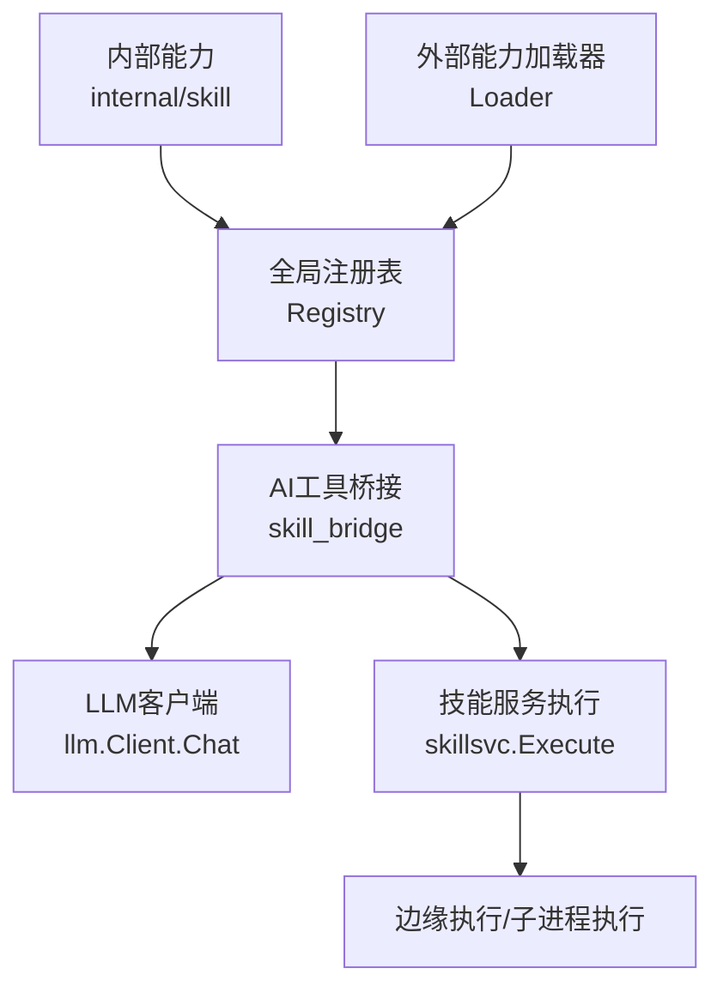
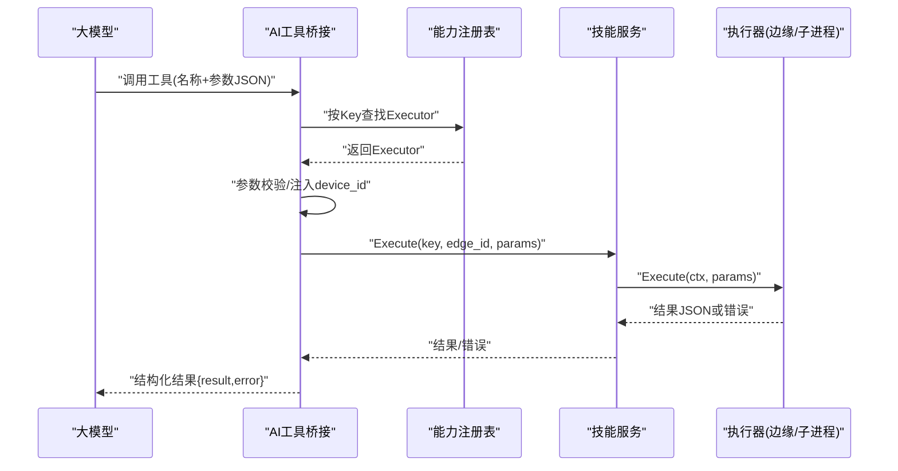
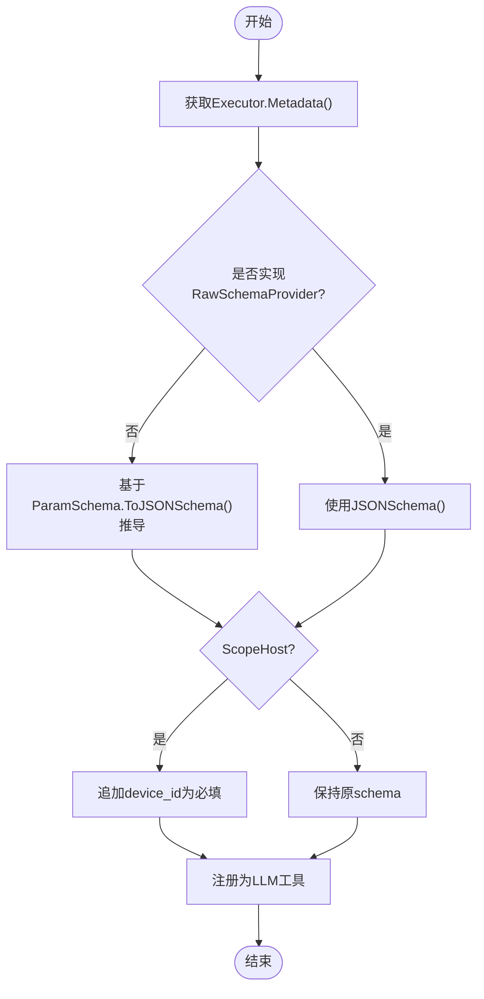
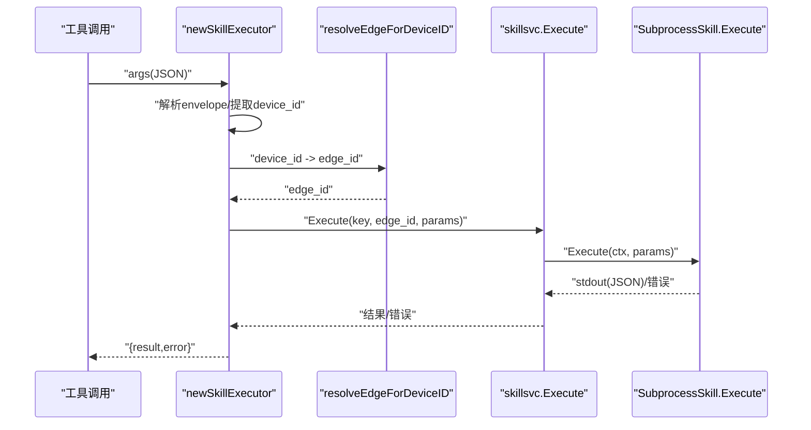
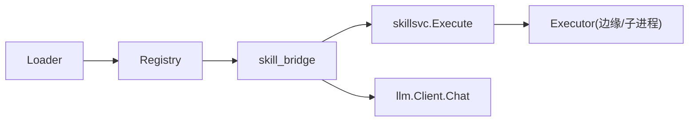

# 工具发现与调度

<cite>
**本文引用的文件**
- [internal/skill/types.go](file://internal/skill/types.go)
- [internal/skill/schema.go](file://internal/skill/schema.go)
- [internal/skill/registry.go](file://internal/skill/registry.go)
- [internal/skill/loader.go](file://internal/skill/loader.go)
- [internal/skill/subprocess.go](file://internal/skill/subprocess.go)
- [internal/manager/biz/aiops/tools/skill_bridge.go](file://internal/manager/biz/aiops/tools/skill_bridge.go)
- [internal/pkg/llm/client.go](file://internal/pkg/llm/client.go)
- [cmd/ongrid/coordinator_tools_test.go](file://cmd/ongrid/coordinator_tools_test.go)
</cite>

## 目录
1. [简介](#简介)
2. [项目结构](#项目结构)
3. [核心组件](#核心组件)
4. [架构总览](#架构总览)
5. [详细组件分析](#详细组件分析)
6. [依赖关系分析](#依赖关系分析)
7. [性能与并发](#性能与并发)
8. [故障排查指南](#故障排查指南)
9. [结论](#结论)
10. [附录：调用流程示例与监控](#附录调用流程示例与监控)

## 简介
本文件聚焦“工具发现与调度”的完整链路，围绕以下目标展开：
- Schemas() 如何暴露工具元数据给大模型（LLM）
- Invoke() 如何实现工具调用分发
- 参数验证机制、错误处理策略与上下文传递
- 超时控制、重试机制与并发安全保证
- 通过代码级流程图展示工具调用、错误处理与性能监控
- 提供调试工具调用的实操建议

## 项目结构
工具系统由“能力定义—注册—发现—桥接—执行”构成：
- 能力定义：在 internal/skill 中声明 Executor 接口、Metadata、ParamSchema 等
- 注册与发现：全局 Registry 维护所有已注册的能力；Loader 扫描外部 skill.json 并注册子进程能力
- 桥接：Manager 侧将 safe 能力自动注册为 LLM 可调用的 Tool（含 JSON Schema 注入 device_id）
- 执行：根据 ScopeHost/ScopeManager 决定在边缘设备或管理器内执行；子进程能力通过标准输入输出通信

图表来源
- [internal/skill/registry.go:10-47](file://internal/skill/registry.go#L10-L47)
- [internal/skill/loader.go:69-110](file://internal/skill/loader.go#L69-L110)
- [internal/manager/biz/aiops/tools/skill_bridge.go:35-75](file://internal/manager/biz/aiops/tools/skill_bridge.go#L35-L75)
- [internal/pkg/llm/client.go:387-507](file://internal/pkg/llm/client.go#L387-L507)

章节来源
- [internal/skill/types.go:1-27](file://internal/skill/types.go#L1-L27)
- [internal/skill/registry.go:10-47](file://internal/skill/registry.go#L10-L47)
- [internal/skill/loader.go:69-110](file://internal/skill/loader.go#L69-L110)
- [internal/manager/biz/aiops/tools/skill_bridge.go:35-75](file://internal/manager/biz/aiops/tools/skill_bridge.go#L35-L75)
- [internal/pkg/llm/client.go:387-507](file://internal/pkg/llm/client.go#L387-L507)

## 核心组件
- 能力元数据与执行接口
  - Metadata：包含 Key、Name、Description、Class、Scope、Category、Params、ResultPreview
  - ParamSchema/ParamDef：描述参数类型、是否必填、默认值、枚举、数组元素类型
  - Executor：每个能力一个实现，提供 Metadata() 与 Execute(ctx, params)
- 注册表
  - 全局 Registry：线程安全的注册与查询；All()/AllByClass() 用于枚举能力
- 外部能力加载器
  - LoaderConfig/LoadDirs：扫描指定目录下的 skill.json，构建 SubprocessSkill 并注册
- 子进程能力
  - SubprocessSkill：以独立进程运行外部可执行文件，stdin/stdout 交换 JSON，支持超时与环境白名单
- AI工具桥接
  - RegisterSafeSkills：仅注册 ClassSafe 能力为 LLM 工具；为 ScopeHost 注入 device_id 字段
  - newSkillExecutor：解析参数、定位 edge_id、调用 skillsvc.Execute，封装结果/错误为结构化 JSON
- LLM客户端
  - Client.Chat：构造请求、预算检查、超时保护、指标记录；返回 assistant 消息与 tool_calls

章节来源
- [internal/skill/types.go:63-175](file://internal/skill/types.go#L63-L175)
- [internal/skill/types.go:190-203](file://internal/skill/types.go#L190-L203)
- [internal/skill/registry.go:10-47](file://internal/skill/registry.go#L10-L47)
- [internal/skill/loader.go:13-67](file://internal/skill/loader.go#L13-L67)
- [internal/skill/subprocess.go:30-78](file://internal/skill/subprocess.go#L30-L78)
- [internal/manager/biz/aiops/tools/skill_bridge.go:35-75](file://internal/manager/biz/aiops/tools/skill_bridge.go#L35-L75)
- [internal/pkg/llm/client.go:82-128](file://internal/pkg/llm/client.go#L82-L128)

## 架构总览
下图展示了从 LLM 到工具执行的端到端流程，包括工具发现、参数校验、调度与执行。

图表来源
- [internal/manager/biz/aiops/tools/skill_bridge.go:146-235](file://internal/manager/biz/aiops/tools/skill_bridge.go#L146-L235)
- [internal/skill/registry.go:35-47](file://internal/skill/registry.go#L35-L47)
- [internal/skill/subprocess.go:99-172](file://internal/skill/subprocess.go#L99-L172)

## 详细组件分析

### 工具发现：Schemas() 如何暴露工具元数据给LLM
- 能力元数据到 JSON Schema 的转换
  - BuildSchema(e)：优先使用 RawSchemaProvider 提供的原始 schema；否则基于 Metadata.Params 生成
  - ToJSONSchema()：将 ParamSchema 映射为 OpenAI function-calling 所需的 object + properties + required 结构
- 桥接层注册工具
  - RegisterSafeSkills：遍历 AllByClass(ClassSafe)，为每个能力构建 Tool（名称=Key，描述=Description），并附加 ResultPreview
  - buildSkillToolSchema：对 ScopeHost 能力注入 device_id 为必填整数；对子进程能力合并 manifest 中的 schema
- LLM 侧接收
  - llm.ToolSchema：携带 Name、Description、Parameters（JSON Schema），随 Chat 请求发送给模型

图表来源
- [internal/skill/schema.go:5-20](file://internal/skill/schema.go#L5-L20)
- [internal/skill/schema.go:22-95](file://internal/skill/schema.go#L22-L95)
- [internal/manager/biz/aiops/tools/skill_bridge.go:77-144](file://internal/manager/biz/aiops/tools/skill_bridge.go#L77-L144)
- [internal/pkg/llm/client.go:82-88](file://internal/pkg/llm/client.go#L82-L88)

章节来源
- [internal/skill/schema.go:5-95](file://internal/skill/schema.go#L5-L95)
- [internal/manager/biz/aiops/tools/skill_bridge.go:35-144](file://internal/manager/biz/aiops/tools/skill_bridge.go#L35-L144)
- [internal/pkg/llm/client.go:82-88](file://internal/pkg/llm/client.go#L82-L88)

### 工具调度：Invoke() 如何实现工具调用分发
- 参数信封解析与设备定位
  - newSkillExecutor：解析 args 为 envelope；若为 ScopeHost，提取 device_id（兼容 edge_id 别名），删除后转发剩余参数
  - resolveEdgeForDeviceID：将 device_id 解析为 host edge_id；若无关联则报错提示
- 执行路径选择
  - 通过 skillsvc.Execute 统一入口，传入 key、edge_id、params
  - 子进程执行：SubprocessSkill.Execute 启动外部进程，stdin 写入 params，stdout 读取结果
- 结果封装
  - 将 result 与 error 打包为 {result, error} 的 JSON，便于 LLM 消费结构化输出

图表来源
- [internal/manager/biz/aiops/tools/skill_bridge.go:146-235](file://internal/manager/biz/aiops/tools/skill_bridge.go#L146-L235)
- [internal/skill/subprocess.go:99-172](file://internal/skill/subprocess.go#L99-L172)

章节来源
- [internal/manager/biz/aiops/tools/skill_bridge.go:146-235](file://internal/manager/biz/aiops/tools/skill_bridge.go#L146-L235)
- [internal/skill/subprocess.go:99-172](file://internal/skill/subprocess.go#L99-L172)

### 参数验证机制
- 注册期验证
  - Metadata.Validate()：校验 Key 命名、Name/Description 非空、Class/Scope 合法、Params 类型与 ItemType 约束、Required 与 Default 互斥
- 运行期验证
  - 子进程参数：空参数转为 {}；非空需为有效 JSON；否则返回错误
  - device_id 校验：必须为整数；缺失时报错；无 host-edge 关联时给出明确提示
- 外部能力清单校验
  - SkillManifest 字段校验：name/description/entry 必填；class 限定范围；timeout_seconds 默认回退

章节来源
- [internal/skill/types.go:127-175](file://internal/skill/types.go#L127-L175)
- [internal/skill/subprocess.go:137-143](file://internal/skill/subprocess.go#L137-L143)
- [internal/manager/biz/aiops/tools/skill_bridge.go:163-191](file://internal/manager/biz/aiops/tools/skill_bridge.go#L163-L191)
- [internal/skill/loader.go:176-253](file://internal/skill/loader.go#L176-L253)

### 错误处理策略
- 子进程错误分类
  - 配置错误：entry 为空或非绝对路径、不可执行、stat 失败
  - 超时错误：context.DeadlineExceeded，包装为带超时的错误信息
  - 非零退出码：附带 stderr 尾部片段，便于审计与 LLM 理解
  - 输出非法：stdout 非 JSON 时返回错误并附首段内容
- 桥接层错误封装
  - 统一返回 {result, error}；ScopeHost 错误附加 edge_id 上下文
- LLM 客户端错误
  - 预算超限、网络错误、空 choices 等；记录指标与日志，不泄露用户内容

章节来源
- [internal/skill/subprocess.go:112-172](file://internal/skill/subprocess.go#L112-L172)
- [internal/manager/biz/aiops/tools/skill_bridge.go:206-233](file://internal/manager/biz/aiops/tools/skill_bridge.go#L206-L233)
- [internal/pkg/llm/client.go:402-507](file://internal/pkg/llm/client.go#L402-L507)

### 上下文传递
- 超时与取消传播
  - 子进程执行使用 context.WithTimeout，继承父上下文；exec.CommandContext 确保取消传播
- 身份与审计
  - 工具调用以 system 身份执行（UserID=0, Role="system"），便于审计区分人类与自动化调用
- 设备上下文
  - device_id → edge_id 解析，确保在正确的边缘节点执行

章节来源
- [internal/skill/subprocess.go:145-159](file://internal/skill/subprocess.go#L145-L159)
- [internal/manager/biz/aiops/tools/skill_bridge.go:206-210](file://internal/manager/biz/aiops/tools/skill_bridge.go#L206-L210)
- [internal/manager/biz/aiops/tools/skill_bridge.go:237-249](file://internal/manager/biz/aiops/tools/skill_bridge.go#L237-L249)

### 超时控制、重试机制与并发安全
- 超时控制
  - 子进程默认超时：DefaultSubprocessTimeout（30s），可通过 manifest 的 timeout_seconds 覆盖
  - LLM 客户端默认超时：defaultTimeout（120s），可通过 WithDefaultTimeout 动态设置
- 重试机制
  - 工具调用不重试：因工具通常非幂等，避免重复副作用
  - 采样参数自适应：对推理模型拒绝自定义温度等参数的情况，自动剥离并重试一次（仅限模型调用前）
- 并发安全
  - 注册表使用 RWMutex：init 阶段单写，运行时并发读
  - LLM 客户端缓存 SDK 实例与凭据解析结果，降低锁竞争

章节来源
- [internal/skill/subprocess.go:26-28](file://internal/skill/subprocess.go#L26-L28)
- [internal/skill/loader.go:230-233](file://internal/skill/loader.go#L230-L233)
- [internal/pkg/llm/client.go:37-44](file://internal/pkg/llm/client.go#L37-L44)
- [internal/pkg/llm/client.go:130-161](file://internal/pkg/llm/client.go#L130-L161)
- [internal/pkg/llm/client.go:434-447](file://internal/pkg/llm/client.go#L434-L447)
- [internal/skill/registry.go:15-19](file://internal/skill/registry.go#L15-L19)

## 依赖关系分析
- 模块耦合
  - skill_bridge 依赖 skill 注册表与 skillsvc 执行服务
  - loader 依赖 registry 进行外部能力注册
  - llm client 作为上层调用方，接收工具列表并驱动 tool_calls
- 外部依赖
  - 子进程通过 exec.CommandContext 管理生命周期
  - LLM 客户端通过 go-openai SDK 与提供商交互

图表来源
- [internal/skill/registry.go:10-47](file://internal/skill/registry.go#L10-L47)
- [internal/skill/loader.go:69-110](file://internal/skill/loader.go#L69-L110)
- [internal/manager/biz/aiops/tools/skill_bridge.go:35-75](file://internal/manager/biz/aiops/tools/skill_bridge.go#L35-L75)
- [internal/pkg/llm/client.go:387-507](file://internal/pkg/llm/client.go#L387-L507)

章节来源
- [internal/skill/registry.go:10-47](file://internal/skill/registry.go#L10-L47)
- [internal/skill/loader.go:69-110](file://internal/skill/loader.go#L69-L110)
- [internal/manager/biz/aiops/tools/skill_bridge.go:35-75](file://internal/manager/biz/aiops/tools/skill_bridge.go#L35-L75)
- [internal/pkg/llm/client.go:387-507](file://internal/pkg/llm/client.go#L387-L507)

## 性能与并发
- 子进程 I/O 限制
  - stdout 最大 16 MiB，stderr 保留尾部 4 KiB，防止内存膨胀
- 资源隔离
  - 子进程环境白名单：仅允许显式配置的变量，避免泄漏敏感信息
- 指标与观测
  - LLM 客户端记录请求耗时、token 用量、成功/失败计数；便于容量规划与异常定位

章节来源
- [internal/skill/subprocess.go:17-24](file://internal/skill/subprocess.go#L17-L24)
- [internal/skill/subprocess.go:174-193](file://internal/skill/subprocess.go#L174-L193)
- [internal/pkg/llm/client.go:449-507](file://internal/pkg/llm/client.go#L449-L507)

## 故障排查指南
- 常见问题定位
  - 工具未注册：检查 init 中是否调用 Register；确认 Key 唯一且符合 lower_snake 规则
  - device_id 无效：确认设备存在且与 host edge 有 junction 关联；必要时先查询可用设备
  - 子进程执行失败：查看 stderr 尾部片段；确认 entry 可执行且位于 allowlist 目录
  - 超时：调整 manifest 的 timeout_seconds 或上游上下文超时
- 调试步骤
  - 启用日志：观察 skill loader 注册过程与错误
  - 最小化复现：构造最小 JSON 参数，逐步缩小问题范围
  - 指标核对：查看 LLM 客户端的请求耗时与 token 用量，判断是否为模型侧瓶颈

章节来源
- [internal/skill/loader.go:115-160](file://internal/skill/loader.go#L115-L160)
- [internal/skill/subprocess.go:112-172](file://internal/skill/subprocess.go#L112-L172)
- [internal/manager/biz/aiops/tools/skill_bridge.go:163-191](file://internal/manager/biz/aiops/tools/skill_bridge.go#L163-L191)
- [internal/pkg/llm/client.go:449-507](file://internal/pkg/llm/client.go#L449-L507)

## 结论
该工具系统通过统一的元数据与执行接口，实现了跨边缘与经理端的工具发现与调度。参数校验严格、错误处理清晰、上下文传递可靠，配合超时与并发安全机制，保障了稳定性与可观测性。桥接层将 safe 能力无缝暴露给 LLM，使大模型能够以函数调用方式驱动运维操作。

## 附录：调用流程示例与监控
- 工具调用流程示例（概念性）
  - 步骤1：LLM 收到工具列表（来自 ToolSchema）
  - 步骤2：LLM 选择工具并生成参数（包含 device_id 对于 ScopeHost）
  - 步骤3：桥接层解析参数、定位 edge_id、调用 skillsvc.Execute
  - 步骤4：执行器运行（边缘命令或子进程），返回结构化结果
  - 步骤5：LLM 消费 {result, error} 并继续对话
- 监控要点
  - 子进程 I/O 上限与超时：关注 stderr 尾部与超时日志
  - LLM 客户端指标：请求耗时、token 用量、成功率
  - 注册与发现：确认能力已注册且未被跳过

[本节为概念性说明，不直接分析具体文件]