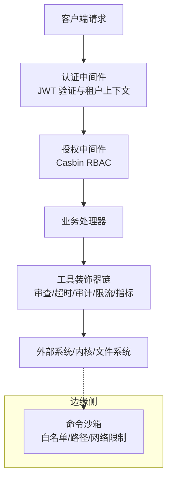
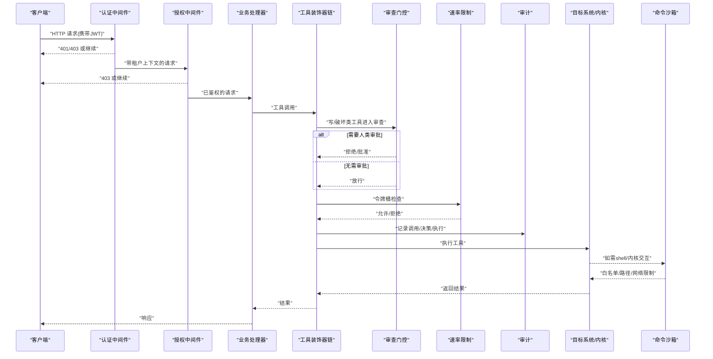
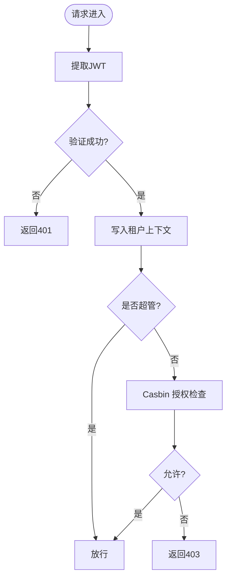
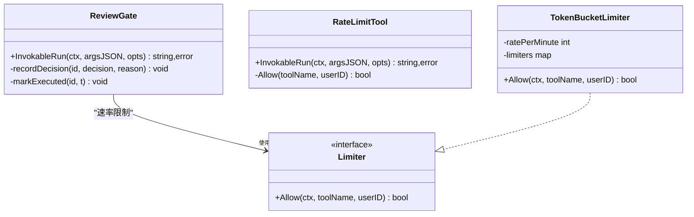
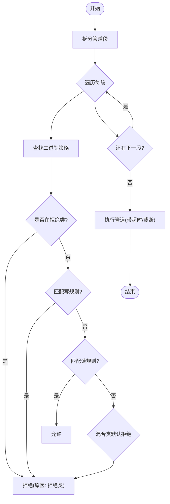
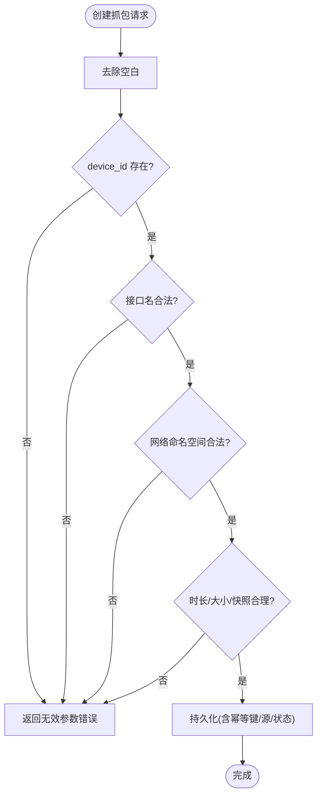
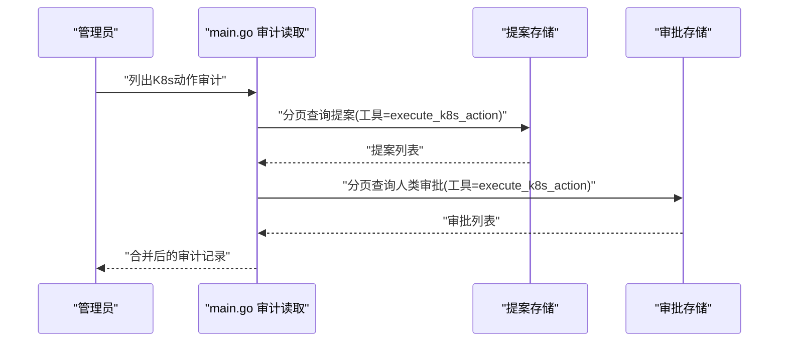
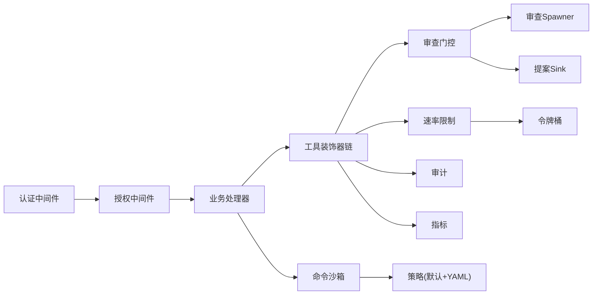

# 工具安全与权限

<cite>
**本文引用的文件**
- [internal/pkg/auth/middleware.go](file://internal/pkg/auth/middleware.go)
- [internal/pkg/authzmw/middleware.go](file://internal/pkg/authzmw/middleware.go)
- [internal/iam/biz/authz/authz.go](file://internal/iam/biz/authz/authz.go)
- [internal/manager/server/knowledge/http.go](file://internal/manager/server/knowledge/http.go)
- [internal/edgeagent/cmdpolicy/policy.go](file://internal/edgeagent/cmdpolicy/policy.go)
- [internal/edgeagent/cmdpolicy/sandbox.go](file://internal/edgeagent/cmdpolicy/sandbox.go)
- [internal/manager/biz/aiops/tools/decorators/review_gate.go](file://internal/manager/biz/aiops/tools/decorators/review_gate.go)
- [internal/manager/biz/aiops/tools/decorators/ratelimit.go](file://internal/manager/biz/aiops/tools/decorators/ratelimit.go)
- [cmd/ongrid/main.go](file://cmd/ongrid/main.go)
- [internal/manager/model/packetcapture/model.go](file://internal/manager/model/packetcapture/model.go)
- [internal/manager/biz/packetcapture/usecase.go](file://internal/manager/biz/packetcapture/usecase.go)
</cite>

## 目录
1. [简介](#简介)
2. [项目结构](#项目结构)
3. [核心组件](#核心组件)
4. [架构总览](#架构总览)
5. [详细组件分析](#详细组件分析)
6. [依赖关系分析](#依赖关系分析)
7. [性能考量](#性能考量)
8. [故障排查指南](#故障排查指南)
9. [结论](#结论)
10. [附录](#附录)

## 简介
本文件面向“工具执行”的安全与权限控制，覆盖以下主题：
- 身份认证与授权（JWT、RBAC、对象级访问控制）
- 操作审批流程（人类审批门控、审查门控、确定性策略快速通道）
- 审计日志记录（提案、决策、执行结果的可追溯性）
- 敏感操作防护（沙箱命令白名单、网络与路径限制、速率限制）
- 安全边界（输入校验、输出过滤、超时与资源限制）
- 安全配置示例与常见威胁防护
- 安全审计与合规检查实现指南

## 项目结构
围绕工具安全的关键代码分布在如下位置：
- 认证与鉴权：HTTP 中间件解析 JWT，注入租户上下文；基于 Casbin 的 RBAC 中间件对资源对象与动作进行授权。
- 工具装饰器链：在工具调用前后串联审查门控、超时、审计、速率限制、指标等横切能力。
- 边缘侧命令沙箱：通过白名单、参数匹配、路径与网络限制，将 shell 命令执行收敛到最小可执行集。
- 数据面输入校验：针对抓包等高危能力，严格校验入参并规范化处理。
- 审计与审批：变更记录、决策与执行时间戳，支持查询与展示。

**图示来源**
- [internal/pkg/auth/middleware.go:10-53](file://internal/pkg/auth/middleware.go#L10-L53)
- [internal/pkg/authzmw/middleware.go:57-97](file://internal/pkg/authzmw/middleware.go#L57-L97)
- [internal/manager/biz/aiops/tools/decorators/review_gate.go:235-350](file://internal/manager/biz/aiops/tools/decorators/review_gate.go#L235-L350)
- [internal/edgeagent/cmdpolicy/sandbox.go:134-188](file://internal/edgeagent/cmdpolicy/sandbox.go#L134-L188)

**章节来源**
- [internal/pkg/auth/middleware.go:10-53](file://internal/pkg/auth/middleware.go#L10-L53)
- [internal/pkg/authzmw/middleware.go:57-97](file://internal/pkg/authzmw/middleware.go#L57-L97)

## 核心组件
- 认证中间件：从请求头或查询参数提取 JWT，验签后写入租户上下文，支持超级用户标记。
- 授权中间件：基于 Casbin 的策略引擎，按“对象:动作”粒度进行鉴权，支持多组织域与超管短路。
- 工具装饰器链：统一封装工具调用，提供审查门控、超时、审计、速率限制与指标采集。
- 命令沙箱：以白名单+参数匹配为核心，限制可执行二进制、路径访问与网络出口。
- 输入校验与规范化：对高危能力（如抓包）进行严格的字段校验与归一化。
- 审计与审批：记录变更提案、决策与执行时间，支持分页查询与聚合展示。

**章节来源**
- [internal/pkg/auth/middleware.go:10-53](file://internal/pkg/auth/middleware.go#L10-L53)
- [internal/pkg/authzmw/middleware.go:35-97](file://internal/pkg/authzmw/middleware.go#L35-L97)
- [internal/manager/biz/aiops/tools/decorators/review_gate.go:235-350](file://internal/manager/biz/aiops/tools/decorators/review_gate.go#L235-L350)
- [internal/edgeagent/cmdpolicy/policy.go:33-492](file://internal/edgeagent/cmdpolicy/policy.go#L33-L492)
- [internal/manager/biz/packetcapture/usecase.go:769-797](file://internal/manager/biz/packetcapture/usecase.go#L769-L797)

## 架构总览
下图展示了从 HTTP 请求到工具执行的完整安全链路：认证→授权→装饰器链（含人类/审查门控、速率限制）→外部系统/内核→命令沙箱。

**图示来源**
- [internal/pkg/auth/middleware.go:21-53](file://internal/pkg/auth/middleware.go#L21-L53)
- [internal/pkg/authzmw/middleware.go:70-97](file://internal/pkg/authzmw/middleware.go#L70-L97)
- [internal/manager/biz/aiops/tools/decorators/review_gate.go:235-350](file://internal/manager/biz/aiops/tools/decorators/review_gate.go#L235-L350)
- [internal/manager/biz/aiops/tools/decorators/ratelimit.go:98-135](file://internal/manager/biz/aiops/tools/decorators/ratelimit.go#L98-L135)
- [internal/edgeagent/cmdpolicy/sandbox.go:134-188](file://internal/edgeagent/cmdpolicy/sandbox.go#L134-L188)

## 详细组件分析

### 认证与授权
- 认证中间件负责从 Authorization 头或查询参数提取 JWT，验签后将租户信息写入上下文，支持超级用户标记。
- 授权中间件基于 Casbin 的 Enforcer，按“对象:动作”进行鉴权，支持多组织域；当无租户上下文时返回未授权，超管短路放行。
- 资源命名约定包括 edge:*、knowledge:*、alert:*、agent:*、monitor:*、org:*、user:* 等，动作词汇包含 read/write/delete/manage。

**图示来源**
- [internal/pkg/auth/middleware.go:21-53](file://internal/pkg/auth/middleware.go#L21-L53)
- [internal/pkg/authzmw/middleware.go:70-97](file://internal/pkg/authzmw/middleware.go#L70-L97)
- [internal/iam/biz/authz/authz.go:233-271](file://internal/iam/biz/authz/authz.go#L233-L271)

**章节来源**
- [internal/pkg/auth/middleware.go:10-53](file://internal/pkg/auth/middleware.go#L10-L53)
- [internal/pkg/authzmw/middleware.go:35-97](file://internal/pkg/authzmw/middleware.go#L35-L97)
- [internal/iam/biz/authz/authz.go:40-110](file://internal/iam/biz/authz/authz.go#L40-L110)
- [internal/manager/server/knowledge/http.go:90-107](file://internal/manager/server/knowledge/http.go#L90-L107)

### 工具调用装饰器链（审查门控、超时、审计、速率限制、指标）
- 审查门控：对 Class 为 write 或 destructive 的工具调用进行拦截，优先走确定性策略快速通道；否则启动审查工作流，解析“Decision: approve|reject”，仅批准后才执行内部工具。
- 超时：审查门控独立于内部工具超时，避免审查轮次被内层超时限制。
- 审计：记录提案、决策与执行时间戳；失败不阻断主流程。
- 速率限制：按（工具名, 用户ID）维度维护令牌桶，超限快速失败。
- 指标：统计调用次数与错误类型。

**图示来源**
- [internal/manager/biz/aiops/tools/decorators/review_gate.go:235-350](file://internal/manager/biz/aiops/tools/decorators/review_gate.go#L235-L350)
- [internal/manager/biz/aiops/tools/decorators/ratelimit.go:29-96](file://internal/manager/biz/aiops/tools/decorators/ratelimit.go#L29-L96)

**章节来源**
- [internal/manager/biz/aiops/tools/decorators/review_gate.go:15-612](file://internal/manager/biz/aiops/tools/decorators/review_gate.go#L15-L612)
- [internal/manager/biz/aiops/tools/decorators/ratelimit.go:1-136](file://internal/manager/biz/aiops/tools/decorators/ratelimit.go#L1-L136)

### 命令沙箱与策略（边缘侧）
- 默认只读基线：内置大量只读/混合/网络/拒绝的二进制类别，并通过参数匹配区分读写行为。
- YAML 覆盖：支持扩展二进制列表、替换策略、调整路径与网络白名单、输出大小上限、超时与最大参数长度。
- 执行流程：先 Decide 判定管道各段是否允许，再执行并限制超时、截断输出、记录耗时。

**图示来源**
- [internal/edgeagent/cmdpolicy/policy.go:707-800](file://internal/edgeagent/cmdpolicy/policy.go#L707-L800)
- [internal/edgeagent/cmdpolicy/sandbox.go:134-188](file://internal/edgeagent/cmdpolicy/sandbox.go#L134-L188)

**章节来源**
- [internal/edgeagent/cmdpolicy/policy.go:33-492](file://internal/edgeagent/cmdpolicy/policy.go#L33-L492)
- [internal/edgeagent/cmdpolicy/sandbox.go:39-188](file://internal/edgeagent/cmdpolicy/sandbox.go#L39-L188)

### 输入校验与输出过滤（以抓包为例）
- 输入校验：设备ID必填、接口名合法且长度受限、网络命名空间格式校验、时长/大小/快照长度等数值范围校验。
- 输出过滤：模型中保留请求与解析后的目标 JSON、规范化的过滤器字符串，便于审计与回溯。
- 幂等键：支持请求幂等键，防止重复提交。

**图示来源**
- [internal/manager/biz/packetcapture/usecase.go:769-797](file://internal/manager/biz/packetcapture/usecase.go#L769-L797)
- [internal/manager/model/packetcapture/model.go:41-54](file://internal/manager/model/packetcapture/model.go#L41-L54)

**章节来源**
- [internal/manager/biz/packetcapture/usecase.go:769-797](file://internal/manager/biz/packetcapture/usecase.go#L769-L797)
- [internal/manager/model/packetcapture/model.go:41-54](file://internal/manager/model/packetcapture/model.go#L41-L54)

### 审计与审批（Kubernetes 动作审计）
- 审计读取：从提案表与审批表分页聚合 Kubernetes 动作审计记录，支持限制与偏移。
- 提案与决策：审查门控在拦截时插入提案行，更新决策与执行时间戳，便于后续查询。

**图示来源**
- [cmd/ongrid/main.go:4393-4426](file://cmd/ongrid/main.go#L4393-L4426)
- [internal/manager/biz/aiops/tools/decorators/review_gate.go:288-350](file://internal/manager/biz/aiops/tools/decorators/review_gate.go#L288-L350)

**章节来源**
- [cmd/ongrid/main.go:4393-4426](file://cmd/ongrid/main.go#L4393-L4426)
- [internal/manager/biz/aiops/tools/decorators/review_gate.go:288-350](file://internal/manager/biz/aiops/tools/decorators/review_gate.go#L288-L350)

## 依赖关系分析
- 认证中间件依赖 JWT 签名器与租户上下文；授权中间件依赖 Casbin Enforcer 与租户上下文。
- 工具装饰器链依赖审查门控、速率限制器、审计 sink、指标注册器等；审查门控依赖聊天运行时 spawner 与提案 sink。
- 命令沙箱依赖策略与路径/网络校验器；策略由默认只读基线与 YAML 覆盖组合而成。

**图示来源**
- [internal/pkg/auth/middleware.go:21-53](file://internal/pkg/auth/middleware.go#L21-L53)
- [internal/pkg/authzmw/middleware.go:70-97](file://internal/pkg/authzmw/middleware.go#L70-L97)
- [internal/manager/biz/aiops/tools/decorators/review_gate.go:235-350](file://internal/manager/biz/aiops/tools/decorators/review_gate.go#L235-L350)
- [internal/manager/biz/aiops/tools/decorators/ratelimit.go:98-135](file://internal/manager/biz/aiops/tools/decorators/ratelimit.go#L98-L135)
- [internal/edgeagent/cmdpolicy/policy.go:547-641](file://internal/edgeagent/cmdpolicy/policy.go#L547-L641)

**章节来源**
- [internal/pkg/auth/middleware.go:21-53](file://internal/pkg/auth/middleware.go#L21-L53)
- [internal/pkg/authzmw/middleware.go:70-97](file://internal/pkg/authzmw/middleware.go#L70-L97)
- [internal/manager/biz/aiops/tools/decorators/review_gate.go:235-350](file://internal/manager/biz/aiops/tools/decorators/review_gate.go#L235-L350)
- [internal/manager/biz/aiops/tools/decorators/ratelimit.go:98-135](file://internal/manager/biz/aiops/tools/decorators/ratelimit.go#L98-L135)
- [internal/edgeagent/cmdpolicy/policy.go:547-641](file://internal/edgeagent/cmdpolicy/policy.go#L547-L641)

## 性能考量
- 审查门控独立超时：避免 LLM 审查轮次受内层工具超时影响，减少整体延迟抖动。
- 速率限制非阻塞：令牌桶快速失败，避免队列堆积导致请求雪崩。
- 沙箱输出截断与超时：防止大输出与长耗时任务拖垮系统。
- 审计最佳努力：审核失败不阻断主流程，降低耦合风险。

[本节为通用指导，不直接分析具体文件]

## 故障排查指南
- 401/403 问题：检查 JWT 是否存在且有效；确认租户上下文是否注入；核对 Casbin 策略与对象/动作命名。
- 审查拒绝：查看审查输出是否包含明确的 Decision 行；确认 spawner 是否可用；检查确定性策略条件是否满足。
- 速率限制触发：确认 per-(tool,user) 配额是否过低；必要时调整默认速率或注入自定义 Limiter。
- 沙箱拒绝：检查二进制是否在白名单；参数是否命中写规则；路径/网络是否受限；YAML 覆盖是否正确加载。
- 抓包失败：检查 device_id、接口名、网络命名空间、时长/大小/快照长度等字段是否符合校验规则。

**章节来源**
- [internal/pkg/auth/middleware.go:21-53](file://internal/pkg/auth/middleware.go#L21-L53)
- [internal/pkg/authzmw/middleware.go:70-97](file://internal/pkg/authzmw/middleware.go#L70-L97)
- [internal/manager/biz/aiops/tools/decorators/review_gate.go:288-350](file://internal/manager/biz/aiops/tools/decorators/review_gate.go#L288-L350)
- [internal/manager/biz/aiops/tools/decorators/ratelimit.go:98-135](file://internal/manager/biz/aiops/tools/decorators/ratelimit.go#L98-L135)
- [internal/edgeagent/cmdpolicy/policy.go:707-800](file://internal/edgeagent/cmdpolicy/policy.go#L707-L800)
- [internal/manager/biz/packetcapture/usecase.go:769-797](file://internal/manager/biz/packetcapture/usecase.go#L769-L797)

## 结论
本系统通过多层安全机制保障工具执行的安全性：
- 认证与授权确保只有合法用户在正确组织域下访问资源。
- 审查门控与人类审批对敏感操作进行强约束，并提供确定性策略快速通道。
- 命令沙箱将 shell 与内核交互收敛到最小可执行集，配合路径与网络白名单。
- 速率限制与超时保护系统免受滥用与异常负载。
- 审计与审批记录贯穿提案、决策与执行，满足可追溯与合规要求。

[本节为总结，不直接分析具体文件]

## 附录

### 安全配置示例（建议）
- 启用审查门控：为所有 write/destructive 工具启用 WithReviewGate，并配置独立的 ReviewerTimeout。
- 设置速率限制：根据业务场景调整 DefaultRateLimit 或注入自定义 Limiter。
- 沙箱策略：基于 DefaultReadOnly() 构建基线，使用 YAML 覆盖扩展二进制与网络白名单，限制输出大小与超时。
- 输入校验：对所有高危能力（如抓包）实施严格的字段校验与规范化。

[本节为通用指导，不直接分析具体文件]

### 常见安全威胁与防护措施
- 越权访问：通过 JWT 与 Casbin RBAC 双重校验，超管短路但保留兜底策略。
- 恶意命令执行：命令沙箱白名单+参数匹配+路径/网络限制，拒绝危险二进制与写操作。
- 资源耗尽：超时、输出截断、速率限制与令牌桶保护。
- 审计缺失：提案、决策、执行时间戳全链路记录，支持分页查询与聚合。

[本节为通用指导，不直接分析具体文件]

### 安全审计与合规检查实现指南
- 提案与决策：在审查门控拦截时插入提案行，更新决策与执行时间戳；失败不影响主流程。
- 审计读取：从提案与审批表分页聚合，支持限制与偏移，便于前端展示与导出。
- 合规检查：结合策略与审计记录，定期生成报告，识别异常调用与未审批变更。

**章节来源**
- [internal/manager/biz/aiops/tools/decorators/review_gate.go:288-350](file://internal/manager/biz/aiops/tools/decorators/review_gate.go#L288-L350)
- [cmd/ongrid/main.go:4393-4426](file://cmd/ongrid/main.go#L4393-L4426)