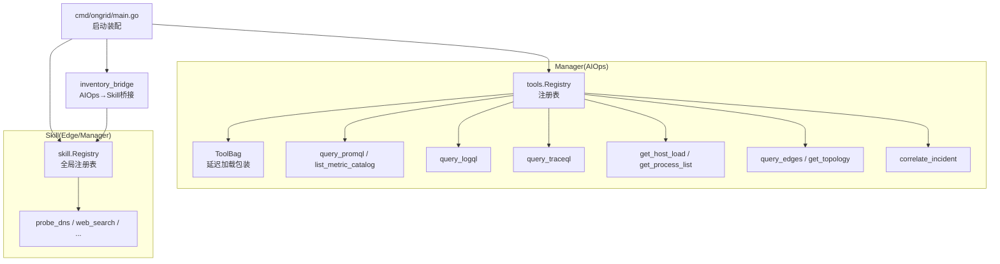
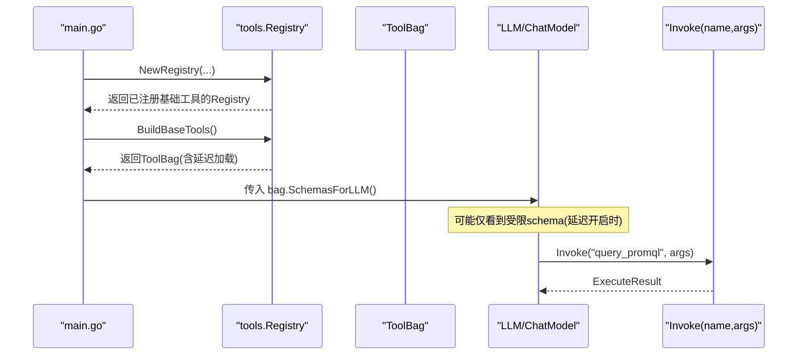
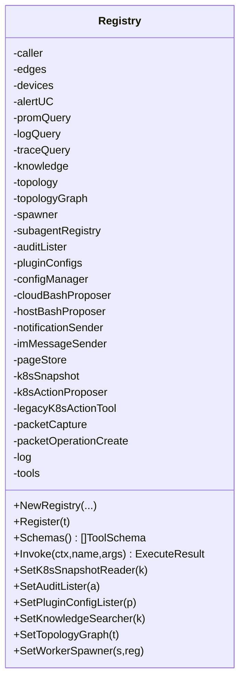
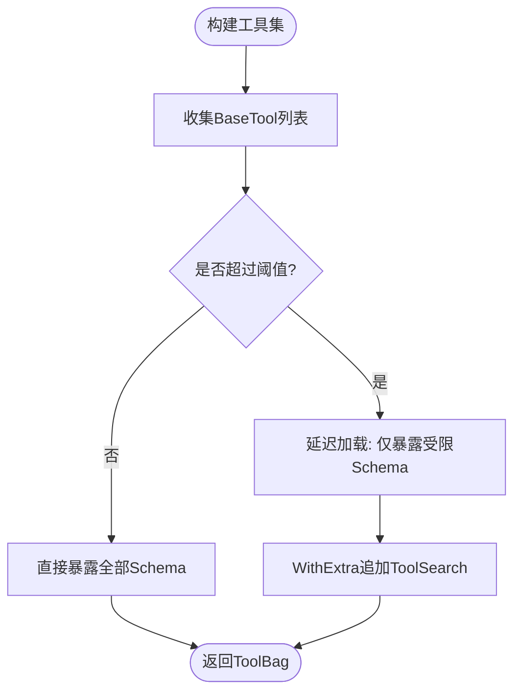
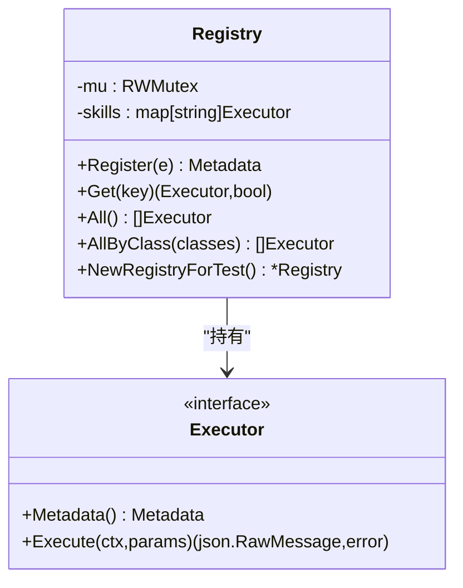
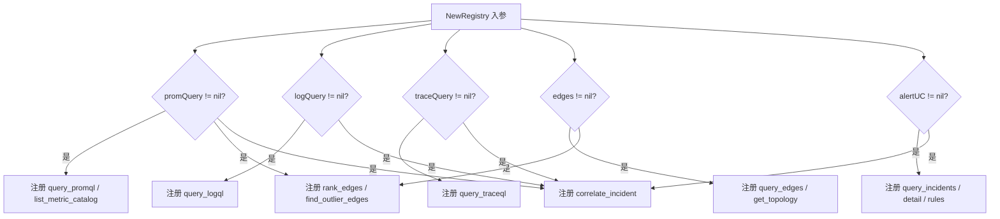
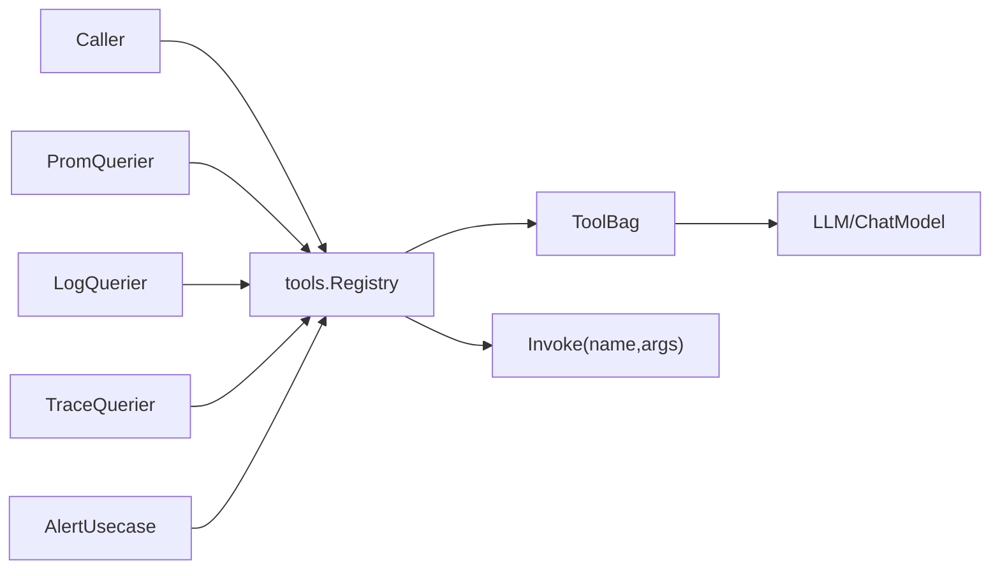

# 工具注册机制

<cite>
**本文引用的文件**
- [internal/manager/biz/aiops/tools/registry.go](file://internal/manager/biz/aiops/tools/registry.go)
- [internal/manager/biz/aiops/tools/registry_basetool.go](file://internal/manager/biz/aiops/tools/registry_basetool.go)
- [internal/manager/biz/aiops/tools/inventory_bridge.go](file://internal/manager/biz/aiops/tools/inventory_bridge.go)
- [internal/skill/registry.go](file://internal/skill/registry.go)
- [internal/skill/types.go](file://internal/skill/types.go)
- [internal/skill/builtin/doc.go](file://internal/skill/builtin/doc.go)
- [internal/skill/builtin/probe_dns.go](file://internal/skill/builtin/probe_dns.go)
- [internal/skill/builtin/web_search.go](file://internal/skill/builtin/web_search.go)
- [cmd/ongrid/main.go](file://cmd/ongrid/main.go)
</cite>

## 目录
1. [简介](#简介)
2. [项目结构](#项目结构)
3. [核心组件](#核心组件)
4. [架构总览](#架构总览)
5. [详细组件分析](#详细组件分析)
6. [依赖关系分析](#依赖关系分析)
7. [性能与内存管理](#性能与内存管理)
8. [故障排查指南](#故障排查指南)
9. [结论](#结论)
10. [附录：扩展与版本管理实践](#附录：扩展与版本管理实践)

## 简介
本文件系统性阐述 ongrid 的“工具注册机制”，聚焦两类注册体系：
- AIOps 工具注册（Manager 侧）：通过 Registry 集中管理 JSON Schema + 执行器，支持条件注册、动态追加与覆盖。
- L2 Skill 注册（Edge/Manager 通用）：通过全局 Registry 维护设备端能力 Executor，统一派发到边缘或管理器执行。

重点说明：
- Registry 的设计模式与生命周期
- NewRegistry 如何自动注册基础工具
- Register 如何实现动态添加与覆盖
- 条件注册逻辑（promQuery/logQuery/traceQuery/alertUC 等）
- 工具生命周期管理与内存策略
- 扩展自定义工具、注册流程与版本管理的最佳实践

## 项目结构
与工具注册相关的关键位置：
- Manager 侧 AIOps 工具注册：internal/manager/biz/aiops/tools/*
- Edge/Manager 通用 Skill 注册：internal/skill/*
- 启动装配与桥接：cmd/ongrid/main.go

图表来源
- [internal/manager/biz/aiops/tools/registry.go:274-410](file://internal/manager/biz/aiops/tools/registry.go#L274-L410)
- [internal/manager/biz/aiops/tools/registry_basetool.go:72-257](file://internal/manager/biz/aiops/tools/registry_basetool.go#L72-L257)
- [internal/skill/registry.go:17-127](file://internal/skill/registry.go#L17-L127)
- [cmd/ongrid/main.go:2454](file://cmd/ongrid/main.go#L2454)

章节来源
- [internal/manager/biz/aiops/tools/registry.go:274-410](file://internal/manager/biz/aiops/tools/registry.go#L274-L410)
- [internal/manager/biz/aiops/tools/registry_basetool.go:72-257](file://internal/manager/biz/aiops/tools/registry_basetool.go#L72-L257)
- [internal/skill/registry.go:17-127](file://internal/skill/registry.go#L17-L127)
- [cmd/ongrid/main.go:2454](file://cmd/ongrid/main.go#L2454)

## 核心组件
- AIOps 工具注册表 tools.Registry
  - 职责：集中维护工具名到执行器的映射；提供 Schemas() 暴露给 LLM；Invoke(name, args) 分发调用。
  - 关键方法：NewRegistry、Register、Schemas、Invoke、SetXxx（后注入依赖）。
- 工具包 ToolBag（延迟加载）
  - 职责：将 BaseTool 列表包装为可延迟加载的视图，控制何时向 LLM 暴露完整 schema。
  - 关键方法：BuildBaseTools、WithExtra、Threshold。
- Skill 注册表 skill.Registry
  - 职责：进程级技能目录；在 init() 时由各个 skill 自注册；运行时并发安全读取。
  - 关键方法：Register、Get、All、AllByClass。
- 内置 Skill 示例
  - probe_dns、web_search 等通过 init() 调用 skill.Register 完成自注册。

章节来源
- [internal/manager/biz/aiops/tools/registry.go:52-143](file://internal/manager/biz/aiops/tools/registry.go#L52-L143)
- [internal/manager/biz/aiops/tools/registry.go:274-410](file://internal/manager/biz/aiops/tools/registry.go#L274-L410)
- [internal/manager/biz/aiops/tools/toolbag.go:285-308](file://internal/manager/biz/aiops/tools/toolbag.go#L285-L308)
- [internal/skill/registry.go:17-127](file://internal/skill/registry.go#L17-L127)
- [internal/skill/builtin/probe_dns.go:13-39](file://internal/skill/builtin/probe_dns.go#L13-L39)
- [internal/skill/builtin/web_search.go:19-46](file://internal/skill/builtin/web_search.go#L19-L46)

## 架构总览
AIOps 工具注册采用“构造期自动注册 + 运行期后注入 + 延迟加载”的组合模式：
- NewRegistry 自动注册最小可用集（host_load、process_list），并依据可选依赖（promQuery/logQuery/traceQuery/alertUC 等）条件注册查询类工具。
- 构建 BaseTool 集合 BuildBaseTools 生成 ToolBag，按阈值决定是否延迟向 LLM 暴露 schema。
- 通过 SetXxx 系列方法在启动后期注入更多依赖（如 k8s snapshot、通知发送器、拓扑图等），并在 setter 中按需注册新工具。
- inventory_bridge 可将 AIOps 工具以 Skill 形式再注册到全局 skill.Registry，供边缘调度或 UI 展示。

图表来源
- [internal/manager/biz/aiops/tools/registry.go:274-410](file://internal/manager/biz/aiops/tools/registry.go#L274-L410)
- [internal/manager/biz/aiops/tools/registry_basetool.go:72-257](file://internal/manager/biz/aiops/tools/registry_basetool.go#L72-L257)
- [internal/manager/biz/aiops/tools/toolbag.go:285-308](file://internal/manager/biz/aiops/tools/toolbag.go#L285-L308)

章节来源
- [internal/manager/biz/aiops/tools/registry.go:274-410](file://internal/manager/biz/aiops/tools/registry.go#L274-L410)
- [internal/manager/biz/aiops/tools/registry_basetool.go:72-257](file://internal/manager/biz/aiops/tools/registry_basetool.go#L72-L257)

## 详细组件分析

### AIOps 工具注册表 tools.Registry
- 设计要点
  - 以 map[string]Tool 存储工具，Name 作为键。
  - Register 允许重复注册同名工具，后者静默覆盖前者，便于热更新或测试替换。
  - Schemas 将内部 Tool 转换为 llm.ToolSchema 供 LLM 消费。
  - Invoke 对未知名称返回“未找到”错误；空参数会被规范化为 {}。
- 自动注册与条件注册
  - 基础工具：get_host_load、get_process_list 始终注册。
  - 条件工具：
    - promQuery 非空 → query_promql、list_metric_catalog
    - logQuery 非空 → query_logql
    - traceQuery 非空 → query_traceql
    - edges 非空 → query_edges、get_topology
    - edges+promQuery → rank_edges、find_outlier_edges
    - alertUC 非空 → query_incidents、get_incident_detail、query_alert_rules
    - 四源齐全(alertUC+prom+log+trace) → correlate_incident
- 后注入与动态扩展
  - SetK8sSnapshotReader/SetAuditLister/SetPluginConfigLister/SetKnowledgeSearcher/SetTopologyGraph/SetWorkerSpawner 等 setter 在启动后期注入依赖，并在必要时注册新工具。
  - SetK8sActionProposer 会重新注册 legacy K8s action 工具。

图表来源
- [internal/manager/biz/aiops/tools/registry.go:61-143](file://internal/manager/biz/aiops/tools/registry.go#L61-L143)
- [internal/manager/biz/aiops/tools/registry.go:274-410](file://internal/manager/biz/aiops/tools/registry.go#L274-L410)
- [internal/manager/biz/aiops/tools/registry.go:447-483](file://internal/manager/biz/aiops/tools/registry.go#L447-L483)

章节来源
- [internal/manager/biz/aiops/tools/registry.go:61-143](file://internal/manager/biz/aiops/tools/registry.go#L61-L143)
- [internal/manager/biz/aiops/tools/registry.go:274-410](file://internal/manager/biz/aiops/tools/registry.go#L274-L410)
- [internal/manager/biz/aiops/tools/registry.go:447-483](file://internal/manager/biz/aiops/tools/registry.go#L447-L483)

### 工具包 ToolBag 与延迟加载
- 作用：将 BaseTool 列表封装为可延迟加载的视图，控制何时向 LLM 暴露 schema。
- 阈值控制：当工具数量超过阈值时启用延迟，避免一次性暴露过多 schema。
- WithExtra：可在构建后追加额外工具（例如 ToolSearch），用于延迟模式下获取被遮蔽工具的参数。

图表来源
- [internal/manager/biz/aiops/tools/registry_basetool.go:72-257](file://internal/manager/biz/aiops/tools/registry_basetool.go#L72-L257)
- [internal/manager/biz/aiops/tools/toolbag.go:285-308](file://internal/manager/biz/aiops/tools/toolbag.go#L285-L308)

章节来源
- [internal/manager/biz/aiops/tools/registry_basetool.go:72-257](file://internal/manager/biz/aiops/tools/registry_basetool.go#L72-L257)
- [internal/manager/biz/aiops/tools/toolbag.go:285-308](file://internal/manager/biz/aiops/tools/toolbag.go#L285-L308)

### Skill 注册表 skill.Registry
- 设计要点
  - 全局单例 globalRegistry，进程内共享。
  - Register 在 init() 阶段调用，校验元数据并拒绝重复 Key。
  - Get/All/AllByClass 提供并发安全的读取。
- 典型用法
  - 每个内置 skill 在 init() 中调用 skill.Register(&Executor{}) 完成自注册。
  - 通过 AllByClass 可按权限类别过滤（safe/mutating/dangerous）。

图表来源
- [internal/skill/registry.go:17-127](file://internal/skill/registry.go#L17-L127)
- [internal/skill/types.go:190-203](file://internal/skill/types.go#L190-L203)

章节来源
- [internal/skill/registry.go:17-127](file://internal/skill/registry.go#L17-L127)
- [internal/skill/types.go:99-175](file://internal/skill/types.go#L99-L175)

### 条件注册逻辑（promQuery/logQuery/traceQuery 等）
- 在 NewRegistry 中，根据依赖是否为 nil 决定注册哪些工具：
  - promQuery → query_promql、list_metric_catalog
  - logQuery → query_logql
  - traceQuery → query_traceql
  - edges → query_edges、get_topology
  - edges+promQuery → rank_edges、find_outlier_edges
  - alertUC → query_incidents、get_incident_detail、query_alert_rules
  - 四源齐全 → correlate_incident
- 在 BuildBaseTools 中同样遵循相同条件，保证 BaseTool 路径与 closure 路径一致。

图表来源
- [internal/manager/biz/aiops/tools/registry.go:274-410](file://internal/manager/biz/aiops/tools/registry.go#L274-L410)
- [internal/manager/biz/aiops/tools/registry_basetool.go:72-257](file://internal/manager/biz/aiops/tools/registry_basetool.go#L72-L257)

章节来源
- [internal/manager/biz/aiops/tools/registry.go:274-410](file://internal/manager/biz/aiops/tools/registry.go#L274-L410)
- [internal/manager/biz/aiops/tools/registry_basetool.go:72-257](file://internal/manager/biz/aiops/tools/registry_basetool.go#L72-L257)

### 工具生命周期管理与内存管理策略
- 生命周期
  - 构造期：NewRegistry 注册基础工具；BuildBaseTools 生成 ToolBag。
  - 启动后期：SetXxx 注入依赖并可能注册新工具（如 k8s snapshot、审计、插件配置等）。
  - 运行期：Schemas 暴露给 LLM；Invoke 分发执行。
- 内存与延迟
  - ToolBag 支持延迟加载，减少初始 schema 体积。
  - 工具执行器通常轻量（闭包/函数指针），无持久化状态；外部依赖通过接口注入，避免强耦合。
  - 重复 Register 会覆盖同名工具，便于测试替换或热更新，但需确保唯一性语义由调用方保障。

章节来源
- [internal/manager/biz/aiops/tools/registry.go:274-410](file://internal/manager/biz/aiops/tools/registry.go#L274-L410)
- [internal/manager/biz/aiops/tools/registry.go:447-483](file://internal/manager/biz/aiops/tools/registry.go#L447-L483)
- [internal/manager/biz/aiops/tools/toolbag.go:285-308](file://internal/manager/biz/aiops/tools/toolbag.go#L285-L308)

### 从 AIOps 工具到 Skill 的桥接
- inventory_bridge.RegisterBaseToolsAsSkills 遍历 ToolBag 中的工具，将其转换为 skill.Executor 并注册到全局 skill.Registry。
- 若同名 skill 已存在则跳过，避免重复注册 panic。
- 该桥接使得同一能力可从两个视角使用：AIOps 工具与 Skill。

章节来源
- [internal/manager/biz/aiops/tools/inventory_bridge.go:88-127](file://internal/manager/biz/aiops/tools/inventory_bridge.go#L88-L127)
- [cmd/ongrid/main.go:2454](file://cmd/ongrid/main.go#L2454)

## 依赖关系分析
- 松耦合：Registry 通过接口（Caller、PromQuerier、LogQuerier、TraceQuerier、AlertUsecase 等）解耦具体实现，便于测试与替换。
- 启动顺序：先构建 Registry，再注入依赖（SetXxx），最后组装 ToolBag 并暴露给 LLM。
- 双向桥接：AIOps 工具可通过 inventory_bridge 映射为 Skill，反之亦然（Skill 本身也可被 manager 消费）。

图表来源
- [internal/manager/biz/aiops/tools/registry.go:30-66](file://internal/manager/biz/aiops/tools/registry.go#L30-L66)
- [internal/manager/biz/aiops/tools/registry.go:274-410](file://internal/manager/biz/aiops/tools/registry.go#L274-L410)

章节来源
- [internal/manager/biz/aiops/tools/registry.go:30-66](file://internal/manager/biz/aiops/tools/registry.go#L30-L66)
- [internal/manager/biz/aiops/tools/registry.go:274-410](file://internal/manager/biz/aiops/tools/registry.go#L274-L410)

## 性能与内存管理
- 延迟加载：ToolBag 在工具数量超过阈值时启用延迟，减少 LLM 初始 schema 大小，降低首屏开销。
- 并发安全：skill.Registry 使用 RWMutex，注册期串行、运行期并发读。
- 资源边界：各工具执行器通常短生命周期，外部依赖通过接口注入，避免长驻对象泄漏。
- 建议
  - 合理设置延迟阈值，平衡“可见性”和“性能”。
  - 谨慎使用覆盖式 Register，确保业务语义稳定。
  - 对外部依赖进行超时与限流保护，避免阻塞调用链。

[本节为通用指导，不直接分析具体文件]

## 故障排查指南
- 工具未注册
  - 检查对应依赖是否为 nil（如 promQuery/logQuery/traceQuery）。
  - 确认 BuildBaseTools 的条件分支是否满足。
- 重复注册/Key 冲突
  - skill.Registry 对重复 Key 会 panic；确保 Key 唯一或在桥接时跳过已存在项。
- 未知工具调用
  - Invoke 对未知名称返回“未找到”错误；检查工具名拼写与注册时机。
- 延迟模式下看不到某些工具
  - 确认 ToolBag 是否启用延迟；如需查看受限工具参数，可使用 ToolSearch。

章节来源
- [internal/manager/biz/aiops/tools/registry.go:470-483](file://internal/manager/biz/aiops/tools/registry.go#L470-L483)
- [internal/skill/registry.go:59-74](file://internal/skill/registry.go#L59-L74)
- [internal/manager/biz/aiops/tools/registry_basetool.go:72-257](file://internal/manager/biz/aiops/tools/registry_basetool.go#L72-L257)

## 结论
本项目的工具注册机制通过“构造期自动注册 + 运行期后注入 + 延迟加载”实现了高内聚、低耦合的工具生态：
- AIOps 工具注册表清晰表达依赖与条件，便于在不同部署形态下灵活裁剪。
- Skill 注册表提供统一的设备能力抽象，支持跨边管两端复用。
- 通过桥接层，同一能力可在不同视角下被消费，提升系统可扩展性与可维护性。

[本节为总结，不直接分析具体文件]

## 附录：扩展与版本管理实践

### 扩展 AIOps 工具
- 步骤
  - 定义 Tool{Name, Description, Schema, Execute}。
  - 在合适的时机调用 Registry.Register 注册（可在 NewRegistry 或 SetXxx 中）。
  - 若需要延迟可见，确保 ToolBag 阈值与 WithExtra 策略符合预期。
- 参考路径
  - [internal/manager/biz/aiops/tools/registry.go:447-454](file://internal/manager/biz/aiops/tools/registry.go#L447-L454)
  - [internal/manager/biz/aiops/tools/registry.go:274-410](file://internal/manager/biz/aiops/tools/registry.go#L274-L410)

### 扩展 Skill（设备能力）
- 步骤
  - 实现 Executor{Metadata, Execute}。
  - 在 init() 中调用 skill.Register(&YourExecutor{})。
  - 如需在 manager 侧也可见，可通过 inventory_bridge 将 AIOps 工具映射为 Skill。
- 参考路径
  - [internal/skill/builtin/probe_dns.go:13-39](file://internal/skill/builtin/probe_dns.go#L13-L39)
  - [internal/skill/builtin/web_search.go:19-46](file://internal/skill/builtin/web_search.go#L19-L46)
  - [internal/skill/builtin/doc.go:1-26](file://internal/skill/builtin/doc.go#L1-L26)
  - [internal/manager/biz/aiops/tools/inventory_bridge.go:88-127](file://internal/manager/biz/aiops/tools/inventory_bridge.go#L88-L127)

### 工具版本管理
- 命名与兼容性
  - 工具名（Name/Key）应保持稳定；变更需考虑向后兼容。
  - 通过覆盖式 Register 可实现“灰度替换”，但需谨慎评估影响面。
- 可见性控制
  - 利用 ToolBag 延迟加载与 WithExtra 控制不同版本的可见范围。
- 回滚策略
  - 在 SetXxx 中保留旧实现引用，以便快速切换回退。
- 参考路径
  - [internal/manager/biz/aiops/tools/registry.go:447-454](file://internal/manager/biz/aiops/tools/registry.go#L447-L454)
  - [internal/manager/biz/aiops/tools/toolbag.go:285-308](file://internal/manager/biz/aiops/tools/toolbag.go#L285-L308)