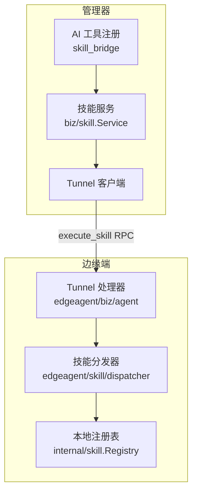
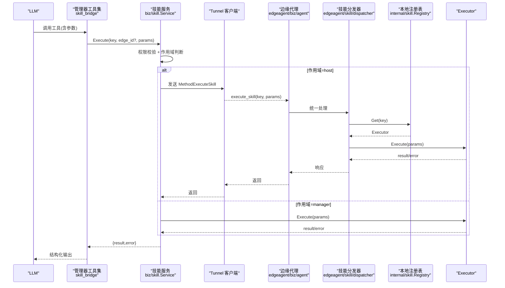
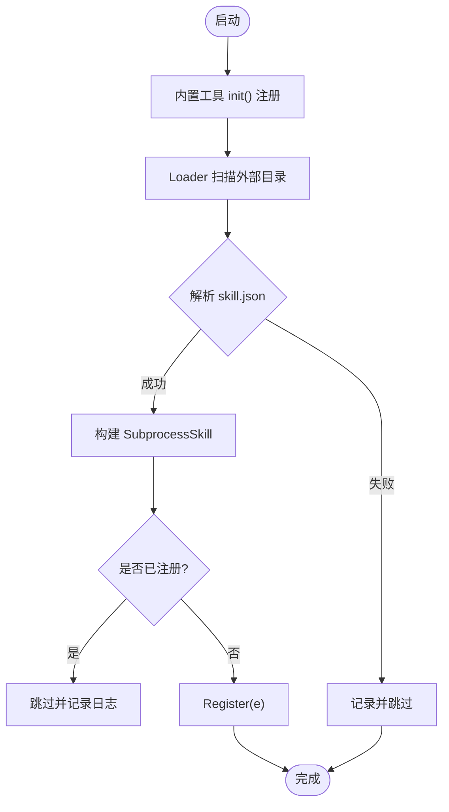
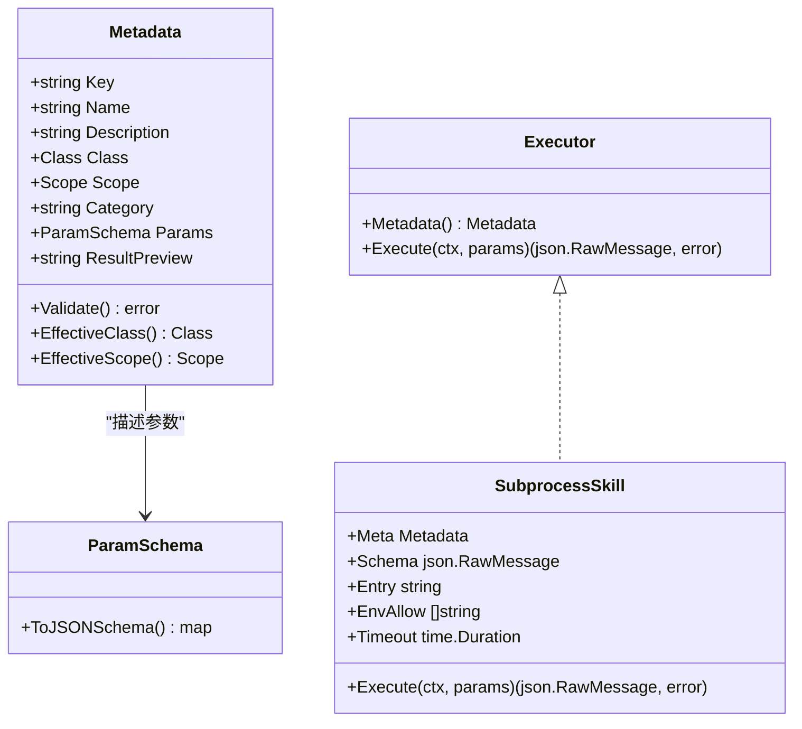
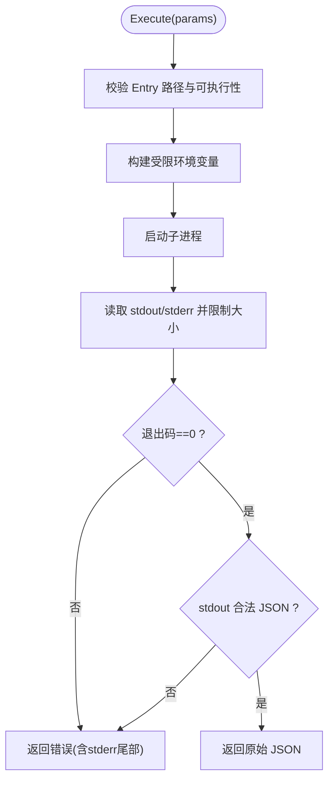
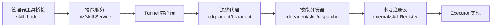

# 工具调用系统

<cite>
**本文引用的文件**
- [internal/skill/registry.go](file://internal/skill/registry.go)
- [internal/skill/types.go](file://internal/skill/types.go)
- [internal/skill/loader.go](file://internal/skill/loader.go)
- [internal/skill/subprocess.go](file://internal/skill/subprocess.go)
- [internal/skill/schema.go](file://internal/skill/schema.go)
- [internal/skill/builtin/capture_pcap.go](file://internal/skill/builtin/capture_pcap.go)
- [internal/skill/builtin/probe_http.go](file://internal/skill/builtin/probe_http.go)
- [internal/manager/biz/aiops/tools/skill_bridge.go](file://internal/manager/biz/aiops/tools/skill_bridge.go)
- [internal/manager/biz/aiops/chatruntime/skill_registry.go](file://internal/manager/biz/aiops/chatruntime/skill_registry.go)
- [internal/edgeagent/skill/dispatcher.go](file://internal/edgeagent/skill/dispatcher.go)
- [internal/manager/biz/skill/service.go](file://internal/manager/biz/skill/service.go)
- [internal/pkg/tunnel/messages.go](file://internal/pkg/tunnel/messages.go)
- [internal/edgeagent/biz/agent.go](file://internal/edgeagent/biz/agent.go)
- [cmd/ongrid-edge/main.go](file://cmd/ongrid-edge/main.go)
</cite>

## 目录
1. [简介](#简介)
2. [项目结构](#项目结构)
3. [核心组件](#核心组件)
4. [架构总览](#架构总览)
5. [详细组件分析](#详细组件分析)
6. [依赖关系分析](#依赖关系分析)
7. [性能与超时控制](#性能与超时控制)
8. [故障排查指南](#故障排查指南)
9. [结论](#结论)
10. [附录：开发指南与示例路径](#附录：开发指南与示例路径)

## 简介
本文件系统性地梳理了 OnGrid 的“工具（Skill）”调用体系，覆盖工具注册、发现、调度、参数校验、执行环境隔离、结果处理、权限控制、超时与错误传播等关键机制。该体系将设备侧能力抽象为统一的“Skill”，通过全局注册表集中管理，并在管理器与边缘端之间以统一 RPC 进行调度，同时为 LLM 工具生态提供自动化的 Schema 生成与工具暴露。

## 项目结构
- 工具核心定义与注册表位于 internal/skill 包，包含类型定义、注册表、子进程工具运行时、Schema 构建以及内置工具实现。
- 管理器侧通过 aiops/tools 下的 skill_bridge 将安全类工具桥接为 LLM 可调用的 Tool，并负责参数注入（如 device_id）、路由到服务层执行。
- 边缘端通过 edgeagent/skill 的 dispatcher 接收 execute_skill RPC，按 key 查找本地 Executor 并执行。
- 管理器与边缘端通过 tunnel 协议通信，execute_skill 是统一的技能执行入口。

**图表来源**
- [internal/manager/biz/aiops/tools/skill_bridge.go:51-75](file://internal/manager/biz/aiops/tools/skill_bridge.go#L51-L75)
- [internal/manager/biz/skill/service.go:187-223](file://internal/manager/biz/skill/service.go#L187-L223)
- [internal/pkg/tunnel/messages.go:18-44](file://internal/pkg/tunnel/messages.go#L18-L44)
- [internal/edgeagent/biz/agent.go:413-429](file://internal/edgeagent/biz/agent.go#L413-L429)
- [internal/edgeagent/skill/dispatcher.go:16-44](file://internal/edgeagent/skill/dispatcher.go#L16-L44)

**章节来源**
- [internal/skill/types.go:1-27](file://internal/skill/types.go#L1-L27)
- [internal/skill/registry.go:10-47](file://internal/skill/registry.go#L10-L47)
- [internal/pkg/tunnel/messages.go:18-44](file://internal/pkg/tunnel/messages.go#L18-L44)

## 核心组件
- 全局注册表 Registry：维护所有已注册的 Executor，支持按 Key 查询、按 Class 过滤、全量枚举。
- 工具元数据 Metadata：描述 Key、名称、描述、权限类别（safe/mutating/dangerous）、作用域（host/manager）、分类、参数 Schema 与结果预览。
- 执行器接口 Executor：每个工具一个实现，提供 Metadata 与 Execute(ctx, params)。
- 子进程工具 SubprocessSkill：以独立进程运行外部可执行程序，stdin/stdout 传输 JSON，具备环境变量白名单、超时、输出大小限制等安全与稳定性保障。
- 加载器 Loader：扫描外部技能包目录，解析 skill.json 清单，构建并注册 SubprocessSkill。
- Schema 构建：根据 ParamSchema 或 RawSchemaProvider 生成 OpenAI function-calling 兼容的 JSON Schema。
- 管理器桥接：将 safe 类工具注册为 LLM Tool，注入 device_id，封装执行结果与错误。
- 边缘分发器：统一处理 execute_skill RPC，按 key 查找并执行。

**章节来源**
- [internal/skill/registry.go:10-127](file://internal/skill/registry.go#L10-L127)
- [internal/skill/types.go:35-175](file://internal/skill/types.go#L35-L175)
- [internal/skill/subprocess.go:17-78](file://internal/skill/subprocess.go#L17-L78)
- [internal/skill/loader.go:13-74](file://internal/skill/loader.go#L13-L74)
- [internal/skill/schema.go:5-20](file://internal/skill/schema.go#L5-L20)
- [internal/manager/biz/aiops/tools/skill_bridge.go:35-75](file://internal/manager/biz/aiops/tools/skill_bridge.go#L35-L75)
- [internal/edgeagent/skill/dispatcher.go:16-44](file://internal/edgeagent/skill/dispatcher.go#L16-L44)

## 架构总览
下图展示了从管理器 AI 工具到边缘执行器的完整调用链，包括参数注入、权限校验、RPC 转发、边缘分发与结果返回。

**图表来源**
- [internal/manager/biz/aiops/tools/skill_bridge.go:151-235](file://internal/manager/biz/aiops/tools/skill_bridge.go#L151-L235)
- [internal/manager/biz/skill/service.go:187-223](file://internal/manager/biz/skill/service.go#L187-L223)
- [internal/pkg/tunnel/messages.go:18-44](file://internal/pkg/tunnel/messages.go#L18-L44)
- [internal/edgeagent/biz/agent.go:413-429](file://internal/edgeagent/biz/agent.go#L413-L429)
- [internal/edgeagent/skill/dispatcher.go:16-44](file://internal/edgeagent/skill/dispatcher.go#L16-L44)

## 详细组件分析

### 工具注册机制与发现算法
- 全局注册表在 init() 阶段由内置工具包触发 Register，生产代码使用单例 globalRegistry；并发安全通过 RWMutex 保护。
- 注册时校验 Metadata，重复 Key 会 panic（作者级错误），便于早期发现问题。
- 外部技能包通过 Loader 扫描指定目录，解析 skill.json，构建 SubprocessSkill 并注册；对重复键采用跳过策略，避免部署期间新旧清单共存导致崩溃。
- 管理器侧 chatruntime.SkillRegistry 支持从磁盘加载 SKILL.md 与插件容器，支持热重载与基于策略的工具过滤。

**图表来源**
- [internal/skill/registry.go:59-73](file://internal/skill/registry.go#L59-L73)
- [internal/skill/loader.go:112-161](file://internal/skill/loader.go#L112-L161)
- [internal/manager/biz/aiops/chatruntime/skill_registry.go:47-90](file://internal/manager/biz/aiops/chatruntime/skill_registry.go#L47-L90)

**章节来源**
- [internal/skill/registry.go:10-127](file://internal/skill/registry.go#L10-L127)
- [internal/skill/loader.go:69-161](file://internal/skill/loader.go#L69-L161)
- [internal/manager/biz/aiops/chatruntime/skill_registry.go:10-90](file://internal/manager/biz/aiops/chatruntime/skill_registry.go#L10-L90)

### 工具参数验证与 Schema 生成
- 元数据 Validate 检查 Key、Name、Description、Class、Scope、Params 类型与组合合法性。
- Schema 构建优先使用 RawSchemaProvider（用于复杂数组/嵌套对象场景），否则基于 ParamSchema 转换为 OpenAI function-calling 兼容的 JSON Schema。
- 管理器桥接时为 host 作用域工具注入 device_id 字段，确保 LLM 必须选择目标设备。

**图表来源**
- [internal/skill/types.go:99-175](file://internal/skill/types.go#L99-L175)
- [internal/skill/schema.go:5-20](file://internal/skill/schema.go#L5-L20)
- [internal/skill/subprocess.go:43-78](file://internal/skill/subprocess.go#L43-L78)

**章节来源**
- [internal/skill/types.go:127-175](file://internal/skill/types.go#L127-L175)
- [internal/skill/schema.go:5-20](file://internal/skill/schema.go#L5-L20)
- [internal/manager/biz/aiops/tools/skill_bridge.go:77-144](file://internal/manager/biz/aiops/tools/skill_bridge.go#L77-L144)

### 执行环境隔离与结果处理
- 子进程工具以独立进程运行，默认无继承环境变量，仅允许 EnvAllow 列表中的变量传入，防止泄露敏感信息。
- 输出限制：stdout 最大 16 MiB，stderr 尾部保留 4 KiB 用于诊断；非零退出码视为错误，附带 stderr 片段。
- 结果包装：管理器桥接将 result 与 error 合并为单一 JSON 对象返回给 LLM，保证模型可见的结构化输出。

**图表来源**
- [internal/skill/subprocess.go:99-172](file://internal/skill/subprocess.go#L99-L172)
- [internal/skill/subprocess.go:174-193](file://internal/skill/subprocess.go#L174-L193)
- [internal/manager/biz/aiops/tools/skill_bridge.go:218-233](file://internal/manager/biz/aiops/tools/skill_bridge.go#L218-L233)

**章节来源**
- [internal/skill/subprocess.go:17-78](file://internal/skill/subprocess.go#L17-L78)
- [internal/skill/subprocess.go:99-172](file://internal/skill/subprocess.go#L99-L172)
- [internal/manager/biz/aiops/tools/skill_bridge.go:218-233](file://internal/manager/biz/aiops/tools/skill_bridge.go#L218-L233)

### 权限控制与作用域
- 权限类别：safe（只读）、mutating（可逆修改）、dangerous（不可逆/集群影响）。基础框架仅强制类别标记，具体策略在管理器服务层实施。
- 作用域：host（在边缘执行，需指定设备/边缘 ID）、manager（在管理器进程内执行，无需设备 ID）。
- 管理器服务在执行前依据类别与调用者角色进行授权校验；host 作用域要求 EdgeID 非空。

**章节来源**
- [internal/skill/types.go:18-27](file://internal/skill/types.go#L18-L27)
- [internal/skill/types.go:47-61](file://internal/skill/types.go#L47-L61)
- [internal/manager/biz/skill/service.go:187-223](file://internal/manager/biz/skill/service.go#L187-L223)

### 内置工具与自定义工具开发
- 内置工具示例：
  - capture_pcap/get_packet_capture：网络抓包任务管理与状态查询（host 作用域，mutating/safe）。
  - probe_http：HTTP 探测（GET/HEAD），TLS 校验关闭以适配内部自签名服务（safe）。
- 自定义工具：
  - 原生 Go 工具：实现 Executor 接口，在 init() 中调用 Register。
  - 外部脚本工具：编写 skill.json 清单与可执行入口，放入 Loader 配置的目录，启动时自动发现并注册。

**章节来源**
- [internal/skill/builtin/capture_pcap.go:11-73](file://internal/skill/builtin/capture_pcap.go#L11-L73)
- [internal/skill/builtin/probe_http.go:15-120](file://internal/skill/builtin/probe_http.go#L15-L120)
- [internal/skill/loader.go:13-74](file://internal/skill/loader.go#L13-L74)

### 工具调度的端到端流程
- 管理器侧：
  - 将 safe 类工具注册为 LLM Tool，schema 中注入 device_id（host 作用域）。
  - 调用 biz/skill.Service.Execute，根据作用域决定本地执行或隧道转发。
- 边缘侧：
  - agent 注册 execute_skill 处理器，特殊键（如抓包）走专用逻辑，其余走通用分发器。
  - 分发器按 key 查找本地 Executor 并执行，返回结果或错误字符串。

**章节来源**
- [internal/manager/biz/aiops/tools/skill_bridge.go:51-75](file://internal/manager/biz/aiops/tools/skill_bridge.go#L51-L75)
- [internal/manager/biz/aiops/tools/skill_bridge.go:151-235](file://internal/manager/biz/aiops/tools/skill_bridge.go#L151-L235)
- [internal/manager/biz/skill/service.go:187-223](file://internal/manager/biz/skill/service.go#L187-L223)
- [internal/edgeagent/biz/agent.go:413-429](file://internal/edgeagent/biz/agent.go#L413-L429)
- [internal/edgeagent/skill/dispatcher.go:16-44](file://internal/edgeagent/skill/dispatcher.go#L16-L44)

## 依赖关系分析
- 管理器与边缘端通过 tunnel 协议解耦，execute_skill 作为统一入口，屏蔽底层差异。
- 注册表与加载器松耦合：内置工具通过 import 触发 init() 注册；外部工具通过配置目录扫描加载。
- 管理器工具桥接依赖全局注册表与服务层，边缘分发器依赖本地注册表，形成清晰的职责边界。

**图表来源**
- [internal/manager/biz/aiops/tools/skill_bridge.go:51-75](file://internal/manager/biz/aiops/tools/skill_bridge.go#L51-L75)
- [internal/manager/biz/skill/service.go:187-223](file://internal/manager/biz/skill/service.go#L187-L223)
- [internal/pkg/tunnel/messages.go:18-44](file://internal/pkg/tunnel/messages.go#L18-L44)
- [internal/edgeagent/biz/agent.go:413-429](file://internal/edgeagent/biz/agent.go#L413-L429)
- [internal/edgeagent/skill/dispatcher.go:16-44](file://internal/edgeagent/skill/dispatcher.go#L16-L44)
- [internal/skill/registry.go:10-47](file://internal/skill/registry.go#L10-L47)

**章节来源**
- [internal/pkg/tunnel/messages.go:18-44](file://internal/pkg/tunnel/messages.go#L18-L44)
- [internal/skill/registry.go:10-47](file://internal/skill/registry.go#L10-L47)

## 性能与超时控制
- 子进程工具默认超时 30 秒，可通过 manifest 的 timeout_seconds 调整；上下文取消会传播至子进程。
- stdout 限制 16 MiB，stderr 尾部保留 4 KiB，防止异常输出耗尽内存。
- 管理器侧对 schema 构建失败、未知 key、缺少 device_id 等情况有明确错误路径，便于快速定位问题。
- 建议：
  - 合理设置超时与输出上限，避免长耗时操作阻塞。
  - 对 host 作用域工具务必提供 device_id，减少无效重试。
  - 对危险类工具启用审批流与审计，降低误操作风险。

[本节为通用指导，不直接分析具体文件]

## 故障排查指南
- 常见错误与定位：
  - 未知技能 key：检查注册表是否包含对应 key，确认 init() 是否被引入或外部清单是否正确。
  - 缺少 device_id：host 作用域工具必须在参数中包含 device_id，管理器桥接会强制注入。
  - 子进程执行失败：查看 stderr 尾部与退出码，确认入口可执行性与环境变量白名单。
  - 权限拒绝：检查工具类别与调用者角色，mutating/dangerous 需要更高权限或审批。
- 调试建议：
  - 启用 Loader 日志，观察外部技能包加载情况。
  - 在管理器侧打印工具 schema 与执行入参，确认 LLM 传递的参数是否符合预期。
  - 在边缘侧捕获 execute_skill 请求体，核对 key 与 params。

**章节来源**
- [internal/skill/loader.go:112-161](file://internal/skill/loader.go#L112-L161)
- [internal/manager/biz/aiops/tools/skill_bridge.go:151-235](file://internal/manager/biz/aiops/tools/skill_bridge.go#L151-L235)
- [internal/skill/subprocess.go:99-172](file://internal/skill/subprocess.go#L99-L172)
- [internal/edgeagent/skill/dispatcher.go:16-44](file://internal/edgeagent/skill/dispatcher.go#L16-L44)

## 结论
OnGrid 的工具调用系统通过统一的 Skill 抽象、全局注册表与隧道 RPC，实现了跨管理器与边缘端的工具编排与执行。其设计强调安全性（权限类别、作用域、环境变量白名单、输出限制）、可扩展性（原生与外部脚本工具并存）与可观测性（审计与错误包裹）。遵循本文的开发与运维建议，可高效扩展新工具并稳定运行于生产环境。

[本节为总结，不直接分析具体文件]

## 附录：开发指南与示例路径
- 注册新工具（Go 实现）：
  - 参考内置工具实现与注册方式，在 init() 中调用 Register。
  - 示例路径：[capture_pcap 注册:16-19](file://internal/skill/builtin/capture_pcap.go#L16-L19)、[probe_http 注册:15-15](file://internal/skill/builtin/probe_http.go#L15-L15)
- 实现工具接口：
  - 实现 Executor.Metadata 与 Executor.Execute，注意参数防御性解析与错误返回。
  - 示例路径：[Executor 接口定义](file://internal/skill/types.go:190-203)
- 处理工具执行结果：
  - 管理器桥接将 result 与 error 合并为结构化 JSON，便于 LLM 消费。
  - 示例路径：[结果封装](file://internal/manager/biz/aiops/tools/skill_bridge.go:218-233)
- 外部脚本工具：
  - 编写 skill.json 清单（name、description、schema、entry、env_allow、timeout_seconds、class、category），放入 Loader 目录。
  - 示例路径：[清单结构与构建](file://internal/skill/loader.go:13-74)、[构建与校验](file://internal/skill/loader.go:176-254)
- 调试与优化：
  - 启用 Loader 日志，观察加载过程；检查子进程超时与输出限制；确认 device_id 注入与权限策略。
  - 示例路径：[子进程执行与限制](file://internal/skill/subprocess.go:99-172)、[环境变量白名单](file://internal/skill/subprocess.go:174-193)

**章节来源**
- [internal/skill/builtin/capture_pcap.go:16-19](file://internal/skill/builtin/capture_pcap.go#L16-L19)
- [internal/skill/builtin/probe_http.go:15-15](file://internal/skill/builtin/probe_http.go#L15-L15)
- [internal/skill/types.go:190-203](file://internal/skill/types.go#L190-L203)
- [internal/manager/biz/aiops/tools/skill_bridge.go:218-233](file://internal/manager/biz/aiops/tools/skill_bridge.go#L218-L233)
- [internal/skill/loader.go:13-74](file://internal/skill/loader.go#L13-L74)
- [internal/skill/loader.go:176-254](file://internal/skill/loader.go#L176-L254)
- [internal/skill/subprocess.go:99-172](file://internal/skill/subprocess.go#L99-L172)
- [internal/skill/subprocess.go:174-193](file://internal/skill/subprocess.go#L174-L193)