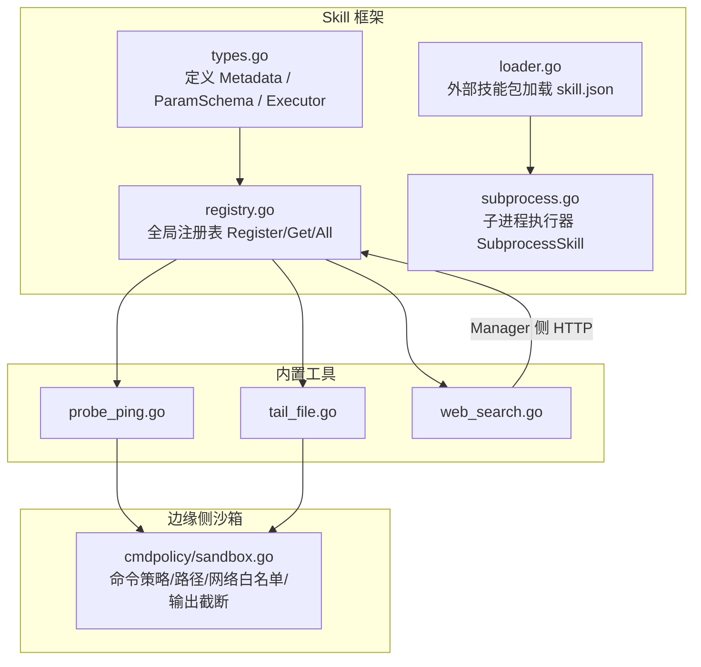
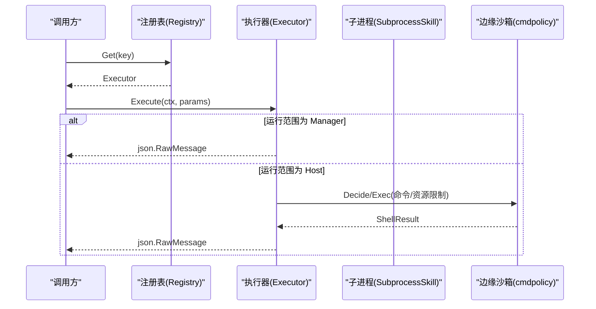
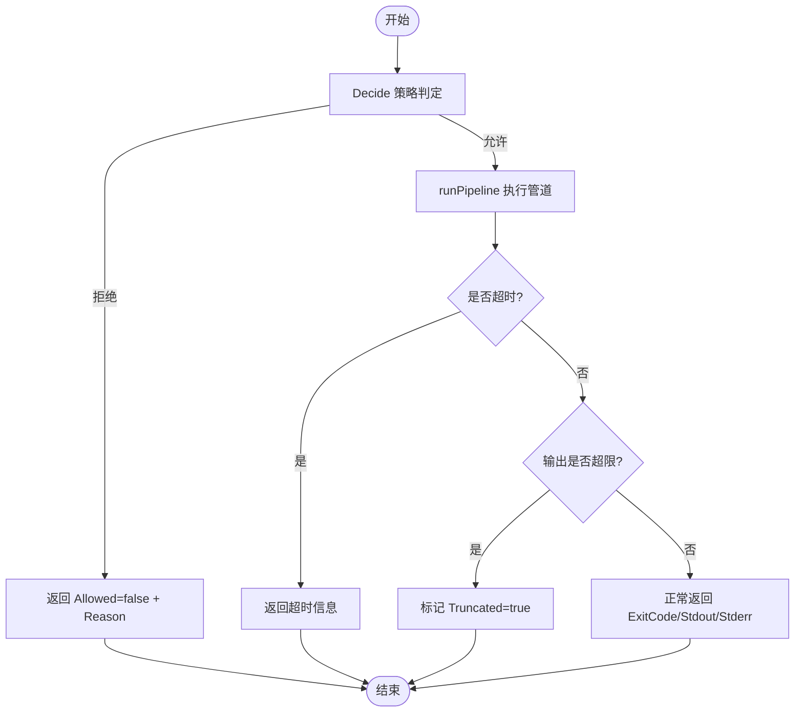
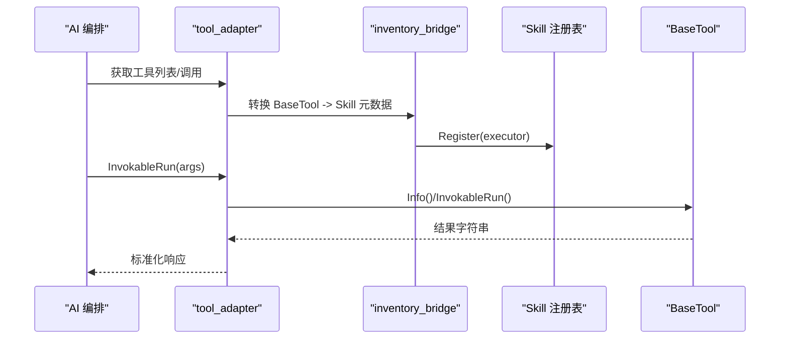
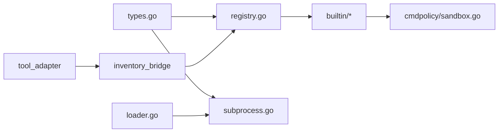

# 自定义工具开发

<cite>
**本文引用的文件**
- [internal/skill/types.go](file://internal/skill/types.go)
- [internal/skill/registry.go](file://internal/skill/registry.go)
- [internal/skill/subprocess.go](file://internal/skill/subprocess.go)
- [internal/skill/loader.go](file://internal/skill/loader.go)
- [internal/skill/builtin/probe_ping.go](file://internal/skill/builtin/probe_ping.go)
- [internal/skill/builtin/tail_file.go](file://internal/skill/builtin/tail_file.go)
- [internal/skill/builtin/web_search.go](file://internal/skill/builtin/web_search.go)
- [internal/edgeagent/cmdpolicy/sandbox.go](file://internal/edgeagent/cmdpolicy/sandbox.go)
- [internal/manager/biz/aiops/graph/tool_adapter_test.go](file://internal/manager/biz/aiops/graph/tool_adapter_test.go)
- [internal/manager/biz/knowledge/builtin_vault/diagnostics/error-rate-5xx.md](file://internal/manager/biz/knowledge/builtin_vault/diagnostics/error-rate-5xx.md)
</cite>

## 目录
1. [简介](#简介)
2. [项目结构](#项目结构)
3. [核心组件](#核心组件)
4. [架构总览](#架构总览)
5. [详细组件分析](#详细组件分析)
6. [依赖关系分析](#依赖关系分析)
7. [性能与资源限制](#性能与资源限制)
8. [故障排查指南](#故障排查指南)
9. [结论](#结论)
10. [附录：从Hello World到复杂业务工具的完整示例](#附录从hello-world到复杂业务工具的完整示例)

## 简介
本文件面向需要在系统中实现“自定义工具”的开发者，系统性说明 Tool（Skill）接口的设计、Execute 方法编写规范、参数校验与错误处理策略；介绍 BaseTool（通过适配器桥接到 Skill 体系）的使用方式与扩展点；覆盖权限控制（安全/变更/危险）、沙箱隔离与资源限制机制；并提供从简单到复杂的工具实现示例、测试调试与部署最佳实践。

## 项目结构
系统采用“Skill（能力）”框架统一封装设备侧或管理端可执行能力。每个 Skill 包含元数据（名称、描述、参数 Schema、权限类别、运行范围等）和 Executor（执行器）。框架自动推导 LLM 工具注册、HTTP 路由、UI 表单、权限门控与审计日志。新增 Skill 只需实现一个文件并在初始化时注册。

图表来源
- [internal/skill/types.go:99-203](file://internal/skill/types.go#L99-L203)
- [internal/skill/registry.go:10-54](file://internal/skill/registry.go#L10-L54)
- [internal/skill/subprocess.go:30-78](file://internal/skill/subprocess.go#L30-L78)
- [internal/skill/loader.go:13-53](file://internal/skill/loader.go#L13-L53)
- [internal/skill/builtin/probe_ping.go:14-43](file://internal/skill/builtin/probe_ping.go#L14-L43)
- [internal/skill/builtin/tail_file.go:15-45](file://internal/skill/builtin/tail_file.go#L15-L45)
- [internal/skill/builtin/web_search.go:150-195](file://internal/skill/builtin/web_search.go#L150-L195)
- [internal/edgeagent/cmdpolicy/sandbox.go:17-74](file://internal/edgeagent/cmdpolicy/sandbox.go#L17-L74)

章节来源
- [internal/skill/types.go:1-27](file://internal/skill/types.go#L1-L27)
- [internal/skill/registry.go:10-54](file://internal/skill/registry.go#L10-L54)

## 核心组件
- 元数据与参数模型：Metadata、ParamSchema、ParamDef 用于声明工具的名称、描述、权限类别、运行范围、分类、输入参数与结果预览。Validate 在注册时进行强校验，确保 Key 命名规范、Class/Scope 合法、参数类型与枚举正确。
- 执行器接口：Executor 要求实现 Metadata() 与 Execute(ctx, params)。Execute 接收已按 Schema 校验过的 JSON 参数，但仍需做防御性解析与语义校验。
- 注册表：全局 Registry 提供 Register/Get/All/AllByClass，支持并发读取与启动期注册。重复 Key 或无效元数据会触发 panic，便于早期暴露作者错误。
- 子进程执行器：SubprocessSkill 将外部可执行程序作为 Skill 体，stdin/stdout 交换 JSON，强制 ScopeManager，限制环境变量白名单，设置超时与输出上限。
- 外部技能加载：Loader 扫描指定目录下的 skill.json，构建并注册 SubprocessSkill，严格校验 entry 路径位于允许目录内，避免逃逸。

章节来源
- [internal/skill/types.go:63-175](file://internal/skill/types.go#L63-L175)
- [internal/skill/types.go:190-203](file://internal/skill/types.go#L190-L203)
- [internal/skill/registry.go:26-54](file://internal/skill/registry.go#L26-L54)
- [internal/skill/subprocess.go:30-78](file://internal/skill/subprocess.go#L30-L78)
- [internal/skill/loader.go:69-160](file://internal/skill/loader.go#L69-L160)

## 架构总览
下图展示从调用方到具体执行的端到端流程，涵盖 Manager 侧与 Edge 侧两种运行范围，以及权限类别对调度的影响。

图表来源
- [internal/skill/registry.go:35-54](file://internal/skill/registry.go#L35-L54)
- [internal/skill/types.go:47-61](file://internal/skill/types.go#L47-L61)
- [internal/skill/subprocess.go:99-172](file://internal/skill/subprocess.go#L99-L172)
- [internal/edgeagent/cmdpolicy/sandbox.go:76-188](file://internal/edgeagent/cmdpolicy/sandbox.go#L76-L188)

## 详细组件分析

### Tool（Skill）接口设计与 Execute 编写规范
- 元数据必须包含稳定 Key（lower_snake）、人类可读 Name、清晰 Description、明确的 Class（safe/mutating/dangerous）、Scope（host/manager）、Category、Params（ParamSchema）与 ResultPreview。
- Execute 应：
  - 防御性解析 params（即使已通过 Schema 校验），对必填字段进行空值检查。
  - 对数值型参数进行边界约束（如最大请求数、超时上限）。
  - 使用 context 控制超时与取消。
  - 返回结构化 JSON（json.RawMessage），失败时返回 Go error。
  - 对于“未配置/不可达”等可恢复场景，优先以结构化 envelope（如 skipped_reason）返回，而非直接抛错，以便上层提示用户修复。

章节来源
- [internal/skill/types.go:99-175](file://internal/skill/types.go#L99-L175)
- [internal/skill/types.go:190-203](file://internal/skill/types.go#L190-L203)
- [internal/skill/builtin/web_search.go:225-283](file://internal/skill/builtin/web_search.go#L225-L283)

### 权限控制（安全/变更/危险）
- ClassSafe：只读、无副作用（探测、读取文件、查看状态）。
- ClassMutating：可修改边缘状态但可逆（重启服务、杀进程）。
- ClassDangerous：不可逆或影响集群（rm、reboot、drop table）。
- 管理器侧根据 Class 过滤可用工具（仅 Safe 可直接调用；Mutating/Dangerous 需审批流）。

章节来源
- [internal/skill/types.go:18-26](file://internal/skill/types.go#L18-L26)
- [internal/skill/types.go:35-45](file://internal/skill/types.go#L35-L45)
- [internal/skill/registry.go:49-54](file://internal/skill/registry.go#L49-L54)

### 沙箱隔离与资源限制（Edge 侧）
- 命令白名单与路径校验：所有 argv 中以“/”开头的路径均经 PathValidator 校验，防止越权访问。
- 网络目标白名单：对 ClassNetwork 的二进制（curl/wget/ping/dig 等）提取目标主机，必须在 allowlist 中。
- 管道执行：支持多段命令管道，每段独立进程，标准输出/错误分别捕获并按策略上限截断。
- 超时与输出上限：整体执行受 Policy.Timeout 限制；stdout/stderr 有 StdoutCap/StderrCap，超出后 Truncated=true。
- 直通模式：ExecRaw 绕过策略检查，仅限管理员授权场景，仍保留超时与输出上限保护。

图表来源
- [internal/edgeagent/cmdpolicy/sandbox.go:76-188](file://internal/edgeagent/cmdpolicy/sandbox.go#L76-L188)
- [internal/edgeagent/cmdpolicy/sandbox.go:260-342](file://internal/edgeagent/cmdpolicy/sandbox.go#L260-L342)

章节来源
- [internal/edgeagent/cmdpolicy/sandbox.go:17-74](file://internal/edgeagent/cmdpolicy/sandbox.go#L17-L74)
- [internal/edgeagent/cmdpolicy/sandbox.go:140-188](file://internal/edgeagent/cmdpolicy/sandbox.go#L140-L188)
- [internal/edgeagent/cmdpolicy/sandbox.go:260-342](file://internal/edgeagent/cmdpolicy/sandbox.go#L260-L342)

### BaseTool 与适配器（Manager 侧）
- BaseTool 是 Manager 侧的工具抽象，可通过 WrapBaseTool 包装为可持久化、带指标、带租户绑定的可调用工具。
- inventory_bridge 将 BaseTools 映射为 Skill 元数据并注册到全局注册表，从而统一接入 Skill 调度与权限控制。
- 适配器层负责：
  - 合并 WhenToUse 到描述中，生成 ParamsOneOf。
  - 记录工具调用开始/结束事件，便于审计与追踪。
  - 将 BaseTool 的 Class（read/write）映射为 Skill 的 Class（safe/mutating）。

图表来源
- [internal/manager/biz/aiops/graph/tool_adapter_test.go:75-96](file://internal/manager/biz/aiops/graph/tool_adapter_test.go#L75-L96)
- [internal/manager/biz/knowledge/builtin_vault/diagnostics/error-rate-5xx.md:56-89](file://internal/manager/biz/knowledge/builtin_vault/diagnostics/error-rate-5xx.md#L56-L89)

章节来源
- [internal/manager/biz/aiops/graph/tool_adapter_test.go:75-96](file://internal/manager/biz/aiops/graph/tool_adapter_test.go#L75-L96)
- [internal/manager/biz/knowledge/builtin_vault/diagnostics/error-rate-5xx.md:56-89](file://internal/manager/biz/knowledge/builtin_vault/diagnostics/error-rate-5xx.md#L56-L89)

### 内置工具示例分析
- Ping 探测（host_probe_ping）：
  - 使用受限参数（count、timeout_ms）与上下文超时，避免长时间占用。
  - 返回结构化结果（ok、exit_code、duration_ms、stdout、stderr、error）。
- 文件尾部读取（host_tail_file）：
  - 强制绝对路径且禁止“..”，防止路径穿越。
  - 支持 MaxBytes 预算与 truncated 标志，避免大文件导致内存膨胀。
- 联网搜索（web_search）：
  - 支持多个后端（SearXNG/Tavily/Brave），默认走自托管 SearXNG。
  - 对未配置/不可达情况返回 skipped_reason 信封，引导用户修复配置。
  - 参数校验与边界限制（max_results 1~10）。

章节来源
- [internal/skill/builtin/probe_ping.go:14-125](file://internal/skill/builtin/probe_ping.go#L14-L125)
- [internal/skill/builtin/tail_file.go:15-133](file://internal/skill/builtin/tail_file.go#L15-L133)
- [internal/skill/builtin/web_search.go:150-283](file://internal/skill/builtin/web_search.go#L150-L283)

## 依赖关系分析
- Skill 框架内部依赖：
  - types.go 定义核心数据结构与校验逻辑。
  - registry.go 提供线程安全的注册与查询。
  - subprocess.go 提供外部二进制执行能力，配合 loader.go 的安全加载。
- 与边缘侧集成：
  - cmdpolicy/sandbox.go 提供命令级沙箱，保障路径、网络与资源限制。
- 与管理器侧集成：
  - tool_adapter 与 inventory_bridge 将 BaseTool 适配为 Skill，纳入统一权限与调度。

图表来源
- [internal/skill/types.go:99-203](file://internal/skill/types.go#L99-L203)
- [internal/skill/registry.go:10-54](file://internal/skill/registry.go#L10-L54)
- [internal/skill/subprocess.go:30-78](file://internal/skill/subprocess.go#L30-L78)
- [internal/skill/loader.go:69-160](file://internal/skill/loader.go#L69-L160)
- [internal/edgeagent/cmdpolicy/sandbox.go:17-74](file://internal/edgeagent/cmdpolicy/sandbox.go#L17-L74)

章节来源
- [internal/skill/types.go:99-203](file://internal/skill/types.go#L99-L203)
- [internal/skill/registry.go:10-54](file://internal/skill/registry.go#L10-L54)
- [internal/skill/subprocess.go:30-78](file://internal/skill/subprocess.go#L30-L78)
- [internal/skill/loader.go:69-160](file://internal/skill/loader.go#L69-L160)
- [internal/edgeagent/cmdpolicy/sandbox.go:17-74](file://internal/edgeagent/cmdpolicy/sandbox.go#L17-L74)

## 性能与资源限制
- 子进程输出上限：stdout 默认 16MiB，stderr 尾部分 4KiB，防止异常输出撑爆内存。
- 默认超时：子进程默认 30s，可通过 manifest 或策略配置。
- 管道输出截断：边缘沙箱支持 stdout/stderr 上限，Truncated 标志提示调用方。
- 参数边界：内置工具对 count、max_results、timeout 等进行合理上限限制，避免滥用。

章节来源
- [internal/skill/subprocess.go:17-28](file://internal/skill/subprocess.go#L17-L28)
- [internal/skill/subprocess.go:145-172](file://internal/skill/subprocess.go#L145-L172)
- [internal/edgeagent/cmdpolicy/sandbox.go:140-188](file://internal/edgeagent/cmdpolicy/sandbox.go#L140-L188)
- [internal/skill/builtin/probe_ping.go:60-99](file://internal/skill/builtin/probe_ping.go#L60-L99)
- [internal/skill/builtin/web_search.go:246-283](file://internal/skill/builtin/web_search.go#L246-L283)

## 故障排查指南
- 常见错误定位：
  - 子进程执行失败：检查 entry 是否为绝对路径、是否存在、是否可执行；确认 stderr 尾部信息。
  - 参数校验失败：核对必填字段、类型与枚举；必要时增加更严格的边界检查。
  - 网络不可达：SearXNG 未启动或端口不通时，web_search 会返回 skipped_reason，指导修复。
  - 沙箱拒绝：检查命令是否在白名单、路径是否合法、网络目标是否在 allowlist。
- 建议步骤：
  - 先复现最小用例，逐步缩小问题范围。
  - 启用日志与审计，关注工具调用开始/结束记录。
  - 对超时与输出截断场景，调整超时与上限，或拆分任务。

章节来源
- [internal/skill/subprocess.go:112-172](file://internal/skill/subprocess.go#L112-L172)
- [internal/skill/builtin/web_search.go:294-374](file://internal/skill/builtin/web_search.go#L294-L374)
- [internal/edgeagent/cmdpolicy/sandbox.go:76-188](file://internal/edgeagent/cmdpolicy/sandbox.go#L76-L188)
- [internal/manager/biz/knowledge/builtin_vault/diagnostics/error-rate-5xx.md:56-89](file://internal/manager/biz/knowledge/builtin_vault/diagnostics/error-rate-5xx.md#L56-L89)

## 结论
本框架通过统一的 Skill 接口与注册表，结合权限类别、沙箱隔离与资源限制，提供了安全可控、可扩展的工具生态。开发者只需实现 Executor 并声明清晰的元数据，即可快速接入 LLM 工具链与 UI。借助 BaseTool 适配器，现有 Manager 侧工具也能无缝融入该体系。建议在开发过程中重视参数校验、错误处理与资源限制，并通过测试与日志完善可观测性。

## 附录：从Hello World到复杂业务工具的完整示例

### Hello World（纯 Go 工具）
- 目标：实现一个最简单的只读工具，返回固定结果。
- 步骤：
  - 实现 Executor 接口：Metadata() 返回 Key/Name/Description/Class/Params；Execute() 解析参数并返回 JSON。
  - 在 init() 中调用 Register 完成注册。
  - 验证：通过 All() 枚举工具，或通过 HTTP/LLM 调用入口触发。
- 参考实现：
  - [internal/skill/builtin/probe_ping.go:14-43](file://internal/skill/builtin/probe_ping.go#L14-L43)
  - [internal/skill/builtin/tail_file.go:15-45](file://internal/skill/builtin/tail_file.go#L15-L45)

### 子进程工具（外部脚本/二进制）
- 目标：将外部可执行程序作为 Skill，stdin/stdout 交换 JSON。
- 步骤：
  - 编写 skill.json（name/description/schema/entry/env_allow/timeout_seconds/class/category）。
  - Loader 扫描并构建 SubprocessSkill，严格校验 entry 路径在允许目录内。
  - 执行时注入白名单环境变量，限制超时与输出大小。
- 参考实现：
  - [internal/skill/loader.go:13-53](file://internal/skill/loader.go#L13-L53)
  - [internal/skill/loader.go:176-254](file://internal/skill/loader.go#L176-L254)
  - [internal/skill/subprocess.go:99-172](file://internal/skill/subprocess.go#L99-L172)

### 复杂业务工具（多后端、配置驱动）
- 目标：实现类似 web_search 的多后端工具，支持运行时配置与优雅降级。
- 步骤：
  - 定义 WebSearchConfigResolver 接口，注入 provider、API key、endpoint。
  - Execute 中根据 provider 选择后端，处理不可达或未配置场景，返回 skipped_reason。
  - 参数校验与边界限制（如 max_results）。
- 参考实现：
  - [internal/skill/builtin/web_search.go:48-87](file://internal/skill/builtin/web_search.go#L48-L87)
  - [internal/skill/builtin/web_search.go:150-283](file://internal/skill/builtin/web_search.go#L150-L283)
  - [internal/skill/builtin/web_search.go:294-374](file://internal/skill/builtin/web_search.go#L294-L374)

### 测试与调试
- 单元测试：
  - 构造 RegistryForTest，注册待测 Executor，验证注册行为与错误处理。
  - 对 Execute 的参数校验、边界条件、超时与错误分支进行覆盖。
- 集成测试：
  - 通过 tool_adapter 包装 BaseTool，验证 Info/InvokableRun 的行为与持久化记录。
- 调试技巧：
  - 关注 stderr 尾部信息与 Truncated 标志。
  - 对网络类工具，检查后端可达性与 API key 配置。

章节来源
- [internal/skill/registry.go:121-127](file://internal/skill/registry.go#L121-L127)
- [internal/manager/biz/aiops/graph/tool_adapter_test.go:75-96](file://internal/manager/biz/aiops/graph/tool_adapter_test.go#L75-L96)
- [internal/skill/subprocess.go:112-172](file://internal/skill/subprocess.go#L112-L172)

### 部署最佳实践
- 外部技能包：
  - 将 skill.json 与可执行文件放在允许的目录下，确保 entry 为绝对路径且未被 symlink 逃逸。
  - 明确 env_allow，仅放行必要的环境变量。
- 权限与审批：
  - 为 mutating/dangerous 工具配置审批流，避免误操作。
- 监控与审计：
  - 利用工具调用开始/结束记录与指标，观察调用量与失败率。
  - 对输出截断与超时场景进行告警。

章节来源
- [internal/skill/loader.go:69-160](file://internal/skill/loader.go#L69-L160)
- [internal/skill/subprocess.go:174-193](file://internal/skill/subprocess.go#L174-L193)
- [internal/manager/biz/aiops/graph/tool_adapter_test.go:198-216](file://internal/manager/biz/aiops/graph/tool_adapter_test.go#L198-L216)