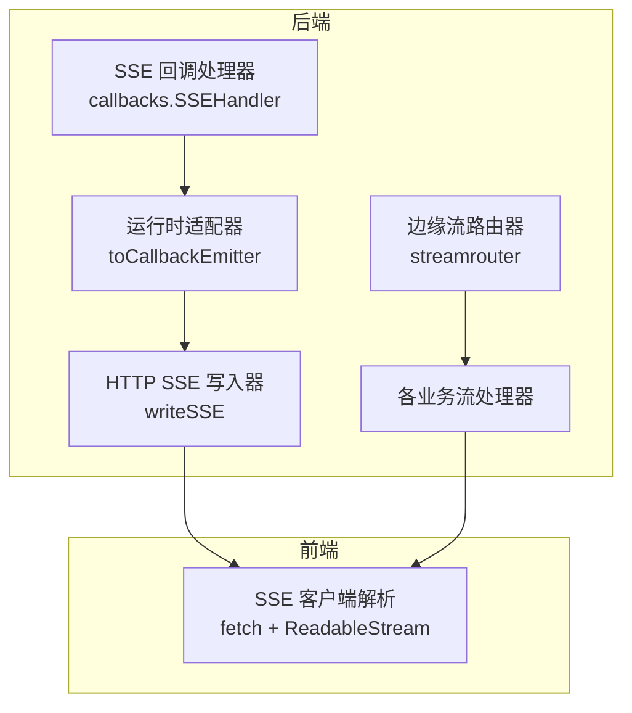
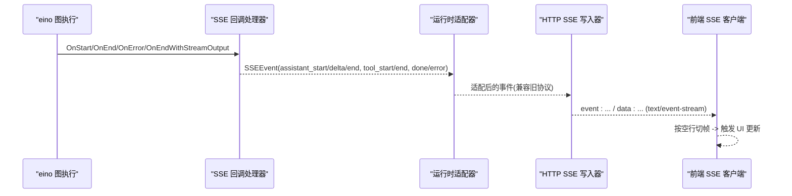
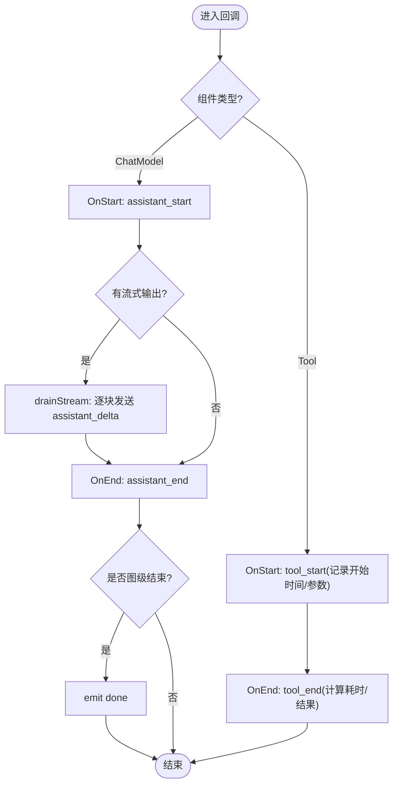
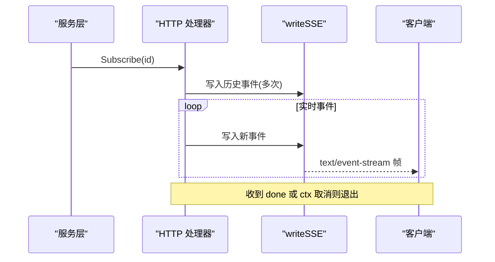
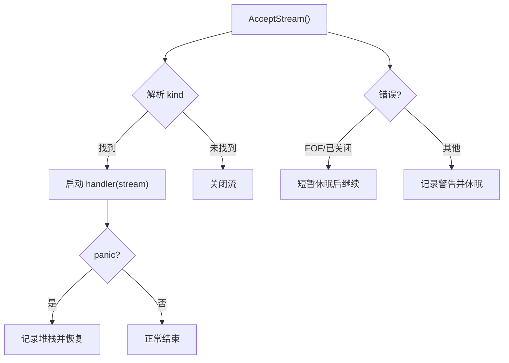
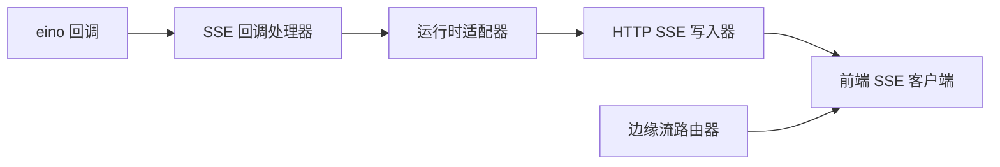

# 流式事件处理

<cite>
**本文引用的文件**
- [sse.go](file://internal/manager/biz/aiops/graph/callbacks/sse.go)
- [runtime.go](file://internal/manager/biz/aiops/chatruntime/runtime.go)
- [http.go](file://internal/manager/server/operatorrun/http.go)
- [router.go](file://internal/edgeagent/streamrouter/router.go)
- [chat.ts](file://web/src/api/chat.ts)
</cite>

## 目录
1. [简介](#简介)
2. [项目结构](#项目结构)
3. [核心组件](#核心组件)
4. [架构总览](#架构总览)
5. [详细组件分析](#详细组件分析)
6. [依赖关系分析](#依赖关系分析)
7. [性能考量](#性能考量)
8. [故障排查指南](#故障排查指南)
9. [结论](#结论)
10. [附录](#附录)

## 简介
本文件面向“流式事件处理”主题，围绕 SSE（Server-Sent Events）通信机制、事件类型定义与分发流程、实时事件生命周期、事件过滤与客户端连接管理、序列化格式、错误处理与重连策略，以及前端事件监听与 UI 更新进行系统化说明。文档同时给出具体代码路径，便于读者在仓库中快速定位实现细节。

## 项目结构
本项目在后端通过回调处理器将图执行过程中的模型调用、工具调用等阶段转化为统一的事件帧，并通过 HTTP SSE 通道推送给前端；边缘侧提供通用的流式路由以接收并分派不同种类的流。前端使用 Fetch + ReadableStream 解析 SSE 帧，驱动 UI 增量更新。

**图示来源**
- [sse.go:149-188](file://internal/manager/biz/aiops/graph/callbacks/sse.go#L149-L188)
- [runtime.go:1045-1117](file://internal/manager/biz/aiops/chatruntime/runtime.go#L1045-L1117)
- [http.go:210-224](file://internal/manager/server/operatorrun/http.go#L210-L224)
- [router.go:22-66](file://internal/edgeagent/streamrouter/router.go#L22-L66)
- [chat.ts:275-318](file://web/src/api/chat.ts#L275-L318)

**章节来源**
- [sse.go:149-188](file://internal/manager/biz/aiops/graph/callbacks/sse.go#L149-L188)
- [runtime.go:1045-1117](file://internal/manager/biz/aiops/chatruntime/runtime.go#L1045-L1117)
- [http.go:210-224](file://internal/manager/server/operatorrun/http.go#L210-L224)
- [router.go:22-66](file://internal/edgeagent/streamrouter/router.go#L22-L66)
- [chat.ts:275-318](file://web/src/api/chat.ts#L275-L318)

## 核心组件
- SSE 回调处理器：将 eino 图回调转换为统一事件帧，负责迭代计数、工具生命周期追踪、流式内容切片转发、完成/错误帧生成。
- 运行时适配器：将内部事件模型映射到上游历史/持久化链所需的回调事件，屏蔽新旧事件名差异，并对部分事件做降级或丢弃。
- HTTP SSE 写入器：将事件序列化为标准 SSE 文本帧（event/data），并刷新响应。
- 边缘流路由器：统一的 AcceptStream 循环，按 kind 路由到对应处理器，具备 panic 保护与重试退避。
- 前端 SSE 客户端：基于 fetch 的 ReadableStream 读取并按空行分割帧，触发回调处理。

**章节来源**
- [sse.go:16-147](file://internal/manager/biz/aiops/graph/callbacks/sse.go#L16-L147)
- [runtime.go:1045-1117](file://internal/manager/biz/aiops/chatruntime/runtime.go#L1045-L1117)
- [http.go:210-224](file://internal/manager/server/operatorrun/http.go#L210-L224)
- [router.go:22-66](file://internal/edgeagent/streamrouter/router.go#L22-L66)
- [chat.ts:275-318](file://web/src/api/chat.ts#L275-L318)

## 架构总览
下图展示了从图执行回调到前端渲染的端到端流程，包括事件类型转换、SSE 帧序列化与前端解析。

**图示来源**
- [sse.go:235-440](file://internal/manager/biz/aiops/graph/callbacks/sse.go#L235-L440)
- [runtime.go:1045-1117](file://internal/manager/biz/aiops/chatruntime/runtime.go#L1045-L1117)
- [http.go:107-150](file://internal/manager/server/operatorrun/http.go#L107-L150)
- [chat.ts:275-318](file://web/src/api/chat.ts#L275-L318)

## 详细组件分析

### SSE 回调处理器（SSEHandler）
- 职责
  - 监听 ChatModel 与 Tool 的生命周期回调，输出 assistant_start/delta/end、tool_start/end、done、error、task_notification 等事件。
  - 维护迭代计数与工具起止时间，计算耗时。
  - 对 ChatModel 的流式输出进行切片转发，产生 token-level 增量事件。
- 并发与顺序性
  - 单图运行内 emitter 调用顺序受控；工具并行时事件可能交错，迭代计数使用原子变量保证一致性。
  - 要求上层 emitter 实现线程安全（HTTP 写入器串行于响应 goroutine）。
- 关键行为
  - OnStart：为 ChatModel 发出 assistant_start；为 Tool 记录开始时间与参数并发出 tool_start。
  - OnEnd：为 ChatModel 发出 assistant_end（含完整内容与待执行工具数）；为 Tool 发出 tool_end（含耗时与结果）；图级 OnEnd 发出 done。
  - OnError：Tool 错误标记为 error/timeout；顶层错误发出 error 帧。
  - OnEndWithStreamOutput：异步拉取流式输出，非空内容片段转为 assistant_delta。

**图示来源**
- [sse.go:235-440](file://internal/manager/biz/aiops/graph/callbacks/sse.go#L235-L440)

**章节来源**
- [sse.go:16-147](file://internal/manager/biz/aiops/graph/callbacks/sse.go#L16-L147)
- [sse.go:235-440](file://internal/manager/biz/aiops/graph/callbacks/sse.go#L235-L440)

### 运行时适配器（toCallbackEmitter）
- 职责
  - 将 callbacks 层事件映射为 chatruntime 内部事件模型，保持与旧版 SPA 的兼容性。
  - 对 assistant_start 与 assistant_delta 做降级处理（当前不向前端暴露），避免空气泡与未就绪特性。
  - 将 tool_start/tool_end、error 等事件透传并填充字段。
- 关键点
  - 忽略空的 assistant_start/delta，避免前端误渲染。
  - 忽略图级 done 的空负载，由上层单独发出带 Reply 的完成事件，避免重复。

**章节来源**
- [runtime.go:1045-1117](file://internal/manager/biz/aiops/chatruntime/runtime.go#L1045-L1117)

### HTTP SSE 写入器（writeSSE）
- 职责
  - 将事件名称与 JSON 数据编码为标准 SSE 帧（event/data），设置必要响应头并 flush。
- 错误处理
  - 编码失败时返回最小错误体，确保连接不断开。
- 使用场景
  - 操作符运行事件流订阅接口，先回放历史事件，再持续推送新事件，遇到 done 或上下文取消即关闭。

**图示来源**
- [http.go:107-150](file://internal/manager/server/operatorrun/http.go#L107-L150)
- [http.go:210-224](file://internal/manager/server/operatorrun/http.go#L210-L224)

**章节来源**
- [http.go:107-150](file://internal/manager/server/operatorrun/http.go#L107-L150)
- [http.go:210-224](file://internal/manager/server/operatorrun/http.go#L210-L224)

### 边缘流路由器（streamrouter）
- 职责
  - 单一 AcceptStream 循环，按流的元信息 kind 路由到对应处理器；无匹配则关闭流。
  - 对异常进行指数/固定退避重试，panic 保护并记录堆栈。
- 适用场景
  - 边缘侧通用流接入点，支持多种自定义流协议扩展。

**图示来源**
- [router.go:22-66](file://internal/edgeagent/streamrouter/router.go#L22-L66)
- [router.go:68-79](file://internal/edgeagent/streamrouter/router.go#L68-L79)

**章节来源**
- [router.go:22-66](file://internal/edgeagent/streamrouter/router.go#L22-L66)
- [router.go:68-79](file://internal/edgeagent/streamrouter/router.go#L68-L79)

### 前端 SSE 客户端（chat.ts）
- 职责
  - 使用 fetch 发起请求，获取 ReadableStream，按空行分隔解析 SSE 帧，调用回调处理。
- 用户体验优化
  - 增量拼接缓冲区，避免频繁分配。
  - 优雅关闭时 flush 剩余帧，确保最后一批数据被处理。
- 错误处理
  - 非 2xx 响应时尝试解析错误体并抛出结构化错误。

**章节来源**
- [chat.ts:275-318](file://web/src/api/chat.ts#L275-L318)

## 依赖关系分析
- SSE 回调处理器依赖 eino 回调体系，产出统一事件；运行时适配器将其映射为内部事件；HTTP 写入器负责网络序列化；前端消费标准 SSE。
- 边缘流路由器独立于 HTTP SSE，用于边缘侧自定义流协议的分发。

**图示来源**
- [sse.go:149-188](file://internal/manager/biz/aiops/graph/callbacks/sse.go#L149-L188)
- [runtime.go:1045-1117](file://internal/manager/biz/aiops/chatruntime/runtime.go#L1045-L1117)
- [http.go:210-224](file://internal/manager/server/operatorrun/http.go#L210-L224)
- [router.go:22-66](file://internal/edgeagent/streamrouter/router.go#L22-L66)
- [chat.ts:275-318](file://web/src/api/chat.ts#L275-L318)

**章节来源**
- [sse.go:149-188](file://internal/manager/biz/aiops/graph/callbacks/sse.go#L149-L188)
- [runtime.go:1045-1117](file://internal/manager/biz/aiops/chatruntime/runtime.go#L1045-L1117)
- [http.go:210-224](file://internal/manager/server/operatorrun/http.go#L210-L224)
- [router.go:22-66](file://internal/edgeagent/streamrouter/router.go#L22-L66)
- [chat.ts:275-318](file://web/src/api/chat.ts#L275-L318)

## 性能考量
- 流式输出零拷贝：SSE 处理器直接转发非空内容片段，减少中间对象创建。
- 并发安全：迭代计数使用原子变量；工具起止时间通过互斥锁保护。
- 网络 I/O：HTTP 写入器每次写后立即 flush，降低首包延迟；前端按空行切帧，避免阻塞。
- 资源回收：流式输出读取完成后显式关闭，释放底层资源。

[本节为通用指导，无需特定文件引用]

## 故障排查指南
- 常见问题
  - 前端未收到事件：检查服务端是否正确设置 Content-Type 为 text/event-stream，并确保 flusher.Flush 被调用。
  - 事件乱序或丢失：确认工具并行时的事件顺序由上层保证；必要时在前端对事件排序。
  - 连接断开：边缘流路由器对 EOF/已关闭错误会休眠重试；HTTP 层需关注客户端超时与代理限制。
- 定位方法
  - 查看 SSE 回调处理器日志与错误分支（如超时判定、错误帧）。
  - 检查运行时适配器是否因兼容策略丢弃了某些事件。
  - 前端控制台观察 fetch 错误与帧解析情况。

**章节来源**
- [sse.go:346-387](file://internal/manager/biz/aiops/graph/callbacks/sse.go#L346-L387)
- [runtime.go:1045-1117](file://internal/manager/biz/aiops/chatruntime/runtime.go#L1045-L1117)
- [http.go:210-224](file://internal/manager/server/operatorrun/http.go#L210-L224)
- [router.go:30-66](file://internal/edgeagent/streamrouter/router.go#L30-L66)

## 结论
该流式事件处理方案通过统一的回调处理器与适配器，将复杂的图执行过程抽象为标准事件帧，并以轻量级的 SSE 协议推送到前端。其设计兼顾了向后兼容、可扩展性与性能，适合在 AI 助手、操作工具运行、边缘流等多种场景中复用。

[本节为总结，无需特定文件引用]

## 附录

### 事件类型与载荷速查
- assistant_start：表示一次模型回复的开始，携带迭代序号。
- assistant_delta：增量内容片段，用于 token-level 流式展示。
- assistant_end：完整回复内容、待执行工具数量、创建时间等。
- tool_start / tool_end：工具调用的起止，包含参数、状态、耗时、结果或错误。
- done：图级成功完成，携带迭代总数。
- error：不可恢复错误，携带消息与可选代码。
- task_notification：后台子任务完成通知，包含任务 ID、状态、摘要、结果或错误、用量。

**章节来源**
- [sse.go:16-147](file://internal/manager/biz/aiops/graph/callbacks/sse.go#L16-L147)

### 如何发送流式事件（示例路径）
- 后端发送 SSE 帧：参考 HTTP 写入器实现。
- 将图回调转为事件：参考 SSE 回调处理器。
- 适配内部事件：参考运行时适配器。

**章节来源**
- [http.go:210-224](file://internal/manager/server/operatorrun/http.go#L210-L224)
- [sse.go:235-440](file://internal/manager/biz/aiops/graph/callbacks/sse.go#L235-L440)
- [runtime.go:1045-1117](file://internal/manager/biz/aiops/chatruntime/runtime.go#L1045-L1117)

### 如何处理客户端连接与维护事件队列（示例路径）
- 订阅与回放历史事件：参考事件流接口。
- 边缘流接入与路由：参考流路由器。

**章节来源**
- [http.go:107-150](file://internal/manager/server/operatorrun/http.go#L107-L150)
- [router.go:22-66](file://internal/edgeagent/streamrouter/router.go#L22-L66)

### 如何实现自定义事件类型与扩展处理逻辑（示例路径）
- 新增事件类型：在事件枚举处添加新类型，并在处理器中增加分支。
- 扩展适配器：在运行时适配器中添加映射逻辑，保持与前端兼容。
- 前端解析：在前端回调中处理新事件类型，更新 UI。

**章节来源**
- [sse.go:16-147](file://internal/manager/biz/aiops/graph/callbacks/sse.go#L16-L147)
- [runtime.go:1045-1117](file://internal/manager/biz/aiops/chatruntime/runtime.go#L1045-L1117)
- [chat.ts:275-318](file://web/src/api/chat.ts#L275-L318)