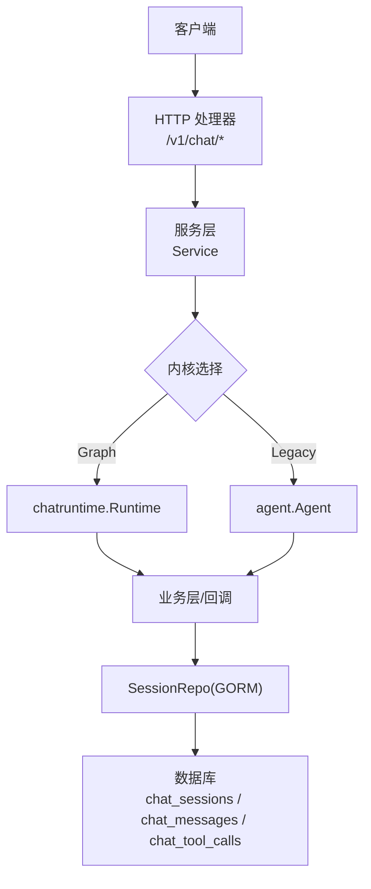
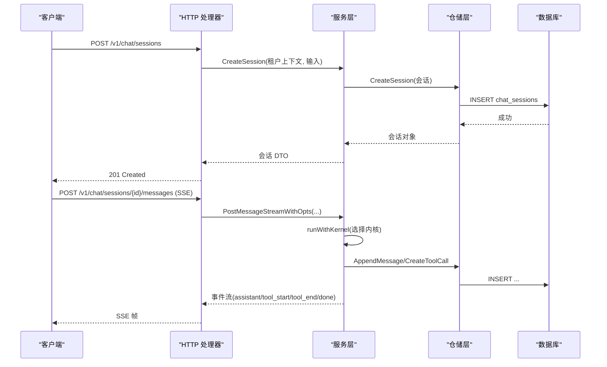
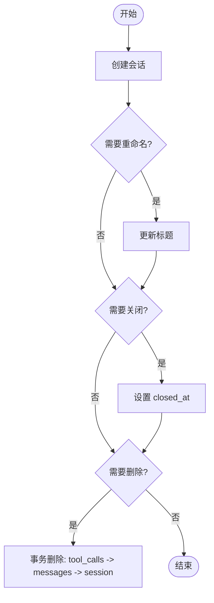
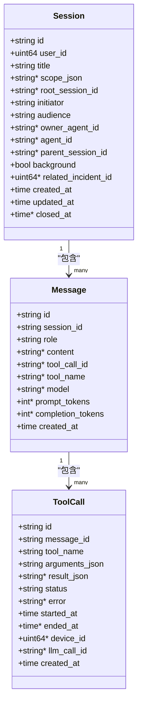
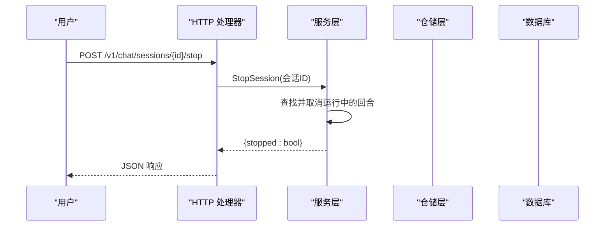
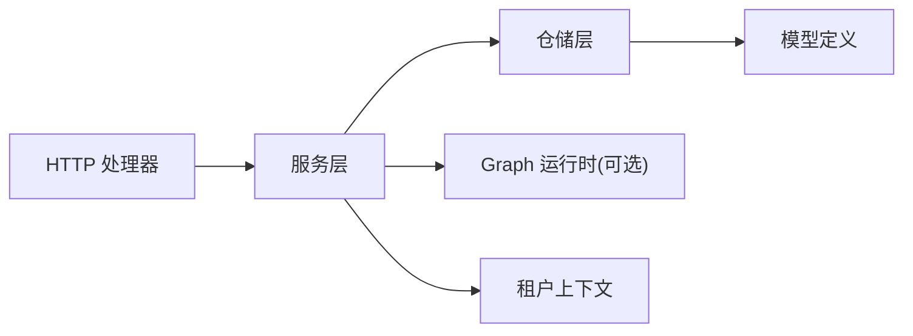

# 会话管理器

<cite>
**本文引用的文件**
- [internal/manager/model/aiops/model.go](file://internal/manager/model/aiops/model.go)
- [internal/manager/data/aiops/store/session.go](file://internal/manager/data/aiops/store/session.go)
- [internal/manager/service/aiops/service.go](file://internal/manager/service/aiops/service.go)
- [internal/manager/server/aiops/http.go](file://internal/manager/server/aiops/http.go)
- [internal/pkg/tenantctx/tenantctx.go](file://internal/pkg/tenantctx/tenantctx.go)
- [internal/manager/biz/aiops/chatruntime/runtime_test.go](file://internal/manager/biz/aiops/chatruntime/runtime_test.go)
- [internal/manager/biz/aiops/graph/callbacks/persistence_test.go](file://internal/manager/biz/aiops/graph/callbacks/persistence_test.go)
- [web/src/pages/ChatThread.tsx](file://web/src/pages/ChatThread.tsx)
</cite>

## 目录
1. [简介](#简介)
2. [项目结构](#项目结构)
3. [核心组件](#核心组件)
4. [架构总览](#架构总览)
5. [详细组件分析](#详细组件分析)
6. [依赖关系分析](#依赖关系分析)
7. [性能考量](#性能考量)
8. [故障排查指南](#故障排查指南)
9. [结论](#结论)
10. [附录：API 接口文档与最佳实践](#附录api-接口文档与最佳实践)

## 简介
本文件围绕“会话管理器”进行系统化说明，覆盖会话生命周期（创建、更新、删除、状态转换）、数据存储模型与持久化策略、多租户隔离与权限控制、会话共享机制、消息历史与分页查询、恢复与断线重连、数据一致性保证，以及对外 API 与最佳实践。内容基于代码仓库中的服务层、存储层、HTTP 层与前端轮询逻辑进行归纳与可视化。

## 项目结构
会话管理在 manager/aiops 子域中实现，采用分层设计：
- HTTP 层：路由注册、鉴权上下文注入、请求解析与响应封装
- 服务层：所有权校验、内核选择（legacy/graph）、流式事件转发、停止与会话取消
- 业务层：Agent/Graph 运行时、工具调用、回调与持久化
- 数据层：GORM 仓储，负责会话、消息、工具调用的增删改查与聚合统计
- 模型层：会话、消息、工具调用的数据库实体定义与默认值填充
- 上下文：每请求的租户/用户身份注入与读取

图表来源
- [internal/manager/server/aiops/http.go:143-171](file://internal/manager/server/aiops/http.go#L143-L171)
- [internal/manager/service/aiops/service.go:334-380](file://internal/manager/service/aiops/service.go#L334-L380)
- [internal/manager/data/aiops/store/session.go:36-99](file://internal/manager/data/aiops/store/session.go#L36-L99)

章节来源
- [internal/manager/server/aiops/http.go:143-171](file://internal/manager/server/aiops/http.go#L143-L171)
- [internal/manager/service/aiops/service.go:334-380](file://internal/manager/service/aiops/service.go#L334-L380)
- [internal/manager/data/aiops/store/session.go:36-99](file://internal/manager/data/aiops/store/session.go#L36-L99)

## 核心组件
- 模型与持久化
  - 会话实体包含用户归属、标题、范围、根会话、发起者、受众、负责人 Agent、关联告警等字段；创建时自动填充 ID、根会话、默认发起者与受众、默认负责人 Agent
  - 消息实体记录角色、可选文本、工具调用标识、模型溯源、Token 用量与时间戳
  - 工具调用实体记录名称、参数、结果、状态、错误、起止时间与设备ID
- 仓储层
  - 会话 CRUD、按父会话列出、按用户列出（支持 incident 过滤与分页）
  - 消息列表支持限制条数并维护顺序；批量回填 assistant 消息的工具调用以保障严格 LLM 协议
  - 工具调用结果更新与挂起任务收尾（最终化为 error）
  - Token 用量聚合统计
- 服务层
  - 会话创建、列出、获取、关闭、删除、重命名
  - 发送消息（阻塞与流式），内核切换（legacy/graph），停止运行中的回合
  - 所有权校验（非拥有者返回 not-found），管理员绕过
- HTTP 层
  - 路由注册与鉴权上下文注入
  - 会话创建、列出、消息发送（SSE 流式）、消息历史、停止会话、重命名、删除
- 上下文与权限
  - 每请求租户上下文携带 UserID、Role、IsSuperuser，用于所有权与权限判断

章节来源
- [internal/manager/model/aiops/model.go:25-133](file://internal/manager/model/aiops/model.go#L25-L133)
- [internal/manager/data/aiops/store/session.go:36-323](file://internal/manager/data/aiops/store/session.go#L36-L323)
- [internal/manager/service/aiops/service.go:205-425](file://internal/manager/service/aiops/service.go#L205-L425)
- [internal/manager/server/aiops/http.go:446-800](file://internal/manager/server/aiops/http.go#L446-L800)
- [internal/pkg/tenantctx/tenantctx.go:13-49](file://internal/pkg/tenantctx/tenantctx.go#L13-L49)

## 架构总览
会话管理的端到端流程如下：
- 客户端通过 HTTP 创建会话或发送消息
- HTTP 层解析请求，注入租户上下文，调用服务层
- 服务层执行所有权校验，选择内核（legacy 或 graph），执行业务逻辑
- 业务层通过仓储层持久化会话、消息与工具调用
- 流式场景使用 SSE 推送中间状态，前端轮询或接收事件渲染

图表来源
- [internal/manager/server/aiops/http.go:446-618](file://internal/manager/server/aiops/http.go#L446-L618)
- [internal/manager/service/aiops/service.go:334-380](file://internal/manager/service/aiops/service.go#L334-L380)
- [internal/manager/data/aiops/store/session.go:162-249](file://internal/manager/data/aiops/store/session.go#L162-L249)

## 详细组件分析

### 会话生命周期管理
- 创建
  - HTTP 接收标题、范围、关联告警、AgentID
  - 服务层构造会话对象，设置用户ID、默认发起者与受众，必要时序列化范围
  - 仓储层插入并返回会话
- 更新
  - 重命名：校验所有权后更新标题并更新时间戳
  - 关闭：软关闭（设置 closed_at），保留审计历史
- 删除
  - 硬删除：事务内先删除工具调用，再删除消息，最后删除会话，避免孤儿数据
- 状态转换
  - 会话状态由 closed_at 标记是否关闭；消息与工具调用存在独立状态（pending/success/error/timeout）
  - 工具调用在会话结束时若仍 pending，仓储层会批量终化为 error，确保 UI 与审计一致

图表来源
- [internal/manager/data/aiops/store/session.go:101-160](file://internal/manager/data/aiops/store/session.go#L101-L160)
- [internal/manager/service/aiops/service.go:267-302](file://internal/manager/service/aiops/service.go#L267-L302)

章节来源
- [internal/manager/server/aiops/http.go:446-506](file://internal/manager/server/aiops/http.go#L446-L506)
- [internal/manager/service/aiops/service.go:205-302](file://internal/manager/service/aiops/service.go#L205-L302)
- [internal/manager/data/aiops/store/session.go:101-160](file://internal/manager/data/aiops/store/session.go#L101-L160)

### 数据存储模型与持久化策略
- 模型
  - Session：主键 UUID，用户ID索引，根会话、发起者、受众、负责人 Agent、关联告警、类型等
  - Message：主键 UUID，会话ID索引，角色约束，可选文本，工具调用关联，模型溯源与 Token 用量
  - ToolCall：主键 UUID，消息ID索引，名称、参数、结果、状态、错误、起止时间、设备ID、LLM 调用ID
- 持久化
  - GORM 仓储提供会话、消息、工具调用的增删改查
  - 删除使用事务保证级联一致性
  - 消息列表支持限制条数并按时间排序，同时批量回填 assistant 消息的工具调用
  - Token 用量聚合使用原始 SQL 提升可审计性与性能
- 缓存机制
  - 当前实现未引入应用侧缓存；列表与详情直接读库
  - 前端通过轮询与 SSE 增量渲染减少重复计算

章节来源
- [internal/manager/model/aiops/model.go:25-217](file://internal/manager/model/aiops/model.go#L25-L217)
- [internal/manager/data/aiops/store/session.go:162-323](file://internal/manager/data/aiops/store/session.go#L162-L323)

### 多租户隔离、用户权限控制与会话共享
- 多租户隔离
  - 当前为单租户私有部署，Tenant 实际表示认证后的调用者（UserID、Role、IsSuperuser）
  - 会话按 UserID 隔离，列表查询仅返回当前用户的会话
- 权限控制
  - 非拥有者访问会话返回 not-found（不泄露存在性）
  - 管理员可绕过所有权检查
- 会话共享
  - 会话属于单一用户；系统后台任务（如告警 RCA）可能生成内部受众的会话，不在主聊天列表显示
  - 可通过关联告警ID将会话纳入特定上下文的视图

章节来源
- [internal/pkg/tenantctx/tenantctx.go:13-49](file://internal/pkg/tenantctx/tenantctx.go#L13-L49)
- [internal/manager/service/aiops/service.go:246-257](file://internal/manager/service/aiops/service.go#L246-L257)
- [internal/manager/data/aiops/store/session.go:75-99](file://internal/manager/data/aiops/store/session.go#L75-L99)

### 会话消息的历史记录、搜索索引与分页查询
- 历史记录
  - 消息按会话ID查询，支持限制条数并保持时间顺序
  - assistant 消息的工具调用通过批量查询回填，确保严格 LLM 协议
- 搜索索引
  - 数据库层对会话与消息建立必要索引（如 user_id、session_id、created_at）
  - 当前未实现全文检索；如需搜索可在上层接入搜索引擎
- 分页查询
  - 会话列表支持 limit/offset 分页
  - 消息列表支持限制条数（最近 N 条）

章节来源
- [internal/manager/data/aiops/store/session.go:75-99](file://internal/manager/data/aiops/store/session.go#L75-L99)
- [internal/manager/data/aiops/store/session.go:176-241](file://internal/manager/data/aiops/store/session.go#L176-L241)

### 会话恢复、断线重连与数据一致性
- 恢复与重连
  - 前端通过轮询拉取消息历史，结合 SSE 事件重建界面状态
  - 当 SSE 断开，前端重新拉取完整历史，避免丢失
- 数据一致性
  - 工具调用在会话结束时若仍 pending，仓储层批量终化为 error
  - 删除操作使用事务保证级联一致性
  - 消息追加冲突（唯一约束）返回冲突错误

章节来源
- [web/src/pages/ChatThread.tsx:118-142](file://web/src/pages/ChatThread.tsx#L118-L142)
- [internal/manager/data/aiops/store/session.go:141-160](file://internal/manager/data/aiops/store/session.go#L141-L160)
- [internal/manager/data/aiops/store/session.go:297-323](file://internal/manager/data/aiops/store/session.go#L297-L323)

### 类图与序列图（代码级）

图表来源
- [internal/manager/model/aiops/model.go:25-217](file://internal/manager/model/aiops/model.go#L25-L217)

图表来源
- [internal/manager/server/aiops/http.go:779-800](file://internal/manager/server/aiops/http.go#L779-L800)
- [internal/manager/service/aiops/service.go:406-425](file://internal/manager/service/aiops/service.go#L406-L425)

章节来源
- [internal/manager/model/aiops/model.go:25-217](file://internal/manager/model/aiops/model.go#L25-L217)
- [internal/manager/server/aiops/http.go:779-800](file://internal/manager/server/aiops/http.go#L779-L800)
- [internal/manager/service/aiops/service.go:406-425](file://internal/manager/service/aiops/service.go#L406-L425)

## 依赖关系分析
- HTTP 处理器依赖服务层接口，解耦内核实现
- 服务层依赖仓储层与可选的 Graph 运行时
- 仓储层依赖 GORM 与模型定义
- 上下文包提供租户信息，贯穿 HTTP、服务与业务层

图表来源
- [internal/manager/server/aiops/http.go:143-171](file://internal/manager/server/aiops/http.go#L143-L171)
- [internal/manager/service/aiops/service.go:73-123](file://internal/manager/service/aiops/service.go#L73-L123)
- [internal/manager/data/aiops/store/session.go:21-34](file://internal/manager/data/aiops/store/session.go#L21-L34)
- [internal/pkg/tenantctx/tenantctx.go:13-49](file://internal/pkg/tenantctx/tenantctx.go#L13-L49)

章节来源
- [internal/manager/server/aiops/http.go:143-171](file://internal/manager/server/aiops/http.go#L143-L171)
- [internal/manager/service/aiops/service.go:73-123](file://internal/manager/service/aiops/service.go#L73-L123)
- [internal/manager/data/aiops/store/session.go:21-34](file://internal/manager/data/aiops/store/session.go#L21-L34)
- [internal/pkg/tenantctx/tenantctx.go:13-49](file://internal/pkg/tenantctx/tenantctx.go#L13-L49)

## 性能考量
- 列表与历史
  - 会话列表使用 LIMIT/OFFSET 分页，避免全表扫描
  - 消息列表支持限制条数，减少传输与渲染开销
- 工具调用回填
  - 批量查询 assistant 消息的工具调用，降低 N+1 查询
- Token 统计
  - 使用原始 SQL 聚合，提高可审计性与性能
- 流式输出
  - SSE 实时推送，减少轮询频率与带宽占用
- 建议
  - 对高频查询增加合适索引（已具备 user_id、session_id、created_at 等）
  - 对大会话历史考虑分片或归档策略
  - 对搜索需求引入搜索引擎（如 Elasticsearch/Loki）

[本节为通用指导，无需具体文件引用]

## 故障排查指南
- 常见错误
  - 未授权：缺少租户上下文或 JWT 无效
  - 未找到：会话不存在或非拥有者访问
  - 冲突：消息或工具调用唯一约束冲突
  - 未连接：SSE 后端不支持流式，回退为阻塞响应
- 定位方法
  - 检查 HTTP 状态码与错误体 code
  - 查看仓储层事务与更新行数
  - 确认前端轮询与 SSE 事件处理逻辑
- 恢复策略
  - 前端断线后重新拉取历史
  - 工具调用挂起时由仓储层终化为 error

章节来源
- [internal/manager/server/monitor/http.go:166-195](file://internal/manager/server/monitor/http.go#L166-L195)
- [internal/manager/data/aiops/store/session.go:141-160](file://internal/manager/data/aiops/store/session.go#L141-L160)
- [internal/manager/data/aiops/store/session.go:297-323](file://internal/manager/data/aiops/store/session.go#L297-L323)
- [web/src/pages/ChatThread.tsx:118-142](file://web/src/pages/ChatThread.tsx#L118-L142)

## 结论
会话管理器通过清晰的分层与严格的权限控制，实现了安全的会话生命周期管理与可靠的消息历史。仓储层的事务与收尾机制保障了数据一致性，SSE 与前端轮询提供了良好的用户体验。未来可结合搜索引擎与归档策略进一步提升可扩展性与性能。

[本节为总结，无需具体文件引用]

## 附录：API 接口文档与最佳实践

### API 概览
- 会话
  - POST /v1/chat/sessions：创建会话
  - GET /v1/chat/sessions：列出当前用户的会话（支持 limit/offset、related_incident_id）
  - DELETE /v1/chat/sessions/{id}：删除会话（硬删除）
  - PATCH /v1/chat/sessions/{id}：重命名会话
- 消息
  - POST /v1/chat/sessions/{id}/messages：发送消息（阻塞）
  - POST /v1/chat/sessions/{id}/messages/stream：发送消息（SSE 流式）
  - GET /v1/chat/sessions/{id}/messages：获取会话消息历史
- 控制
  - POST /v1/chat/sessions/{id}/stop：停止正在运行的回合

章节来源
- [internal/manager/server/aiops/http.go:143-171](file://internal/manager/server/aiops/http.go#L143-L171)
- [internal/manager/server/aiops/http.go:446-800](file://internal/manager/server/aiops/http.go#L446-L800)

### 请求与响应要点
- 创建会话
  - 请求体包含 title、scope、related_incident_id、agent_id
  - 响应返回会话 DTO（id、user_id、title、scope、related_incident_id、agent_id、时间戳、closed_at）
- 发送消息
  - 请求体包含 content、provider、model、mentions、web_search_enabled、locale
  - 阻塞响应返回 assistant_message、tool_calls、usage、iterations
  - SSE 事件包括 assistant、tool_start、tool_end、done、error
- 列出会话
  - 查询参数 limit、offset、related_incident_id
  - 响应包含 items 数组与 total 计数
- 获取消息历史
  - 响应包含 items 数组与 total 计数

章节来源
- [internal/manager/server/aiops/http.go:301-418](file://internal/manager/server/aiops/http.go#L301-L418)
- [internal/manager/server/aiops/http.go:446-777](file://internal/manager/server/aiops/http.go#L446-L777)

### 最佳实践
- 会话创建
  - 始终设置标题；如需限定工具范围，传入 scope
  - 通过 agent_id 指定会话使用的助理人设
- 消息发送
  - 使用 SSE 流式以获得更好的交互体验
  - 合理设置 provider/model 与 mentions，满足个性化需求
- 历史与分页
  - 使用 limit/offset 分页会话列表，避免一次性加载过多数据
  - 消息历史使用限制条数，按需滚动加载
- 权限与安全
  - 确保请求携带有效 JWT，使租户上下文正确注入
  - 非拥有者无法访问他人会话（返回 not-found）
- 恢复与重连
  - 前端断线后重新拉取历史，结合 SSE 事件重建界面
  - 关注工具调用状态，必要时重试或提示用户

章节来源
- [internal/manager/service/aiops/service.go:205-302](file://internal/manager/service/aiops/service.go#L205-L302)
- [internal/manager/server/aiops/http.go:446-777](file://internal/manager/server/aiops/http.go#L446-L777)
- [web/src/pages/ChatThread.tsx:118-142](file://web/src/pages/ChatThread.tsx#L118-L142)