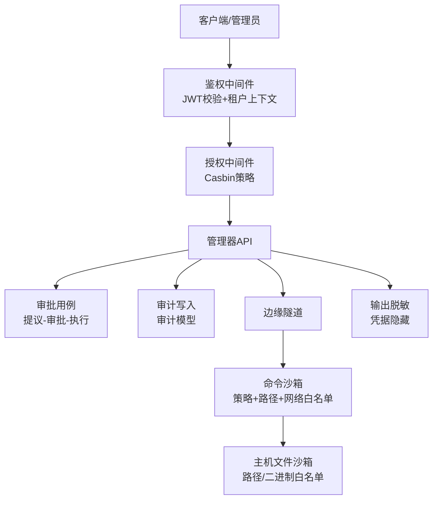
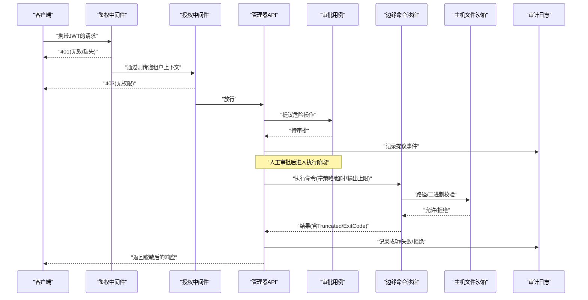
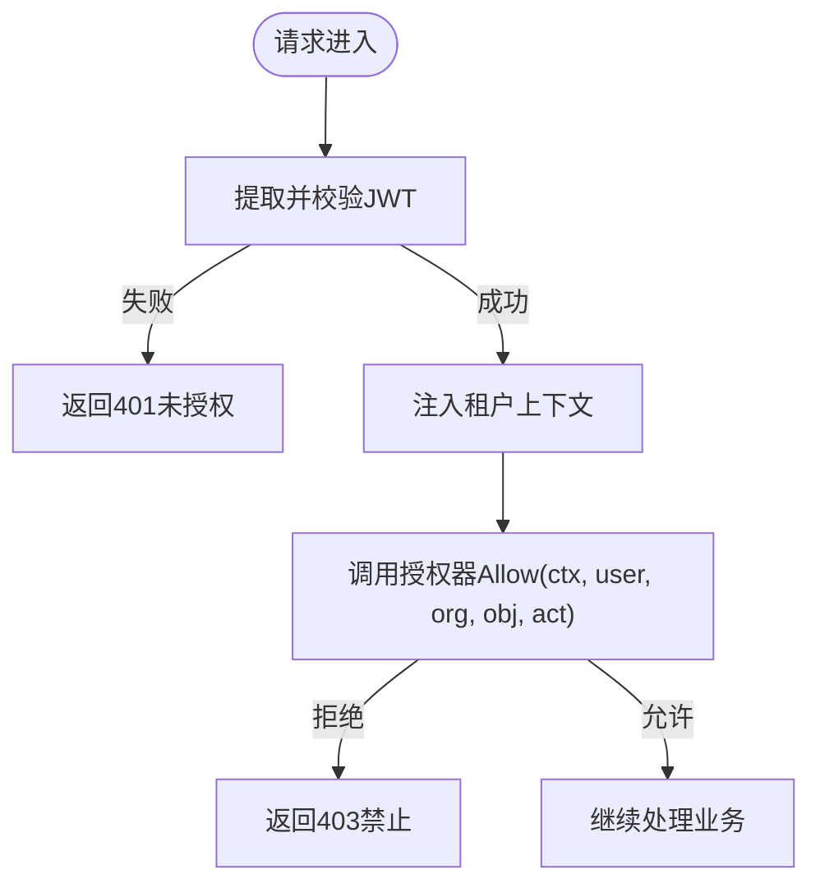
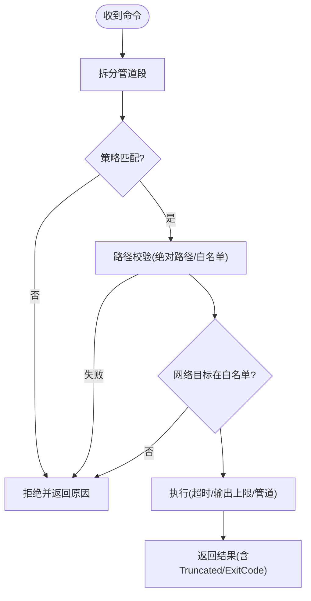
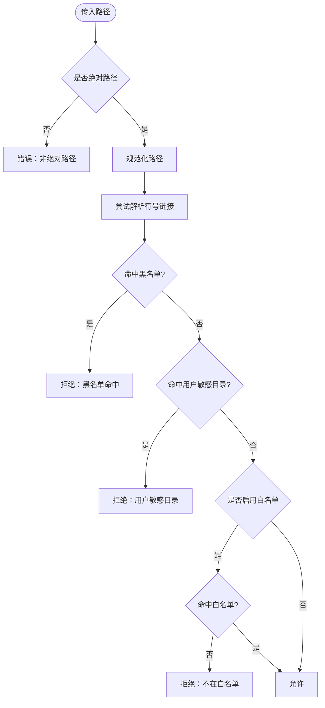
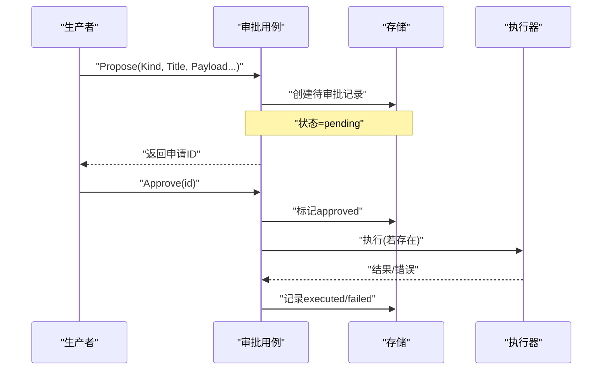
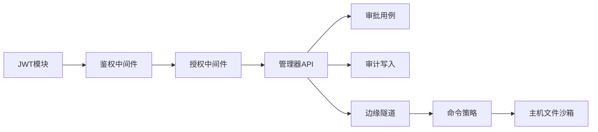

# 工具安全机制

<cite>
**本文引用的文件**
- [internal/pkg/auth/middleware.go](file://internal/pkg/auth/middleware.go)
- [internal/pkg/auth/jwt.go](file://internal/pkg/auth/jwt.go)
- [internal/manager/server/audit/http.go](file://internal/manager/server/audit/http.go)
- [internal/manager/model/audit/log.go](file://internal/manager/model/audit/log.go)
- [internal/edgeagent/cmdpolicy/sandbox.go](file://internal/edgeagent/cmdpolicy/sandbox.go)
- [internal/edgeagent/cmdpolicy/policy.go](file://internal/edgeagent/cmdpolicy/policy.go)
- [internal/edgeagent/cmdpolicy/types.go](file://internal/edgeagent/cmdpolicy/types.go)
- [internal/edgeagent/host_files/sandbox.go](file://internal/edgeagent/host_files/sandbox.go)
- [deploy/edge/bash-policy.example.yaml](file://deploy/edge/bash-policy.example.yaml)
- [internal/manager/biz/approval/usecase.go](file://internal/manager/biz/approval/usecase.go)
- [internal/pkg/k8sredact/redact.go](file://internal/pkg/k8sredact/redact.go)
- [internal/pkg/config/config.go](file://internal/pkg/config/config.go)
- [tests/e2e/auth_rbac_test.go](file://tests/e2e/auth_rbac_test.go)
</cite>

## 目录
1. [简介](#简介)
2. [项目结构](#项目结构)
3. [核心组件](#核心组件)
4. [架构总览](#架构总览)
5. [详细组件分析](#详细组件分析)
6. [依赖关系分析](#依赖关系分析)
7. [性能与资源限制](#性能与资源限制)
8. [故障排查指南](#故障排查指南)
9. [结论](#结论)
10. [附录：配置项与合规要点](#附录配置项与合规要点)

## 简介
本文件系统性阐述工具安全机制，覆盖访问控制、权限验证、资源隔离、敏感操作审批、命令白名单、执行审计、输入参数校验、输出脱敏与安全边界。重点说明边缘侧命令沙箱（cmdpolicy）、主机文件访问沙箱（host_files）、网络出站白名单、JWT鉴权与RBAC授权、审批流（approval）与审计日志（audit），以及可观测性与合规性实践。

## 项目结构
围绕“工具安全”的关键代码分布在以下层次：
- 认证与授权：JWT签发/校验、HTTP鉴权中间件、基于Casbin的RBAC策略
- 边缘命令沙箱：命令白名单、参数匹配、路径校验、网络出站白名单、超时与输出截断
- 主机文件沙箱：读路径白/黑名单、符号链接规范化、二进制白名单
- 审批与审计：危险操作的“提议-审批-执行”流程；不可篡改的审计记录
- 数据脱敏：Kubernetes元数据中的凭据脱敏
- 配置中心：环境变量驱动的安全开关与阈值

**图示来源**
- [internal/pkg/auth/middleware.go:10-53](file://internal/pkg/auth/middleware.go#L10-L53)
- [internal/edgeagent/cmdpolicy/sandbox.go:76-132](file://internal/edgeagent/cmdpolicy/sandbox.go#L76-L132)
- [internal/edgeagent/host_files/sandbox.go:135-193](file://internal/edgeagent/host_files/sandbox.go#L135-L193)
- [internal/manager/biz/approval/usecase.go:70-148](file://internal/manager/biz/approval/usecase.go#L70-L148)
- [internal/manager/model/audit/log.go:10-47](file://internal/manager/model/audit/log.go#L10-L47)
- [internal/pkg/k8sredact/redact.go:11-42](file://internal/pkg/k8sredact/redact.go#L11-L42)

**章节来源**
- [internal/pkg/auth/middleware.go:10-53](file://internal/pkg/auth/middleware.go#L10-L53)
- [internal/edgeagent/cmdpolicy/sandbox.go:76-132](file://internal/edgeagent/cmdpolicy/sandbox.go#L76-L132)
- [internal/edgeagent/host_files/sandbox.go:135-193](file://internal/edgeagent/host_files/sandbox.go#L135-L193)
- [internal/manager/biz/approval/usecase.go:70-148](file://internal/manager/biz/approval/usecase.go#L70-L148)
- [internal/manager/model/audit/log.go:10-47](file://internal/manager/model/audit/log.go#L10-L47)
- [internal/pkg/k8sredact/redact.go:11-42](file://internal/pkg/k8sredact/redact.go#L11-L42)

## 核心组件
- 认证与授权
  - JWT签发/校验：签名算法、有效期、超级用户标志
  - HTTP鉴权中间件：Bearer/Query Token解析、租户上下文注入、失败统一401
  - RBAC授权：对象命名与动作词汇表、超管短路保护
- 边缘命令沙箱
  - 命令白名单与分类（只读系统/文件系统、混合读写、网络、禁止类）
  - 参数匹配器（AnyFlag/Subcmd/SubcmdPath）与拒绝参数集
  - 路径校验（绝对路径、符号链接解析、前缀白名单）
  - 网络出站白名单（CIDR/后缀/精确匹配）
  - 执行约束（超时、输出上限、管道组合、进程组）
- 主机文件沙箱
  - 读路径默认黑名单（虚拟文件系统、敏感文件）
  - 可选读路径白名单（严格模式）
  - 二进制白名单（find/du/stat等）
- 审批机制
  - 提议-审批-执行三态流转；无执行器时仅标记已批准不执行
- 审计日志
  - 标准化动作枚举、资源类型、状态、负载JSON（上游脱敏）
- 输出脱敏
  - 文本与键名敏感信息替换为[REDACTED]

**章节来源**
- [internal/pkg/auth/jwt.go:16-99](file://internal/pkg/auth/jwt.go#L16-L99)
- [internal/pkg/auth/middleware.go:10-53](file://internal/pkg/auth/middleware.go#L10-L53)
- [internal/edgeagent/cmdpolicy/policy.go:33-492](file://internal/edgeagent/cmdpolicy/policy.go#L33-L492)
- [internal/edgeagent/cmdpolicy/sandbox.go:76-188](file://internal/edgeagent/cmdpolicy/sandbox.go#L76-L188)
- [internal/edgeagent/host_files/sandbox.go:57-109](file://internal/edgeagent/host_files/sandbox.go#L57-L109)
- [internal/manager/biz/approval/usecase.go:70-148](file://internal/manager/biz/approval/usecase.go#L70-L148)
- [internal/manager/model/audit/log.go:10-136](file://internal/manager/model/audit/log.go#L10-L136)
- [internal/pkg/k8sredact/redact.go:11-42](file://internal/pkg/k8sredact/redact.go#L11-L42)

## 架构总览
下图展示一次“危险操作”从请求到执行的完整安全链路：鉴权→授权→审批→审计→沙箱执行→输出脱敏。

**图示来源**
- [internal/pkg/auth/middleware.go:21-53](file://internal/pkg/auth/middleware.go#L21-L53)
- [internal/manager/biz/approval/usecase.go:70-148](file://internal/manager/biz/approval/usecase.go#L70-L148)
- [internal/edgeagent/cmdpolicy/sandbox.go:134-188](file://internal/edgeagent/cmdpolicy/sandbox.go#L134-L188)
- [internal/edgeagent/host_files/sandbox.go:135-193](file://internal/edgeagent/host_files/sandbox.go#L135-L193)
- [internal/manager/model/audit/log.go:10-47](file://internal/manager/model/audit/log.go#L10-L47)

## 详细组件分析

### 认证与授权（JWT + RBAC）
- JWT
  - 使用HMAC签名，包含用户ID、邮箱、角色、是否超级用户、标准过期时间
  - 提供Access/Refresh/自定义TTL签发能力
- 鉴权中间件
  - 支持Authorization头与WebSocket查询参数回退
  - 将租户上下文写入请求上下文，失败统一返回401
- RBAC
  - 对象命名约定与动作词汇表（read/write/delete/manage/exec）
  - 超管短路保护，避免策略损坏导致管理员被锁

**图示来源**
- [internal/pkg/auth/jwt.go:16-99](file://internal/pkg/auth/jwt.go#L16-L99)
- [internal/pkg/auth/middleware.go:21-53](file://internal/pkg/auth/middleware.go#L21-L53)

**章节来源**
- [internal/pkg/auth/jwt.go:16-99](file://internal/pkg/auth/jwt.go#L16-L99)
- [internal/pkg/auth/middleware.go:21-53](file://internal/pkg/auth/middleware.go#L21-L53)
- [tests/e2e/auth_rbac_test.go:1-39](file://tests/e2e/auth_rbac_test.go#L1-L39)

### 边缘命令沙箱（cmdpolicy）
- 策略定义
  - 内置只读基线：文件系统读取、系统信息查询、网络探测、混合读写工具（iptables/systemctl/ip/tc/crontab/mount等）
  - 每工具支持只读匹配器、写匹配器、拒绝参数集
  - 禁止类工具（shell/脚本/破坏性命令/权限变更/系统关机/认证修改等）
- 决策与执行
  - Decide：按段解析管道命令，逐段匹配策略
  - Exec：在策略允许后执行，设置超时、清理环境、管道连接、输出上限、进程组
  - ExecRaw：管理员写门控逃逸通道，绕过白名单但仍受超时/输出上限保护
- 路径与网络
  - 路径校验：所有以“/”开头的参数交由PathValidator校验（复用host_files实现）
  - 网络出站白名单：对ClassNetwork工具的目标主机进行CIDR/后缀/精确匹配校验；空列表=全部拒绝

**图示来源**
- [internal/edgeagent/cmdpolicy/policy.go:33-492](file://internal/edgeagent/cmdpolicy/policy.go#L33-L492)
- [internal/edgeagent/cmdpolicy/sandbox.go:76-188](file://internal/edgeagent/cmdpolicy/sandbox.go#L76-L188)
- [internal/edgeagent/cmdpolicy/types.go:101-123](file://internal/edgeagent/cmdpolicy/types.go#L101-L123)
- [internal/edgeagent/cmdpolicy/types.go:160-181](file://internal/edgeagent/cmdpolicy/types.go#L160-L181)

**章节来源**
- [internal/edgeagent/cmdpolicy/policy.go:33-492](file://internal/edgeagent/cmdpolicy/policy.go#L33-L492)
- [internal/edgeagent/cmdpolicy/sandbox.go:76-188](file://internal/edgeagent/cmdpolicy/sandbox.go#L76-L188)
- [internal/edgeagent/cmdpolicy/types.go:101-181](file://internal/edgeagent/cmdpolicy/types.go#L101-L181)
- [deploy/edge/bash-policy.example.yaml:19-178](file://deploy/edge/bash-policy.example.yaml#L19-L178)

### 主机文件沙箱（host_files）
- 读路径策略
  - 默认黑名单：虚拟文件系统（/proc,/sys,/dev,/run）与高敏感文件（shadow/sudoers/SSH/GPG等）
  - 可选白名单：当配置非空时，路径必须命中白名单前缀
  - 符号链接解析：优先按解析后路径判断，防止软链逃逸
- 二进制白名单
  - 启动时扫描find/du/df/stat/ls等，缺失则对应命令不可用
- 校验流程
  - 空路径/相对路径直接拒绝
  - 先黑名单再可选白名单，双重保障

**图示来源**
- [internal/edgeagent/host_files/sandbox.go:135-193](file://internal/edgeagent/host_files/sandbox.go#L135-L193)
- [internal/edgeagent/host_files/sandbox.go:266-305](file://internal/edgeagent/host_files/sandbox.go#L266-L305)

**章节来源**
- [internal/edgeagent/host_files/sandbox.go:57-109](file://internal/edgeagent/host_files/sandbox.go#L57-L109)
- [internal/edgeagent/host_files/sandbox.go:135-193](file://internal/edgeagent/host_files/sandbox.go#L135-L193)
- [internal/edgeagent/host_files/sandbox.go:266-305](file://internal/edgeagent/host_files/sandbox.go#L266-L305)

### 敏感操作审批（Approval）
- 提议：生产者提交Kind/标题/摘要/Payload/来源/会话ID/提议人
- 审批：管理员批准或拒绝；批准后若注册了执行器则执行并记录结果
- 拒绝：仅记录拒绝原因，不执行
- 安全要点：无执行器时批准也不执行，保证最小化风险

**图示来源**
- [internal/manager/biz/approval/usecase.go:70-148](file://internal/manager/biz/approval/usecase.go#L70-L148)

**章节来源**
- [internal/manager/biz/approval/usecase.go:70-148](file://internal/manager/biz/approval/usecase.go#L70-L148)

### 审计与可观测性
- 审计模型
  - 字段包含发生时间、用户、角色、IP、UA、动作、资源类型/ID/名称、状态、错误码/信息、负载JSON、请求ID
  - 动作与资源类型采用扁平枚举，便于UI筛选
- 登录失败审计
  - 登录失败记录用于暴力破解检测
- 审计访问控制
  - 仅管理员或超级用户可查询审计列表

**章节来源**
- [internal/manager/model/audit/log.go:10-136](file://internal/manager/model/audit/log.go#L10-L136)
- [internal/manager/server/audit/http.go:36-73](file://internal/manager/server/audit/http.go#L36-L73)

### 输出数据脱敏
- 文本脱敏：识别常见凭据键名（authorization/token/password/secret/api_key/client_secret等）及URL中用户名密码片段，替换为[REDACTED]
- 键名脱敏：对Kubernetes标签/注解中疑似凭据的键直接置为[REDACTED]

**章节来源**
- [internal/pkg/k8sredact/redact.go:11-42](file://internal/pkg/k8sredact/redact.go#L11-L42)

## 依赖关系分析
- 认证与授权依赖
  - 鉴权中间件依赖JWT Signer与租户上下文
  - RBAC策略由IAM层维护，管理器侧通过中间件调用
- 命令沙箱依赖
  - cmdpolicy策略与host_files路径校验解耦，通过接口复用
  - 网络出站白名单由策略配置驱动
- 审批与审计
  - 审批用例依赖持久化仓库与执行器注册表
  - 审计写入与查询由管理器API暴露，受RBAC保护

**图示来源**
- [internal/pkg/auth/jwt.go:16-99](file://internal/pkg/auth/jwt.go#L16-L99)
- [internal/pkg/auth/middleware.go:21-53](file://internal/pkg/auth/middleware.go#L21-L53)
- [internal/edgeagent/cmdpolicy/policy.go:33-492](file://internal/edgeagent/cmdpolicy/policy.go#L33-L492)
- [internal/edgeagent/host_files/sandbox.go:135-193](file://internal/edgeagent/host_files/sandbox.go#L135-L193)
- [internal/manager/biz/approval/usecase.go:70-148](file://internal/manager/biz/approval/usecase.go#L70-L148)
- [internal/manager/model/audit/log.go:10-47](file://internal/manager/model/audit/log.go#L10-L47)

**章节来源**
- [internal/pkg/auth/jwt.go:16-99](file://internal/pkg/auth/jwt.go#L16-L99)
- [internal/pkg/auth/middleware.go:21-53](file://internal/pkg/auth/middleware.go#L21-L53)
- [internal/edgeagent/cmdpolicy/policy.go:33-492](file://internal/edgeagent/cmdpolicy/policy.go#L33-L492)
- [internal/edgeagent/host_files/sandbox.go:135-193](file://internal/edgeagent/host_files/sandbox.go#L135-L193)
- [internal/manager/biz/approval/usecase.go:70-148](file://internal/manager/biz/approval/usecase.go#L70-L148)
- [internal/manager/model/audit/log.go:10-47](file://internal/manager/model/audit/log.go#L10-L47)

## 性能与资源限制
- 命令执行
  - 超时：默认30秒，可通过YAML覆盖
  - 输出上限：stdout/stderr分别限制，超出标记Truncated
  - 参数长度：默认最大32个参数，防止滥用
  - 管道：多段命令通过stdin/stdout串联，整体受超时控制
- 网络出站
  - 默认全拒绝，需显式配置CIDR/后缀/精确匹配
- 主机文件
  - 路径校验在内存中进行，开销低；符号链接解析仅在必要时进行
- 配置
  - 大量行为通过环境变量与YAML覆盖，便于生产调优

**章节来源**
- [internal/edgeagent/cmdpolicy/policy.go:26-49](file://internal/edgeagent/cmdpolicy/policy.go#L26-L49)
- [internal/edgeagent/cmdpolicy/sandbox.go:134-188](file://internal/edgeagent/cmdpolicy/sandbox.go#L134-L188)
- [deploy/edge/bash-policy.example.yaml:153-178](file://deploy/edge/bash-policy.example.yaml#L153-L178)
- [internal/pkg/config/config.go:417-548](file://internal/pkg/config/config.go#L417-L548)

## 故障排查指南
- 401未授权
  - 检查JWT是否有效、是否携带Bearer或Query token
  - 确认鉴权中间件是否正确注入租户上下文
- 403禁止
  - 检查RBAC策略是否授予所需对象与动作
  - 确认是否为超管短路路径
- 命令被拒绝
  - 查看策略中该二进制是否属于禁止类或未安装
  - 检查参数是否命中写匹配器或拒绝参数集
  - 检查路径是否在白名单内、是否命中黑名单
  - 检查网络目标是否在出站白名单
- 输出被截断
  - 关注ShellResult.Truncated标志，适当提高输出上限
- 审批未执行
  - 确认是否已注册对应Kind的执行器；未注册时批准不会执行
- 审计查询受限
  - 仅管理员或超级用户可访问审计列表

**章节来源**
- [internal/pkg/auth/middleware.go:21-53](file://internal/pkg/auth/middleware.go#L21-L53)
- [internal/edgeagent/cmdpolicy/policy.go:707-800](file://internal/edgeagent/cmdpolicy/policy.go#L707-L800)
- [internal/edgeagent/cmdpolicy/sandbox.go:76-188](file://internal/edgeagent/cmdpolicy/sandbox.go#L76-L188)
- [internal/edgeagent/host_files/sandbox.go:135-193](file://internal/edgeagent/host_files/sandbox.go#L135-L193)
- [internal/manager/biz/approval/usecase.go:108-148](file://internal/manager/biz/approval/usecase.go#L108-L148)
- [internal/manager/server/audit/http.go:60-73](file://internal/manager/server/audit/http.go#L60-L73)

## 结论
本方案通过“认证-授权-审批-审计-沙箱-脱敏”的多层防护，确保工具调用在最小权限下运行，并对高风险操作实施人工审批与不可篡改审计。命令沙箱与主机文件沙箱形成纵深防御，结合网络出站白名单与输出上限/超时，有效降低误用与恶意利用风险。建议在生产环境中严格配置白名单、启用审批与审计，并定期审查策略与日志。

## 附录：配置项与合规要点
- 关键配置项（部分）
  - JWT密钥与有效期：影响令牌安全与生命周期
  - 命令策略：二进制白名单、参数匹配器、拒绝参数集、超时、输出上限、参数数量上限
  - 网络出站白名单：CIDR/后缀/精确匹配，默认全拒绝
  - 主机文件路径：黑名单与可选白名单
  - 通知/告警/外部服务TLS与CA：确保传输安全
- 合规建议
  - 最小权限原则：仅开放必要命令与路径
  - 审批留痕：所有危险操作必须经审批并记录
  - 审计不可篡改：仅保留必要写入，限制删除
  - 输出脱敏：对外展示前强制脱敏
  - 定期演练：模拟攻击面（越权、注入、逃逸）验证策略有效性

**章节来源**
- [internal/pkg/config/config.go:417-548](file://internal/pkg/config/config.go#L417-L548)
- [deploy/edge/bash-policy.example.yaml:153-178](file://deploy/edge/bash-policy.example.yaml#L153-L178)
- [internal/manager/model/audit/log.go:10-136](file://internal/manager/model/audit/log.go#L10-L136)
- [internal/pkg/k8sredact/redact.go:11-42](file://internal/pkg/k8sredact/redact.go#L11-L42)