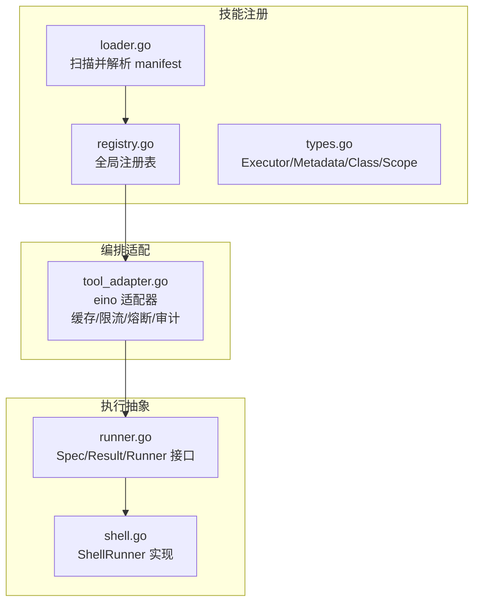
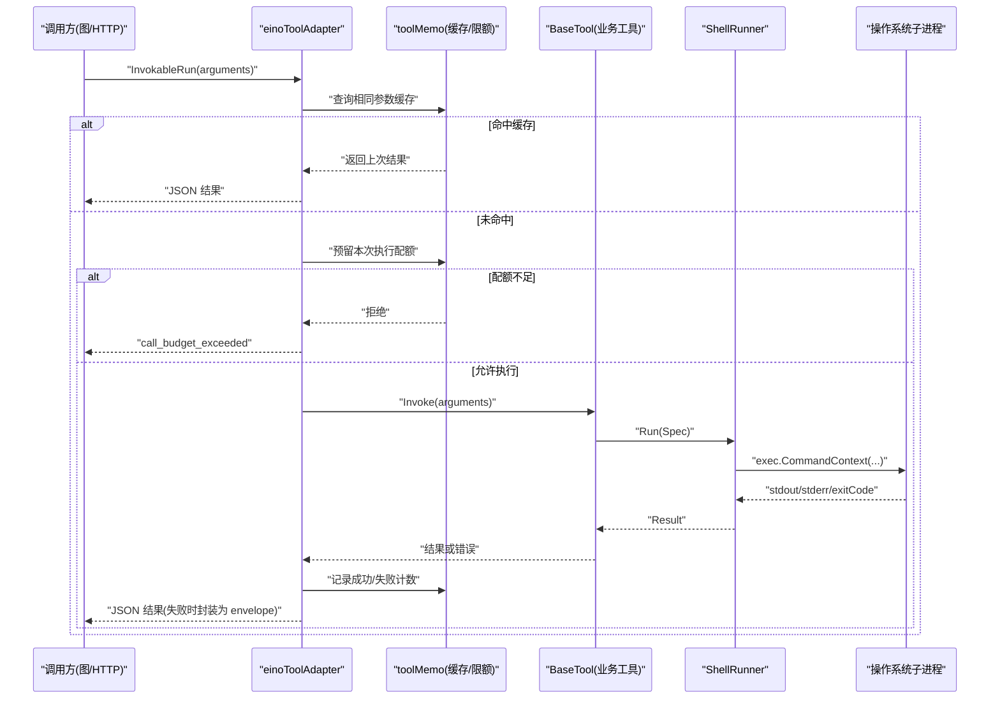
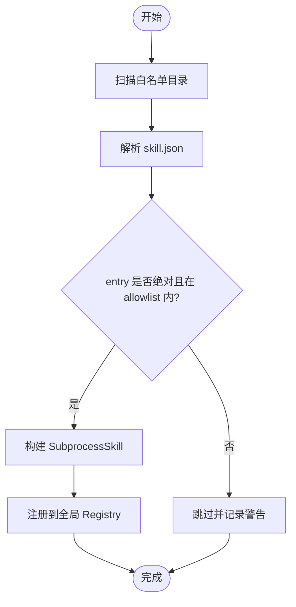
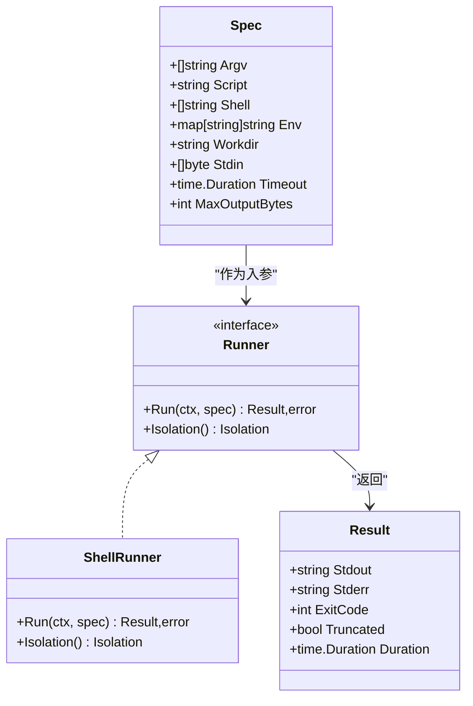
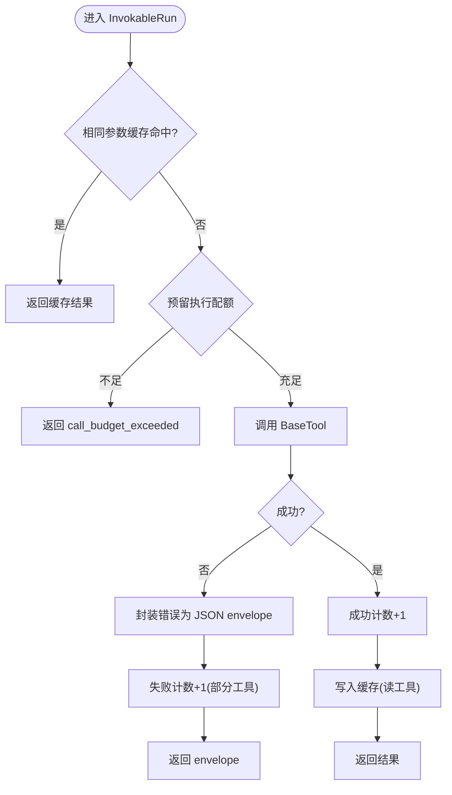
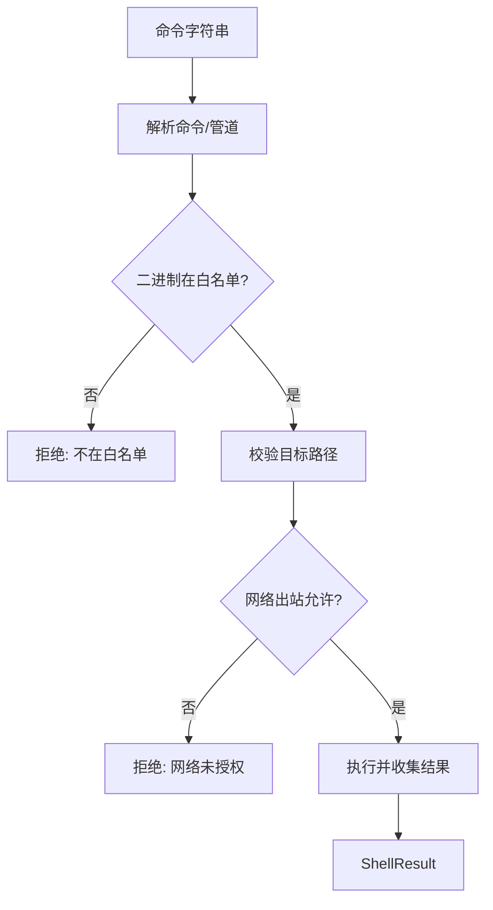
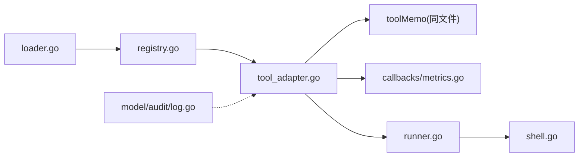

# 工具执行引擎

<cite>
**本文引用的文件**
- [internal/skill/subprocess.go](file://internal/skill/subprocess.go)
- [internal/skill/loader.go](file://internal/skill/loader.go)
- [internal/skill/registry.go](file://internal/skill/registry.go)
- [internal/skill/types.go](file://internal/skill/types.go)
- [internal/pkg/runner/runner.go](file://internal/pkg/runner/runner.go)
- [internal/pkg/runner/shell.go](file://internal/pkg/runner/shell.go)
- [internal/manager/biz/aiops/graph/tool_adapter.go](file://internal/manager/biz/aiops/graph/tool_adapter.go)
- [internal/edgeagent/cmdpolicy/sandbox.go](file://internal/edgeagent/cmdpolicy/sandbox.go)
- [internal/edgeagent/host_files/sandbox.go](file://internal/edgeagent/host_files/sandbox.go)
- [internal/pkg/prom/prom.go](file://internal/pkg/prom/prom.go)
- [internal/pkg/prom/manager_metrics.go](file://internal/pkg/prom/manager_metrics.go)
- [internal/manager/biz/aiops/graph/callbacks/metrics.go](file://internal/manager/biz/aiops/graph/callbacks/metrics.go)
- [internal/model/audit/log.go](file://internal/model/audit/log.go)
- [internal/pkg/errs/errs.go](file://internal/pkg/errs/errs.go)
</cite>

## 目录
1. [简介](#简介)
2. [项目结构](#项目结构)
3. [核心组件](#核心组件)
4. [架构总览](#架构总览)
5. [详细组件分析](#详细组件分析)
6. [依赖关系分析](#依赖关系分析)
7. [性能与资源限制](#性能与资源限制)
8. [故障排查指南](#故障排查指南)
9. [结论](#结论)
10. [附录：最佳实践与常见问题](#附录：最佳实践与常见问题)

## 简介
本文件面向“工具执行引擎”的完整实现，覆盖从工具发现、注册、调度到子进程执行、参数序列化、结果转换、并发控制、超时管理、资源限制、错误处理、重试与熔断保护、沙箱隔离、权限控制、审计日志、监控指标与调试方法等全链路。目标是帮助读者在不深入源码的情况下理解系统如何安全、可控地执行外部命令或脚本，并在大规模调用下保持稳定与可观测性。

## 项目结构
工具执行引擎由三层组成：
- 技能注册层：负责加载外部技能包（manifest + 可执行文件），构建并注册为可被调用的 Executor。
- 执行抽象层：统一的 Runner 接口，屏蔽隔离级别差异（当前为本地子进程，未来可扩展容器/微虚拟机）。
- 编排适配层：将底层工具适配到上层 AI 图（eino）中，提供缓存、限流、熔断、审计与指标埋点。

**图表来源**
- [internal/skill/loader.go:69-160](file://internal/skill/loader.go#L69-L160)
- [internal/skill/registry.go:10-47](file://internal/skill/registry.go#L10-L47)
- [internal/skill/types.go:190-203](file://internal/skill/types.go#L190-L203)
- [internal/pkg/runner/runner.go:48-90](file://internal/pkg/runner/runner.go#L48-L90)
- [internal/pkg/runner/shell.go:25-101](file://internal/pkg/runner/shell.go#L25-L101)
- [internal/manager/biz/aiops/graph/tool_adapter.go:241-261](file://internal/manager/biz/aiops/graph/tool_adapter.go#L241-L261)

**章节来源**
- [internal/skill/loader.go:69-160](file://internal/skill/loader.go#L69-L160)
- [internal/skill/registry.go:10-47](file://internal/skill/registry.go#L10-L47)
- [internal/skill/types.go:190-203](file://internal/skill/types.go#L190-L203)
- [internal/pkg/runner/runner.go:48-90](file://internal/pkg/runner/runner.go#L48-L90)
- [internal/pkg/runner/shell.go:25-101](file://internal/pkg/runner/shell.go#L25-L101)
- [internal/manager/biz/aiops/graph/tool_adapter.go:241-261](file://internal/manager/biz/aiops/graph/tool_adapter.go#L241-L261)

## 核心组件
- 技能加载器：按白名单目录递归扫描 skill.json，校验并构建 SubprocessSkill，注入到全局注册表。
- 全局注册表：线程安全的 Executor 目录，支持按 Key 查找、按 Class 过滤、枚举全部。
- 执行抽象 Runner：统一 Spec/Result 模型，默认 ShellRunner 以子进程方式执行，支持超时、输出截断、工作目录与环境隔离。
- eino 适配器：将 BaseTool 包装为 eino InvokableTool，内置相同参数缓存、每工具调用上限、失败计数、合成结果提示、审计持久化与指标上报。
- 沙箱策略：边缘侧对命令执行进行路径/网络/二进制白名单校验，拒绝危险访问。

**章节来源**
- [internal/skill/loader.go:69-160](file://internal/skill/loader.go#L69-L160)
- [internal/skill/registry.go:10-47](file://internal/skill/registry.go#L10-L47)
- [internal/pkg/runner/runner.go:48-90](file://internal/pkg/runner/runner.go#L48-L90)
- [internal/pkg/runner/shell.go:25-101](file://internal/pkg/runner/shell.go#L25-L101)
- [internal/manager/biz/aiops/graph/tool_adapter.go:17-131](file://internal/manager/biz/aiops/graph/tool_adapter.go#L17-L131)
- [internal/edgeagent/cmdpolicy/sandbox.go:39-74](file://internal/edgeagent/cmdpolicy/sandbox.go#L39-L74)

## 架构总览
下图展示一次工具调用从请求进入、适配、执行到返回的完整流程，包括缓存命中、预算限制、审计与指标。

**图表来源**
- [internal/manager/biz/aiops/graph/tool_adapter.go:398-489](file://internal/manager/biz/aiops/graph/tool_adapter.go#L398-L489)
- [internal/pkg/runner/shell.go:25-101](file://internal/pkg/runner/shell.go#L25-L101)

**章节来源**
- [internal/manager/biz/aiops/graph/tool_adapter.go:398-489](file://internal/manager/biz/aiops/graph/tool_adapter.go#L398-L489)
- [internal/pkg/runner/shell.go:25-101](file://internal/pkg/runner/shell.go#L25-L101)

## 详细组件分析

### 技能加载与注册（SubprocessSkill）
- 加载流程：扫描白名单目录 -> 解析 skill.json -> 校验 entry 绝对路径且位于 allowlist 根下 -> 构造 SubprocessSkill -> 注册到全局 Registry。
- 环境变量隔离：仅放行 EnvAllow 列表中的变量；无继承父进程环境，避免密钥泄露。
- 超时与输出限制：默认超时 30s；stdout 最大 16MiB，stderr 保留尾部用于诊断。
- 执行契约：stdin 传入 JSON 参数，stdout 必须为合法 JSON；非零退出码视为错误并附带 stderr 尾部。

**图表来源**
- [internal/skill/loader.go:69-160](file://internal/skill/loader.go#L69-L160)
- [internal/skill/loader.go:176-254](file://internal/skill/loader.go#L176-L254)

**章节来源**
- [internal/skill/loader.go:69-160](file://internal/skill/loader.go#L69-L160)
- [internal/skill/loader.go:176-254](file://internal/skill/loader.go#L176-L254)
- [internal/skill/subprocess.go:17-78](file://internal/skill/subprocess.go#L17-L78)
- [internal/skill/subprocess.go:99-172](file://internal/skill/subprocess.go#L99-L172)

### 执行抽象与 ShellRunner
- Spec/Result：统一描述执行请求（命令/脚本、工作目录、环境变量、输入、超时、输出上限）与结果（stdout/stderr/退出码/是否截断/耗时）。
- ShellRunner：使用 exec.CommandContext，强制替换环境变量（不继承父进程），创建临时工作目录，限制 stdout/stderr 大小，区分超时与非零退出码。
- 隔离级别：当前 IsolationNone（共享内核/文件系统），通过 cmdpolicy/审批策略保障安全性；未来可扩展容器/微虚拟机后端。

**图表来源**
- [internal/pkg/runner/runner.go:48-90](file://internal/pkg/runner/runner.go#L48-L90)
- [internal/pkg/runner/shell.go:25-101](file://internal/pkg/runner/shell.go#L25-L101)

**章节来源**
- [internal/pkg/runner/runner.go:48-90](file://internal/pkg/runner/runner.go#L48-L90)
- [internal/pkg/runner/shell.go:25-101](file://internal/pkg/runner/shell.go#L25-L101)

### eino 适配器：缓存、并发与熔断
- 相同参数缓存：read 类工具在单次运行内对完全相同的参数返回缓存结果，避免重复昂贵调用。
- 每工具调用上限：同一用户轮次内，单个工具最多执行 N 次（默认 10），超限返回“合成回答”指令，防止无限循环。
- 失败计数：多数失败计入上限，避免反复重试同一失败工具；特殊工具（如配置草稿）仅在成功时消耗配额。
- 审计与指标：在适配器边界记录工具开始/结束，暴露 ongrid_tool_invocations_total 与 ongrid_tool_duration_seconds。

**图表来源**
- [internal/manager/biz/aiops/graph/tool_adapter.go:17-131](file://internal/manager/biz/aiops/graph/tool_adapter.go#L17-L131)
- [internal/manager/biz/aiops/graph/tool_adapter.go:398-489](file://internal/manager/biz/aiops/graph/tool_adapter.go#L398-L489)
- [internal/manager/biz/aiops/graph/callbacks/metrics.go:44-85](file://internal/manager/biz/aiops/graph/callbacks/metrics.go#L44-L85)

**章节来源**
- [internal/manager/biz/aiops/graph/tool_adapter.go:17-131](file://internal/manager/biz/aiops/graph/tool_adapter.go#L17-L131)
- [internal/manager/biz/aiops/graph/tool_adapter.go:398-489](file://internal/manager/biz/aiops/graph/tool_adapter.go#L398-L489)
- [internal/manager/biz/aiops/graph/callbacks/metrics.go:44-85](file://internal/manager/biz/aiops/graph/callbacks/metrics.go#L44-L85)

### 沙箱隔离与权限控制
- 路径校验：拒绝 /proc、/sys、/dev、/run 及敏感文件（如 /etc/shadow、~/.ssh、~/.gnupg），支持可选白名单目录。
- 二进制白名单：仅允许配置的受控二进制（如 find、du），禁止任意命令执行。
- 网络出站：默认拒绝所有出站，需显式加入主机/CIDR/后缀白名单。
- 执行结果：统一 ShellResult 包含 allowed/reason/stdout/stderr/exit_code/duration_ms/truncated。

**图表来源**
- [internal/edgeagent/cmdpolicy/sandbox.go:39-74](file://internal/edgeagent/cmdpolicy/sandbox.go#L39-L74)
- [internal/edgeagent/host_files/sandbox.go:195-244](file://internal/edgeagent/host_files/sandbox.go#L195-L244)

**章节来源**
- [internal/edgeagent/cmdpolicy/sandbox.go:39-74](file://internal/edgeagent/cmdpolicy/sandbox.go#L39-L74)
- [internal/edgeagent/host_files/sandbox.go:195-244](file://internal/edgeagent/host_files/sandbox.go#L195-L244)

## 依赖关系分析
- 技能加载器依赖全局注册表，注册表维护 Executor 映射，供上层通过 Key 获取。
- eino 适配器依赖 BaseTool 与 toolMemo，同时向 Prometheus 暴露指标。
- ShellRunner 依赖操作系统 exec，严格隔离环境与资源。
- 审计日志模型定义统一 action/status 枚举，便于 UI 筛选与合规审计。

**图表来源**
- [internal/skill/loader.go:69-160](file://internal/skill/loader.go#L69-L160)
- [internal/skill/registry.go:10-47](file://internal/skill/registry.go#L10-L47)
- [internal/manager/biz/aiops/graph/tool_adapter.go:398-489](file://internal/manager/biz/aiops/graph/tool_adapter.go#L398-L489)
- [internal/pkg/runner/runner.go:48-90](file://internal/pkg/runner/runner.go#L48-L90)
- [internal/pkg/runner/shell.go:25-101](file://internal/pkg/runner/shell.go#L25-L101)
- [internal/model/audit/log.go:49-76](file://internal/model/audit/log.go#L49-L76)

**章节来源**
- [internal/skill/loader.go:69-160](file://internal/skill/loader.go#L69-L160)
- [internal/skill/registry.go:10-47](file://internal/skill/registry.go#L10-L47)
- [internal/manager/biz/aiops/graph/tool_adapter.go:398-489](file://internal/manager/biz/aiops/graph/tool_adapter.go#L398-L489)
- [internal/pkg/runner/runner.go:48-90](file://internal/pkg/runner/runner.go#L48-L90)
- [internal/pkg/runner/shell.go:25-101](file://internal/pkg/runner/shell.go#L25-L101)
- [internal/model/audit/log.go:49-76](file://internal/model/audit/log.go#L49-L76)

## 性能与资源限制
- 超时管理：
  - 子进程技能默认 30s 超时，可通过 manifest 指定。
  - ShellRunner 默认 2 分钟超时，可按 Spec 调整。
- 输出限制：
  - 子进程 stdout 最大 16MiB，stderr 保留尾部用于诊断。
  - ShellRunner 每个流默认 1MiB 上限，超过标记 truncated。
- 并发与熔断：
  - 相同参数缓存减少重复执行。
  - 每工具调用上限（默认 10）防止单工具滥用。
  - 失败计数抑制频繁重试。
- 指标与可观测性：
  - ongrid_tool_invocations_total、ongrid_tool_duration_seconds。
  - HTTP/LLM/DB 池等通用指标集中注册。

**章节来源**
- [internal/skill/subprocess.go:17-28](file://internal/skill/subprocess.go#L17-L28)
- [internal/skill/subprocess.go:207-238](file://internal/skill/subprocess.go#L207-L238)
- [internal/pkg/runner/runner.go:92-96](file://internal/pkg/runner/runner.go#L92-L96)
- [internal/pkg/runner/shell.go:25-101](file://internal/pkg/runner/shell.go#L25-L101)
- [internal/manager/biz/aiops/graph/tool_adapter.go:94-131](file://internal/manager/biz/aiops/graph/tool_adapter.go#L94-L131)
- [internal/manager/biz/aiops/graph/callbacks/metrics.go:44-85](file://internal/manager/biz/aiops/graph/callbacks/metrics.go#L44-L85)
- [internal/pkg/prom/manager_metrics.go:155-317](file://internal/pkg/prom/manager_metrics.go#L155-L317)

## 故障排查指南
- 常见错误类型：
  - 参数非法 JSON、入口不存在或非可执行、子进程非零退出码、超时、输出非 JSON。
  - 配额耗尽（call_budget_exceeded）、缓存命中导致无新信息。
- 定位步骤：
  - 查看工具适配器返回的 envelope（含 status/error/instruction）。
  - 检查 shell 执行结果中的 stderr 尾部与 truncated 标志。
  - 核对沙箱策略（路径/网络/二进制白名单）是否误拒。
  - 观察 Prometheus 指标：工具调用次数、耗时分布、图迭代次数。
- 恢复建议：
  - 调整超时与输出上限。
  - 优化参数以减少重复调用。
  - 放宽或收紧沙箱策略以匹配实际场景。
  - 拆分复杂任务，避免单工具过度调用。

**章节来源**
- [internal/skill/subprocess.go:99-172](file://internal/skill/subprocess.go#L99-L172)
- [internal/manager/biz/aiops/graph/tool_adapter.go:398-489](file://internal/manager/biz/aiops/graph/tool_adapter.go#L398-L489)
- [internal/edgeagent/cmdpolicy/sandbox.go:39-74](file://internal/edgeagent/cmdpolicy/sandbox.go#L39-L74)
- [internal/pkg/prom/manager_metrics.go:155-317](file://internal/pkg/prom/manager_metrics.go#L155-L317)

## 结论
该工具执行引擎通过“技能加载—注册—适配—执行—审计—指标”的分层设计，实现了对外部命令的安全可控执行。其关键能力包括：严格的参数与输出约束、细粒度的并发与熔断控制、完善的沙箱与权限策略、以及全面的可观测性与审计。这些机制共同保障了在高并发、多租户、AI 驱动的工具调用场景下的稳定性与可运维性。

## 附录：最佳实践与常见问题
- 最佳实践
  - 明确设置工具超时与输出上限，避免资源耗尽。
  - 合理划分 read/mutating/dangerous 类别，配合审批策略。
  - 使用相同参数缓存与每工具调用上限，降低重复与滥用风险。
  - 在 manifest 中仅放行必要的环境变量，最小化攻击面。
  - 利用审计日志与指标面板，持续跟踪工具调用健康度。
- 常见问题
  - 子进程输出非 JSON：确保工具仅输出标准 JSON，避免调试信息混入。
  - 配额耗尽：检查是否存在重复调用或死循环，必要时拆分任务。
  - 沙箱拒绝：确认路径/网络/二进制是否在白名单内。
  - 超时频繁：评估下游依赖延迟，适当调整超时或增加重试/熔断策略。

**章节来源**
- [internal/skill/loader.go:176-254](file://internal/skill/loader.go#L176-L254)
- [internal/skill/subprocess.go:99-172](file://internal/skill/subprocess.go#L99-L172)
- [internal/manager/biz/aiops/graph/tool_adapter.go:94-131](file://internal/manager/biz/aiops/graph/tool_adapter.go#L94-L131)
- [internal/edgeagent/cmdpolicy/sandbox.go:39-74](file://internal/edgeagent/cmdpolicy/sandbox.go#L39-L74)
- [internal/model/audit/log.go:49-76](file://internal/model/audit/log.go#L49-L76)
- [internal/pkg/prom/prom.go:1-29](file://internal/pkg/prom/prom.go#L1-L29)
- [internal/pkg/prom/manager_metrics.go:155-317](file://internal/pkg/prom/manager_metrics.go#L155-L317)