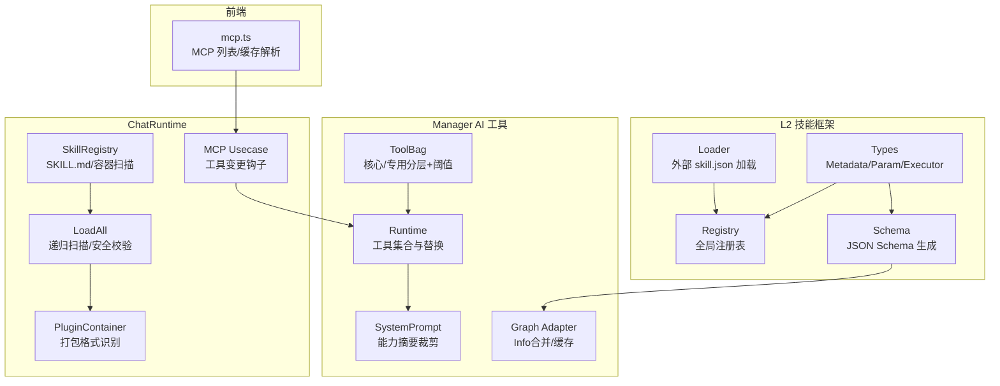
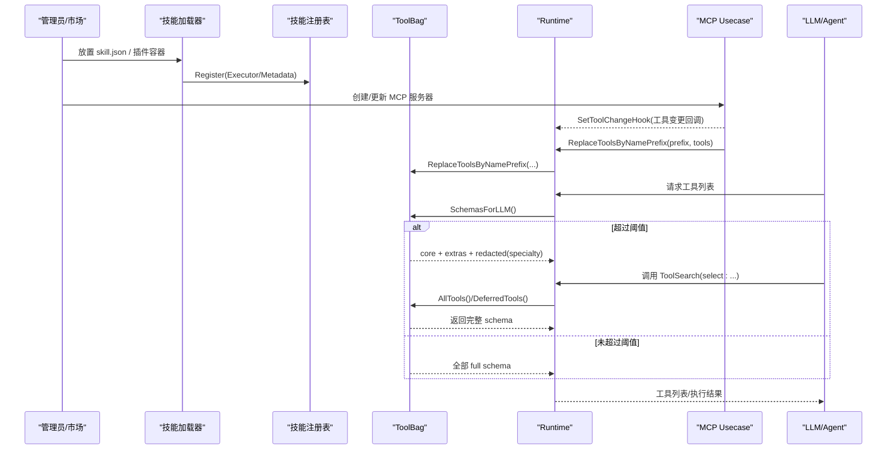
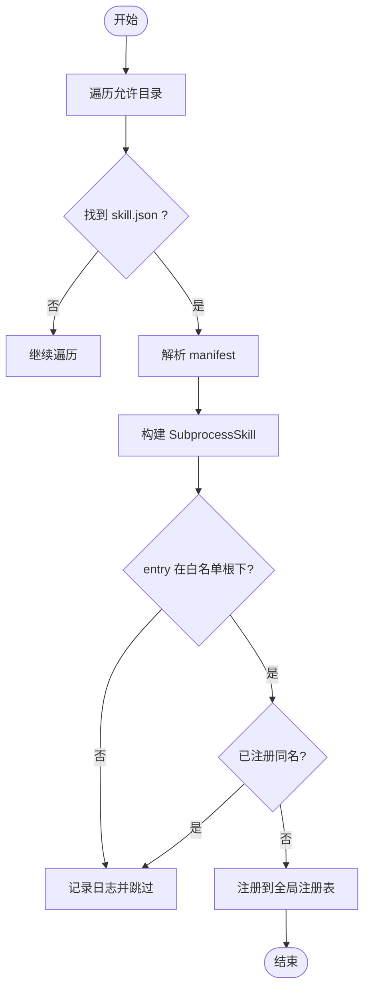
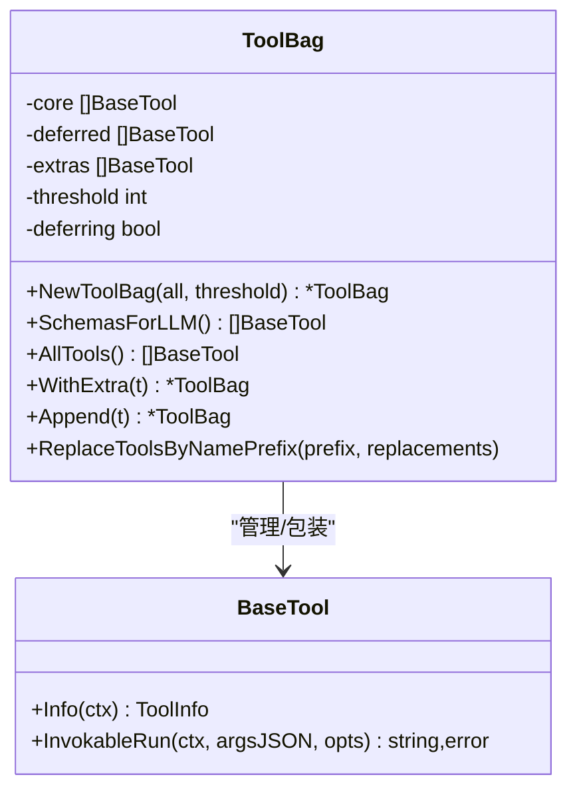
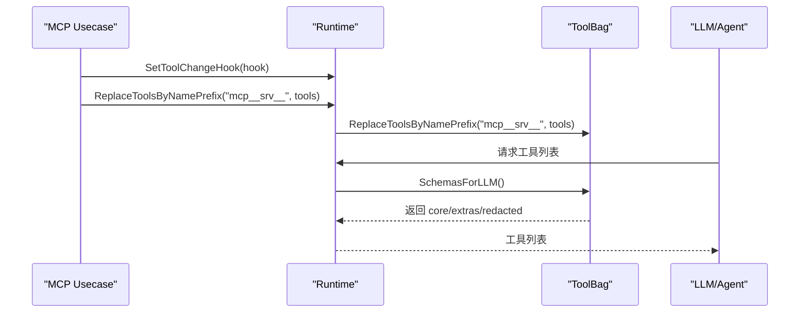
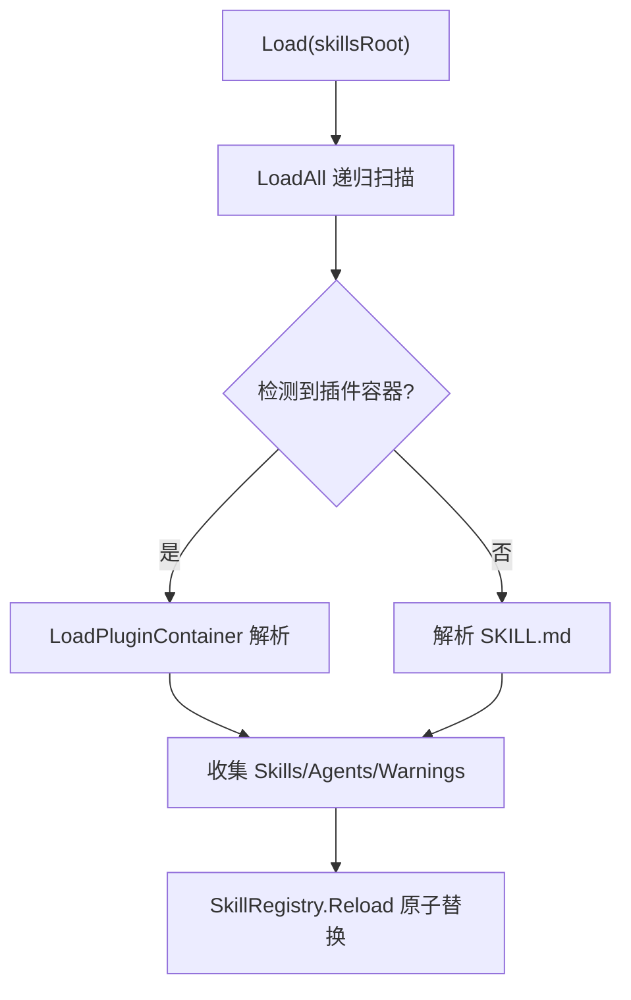
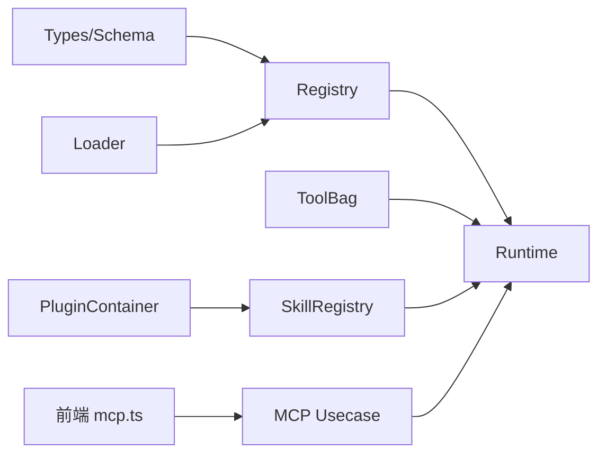

# 工具注册机制

<cite>
**本文引用的文件**
- [internal/skill/registry.go](file://internal/skill/registry.go)
- [internal/skill/loader.go](file://internal/skill/loader.go)
- [internal/skill/types.go](file://internal/skill/types.go)
- [internal/skill/schema.go](file://internal/skill/schema.go)
- [internal/manager/biz/aiops/tools/toolbag.go](file://internal/manager/biz/aiops/tools/toolbag.go)
- [internal/manager/biz/aiops/chatruntime/runtime.go](file://internal/manager/biz/aiops/chatruntime/runtime.go)
- [internal/manager/biz/aiops/chatruntime/skill_registry.go](file://internal/manager/biz/aiops/chatruntime/skill_registry.go)
- [internal/manager/biz/aiops/chatruntime/load_all.go](file://internal/manager/biz/aiops/chatruntime/load_all.go)
- [internal/manager/biz/aiops/chatruntime/plugin_container.go](file://internal/manager/biz/aiops/chatruntime/plugin_container.go)
- [internal/manager/biz/aiops/chatruntime/system_prompt.go](file://internal/manager/biz/aiops/chatruntime/system_prompt.go)
- [internal/manager/biz/aiops/graph/tool_adapter.go](file://internal/manager/biz/aiops/graph/tool_adapter.go)
- [internal/manager/biz/mcp/usecase.go](file://internal/manager/biz/mcp/usecase.go)
- [web/src/api/mcp.ts](file://web/src/api/mcp.ts)
</cite>

## 目录
1. [简介](#简介)
2. [项目结构](#项目结构)
3. [核心组件](#核心组件)
4. [架构总览](#架构总览)
5. [详细组件分析](#详细组件分析)
6. [依赖关系分析](#依赖关系分析)
7. [性能与阈值控制](#性能与阈值控制)
8. [故障排查指南](#故障排查指南)
9. [结论](#结论)
10. [附录：开发示例与集成配置](#附录开发示例与集成配置)

## 简介
本文件系统性阐述 Ongrid 的工具注册机制，覆盖动态注册流程、分类策略、版本管理、冲突检测、兼容性检查与热更新。重点包括：
- 核心工具与专用工具的区分与延迟加载（ToolBag）
- 工具元数据定义、参数校验与 JSON Schema 生成
- 插件容器与技能包扫描、安全路径校验与警告收集
- MCP 工具动态接入与运行时替换
- 能力摘要裁剪与 ToolSearch 按需拉取完整参数
- 最佳实践、测试方法与排障建议

## 项目结构
围绕“工具注册”的关键代码分布在以下模块：
- L2 设备侧技能框架：注册表、加载器、类型与 Schema
- Manager AI 工具集：ToolBag 延迟加载、运行时工具集合、系统提示能力摘要
- ChatRuntime：技能注册表、插件容器加载、MCP 工具变更钩子
- 前端：MCP 服务器管理与工具缓存解析

**图表来源**
- [internal/skill/registry.go:10-47](file://internal/skill/registry.go#L10-L47)
- [internal/skill/loader.go:13-74](file://internal/skill/loader.go#L13-L74)
- [internal/skill/types.go:99-175](file://internal/skill/types.go#L99-L175)
- [internal/skill/schema.go:5-20](file://internal/skill/schema.go#L5-L20)
- [internal/manager/biz/aiops/tools/toolbag.go:157-208](file://internal/manager/biz/aiops/tools/toolbag.go#L157-L208)
- [internal/manager/biz/aiops/chatruntime/runtime.go:374-454](file://internal/manager/biz/aiops/chatruntime/runtime.go#L374-L454)
- [internal/manager/biz/aiops/chatruntime/skill_registry.go:10-90](file://internal/manager/biz/aiops/chatruntime/skill_registry.go#L10-L90)
- [internal/manager/biz/aiops/chatruntime/load_all.go:145-172](file://internal/manager/biz/aiops/chatruntime/load_all.go#L145-L172)
- [internal/manager/biz/aiops/chatruntime/plugin_container.go:101-131](file://internal/manager/biz/aiops/chatruntime/plugin_container.go#L101-L131)
- [internal/manager/biz/mcp/usecase.go:44-92](file://internal/manager/biz/mcp/usecase.go#L44-L92)
- [web/src/api/mcp.ts:123-164](file://web/src/api/mcp.ts#L123-L164)

**章节来源**
- [internal/skill/registry.go:10-47](file://internal/skill/registry.go#L10-L47)
- [internal/skill/loader.go:13-74](file://internal/skill/loader.go#L13-L74)
- [internal/skill/types.go:99-175](file://internal/skill/types.go#L99-L175)
- [internal/skill/schema.go:5-20](file://internal/skill/schema.go#L5-L20)
- [internal/manager/biz/aiops/tools/toolbag.go:157-208](file://internal/manager/biz/aiops/tools/toolbag.go#L157-L208)
- [internal/manager/biz/aiops/chatruntime/runtime.go:374-454](file://internal/manager/biz/aiops/chatruntime/runtime.go#L374-L454)
- [internal/manager/biz/aiops/chatruntime/skill_registry.go:10-90](file://internal/manager/biz/aiops/chatruntime/skill_registry.go#L10-L90)
- [internal/manager/biz/aiops/chatruntime/load_all.go:145-172](file://internal/manager/biz/aiops/chatruntime/load_all.go#L145-L172)
- [internal/manager/biz/aiops/chatruntime/plugin_container.go:101-131](file://internal/manager/biz/aiops/chatruntime/plugin_container.go#L101-L131)
- [internal/manager/biz/mcp/usecase.go:44-92](file://internal/manager/biz/mcp/usecase.go#L44-L92)
- [web/src/api/mcp.ts:123-164](file://web/src/api/mcp.ts#L123-L164)

## 核心组件
- 技能注册表（Registry）：进程级全局注册表，提供 Register/Get/All/AllByClass，启动时完成注册，运行期并发读取；重复 Key 会 panic 以在作者阶段暴露错误。
- 外部技能加载器（Loader）：扫描指定目录下的 skill.json，构建 SubprocessSkill 并注册到全局注册表；对 entry 路径进行白名单根目录校验，拒绝越界或符号链接逃逸。
- 类型与元数据（Types/Schema）：定义 Metadata、ParamSchema、Executor 接口；Validate 严格校验 Key/Name/Description/Class/Scope/Params；BuildSchema 支持 RawSchemaProvider 自定义 JSON Schema。
- 工具包（ToolBag）：将工具分为 core（始终全量 schema）与 specialty（超过阈值时延迟加载，返回空 schema 并引导调用 ToolSearch）；支持 WithExtra、Append、ReplaceToolsByNamePrefix 等动态更新。
- ChatRuntime 工具集合：维护 graph-facing 工具列表，支持 AppendToolBag、ReplaceToolsByNamePrefix、ReplaceCatalogToolsByNamePrefix，保证 MCP 按前缀隔离更新。
- 技能注册表（SkillRegistry）：扫描 skillsRoot 及插件容器，提供 Load/Reload（热重载）、Resolve（按激活模式与策略过滤），原子替换内部切片。
- 插件容器（PluginContainer）：识别 .claude-plugin/ 或 openclaw.plugin.json 等打包格式，递归加载 SKILL.md/agents/commands，路径安全校验并记录警告。
- 系统提示能力摘要：聚合可见工具并按上限截断，提示使用 ToolSearch/select:<tool> 获取被隐藏 schema。
- Graph 适配器：合并 when_to_use 到描述，缓存 read-only 工具信息，确保 eino 图构建正确。
- MCP 工具变更钩子：当 MCP 服务器增删改时，回调通知 Runtime 更新工具目录，实现热更新。

**章节来源**
- [internal/skill/registry.go:10-127](file://internal/skill/registry.go#L10-L127)
- [internal/skill/loader.go:13-274](file://internal/skill/loader.go#L13-L274)
- [internal/skill/types.go:35-175](file://internal/skill/types.go#L35-L175)
- [internal/skill/schema.go:5-96](file://internal/skill/schema.go#L5-L96)
- [internal/manager/biz/aiops/tools/toolbag.go:15-208](file://internal/manager/biz/aiops/tools/toolbag.go#L15-L208)
- [internal/manager/biz/aiops/chatruntime/runtime.go:374-454](file://internal/manager/biz/aiops/chatruntime/runtime.go#L374-L454)
- [internal/manager/biz/aiops/chatruntime/skill_registry.go:10-240](file://internal/manager/biz/aiops/chatruntime/skill_registry.go#L10-L240)
- [internal/manager/biz/aiops/chatruntime/plugin_container.go:101-131](file://internal/manager/biz/aiops/chatruntime/plugin_container.go#L101-L131)
- [internal/manager/biz/aiops/chatruntime/system_prompt.go:141-199](file://internal/manager/biz/aiops/chatruntime/system_prompt.go#L141-L199)
- [internal/manager/biz/aiops/graph/tool_adapter.go:326-374](file://internal/manager/biz/aiops/graph/tool_adapter.go#L326-L374)
- [internal/manager/biz/mcp/usecase.go:44-92](file://internal/manager/biz/mcp/usecase.go#L44-L92)

## 架构总览
下图展示从“技能/工具发现”到“LLM 可用工具集合”的端到端流程，包括延迟加载、能力摘要与 MCP 热更新。

**图表来源**
- [internal/skill/loader.go:69-160](file://internal/skill/loader.go#L69-L160)
- [internal/skill/registry.go:26-74](file://internal/skill/registry.go#L26-L74)
- [internal/manager/biz/aiops/tools/toolbag.go:210-240](file://internal/manager/biz/aiops/tools/toolbag.go#L210-L240)
- [internal/manager/biz/aiops/chatruntime/runtime.go:416-445](file://internal/manager/biz/aiops/chatruntime/runtime.go#L416-L445)
- [internal/manager/biz/mcp/usecase.go:44-92](file://internal/manager/biz/mcp/usecase.go#L44-L92)

## 详细组件分析

### 技能注册表与外部技能加载
- 全局注册表提供进程内唯一键映射，Register 时校验元数据并拒绝重复 Key；Get/All/AllByClass 并发安全。
- Loader 遍历允许目录，解析 skill.json，构建 SubprocessSkill，校验 entry 路径在白名单根目录下，避免通过 .. 或符号链接逃逸；重复名称跳过而非崩溃，提升部署鲁棒性。

**图表来源**
- [internal/skill/loader.go:69-160](file://internal/skill/loader.go#L69-L160)
- [internal/skill/loader.go:176-254](file://internal/skill/loader.go#L176-L254)
- [internal/skill/registry.go:56-74](file://internal/skill/registry.go#L56-L74)

**章节来源**
- [internal/skill/registry.go:10-127](file://internal/skill/registry.go#L10-L127)
- [internal/skill/loader.go:69-160](file://internal/skill/loader.go#L69-L160)
- [internal/skill/loader.go:176-254](file://internal/skill/loader.go#L176-L254)

### 元数据、参数验证与 Schema 生成
- Metadata.Validate 强制 Key/Name/Description 非空，Class/Scope 限定枚举，Params 类型与数组 ItemType 校验，Required 与 Default 互斥。
- BuildSchema 优先使用 RawSchemaProvider 提供的 JSON Schema，否则由 ParamSchema.ToJSONSchema 推导 OpenAI function-calling 兼容的结构。

**章节来源**
- [internal/skill/types.go:99-175](file://internal/skill/types.go#L99-L175)
- [internal/skill/schema.go:5-96](file://internal/skill/schema.go#L5-L96)

### 工具包（ToolBag）：核心/专用分类与延迟加载
- tierByName 将工具划分为 core（始终全量 schema）与 specialty（超过阈值时延迟加载）。
- NewToolBag 根据阈值决定是否启用延迟；SchemasForLLM 在延迟开启时将 specialty 包装为 redactedTool（空 schema 并提示使用 ToolSearch）。
- WithExtra/Append/ReplaceToolsByNamePrefix 支持运行时追加与按前缀替换，避免多 MCP 服务互相影响。

**图表来源**
- [internal/manager/biz/aiops/tools/toolbag.go:157-208](file://internal/manager/biz/aiops/tools/toolbag.go#L157-L208)
- [internal/manager/biz/aiops/tools/toolbag.go:210-240](file://internal/manager/biz/aiops/tools/toolbag.go#L210-L240)
- [internal/manager/biz/aiops/tools/toolbag.go:339-371](file://internal/manager/biz/aiops/tools/toolbag.go#L339-L371)

**章节来源**
- [internal/manager/biz/aiops/tools/toolbag.go:15-208](file://internal/manager/biz/aiops/tools/toolbag.go#L15-L208)
- [internal/manager/biz/aiops/tools/toolbag.go:210-240](file://internal/manager/biz/aiops/tools/toolbag.go#L210-L240)
- [internal/manager/biz/aiops/tools/toolbag.go:339-371](file://internal/manager/biz/aiops/tools/toolbag.go#L339-L371)

### ChatRuntime 工具集合与 MCP 热更新
- Runtime 维护 graph-facing 工具列表，支持 AppendToolBag（追加协调器专属工具）与 ReplaceToolsByNamePrefix（按前缀替换，隔离不同 MCP 服务器）。
- ReplaceCatalogToolsByNamePrefix 同步更新 ToolSearch 使用的原始目录，确保搜索返回完整 schema。
- MCP Usecase 提供 ToolChangeHook，在服务器变更时通知 Runtime 更新工具目录，实现热更新。

**图表来源**
- [internal/manager/biz/aiops/chatruntime/runtime.go:374-454](file://internal/manager/biz/aiops/chatruntime/runtime.go#L374-L454)
- [internal/manager/biz/mcp/usecase.go:44-92](file://internal/manager/biz/mcp/usecase.go#L44-L92)

**章节来源**
- [internal/manager/biz/aiops/chatruntime/runtime.go:374-454](file://internal/manager/biz/aiops/chatruntime/runtime.go#L374-L454)
- [internal/manager/biz/mcp/usecase.go:44-92](file://internal/manager/biz/mcp/usecase.go#L44-L92)

### 技能注册表与插件容器加载
- SkillRegistry.Load/Reload 扫描 skillsRoot 与额外根，原子替换内部切片，支持 marketplace 安装/卸载后热重载。
- LoadAll 递归扫描，识别插件容器（.claude-plugin/ 或 openclaw.plugin.json），解析 SKILL.md/agents/commands；路径安全校验，拒绝符号链接逃逸与 .. 穿越，记录警告。
- Resolve 按激活模式（always/keyword）与策略（AllowedClasses）过滤工具，返回副本以避免并发修改。

**图表来源**
- [internal/manager/biz/aiops/chatruntime/skill_registry.go:32-90](file://internal/manager/biz/aiops/chatruntime/skill_registry.go#L32-L90)
- [internal/manager/biz/aiops/chatruntime/load_all.go:145-172](file://internal/manager/biz/aiops/chatruntime/load_all.go#L145-L172)
- [internal/manager/biz/aiops/chatruntime/plugin_container.go:101-131](file://internal/manager/biz/aiops/chatruntime/plugin_container.go#L101-L131)

**章节来源**
- [internal/manager/biz/aiops/chatruntime/skill_registry.go:32-90](file://internal/manager/biz/aiops/chatruntime/skill_registry.go#L32-L90)
- [internal/manager/biz/aiops/chatruntime/load_all.go:145-172](file://internal/manager/biz/aiops/chatruntime/load_all.go#L145-L172)
- [internal/manager/biz/aiops/chatruntime/plugin_container.go:101-131](file://internal/manager/biz/aiops/chatruntime/plugin_container.go#L101-L131)

### 系统提示能力摘要与 ToolSearch
- 能力摘要聚合当前会话可见工具，统计来源与类别，列出直接可读工具；超过上限时截断并提示使用 ToolSearch/select:<tool> 获取完整 schema。
- ToolSearch 支持 select:<tool> 精确匹配与关键词匹配，返回完整 schema，供 LLM 后续调用。

**章节来源**
- [internal/manager/biz/aiops/chatruntime/system_prompt.go:141-199](file://internal/manager/biz/aiops/chatruntime/system_prompt.go#L141-L199)
- [internal/manager/biz/aiops/tools/tool_search_tool.go:249-310](file://internal/manager/biz/aiops/tools/tool_search_tool.go#L249-L310)

### Graph 适配器与 Info 合并
- einoToolAdapter 将 ToolInfo 的 WhenToUse 合并到 Description，缓存 read-only 工具信息以减少重复调用；若上游工具返回无效 JSON Schema，则报错阻止图构建。

**章节来源**
- [internal/manager/biz/aiops/graph/tool_adapter.go:326-374](file://internal/manager/biz/aiops/graph/tool_adapter.go#L326-L374)

## 依赖关系分析
- 注册表与加载器：Loader 依赖 Registry 的全局注册；Types/Schema 提供元数据与参数结构。
- ToolBag 与 Runtime：Runtime 持有 ToolBag 并提供运行时替换；ToolBag 负责分类与延迟加载。
- SkillRegistry 与插件容器：LoadAll 与 PluginContainer 协同扫描与解析；SkillRegistry 提供过滤与热重载。
- MCP 与 Runtime：Usecase 通过 Hook 通知 Runtime 更新工具目录，实现热更新。
- 前端与后端：前端通过 API 管理 MCP 服务器并解析工具缓存。

**图表来源**
- [internal/skill/types.go:99-175](file://internal/skill/types.go#L99-L175)
- [internal/skill/schema.go:5-96](file://internal/skill/schema.go#L5-L96)
- [internal/skill/registry.go:10-127](file://internal/skill/registry.go#L10-L127)
- [internal/skill/loader.go:69-160](file://internal/skill/loader.go#L69-L160)
- [internal/manager/biz/aiops/tools/toolbag.go:157-208](file://internal/manager/biz/aiops/tools/toolbag.go#L157-L208)
- [internal/manager/biz/aiops/chatruntime/runtime.go:374-454](file://internal/manager/biz/aiops/chatruntime/runtime.go#L374-L454)
- [internal/manager/biz/aiops/chatruntime/skill_registry.go:32-90](file://internal/manager/biz/aiops/chatruntime/skill_registry.go#L32-L90)
- [internal/manager/biz/aiops/chatruntime/plugin_container.go:101-131](file://internal/manager/biz/aiops/chatruntime/plugin_container.go#L101-L131)
- [internal/manager/biz/mcp/usecase.go:44-92](file://internal/manager/biz/mcp/usecase.go#L44-L92)
- [web/src/api/mcp.ts:123-164](file://web/src/api/mcp.ts#L123-L164)

**章节来源**
- [internal/skill/registry.go:10-127](file://internal/skill/registry.go#L10-L127)
- [internal/skill/loader.go:69-160](file://internal/skill/loader.go#L69-L160)
- [internal/manager/biz/aiops/tools/toolbag.go:157-208](file://internal/manager/biz/aiops/tools/toolbag.go#L157-L208)
- [internal/manager/biz/aiops/chatruntime/runtime.go:374-454](file://internal/manager/biz/aiops/chatruntime/runtime.go#L374-L454)
- [internal/manager/biz/aiops/chatruntime/skill_registry.go:32-90](file://internal/manager/biz/aiops/chatruntime/skill_registry.go#L32-L90)
- [internal/manager/biz/aiops/chatruntime/plugin_container.go:101-131](file://internal/manager/biz/aiops/chatruntime/plugin_container.go#L101-L131)
- [internal/manager/biz/mcp/usecase.go:44-92](file://internal/manager/biz/mcp/usecase.go#L44-L92)
- [web/src/api/mcp.ts:123-164](file://web/src/api/mcp.ts#L123-L164)

## 性能与阈值控制
- 延迟加载阈值：ToolBag 默认阈值用于控制何时启用延迟加载；超过阈值时 specialty 工具返回空 schema，减少 LLM 提示体积。
- 能力摘要裁剪：系统提示中能力列表有最大条目限制，超出部分提示使用 ToolSearch/select:<tool>。
- 运行时替换：按前缀替换工具，避免全量重建，降低开销。

**章节来源**
- [internal/manager/biz/aiops/tools/toolbag.go:15-208](file://internal/manager/biz/aiops/tools/toolbag.go#L15-L208)
- [internal/manager/biz/aiops/chatruntime/system_prompt.go:141-199](file://internal/manager/biz/aiops/chatruntime/system_prompt.go#L141-L199)
- [internal/manager/biz/aiops/chatruntime/runtime.go:416-445](file://internal/manager/biz/aiops/chatruntime/runtime.go#L416-L445)

## 故障排查指南
- 重复 Key 或无效元数据：注册阶段 panic，需在作者阶段修复；检查 Key 命名规则与必填字段。
- 外部技能 entry 越界：Loader 拒绝不在白名单根目录的 entry，检查路径与符号链接。
- 插件容器路径逃逸：LoadPluginContainer 记录 escapes_root 警告并丢弃危险文件，检查符号链接与 .. 组件。
- 工具不可用：确认 ToolBag 是否处于延迟模式，使用 ToolSearch/select:<tool> 获取完整 schema；检查 MCP 服务器是否正确连接与更新。
- 能力摘要缺失：检查系统提示中的能力列表是否被截断，必要时调整阈值或优化工具数量。

**章节来源**
- [internal/skill/registry.go:56-74](file://internal/skill/registry.go#L56-L74)
- [internal/skill/loader.go:176-254](file://internal/skill/loader.go#L176-L254)
- [internal/manager/biz/aiops/chatruntime/plugin_container.go:101-131](file://internal/manager/biz/aiops/chatruntime/plugin_container.go#L101-L131)
- [internal/manager/biz/aiops/chatruntime/system_prompt.go:141-199](file://internal/manager/biz/aiops/chatruntime/system_prompt.go#L141-L199)

## 结论
Ongrid 的工具注册机制通过分层分类、延迟加载、能力摘要裁剪与 MCP 热更新，实现了高扩展性与高性能。结合严格的元数据校验与安全路径检查，确保工具生态的稳定与安全。建议在新增工具时遵循分类策略与阈值控制，充分利用 ToolSearch 与能力摘要，以提升 LLM 调用效率与可维护性。

## 附录：开发示例与集成配置
- 新增内置技能：实现 Executor 接口，提供 Metadata 与 Execute；在 init 中调用 Register；如需自定义参数结构，实现 RawSchemaProvider。
- 新增外部技能：编写 skill.json，确保 name/description/entry/class/category 合法；将二进制放入允许目录，确保 entry 路径在白名单根下。
- 配置延迟加载阈值：通过环境变量调整 ToolBag 阈值，控制何时启用延迟加载。
- 集成 MCP：通过前端 API 管理 MCP 服务器；后端通过 ToolChangeHook 更新 Runtime 工具目录，实现热更新。
- 测试方法：使用单元测试验证注册表行为、加载器路径安全、ToolBag 延迟加载与 ToolSearch 查询；使用集成测试验证 MCP 服务器增删改后的工具更新。

**章节来源**
- [internal/skill/types.go:190-203](file://internal/skill/types.go#L190-L203)
- [internal/skill/schema.go:5-20](file://internal/skill/schema.go#L5-L20)
- [internal/skill/loader.go:69-160](file://internal/skill/loader.go#L69-L160)
- [internal/manager/biz/aiops/tools/toolbag.go:15-208](file://internal/manager/biz/aiops/tools/toolbag.go#L15-L208)
- [internal/manager/biz/mcp/usecase.go:44-92](file://internal/manager/biz/mcp/usecase.go#L44-L92)
- [web/src/api/mcp.ts:123-164](file://web/src/api/mcp.ts#L123-L164)