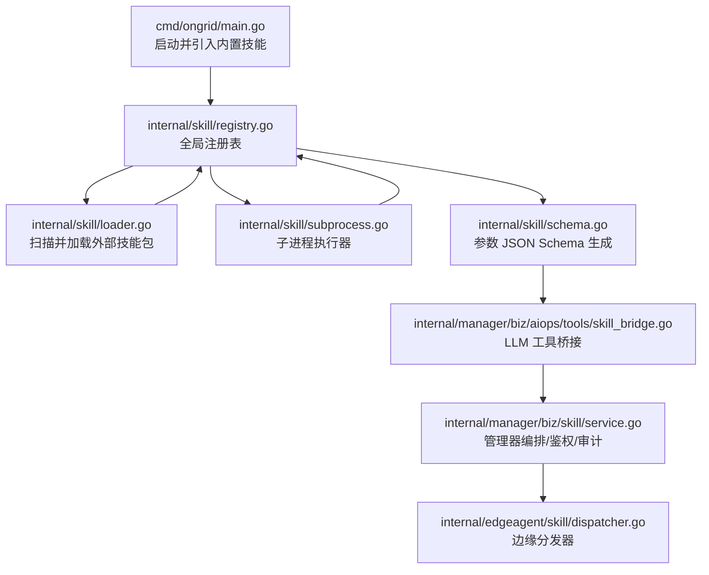
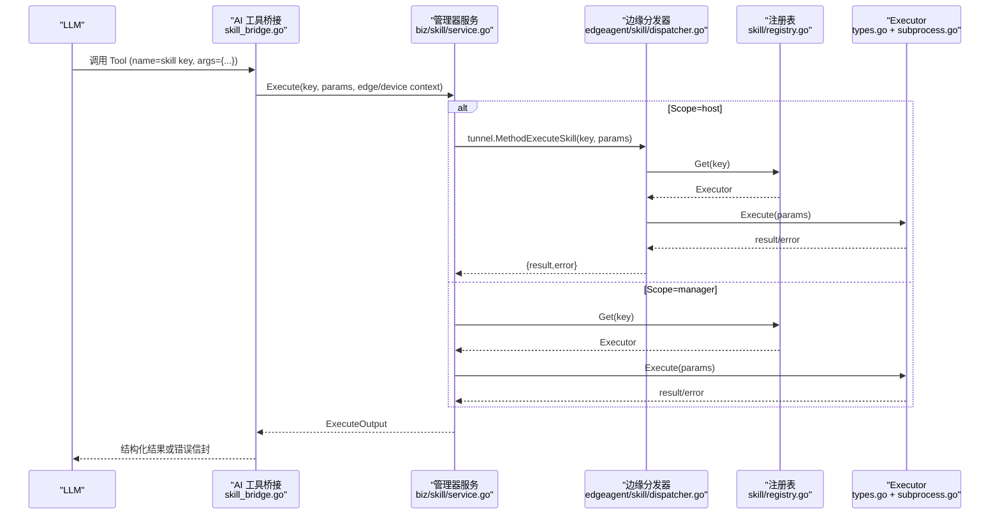
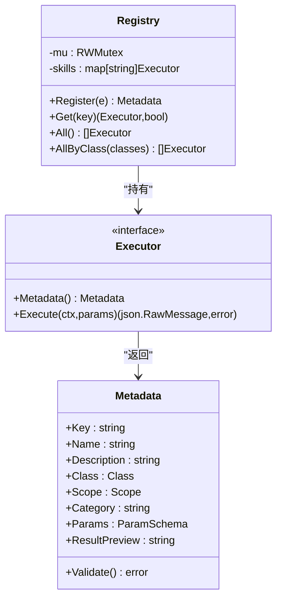
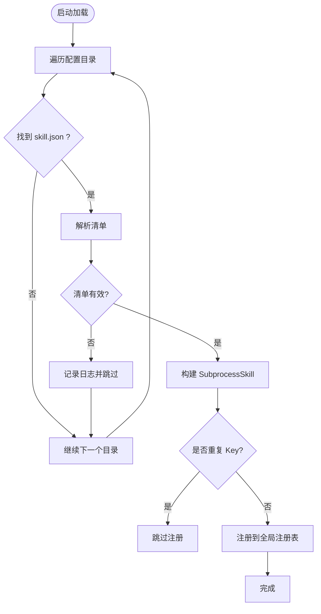
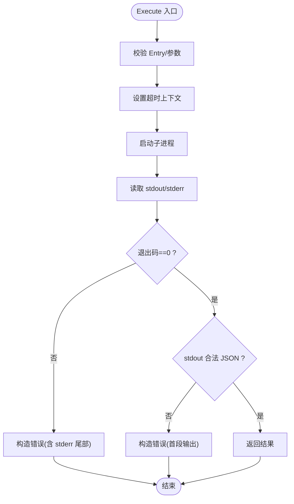
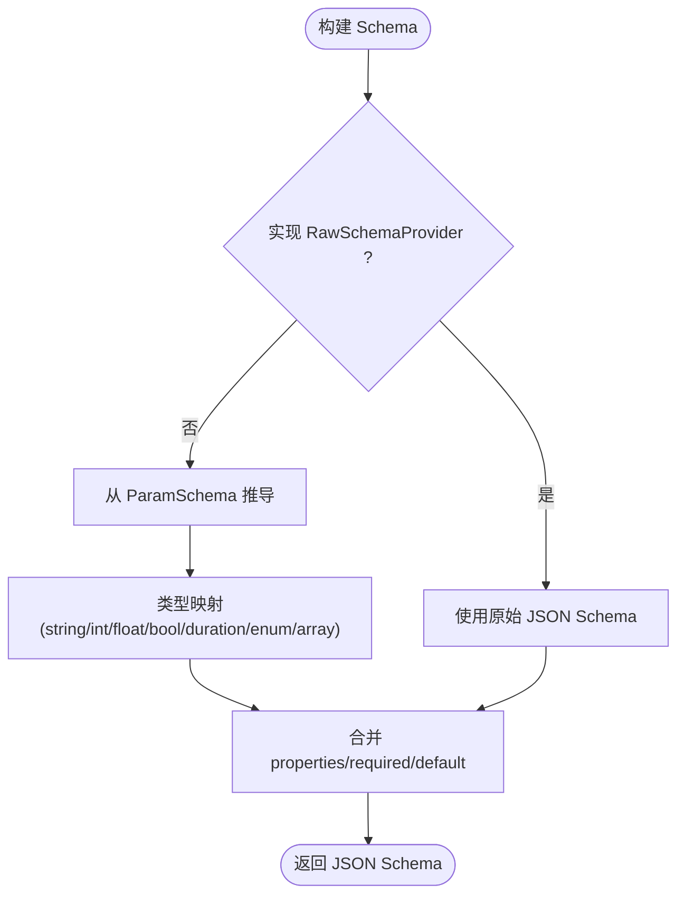
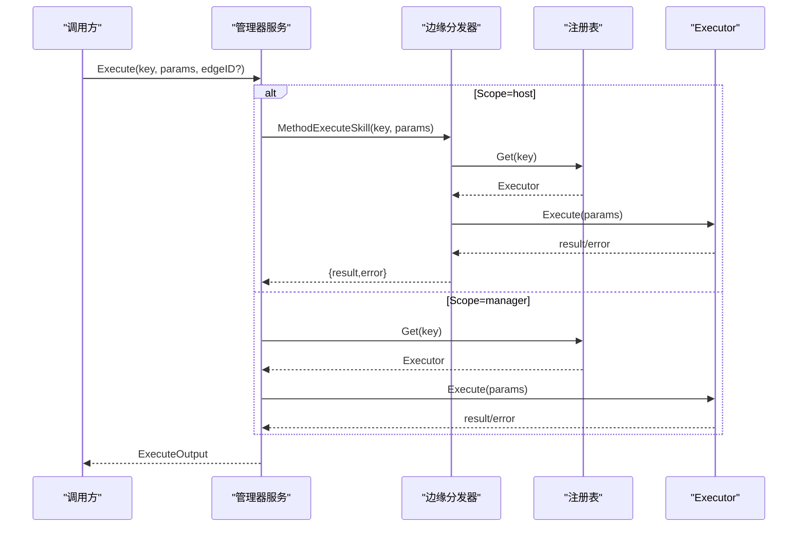
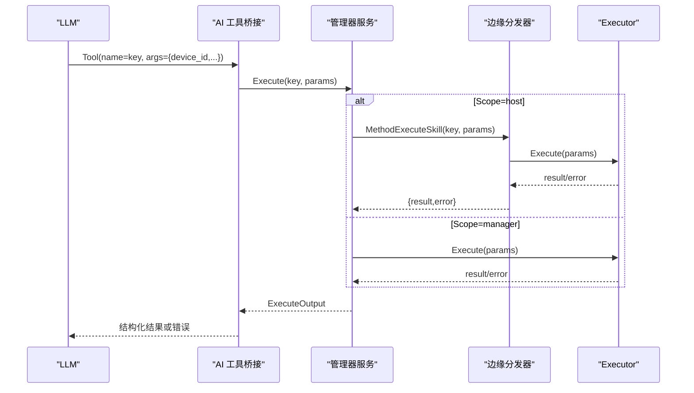
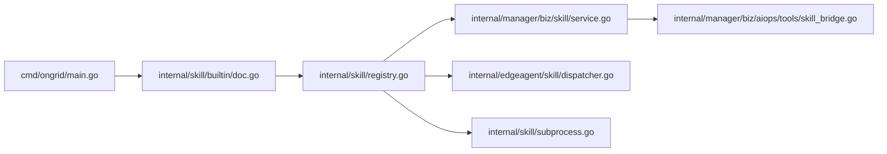

# 工具调度器

<cite>
**本文引用的文件**
- [internal/skill/registry.go](file://internal/skill/registry.go)
- [internal/skill/loader.go](file://internal/skill/loader.go)
- [internal/skill/types.go](file://internal/skill/types.go)
- [internal/skill/subprocess.go](file://internal/skill/subprocess.go)
- [internal/skill/schema.go](file://internal/skill/schema.go)
- [internal/skill/builtin/doc.go](file://internal/skill/builtin/doc.go)
- [internal/edgeagent/skill/dispatcher.go](file://internal/edgeagent/skill/dispatcher.go)
- [internal/manager/biz/skill/service.go](file://internal/manager/biz/skill/service.go)
- [internal/manager/biz/aiops/tools/skill_bridge.go](file://internal/manager/biz/aiops/tools/skill_bridge.go)
- [cmd/ongrid/main.go](file://cmd/ongrid/main.go)
</cite>

## 目录
1. [简介](#简介)
2. [项目结构](#项目结构)
3. [核心组件](#核心组件)
4. [架构总览](#架构总览)
5. [详细组件分析](#详细组件分析)
6. [依赖关系分析](#依赖关系分析)
7. [性能与并发控制](#性能与并发控制)
8. [故障排查指南](#故障排查指南)
9. [结论](#结论)
10. [附录：开发、测试与部署](#附录开发测试与部署)

## 简介
本文件面向“工具调度器”（Skill 框架）的完整技术文档，聚焦以下目标：
- 工具注册机制、动态加载与版本管理
- 工具调用链、参数验证与结果处理流程
- 内置工具与自定义工具的扩展机制、插件架构与安全隔离
- 执行并发控制、超时管理与资源限制
- 工具依赖解析、冲突检测与兼容性检查
- 工具开发指南、测试方法与部署配置
- 常见工具使用示例与最佳实践

该框架将“技能（Skill）”作为最小可执行单元，统一在管理器（Manager）与边缘节点（Edge）之间进行发现、编排与执行。通过元数据驱动的方式自动生成 LLM 工具描述、HTTP API、UI 表单与权限门控，实现“新增一个技能即自动上线”。

## 项目结构
围绕工具调度器的关键代码分布在如下模块：
- internal/skill：核心框架（注册表、类型定义、子进程执行器、JSON Schema 生成、外部包加载器）
- internal/skill/builtin：内置技能集合（通过空白导入触发 init 注册）
- internal/edgeagent/skill：边缘侧分发器（接收云端 RPC 并路由到本地 Executor）
- internal/manager/biz/skill：管理器侧服务（编排、鉴权、审计、远程调用）
- internal/manager/biz/aiops/tools：AI 工具桥接（将安全类技能暴露为 LLM 可调用的 Tool）
- cmd/ongrid/main：主程序入口（引入内置技能包以填充全局注册表）

**图表来源**
- [cmd/ongrid/main.go:198-200](file://cmd/ongrid/main.go#L198-L200)
- [internal/skill/registry.go:10-24](file://internal/skill/registry.go#L10-L24)
- [internal/skill/loader.go:69-110](file://internal/skill/loader.go#L69-L110)
- [internal/skill/subprocess.go:30-78](file://internal/skill/subprocess.go#L30-L78)
- [internal/skill/schema.go:5-20](file://internal/skill/schema.go#L5-L20)
- [internal/manager/biz/skill/service.go:187-261](file://internal/manager/biz/skill/service.go#L187-L261)
- [internal/edgeagent/skill/dispatcher.go:16-44](file://internal/edgeagent/skill/dispatcher.go#L16-L44)
- [internal/manager/biz/aiops/tools/skill_bridge.go:35-75](file://internal/manager/biz/aiops/tools/skill_bridge.go#L35-L75)

**章节来源**
- [cmd/ongrid/main.go:198-200](file://cmd/ongrid/main.go#L198-L200)
- [internal/skill/registry.go:10-24](file://internal/skill/registry.go#L10-L24)
- [internal/skill/loader.go:69-110](file://internal/skill/loader.go#L69-L110)
- [internal/skill/subprocess.go:30-78](file://internal/skill/subprocess.go#L30-L78)
- [internal/skill/schema.go:5-20](file://internal/skill/schema.go#L5-L20)
- [internal/manager/biz/skill/service.go:187-261](file://internal/manager/biz/skill/service.go#L187-L261)
- [internal/edgeagent/skill/dispatcher.go:16-44](file://internal/edgeagent/skill/dispatcher.go#L16-L44)
- [internal/manager/biz/aiops/tools/skill_bridge.go:35-75](file://internal/manager/biz/aiops/tools/skill_bridge.go#L35-L75)

## 核心组件
- 注册表（Registry）：进程级技能目录，提供 Register/Get/All/AllByClass 等能力，保证并发安全。
- 类型与元数据（Types）：定义 Class（safe/mutating/dangerous）、Scope（host/manager）、Metadata、ParamSchema 等。
- 子进程执行器（SubprocessSkill）：以独立进程运行外部脚本/二进制，stdin/stdout 传输 JSON，支持超时、环境变量白名单、输出大小限制。
- 加载器（Loader）：扫描指定目录下的 skill.json 清单，构建 SubprocessSkill 并注册到全局注册表，具备路径白名单校验与环境隔离。
- Schema 生成（Schema）：从 ParamSchema 或 RawSchemaProvider 生成 LLM 可用的 JSON Schema。
- 管理器服务（Manager Service）：编排执行、权限门控、审计记录、云端->边缘 RPC 转发。
- 边缘分发器（Edge Dispatcher）：接收 MethodExecuteSkill，按 Key 查找 Executor 并执行，返回结构化结果或错误。
- AI 工具桥接（Skill Bridge）：将 safe 类技能注册为 LLM Tool，注入 device_id 等上下文，并封装执行逻辑。

**章节来源**
- [internal/skill/registry.go:10-47](file://internal/skill/registry.go#L10-L47)
- [internal/skill/types.go:35-61](file://internal/skill/types.go#L35-L61)
- [internal/skill/types.go:99-175](file://internal/skill/types.go#L99-L175)
- [internal/skill/subprocess.go:30-78](file://internal/skill/subprocess.go#L30-L78)
- [internal/skill/loader.go:13-53](file://internal/skill/loader.go#L13-L53)
- [internal/skill/schema.go:5-20](file://internal/skill/schema.go#L5-L20)
- [internal/manager/biz/skill/service.go:187-261](file://internal/manager/biz/skill/service.go#L187-L261)
- [internal/edgeagent/skill/dispatcher.go:16-44](file://internal/edgeagent/skill/dispatcher.go#L16-L44)
- [internal/manager/biz/aiops/tools/skill_bridge.go:35-75](file://internal/manager/biz/aiops/tools/skill_bridge.go#L35-L75)

## 架构总览
下图展示了从 LLM 调用到边缘执行的端到端流程，以及管理器与边缘之间的职责划分。

**图表来源**
- [internal/manager/biz/aiops/tools/skill_bridge.go:146-200](file://internal/manager/biz/aiops/tools/skill_bridge.go#L146-L200)
- [internal/manager/biz/skill/service.go:187-261](file://internal/manager/biz/skill/service.go#L187-L261)
- [internal/edgeagent/skill/dispatcher.go:16-44](file://internal/edgeagent/skill/dispatcher.go#L16-L44)
- [internal/skill/registry.go:35-47](file://internal/skill/registry.go#L35-L47)
- [internal/skill/types.go:190-203](file://internal/skill/types.go#L190-L203)

## 详细组件分析

### 注册表与生命周期
- 全局注册表维护所有已注册的 Executor，提供并发安全的读取与写入。
- 注册阶段在 init() 完成，生产环境只读；重复 Key 或无效元数据会 panic，确保作者级错误尽早暴露。
- AllByClass 用于筛选不同权限等级的技能（如仅 safe 类暴露给 LLM）。

**图表来源**
- [internal/skill/registry.go:10-47](file://internal/skill/registry.go#L10-L47)
- [internal/skill/types.go:99-175](file://internal/skill/types.go#L99-L175)
- [internal/skill/types.go:190-203](file://internal/skill/types.go#L190-L203)

**章节来源**
- [internal/skill/registry.go:10-47](file://internal/skill/registry.go#L10-L47)
- [internal/skill/types.go:99-175](file://internal/skill/types.go#L99-L175)

### 动态加载与插件架构
- Loader 扫描配置的目录树，解析每个 skill.json 清单，构建 SubprocessSkill 并注册。
- 安全策略：Entry 必须位于允许根目录下（防逃逸），环境变量白名单（默认不继承 PATH），子进程超时与输出大小限制。
- 去重与容错：重复 Key 跳过；单个清单解析失败不影响其他技能加载。

**图表来源**
- [internal/skill/loader.go:69-160](file://internal/skill/loader.go#L69-L160)
- [internal/skill/loader.go:176-254](file://internal/skill/loader.go#L176-L254)

**章节来源**
- [internal/skill/loader.go:69-160](file://internal/skill/loader.go#L69-L160)
- [internal/skill/loader.go:176-254](file://internal/skill/loader.go#L176-L254)

### 子进程执行器与安全隔离
- 子进程执行器以独立进程运行外部可执行文件，stdin 传入参数 JSON，stdout 返回结果 JSON。
- 安全特性：
  - Entry 必须绝对路径且位于允许根目录（由 Loader 强制）
  - 环境变量白名单（默认空，需显式 opt-in）
  - 超时控制（默认 30s）
  - stdout/stderr 大小限制（防止内存耗尽）
- 错误分类：参数校验错误、超时、非零退出码、非法 JSON 输出。

**图表来源**
- [internal/skill/subprocess.go:99-172](file://internal/skill/subprocess.go#L99-L172)
- [internal/skill/subprocess.go:207-238](file://internal/skill/subprocess.go#L207-L238)

**章节来源**
- [internal/skill/subprocess.go:99-172](file://internal/skill/subprocess.go#L99-L172)
- [internal/skill/subprocess.go:207-238](file://internal/skill/subprocess.go#L207-L238)

### 参数验证与 Schema 生成
- ParamSchema 映射为 OpenAI function-calling 兼容的 JSON Schema。
- 支持 RawSchemaProvider 接口，允许复杂 schema（数组、嵌套对象、oneOf）直接声明。
- 管理器侧根据 Scope 注入额外字段（如 host 类技能注入 device_id）。

**图表来源**
- [internal/skill/schema.go:5-20](file://internal/skill/schema.go#L5-L20)
- [internal/skill/schema.go:22-96](file://internal/skill/schema.go#L22-L96)
- [internal/manager/biz/aiops/tools/skill_bridge.go:77-144](file://internal/manager/biz/aiops/tools/skill_bridge.go#L77-L144)

**章节来源**
- [internal/skill/schema.go:5-20](file://internal/skill/schema.go#L5-L20)
- [internal/skill/schema.go:22-96](file://internal/skill/schema.go#L22-L96)
- [internal/manager/biz/aiops/tools/skill_bridge.go:77-144](file://internal/manager/biz/aiops/tools/skill_bridge.go#L77-L144)

### 管理器编排与边缘分发
- 管理器服务负责：
  - 列出/获取技能元数据
  - 权限门控（基于 Class）
  - 审计记录（开始/结束时间、参数、结果、错误）
  - 根据 Scope 选择本地执行或远程调用
- 边缘分发器负责：
  - 解析请求体
  - 按 Key 查找 Executor
  - 执行并返回结构化响应（result 或 error）

**图表来源**
- [internal/manager/biz/skill/service.go:187-261](file://internal/manager/biz/skill/service.go#L187-L261)
- [internal/edgeagent/skill/dispatcher.go:16-44](file://internal/edgeagent/skill/dispatcher.go#L16-L44)
- [internal/skill/registry.go:35-47](file://internal/skill/registry.go#L35-L47)

**章节来源**
- [internal/manager/biz/skill/service.go:187-261](file://internal/manager/biz/skill/service.go#L187-L261)
- [internal/edgeagent/skill/dispatcher.go:16-44](file://internal/edgeagent/skill/dispatcher.go#L16-L44)
- [internal/skill/registry.go:35-47](file://internal/skill/registry.go#L35-L47)

### AI 工具桥接与 LLM 集成
- 将 safe 类技能注册为 LLM Tool，Tool 名称=技能 Key，描述=技能 Description，Schema 由 ParamSchema 或 RawSchemaProvider 生成。
- 对 host 类技能注入 device_id（设备标识），并在执行前解析为实际 edge_id。
- 管理器侧执行后返回结构化结果或错误信封，便于 LLM 消费。

**图表来源**
- [internal/manager/biz/aiops/tools/skill_bridge.go:35-75](file://internal/manager/biz/aiops/tools/skill_bridge.go#L35-L75)
- [internal/manager/biz/aiops/tools/skill_bridge.go:146-200](file://internal/manager/biz/aiops/tools/skill_bridge.go#L146-L200)
- [internal/manager/biz/skill/service.go:187-261](file://internal/manager/biz/skill/service.go#L187-L261)
- [internal/edgeagent/skill/dispatcher.go:16-44](file://internal/edgeagent/skill/dispatcher.go#L16-L44)

**章节来源**
- [internal/manager/biz/aiops/tools/skill_bridge.go:35-75](file://internal/manager/biz/aiops/tools/skill_bridge.go#L35-L75)
- [internal/manager/biz/aiops/tools/skill_bridge.go:146-200](file://internal/manager/biz/aiops/tools/skill_bridge.go#L146-L200)
- [internal/manager/biz/skill/service.go:187-261](file://internal/manager/biz/skill/service.go#L187-L261)
- [internal/edgeagent/skill/dispatcher.go:16-44](file://internal/edgeagent/skill/dispatcher.go#L16-L44)

## 依赖关系分析
- 管理器主程序引入内置技能包，触发其 init() 向全局注册表注册 Executor。
- 管理器服务依赖注册表枚举技能、按 Scope 分发执行。
- 边缘分发器依赖注册表按 Key 查找 Executor。
- 子进程执行器依赖系统 exec 与 IO 限制。
- AI 工具桥接依赖管理器服务与注册表，生成 LLM 可用工具。

**图表来源**
- [cmd/ongrid/main.go:198-200](file://cmd/ongrid/main.go#L198-L200)
- [internal/skill/builtin/doc.go:1-26](file://internal/skill/builtin/doc.go#L1-L26)
- [internal/skill/registry.go:10-47](file://internal/skill/registry.go#L10-L47)
- [internal/manager/biz/skill/service.go:187-261](file://internal/manager/biz/skill/service.go#L187-L261)
- [internal/edgeagent/skill/dispatcher.go:16-44](file://internal/edgeagent/skill/dispatcher.go#L16-L44)
- [internal/skill/subprocess.go:30-78](file://internal/skill/subprocess.go#L30-L78)
- [internal/manager/biz/aiops/tools/skill_bridge.go:35-75](file://internal/manager/biz/aiops/tools/skill_bridge.go#L35-L75)

**章节来源**
- [cmd/ongrid/main.go:198-200](file://cmd/ongrid/main.go#L198-L200)
- [internal/skill/builtin/doc.go:1-26](file://internal/skill/builtin/doc.go#L1-L26)
- [internal/skill/registry.go:10-47](file://internal/skill/registry.go#L10-L47)
- [internal/manager/biz/skill/service.go:187-261](file://internal/manager/biz/skill/service.go#L187-L261)
- [internal/edgeagent/skill/dispatcher.go:16-44](file://internal/edgeagent/skill/dispatcher.go#L16-L44)
- [internal/skill/subprocess.go:30-78](file://internal/skill/subprocess.go#L30-L78)
- [internal/manager/biz/aiops/tools/skill_bridge.go:35-75](file://internal/manager/biz/aiops/tools/skill_bridge.go#L35-L75)

## 性能与并发控制
- 并发安全：注册表使用 RWMutex，注册阶段单线程，运行时并发读。
- 超时管理：
  - 子进程执行器默认 30s 超时，可通过清单配置覆盖。
  - 管理器侧工具装饰器支持超时包装，超时错误明确标记。
- 资源限制：
  - 子进程 stdout/stderr 大小限制，防止内存耗尽。
  - 环境变量白名单，避免泄露敏感信息。
- 并发控制建议：
  - 对高并发场景，建议在管理器层增加每工具调用上限（例如令牌桶/信号量），避免下游资源被压垮。
  - 对长耗时任务，结合队列与重试策略，保障稳定性。

[本节为通用指导，无需特定文件引用]

## 故障排查指南
- 未知技能 Key：边缘分发器返回“unknown skill”错误，检查注册表是否正确加载。
- 清单解析失败：加载器记录日志并跳过，检查 skill.json 格式与必填字段。
- 子进程执行失败：
  - 非零退出码：查看 stderr 尾部定位问题。
  - 超时：检查子进程逻辑与超时阈值。
  - 非法 JSON 输出：确认子进程输出符合 JSON 规范。
- 权限门控：mutating/dangerous 类技能需要更高权限或审批流程，检查调用者角色与策略。
- 审计日志：通过管理器审计事件核对每次调用的参数、结果与错误。

**章节来源**
- [internal/edgeagent/skill/dispatcher.go:16-44](file://internal/edgeagent/skill/dispatcher.go#L16-L44)
- [internal/skill/loader.go:112-160](file://internal/skill/loader.go#L112-L160)
- [internal/skill/subprocess.go:99-172](file://internal/skill/subprocess.go#L99-L172)
- [internal/manager/biz/skill/service.go:41-59](file://internal/manager/biz/skill/service.go#L41-L59)

## 结论
工具调度器通过统一的注册表、元数据驱动与子进程隔离，实现了安全、可扩展、易集成的技能体系。管理器与边缘解耦，支持云端与设备侧协同执行；通过权限分级、审计与超时/资源限制，保障了生产环境的稳定性与合规性。AI 工具桥接使得 LLM 能够以函数调用方式无缝使用平台能力。

[本节为总结，无需特定文件引用]

## 附录：开发、测试与部署

### 工具开发指南
- 新建技能步骤：
  - 编写 Executor 实现（Metadata + Execute）
  - 在 init() 中调用 Register 注册
  - 若为外部脚本，创建 skill.json 清单并放入允许目录
- 元数据要点：
  - Key 使用 lower_snake，唯一且稳定
  - Class 明确标注（safe/mutating/dangerous）
  - Scope 选择 host 或 manager
  - Params 使用 ParamSchema 或 RawSchemaProvider 提供 JSON Schema
- 安全建议：
  - 子进程环境变量白名单最小化
  - 合理设置超时与输出大小
  - 严格校验输入参数

**章节来源**
- [internal/skill/types.go:99-175](file://internal/skill/types.go#L99-L175)
- [internal/skill/subprocess.go:30-78](file://internal/skill/subprocess.go#L30-L78)
- [internal/skill/loader.go:176-254](file://internal/skill/loader.go#L176-L254)

### 测试方法
- 单元测试：
  - 使用 NewRegistryForTest 构建隔离注册表
  - 注入 fake runner 模拟子进程行为
- 集成测试：
  - 验证管理器->边缘 RPC 链路
  - 校验审计事件与权限门控

**章节来源**
- [internal/skill/registry.go:121-127](file://internal/skill/registry.go#L121-L127)
- [internal/skill/subprocess.go:80-85](file://internal/skill/subprocess.go#L80-L85)

### 部署配置
- 管理器主程序引入内置技能包，确保注册表初始化。
- 配置 Loader 扫描目录，放置 skill.json 清单与可执行文件。
- 环境变量白名单按需配置，避免泄露敏感信息。
- 监控与审计：启用审计日志与指标采集，便于问题定位。

**章节来源**
- [cmd/ongrid/main.go:198-200](file://cmd/ongrid/main.go#L198-L200)
- [internal/skill/loader.go:55-67](file://internal/skill/loader.go#L55-L67)
- [internal/skill/subprocess.go:174-193](file://internal/skill/subprocess.go#L174-L193)