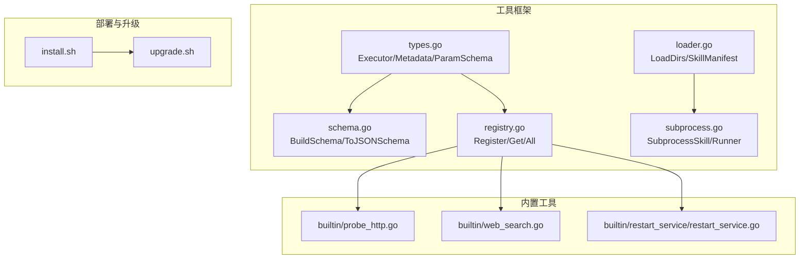
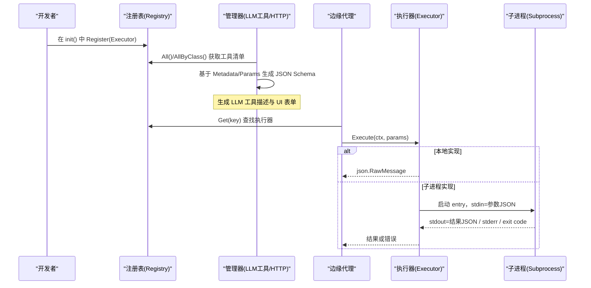
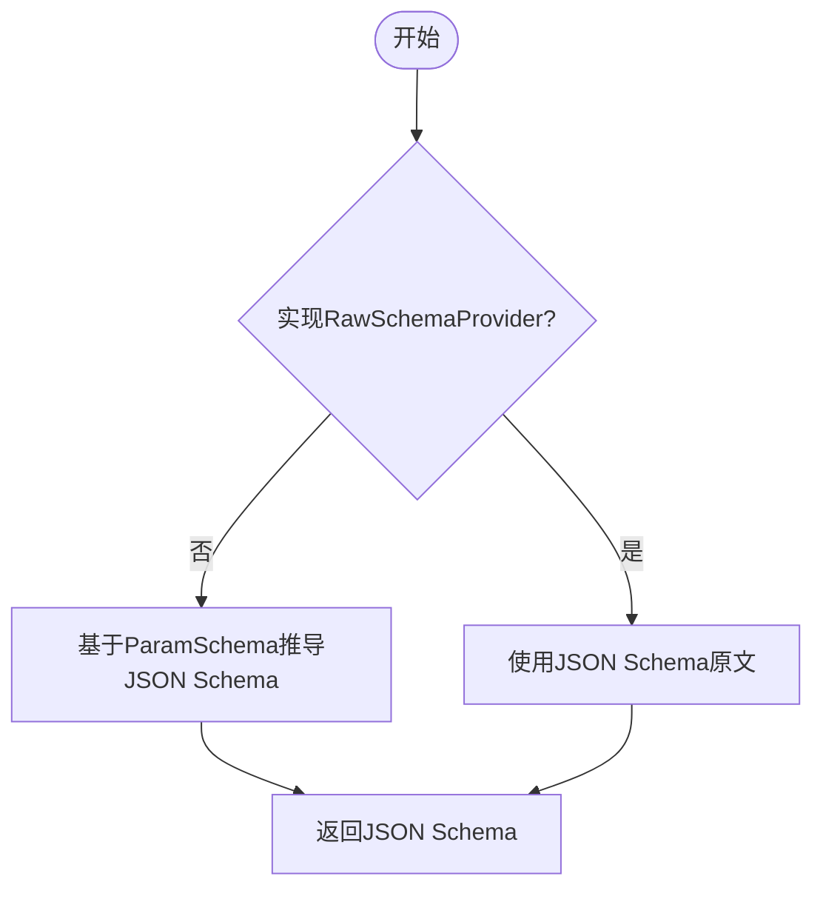
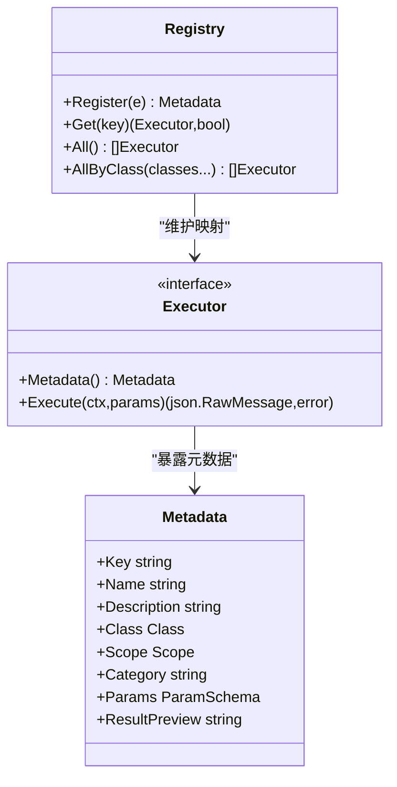
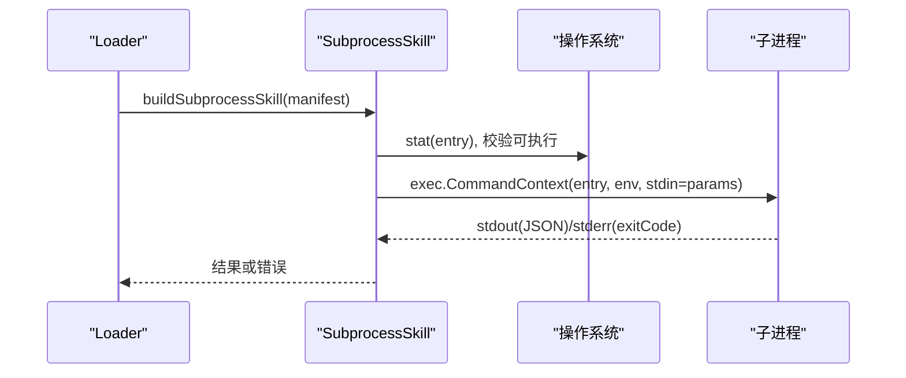
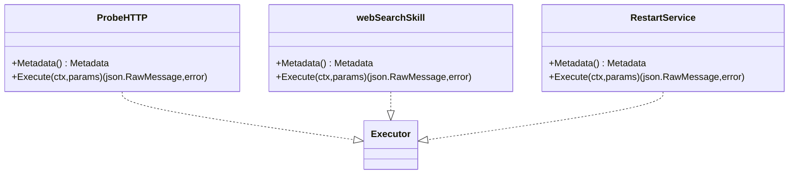
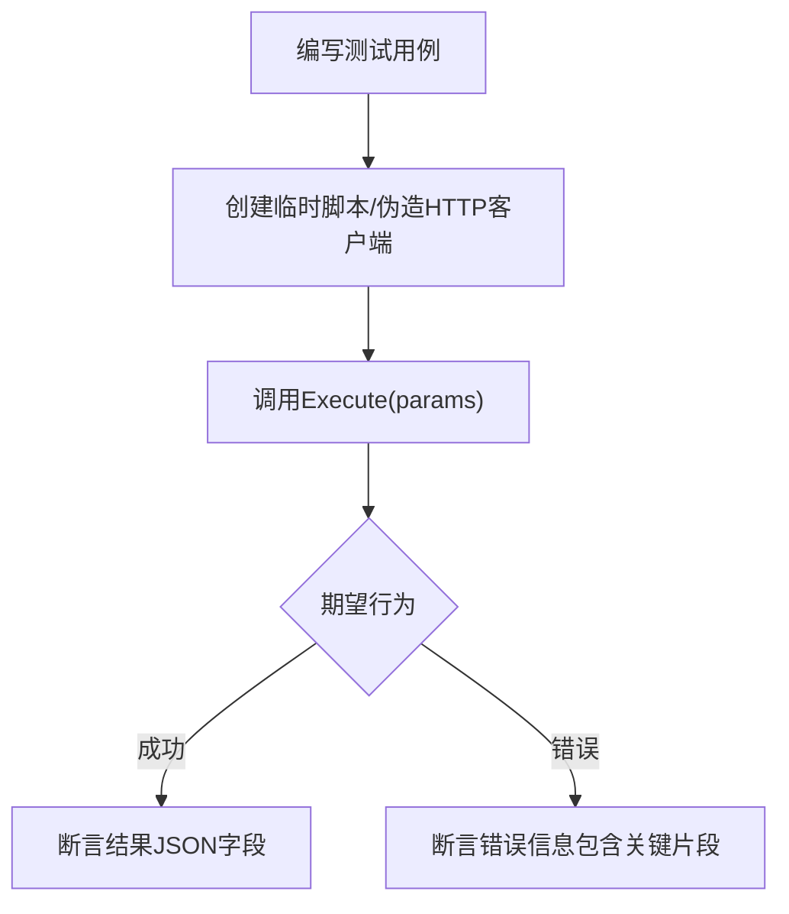
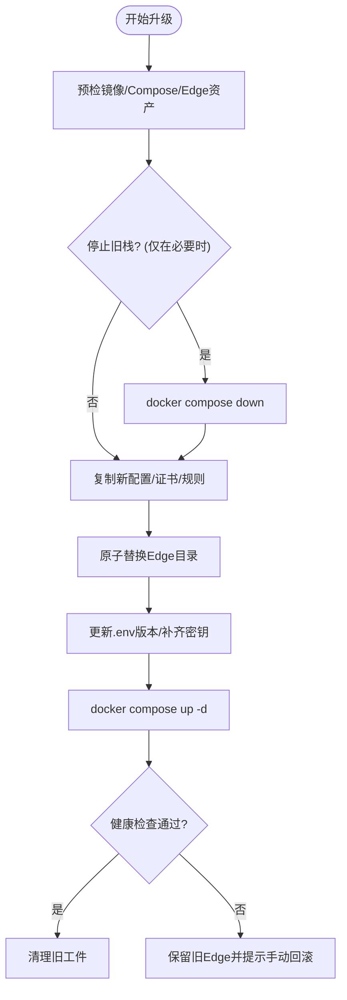
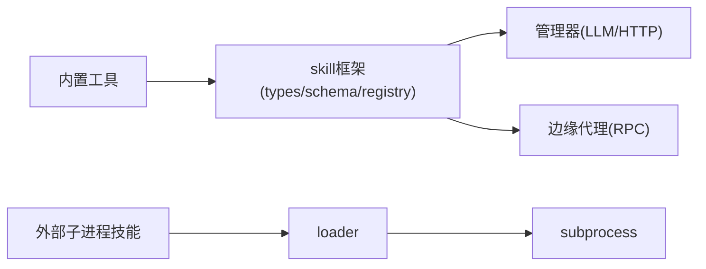

# 自定义工具开发

<cite>
**本文引用的文件**
- [internal/skill/types.go](file://internal/skill/types.go)
- [internal/skill/schema.go](file://internal/skill/schema.go)
- [internal/skill/registry.go](file://internal/skill/registry.go)
- [internal/skill/loader.go](file://internal/skill/loader.go)
- [internal/skill/subprocess.go](file://internal/skill/subprocess.go)
- [internal/skill/builtin/doc.go](file://internal/skill/builtin/doc.go)
- [internal/skill/builtin/probe_http.go](file://internal/skill/builtin/probe_http.go)
- [internal/skill/builtin/web_search.go](file://internal/skill/builtin/web_search.go)
- [internal/skill/builtin/restart_service/restart_service.go](file://internal/skill/builtin/restart_service/restart_service.go)
- [internal/skill/subprocess_test.go](file://internal/skill/subprocess_test.go)
- [deploy/install/install.sh](file://deploy/install/install.sh)
- [deploy/install/upgrade.sh](file://deploy/install/upgrade.sh)
</cite>

## 目录
1. [简介](#简介)
2. [项目结构](#项目结构)
3. [核心组件](#核心组件)
4. [架构总览](#架构总览)
5. [详细组件分析](#详细组件分析)
6. [依赖关系分析](#依赖关系分析)
7. [性能考量](#性能考量)
8. [故障排查指南](#故障排查指南)
9. [结论](#结论)
10. [附录](#附录)

## 简介
本文件面向希望为 ongrid 平台开发“自定义工具（Skill）”的工程师，系统性说明工具接口规范、元数据定义、参数与返回值格式、执行范围与权限分级、测试方法、部署与版本管理策略，以及调试与性能优化建议。文档基于仓库中 internal/skill 框架与内置工具实现进行提炼，确保内容可直接落地到代码与运维流程。

## 项目结构
- 工具框架位于 internal/skill：提供统一的 Executor 接口、元数据描述、JSON Schema 生成、注册表、外部子进程技能加载器与安全沙箱约束。
- 内置工具位于 internal/skill/builtin：包含网络探测、日志读取、文件查看、联网搜索等示例实现，展示如何声明式定义参数与结果。
- 安装与升级脚本位于 deploy/install：负责环境准备、镜像拉取、Edge 资源装配、数据目录权限、TLS 证书生成与版本回滚策略。

图表来源
- [internal/skill/types.go:1-241](file://internal/skill/types.go#L1-L241)
- [internal/skill/schema.go:1-96](file://internal/skill/schema.go#L1-L96)
- [internal/skill/registry.go:1-127](file://internal/skill/registry.go#L1-L127)
- [internal/skill/loader.go:1-274](file://internal/skill/loader.go#L1-L274)
- [internal/skill/subprocess.go:1-268](file://internal/skill/subprocess.go#L1-L268)
- [internal/skill/builtin/probe_http.go:1-120](file://internal/skill/builtin/probe_http.go#L1-L120)
- [internal/skill/builtin/web_search.go:1-593](file://internal/skill/builtin/web_search.go#L1-L593)
- [internal/skill/builtin/restart_service/restart_service.go:1-114](file://internal/skill/builtin/restart_service/restart_service.go#L1-L114)
- [deploy/install/install.sh:1-800](file://deploy/install/install.sh#L1-L800)
- [deploy/install/upgrade.sh:1-800](file://deploy/install/upgrade.sh#L1-L800)

章节来源
- [internal/skill/types.go:1-241](file://internal/skill/types.go#L1-L241)
- [internal/skill/registry.go:1-127](file://internal/skill/registry.go#L1-L127)
- [internal/skill/loader.go:1-274](file://internal/skill/loader.go#L1-L274)
- [internal/skill/subprocess.go:1-268](file://internal/skill/subprocess.go#L1-L268)
- [internal/skill/builtin/doc.go:1-26](file://internal/skill/builtin/doc.go#L1-L26)
- [deploy/install/install.sh:1-800](file://deploy/install/install.sh#L1-L800)
- [deploy/install/upgrade.sh:1-800](file://deploy/install/upgrade.sh#L1-L800)

## 核心组件
- 元数据与参数模型
  - Metadata：工具的稳定标识 Key、名称 Name、描述 Description、权限类 Class、执行范围 Scope、分类 Category、参数模式 Params、结果预览 ResultPreview。
  - ParamSchema：有序的参数列表，用于 UI 表单与 LLM 函数调用 JSON Schema 自动生成。
  - 类型映射：string/int/float/bool/duration/enum/array，支持默认值与枚举校验。
- 执行器接口
  - Executor：Metadata() 暴露元数据；Execute(ctx, params) 接收已按 schema 校验过的参数，返回 JSON 结果或错误。
  - RawSchemaProvider：可选扩展，允许手工提供完整 JSON Schema，覆盖自动推导。
- 注册表
  - Registry：进程级全局注册表，init 时 Register，运行时 Get/All/AllByClass 查询；并发安全。
- 外部子进程技能
  - SubprocessSkill：通过 manifest 启动外部可执行程序，stdin 传入参数 JSON，stdout 输出结果 JSON；强制 ScopeManager，严格限制环境变量白名单与超时。
- 加载器
  - Loader：扫描指定目录下的 skill.json，构建并注册 SubprocessSkill；路径白名单校验、重复键跳过、解析失败记录日志。

章节来源
- [internal/skill/types.go:63-175](file://internal/skill/types.go#L63-L175)
- [internal/skill/types.go:177-203](file://internal/skill/types.go#L177-L203)
- [internal/skill/schema.go:5-96](file://internal/skill/schema.go#L5-L96)
- [internal/skill/registry.go:10-127](file://internal/skill/registry.go#L10-L127)
- [internal/skill/loader.go:13-274](file://internal/skill/loader.go#L13-L274)
- [internal/skill/subprocess.go:17-268](file://internal/skill/subprocess.go#L17-L268)

## 架构总览
工具从“声明式元数据 + 执行器实现”出发，统一被注册到全局注册表；管理器侧根据元数据自动生成 LLM 工具描述、HTTP 路由与 UI 表单；边缘侧通过 execute_skill RPC 分发到对应 Key 的执行器。外部子进程技能以独立进程运行，受白名单目录与环境变量控制，保证安全隔离。

图表来源
- [internal/skill/registry.go:10-127](file://internal/skill/registry.go#L10-L127)
- [internal/skill/schema.go:5-96](file://internal/skill/schema.go#L5-L96)
- [internal/skill/subprocess.go:99-172](file://internal/skill/subprocess.go#L99-L172)

## 详细组件分析

### 工具接口与元数据规范
- 权限类 Class
  - safe：只读无副作用（探测、读取、检查）。
  - mutating：可逆修改（重启服务、杀进程）。
  - dangerous：不可逆或集群影响（rm、reboot、drop table）。
- 执行范围 Scope
  - host：在目标边缘设备上执行，需要 edge_id。
  - manager：在管理器进程内执行，适合访问公网或运行子进程包。
- 参数模式 ParamSchema
  - 支持 string/int/float/bool/duration/enum/array；数组需指定 ItemType。
  - Required 与 Default 互斥；Default 用于 UI 初始值与 Execute 缺省处理。
- 结果预览 ResultPreview
  - 对 UI 与 LLM 的提示性描述，实际 JSON 结构由实现决定。

章节来源
- [internal/skill/types.go:35-125](file://internal/skill/types.go#L35-L125)
- [internal/skill/types.go:127-175](file://internal/skill/types.go#L127-L175)

### 参数与返回值格式
- 参数
  - 由 BuildSchema 将 ParamSchema 转换为 OpenAI function-calling 兼容的 JSON Schema。
  - 若实现 RawSchemaProvider，则使用其提供的原始 JSON Schema。
- 返回值
  - Execute 必须返回合法的 JSON（json.RawMessage），否则会被视为错误。
  - 子进程技能要求 stdout 为合法 JSON，stderr 尾部用于诊断。

图表来源
- [internal/skill/schema.go:5-20](file://internal/skill/schema.go#L5-L20)
- [internal/skill/schema.go:22-96](file://internal/skill/schema.go#L22-L96)

章节来源
- [internal/skill/schema.go:5-96](file://internal/skill/schema.go#L5-L96)
- [internal/skill/subprocess.go:137-172](file://internal/skill/subprocess.go#L137-L172)

### 工具注册与发现
- 注册时机：在包的 init() 中调用 Register，将 Executor 加入全局注册表。
- 并发安全：注册阶段单线程，运行时并发读取；使用读写锁保护。
- 查询能力：Get(key)、All()、AllByClass(...) 支持按权限类过滤。

图表来源
- [internal/skill/registry.go:10-127](file://internal/skill/registry.go#L10-L127)
- [internal/skill/types.go:99-203](file://internal/skill/types.go#L99-L203)

章节来源
- [internal/skill/registry.go:10-127](file://internal/skill/registry.go#L10-L127)

### 外部子进程技能（SubprocessSkill）
- 入口与清单
  - SkillManifest：name、description、schema、entry、env_allow、timeout_seconds、class、category。
  - Loader 扫描指定目录，解析 skill.json，构建 SubprocessSkill 并注册。
- 安全约束
  - 强制 ScopeManager；Entry 必须绝对路径且位于白名单根目录下；环境变量仅白名单注入。
  - 超时控制：未设置时使用默认超时；标准输出限制最大字节数。
- 执行流程
  - stdin 传入参数 JSON；stdout 必须为合法 JSON；非零退出码返回错误并附带 stderr 尾部。

图表来源
- [internal/skill/loader.go:176-254](file://internal/skill/loader.go#L176-L254)
- [internal/skill/subprocess.go:99-172](file://internal/skill/subprocess.go#L99-L172)
- [internal/skill/subprocess.go:207-238](file://internal/skill/subprocess.go#L207-L238)

章节来源
- [internal/skill/loader.go:13-274](file://internal/skill/loader.go#L13-L274)
- [internal/skill/subprocess.go:17-268](file://internal/skill/subprocess.go#L17-L268)

### 内置工具示例
- HTTP 探测（host_probe_http）
  - 发起 HEAD/GET 请求，返回状态码、延迟、内容长度；安全类，Host 范围。
- 联网搜索（web_search）
  - 支持多后端（SearXNG/Tavily/Brave），manager 范围，安全类；返回标准化结果集。
- 重启服务（host_restart_service）
  - 变更类（mutating），必须在管理器侧通过 BaseTool + ReviewGate 审批后执行；直接 Execute 会拒绝。

图表来源
- [internal/skill/builtin/probe_http.go:15-120](file://internal/skill/builtin/probe_http.go#L15-L120)
- [internal/skill/builtin/web_search.go:150-283](file://internal/skill/builtin/web_search.go#L150-L283)
- [internal/skill/builtin/restart_service/restart_service.go:52-114](file://internal/skill/builtin/restart_service/restart_service.go#L52-L114)

章节来源
- [internal/skill/builtin/probe_http.go:1-120](file://internal/skill/builtin/probe_http.go#L1-L120)
- [internal/skill/builtin/web_search.go:1-593](file://internal/skill/builtin/web_search.go#L1-L593)
- [internal/skill/builtin/restart_service/restart_service.go:1-114](file://internal/skill/builtin/restart_service/restart_service.go#L1-L114)

### 工具测试方法与断言
- 单元测试
  - 使用 Go 标准 testing 包；针对子进程技能创建临时脚本，验证参数透传、超时、非零退出、环境变量过滤、非 JSON 输出拒绝等。
  - 通过替换 runner 接口注入测试替身，捕获请求与响应。
- 断言库
  - 使用 strings.Contains、json.Unmarshal 与基本比较进行断言；无需第三方库。

图表来源
- [internal/skill/subprocess_test.go:14-201](file://internal/skill/subprocess_test.go#L14-L201)

章节来源
- [internal/skill/subprocess_test.go:14-201](file://internal/skill/subprocess_test.go#L14-L201)

### 部署流程、版本管理与升级策略
- 安装流程
  - 检测 Docker 与 compose；准备 Edge 资源；复制配置与证书；初始化数据目录与权限；生成密钥与管理员密码；启动服务。
- 升级流程
  - 预检新 Compose 与镜像；准备 Edge 资产；迁移或保留旧数据卷；原子替换 Edge 目录；更新 .env 中的版本；拉起新栈；健康检查；清理旧工件。
- 回滚策略
  - 失败时尝试恢复 Edge 目录；健康检查失败保留旧 Edge 资产供手动回滚；保留备份目录便于人工干预。

图表来源
- [deploy/install/upgrade.sh:209-800](file://deploy/install/upgrade.sh#L209-L800)
- [deploy/install/install.sh:375-800](file://deploy/install/install.sh#L375-L800)

章节来源
- [deploy/install/install.sh:1-800](file://deploy/install/install.sh#L1-L800)
- [deploy/install/upgrade.sh:1-800](file://deploy/install/upgrade.sh#L1-L800)

## 依赖关系分析
- 内部依赖
  - 内置工具依赖 internal/skill 框架；子进程技能依赖 loader 与 subprocess 模块。
  - 注册表为所有工具的统一入口，提供并发安全的查询能力。
- 外部依赖
  - 联网搜索依赖外部 API（SearXNG/Tavily/Brave）；HTTP 探测依赖目标主机可达性与 TLS 配置。
- 耦合与内聚
  - 工具与框架解耦：仅依赖 Executor 接口与元数据模型；子进程技能通过 manifest 与白名单隔离。
  - 注册表集中管理，避免循环依赖；加载器负责外部技能的安全装配。

图表来源
- [internal/skill/builtin/doc.go:1-26](file://internal/skill/builtin/doc.go#L1-L26)
- [internal/skill/loader.go:69-160](file://internal/skill/loader.go#L69-L160)
- [internal/skill/subprocess.go:30-78](file://internal/skill/subprocess.go#L30-L78)
- [internal/skill/registry.go:10-47](file://internal/skill/registry.go#L10-L47)

章节来源
- [internal/skill/builtin/doc.go:1-26](file://internal/skill/builtin/doc.go#L1-L26)
- [internal/skill/loader.go:69-160](file://internal/skill/loader.go#L69-L160)
- [internal/skill/subprocess.go:30-78](file://internal/skill/subprocess.go#L30-L78)
- [internal/skill/registry.go:10-47](file://internal/skill/registry.go#L10-L47)

## 性能考量
- 子进程输出限制
  - 标准输出上限 16 MiB，stderr 尾部保留 4 KiB，防止异常输出耗尽内存。
- 超时控制
  - 默认 30 秒；可通过 manifest 的 timeout_seconds 调整；超时返回明确错误。
- 网络与 I/O
  - HTTP 探测与联网搜索应设置合理超时；避免阻塞长时间任务。
- 并发与缓存
  - 注册表使用读写锁；联网搜索配置解析器可缓存以减少开销。
- 资源隔离
  - 子进程环境变量白名单最小化；Entry 路径白名单防止逃逸。

章节来源
- [internal/skill/subprocess.go:17-28](file://internal/skill/subprocess.go#L17-L28)
- [internal/skill/subprocess.go:145-172](file://internal/skill/subprocess.go#L145-L172)
- [internal/skill/builtin/web_search.go:225-283](file://internal/skill/builtin/web_search.go#L225-L283)

## 故障排查指南
- 子进程技能常见问题
  - 相对路径或不存在可执行文件：Execute 会返回错误；确认 Entry 为绝对路径且存在。
  - 非 JSON 输出：stdout 必须为合法 JSON；检查子进程输出格式。
  - 非零退出码：错误消息包含退出码与 stderr 尾部；定位子进程日志。
  - 环境变量泄漏：仅白名单变量注入；检查 EnvAllow 配置。
- 联网搜索问题
  - 后端不可达或未配置：返回 skipped_reason 而非错误；检查 SearXNG/Tavily/Brave 配置与网络连通性。
- 升级与安装问题
  - 镜像拉取失败：预检阶段会提前报错；检查镜像仓库与网络。
  - 数据卷迁移：旧版命名卷需显式迁移或手动处理；遵循 README 指引。
  - 健康检查失败：保留旧 Edge 资产；查看容器日志与 .env 配置。

章节来源
- [internal/skill/subprocess_test.go:79-201](file://internal/skill/subprocess_test.go#L79-L201)
- [internal/skill/builtin/web_search.go:285-374](file://internal/skill/builtin/web_search.go#L285-L374)
- [deploy/install/upgrade.sh:439-560](file://deploy/install/upgrade.sh#L439-L560)
- [deploy/install/upgrade.sh:731-760](file://deploy/install/upgrade.sh#L731-L760)

## 结论
ongrid 的工具框架以“声明式元数据 + 统一执行器接口”为核心，结合注册表与加载器，实现了工具的可插拔、可审计、可治理。通过权限类与执行范围控制，既保障了安全性，又提供了灵活的开发体验。内置工具展示了典型实现模式，安装与升级脚本确保了生产环境的稳定演进。按照本文档的规范与实践，可以快速开发、测试与部署高质量的自定义工具。

## 附录
- 开发工具推荐
  - 使用 Go 标准 testing 与 httptest 进行单元与集成测试。
  - 借助 docker compose 快速搭建本地环境，模拟 Edge 与后端服务。
- 调试技巧
  - 启用详细日志；子进程技能通过 stderr 尾部定位问题。
  - 使用 curl 或浏览器访问 /healthz 验证服务健康。
- 最佳实践
  - 明确标注 Class 与 Scope；谨慎设置 Required 与 Default。
  - 对外部依赖设置超时与重试；避免长耗时操作阻塞调用链。
  - 保持工具幂等与可观测性；记录审计信息与指标。