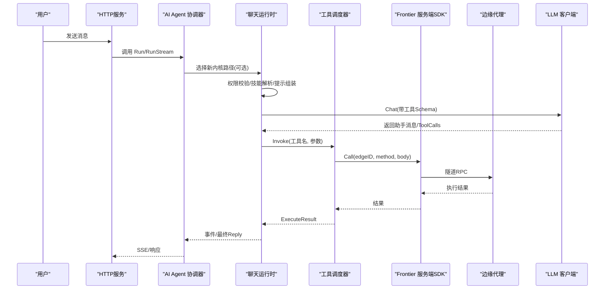
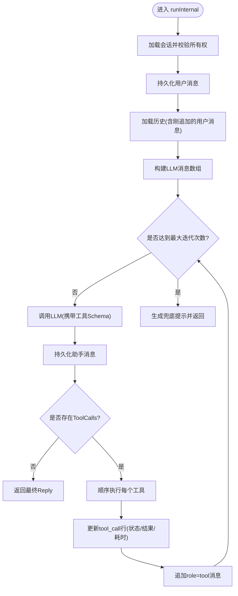
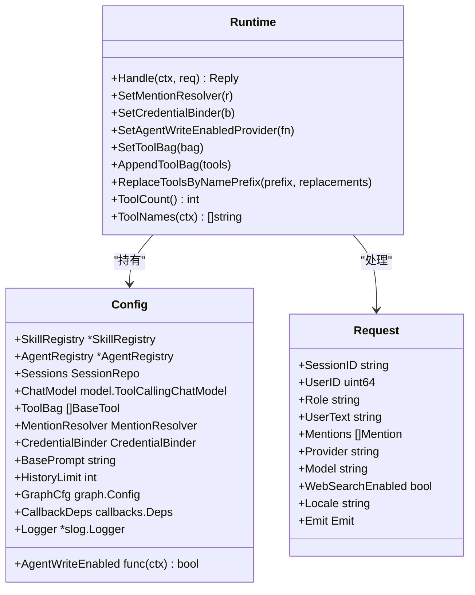
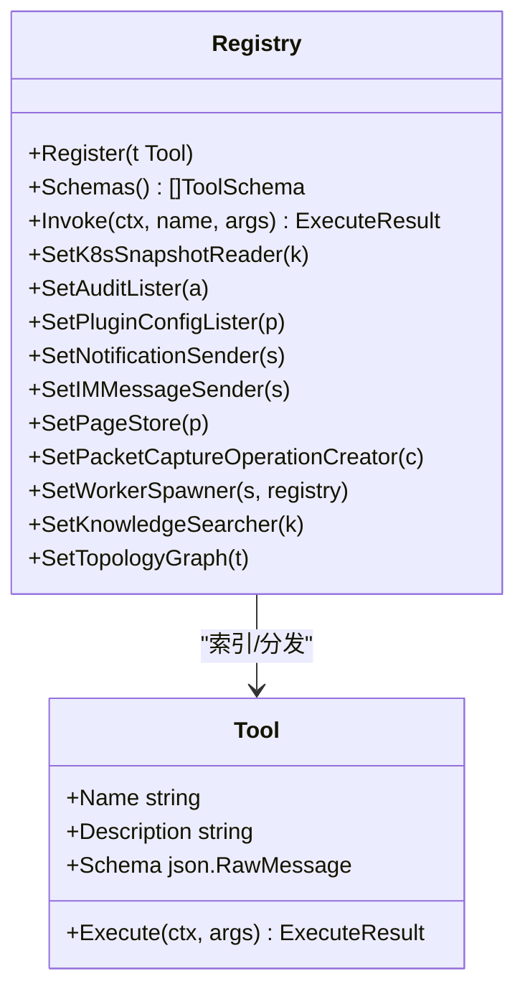
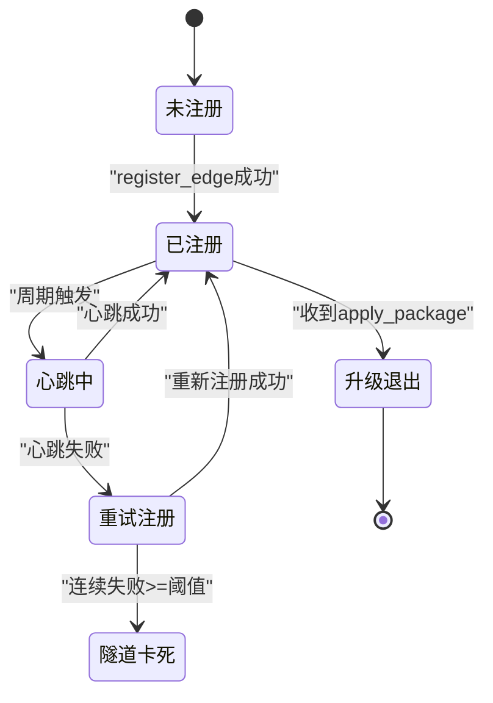
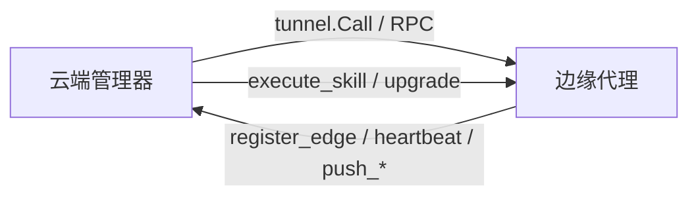

# 核心组件设计

<cite>
**本文引用的文件**
- [cmd/ongrid/main.go](file://cmd/ongrid/main.go)
- [cmd/ongrid-edge/main.go](file://cmd/ongrid-edge/main.go)
- [internal/manager/biz/aiops/agent/agent.go](file://internal/manager/biz/aiops/agent/agent.go)
- [internal/manager/biz/aiops/chatruntime/runtime.go](file://internal/manager/biz/aiops/chatruntime/runtime.go)
- [internal/manager/biz/aiops/tools/registry.go](file://internal/manager/biz/aiops/tools/registry.go)
- [internal/edgeagent/biz/agent.go](file://internal/edgeagent/biz/agent.go)
- [internal/pkg/tunnel/messages.go](file://internal/pkg/tunnel/messages.go)
- [internal/pkg/tunnel/types.go](file://internal/pkg/tunnel/types.go)
</cite>

## 目录
1. [简介](#简介)
2. [项目结构](#项目结构)
3. [核心组件](#核心组件)
4. [架构总览](#架构总览)
5. [详细组件分析](#详细组件分析)
6. [依赖关系分析](#依赖关系分析)
7. [性能考量](#性能考量)
8. [故障排查指南](#故障排查指南)
9. [结论](#结论)

## 简介
本设计文档聚焦 Ongrid 的核心组件：AI Agent 协调器、边缘代理、会话管理器与工具调度器。文档从系统架构、组件职责、通信协议、数据格式、错误处理、生命周期管理、状态同步与故障恢复等维度展开，并通过序列图与状态转换图展示关键业务流程的实现逻辑。目标是帮助读者在不深入源码的情况下理解整体设计与实现要点。

## 项目结构
Ongrid 由云端管理器（ongrid）与边缘代理（ongrid-edge）两部分组成：
- 云端管理器负责编排 AI Agent、会话、工具注册与调度、与边缘的隧道通信、以及对外 HTTP API。
- 边缘代理负责采集指标、上报心跳、执行云端下发的技能/工具调用、并维护本地插件运行态。

```mermaid
graph TB
subgraph "云端管理器"
MMain["命令入口<br/>cmd/ongrid/main.go"]
AAgent["AI Agent 协调器<br/>biz/aiops/agent"]
CRuntime["聊天运行时/会话编排<br/>biz/aiops/chatruntime"]
TReg["工具注册与调度<br/>biz/aiops/tools/registry"]
DB[("数据库")]
LLM["LLM 路由/客户端"]
Front["Frontier 服务端 SDK"]
end
subgraph "边缘侧"
EMain["命令入口<br/>cmd/ongrid-edge/main.go"]
EAgent["边缘代理<br/>edgeagent/biz/agent"]
Plugins["插件/技能执行器"]
Coll["采集器(嵌入式/Scrape)"]
end
MMain --> AAgent
AAgent --> CRuntime
AAgent --> TReg
AAgent --> LLM
AAgent --> DB
AAgent --> Front
EMain --> EAgent
EAgent --> Coll
EAgent --> Plugins
Front < --> EAgent
```

**图表来源**
- [cmd/ongrid/main.go:208-300](file://cmd/ongrid/main.go#L208-L300)
- [cmd/ongrid-edge/main.go:66-160](file://cmd/ongrid-edge/main.go#L66-L160)
- [internal/manager/biz/aiops/agent/agent.go:255-330](file://internal/manager/biz/aiops/agent/agent.go#L255-L330)
- [internal/manager/biz/aiops/chatruntime/runtime.go:279-323](file://internal/manager/biz/aiops/chatruntime/runtime.go#L279-L323)
- [internal/manager/biz/aiops/tools/registry.go:274-310](file://internal/manager/biz/aiops/tools/registry.go#L274-L310)
- [internal/edgeagent/biz/agent.go:94-171](file://internal/edgeagent/biz/agent.go#L94-L171)

**章节来源**
- [cmd/ongrid/main.go:208-300](file://cmd/ongrid/main.go#L208-L300)
- [cmd/ongrid-edge/main.go:66-160](file://cmd/ongrid-edge/main.go#L66-L160)

## 核心组件
- AI Agent 协调器：负责用户消息入队、历史加载、LLM 调用、工具调用循环、事件流式输出与结果聚合。
- 聊天运行时/会话管理器：提供新的图基运行时，统一会话权限、技能解析、系统提示组装、@提及内联、持久化与回调链（审计、度量、SSE）。
- 工具调度器：集中注册工具（查询、操作、编排），按名称分发执行，支持可选能力（Prom/Loki/Traces/Alert/K8s/拓扑等）。
- 边缘代理：维护与云端的隧道连接，周期性心跳与指标上报，注册云端反向调用的处理器（技能执行、包升级、抓包等）。

**章节来源**
- [internal/manager/biz/aiops/agent/agent.go:255-330](file://internal/manager/biz/aiops/agent/agent.go#L255-L330)
- [internal/manager/biz/aiops/chatruntime/runtime.go:279-323](file://internal/manager/biz/aiops/chatruntime/runtime.go#L279-L323)
- [internal/manager/biz/aiops/tools/registry.go:274-310](file://internal/manager/biz/aiops/tools/registry.go#L274-L310)
- [internal/edgeagent/biz/agent.go:94-171](file://internal/edgeagent/biz/agent.go#L94-L171)

## 架构总览
云端通过 Frontier 服务建立长连接，边缘侧以隧道方式接入。AI Agent 协调器在云端发起 LLM 调用，必要时通过工具调度器将动作下发到边缘代理执行；边缘代理负责采集指标、响应云端 RPC 并回传结果。



**图表来源**
- [internal/manager/biz/aiops/chatruntime/runtime.go:516-800](file://internal/manager/biz/aiops/chatruntime/runtime.go#L516-L800)
- [internal/manager/biz/aiops/tools/registry.go:470-484](file://internal/manager/biz/aiops/tools/registry.go#L470-L484)
- [internal/edgeagent/biz/agent.go:355-478](file://internal/edgeagent/biz/agent.go#L355-L478)
- [cmd/ongrid/main.go:208-300](file://cmd/ongrid/main.go#L208-L300)
- [cmd/ongrid-edge/main.go:136-160](file://cmd/ongrid-edge/main.go#L136-L160)

## 详细组件分析

### AI Agent 协调器
- 职责：加载会话历史、追加用户消息、循环调用 LLM、执行工具、持久化中间结果、流式事件推送、统计用量。
- 关键流程：
  - 初始化默认配置（模型、温度、最大迭代次数、工具超时、历史限制）。
  - 权限控制：写操作开关、租户上下文、管理员豁免。
  - @提及内联：将平台对象引用转为结构化上下文。
  - 工具暴露过滤：根据 WebSearch 开关与 K8s 操作权限动态裁剪 Schema。
  - 工具执行：逐条执行、记录开始/结束、错误分类、结果回灌给 LLM。
  - 终止条件：无 ToolCalls 则结束；超过最大迭代次数则友好提示。
- 错误处理：
  - 未就绪/未授权返回特定错误。
  - 工具执行失败或超时会记录并继续。
  - 达到最大迭代次数时生成兜底回复。



**图表来源**
- [internal/manager/biz/aiops/agent/agent.go:331-723](file://internal/manager/biz/aiops/agent/agent.go#L331-L723)

**章节来源**
- [internal/manager/biz/aiops/agent/agent.go:36-62](file://internal/manager/biz/aiops/agent/agent.go#L36-L62)
- [internal/manager/biz/aiops/agent/agent.go:255-330](file://internal/manager/biz/aiops/agent/agent.go#L255-L330)
- [internal/manager/biz/aiops/agent/agent.go:331-723](file://internal/manager/biz/aiops/agent/agent.go#L331-L723)

### 聊天运行时/会话管理器
- 职责：统一会话权限、技能解析、系统提示组装、@提及内联、历史重建、图构建与回调链（持久化、审计、度量、SSE）、回复翻译。
- 关键流程：
  - 构造 Runtime，注入会话仓库、ChatModel、工具集、技能/代理人注册表。
  - Handle：所有权校验 → 提及内联 → 持久化用户消息 → 历史加载 → 决策澄清（可选）→ 技能解析与提示组装 → 构建 eino 历史 → 构建 ReAct 图 → 设置回调链 → 执行图 → 返回 Reply。
  - 工具集动态替换：支持按前缀替换（如 MCP 刷新）。
  - 权限控制：viewer 角色与全局写开关会裁剪工具集。
- 错误处理：
  - 未就绪返回特定错误。
  - 会话不存在或无权访问返回“未找到”。
  - 图构建失败返回错误。



**图表来源**
- [internal/manager/biz/aiops/chatruntime/runtime.go:149-245](file://internal/manager/biz/aiops/chatruntime/runtime.go#L149-L245)
- [internal/manager/biz/aiops/chatruntime/runtime.go:279-323](file://internal/manager/biz/aiops/chatruntime/runtime.go#L279-L323)
- [internal/manager/biz/aiops/chatruntime/runtime.go:516-800](file://internal/manager/biz/aiops/chatruntime/runtime.go#L516-L800)

**章节来源**
- [internal/manager/biz/aiops/chatruntime/runtime.go:279-323](file://internal/manager/biz/aiops/chatruntime/runtime.go#L279-L323)
- [internal/manager/biz/aiops/chatruntime/runtime.go:516-800](file://internal/manager/biz/aiops/chatruntime/runtime.go#L516-L800)

### 工具调度器
- 职责：注册工具（名称、描述、JSON Schema、执行器），按名称分发执行，支持可选能力（Prom/Loki/Traces/Alert/K8s/拓扑/通知/页面/数据包捕获等）。
- 关键流程：
  - NewRegistry：自动注册基础工具（主机负载、进程列表），并按可用能力注册查询类工具。
  - Register：添加或覆盖工具。
  - Schemas：导出 llm.ToolSchema 供 LLM 使用。
  - Invoke：按名称查找并执行，未知名称返回“未找到”，空参数补为 {}。
  - 后置装配：通过 SetXxx 方法注入 K8s 快照、审计列表、插件配置、通知发送者、页面存储、数据包操作创建器等。
- 错误处理：
  - 未知工具返回“未找到”。
  - 可选能力缺失时对应工具不注册，避免半可用状态。



**图表来源**
- [internal/manager/biz/aiops/tools/registry.go:52-67](file://internal/manager/biz/aiops/tools/registry.go#L52-L67)
- [internal/manager/biz/aiops/tools/registry.go:274-310](file://internal/manager/biz/aiops/tools/registry.go#L274-L310)
- [internal/manager/biz/aiops/tools/registry.go:447-484](file://internal/manager/biz/aiops/tools/registry.go#L447-L484)

**章节来源**
- [internal/manager/biz/aiops/tools/registry.go:274-310](file://internal/manager/biz/aiops/tools/registry.go#L274-L310)
- [internal/manager/biz/aiops/tools/registry.go:447-484](file://internal/manager/biz/aiops/tools/registry.go#L447-L484)

### 边缘代理
- 职责：维护与云端的隧道连接，周期性心跳与指标上报，注册云端反向调用的处理器（技能执行、包升级、抓包、SNMP探测等）。
- 关键流程：
  - Run：注册处理器 → 设置重连回调 → Dial → register_edge → 启动心跳/指标/网络发现循环 → 监听升级信号。
  - 心跳循环：若 EdgeID 为空则重试注册；发送心跳并附带插件健康信息；失败时尝试重新注册。
  - 指标循环：定时采集并推送两种路径（旧版 HostPoint 与新版 Prom Samples）。
  - 技能执行：统一通过 MethodExecuteSkill 分发，内置 PCAP 相关技能特殊处理。
- 错误处理：
  - 注册失败记录警告但继续运行（等待重连）。
  - 心跳失败累计计数，超过阈值视为隧道卡死。
  - 指标推送失败仅记录日志，下次重试。



**图表来源**
- [internal/edgeagent/biz/agent.go:186-271](file://internal/edgeagent/biz/agent.go#L186-L271)
- [internal/edgeagent/biz/agent.go:530-602](file://internal/edgeagent/biz/agent.go#L530-L602)
- [internal/edgeagent/biz/agent.go:617-693](file://internal/edgeagent/biz/agent.go#L617-L693)
- [internal/edgeagent/biz/agent.go:355-478](file://internal/edgeagent/biz/agent.go#L355-L478)

**章节来源**
- [internal/edgeagent/biz/agent.go:186-271](file://internal/edgeagent/biz/agent.go#L186-L271)
- [internal/edgeagent/biz/agent.go:530-602](file://internal/edgeagent/biz/agent.go#L530-L602)
- [internal/edgeagent/biz/agent.go:617-693](file://internal/edgeagent/biz/agent.go#L617-L693)
- [internal/edgeagent/biz/agent.go:355-478](file://internal/edgeagent/biz/agent.go#L355-L478)

## 依赖关系分析
- 云端管理器依赖：
  - LLM 路由/客户端：多提供商路由与默认超时。
  - 工具调度器：按需注册查询/操作工具。
  - 会话仓库：持久化消息与工具调用。
  - Frontier 服务端 SDK：与边缘建立隧道与反向调用。
- 边缘代理依赖：
  - 隧道客户端：长连接与 RPC。
  - 采集器：嵌入式或 Scrape 模式。
  - 插件系统：日志/追踪/指标/数据库导出等子进程或进程内抓取。
- 通信协议：
  - 通过隧道 RPC 进行双向通信，包括 register_edge、heartbeat、push_host_metrics、push_prom_samples、execute_skill、agent_upgrade、fetch_package、apply_package 等。
  - 数据格式：JSON 编码的请求/响应体，包含 edge_id、时间戳、样本、插件健康信息等。



**图表来源**
- [internal/edgeagent/biz/agent.go:355-478](file://internal/edgeagent/biz/agent.go#L355-L478)
- [internal/edgeagent/biz/agent.go:530-602](file://internal/edgeagent/biz/agent.go#L530-L602)
- [internal/edgeagent/biz/agent.go:617-693](file://internal/edgeagent/biz/agent.go#L617-L693)

**章节来源**
- [internal/edgeagent/biz/agent.go:355-478](file://internal/edgeagent/biz/agent.go#L355-L478)
- [internal/edgeagent/biz/agent.go:530-602](file://internal/edgeagent/biz/agent.go#L530-L602)
- [internal/edgeagent/biz/agent.go:617-693](file://internal/edgeagent/biz/agent.go#L617-L693)

## 性能考量
- 工具调用超时：默认每工具超时，防止长时间阻塞。
- 历史限制：限制回放消息数量，降低 LLM 请求大小。
- 指标推送：采用批量与双路径（HostPoint/Prom Samples），失败即丢弃并重试，避免堆积。
- 图构建：每次请求构建图，轻量且可缓存（未来优化点）。
- 插件健康：心跳附带插件健康快照，便于快速定位问题。

[本节为通用指导，无需具体文件分析]

## 故障排查指南
- 云端侧：
  - 检查会话所有权与权限（viewer/写开关）。
  - 查看工具是否注册完整（可选能力缺失会导致部分工具不可用）。
  - 关注 LLM 调用错误与工具执行错误，确认 Schema 与实际参数匹配。
- 边缘侧：
  - 检查 register_edge 是否成功，EdgeID 是否为 0。
  - 心跳失败累计计数，超过阈值可能隧道卡死，需检查网络与认证。
  - 指标推送失败仅记录日志，确认采集器与目标可达性。
  - 技能执行失败时查看具体 key 与参数，确认内置技能与插件是否正常。

**章节来源**
- [internal/manager/biz/aiops/agent/agent.go:331-723](file://internal/manager/biz/aiops/agent/agent.go#L331-L723)
- [internal/manager/biz/aiops/tools/registry.go:447-484](file://internal/manager/biz/aiops/tools/registry.go#L447-L484)
- [internal/edgeagent/biz/agent.go:530-602](file://internal/edgeagent/biz/agent.go#L530-L602)
- [internal/edgeagent/biz/agent.go:617-693](file://internal/edgeagent/biz/agent.go#L617-L693)

## 结论
Ongrid 通过清晰的组件划分与松耦合设计，实现了云端 AI Agent 协调与边缘执行的协同工作。AI Agent 协调器与聊天运行时共同保障会话一致性与可扩展性；工具调度器提供灵活的工具生态；边缘代理确保稳定的数据采集与远程执行能力。通过隧道协议与标准化数据格式，系统在可靠性、可观测性与可维护性方面具备良好基础。

[本节为总结，无需具体文件分析]